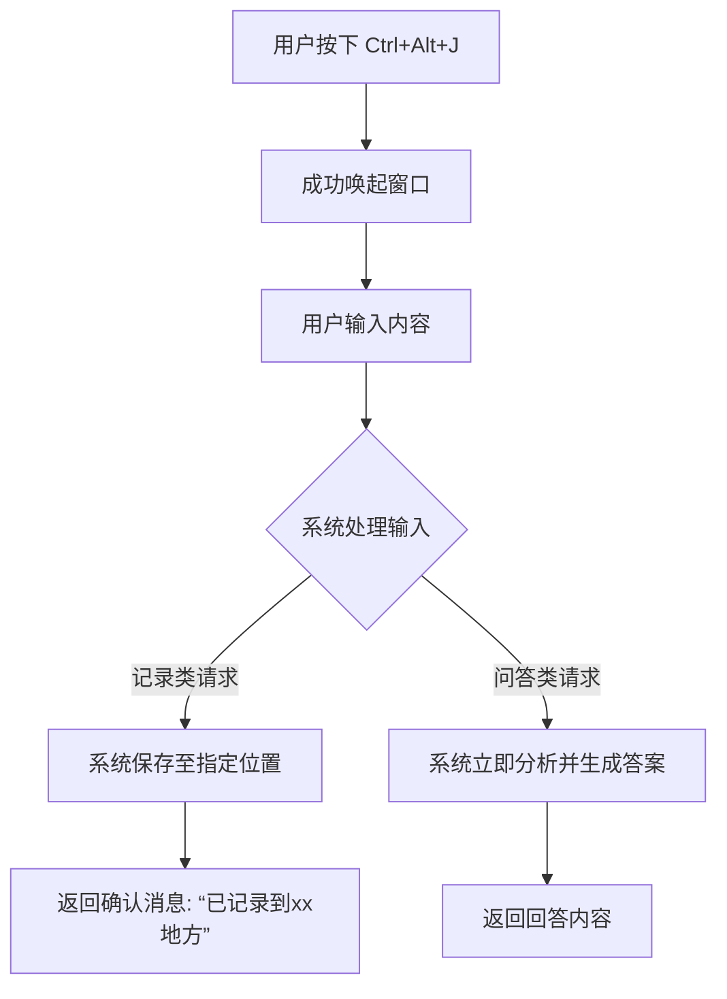

现在我需要开始第一步，提需求：1，ctrl+alt+j 能顺利唤起窗口，但只有输入，然后没有对话，我认为这里输入后，应该有回答的，比如说已记录到xx地方，或者我问到就是一个问题，应该马上就回答我

## 🧠 Auto-Visualized Structure

```mermaid
graph TD
    A[用户按下 Ctrl+Alt+J] --> B[成功唤起窗口]
    B --> C[用户输入内容]
    C --> D{系统处理输入}
    D -->|记录类请求| E[系统保存至指定位置]
    E --> F[返回确认消息: “已记录到xx地方”]
    D -->|问答类请求| G[系统立即分析并生成答案]
    G --> H[返回回答内容]
```
