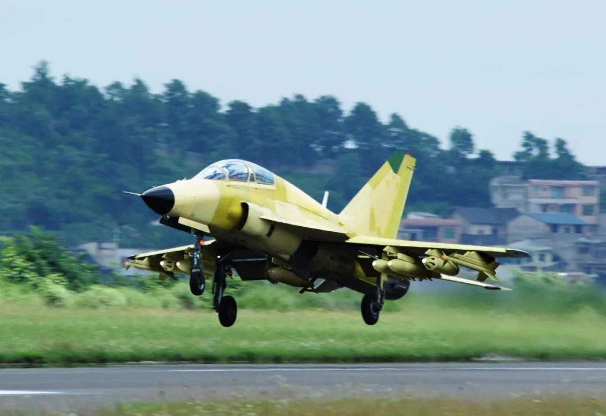

# 1014，成飞贵飞突然合并，真相何在？未来会不会有公司破产？

     

# 1014，成飞贵飞突然合并，真相何在？未来会不会有公司破产？

原创 大水来 [大水来](javascript:void(0);)

**大水来** 

微信号 Great-water-8888

功能介绍 航空技术爱好者，哲学爱好者

_1周前_

收录于话题

昨天大体说了一下分久必合，陕飞和西飞合并之后，贵飞和成飞在本月完成合并，这也是中国航空工业数十年的一个大事，传统的万年老厂开始变了，要抱团做大做强。

贵飞算是中国航空工业主机厂里面比较悲惨的一个，地理偏僻，气候地形恶劣，寒冷潮湿，外加高山阻隔，交通极其不便，经济落后，投资稀少，无法留住人才，更糟糕的是，贵飞原始定位就是给喷气战斗机配套做教练机，最早就是制造歼教七。

教练机这个东西，最早都是洪都的产品，初教六后来是K8，上世纪80年代超音速段就给贵飞的歼教七，就这么一个落后的型号，反复几十年，就这么混，长期不受重视，一直起不来，后来自己想办法，凑钱升级歼教七，最终得到了后来的山鹰教练机，不管怎么整，还是一款落后的2.5代喷气教练机，而中国目前战斗机已经升级到4代，差距巨大。

虽然成飞和贵飞也是同时代的西南地区的三线工程重点单位，但是成飞借助成都的良好地理人才优势，经过努力，迅速发展壮大起来，四川这个天府之国，少不入川，进来就出不去，养人如养猪不是说说着玩的，最近几年成都成为北上广深之后的又一上千万大城市，发展不可限量，而贵飞在安顺，真是度日如年。

加载中…
30 微信豆购买
付费后可赠送给一位朋友免费阅读 (1元 = 7微信豆)

微信扫一扫付费阅读本文

人付费， 人赞赏

预览时标签不可点

收录于话题 #
个
上一篇 下一篇

阅读

分享 收藏
赞 在看

已同步到看一看[写下你的想法](javascript:;)

前往“发现”-“看一看”浏览“朋友在看”

前往看一看

**看一看入口已关闭**
在“设置”-“通用”-“发现页管理”打开“看一看”入口
[我知道了](javascript:;)

已发送

取消

#### 发送到看一看

发送

1014，成飞贵飞突然合并，真相何在？未来会不会有公司破产？

最多200字，当前共字

发送中

喜欢此内容的人还喜欢

微信扫一扫
关注该公众号

可试读8%

1元 = 7微信豆

加载中…
30 微信豆购买

微信扫一扫付费阅读本文

[知道了](javascript:;)

 微信扫一扫
使用小程序

[取消](javascript:void(0);) [允许](javascript:void(0);)

[取消](javascript:void(0);) [允许](javascript:void(0);)

.aria\_hidden\_abs.aria\_hidden\_abs,.aria\_hidden\_abs.weui-hidden\_abs,.weui-hidden\_abs.aria\_hidden\_abs,.weui-hidden\_abs.weui-hidden\_abs{position:absolute;opacity:0;overflow:hidden;left:auto;width:1px;height:1px} ： ， 。 视频 小程序 赞 ，轻点两下取消赞 在看 ，轻点两下取消在看

返回

更多

正在加载

已无更多数据

购买全文
30

支付
[常见问题](javascript:;)

原文链接：<https://mp.weixin.qq.com/s/IfPCVjbZfu8Ga865t84LSA>
