# 一文读懂航空发动机所有知识点

     

# 一文读懂航空发动机所有知识点

[军工投行](javascript:void(0);)

**军工投行** 

微信号 jungongtouhang2020

功能介绍 卓越 担当 效率 信任

_2022-11-23 11:32_ _发表于辽宁_

收录于合集

**目    录**

**一、什么是航空发动机？**

**二、航空发动机有几种类型？**

**三、航空发动机行业格局**

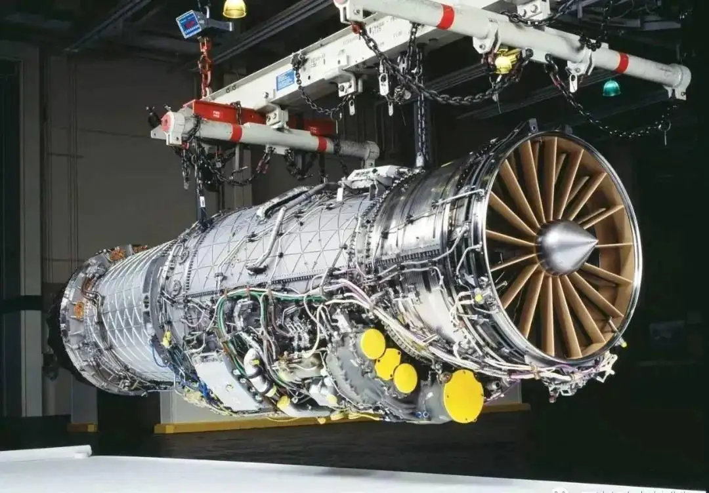

**一**

**什么是航空发动机？**

什么是航空发动机？

简单来说，航空发动机就是**航空器的动力装置**，是航空器的“心脏”。

航空发动机的研制是航空产业链中的核心环节。航空发动机不仅是飞机的动力，也是航空技术发展的动力。

人类在航空领域的每一次重大突破，无不与航空动力技术的进步相关；飞机的需求和发展又促使发动机向更高水平迈进，二者相得益彰。

由于航空发动机需要在高温、高压、高转速和高负载的特殊环境中长期反复工作，其对设计、加工及制造能力都有极高要求，因此具有研制周期长，技术难度大，耗费资金多等特点。

可以说，航空发动机行业的发展水平是一个国家工业基础、科技水平和综合国力的集中体现，也是国家安全和大国地位的重要战略保障。

图：航空发动机特点

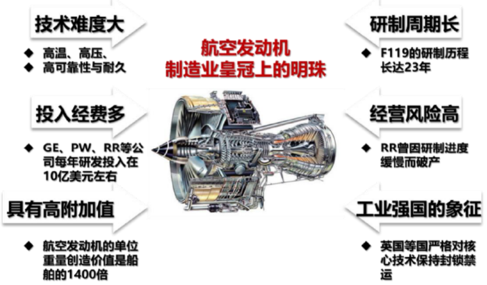

资料来源：招商证券

**二**

**航空发动机有几种类型？**

自1903年问世至今一百多年来，航空发动机经历了两个主要发展时期：

**（1）1903年至1945年，活塞式发动机统治时****期；**

**（2）1945年至今，喷气式发动机时代。**

在喷气式发动机时代，航空上广泛应用的是有压气机空气喷气式发动机。在压气机空气喷气式发动机中，压气机是用燃烧室后的燃气涡轮来驱动，因此这类发动机又称为燃气涡轮发动机。

按燃气发生器出口燃气可用能量利用方式的不同，燃气涡轮发动机分为：涡轮喷气、涡轮风扇、涡轮螺旋桨、涡轮轴发动机。

具体的航空发动机分类图如下：

图：航空发动机分类及用途

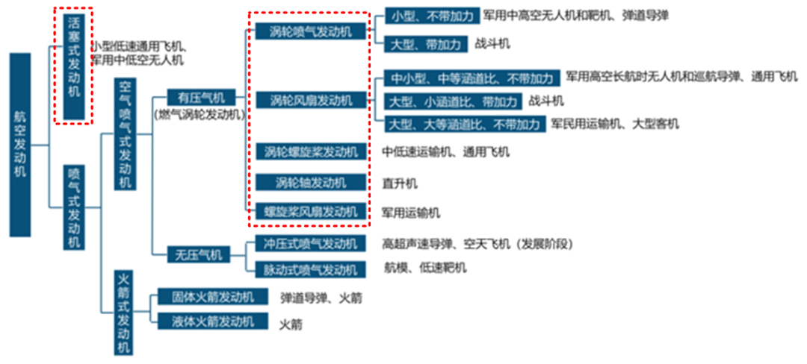

 **_1_** 

**活塞式发动机（低速、通用飞机仍使用）**

活塞式航空发动机是一种往复式内燃机，通过带动螺旋桨高速转动而产生推力。为满足功率要求，活塞发动机一般由多气缸组合构成，多个缸体同时工作带动曲轴和螺旋桨转动以产生足够动力。

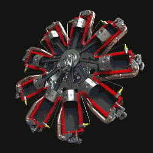

1903-1945 年，活塞式发动机作为飞机的动力装置，占据了统治地位。在两次世界大战的需求牵引下，活塞发动机不断改进完善，得到迅速发展，达到其技术的顶峰。

**战后随着涡轮喷气、涡轮螺桨和涡轮风扇发动机的发展，活塞发动机逐渐退出了大中型飞机领域。**其被取代的主要原因：

①飞行速度限制：活塞发动机外形阻力大，螺旋桨高速旋转时效率低；

②工作原理限制：活塞式发动机中进气、加压、燃烧和排气四个工作阶段是通过活塞在一个气缸的往复运动分时依次进行的，每个汽缸能发出的功率受到工质温度的限制，随着功率增大，活塞发动机汽缸数增多，重量急剧增加，功重比严重降低。

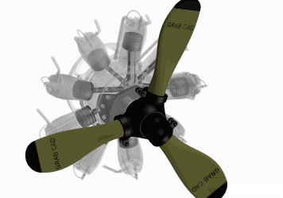

但由于活塞发动机具有效率高、耗油率低和价格低廉等优点，在功率需求小于200 千瓦的小型低速通用飞机上仍有一定优势。

因此在小型公务机、农业飞机、支线和一些小型多用途运输机（森林灭火、搜索、救援和巡逻等），活塞发动机仍被广泛地采用。

 **_2_** 

**燃气涡轮发动机**

**（1）涡轮喷气发动机（已逐步被涡扇发动机取代）**

又称“涡喷发动机”，一般由进气装置、压气机、燃烧室、涡轮以及喷管等部件组成，其中压气机、燃烧室、涡轮组成了发动机的核心机。

涡喷发动机的主要流程都是在核心机中完成，包括空气的压缩、燃烧、涡轮做功等。空气经进气道进入发动机后，首先经过压气机，加压后进入燃烧室，与燃料掺混，点火燃烧，形成高温气体，高温气体膨胀驱动涡轮工作，经过涡轮后的燃气通过喷管排出而产生推力。

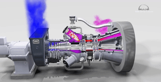

涡喷发动机使航空飞行进入了超声速时代，但涡喷发动机产生推力时会高速喷出燃气，高速高温燃气喷出发动机后直接散溢造成巨大的能量损失，因此涡喷发动机的经济性差、油耗高。

**目前除了尚未退役的部分二代战斗机用涡喷发动机外，大多数已被涡轮风扇发动机所取代，**当前小型涡喷发动机主要应用于中高空无人机、靶机和弹道导弹领域。

图：涡喷发动机工作原理

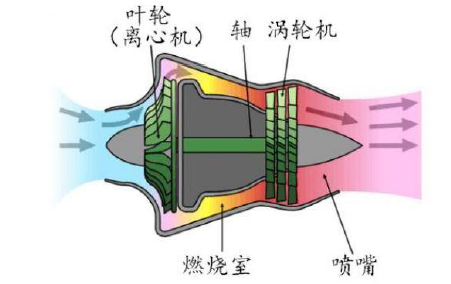

**（2）涡轮风扇发动机（军民用飞机主要动力）**

又称“涡扇发动机”，由涡轮喷气发动机发展而成，在核心机基础增加了风扇和低压涡轮。

风扇转动压缩空气，经压缩的空气分为两股。外股气流平行流动，经喷管直接排出，产生推力；内股气流与普通喷气发动机一样，经过压气机、燃烧室和涡轮之后由喷管排出。

**外股与内股气流的流量之比称涵道比或者流量比。在核心机相同的条件下，由于涡轮风扇发动机总空气流量大，排气速度低，所以与涡轮喷气发动机相比，推力大、推进效率高、耗油率低。**

图：涡扇发动机工作原理

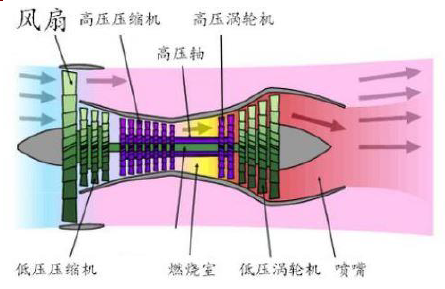

涡扇发动机首先用于民用飞机，随后扩展到军用飞机。20世纪70-80 年代以后涡扇发动机高速发展，开始取代涡喷发动机成为军民用飞机的主要动力，分别向小涵道比的军用加力发动机和大涵道比的军民共用发动机两个方向发展：

**小涵道比加力涡扇发动机兼具亚音速巡航低油耗和超音速机动性的特点，适合作为战斗机动；**

**大涵道比发动机具有耗油率低、噪声小的特点，通常广泛用于大型民用客机、军民用运输机。**

**（3）涡轮螺旋桨发动机（应用于中小型运输机和通用飞机）**

又称“涡桨发动机”，其驱动原理与活塞式发动机基本相同，是以螺旋桨旋转时所产生的力量来作为飞机前进的推进力，结合了涡喷功率大和螺旋桨推进效率高的优点。因其油耗率低，经济性好、起飞推力大，曾得到较为充分的发展。

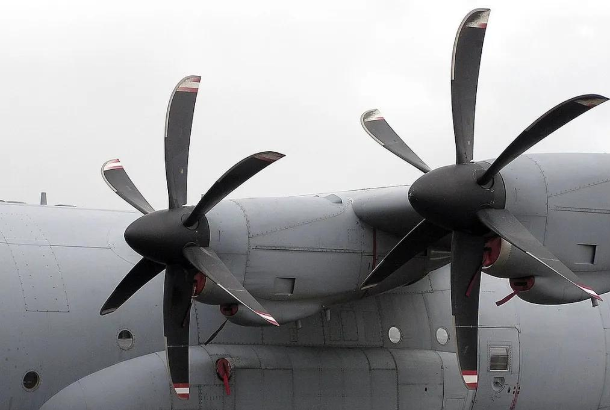

**目前在中小型运输机和通用飞机上仍有广泛用途，但由于速度、功率受限制，在大型远程运输机上，已被涡扇发动机所取代。**

图：涡桨发动机工作原理

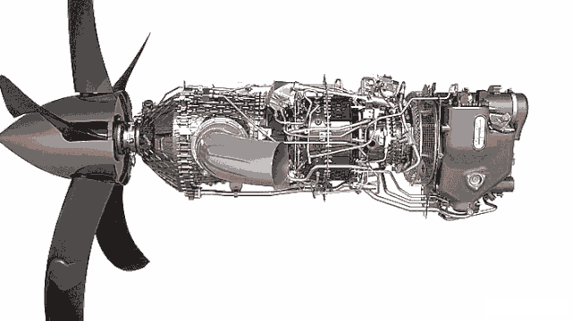

**（4）涡轮轴发动机（直升机唯一动力）**

又称“涡轴发动机”是直升机最主要的动力，其工作原理与涡桨发动机类似，燃气流经驱动压气机的涡轮后，再流经一个驱动减速器的自由涡轮，最后从尾喷管中喷出，减速器的输出轴与传动直升机旋翼的主减速器相连，驱动旋翼的旋转。

涡轴发动机具有功重比高、油耗低等特点。目前，直升机市场上普遍采用的是第三代涡轴发动机，仅少数直升机采用第四代涡轴发动机。

图：涡轴发动机工作原理

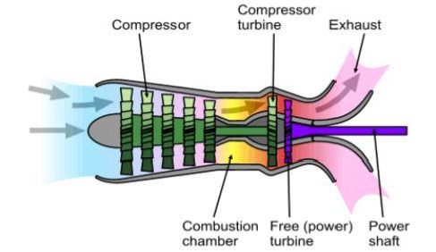

**（5）螺旋桨风扇发动机**

又称“桨扇发动机”，既可看作带先进高速螺旋桨的涡轮螺旋桨发动机，又可看作除去外涵道的超高涵道比涡轮风扇发动机，结合了涡轮螺旋桨发动机耗油率低和涡轮风扇发动机飞行速度高的优点，其有效涵道比为15~20。

由于桨扇发动机噪声、振动及减速器性能差，特别是没有外涵机匣，使用安全性没有保证等问题未能得到很好的解决，桨扇发动机尚未被广泛采用，唯一投入生产的桨扇发动机是用于安-70运输机的D-27发动机。

**三**

**航空发动机行业格局**

 **_1_** 

**全球航空发动机格局**

**（1）军用航空发动机格局**

目前，仅5大常任理事国中的少数企业具备研发生产能力，美国发展最为领先，诞生了如GE、PW等世界航发巨头。

目前具备三代主流航空发动机研制和生产能力的国家主要是美、俄、英、法、中五大常任理事国，乌克兰接收前苏联军事工业遗产也具备一定的发动机研制生产能力，其航空发动机产品主要用于出口。

根据《World AirForces2021》统计数据计算，产自五大常任理事国的军用航空发动机数量占当前世界所有在装军用航发总数的90%以上。

表：全球主要军用机型所使用航空发动机及其生产企业介绍

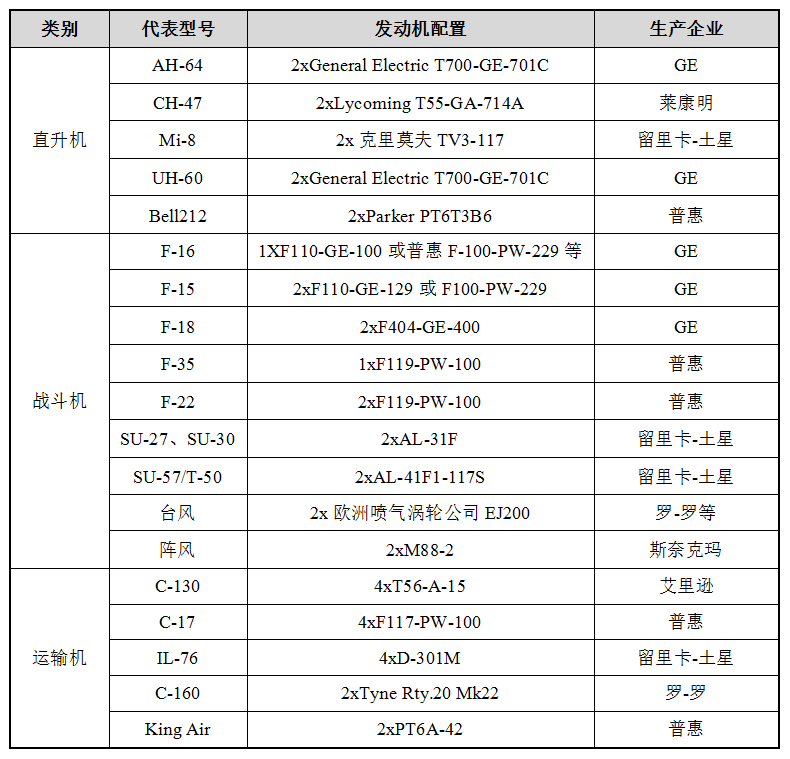

资料来源：前瞻产业研究院

**（2）商用航空发动机格局**

英美两国主导全球商用航发市场。商用航空发动机产业寡头垄断的格局更加明显，目前世界范围内具有技术和商业优势的只有美、英两国；

主导公司是美国通用电气（GE）、美国普惠（PW）、英国罗罗（R&R）三家公司。

根据《Commercial Engines 2021》统计，2020 年全球总共交付 1374 台民用航空发动机，美国 GE、PW、英国 R&R、CFM（美国 GE/法国 SAFRAN 合资公司）四家公司占据 100%的市场份额，呈现出高度寡头垄断特征。

图：2020年全球商用航空发动机市场格局

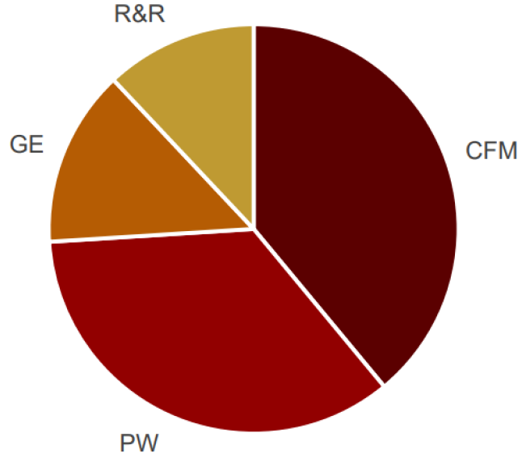

资料来源：《Commercial Engines 2021》

 **_2_** 

**航空发动机国产替代情况**

**（1）军用航空发动机方面**

经过近70年的发展，我国已建立了相对完整的航空发动机研制生产体系，具备了涡桨、涡喷、涡扇、涡轴等多类发动机的系列研制生产能力。

目前我国在役歼击机、强击机、轰炸机、歼击轰炸机等主战飞机已批量使用国产涡扇发动机，仅有部分三代战机仍然装配的是进口发动机。

运输机方面，运-7、运-8等运输机使用的涡桨发动机全部国产化，仅运-20目前装备的仍是进口发动机。

直升机方面，随着直-9、直-8、直-10等整体技术的成熟，我国已经在引进的基础上实现涡轴-8、涡轴-6、涡轴-16发动机的系列化发展。

表：中国军用航空发动机市场布局

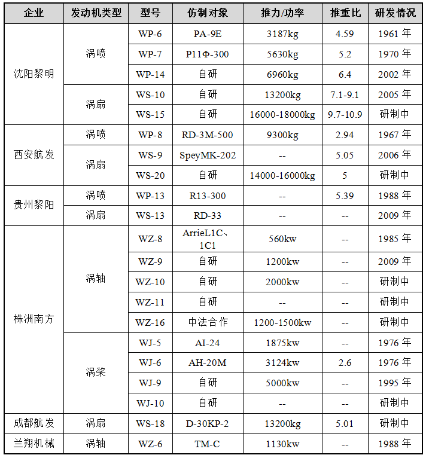

资料来源：前瞻产业研究院

**（2）民用航空发动机方面**

2016年，中国航发商发被确认为 C919 国产发动机供应商；2017 年长江 1000A核心机完成组装；2018年5月，第一次点火启动成功，核心转速达到设计要求，这是长江1000A研制第一个重大突破。

目前，长江系列发动机仍然在研究过程中。相较与成熟的西方航空发动机巨头，目前我国在民用航空涡扇发动机方面还处于空白状态，差距明显，但随着中国航发商发以及CJ1000A的出现，我国将拥有挑战世界最大航空发动机市场，发展国产大飞机及航空发动机产业的重要机遇。

整理：范宏伟

军工投行，立足军工，辐射高端制造

欢迎通过公众号后台留言与我们联系!

欢迎扫码关注↓↓↓↓

**喜欢本篇内容请给我们点个在看**

预览时标签不可点

喜欢此内容的人还喜欢

微信扫一扫
关注该公众号

[知道了](javascript:;)

 微信扫一扫
使用小程序

[取消](javascript:void(0);) [允许](javascript:void(0);)

[取消](javascript:void(0);) [允许](javascript:void(0);)

： ， 。  视频 小程序 赞 ，轻点两下取消赞 在看 ，轻点两下取消在看
原文链接：<https://mp.weixin.qq.com/s/5XzopNWDclDjKqVLLvv67g>
