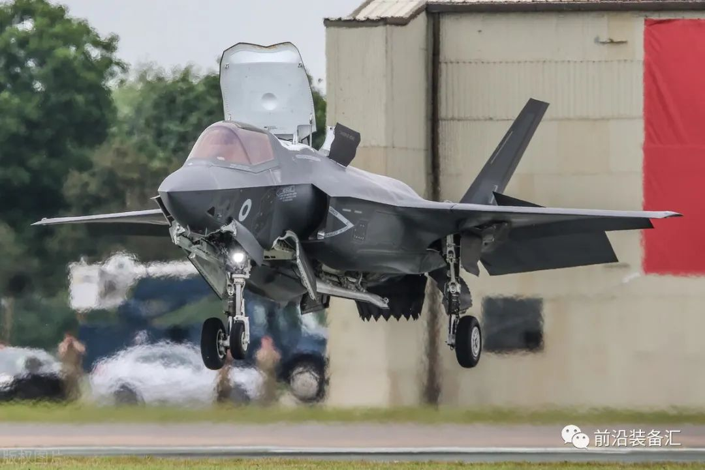
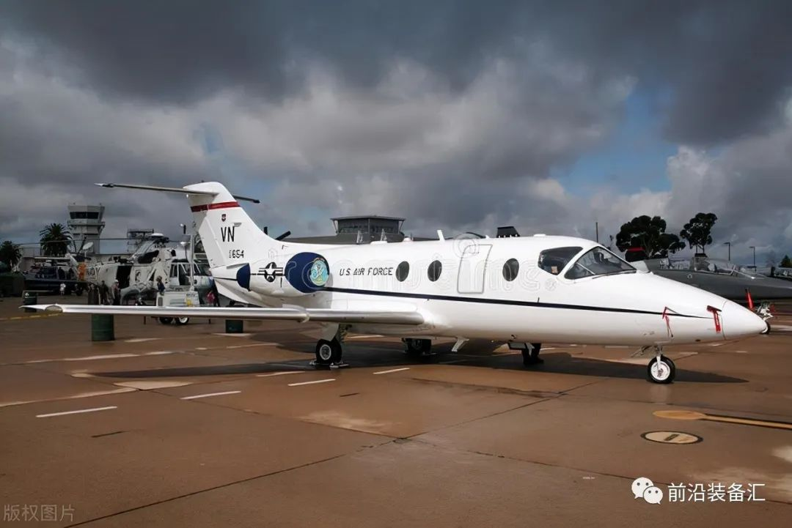
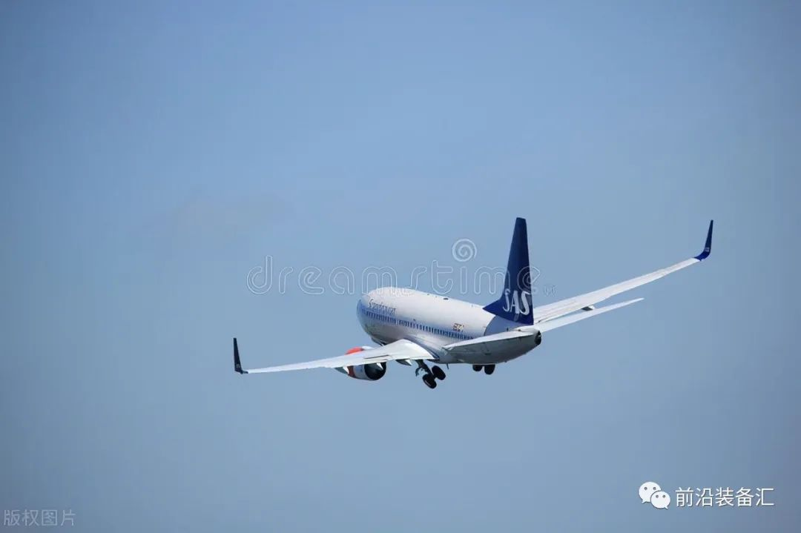
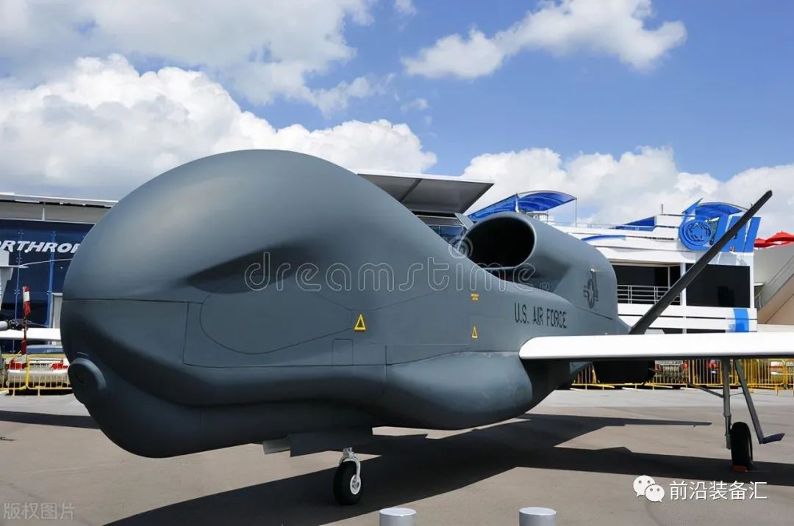
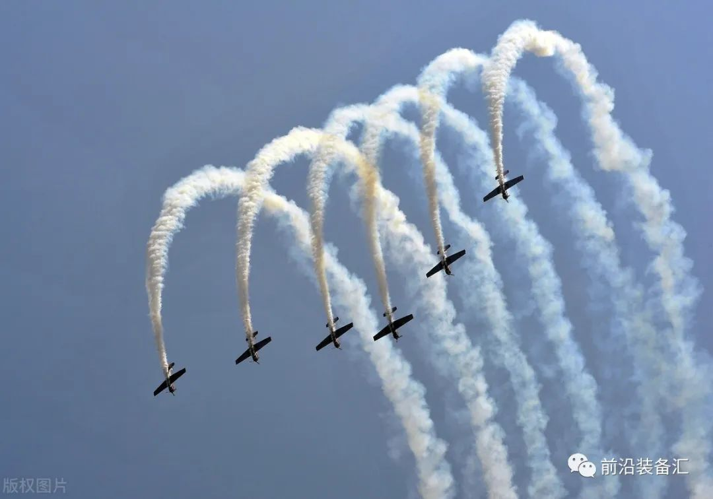
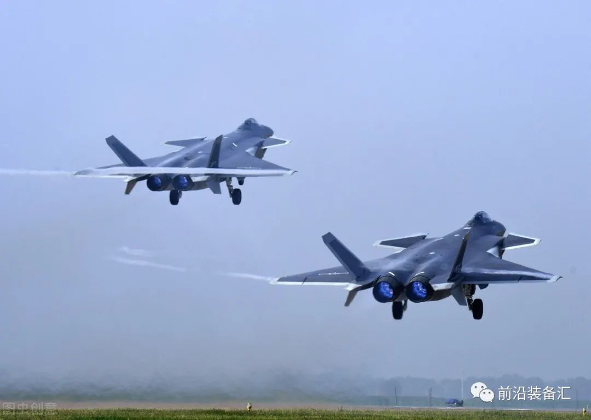
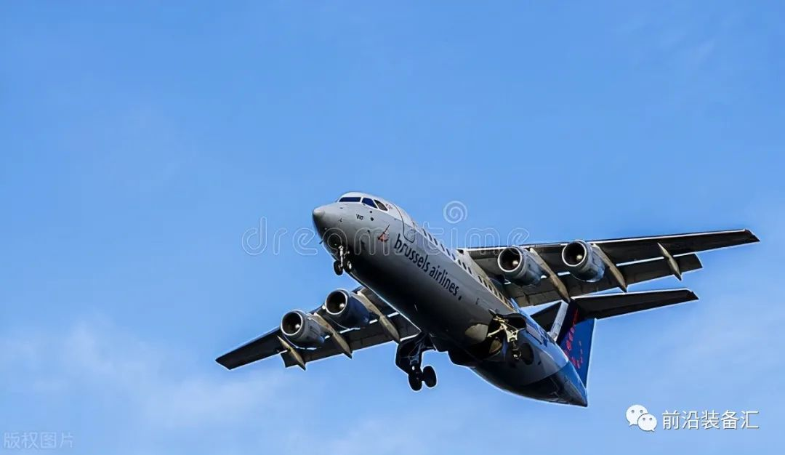
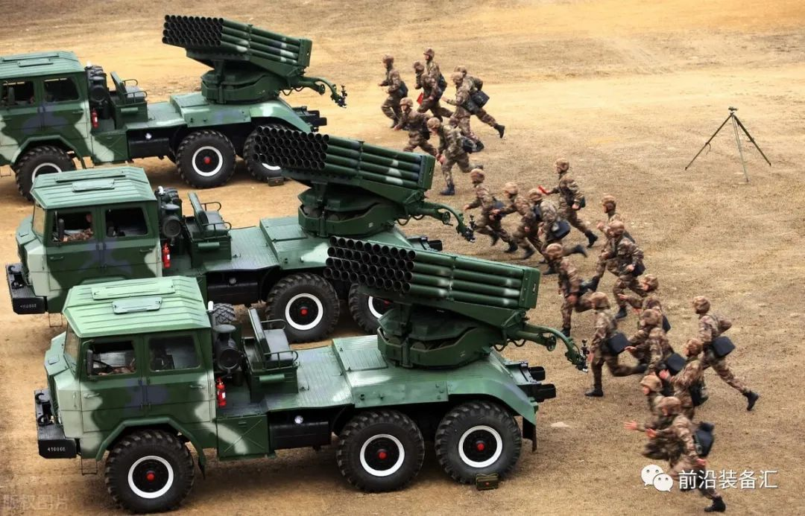
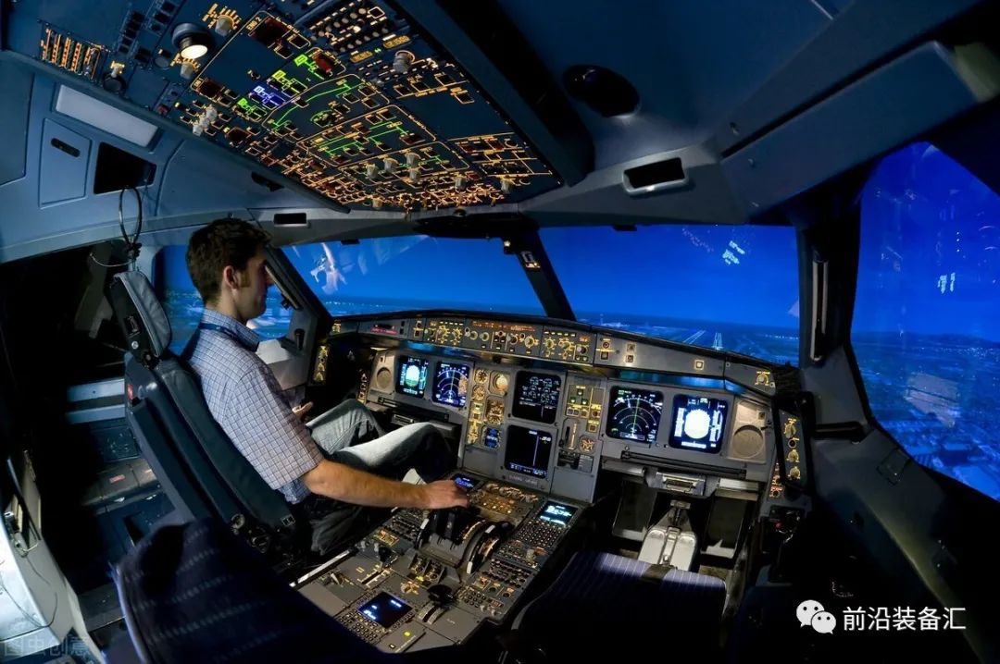
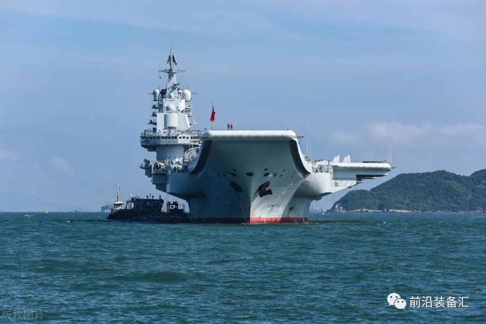

# 世界十大收入最高的军工巨无霸是谁？

     

# 世界十大收入最高的军工巨无霸是谁？

[前沿装备汇](javascript:void(0);)

**前沿装备汇** 

微信号 gh\_8d200d334fa7

功能介绍 聚焦国际前沿技术、科技装备顶层智慧，传递装备热点、发展历程、技术原理，装备功能、现状与趋势分析，观点交流等内容

_2022-11-20 14:39_ _发表于北京_

收录于合集

#武器装备 290 个
#军火商 7 个
#航空发动机 75 个
#航母 39 个
#雷达 8 个

一、洛克希德·马丁（军品收入：625.6亿美元）

所属国籍：美国（洛克希德·马丁公司的总部位于马里兰州蒙哥马利县的贝塞斯达）

全球地位：世界最大的国防承包商。洛克希德·马丁空间系统公司（简称LMT）是一家美国航空航天制造商。瑞典斯德哥尔摩国际和平研究所(SIPRI)之前发布了2015年度全球军工百强企业排行榜，洛克希德·马丁公司再次保持世界第一武器生产商的地位。克希德·马丁曾经宣布，将收购合技术旗下的西科斯基飞机公司(Sikorsky Aircraft)。合并新公司（1995）在航空、航天、电子领域均居世界前列，预计将成为世界上最大的战斗机制造商。在航天方面，它将控制美国全部军用卫星的生产及发射业务；在导弹方面，它是美国洲际导弹的主要制造商。同时，将在战略导弹系统、战略导弹防御系统、战术导弹系统、反坦克导弹及机载电子设备方面拥有优势。洛克希德·马丁控制着世界防务市场40%的份额，五角大楼每年采购预算的1/3都用于支付其订单，它几乎包揽了美国所有军用卫星的生产和发射业务，是名副其实、无可争辩的世界军火“第一巨头”。

主要军品：洛克希德·马丁公司著名的秘密“臭鼬工厂”（SkunkWorks）素以研制隐形飞机和侦察机而闻名，其中包括大名鼎鼎的F-117隐形战斗机，以及美军绝密航空研制计划，比如U-2、SR-71等。洛克希德·马丁主要供应：美国海军所有潜射弹道导弹，战区高空区域防空系统，通信卫星系统，F-16、F-22和F-35等战斗机，U-2侦察机，岸基反潜机P-3系列，C-130系列军用运输机等。。

二、雷神技术（军品收入：420亿美元）

所属国籍：美国（总部设在美国华盛顿哥伦比亚特区）

全球地位：世界上最大的军工承包商之一。全球国防技术运用到商业市场的领先者。美国国防部武器供应商。全球高科技的领先者和国防电子工业的强大企业。处于飞机制造、商用电子及工程和建筑的领先地位。雷神飞机公司(RAC)是世界通用航空业的领导者，在航空工业拥有最广泛的产品。

主要军品：雷神核心业务集中在三个领域：国防和商务电子、商用和特殊使命的飞机以及工程与建筑。在上述领域，美国雷神公司均处于全球领先的地位。雷神公司的空中交通管制系统：包括新一代固态雷达和先进的"Auto Trac"和 "Guardian"自动化系统。雷神飞机公司还提供：特殊任务飞机、飞机维护服务、用于军事用途的飞行靶标和飞机训练系统。曾经为美国空军和海军提供下一代"联合初 级飞行训练系统"(JPATS)教练机。曾研制世界上第一种在实战中拦截弹道导弹的精确制导武器。

雷神工程与建筑公司(RE&C)是世界上最大的工程、建筑、运营和维护企业之一，其业务包括 ：火力与核能发电;石油和天然气;聚合物和化工;制药和生物技术;金属、采矿和轻工业;食品和消费 品;纸浆和造纸等。

在商用电子领域，雷神是海洋电子和微电子技术的领导者。雷神海洋电子公司提供：船用雷达、声波深 度探测器、无线电设备、自动领航装置、探鱼仪、全球卫星定位接收机、以及用于船桥集控、通信系统、 全球卫星定位和回转罗盘的全套解决方案。在微电子领域，雷神擅长：砷化镓单片微波集成电路(MMIC)技术，并正在应用这一技术于全球卫星通信，直播卫星电视接收机、无线本地环绕网络和下一代数字蜂窝电话。

雷神公司研制了新一代导弹并以鸟类命名，比如"云雀"、AIM一7"麻雀"、MIM 一23" 鹰"。美国雷神公司空间与机载系统部的光电专家将帮助美军研究者开发新型基础航空电子设备和车载电子装置用光电传感器，以进行目标识别和跟踪。

雷神公司DARPA战略技术办公室的MIST-LR项目致力于研发远程几何和三维成像技术，以捕获超出接收系统物理孔径衍射极限的目标。项目聚焦于新型传感方式包括计算成像、合成孔径成像、数字全息术、多静态激光雷达、基于光传输分析角分辨成像。雷神公司在雷达(包括AESA)、光电感测器和其它供陆、海、空军事设备使用的先进电子系统是世界领先的研发和制造商，其中包括：F-15鹰式战斗机使用的APG-63和APG-70雷达，F/A-18黄蜂式战斗攻击机使用的APG-65、APG-73和APG-79雷达，F-22猛禽战斗机使用的AN/APG77雷达等等。

**三、波音公司（军品收入：324亿美元）**

所属国籍：美国（总部设于芝加哥）

全球地位：波音公司是全球航空航天业的领袖公司，也是世界上最大的民用和军用飞机制造商之一。美国国家航空航天局的主要服务提供商，波音公司运营着航天飞机和国际空间站。波音公司还提供众多军用和民用航线支持服务，就销售额而言，波音公司是美国最大的出口商之一。

主要军品：波音公司设计并制造旋翼飞机、电子和防御系统、导弹、卫星、发射装置、以及先进的信息和通讯系统。20世纪三十年代中期，波音公司开始研制大型轰炸机，包括在第二次世界大战中赫赫有名的B-17（绰号“空中堡垒”）、B-29轰炸机，以及东西方冷战时期著名的B-47和B-52（绰号“同温层堡垒”）战略轰炸机。其中B-52服役后30多年中一直是美国战略轰炸力量的主力。

美国空军中比较出名KC-135空中加油机以及E-3（绰号“望楼”）预警机也是由波音公司生产。波音制造AH-6“防御者”；波音AH-64“阿帕奇”武装直升机是现美国陆军主力武装直升机；CH-47“支奴干”直升机（Chinook），是一种由美国波音公司研发并制造的多功能、双引擎，双螺旋桨的中型运输直升机。首要任务从部队运输到炮台战场补给。CH-47已经被外销往16个国家， 最大的消费者是美军和英国的皇家空军。V-22鱼鹰式倾转旋翼机是由美国贝尔公司和波音公司联合设计制造，它也是一款中型运输机；B—1是美国研制于70年代的可变后掠翼超音速（M为1.25）战略轰炸机。

美国军方一直认为B－1B是目前世界上威力最强大的战略轰炸机，因为在各国现役的战略轰炸机中，B－1B在航速、航程、有效载荷和爬升性能等各种技术指标都有较大的优势。B－1B是一种远程、多用途、可变后掠翼的重型超音速战略轰炸机，极限时速1320公里（1．25马赫），续航能力为1．2万公里，可从美国本土实现洲际飞行。B－1B被冠以“枪骑兵”。B－1B还具备了一定的隐身性能，B－1B被雷达截获的机身面积仅为1平方米；

波音B-52亚音速远程战略轰炸机是美国波音飞机公司研制的八发动机远程战略轰炸机，用于替换B-36轰炸机执行战略轰炸任务；波音EA-18G“咆哮者”电子攻击机系在美国海军F/A-18E/F“超级大黄蜂”战斗攻击机的基础之上发展研制而成；波音C-17环球霸王III是上个世纪八十年代美国麦克唐纳·道格拉斯公司（现波音）为美国空军研制生产的大型战略战术运输机。

KC-46A是一个民用改型飞机项目，这使波音公司可以将其民机试验经验纳入到加油机项目。KC-46A加油机基于波音767商用飞机，是一种宽体多任务飞机，采用了最新最先进的技术，达到或超过了空军对于燃料、货物、旅客和患者的运输需求指标；KC-135是基于波音367-80型研制的具有更宽机身的空中加油机，而以367-80为基础还曾诞生了波音707客机；KC-135安装飞杆加油系统；美国波音公司被选中建造美国空军下一代喷气式教练机。

**四、诺斯罗普·格鲁曼公司（军品收入：314亿美元）**

所属国籍：美国（总部位于加利福尼亚州圣地亚哥）

全球地位：世界第三大军工生产厂商，世界上最大的雷达制造商和最大的海军船只制造商。美国政府最大的IT服务提供商。实际其是由两家美国老牌军工企业。据瑞典“斯德哥尔摩国际和平研究所”〔SIPRI〕统计，截至2015年，诺·格目前已成为世界第五大军火公司，同时也是美国国防部的几大防务承包商之一。诺格公司旗下影响力最强的要属亨廷顿·英格尔斯工业公司（HII）,是美国内最大的私营造船厂，其不仅是美国唯一的核航母建造厂，也是美国两大核潜艇制造厂之一。

主要军品：诺·格主要为美国和国外的军方、政府和商业客户提供系统同化，防卫电器和信息技术的创新解决方案，其产品涵盖多个领域，从单兵夜视仪、机载相控阵雷达、隐身轰炸机到核动力航母、太空望远镜等悉数包括。诺斯罗普·格鲁曼主要经营方向为导弹与导弹系统。但是其最著名的产品为B-2隐形轰炸机， RQ-4全球鹰无人驾驶飞行器，和F-14雄猫战斗机。其他著名的飞行器类产品有E-8C预警机，T-38教练机，EA-6B徘徊者电子战机，E-2C预警机等。

诺斯罗普·格鲁曼还为美国海军建造航空母舰和很大部分的核潜艇。诺斯罗普·格鲁曼还建造包括破冰船，油轮和货轮在内的各种军用和民用船只；诺斯罗普·格鲁曼还制造卫星，推进系统以及激光系统。它也处理训练和模拟签约。诺·格任务系统部：涉及指挥，控制和情报系统，特别是复杂的资讯收集和档案管理结构，以及提供决策者在复杂环境条件下支援的一独一无二系统。诺·格整合系统部：主要提供美国军方航太与国防的情报、监视、侦察和电子战等相关支援。空间技术部主要涉及卫星、高能雷射和战略防御计划系统。

五、通用动力公司（军品收入：298亿美元）

所属国籍：美国（总部在弗吉尼亚州福尔斯彻奇市郊）

全球地位：世界第六大国防工业承包商。通用动力是一家美国国防企业集团。在《福布斯》杂志评选的全球2000大企业中，通用动力由超过EADS和BAE系统公司，成为全球第3大航空与国防类企业，仅次于波音和洛克希德·马丁公司。

主要军品：通用动力产业分为四大领域，一是航海设备，主要是制造军舰和核潜艇；二是航空领域，包括商用飞机和战斗机；三是信息系统和技术部门；四是攻击性武器的制造。通用动力其研发的F-16战斗机，是西方国家产量最大的战斗机。

通用动力为美国海军和商用 船只设计、建造、和支持潜艇和水面舰艇;提供核动 力潜艇，水面舰艇;辅助和战斗物流船舶，商业船只，工程设计支持和检修，维修，技术支持和服务。通用动力为美国军队和它的 盟国提供轮式装甲战斗和战术车辆；履带式主战坦克和步兵战斗车，弹药和爆炸物，移动桥系统；被动，主动反应装甲，化学，生物和爆炸物探 测系统，工程传动部件和售后零件及复合产品。值得一提的是，F-111是美国通用动力公司研制的超音速战斗轰炸机，也是世界上第一种实用型变后掠翼飞机。

**六、中国航空工业集团（军品收入：254.7亿美元）**

所属国籍：中国

全球地位：中国航空工业集团公司曾入选美国《财富》杂志世界500强企业，成为首家入选的中国军工企业。中国航空工业集团公司曾经连续第八次入围《财富》世界500强企业；中国大陆创新企业百强榜单"中位列梯级Ⅰ；进入瑞典斯德哥尔摩国际和平研究所(SIPRI)全球军工百强企业排行榜。

主要军品：中国航空工业集团公司系列发展：歼击机、歼击轰炸机、轰炸机、运输机、教练机、侦察机、直升机、强击机、通用飞机、无人机等飞行器，全面研发涡桨、涡轴、涡喷、涡扇等系列发动机和空空、空面、地空导弹，强力塑造歼-10、飞豹、枭龙、猎鹰、山鹰等飞机品牌和太行、秦岭、昆仑等发动机品牌，提供先进航空武器装备 。

曾经研制生产新舟60、新舟600、新舟700系列涡桨支线飞机，运-8飞机、运-12飞机，直-9直升机等多种机型，是ARJ21新支线客机的主要研制者和供应商，是大飞机重大专项的主力军。曾研制新中国生产的第一架飞机----南昌飞机厂试制的初教-5(雅克-18)教练机；中国第一架喷气式飞机歼-5(米格-17)由沈阳飞机厂试制成功，中国航空工业集团公司曾制造的第一种重型运输机--运-20等等。

**七、BAE系统（军品收入：235亿美元**

所属国籍：英国（UK）

全球地位：世界100家最大军品公司中居第三位（2000年）。世界100家最大军品公司中居第一位（2001年）。是英国最大、同时也是西欧最大的航空制造企业。也是美国国防部的几大军火承包商之一。曾是西欧历史最悠久、同是也是规模最大的飞机制造企业。曾制造过二战著名的“喷火”战机的维克斯-阿姆斯特朗公司就于1960年并入了BAE系统。

主要军品：BAE系统公司其产品范围已涵盖海陆空三栖武器系统，其中在战机、坦克等地面武器以及核潜艇、航母研发和建造领域占有领先优势。主要有9个领域：飞机、军用和民用固定翼飞机、军用电子、反潜武器(ASW)、C3Ⅰ系统、导弹、军械系统、空间系统以及系统集成。值得一提的是，BAE旗下最著名的军机产品代表之一无疑是“鹞”式系列短垂战机；英国第一种能飞至2马赫级的超音速战斗机，“闪电”也是BAC旗下的代表作之一。该系列战机从1959年12月投入英国皇家空军服役，直到1988年才退役，守护不列颠领空长达20多年，其中包括冷战对抗最激烈的巅峰时期。作为英国唯一的战略核威慑力量，前卫级战略核潜艇也出自BAES旗下。

**八、中国兵器工业集团（军品收入：152.5亿美元）**

所属国籍：中国

全球地位：中国兵器工业集团公司进入《财富》世界500强；中国兵器工业集团公司曾获国资委2016年度经营业绩考核A级；中国兵器工业集团公司是中国两大武器装备制造企业之一(另一家是中国兵器装备集团公司)

主要军品：中国兵器工业集团公司面向陆、海、空、天以及各军兵种研发生产精确打击、两栖突击、远程压制、 防空反导、信息夜视、高效毁伤等高新技术武器装备，在中国的国防现代化建设中发挥着基础性、战略性作用。中国兵器工业集团公司的主营业务包括：国有资产投资及经营管理；坦克装甲车辆、火炮、火箭炮、火箭弹、导弹、炮弹、枪弹、炸弹、航空炸弹、深水炸弹、引信、火工品、火炸药、推进剂、战斗部、火控指挥设备、单兵武器、夜视器材、光学产品、电子与光电子产品、工程爆破与防化器材及模拟训练器材、民用枪支弹药、机械、车辆、仪器仪表等。

中国兵器工业集团公司集团公司承担了多个国家重点项目，研制了一批具有国际水平的高科技武器装备近，大幅度提升了动力传动、红外夜视、惯导、火炸药、引信火工品、特种材料等国防关键基础技术的研制能力和水平，初步实现了平台轻量化、打击远程化、弹药制导化、毁伤高效化、红外夜视产业化。值得一提的是，兵器工业在远程压制、两栖突击等多个领域一举跨入了世界先进行列。

**九、L3哈里斯技术公司（军品收入：149.4亿美元）**

所属国籍：美国（总部设在佛罗里达州墨尔本市）

全球地位：美国第六大国防公司。美国国防通讯科技行业两大巨头--哈里斯公司和L3技术公司同意通过全股权对等合并方式成立一家名为L3·哈里斯技术(L3 HarrisTechnologies)公司的企业，其中哈里斯公司原股东持有约54%的股份，L3技术公司原股东持有约46%的股份。哈里斯公司（Harris Corporation）曾经是一家美国通讯公司，国防承包商和信息技术服务供应商。公司制造无线设备，无线电，电子系统，夜视设备，以及为美国政府，国防和商业部门提供地面和星载天线。哈里斯公司是美国佛罗里达布里瓦德县最大的私营雇主，公司被国防新闻评为百强联邦承包商之一。

主要军品：L3技术及哈里斯技术合并后的新公司目标主要包括:建立规模优势和成本竞争力，提供涵盖海、陆、空、太空和网络等多个领域的“端对端”(end-to-end)解决方案，将加强在射频和频谱技术领域的领导地位，建立全球领先的平台供应商和集成商；加强科研投资力度，合并前两家企业均为技术导向型企业，新公司将继续加大对特定技术的追加投资，以稳固在包括国家安全在内的关键战略领域的全球领先地位；实现利润和持有资金等预期目标，至2020年，新公司持有资金有望达30亿美元。

L3哈里斯技术公司（L3）曾经宣布，将率先带领团队升级美国空军（USAF）使用的飞机训练模拟器。该团队包括CAE美国公司、CymSTAR公司、戴尔技术和Leidos公司，这些公司将协助美国空军制定训练模拟器设计和操作的通用标准。这将是美国空军模拟器共同架构要求和标准（SCARS）计划的一部分。

美国L3哈里斯技术公司曾获得美国海军一份价值1470万美元的订单，为美国海军水面舰艇提供商用宽带卫星计划（CBSP）单元级变体（ULV）硬件生产单元。

该系统为商用高带宽卫星通信提供终端到岸及终端到空间和地面的连接，以增加商用卫星通信的吞吐量，并为军用卫星通信提供冗余。该系统通过在军用和商用卫星的X和Ku频段工作，为小型海军水面舰艇和支援舰艇提供快速数据通信。该系统可屏蔽射频干扰，并结合了用于静态操作的MD-1366增强型带宽高效调制解调器和用于动态操作的SLM-565A dSCP调制解调器，可通过局域网和基于个人电脑的图形用户界面实现所有的控制。

十、中国船舶集团（军品收入：133.8亿美元）

所属国籍：中国

全球地位：中国船舶集团有限公司将成为全球最大的造船集团。拥有科研院所、企业单位和上市公司147家，资产总额7900亿元，职工31万人。拥有中国最大的造修船基地和最完整的船舶及配套产品研发能力，能够设计建造符合全球船级社规范、满足国际通用技术标准和安全公约要求的船舶海工装备。中船集团的规划是：在经济规模、科技水平、管理水平、人才队伍和盈利能力五方面达到世界领先，并成为世界第一造船集团。2019年11月26日，经国务院批准原中国船舶工业集团有限公司与中国船舶重工集团有限公司正式合并，组建中国船舶集团有限公司（简称“中国船舶集团”）。重组后的中国船舶集团，作为国家造船工业的中坚力量以及世界最大的船舶企业。

主要军品：中国船舶集团有限公司将成为海军武器装备科研、设计、生产、试验、保障的主体力量，承担以航母、核潜艇为代表的我国海军全部主战装备科研生产任务，为海军转型发展提供有力支撑。同时，作为船舶工业发展的国家队，中国船舶集团有限公司将在大型邮轮、液化天然气运输船、超大型集装箱船等世界级海洋装备领域不断发展，引领我国由世界第一造船大国走向造船强国。之前中国船舶重工集团有限公司曾创建中国最强最大、国际一流船舶集团，成为中国海军装备最强最大的供应商，成为中国造船业的主导力量

**出处：前沿装备汇编辑整理**

来源|‍**前沿装备汇编辑整理**

**全文完。感谢您的耐心阅读，请顺手点个"在看"吧~**

**免责声明：**本文根据转自网络。文章内容系原作者个人观点，本公众号转载仅为分享、传达不同观点，如有侵权或任何异议，欢迎联系我们删除！

**前沿装备汇精彩回顾**

[**重磅消息！军工保密三级资格取消！**](http://mp.weixin.qq.com/s?__biz=Mzg5NzU3NzcxNA==&mid=2247484457&idx=1&sn=82bdd35541fdec989d0cb6999080172c&chksm=c06ee3b4f7196aa24bbbdc9ad034ce63bec75878b0bccc7681ade217cbcb620622d46c3e6307&scene=21#wechat_redirect)

[**中国十大最顶尖军工集团**](http://mp.weixin.qq.com/s?__biz=Mzg5NzU3NzcxNA==&mid=2247488162&idx=1&sn=aa513e11b8fb9f3f666651a8e00a2814&chksm=c06ef53ff7197c29add2c4d5d6bc6be3fc1f513193a3c56769952ecb3a4e3e80587ebf69a4bc&scene=21#wechat_redirect)

[**全球十大新材料顶尖巨头**](http://mp.weixin.qq.com/s?__biz=Mzg5NzU3NzcxNA==&mid=2247488056&idx=1&sn=18730a35b73f47281f57c770e7ab4e9c&chksm=c06ef5a5f7197cb3042393fbb1d31795bf0ab58321f7bf2669736bcd4e794082b0bdb3b4b84a&scene=21#wechat_redirect)

[**全球十大最尖端的数控加工中心**](http://mp.weixin.qq.com/s?__biz=Mzg5NzU3NzcxNA==&mid=2247488040&idx=1&sn=11b823602b65dba413d9df32448dcbb3&chksm=c06ef5b5f7197ca311100da09b047cd8d0eb5c609dc2b7401f1023784643cfe654f5432461ab&scene=21#wechat_redirect)

[**盘点：最新军工资质相关变化汇总**](http://mp.weixin.qq.com/s?__biz=Mzg5NzU3NzcxNA==&mid=2247487943&idx=1&sn=34ae141fdf08def1f0a5994db1ec7fb5&chksm=c06ef65af7197f4c853c491f665b04521947af9b12d4cb8c77f7ddff7c2dc15d7eccc15569d2&scene=21#wechat_redirect)

[**捕捉军工黄金赛道：三大主线、十大产业**](http://mp.weixin.qq.com/s?__biz=Mzg5NzU3NzcxNA==&mid=2247486110&idx=1&sn=02ca3186af74ae4caa924924fc28e3fe&chksm=c06eed03f7196415d22d48ecbac64efb3d9c9b735c145826466308e36f0afce46bcd5a9d371a&scene=21#wechat_redirect)

[**谈军代表与装备技术状态管理监督**](http://mp.weixin.qq.com/s?__biz=Mzg5NzU3NzcxNA==&mid=2247486162&idx=1&sn=2097b8bc200be3f16e05d958c9f25054&chksm=c06eed4ff719645913b6b8907b7c6818b3e2a2e76ee379878ef8aa289a9a46b56f2728133aab&scene=21#wechat_redirect)

[**2021年军工行业：需求之变**](http://mp.weixin.qq.com/s?__biz=Mzg5NzU3NzcxNA==&mid=2247486065&idx=1&sn=9fc739091e28fac52c9e8ea9c9d730f3&chksm=c06eedecf71964fa2618f3738400d4dc2677c1c8647c00b793d148bb904eb78a0371e86d8364&scene=21#wechat_redirect)

[**军工“十四五”利好不断，一文看尽军工产业链**](http://mp.weixin.qq.com/s?__biz=Mzg5NzU3NzcxNA==&mid=2247486152&idx=1&sn=69720628de5571da07a4064a1e3dead1&chksm=c06eed55f7196443ff4fe8e8d25de7160f84a0ad4096e3a2949208ea4d90b1569fc13c3d7f2b&scene=21#wechat_redirect)

[**陆海空天一体化信息网络发展研究**](http://mp.weixin.qq.com/s?__biz=Mzg5NzU3NzcxNA==&mid=2247484434&idx=1&sn=c64b082b7bb604093d390218bc782026&chksm=c06ee38ff7196a99d21d5843feadb27d6ea9a9a08c9ab58338cc0ccb9ad119dcbfd42e745235&scene=21#wechat_redirect)

[**中美半导体全产业链实力对比（附中国和美国晶圆厂完整清单）**](http://mp.weixin.qq.com/s?__biz=Mzg5NzU3NzcxNA==&mid=2247484397&idx=1&sn=e93a12ad752399222837d1e669340d40&chksm=c06ee470f7196d66877e470f705c505af21d9c5f3a94b967d28ce71487e46b286000560d7b0f&scene=21#wechat_redirect)

[**集群无人机探测及对抗措施综述**](http://mp.weixin.qq.com/s?__biz=Mzg5NzU3NzcxNA==&mid=2247484351&idx=1&sn=4a008327be10d2ab076e84162c5f23f5&chksm=c06ee422f7196d34ae04882f32b35a7719a8bad76e925c876f4365e94d13cf55c813906d57ab&scene=21#wechat_redirect)

[**世界首次巡飞弹集群实战，以军战果惊人**](http://mp.weixin.qq.com/s?__biz=Mzg5NzU3NzcxNA==&mid=2247484966&idx=2&sn=0640ac397cee2566d541a8da687d4f18&chksm=c06ee1bbf71968ad02cc136316538b1a6d4b55835002e1f535752fc0ea0c25b42c7eebc8b682&scene=21#wechat_redirect)

[**未来智能化条件下作战需要经历四个发展阶段**](http://mp.weixin.qq.com/s?__biz=Mzg5NzU3NzcxNA==&mid=2247484928&idx=1&sn=edbffbd16f37d4a72a575937c099ae56&chksm=c06ee19df719688bbc07eac9fb3484c823d34e411c3128cc816e27a3689dfa05a0ede85964a6&scene=21#wechat_redirect)

[**临近空间防御作战拦截弹制导与控制关键技术综述**](http://mp.weixin.qq.com/s?__biz=Mzg5NzU3NzcxNA==&mid=2247484928&idx=2&sn=26c73458b07ded7a9a2ffeeb3c727b0a&chksm=c06ee19df719688b8ad8909b8656180a635f5be52274cf65095a6ddfba79058776c839c8d721&scene=21#wechat_redirect)

[**自主型地面无人战斗系统的发展方向**](http://mp.weixin.qq.com/s?__biz=Mzg5NzU3NzcxNA==&mid=2247484905&idx=1&sn=aacb1f39fde369022d90ee7d9148f29b&chksm=c06ee274f7196b6225e386c79cffa13793569fd9a5354b672f08367fb81fb3ddca76d56aa88f&scene=21#wechat_redirect)

[**空空导弹技术未来发展方向展望**](http://mp.weixin.qq.com/s?__biz=Mzg5NzU3NzcxNA==&mid=2247484905&idx=2&sn=db99003abb6e3ceeeeca30bf701935e4&chksm=c06ee274f7196b625284acc07185c010d02b477b42f0cbd3630ec3975d5b89d58652872d73b6&scene=21#wechat_redirect)

[**未来军事战争中的十大新概念武器排行榜**](http://mp.weixin.qq.com/s?__biz=Mzg5NzU3NzcxNA==&mid=2247484866&idx=1&sn=6bfebfc077d9a801cb77f57b12562e06&chksm=c06ee25ff7196b4960d58ab35b4e43931193204c3b5aa941e6cdcc56daba1efb38265f083740&scene=21#wechat_redirect)

[**96家！中央企业最新名录来了**](http://mp.weixin.qq.com/s?__biz=Mzg5NzU3NzcxNA==&mid=2247484849&idx=2&sn=c8e5d97a8ca41cb2885ef402c75652e0&chksm=c06ee22cf7196b3ab0ab1837343a1f0c531117756e2cc634260c473b03ba0e0a096c2f92db23&scene=21#wechat_redirect)

**[海军无人作战力量作战能力构成研究](http://mp.weixin.qq.com/s?__biz=Mzg5NzU3NzcxNA==&mid=2247484787&idx=2&sn=97e87c890a7ce098526a34c8a4728e83&chksm=c06ee2eef7196bf8d0e47247d8df91917c8d052190fe3456f59ca94b8b05b78f504ca93919f8&scene=21#wechat_redirect)**

**精彩内容长按二维码即可**关注****

**前沿装备汇                                    材料圈**

预览时标签不可点

收录于合集 #武器装备
 290个
下一篇《微型无人机电池技术及应用》需求公告

喜欢此内容的人还喜欢

微信扫一扫
关注该公众号

[知道了](javascript:;)

 微信扫一扫
使用小程序

[取消](javascript:void(0);) [允许](javascript:void(0);)

[取消](javascript:void(0);) [允许](javascript:void(0);)

： ， 。  视频 小程序 赞 ，轻点两下取消赞 在看 ，轻点两下取消在看

该账号因违规无法跳转

原文链接：<https://mp.weixin.qq.com/s/rMkxsdH12lLIKCsXWYxubQ>
