# 中国军机发展史

     

# 中国军机发展史

[前沿装备汇](javascript:void(0);)

**前沿装备汇** 

微信号 gh\_8d200d334fa7

功能介绍 聚焦国际前沿技术、科技装备顶层智慧，传递装备热点、发展历程、技术原理，装备功能、现状与趋势分析，观点交流等内容

_2022-08-07 15:54_ _发表于广东_

收录于合集

#战斗机 42 个
#军工企业 46 个
#军用飞机 4 个
#导弹 47 个
#武器装备 185 个

**中国军机发展史**

中国军用航空制造产业自初教-5于1954年首飞以来已发展六十余年，目前已具备军用全机种与最新代次的生产能力，并成为继美国后第二个同时独立研制五代机的国家。

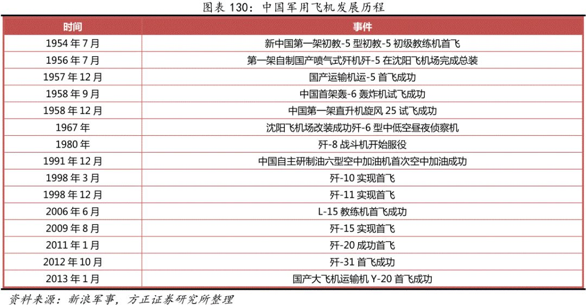

**中国生产的第一种喷气式飞机：歼-5**

歼-5仿制自前苏联的MIG-17，北约代号同为"Fresco"（壁画），是一种单座单发机头进气的后掠式中单翼高亚音速喷气战斗机，使用一台涡喷-5离心式加力涡轮喷气发动机。歼-5主要用于昼间截击和空战，也具有一定的对地攻击能力。其改进型歼-5甲机头装有雷达，主要用于夜间截击空战。歼-5由中国沈阳飞机公司制造，是我国制造的第一种喷气式飞机。其改进型歼-5甲由成飞生产。

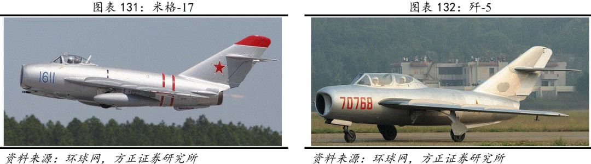

**※ 研制历程**

新中国建国后，迅速开始了仿制生产喷气式战斗机的工作。中苏政府于1951年10月正式签订了《苏维埃社会主义共和国联盟给予中华人民共和国在组织修理飞机、发动机及组织飞机厂方面以技术援助的协定》。同年4月18日重工业部设立航空工业局，统一负责飞机的维修工作。

1951年12月，国家决定要在3到5年的时间里试制成功苏制雅克-18初级教练机以及米格-15。后歼击机项目改为试制更加先进的米格-17喷气式歼击机。1953年11月25日，苏联政府同意向中国移交米格-17Φ歼击机的制造许可证。与此同时，二机部四局正式向112厂下达了试制米格-17Φ歼击机的命令，并要求于1956年10月1日前试制出第一架喷气式飞机。112厂选派考察组前往苏联共青城126厂对米格-17的生产进行考察学习。由于苏联所有型号的米格-17飞机都已停产，生产线上生产的是米格-19飞机，并开始向超两倍音速的米格-21飞机过渡进行前期生产准备。经与苏方协商，考察组改为通过米格-19飞机的生产线，了解和掌握喷气式飞机研制的全过程。1954年10月，沈阳飞机制造公司接受了飞机试制任务，工厂命名为“东风101”。1955年4月，前苏联提供的米格-17Φ飞机成套技术资料和图纸到齐，工厂立即组织翻译和绘图，同年9月开始制造飞机。至1956年2月，整个飞机的14719种253550个零件全部制造完毕。

根据引进试制计划，整个试制过程分为四个阶段：即第一阶段是用苏联提供的部件装配飞机；第二阶段是用苏联提供的组合件装配飞机；第三阶段是用苏联提供的零件装配成组合件，再装配成部件，最后再装配成飞机；第四阶段是用自制零件装配成组合件，再装配成部件，直至总装成国产飞机。为了缩短试制周期，根据苏联专家的建议，工厂采用了四个阶段平行交叉作业的快速试制方法。实践表明，四个阶段平行交叉作业法的确很成功。仅用不到一年的时间，就完成了需要几年的试制周期。

1956年7月19日，飞机进行跃升、俯冲、盘旋、通场等预定的试飞科目，中国第一架喷气式战斗机首飞成功。1956年9月8日，国家验收委员会在112厂举行了验收签字仪式，工厂曾称之为“东风”101歼击机，代号44号机；空军并把该型飞机命名为“56式”飞机（后在全国飞机统一编号时改称为歼-5飞机），同时批准成批生产。

**※ 结构特点**

歼-5采用单座、单发、机头进气、后掠式中单翼布局，机翼后掠角45°，为双梁结构。机翼内侧有角度可控的后退式襟翼，副翼偏转角范围为±18°。尾翼垂直尾翼分成上下两段，下段固定在后机身的承力斜框上，上段可拆卸。垂直尾翼后缘是方向舵，转动角度为25°，水平尾翼后掠角为45°，安装在垂直尾翼下段顶部，其后缘的升降舵，向上可转动32°，向下为16°。机身全金属半硬壳式构造，外形为圆形截面的流线体。机身后部装有可操纵的减速板。

**※ 使用情况**

歼-5飞机于1955年初投入试制，1956年7月13日完成总装，7月19日首飞成功，9月投入批生产。随即，歼-5飞机正式列编，装备空军、海军航空兵。歼-5总共生产1994架。其中，歼-5飞机67架，歼-5甲124架，歼教-5教练机1087架，歼侦-5侦察校射飞机16架。

**中国自主生产第一代超音速战机：歼-6**

歼-6，仿制自前苏联的MIG-19，北约代号同为"Farmer"（农夫）。歼-6战机为中国自主生产第一代超音速战机，1964年首架交付使用，1986年停产，2010年6月12日，国产歼6飞机正式退出空军编制序列。歼-6是中国人民解放军空军于1960至1970年代的主力，也是中国航空工业生产装备数量最多的机型，自用生产了逾4500架，远超过该型飞机于苏联的数量，该机同时出口到了许多国家。

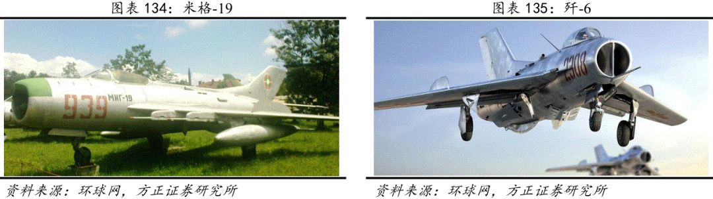

**※ 研制历程**

1953年5月25日，美国空军YF-100在首次试飞中成功突破音障。次年1月5日，苏联第一代超音速战斗机米格-19的直系祖先SM-9/1原型机首飞成功。从此，各国空军开始纷纷向超音速时代迈进。而当时的中国空军，主力仍然是朝鲜战争后期换装的米格-15比斯。在超音速时代，这种亚音速战斗机的性能已显得落后，即使是进一步改进的米格-17仍不足以满足空军的需要。特别是在驻台湾的美国第13航空队换装F-100后，对我夺取闽浙地区的战区制空权构成了极大威胁——1958年金门炮战期间，其司令穆尔曼就声称：美国部署在台湾的飞机，“如果接到命令，可以用来跟中国共产党的飞机战斗”。

对于中国空军来说，跨入超音速门槛的唯一希望在于苏联。在当时而言，只有苏联能够向我们提供超音速战斗机。因此大陆相关部门一直在关注苏联超音速战斗机的进展：1955年3月，苏联米格-19才装备部队；1956年6月二机部和四局就计划开展米格-19喷气式超音速歼击机及其发动机的仿制，并且进行了一些生产准备工作。有资料称，由于条件不完全具备，准备工作没有进行下去。

1957年赫鲁晓夫为了求得中共的支持，在向中国转让军事技术方面作了重大让步。1957年9月，中国政府代表团去苏联谈判转让军工产品制造问题。10月中苏两国签定协议，由苏联向中国出售米格-19飞机的制造技术，并提供全套技术资料、样机和部分散装件、成品附件。在签署许可生产协议的时候，中国选择米格-19P作为仿制型号，购买了该型飞机和发动机的整套图纸，并定点在沈阳飞机制造厂、沈阳黎明发动机厂生产。按照1957年协议，苏联于1958年上半年陆续将米格-19P的图纸发到沈阳飞机制造厂和黎阳发动机厂。当年8月仿制前期准备基本完成，遂正式开始仿制工作。仿制的米格-19P在国内被称作东风103，这是当时国内航空工业提出发展的一系列“东风”型号之一。

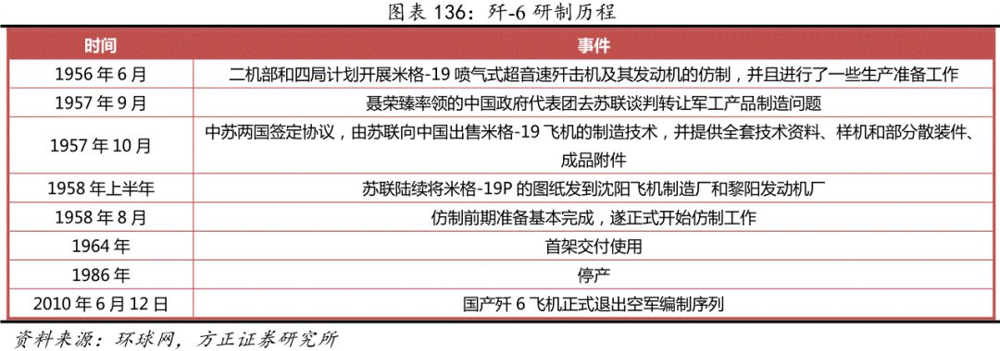

**※ 结构特点**

机翼为全金属中单翼，1/4弦线后掠角55°。高速对称翼型，顺气流方向翼根处相对厚度8.73%，翼尖处8%。机翼上表面装有导流片，下表面有扰流片，与副翼的操纵联动。机身半硬壳式结构。头部有进气道，为圆截面形，尾部转变为椭圆型。尾翼全动水平尾翼后掠角55°，相对厚度7%。垂直尾翼由垂直安定面和方向舵组成，后掠角56°，顺气流翼型的相对厚度8%。起落架为液压收放前三点式。主起落架上装有双面刹车的KT-37机轮。 

**※ 使用情况**

歼6战机为中国自主生产第一代超音速战机，1964年首架交付使用，1986年停产，在中国空军和海军航空兵的装备序列当中，它曾经是装备数量最多，服役时间最长，实战当中击落敌机最多的国产喷气式超音速战斗机。歼-6歼击机系列共生产了5205架，其中780架出口到十几个国家，受到所在国空军的欢迎。从1964年到1968年，歼6战机共击落20多架各型战机，而自己没有一架被击落。

**中国主力歼击机：歼-7**

歼-7是六十年代沈阳飞机制造厂（后转产至成都飞机制造厂和贵州飞机制造厂）制造的单座单发超音速歼击机，是根据前苏联的米格-21Φ-13型飞机仿制和发展的，主要用于国土防空和夺取战场前线制空权，也可以执行对地攻击任务。中国于1961年开始从原苏联引进米格-21Φ-13型飞机，从最初的仿制开始，通过两代航空人一步一步的努力，最终将其发展成为家族庞大的歼-7飞机系列，并成为中国空军主力歼击机和对外出口的支柱产品。

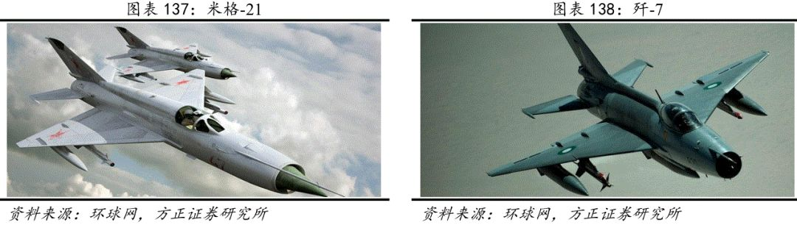

**※ 研制历程**

1961年中苏签署协定，授予中国米格-21F-13飞机及R-11F-300发动机的制造特许权，包括全套生产技术资料，飞机、发动机散装件，以及当时国内缺少的成品、原材料。

1961年3月30日，中国政府代表团经与苏联政府谈判，签订转让米格-21及其发动机和卡-13（K-13，北约代号AA-2“环礁”，仿制中国转交的美蒋AIM-9B“响尾蛇”导弹而成）空空导弹制造技术的有关协议。1962年5月18日，航空研究院与航空工业局发出《关于共同组织米格-21飞机技术摸底，为仿制及进一步自行设计做好准备的联合指示》。

歼-7的原型机于1964年初开始生产，1965年11月完成机体静力试验。第一架生产型歼7，如早期制造的歼7一样，由沈阳飞机工厂制造，并于1966年1月17日，首架歼-7在沈阳飞机厂首飞。

**※ 衍生型号**

**(一) 歼-7原型机**

歼-7原型是歼-7飞机的第一种生产型，由沈阳飞机制造厂按照米格-21Φ-13型飞机仿制而成的。飞机结构基本与米格-21Φ-13型一样，但根据当时工厂生产工艺的要求进行了少量的改动。沈阳飞机制造厂于1967年开始歼-7原型的小批生产，不过生产时间很短，到1970年停产为止一共只生产了23架，加上用苏制米格-21散装件组装的15架整机以及当初引进的那架样机，一共交付给空军39架，其中军援阿尔巴尼亚12架。

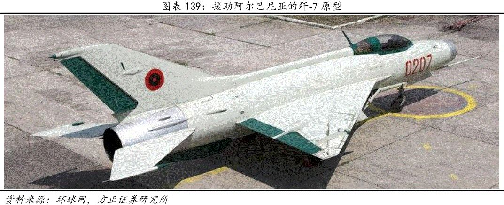

**(二) 歼-7I**

由于作为歼-7原型的米格-21Ф-13飞机是一种高空高速歼击机，偏重于高速飞行和爬升截击性能，而亚音速中、低空加速和盘旋性能并不是很好。而中国空军却恰恰需要执行在战场上空机动飞行进行夺取制空权的战斗，因此歼-7原型并不能完全满足这种作战方式需要，为此空军提出了对歼-7飞机进行改进的要求。要求歼-7飞机的改进主要解决弹射跳伞的安全性，增加一门机炮和备弹量，增加飞机的续航时间，改进操纵性和稳定性，缩短着陆滑跑距离，提高发动机的推力、降低耗油量、减轻重量并延长使用寿命等问题。

根据上述基本要求，从1969年4月开始，成都飞机制造厂对歼-7进行了一系列的改型设计和试制尝试。首先提出了一个“六改”方案，主要改进项目共有六项，包括机身左侧增加了一门30-1型机炮和60发炮弹，以增强飞机的近战射击火力，改善了歼-7飞机在发射空空导弹后近距作战火力不足的缺点。但这样也占用了机内原有的一个油箱的空间，减少了100升的载油量。座舱盖外形加高70毫米，防止弹射跳伞时飞行员的头部撞击到座舱盖上，提高了弹射救生的安全性，同时使飞行员感觉座舱空间也更宽敞和舒适。机头的进气锥由米格-21原设计的三级调节改为无级自动调节，这样可以更好的适应发动机在不同飞行速度条件下对进气量的需求，进气效率得到提高，从而小幅提高了发动机的推力，改善了飞机的平飞加速性能。进气道唇口加厚，唇口圆弧半径由0.5毫米增加到2.0毫米，这一变化改善了进气口在低速飞行下的进气特性，同时进气口的加工工艺性也得到了改善。动力装置换装了采用了高温涡轮和空心涡轮叶片的涡喷-7乙型发动机，增大了推力。扩大机翼后整体油箱的容积，使飞机的续航时间得以有一定程度的增加。这六项改进都是针对米格-21暴露出的一些缺陷而提出的，并且考虑到了当时工厂技术能力所能达到的水平，改进后将会使歼-7更能适应部队的使用。

为了加快歼击-7的改型研制速度，成都飞机制造厂首先在一架从空军部队借来的2010号米格-21飞机作为样机，按照“六改”方案进行初步的改装试验。鉴于扩大机翼整体油箱容积的改装较为复杂，因此在这架飞机上没有实施，而是在机翼下加挂了一对480升副油箱的方式来增大燃油量。此外，进气道唇口圆弧半径也由于当时改装条件的限制而没有进行更改。因此1964年4月改装完成的这架样机实际上是“五改”状态。1969年6月16日，空军第十一航校副团长王瑞生驾驶这架改装后的米格-21进行了首飞，随后又进行了多次的测试飞行，到1969年9月完成了28个起落的全部鉴定试飞科目。除机翼加装480升副油箱可能会引起全机重心失调而在试飞前的样机预审时被临时取消外，另外四项改进项目都顺利通过了试飞鉴定，也就是所谓的歼-7“四改”状态。

在改装试验取得经验之后，成都飞机制造厂开始正式按“六改”方案投料试制五架原型机。1970年4月12日，首架“六改”状态的01号原型机在试飞员庞立柱驾驶下首飞成功，到7月份完成所有试飞科目。而用于静力试验的02号原型机也于1970年8月完成了全机静力试验，加载到设计载荷的110%时才发生破坏，证明机体强度满足设计要求。1970年8月16日，第三机械工业部将这种“六改”状态的歼-7正式命名为歼-7I型飞机，空军后来又改称为歼-7A，随后工厂开始了小批量试生产。

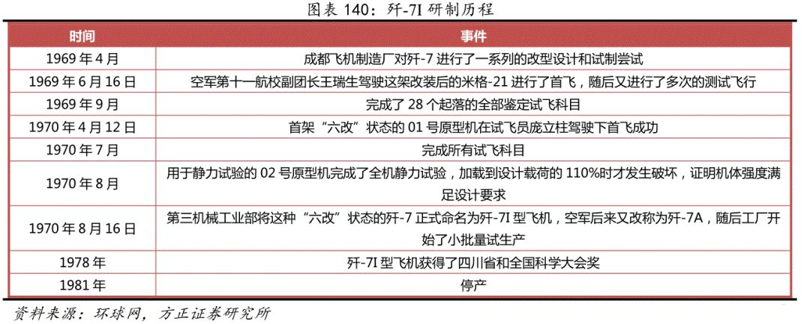

歼-7I型飞机的生产持续到1981年，一共生产了188架，交付187架（含军援朝鲜的40架）。其中“六改”状态的34架，“三改”状态的153架。1978年，歼-7I型飞机获得了四川省和全国科学大会奖。

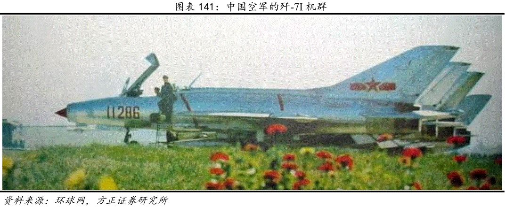

**(三) 歼-7靶**

随着中国空军武器装备的发展，空军以前装备的“长空一号”和由米格-15改装的靶-5乙型无人驾驶靶机由于是亚音速靶机，不能满足第三代空空导弹的实弹靶试中对马赫数大于1.5的超音速目标的命中率的考核需求，因此空军航空试验中心开始研制超音速无人驾驶靶机。由于歼-7I型飞机在飞行性能和使用安全性上有较多的缺陷，随着歼-7性能更好的后续改进型的陆续服役，老旧的歼-7I型飞机开始逐步退出现役。为了充分发挥这些飞机的余热，填补国内在超音速靶机领域的空白，空军航空试验中心开始对这些退役的飞机进行改装作为空中导弹实弹攻击的目标靶机。1990年10月，空军航空试验中心正式开始了将歼-7I型飞机改装成超音速靶机的研制工作。利用退役的歼-7I型飞机改装的超音速靶机在外形尺寸、机体结构强度以及雷达和红外目标特性等方面均与真实战斗机相同，因此能够最大程度地模拟实际作战环境，使导弹试验中对导弹的导引头的捕获能力、战斗部的杀伤效果等的考核更加真实可信，而且改装后的靶机价格便宜，能够重复使用，性价比较高。

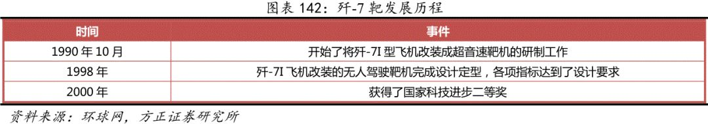

在歼-7I型飞机基础上拆除了原有的有人驾驶系统、飞行仪表、通讯导航系统、军械火控系统等不需要的设备，全新设计了一套模拟式自动飞行控制系统，实现了大速度全权限控制，可以自动进行导航计算和自主导航，保证了飞机能够自动滑跑起飞、进入退出超音速飞行及全自主返场着陆。加装了遥测、遥控等无线电控制装置以及脱靶量指示器等靶机专用的特种设备，并对原机的液压系统、冷气系统等进行了相应的改装。1998年歼-7I飞机改装的无人驾驶靶机完成设计定型，各项指标达到了设计要求，填补了我国在该领域的空白，2000年获得了国家科技进步二等奖。

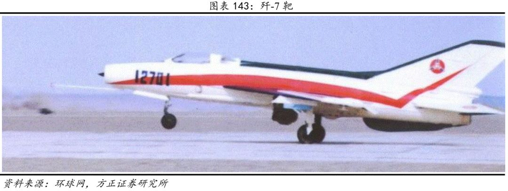

**(四) 歼-7II**

为了进一步提高歼-7飞机的战术技术性能，成都飞机制造厂从1975年7月开始在歼-7I型的基础上开始进一步的改型工作，解决设计定型时遗留下的主要问题。当时这种改进型被称为歼-7I改，后来歼-7I改被正式命名为歼-7II型，空军后来又改称为歼-7B。1977年5月，国务院、中央军委常规装备发展领导小组正式批准了工厂提交的改进方案，同意在歼-7I型基础上继续进行四项改进，要求尽快完成研制并定型生产以装备部队。

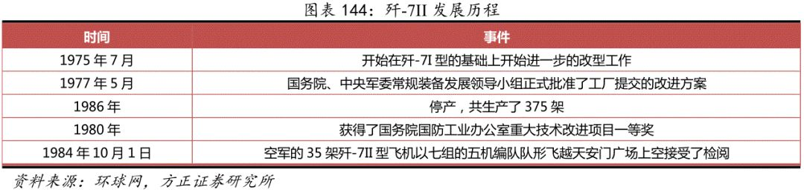

歼-7II型飞机延续了歼-7I的“六改”方案的改进，实际上是为了完成歼-7I所没有完成的改进内容，其中最重要的就是要解决弹射救生系统不可靠和不安全的问题。到1986年停产，歼-7II型飞机共生产了375架，其中011基地的飞机制造厂生产了约100架。1980年，歼-7II型飞机获得了国务院国防工业办公室重大技术改进项目一等奖。1984年10月1日，在建国35周年的阅兵仪式上，空军的35架歼-7II型飞机以七组的五机编队队形飞越天安门广场上空接受了检阅。

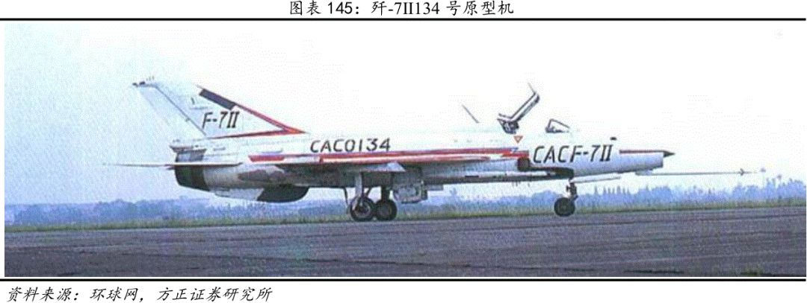

**(五) 歼-7IIA**

歼-7II型飞机尽管改进的较为成功，但相比米格-21Ф-13型飞机来看改进的几乎都是使用性和可靠性方面的缺陷，而在飞机本身性能方面却并没有多少改观，大体还是和米格-21早期型的性能相当，只能达到五十年代末的世界战斗机的技术水平。

1978年6月，当时主持军委工作的领导人在听取第三机械工业部东部长关于航空工业发展问题的汇报时指出，国内飞机技术水平提高的解决途径要包括引进外国先进技术，然后在引进、吃透的基础上再自行发展。随着1972年美国总统尼克松的访华，中国和美国等西方国家之间的关系开始进入自新中国建立以来最好的时期，因此从西方国家引进先进航空技术也就成为了可能。1978年11月2日至12月23日，为了掌握西方发达国家航空工业的第一手材料，中国航空代表团前往英国、法国和联邦德国这三个西欧国家开始为期52天的考察。当时英、法两国也希望能将自己研制的“鹞”式和“幻影”战斗机销售给中国。引进西方现成的先进战斗机尽管可以较快地缩小和国外技术水平的差距，但引进飞机的要价也是非常高的，国家的经济能力无法承受，因此当时由总参、国防工办、三机部、四机部以及空军和海军共同组成的歼-7、歼-8改装领导小组决定首先从英国引进一些雷达电子火控设备来改进歼-7和歼-8飞机的作战能力，先弥补中国飞机的最薄弱的环节，并希望借此尽快提高国内落后的航空电子水平。

1979年3月3日，在中国航空技术进出口公司的组织下，成都飞机制造厂开始同英国马可尼公司就引进六项航空电子设备的项目进行谈判。1980年6月30日，中航技公司和马可尼公司终于正式签订了双方合作改装歼-7飞机的合同，这也是改革开放后中国与西方国家的第一个军事技术合作项目。除了从马可尼公司引进六项设备外，中航技公司还和英国的史密斯公司签订了引进无线电高度表的合同。两个合同共购买七项设备共计124套，用于为中国空军改装100架歼-7飞机（含备件）。同时还达成了这些引进设备的制造许可权，以便之后能够在国内进行生产供应。引进的这七项电子设备包括：“空中巡逻兵”7M型雷达测距器、50-408-02型大气数据计算机、AD3400型多频段通讯电台（带AA3460型保密机）、956型平视显示器、2032型照相枪、DH-1030-24-1200-CS-IIB型静止变流机（两台单相、一台三相）、0101-HRA/2型雷达高度表。其中静止变流机并不是马可尼公司的产品，而是通过马可尼公司向美国凤凰公司购买的，用以替代飞机上原有的旋转式变流机来保证各项引进设备所需的交流电供电品质和功率。1980年7月31日，中国政府正式批准了上述合同。随后第三机械工业部还决定引进的雷达测距器由兰州长风机器厂（781厂）试制生产，大气数据计算机由成都航空仪表厂（161厂）试制生产，通讯电台由天津无线电厂（712厂）试制生产，雷达高度表由宝鸡长岭机器厂（782厂）试制生产，静止变流机由兴平秦岭航空电气厂（135厂）试制生产，照相枪由西安西北光学仪器厂（248厂）试制生产，平视显示器的光学部件由西安西北光学仪器厂试制生产，而电子部件及总装则由苏州长风机械厂（171厂）负责。

1980年9月，成都飞机制造厂完成了歼-7飞机改装引进火控电子设备总体设计方案，改进后的飞机被称为歼-7IIA型。1980年11月，第三机械工业部正式批准了改装任务。为了与英国引进的电子设备相配套，歼-7IIA型飞机还采用了七项当时国内新研制的国产设备，包括：LZ-2型综合罗盘、XS-6A型信标接收机、GGJ-7型空速管、GGJ-9型迎角传感器、CW-1002型大气总温传感器、BM2.5型膜盒式M数表、WL-7型无线电罗盘控制盒改小并将天线改为腹鳍铜网天线。由于加装引进和国产的这些新设备，相应地取消了射瞄-3甲型瞄准具、226型雷达测距器、CT-3型超短波通讯电台、262型无线电高度表、相枪-4甲型照相枪等一些原有类似用途的机载设备。

为了实施改装，成都飞机制造厂在歼-7II飞机生产线上抽出了两架飞机作为引进设备的试验机，另外还将工厂自留使用的139号歼-7飞机作为国产配套设备和系统改装的试验机，三架飞机同时进行改装试验和试飞以便尽快地能把外贸型飞机搞出来。1982年9月，屠基达被任命为歼-7IIA型飞机的总设计师。1982年第三季度，两架歼-7IIA型飞机改装完成，完成各项地面试验后于1982年9月7日首飞上天。歼-7IIA的全部试飞历时一年零四个月，共飞行了197架次，164小时。1984年3月7日鉴定试飞结束，1984年4月19日与英方签署了引进设备试飞鉴定结论，鉴定结果为“良好”。

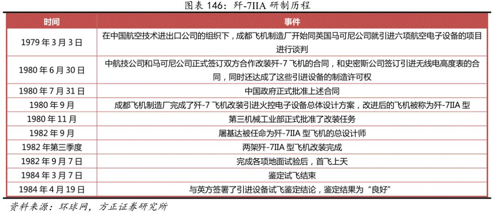

歼-7IIA飞机是西方雷达火控电子设备首次在中国歼击机上安装使用的机型，引进的设备使歼-7飞机在火控、导航、通讯等方面的功能得到了大幅的改善，并为歼-7飞机以后的继续发展创造了条件。歼-7IIA虽然最终没有能够投入批量生产，但其改装成果为后续的外贸出口型飞机的研制打下了必要的技术基础。

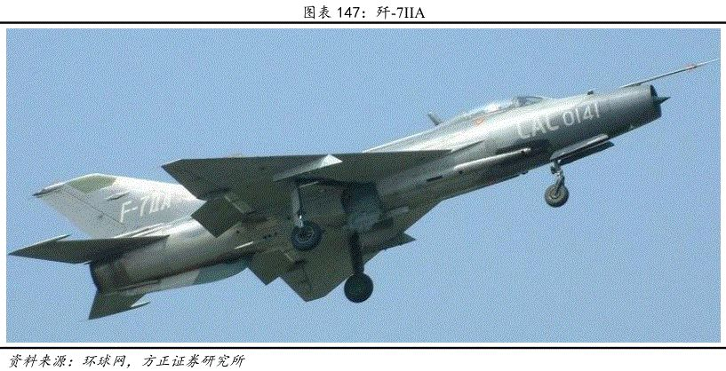

**(六) 歼-7IIH**

在中国空军放弃引进英国电子设备来改装自己的歼-7II之后，如何提高歼-7飞机的作战能力成为摆在空军面前迫切需要解决的问题。这时来至中东的以色列人开始参与到歼-7飞机的改进计划中来了，为歼-7提高攻击能力提供了成本较低的一种选择。

八十年代初，以色列与叙利亚在中东的贝卡谷地上空爆发了大规模的空战，以色列空军所取得的惊人战果震惊了世界，贝卡谷地空战的成功对中国空军触动很大，特别是以色列战斗机装备的“怪蛇”先进红外制导空空导弹引起了中国空军的极大兴趣，空空导弹在未来空战中的重要性也开始为中国空军重视起来。而当时以色列也希望和中国能够建立更好的关系，希望中国能够减少向中东阿拉伯国家输出武器装备，特别是保证不提供射程较远的战术地对地导弹。基于各自的利益，从1982年开始中国和以色列就开始秘密谈判引进“怪蛇”-3型空空导弹，成都飞机制造厂的技术人员也开始在以色列拉斐尔公司专家的帮助下试图将“怪蛇”-3导弹改装在歼-7II型飞机上。由于当时国际外交形势的限制，中国和以色列并没有建立外交关系，同时中国为了保持与中东其他阿拉伯国家的交好关系，在外交上与以色列就需要保持足够和适当的距离，因此中以之间的军事技术合作一直处于“私下”和“非政府”状态下。即中方的技术人员不能直接到以色列去，以色列的专家也只能以私人身份到中国进行访问讲学或旅行。这尽管会带来一些不便，但双方的合作依然进展顺利，很快就签订了引进“怪蛇”-3型导弹生产许可权的协议，购进一批导弹并引进全套生产技术，开始在株洲南方航空动力机械公司（331厂）进行仿制，国内称为霹雳-8型，霹雳-8型导弹是一种近距红外制导空空导弹，导弹使用高性能的氮制冷锑化铟红外导引头，具备大离轴角发射能力并可以全向攻击，具有更强的机动能力，综合战技术性能高于美制AIM-9L导弹，该导弹仿制的成功填补了我国在高机动性近距格斗导弹方面的空白。

1983年8月2日，国防科工委正式向成都飞机制造厂下达了歼-7II飞机改装霹雳-8导弹的任务，主管设计师为陆育英和宋开基。1984年3月完成了挂载导弹的改进设计方案。经过一年多的时间，1985年3月完成了一架飞机的改装并试飞成功。1985年9月9日，航空工业部和空军通过了歼-7II型飞机改装霹雳-8型导弹的技术鉴定，并将其命名为歼-7IIH型，后来空军又改称为歼-7H型飞机。1986年2月，歼-7IIH型飞机开始装备部队，到1993年停产共生产交付221架。

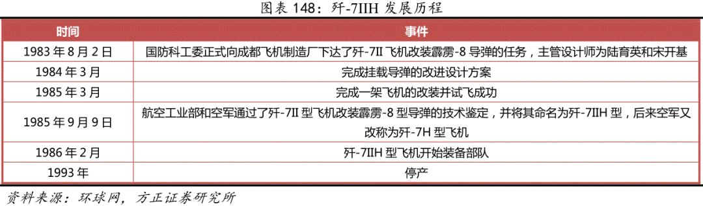

**(七) 歼-7HH**

歼-7IIH型飞机的海军型，称为歼-7HH型。飞机状态与空军的歼-7IIH基本一致，由于高含盐量的海水和湿汽对于飞机的铝合金结构具有很强的腐蚀性，为了满足海军航空兵部队使用环境的要求，飞机增加了防湿热、盐雾、霉菌的“三防”措施，将机上的镁合金零件都更换为铝合金材料。

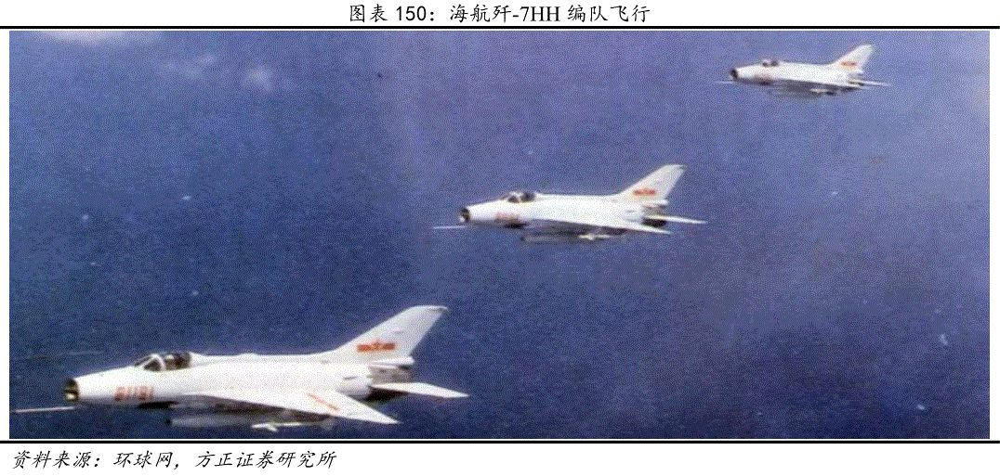

**(八) 歼-7IIM**

歼-7IIM是歼-7M型的国内使用型，由于歼-7M的机载火控设备的先进程度和武器挂载能力较歼-7II有较大的提高，因此中国空军考虑将霹雳-8导弹挂载在歼-7M上，以进一步加强飞机的整体作战性能。而八十年代国内经济的持续高速增长，对外贸易额也不断扩大，国民生产总值和外汇收入的大幅增长也使空军这时候有了一定的经费来少量装备这种较先进的歼击机。

歼-7IIM在歼-7M基础上将机翼内侧挂架更换为歼-7H的机翼挂架，改进了GJ3-D通用武器挂梁，使其能够挂载发射霹雳-2、霹雳-5乙、霹雳-7（法制R550“魔术”的国内仿制型）以及霹雳-8空空导弹，同时也按照歼-7IIH的状态在前机身增加了配重，飞行性能相对歼-7M略有降低。另外956型平视显示器增加了霹雳-8导弹的弹道参数以及导弹尾追攻击区域显示状态，以满足霹雳-8导弹的发射需要。为适应国内的作战指挥环境，仍然安装歼-7II飞机的YD-3型敌我识别器。发动机换装了采用双通道点火、有防止喷口自动放大措施改进的涡喷-7乙B型发动机，弹射救生系统仍沿用歼-7II飞机的“零高度至升限、250~850公里/小时”的救生范围指标。

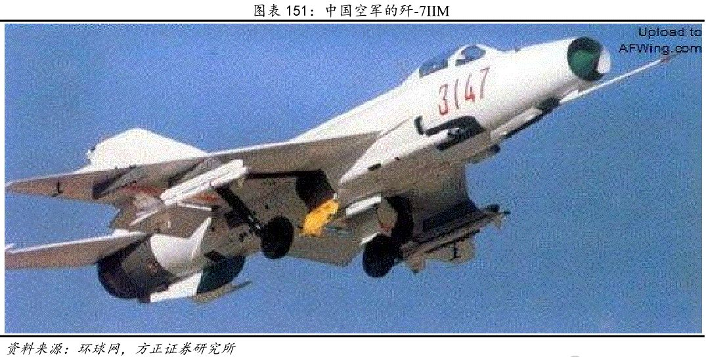

**(九) 歼-7III**

由于当初从苏联引进的米格-21Ф-13是一种昼间型歼击机，无法在夜间或复杂气象条件下执行作战任务，因此在歼-7开始装备空军部队伊始，部队就提出了歼-7飞机要具备全天候作战能力的要求。为了改变歼-7飞机雷达测距器功能差、机载火力弱等缺点，1972年在出国考察了全天候型的米格-21МФ飞机之后，成都飞机制造厂开始在参照该机的基础上进行歼-7改全天候型方案的初步论证。1978年7月，歼-7大改的设计工作全面开展并提出了初步的总体方案。为了能够深入了解米格-21МФ飞机的技术特点，于1978年8月和9月先后组织两批技术人员到装备米格-21МФ飞机的友好国家罗马尼亚和孟加拉国进行了实地考察。9月14日，在成都召开了歼-7大改型飞机方案论证和技术协调会议，明确了歼-7大改型的战术技术指标和机载设备配套方案，同时中国还通过外交途径从另一个友好国家埃及弄到了米格-21МФ和米格-21УС型飞机各一架，并最终确定歼-7大改型以米格-21МФ为样机结合国内实际情况进行参照设计，1978年12月正式将其命名为歼-7III型，空军后来又改称为歼-7C型飞机。

1979年2月3日，从埃及引进的米格-21МФ样机运到成都飞机制造厂。由于只能引进样机，因此歼-7III的试制过程与当初引进制造许可权的歼-7完全不同，设计出图纸就成为歼-7III研制的第一步工作。但究竟是采用参照设计还是测绘设计，当时产生了不同的观点，导致飞机研制进度拖延了下来。这时空军提出急需新机进行现代化改装，因此歼-7III的研制要争时间、抢速度，要求完全按照米格-21МФ进行测绘，先把飞机尽快仿制出来再说。1979年7月5日，第三机械工业部决定歼-7III的设计原则调整为测绘设计，随后成都飞机设计研究所就开始了紧张的测绘准备工作。1979年10月4日，样机的测绘工作正式开始，经过180名设计人员一个多月的努力，完成了米格-21МФ全机的测绘任务。1980年1月15日，空军确定了歼-7III飞机的战术技术要求，并上报总参和军委批准。飞机主要战术技术指标为：最大飞行速度M2.1，实用升限不低于18000米，最大航程不少于1300公里，正常起飞重量8150公斤，最大起飞重量9600公斤，最大外挂能力不低于1300公斤。1980年6月3日，国务院和中央军委正式批准研制歼-7III飞机，并将其列为国家“六五”期间航空工业的重点项目。

1981年12月31日，成都飞机设计研究所完成了歼-7III飞机的详细设计，发出了全部生产图纸，之后飞机的试制工作全面展开。试制工作由成都飞机公司和011基地共同负责，其中成都飞机公司承担机身、平尾、垂尾、前起落架的制造以及总装试飞工作，011基地则承担机翼和主起落架的制造工作，这是国内新机研制首次采用两厂合作进行的方式。

1983年1月，歼-7III飞机零批六架原型机零件正式投入试制。1983年10月，用于试飞的01号原型机开始部件装配。12月17日，来自成都飞机制造公司的飞机机身和来自贵州011基地的机翼一次对合成功，顺利地进入总装阶段。1984年2月6日，01号原型机正式移交试飞站，开始首飞前的地面准备工作。之后的1984年1月，用于静力试验的02号原型机也完成总装，开始进行部件和系统的静力试验。由于引进的样机因测绘已经拆解而难以恢复飞行，为了与米格-21МФ飞机进行性能对比试飞，又花费550万美元外汇从埃及引进了一架米格-21МФ飞机。1983年7月19日，引进的米格-21МФ飞机运到成都飞机公司，机号为150，成为成飞公司的科研自用机。

原计划歼-7III飞机的鉴定试飞要在1985年12月前完成并通过设计定型，但实际却拖到1987年10月才完成全部试飞任务。造成这种局面主要是新研制的机载成品设备装机前没有进行充分的地面模拟试验或预先试飞，成品本身的问题在新机试飞过程中不断暴露，在试飞过程中经常遇到故障而导致飞机停飞。特别是与歼-7III飞机同时开始研制的涡喷-13型发动机，由于没有时间进行足够的长期地面和空中测试，只能装在新机上来直接进行试飞，而发动机长期以来一直都是中国航空工业的软肋，结果涡喷-13型发动机的问题不断，这些因素都严重了影响歼-7III飞机的鉴定试飞进度。

1988年2月，国家军工产品定型委员会正式批准该机设计定型。1988年，首批八架歼-7III飞机总装完成，但因涡喷-13型发动机的配套进度没有跟上，装配好的飞机只能停在成飞公司的机场上而无法交付部队。一直拖到1989年12月这些飞机才得以交付部队，并改称为歼-7C型飞机。歼-7III飞机虽然具备了全天候昼夜截击能力，但由于气动外形的修改和重量的增加，使飞机的机动性和续航能力反而较原来的歼-7飞机有所下降，因此没有受到部队飞行员的欢迎，歼-7III飞机原计划要大量生产，但空军原来的订货量被大幅削减，飞机的实际生产的数量却很少，仅仅只有17架，而且到1996年就停产了。飞机研制交付的拖延导致空军的换装计划推迟了数年，难以尽早地形成战斗力，这也成为空军大幅度减少原订装备数量的一个重要原因。

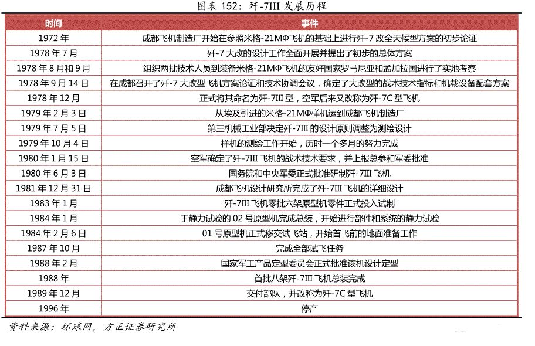

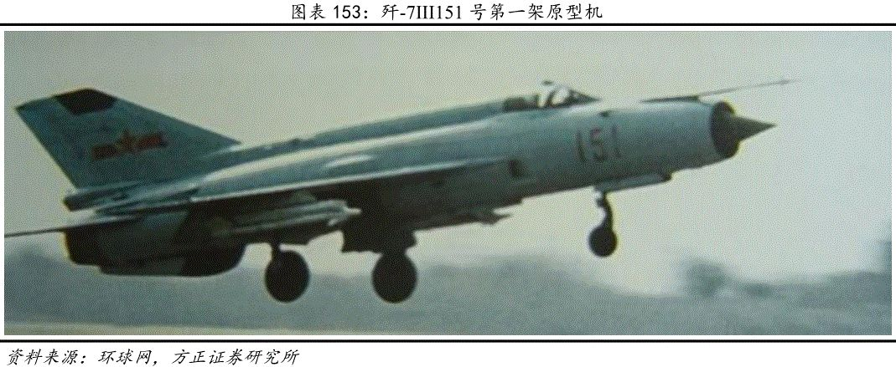

**(十) 歼-7IIIA**

歼-7IIIA型飞机于1988年开始进行改进设计，并首先在成飞公司的151号歼-7III型飞机上按改进方案实施了改装。1991年8月20日，试飞员刘庆礼驾驶该机完成了首次试飞。1994年11月27日，歼-7IIIA型飞机通过设计定型的技术审查开始投入小批生产。1995年12月25日，航空军工产品定型委员会正式批准设计定型。尽管歼-7IIIA作战效能和使用维修性有所提高，但并没有能完全解决歼-7III型飞机的航程短、机动性差的缺陷，因此也只生产了32架就于1999年停产了，交付空军后改称为歼-7D型飞机。1999年10月1日，在建国五十周年的阅兵仪式上，歼-7C和歼-7D组成的飞行编队一起飞过天安门广场接受了检阅。

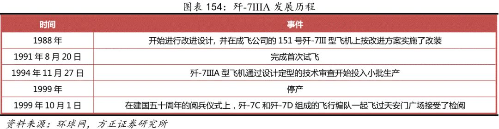

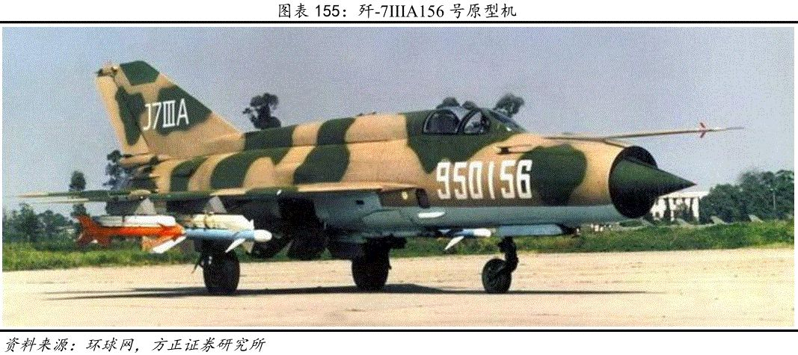

**(十一) 歼-7E**

成都飞机工业公司此前对歼-7I、歼-7II飞机的改进措施只是对歼-7飞机的使用维护性方面有了一定的改进，而歼-7M、歼-7IIH系列飞机则主要是改进了航空电子设备和武器系统，这些机型对于飞行性能的提升却并没有多少改观。特别是歼-7IIH飞机所挂载的霹雳-8型空空导弹虽然攻击能力比原装备的霹雳-2导弹有了大幅提高，但是该导弹的弹体重量却更重，歼-7IIH飞机挂载后飞行性能有较大地下降。而且七、八十年代局部战争的空战也表明，战斗机的机动飞行性能对空战结果的影响至关重要，因此如何解决歼-7II中低空机动性能不好的问题被提到空军装备发展的重要日程上来。

为了提高歼-7飞机的中、低空亚音速及跨音速的机动飞行性能，改善续航能力和起飞着陆性能，同时进一步改进航空电子火控设备来提高了总体作战效能，使之在未来空战的环境中具有一定适应能力。根据当时国家的经济状况、现有装备使用情况和我国航空工业的发展水平的情况，成都飞机工业公司于1987年提出了在歼-7II飞机基础上进行大改的设想，改进后的飞机起初称为歼-7IV型，后来正式命名为歼-7E型。

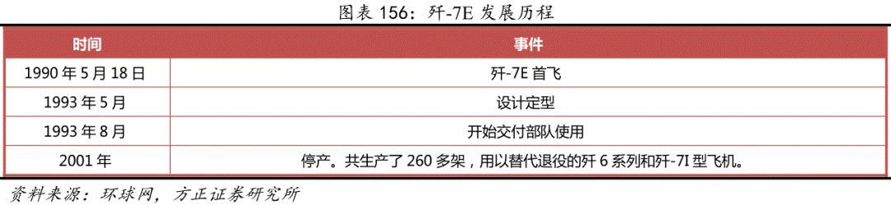

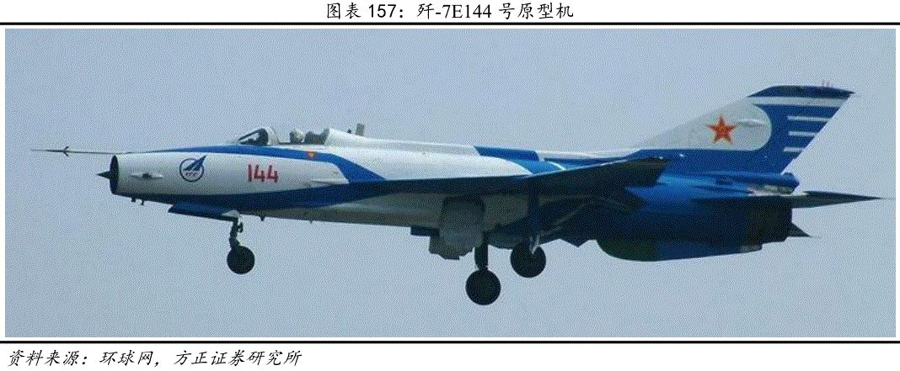

**(十二) 歼-7G**

歼-7G是在歼-7E型飞机的基础上主要对雷达及火控电子设备进行改进而成的，作战性能比歼-7E有了很大的提高，成为目前在中国空军服役的最先进的歼-7型号。机头取消了原来的雷达测距器而换装了国产的小型EL/M2001多功能脉冲多普勒雷达，使飞机能够在付出较小重量代价的基础上获得了全天候作战能力，而飞机的机动性能水平并没有什么下降，配合头盔瞄准具可以充分发挥霹雳-8空空导弹的离轴发射能力。而同样可以发射霹雳-8导弹的歼-7IIH型飞机则由于瞄准具视场的限制，导弹的离轴发射角仍需限制在一个较为狭窄的范围内，远小于霹雳-8导弹实际所能够达到的指标。飞机外观与歼-7E最大的区别是采用了圆弧整体风挡，没有隔框的遮挡更有利于飞行员对座舱外情况进行观察和判断，这在近距格斗作战中也是至关重要的。此外飞机上还安装了改进的敌我识别器、全向雷达告警器以及箔条/红外投放器等设备。手不离杆的设计使飞行员能够通过设置在操纵杆上的按钮和开关来实现操纵雷达、发射武器的所有功能。所具有的战术数据传输系统和战术信息指挥系统可以接受预警机的指挥进行作战，全机涉及的各类改进有30多项。歼-7G飞机由宋承志担任总设计师，2002年3月开进行始部件装配，2002年6月28日飞机首飞成功，同年两架原型机交付部队试用。2004年7月飞机通过设计定型，批生产型飞机2004年11月开始正式交付空军使用。

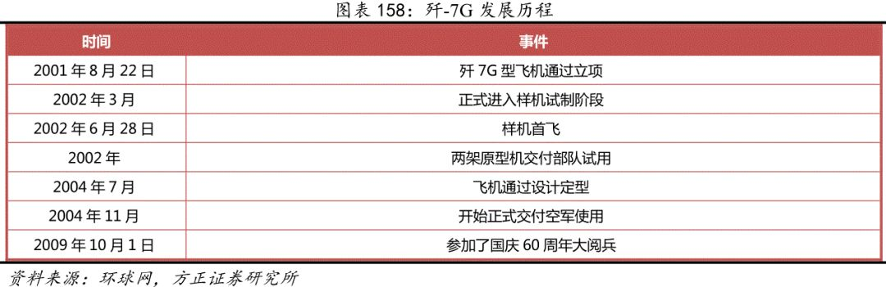

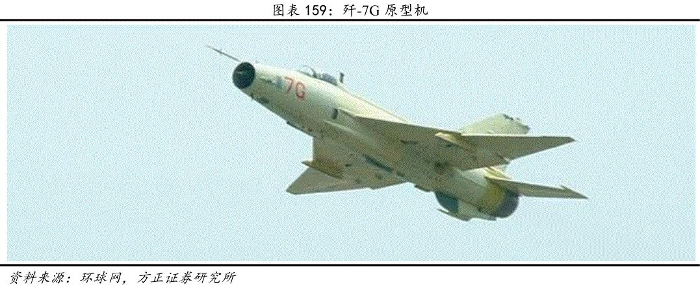

**中国自主研制的第四代战斗机：歼-10**

歼-10战斗机（英语：J-10或F-10）北约代号：萤火虫（Firefly）是中国中航工业集团成都飞机工业公司自主研制的单发动机、轻型、多功能、超音速、全天候、采用鸭式布局的的第四代战斗机，中国空军赋予其编号为歼-10，对外称J-10或称F-10。

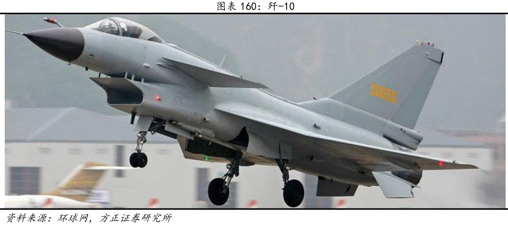

**※ 研制历程**

20世纪80年代，我军以前购买的米格21日趋落后，又无法换代。当时的装备以歼-6、歼-7为主力机种，其航程、机动性、火力、电子设备等方面已经远远不能满足国防武器装备现代化的需要，与国际先进战机相比，差距日益扩大。研制新机，缩小差距，已迫在眉睫。

70年代起苏联的威胁越来越大，加上80年代改革开发、国力增强，使我国自身具有了研制新歼击机的动机、底气和能力。这时西方出于抗衡苏联的需要，给予中国大量技术援助，其中以色列将自己胎死腹中的LAVI“狮”式战斗机的设计资料提供给我国。在此基础上，成都飞机制造公司挑起重担，发起了对第三代战斗机的冲击——研制歼-10。

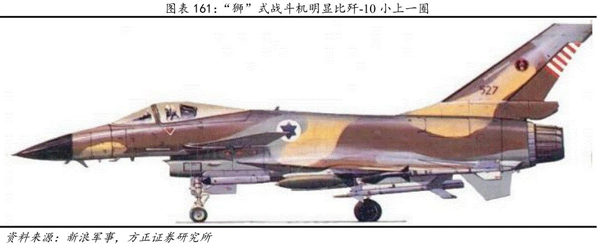

为紧跟国际先进战机发展潮流，更好满足军方装备要求，歼-10或多或少的瞄准了当时最成功的第三代战斗机之一——F-16的设计。当时我国尚无法解决数字线传三轴静不安定控制、翼身融合、大推力涡扇发动机这些三代战斗机的主要技术特征，几乎不可能自力更生完成计划，为此和以色列，法国，俄罗斯进行了广泛的技术合作。歼10的全套航电和雷达，就是从以色列原装引进后加以国产化的产物，而在飞控、结构设计方面，以色列和法国达索也给予了重要的技术帮助，其中软件开发、人员培训甚至共同设计都有。

以色列向我们提供了“狮”式轻型战斗机的样机和技术资料。狮式是以色列以F-16为基础的重大改进型号，采用四余度数字电传飞行控制系统，电子系统相当先进。经过种种沟通谈判，以色列同意将“狮”的设计详细资料提供给中国，作为新型战斗机的蓝本，这与当时中以大范围合作的情况相吻合。值得注意的其他背景是我国从某些友好国家得到了F-16战斗机、多种米格系列战斗机等，从而对其进行了详尽的研究和试飞，对于研制也有一定推动作用。

1982年2月，在北京召开第一次方案评审会。1982年4月，在北京召开第二次新歼方案评审会，此时成飞有备而来，沈飞方案事实上已经落败。1983年3月开始，先期安排相关子系统开始论证和预研1983年9月，新歼发动机选型会召开，会议确定涡喷15为配套发动机，但太行继续发展。1984年2月，第三次选型会召开，611最终胜出。1984年5月，国防科工委正式下发文件，确定新歼研制总体单位为611所和132厂。1984年6月，北京再次召开新歼方案论证会，和空军一起确定新歼指标，审查确定了新歼的初步设计。1986年1月，国家领导人对新歼作出肯定批复，10号工程正式上马。

在1994年6月完成全部设计图纸后，歼10原型机的建造于1995年8月开始，1997年6月2号，新机完成建造。1998年3月23日，歼10首飞。歼10一共建造了6架原型机，分别是01-06号机，原型机编号为100X，10代表歼10，第三位0表示0批次原型机，而X则是1到6，代表第几架原型机。

1001号机，第一架原型机，主要用于气动验证和飞行性能测试，由于超负荷飞行，01号机很快就到了使用寿命退役，现在保存在小汤山航空博物馆；1002号机，静力试验机，构型和1001号一样，完成静力试验后修复，现在是中航工业大厦门前的标志性塑像；1003号机，第二架用于飞行性能试验的飞机，后期也有承担霹雳11的试飞任务，还有部分对地攻击科目和空中加油科目，03号机是亮相最多的一家原型机，这架飞机现在依然在阎良试飞基地执行科研试飞任务；1004号机，主要执行火控系统试飞；1005号机，承担飞行测试任务，火控系统试飞和各种电子系统的测试；1006号机，最后一架原型机，和05号机一样，也是主要承担各种火控和电子系统的试飞。2004年4月13日，歼10通过国家设计定型审核，正式定型。

**※ 结构特点**

歼-10采用鸭式布局，翼身融合。通过精心设计主翼与机身中部结合处的曲面，既增加了机内容积（用于载油、装备，以及为尔后发展预留空间），也有效利用了它带来的空气动力增升效果。主翼后部机身两侧没有安排其他结构，只是在尾喷管前端机腹下加装了两片外斜腹鳍。与“狮”相同的是，歼-10也设计了四片减速板，其中两片位于机身上部主翼后方，其余两片仅位于机尾下部腹鳍之间。歼-10的进气道位于机腹下，由调节板构成进气道的前部。

**※ 使用情况**

2004年1月，中国解放军空军第44师132团第一批装备了15架歼-10。中国官方于2006年12月底正式公布歼10战斗机服役的消息以及新闻片段。2009年11月5日在中国人民解放军空军纪念建军60周年的飞行表演中，歼-10在空军“八一”飞行表演队换装后首次亮相。2012年5月30日解放军报报道称，东海舰队航空兵已列装J-10，截止2012年2月，有260架服役。巴基斯坦空军于当地媒体采访表示预订订购36架歼-10，在2014-15年交付使用，而最终订量将达150架。

型号演变：歼-10A为单座量产机型，外销代号F-10A。歼-10S为J-10A的双座教练机型号，前机身拉长以放入后座，两名飞行员以纵向座于单一座舱罩下。机背也加大隆起以放入多的航电系统，突出教练外，亦保留了作战功能。J-10S亦可以用于加强对地攻击型，后座飞行员可以担任武器操作员。歼-10B是基于J-10A大幅度改进型，配备无附面层隔道进气道，雷达罩被重新设计，取消了传统圆锥型的雷达罩，更改为扁身锥型，驾驶舱前方安装了光电瞄准系统，内藏红外线搜索及追踪系统及激光测距仪，垂直尾翼和襟翼亦相应地加大，垂尾切尖、腹鳍切尖，进一步改进气动布局。歼-10AY为八一飞行表演队用机，配备与歼-10A大致相同，机头上的23毫米航炮被移除，同时在机翼挂架上安装了拉烟装置，用于表演时进行拉烟演示。歼-10SY为歼-10AY的双座版。FC-20为预定销售予巴基斯坦的歼-10外销型。

**中国生产的第一种重型战斗机：歼-11**

歼-11战斗机是我国生产的一种重型战斗机，为第四代战机。歼-11是获得俄罗斯授权生产的Su-27SK，由沈阳飞机公司建立生产线，俄罗斯供应主要零件与系统后建立生产与组装能力。之后，沈飞以苏-27的气动外形加上国产的航电和武器系统等开发了衍生机型歼-11B、歼-11BS，在性能上有所改良。

**※ 研制历程**

在经过测试飞行苏-27后，中国军方了解到该机的性能的确十分先进突出，中央军委做出了以下发展策略：即在自力开发新一代主力战机的同时，将仿制或者转让制造苏-27提上日程，保持并提升国家航空科研的实力。对于俄罗斯来说，似乎更愿意向中国销售的是产品而不是技术。但在中国方面强烈要求技术转移，否则该机的采购量将不超过48架的压力下，双方于1993年8月展开谈判。在经过3年的拉锯之后，1996年12月6日，俄中签订了转让苏-27生产许可证的协定，整个合同总额估计为25亿美元。

根据合同，中国在中国航空工业第一集团属下的沈阳飞机制造公司（112厂）在15年时间内制造200架苏-27（年产约14架），其中第一批苏-27的机体全部由KnAAPO提供，以后批次的机体逐步过渡到由中国航空工业根据俄罗斯转让的全套工艺文件自行制造，但俄罗斯仍然提供全部200架飞机所需的发动机、雷达及电子设备、机载武器。中国沈阳生产的苏27不允许出口给第三国。如果生产数量达不到要求，中国可以要求俄罗斯生产。

中国制造苏-27代号为“11号工程”，装备部队的正式名称则是歼击-11型战斗机。在谈判的开始阶段，KnAAPO向中国推荐的型号是单座多用途型苏-27SMK，但中国空军的评估认为在现代高威胁环境中，飞行员显然难以单独担负危险而复杂的对地攻击任务，F-15E这样的双座多用途型才是最佳选择。最终放弃自行制造苏-27SMK而选择了购买苏-30MKK、自行生产并改进苏-27SK型的道路。

1997年夏天，俄罗斯向中国方面交付了全套工艺文件。1998上半年，沈飞开始组织生产首批2架苏-27。1998年9月1日，第一架组装飞机首飞，第二架年底试飞。1999年9月后，这两架国产歼-11开始交付部队。他们被装备到空2师6团，与俄罗斯原装的苏-27进行对比，据信经飞行员的对比使用，认为达到了俄罗斯原装飞机的水平。

**※** **型号演变**

歼-11B：沈飞自行研制的第四代重型战斗机，在引进前苏联的苏-27SK后，公司又提高航电系统效能，在苏-27SK战机的设计基础上，换装了国产综合火控系统、全玻璃化座舱、四余度数字式电传操纵系统、涡扇10“太行”涡轮风扇发动机等核心部件，使歼-11B的最大作战能力都激发了出来。

歼-11BS：歼-11B的双座教练型。

**重型双发舰载战斗机：歼-15**

歼-15是中国参考从乌克兰获得苏-33战斗机原型机T-10K-3号机以国产歼-11战斗机为基础进而研制和发展的重型双发舰载战斗机，该机研制由中国航空工业集团公司沈阳飞机工业集团承担，2009年8月31日首飞成功。

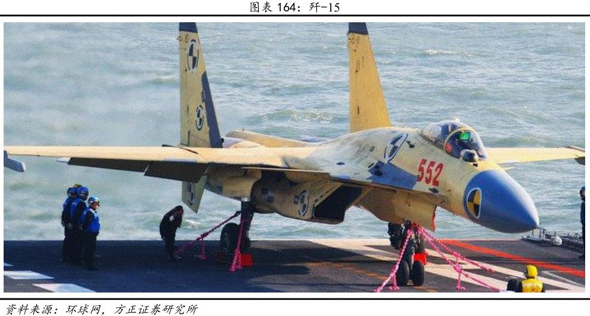

拥有可折叠机翼的歼-15在外形上与俄制苏-33非常相似，但歼-15融合了歼-11B的技术。在歼-11的基础上新增鸭翼、配装2台大功率发动机，实现了机翼折叠，全新设计了增升装置、起落装置和拦阻钩等系统，使得飞机在保持优良的作战使用性能条件下，实现了着舰要求的飞行特性。

**中国首架五代战机：歼-20**

歼-20(J-20)，绰号“威龙”，北约代号“火牙”（FIREFANG）。是成都飞机工业集团为中国人民解放军完全自主研制的最新一代（欧美旧标准为第四代，新标准以及俄罗斯标准为第五代）双发重型隐形战斗机，用于接替歼10、歼11等第四代空中优势/多用途歼击机的未来重型歼击机型号，该机将担负我军未来对空、对海的主权维护任务。歼-20在2017年投入使用，预计在2020年左右逐步形成战斗力。首架原型机于2011年1月11日在成都实现首飞。

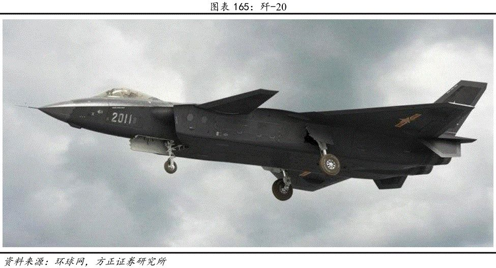

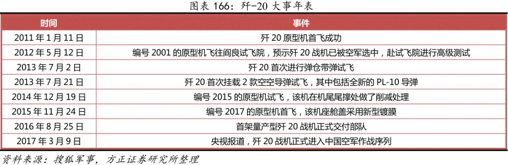

歼-20采用了单座、双发、全动双垂尾、DSI鼓包式进气道、上反鸭翼带尖拱边条的鸭式气动布局。机头、机身呈菱形，垂直尾翼向外倾斜，起落架舱门为锯齿边设计，机身以墨绿色涂装，远观近似于黑色。侧弹舱采用创新结构，可将导弹发射挂架预先封闭于外侧，同时配备国内最先进的新型格斗导弹。

据推测，歼-20的可选装备如下：（1）远程空对空导弹：霹雳-21，中程空对空导弹：霹雳-12D，近程空对空导弹：霹雳-10，近程空对空格斗导弹：霹雳-8；（2）精确制导滑翔炸弹：雷石-6；（3）机炮：一门23毫米双管航空机炮。

完

**作者：段小虎、韩振国**

**来源：军工段小虎 塞上军章**

**全文完。感谢您的耐心阅读，请顺手点个"在看"吧~**

**免责声明：**本文根据转自网络。文章内容系原作者个人观点，本公众号转载仅为分享、传达不同观点，如有侵权或任何异议，欢迎联系我们删除！

**前沿装备汇精彩回顾**

[**重磅消息！军工保密三级资格取消！**](http://mp.weixin.qq.com/s?__biz=Mzg5NzU3NzcxNA==&mid=2247484457&idx=1&sn=82bdd35541fdec989d0cb6999080172c&chksm=c06ee3b4f7196aa24bbbdc9ad034ce63bec75878b0bccc7681ade217cbcb620622d46c3e6307&scene=21#wechat_redirect)

[**中国十大最顶尖军工集团**](http://mp.weixin.qq.com/s?__biz=Mzg5NzU3NzcxNA==&mid=2247488162&idx=1&sn=aa513e11b8fb9f3f666651a8e00a2814&chksm=c06ef53ff7197c29add2c4d5d6bc6be3fc1f513193a3c56769952ecb3a4e3e80587ebf69a4bc&scene=21#wechat_redirect)

[**全球十大新材料顶尖巨头**](http://mp.weixin.qq.com/s?__biz=Mzg5NzU3NzcxNA==&mid=2247488056&idx=1&sn=18730a35b73f47281f57c770e7ab4e9c&chksm=c06ef5a5f7197cb3042393fbb1d31795bf0ab58321f7bf2669736bcd4e794082b0bdb3b4b84a&scene=21#wechat_redirect)

[**全球十大最尖端的数控加工中心**](http://mp.weixin.qq.com/s?__biz=Mzg5NzU3NzcxNA==&mid=2247488040&idx=1&sn=11b823602b65dba413d9df32448dcbb3&chksm=c06ef5b5f7197ca311100da09b047cd8d0eb5c609dc2b7401f1023784643cfe654f5432461ab&scene=21#wechat_redirect)

[**盘点：最新军工资质相关变化汇总**](http://mp.weixin.qq.com/s?__biz=Mzg5NzU3NzcxNA==&mid=2247487943&idx=1&sn=34ae141fdf08def1f0a5994db1ec7fb5&chksm=c06ef65af7197f4c853c491f665b04521947af9b12d4cb8c77f7ddff7c2dc15d7eccc15569d2&scene=21#wechat_redirect)

[**捕捉军工黄金赛道：三大主线、十大产业**](http://mp.weixin.qq.com/s?__biz=Mzg5NzU3NzcxNA==&mid=2247486110&idx=1&sn=02ca3186af74ae4caa924924fc28e3fe&chksm=c06eed03f7196415d22d48ecbac64efb3d9c9b735c145826466308e36f0afce46bcd5a9d371a&scene=21#wechat_redirect)

[**谈军代表与装备技术状态管理监督**](http://mp.weixin.qq.com/s?__biz=Mzg5NzU3NzcxNA==&mid=2247486162&idx=1&sn=2097b8bc200be3f16e05d958c9f25054&chksm=c06eed4ff719645913b6b8907b7c6818b3e2a2e76ee379878ef8aa289a9a46b56f2728133aab&scene=21#wechat_redirect)

[**2021年军工行业：需求之变**](http://mp.weixin.qq.com/s?__biz=Mzg5NzU3NzcxNA==&mid=2247486065&idx=1&sn=9fc739091e28fac52c9e8ea9c9d730f3&chksm=c06eedecf71964fa2618f3738400d4dc2677c1c8647c00b793d148bb904eb78a0371e86d8364&scene=21#wechat_redirect)

[**军工“十四五”利好不断，一文看尽军工产业链**](http://mp.weixin.qq.com/s?__biz=Mzg5NzU3NzcxNA==&mid=2247486152&idx=1&sn=69720628de5571da07a4064a1e3dead1&chksm=c06eed55f7196443ff4fe8e8d25de7160f84a0ad4096e3a2949208ea4d90b1569fc13c3d7f2b&scene=21#wechat_redirect)

[**陆海空天一体化信息网络发展研究**](http://mp.weixin.qq.com/s?__biz=Mzg5NzU3NzcxNA==&mid=2247484434&idx=1&sn=c64b082b7bb604093d390218bc782026&chksm=c06ee38ff7196a99d21d5843feadb27d6ea9a9a08c9ab58338cc0ccb9ad119dcbfd42e745235&scene=21#wechat_redirect)

[**中美半导体全产业链实力对比（附中国和美国晶圆厂完整清单）**](http://mp.weixin.qq.com/s?__biz=Mzg5NzU3NzcxNA==&mid=2247484397&idx=1&sn=e93a12ad752399222837d1e669340d40&chksm=c06ee470f7196d66877e470f705c505af21d9c5f3a94b967d28ce71487e46b286000560d7b0f&scene=21#wechat_redirect)

[**集群无人机探测及对抗措施综述**](http://mp.weixin.qq.com/s?__biz=Mzg5NzU3NzcxNA==&mid=2247484351&idx=1&sn=4a008327be10d2ab076e84162c5f23f5&chksm=c06ee422f7196d34ae04882f32b35a7719a8bad76e925c876f4365e94d13cf55c813906d57ab&scene=21#wechat_redirect)

[**世界首次巡飞弹集群实战，以军战果惊人**](http://mp.weixin.qq.com/s?__biz=Mzg5NzU3NzcxNA==&mid=2247484966&idx=2&sn=0640ac397cee2566d541a8da687d4f18&chksm=c06ee1bbf71968ad02cc136316538b1a6d4b55835002e1f535752fc0ea0c25b42c7eebc8b682&scene=21#wechat_redirect)

[**未来智能化条件下作战需要经历四个发展阶段**](http://mp.weixin.qq.com/s?__biz=Mzg5NzU3NzcxNA==&mid=2247484928&idx=1&sn=edbffbd16f37d4a72a575937c099ae56&chksm=c06ee19df719688bbc07eac9fb3484c823d34e411c3128cc816e27a3689dfa05a0ede85964a6&scene=21#wechat_redirect)

[**临近空间防御作战拦截弹制导与控制关键技术综述**](http://mp.weixin.qq.com/s?__biz=Mzg5NzU3NzcxNA==&mid=2247484928&idx=2&sn=26c73458b07ded7a9a2ffeeb3c727b0a&chksm=c06ee19df719688b8ad8909b8656180a635f5be52274cf65095a6ddfba79058776c839c8d721&scene=21#wechat_redirect)

[**自主型地面无人战斗系统的发展方向**](http://mp.weixin.qq.com/s?__biz=Mzg5NzU3NzcxNA==&mid=2247484905&idx=1&sn=aacb1f39fde369022d90ee7d9148f29b&chksm=c06ee274f7196b6225e386c79cffa13793569fd9a5354b672f08367fb81fb3ddca76d56aa88f&scene=21#wechat_redirect)

[**空空导弹技术未来发展方向展望**](http://mp.weixin.qq.com/s?__biz=Mzg5NzU3NzcxNA==&mid=2247484905&idx=2&sn=db99003abb6e3ceeeeca30bf701935e4&chksm=c06ee274f7196b625284acc07185c010d02b477b42f0cbd3630ec3975d5b89d58652872d73b6&scene=21#wechat_redirect)

[**未来军事战争中的十大新概念武器排行榜**](http://mp.weixin.qq.com/s?__biz=Mzg5NzU3NzcxNA==&mid=2247484866&idx=1&sn=6bfebfc077d9a801cb77f57b12562e06&chksm=c06ee25ff7196b4960d58ab35b4e43931193204c3b5aa941e6cdcc56daba1efb38265f083740&scene=21#wechat_redirect)

[**96家！中央企业最新名录来了**](http://mp.weixin.qq.com/s?__biz=Mzg5NzU3NzcxNA==&mid=2247484849&idx=2&sn=c8e5d97a8ca41cb2885ef402c75652e0&chksm=c06ee22cf7196b3ab0ab1837343a1f0c531117756e2cc634260c473b03ba0e0a096c2f92db23&scene=21#wechat_redirect)

**[海军无人作战力量作战能力构成研究](http://mp.weixin.qq.com/s?__biz=Mzg5NzU3NzcxNA==&mid=2247484787&idx=2&sn=97e87c890a7ce098526a34c8a4728e83&chksm=c06ee2eef7196bf8d0e47247d8df91917c8d052190fe3456f59ca94b8b05b78f504ca93919f8&scene=21#wechat_redirect)**

**精彩内容长按二维码即可**关注****

**前沿装备汇                                    材料圈**

预览时标签不可点

收录于合集 #战斗机
 42个
下一篇军用飞机产业链全景梳理

喜欢此内容的人还喜欢

美航母轰炸机奔南海，拜登求对话求来十个字，中方举动尽在不言中

美航母轰炸机奔南海，拜登求对话求来十个字，中方举动尽在不言中

...

诉晴风

不喜欢

不看的原因
确定

* 内容质量低

* 不看此公众号

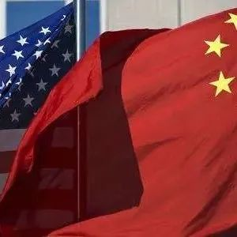

**写留言**
取消

留言

**我的留言**

[写留言](javascript:;)

正在加载
展开我的留言
留言被精选后将公开

**精选留言**

[写留言](javascript:;)

[写留言](javascript:;)

正在加载

已无更多数据

[发消息](javascript:;)

关闭
**写留言**
提交更多

正在加载

[表情](javascript:;)

正在加载

关闭
**留言**
更多

正在加载

正在加载

返回
**写回复**
回复更多

正在加载

: 

[表情](javascript:;)

正在加载

微信扫一扫
关注该公众号

[知道了](javascript:;)

 微信扫一扫
使用小程序

[取消](javascript:void(0);) [允许](javascript:void(0);)

[取消](javascript:void(0);) [允许](javascript:void(0);)

： ， 。  视频 小程序 赞 ，轻点两下取消赞 在看 ，轻点两下取消在看

该账号因违规无法跳转

原文链接：<https://mp.weixin.qq.com/s/UDVMAD0oAFPwXULbrs-y8g>
