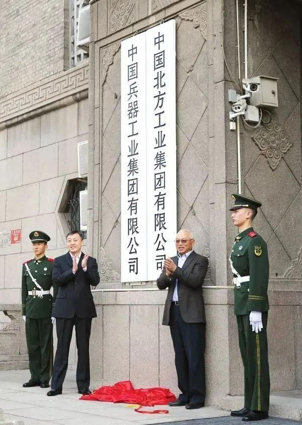

# 中国十大军工集团之中国兵器工业集团

     

## 中国十大军工集团之中国兵器工业集团

天策未来 [小熊军工汇](javascript:void(0);)

**小熊军工汇** 

微信号 gh\_e66ff3a808f6

功能介绍 原军工汇失联 ，聚焦国际军工顶层智慧、传递军事热点、传播国防知识、专注于军工现状及趋势分析，军工材料发展、推介军工企业、产品，军工（旅）原创文章、观点交流、产品投融资服务等

_今天_

收录于话题

**中国兵器工业集团有限公司****（****兵器工业集团****）**

**China North Industries Group Corporation Limited（NORINCO GROUP）**

中国兵器工业集团有限公司是我军机械化、信息化、智能化装备发展的骨干，是全军毁伤打击的核心支撑，是现代化新型陆军体系作战能力科研制造的主体，是国家“一带一路”建设和军民融合发展的主力。
兵器工业集团是各大军工集团中唯一一家面向陆军、海军、空军、火箭军、战略支援部队以及武警公安提供武器装备和技术保障服务的企业集团，除了为陆军提供坦克装甲车辆、远程压制、防空反导等主战装备之外，还向各军兵种提供智能化弹药、光电信息、毁伤技术等战略性、基础性产品。

兵器工业集团现有50余家子集团和直管单位，主要分布在北京、陕西、内蒙古等29个省、市、自治区，在全球70余个国家和地区设立了100余家境外分子公司和代表处。2019年末，集团公司资产总额4284亿元，人员总量22余万人，连续16个年度和5个任期蝉联国务院国资委业绩考核A级，位列世界500强企业排名第154位。

**_01_**

**主营业务**

**装备保障**

★装甲突击

★防空反导

★高效毁伤

★精确打击

★远程压制

★信息夜视

**民品**

★重型装备与车辆（现场混装炸药车、挤压机、盾构机、矿用车、重型机床、北奔重卡、铁路货车、铁路车轴、改装车、汽车门锁、汽车车身安全部件、汽车管路系统、飞轮齿圈总成、汽车制动器、汽车离合器、汽车天线接收系统、微型气体发生器、石油钻具、挖掘机、旋挖钻机、推土机、推油杆、煤矿掘进机、液压支架、北方大客车、塔式起重机等）
★特种化工与石油化工（硝化棉、TDI、成品油、聚烯烃、沥青、润滑油、工业炸药、工业雷管、DNT、硝基二甲苯、工业白油、PC、TDA等）
★光电信息与材料加工（穿戴式虚拟显示器、锗及红外光学元件、LED、光电材料与器件、光电仪器、光伏电池、光学玻璃、人造金刚石、特种钢等）
★北斗产业（北斗地基增强系统研制建设、位置服务运营平台搭建、北斗产业链布局发展、典型行业应用推广、开展海外合作等）

**战略资源**

★石油产业（油气勘探开发、石油产业投资、国际石油贸易、石油炼化、油品储运等）
★矿产产业（海外矿产资源地质勘查、开采、矿石加工、冶炼、矿产品贸易、矿业及相关产业投资运作等）

**流通服务**

★贸易流通（研究解决投资贸易便利化问题，消除贸易和投资壁垒，共建自由贸易区）
★物资流通（大宗工业原材料贸易为主、综合产业链延伸、 供应链整合、物流综合服务）
★金融服务（具有兵器金融特点的完整业务体系）
★工程建设（集项目融资、设计、采购、施工、运营与系统集成能力为一体的综合型国际工程总承包商）

**电子商务**

★兵器工业电子采购商务平台

**_02_**

**子集团和直管单位**

|     |     |
| --- | --- |
| 1   | 中国兵器科学研究院 |
| 2   | 中国北方工业公司 |
| 3   | 中国北方化学工业集团有限公司 |
| 4   | 中国兵工物资集团有限公司 |
| 5   | 兵工财务有限责任公司 |
| 6   | 中国北方车辆研究所 |
| 7   | 西北机电工程研究所 |
| 8   | 西安现代控制技术研究所 |
| 9   | 西安近代化学研究所 |
| 10  | 北方通用动力集团有限公司 |
| 11  | 北方智能微机电集团有限公司 |
| 12  | 北方特种能源集团有限公司 |
| 13  | 北方材料科学与工程研究院有限公司 |
| 14  | 北方光电集团有限公司 |
| 15  | 北方信息控制研究院集团有限公司 |
| 16  | 北方导航控制技术股份有限公司 |
| 17  | 北方夜视科技集团有限公司 |
| 18  | 北方激光研究院有限公司 |
| 19  | 北方通用电子集团有限公司 |
| 20  | 内蒙古第一机械集团有限公司 |
| 21  | 哈尔滨第一机械集团有限公司 |
| 22  | 内蒙古北方重工业集团有限公司 |
| 23  | 北方凌云工业集团有限公司 |
| 24  | 北京北方车辆集团有限公司 |
| 25  | 江麓机电集团有限公司 |
| 26  | 重庆铁马工业集团有限公司 |
| 27  | 湖北江山重工有限责任公司 |
| 28  | 武汉重型机床集团有限公司 |
| 29  | 北奔重型汽车集团有限公司 |
| 30  | 晋西工业集团有限责任公司 |
| 31  | 豫西工业集团有限公司 |
| 32  | 辽沈工业集团有限公司 |
| 33  | 淮海工业集团有限公司 |
| 34  | 西北工业集团有限公司 |
| 35  | 东北工业集团有限公司 |
| 36  | 北方华安工业集团有限公司 |
| 37  | 江南工业集团有限公司 |
| 38  | 山东特种工业集团有限公司 |
| 39  | 北方华锦化学工业集团有限公司 |
| 40  | 中国兵器工业规划研究院 |
| 41  | 中国兵器工业信息中心 |
| 42  | 中国五洲工程设计集团有限公司 |
| 43  | 北方工程设计研究院有限公司 |
| 44  | 中国兵器工业试验测试研究院 |
| 45  | 中国兵器人才学院 |
| 46  | 中国兵工学会 |
| 47  | 北方置业集团有限公司 |
| 48  | 北方发展投资有限公司 |
| 49  | 北京北方节能环保有限公司 |
| 50  | 中兵投资管理有限责任公司 |
| 51  | 中兵北斗产业投资有限公司 |

**_03_**

**上市公司**

****华锦股份****

（股票代码：000059）
**北方华锦化学工业股份有限公司**是兵器集团发展军民融合石油化工和精细化工产业的平台，拥有辽宁盘锦、葫芦岛、新疆库车三个生产基地，形成了石油化工和化学肥料两大主营业务板块，石化板块产品包括柴油、聚乙烯、聚丙烯、聚苯乙烯、ABS、船用燃料油、工业硫磺、石油甲苯、石油混合二甲苯等;化肥板块产品包括尿素、甲醇、液氨等。

**北方国际**

（股票代码：000065）

**北方国际合作股份有限公司**是中国北方工业公司的国际经济技术合作业务板块,是中国对外承包工程商会、中国机电产品进出口商会、中俄机电商会和中国国际经济合作学会会员。北方国际的工程总承包业务专注于国际市场轨道交通、电力、石油与矿产设施建设、工业、农业、市政、房建等专业领域，同世界许多国家和地区建立了广泛的经济技术合作和贸易往来关系，先后在亚洲、非洲、中东等地区，通过国际竞标、议标以EPC、BOT方式总承包了几十个大中型工程项目，近年来按国际工程营业额(和中国万宝工程公司一起排名)一直位于《ENR》杂志全球Top225承包商之列。

 **北化股份**

（股票代码：002246）

**四川北方硝化棉股份有限公司**以专业化生产经营硝化棉系列产品为主，前身为始建于20世纪30年代的中国第一家化学兵工厂。公司总部位于四川成都，生产基地布局在四川泸州、陕西西安、江西泰和，营销网络遍布世界30多个国家和地区。公司能提供全球最齐全的78种产品，形成了完善的以精制棉、硝化棉、木浆粕硝化棉、硝基漆片、硝化棉溶液为布局的产品结构，使SNC的产品覆盖了硝化棉系列产品的所有类型及品种，成为全球产销规模最大的硝化棉供应商，是“世界硝化棉制造商协会”三家执委之一，是唯一能抗衡国际硝化棉巨头的中国本土企业。

**长春一东**

（股票代码：600148）

**长春一东离合器股份有限公司**是中国汽车工业协会离合器委员会理事长单位，公司产品有8大系列32个规格，340种汽车离合器产品投放市场，先后有双质量飞轮、双片膜片弹簧离合器、混合摩擦离合器从动盘总成、大转角减振离合器从动盘总成、免调整离合器、液压减震器、电液综合控制式减震器、混合动力车用复合减震器等17项产品获得国家专利，填补了国内空白。

**光电股份**

（股票代码：600184）

北方光电股份有限公司（原湖北新华光信息材料股份有限公司）主营业务包括光电防务、光电材料与器件、光电太阳能等三大业务板块。在光电防务类产品中，光电股份有着得天独厚的自主研发能力，目前已形成的四大业务板块是：精确制导武器系统、精确制导导引头系列产品、航空显控信息装备系列产品和地面显控信息装备系列产品；在光电材料与器件类产品中，光电股份是国内的光学玻璃材料的生产基地之一。其业务主要从事于研发、生产和销售光电材料、元器件、饰品玻璃材料、特种材料等；在光电太阳能类产品中，自1978年开始研制生产单晶硅太阳电池后，已累计安装了数以万计的高质量的太阳电池发电站，为我国太阳能利用的推广与环境改善做出了突出的贡献。

**北方股份**

（股票代码：600262）

**内蒙古北方重型汽车股份有限公司**是我国专业从事非公路矿用车、相关工程机械及其零部件研发、生产和销售的企业，拥有北方股份科技园、北方股份工业园和工程机械工业园三大园区，占地面积近1000亩，具备年产1000台矿用车的生产能力。公司系列化产品广泛应用于冶金、煤炭、有色、化工、建材、水电、交通基础设施建设七大矿业领域，遍布于国内外500多个大型矿山和重点水利水电工地，特别是在长江三峡工程、黄河小浪底水电站、金沙江溪洛渡水电站等国家重点项目建设及神华集团哈尔乌素矿、华能集团伊敏矿、鞍钢集团齐大山矿、青海木里矿、西藏甲玛矿、海螺集团和华润集团旗下各大水泥矿等大型矿山开发中发挥了重要作用。

**北方导航**

（股票代码：600435）

**北方导航控制技术股份有限公司**前身是国营第218厂，以“导航控制和弹药信息化技术、无人平台技术”为主营业务，是我国唯一的航空光学轰炸瞄准具制造厂。公司近50年来创造了多项第一：第一具航空轰炸瞄准具、第一具航空射击瞄准具、第一台“尖兵一号”侦察卫星相机、第一台620型电脑刺绣机、第一具激光制导照射器、第一具直九武稳瞄跟踪平台。公司的核心使命是坚持武器装备信息化发展方向，构建产研一体、专业鲜明、技术水平高的兵器集团导航与控制产品、环控产品、军民两用无人平台等高新技术产品的产业化基地以及军用电台、军用接插件科研生产基地;大力发展制导火箭武器系统，发展智能化弹药，支撑兵器集团弹药领域转型升级。

**凌云股份**

（股票代码：600480）

**凌云工业股份有限公司**是目前国内最大的汽车塑料管路系统供应商；是国内最早开发车门窗框、钢制辊压保险杠、侧门防撞杆等汽车金属零部件的企业；是国内最早将辊压技术应用于汽车金属结构件生产的厂商之一，也是国内最早有能力与汽车厂家同步设计、开发车门窗框、辊压/冲压钢制保险杠等产品的企业；是“中国市政工程管道系统龙头企业”。公司主导产品为汽车动力系统、制动系统、传动系统、转向系统等配套的汽车塑料及橡胶管路系统产品；汽车车身底盘及安全部件等高强度、轻量化汽车金属零部件产品；汽车传动系统的等速万向节前驱动轴产品；市政工程管道产品。

**晋西车轴**

（股票代码：600495）

**晋西车轴股份有限公司**主要从事铁路车辆、车轴、轮对、转向架等产品的生产销售及自营进出口业务，并在精密锻造和非标制造等方面具备较强的技术和装备实力。公司已具备铁路车轴18万根、铁路货车3000辆、铁路轮对3万套、摇枕侧架5000辆（份）的生产能力。特别是在铁路车轴产品的专业化开发、生产中已跻身全球铁路车轴专业化生产企业第一梯队，车轴产品涵盖国内外各型铁路机车、货车、客车、地铁、轻轨等轨道车辆。铁路车轴、轮对等产品已经出口到北美、南美、欧盟、东亚、东南亚、南亚、澳大利亚等地区和国家。已经与庞巴迪、阿尔斯通、通用、西门子、SCT等跨国公司建立了良好的合作关系，出口铁路车轴及城市轨道交通用车轴代表着我国该领域产品的国际竞争力。

**北方创业**

（股票代码：600967）
**包头北方创业股份有限公司**是中国火炬计划高新技术企业，是中国最具发展潜力和市场竞争力的铁路货车研发制造企业。公司核心业务是铁路货车，目前可生产敞车、罐车、平车、棚车、漏斗车、专用车六大系列四十多个型号的整车产品，具有完善的制动梁、转向架、轮轴等零部件加工制造及配套能力，具备年产各式铁路货车10000辆的生产能力。

**中兵红箭**

（股票代码：000519）

**湖南中兵红箭股份有限公司**是一家以生产军用、民用产品为主的大型军民融合性企业，军品上形成以智能化弹药为核心的“一核五星”产品科研生产结构，是国家重要的弹药研制生产战略基地；民品上，形成了”一主两翼”格局，以超硬材料为主，专用汽车及车用零部件为两翼协同发展。中兵红箭现有8个全资子公司，科研生产区横跨五省（河南省、吉林省、山东省、四川省、江西省）十六园区，是国家二级计量单位、二级理化机构、安全生产标准化一级企业，具有进出口经营权。

**安捷利实业**

（股票代码：01639）

**安捷利实业有限公司**是一家专业从事挠性电路板设计、制造、销售、SMT装配和COF模组服务的香港上市公司，产品广泛销往日本、韩国、美国、欧洲及大中华地区。安捷利公司已在中国设立了广州工厂和苏州工厂，同时分别在中国华南、华东等地设立销售办事处，并在韩国、美国和欧洲设立销售公司和销售代理，为客户提供最快捷周到的本地化服务。

**_04_**

**科研院所**

 内蒙古金属材料研究所

（52所）

国防系统从事兵器材料的综合性研究所之一，主要从事黑色与有色金属材料、复合材料、陶瓷材料、特种功能材料、粉末冶金材料、焊接材料、稀土材料以及与之相配套的工艺技术、工程力学、分析仪器，模拟实验技术的应用研究和技术开发。

 山东非金属材料研究所

（53所）

从事国防非金属材料开发与应用的专业研究所、国防科工委化学计量一级站、全国化工标准物质研究开发中心、兵器工业非金属材料理化检测中心。主要从事先进树脂基复合材料、隐身材料、高性能工程塑料的改性与应用、功能高分子材料、烧蚀与热防护材料、特种橡胶制品、密封材料、胶粘剂等应用研究；负责国防最高化学计量标准的建立、维护、应用、化学计量器具校准检定；从事化学计量校准技术、标准物质、标准方法等研究和理化测试与无损检测、环境试验等研究及技术服务工作。

长春设备工艺研究所

（55所）

主要从事兵器工业先进制造技术的预先研究、应用研究及先期技术开发，为兵器工业及制造领域提供成套的先进技术及专用设备，设有数字化制造技术研究室、装药工程技术研究室、旋压技术研究室、超精密加工技术研究室和试制工厂。专业研究方向主要是：兵器先进制造技术发展规划，武器装备制造信息化与系统集成技术，弹箭装药技术，火工品安全制造与装配技术，火炸药柔性化制造技术，特种加工技术，军工制造先进工艺装备技术，军工制造自动化技术。

中国北方发动机研究所

（70所）

我国唯一的坦克装甲车辆发动机专业研究所，主要承担着我国坦克装甲车辆发动机的研究与开发任务，各型产品主要装备于主战坦克、自行火炮、步兵战车等重型装备，在三军动力装备研制中率先具备自主研发能力，出色地完成了国庆五十周年、六十周年阅兵典礼、纪念抗战胜利70周年 “9.3”阅兵、纪念建军90周年“朱日和”阅兵、坦克“现代两项”竞赛等多项国家级保障任务。在民品领域，开发了增压器、电子控制、光整机、高铁智能清洗机器人等系列民用产品，

 中国北方车辆研究所

（201所）

我国装甲装备总体单位和兵器地面无人平台研发中心，下设7个技术部、2个中心、2个国家级重点试验室，建有北方汽车质量监督检验鉴定试验所、中关村军民融合创新园、博士后科研工作站和中国无人系统院士（专家）工作站，拥有整车性能、综合传动、道路模拟、电磁兼容、动力电池、车辆环境等50余个行业一流现代化试验室，成功研制了以一代水陆坦克、二代步兵战车、三代主战坦克为代表的30余种装甲装备，在总体、传动、行动、防护、火控、无人、两栖、混合动力、机电、信息等技术领域形成鲜明特色，系列研发了防暴车、路障车、无人车、轨道交通、悬置系统、AT、油气悬挂、散热器、加温器等民用产品。

 西北机电工程研究所

（202所）

集机械、电子、液压、自控、测试、光学、工程力学、计算机科学、智能控制等多学科为一体的大型综合应用技术研究所和国家级行业技术研究开发中心。建所60年以来，共取得各项科研成果700余项，获得国家级发明奖和科技进步奖30余项，省部级科技进步奖近300项。其中，抓总研制的两个国家级重点型号项目分获国家科技进步一等奖，抓总研制的7型装备先后参加了建国50周年、60周年国庆和纪念抗日战争胜利70周年以及建军90周年阅兵庆典。

 西安现代控制技术研究所

（203所）

我国“制导兵器研究开发中心”和“弹药技术研究开发中心”，主要从事精确打击、远程压制、高效毁伤等领域战术导弹、制导弹药和灵巧弹药武器系统总体及主要部件的研制。研制出导弹、火箭和智能弹药等武器装备20多种，10多种产品已分别装备到陆军、陆航、空军等部队并形成了战斗力。全所设有机械控制总体、电子控制总体、光学控制总体、电气与检测、发动机、发射器、舵机、空气动力、半实物仿真等研究室；拥有光学、电子、计算机、自动控制、机械设计与制造、爆炸力学、高分子材料、仿真、空气动力学等20多种专业；拥有先进的仿真实验室、风洞实验室、毫米波实验室及大型CAD实验室等，试验手段先进；拥有国内一流水平的实验室和仪器设备。

 西安近代化学研究所

（204所）

我国最大的化学含能材料研究中心，主要从事含能材料、爆炸与燃烧科学、有机化学、应用化学、高分子材料、精细化工、电子仪表及分析测试技术的研究开发。火炸药燃烧国防科技重点实验室、火炸药计量一级站、中国兵器工业二炮常规战斗部研发中心、中国兵器工业集团化工产品质量检验中心、火炸药理化检测中心、陕西省氟化工工程中心均依托建在所内。

 西安应用光学研究所

（205所）

前身是军用光学仪器研究所，从最初从事炮兵光学仪器研究的军用光学仪器研究所，逐步发展成为以开展侦察预警、光电系统集成和计量技术研究为主，产品服务于陆、海、空、火箭等多军兵种的光电系统工程总体研究所，是我国国防光电领域最重要的研究机构之一。国防科技工业光学一级计量站和微光夜视技术国防科技重点实验室的依托单位，是国家批准的博士、硕士研究生招收和培养单位，设有博士后科研工作站。

 西安电子工程研究所

（206所）

国家重点电子工程技术开发、研制及批量生产的整机研究所。主要从事电子工程、通信、微波、毫米波、自动控制、信号处理、计算机、无线电计量、电子结构、高精度传动结构等高新技术领域的开发应用研究工作。先后研制了一批拥有自主知识产权的兵器雷达产品，雷达装备服务于国际国内两个市场，获得了360多项重大科技成果，已经形成了一批处于国内领先水平并具有国际竞争优势的专业技术，尤其是在相控阵天线、低相噪频率合成、信号处理、微波毫米波技术等专业领域的应用研究方面成果显著。同时，开发有卫星及微波数传通信、交通监理、自动化控制及广播、电视、电教辅助设备等系列产品。

 北方自动控制技术研究所

（207所）

研究领域涉及自动控制、系统工程、计算机、综合电子信息工程、定位定向与导航、多传感信息处理与融合、多媒体信息传输与显示、计算机、人工智能与模式识别、仿真建模等，拥有“系统动态仿真实验室”等十多个现代化实验室，开发的矿用运输信、集、闭系统及煤矿机车监测报警器、系列机动车驾驶员理论考试计算机系统、智能桩考系统、数字温湿度智能监测控制系统、自动防眩目后视镜、称重监控管理系统等一系列产品，在全国广泛应用于电力、能源、安防、公安、交通、煤矿、企业信息化、自动测控等领域。

 西南技术物理研究所

（209所）

以光电技术和制导技术为两大专业方向，在武器系统、激光探测器、激光光电材料、激光器、激光应用产品、光电及复合制导、光电对抗、光电信息等领域具有技术优势、拥有多个系列产品、并能承担大型工程型号产品研制任务的综合实力较强的光电技术科研生产一体化的企业集团。在民品研制领域，研发业务涵盖激光晶体材料、光电信息产品、激光及光电应用产品、北斗应用等产品的研制、为新一代边智能安防、边海防管控、智慧城市、北斗+行业应用等提供解决方案。

 北方科技信息研究所

（210所）

兵器行业唯一从事科技信息和图书出版的研究所，科技信息研究工作主要包括：科技信息咨询研究、信息传媒、数据库及软件开发、多媒体声像制作、文献资源搜集加工与服务等。其中，科技信息咨询研究主要从事军工产品及相关技术、国防经济、先进制造技术等领域的信息搜集、分析研究与咨询服务；多媒体声像中心设备先进，主要从事三维动画、网络流媒体、声像片等多媒体产品制作。

 昆明物理研究所

（211所）

国内最早从事红外科学与技术研究的高新技术研究所之一，围绕红外热成像技术的发展，研究开发与生产领域包括红外探测器材料、红外探测器、杜瓦瓶、微型制冷、红外光学材料及镀膜、电子信号处理、光机扫描、红外望远镜、热成像系统以及相应的红外测试技术。

 西安机电信息研究所

（212所）

专门从事电子技术和机电一体化产品开发、研制、主产的多学科综合性与高新技术密集型研究所，拥有机械、无线电、激光、红外、磁、声等专业技术，在计算机应用、工业自动控制、机械设计、电化学应用等方面具有雄厚的技术实力。在测试技术研究方面取得了令人瞩目的成绩，除了专业测试技术外；在通用测试技术方面已形成动态特性模拟测试、目标特性测试及遥测三大技术领域。拥有国际先进水平的电波暗室、遥测实验室、低频实验室等10多个现代化大中型实验室，以及具有国际先进水平的机电工程与控制国家级重点实验室。

 陕西应用物理化学研究所

（213所）

国家唯一的火工烟火技术专业研究所，火工行业理化分析及性能检测中心和国家民用爆破器材质量监督检验中心，国防科技重点实验室"火工品安全性可靠性技术实验室"的依托单位。在火工领域、爆破器材领域处于国家领先地位。

 华东光电集成器件研究所

（214所）

兵器工业集团中唯一从事专用微电子器件研制和生产的专业研究所，经过近40年的建设和发展，逐步形成了半导体器件、混合器件、集成化模块、可靠性技术与试验等四个技术领域。在高密度混合集成、LTCC片式器件集成、多芯片组件、抗高过载加固等基础技术方面和红外读出电路、集成式平板显示器、智能化传感器模块、模块化计算机组件、半导体FFT转换器等专用器件(组件)方面达到了国内领先水平或填补了国内产品空白。

【重要通知】

**防止失联**

请一定长按扫码

**关注右方小号（备用号）**

内容来源丨 央视网

> [名单刷新！2020最新央企名录及其行政级别划分](http://mp.weixin.qq.com/s?__biz=MzI4NDcxNDIwOQ==&mid=2247501654&idx=1&sn=4e667101b3cb925d146fa9d1088e11a8&chksm=ebf5b2d8dc823bcee8c6e28e81a76b3daf7f834f20ad8619ce61683f5e2a9ad049e682dcb5fa&scene=21#wechat_redirect)
> 
> [《武器装备科研生产许可申请指南》微视频](http://mp.weixin.qq.com/s?__biz=MzI4NDcxNDIwOQ==&mid=2247503905&idx=1&sn=9a3a91dad102bef9676dc2d3202215f9&chksm=ebf5a5afdc822cb94ce4edb02eb6489d3e27c0de707668832d5d219bf86e5827c499cc6fdf7d&scene=21#wechat_redirect)
> 
> [军工行业十四五规划特点及细分赛道梳理](http://mp.weixin.qq.com/s?__biz=MzI4NDcxNDIwOQ==&mid=2247503161&idx=1&sn=7c403d4bab7bfea15c135a761eb2704c&chksm=ebf5b8b7dc8231a13353339ec356d6a37ee873cfce54628404a1c312bc992c32b6573bdf7850&scene=21#wechat_redirect)
> 
> [军工“十四五”，武器装备进入放量建设战略五年](http://mp.weixin.qq.com/s?__biz=MzI4NDcxNDIwOQ==&mid=2247502681&idx=1&sn=803dbf56aaa25de8d55329f08ef8c662&chksm=ebf5bed7dc8237c17b86036c6bfaa496dbde42937bb597b6ff4fda6be18870e7b280e87263ae&scene=21#wechat_redirect)
> 
> [中国电子科技集团报告](http://mp.weixin.qq.com/s?__biz=MzI4NDcxNDIwOQ==&mid=2247503828&idx=1&sn=5e90ffddd9968e659ddf05a32db145b4&chksm=ebf5ba5adc82334c257ec61d695930250bcf95344c6e4ae78052d0429b0dadc19b93bdd947b5&scene=21#wechat_redirect)
> 
> [政府采购六种采购方式流程图](https://mp.weixin.qq.com/s?__biz=MzI4NDcxNDIwOQ==&mid=2247484547&idx=3&sn=ab55f95a5a5c96227f8a47a7fab10d5f&chksm=ebf6710ddc81f81b1ab9efcb8d9b521eeb2db8b1cd586fdbb2e595760db0ba334d7fc4fb1534&token=1582924943&lang=zh_CN&scene=21#wechat_redirect)

编辑声明：本平台发布部分内容来自公开资料或网络，版权归原作者所有，转载目的在于传递信息及用于网络分享，不代表本号赞同其观点和对其真实性负责，如涉版权问题，请联系我们删除！

**精彩内容长按二维码即可关注**

预览时标签不可点

收录于话题 #
个
上一篇 下一篇

阅读

分享 收藏
赞 在看

已同步到看一看[写下你的想法](javascript:;)

前往“发现”-“看一看”浏览“朋友在看”

前往看一看

**看一看入口已关闭**
在“设置”-“通用”-“发现页管理”打开“看一看”入口
[我知道了](javascript:;)

已发送

取消

#### 发送到看一看

发送

中国十大军工集团之中国兵器工业集团

最多200字，当前共字

发送中

喜欢此内容的人还喜欢

微信扫一扫
关注该公众号

 微信扫一扫
使用小程序

[取消](javascript:void(0);) [允许](javascript:void(0);)

[取消](javascript:void(0);) [允许](javascript:void(0);)

[知道了](javascript:;)

**长按识别前往小程序**

原文链接：<https://mp.weixin.qq.com/s/Ytx1qf_jXJVLdE62bKshEg>
