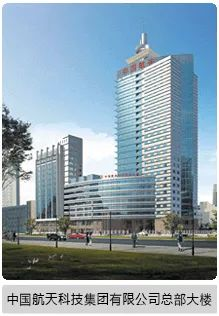
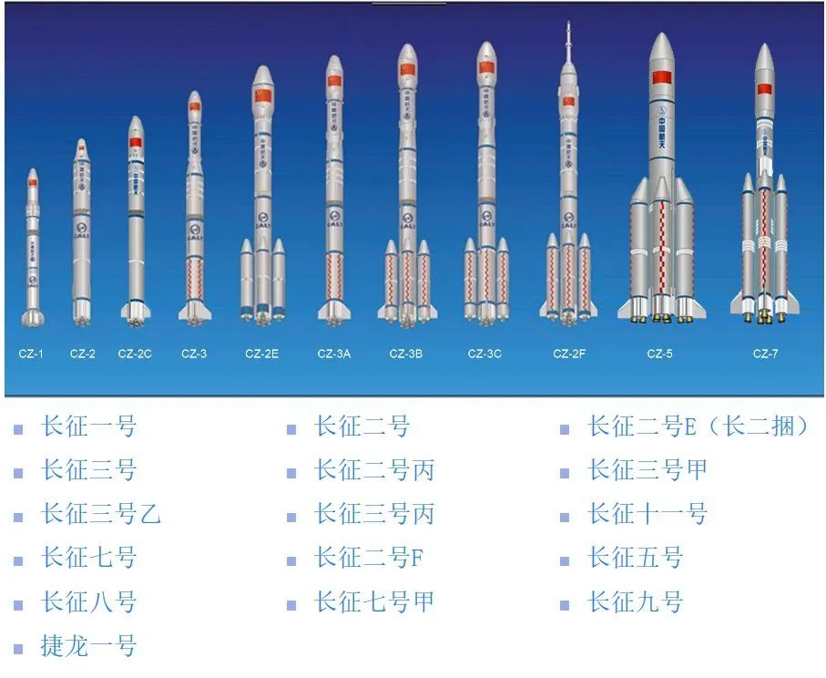
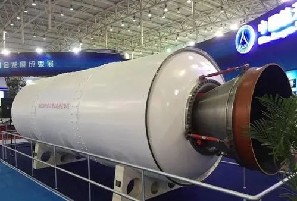
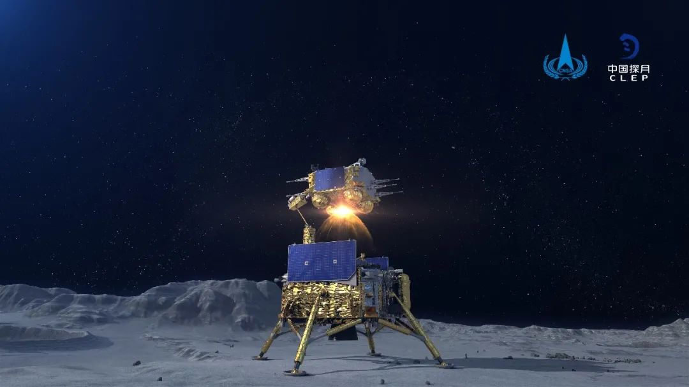
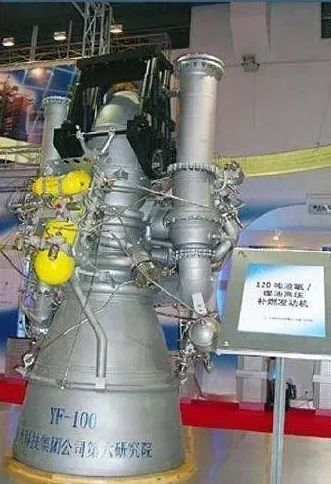
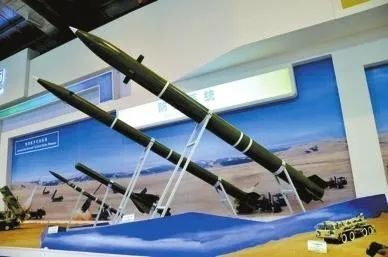
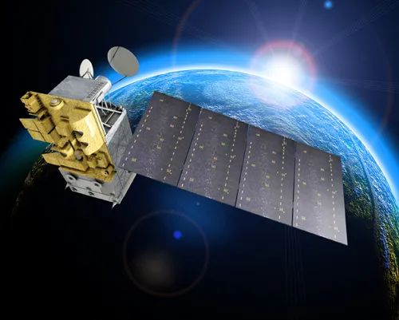
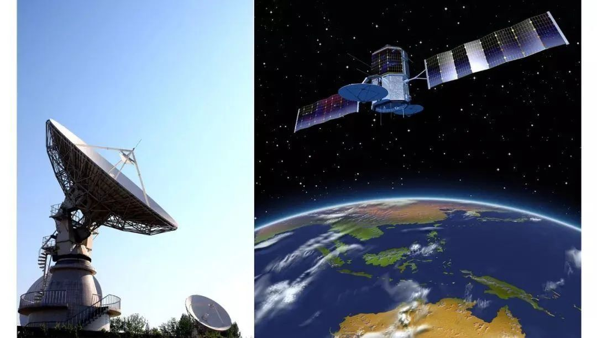
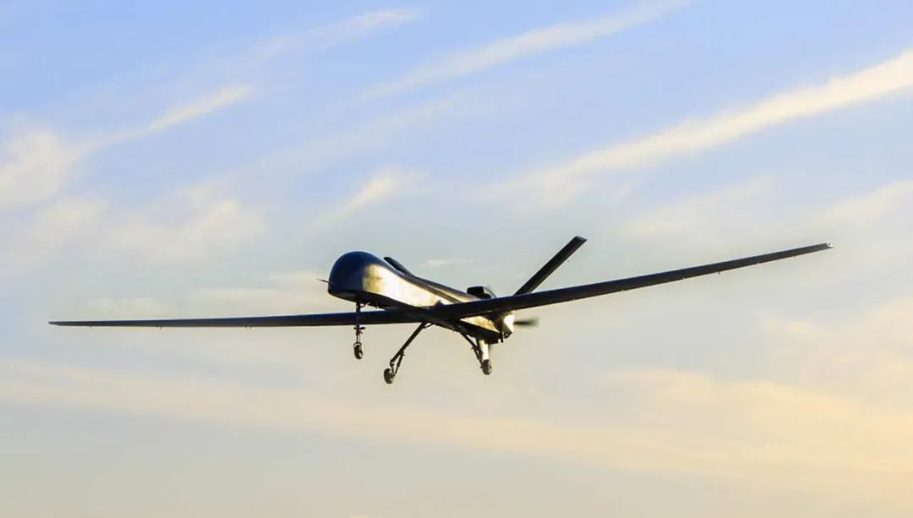

# 中国十大军工集团之中国航天科技集团

     

## 中国十大军工集团之中国航天科技集团

天策未来 [小熊军工汇](javascript:void(0);)

**小熊军工汇** 

微信号 gh\_e66ff3a808f6

功能介绍 原军工汇失联 ，聚焦国际军工顶层智慧、传递军事热点、传播国防知识、专注于军工现状及趋势分析，军工材料发展、推介军工企业、产品，军工（旅）原创文章、观点交流、产品投融资服务等

_1周前_

收录于话题

**中国航天科技集团有限公司**（简称“航天科技”或“中国航天”）****

**China Aerospace Science and Technology Corporation（CASC）**

中国航天科技集团公司是根据国务院深化国防科技工业管理体制改革的战略部署，经国务院批准，于1999 年7 月1 日在原中国航天工业总公司所属部分企事业单位基础上组建的国有特大型高科技企业，是国家授权投资的机构，由中央直接管理。历经第七机械工业部、航天工业部、航空航天工业部、中国航天工业总公司和中国航天科技集团公司的历史沿革。世界500强企业之一。

**_01_**

**主要业务**

**宇航产品**

★长征系列运载火箭
★通信、导航、遥感、科学探测与技术测试等卫星系列
★北斗导航工程的运载火箭和绝大多数卫星的研制
★高分辨率对地观测系统中天基系统
★载人飞船、货运飞船、运载火箭、空间实验室和空间站
★探月工程月球探测卫星及其运载火箭

**导弹武器**

★战略核导弹
★常规地地导弹
★防空反导装备
★无人机及其他装备

**航天技术应用**

★卫星应用、特种装备、节能环保装备、先进材料及应用、电子信息产品
★卫星地面设备制造、卫星运营、空间环境应用、长输管线输油泵、特种车辆、增雨防雹火箭、煤气化设备、烟气脱硫装置、太阳能发电、双金属复合管、稀土电机、绿色印刷材料、微电子元器件测试、芯片、工程咨询

**航天服务业**

★卫星及其地面运营服务、金融服务、国际化服务、信息与软件服务、产业基地配套开发
★为宇航系统、导弹武器系统和航天技术应用产业提供服务

**_02_**

**大型科研生产联合体**

中国运载火箭技术研究院

（航天一院）

导弹运载火箭总体设计生产总装

航天动力技术研究院

（航天四院）

航天固体燃料发动机研制生产实验

中国空间技术研究院

（航天五院）

载人航天、深空探测、导航定位、对地观测、通信广播、空间科学与技术试验等六大领域航天器研制生产

航天推进技术研究院

（航天六院）

液体火箭发动机研制和专业抓总

四川航天技术研究院

（航天七院）

导弹研制生产总装

上海航天技术研究院

（航天八院）

战术导弹、运载火箭、载人航天、深空探索等等航天技术研究

中国航天电子技术研究院

（航天九院）

惯性导航、遥测遥控、航天计算机及软件、微电子、机电组件等传统优势专业技术

中国航天空气动力技术研究院

（航天十一院）

空气动力学、特种飞行器、航天技术应用

**_03_**

**专业公司**

|     |     |
| --- | --- |
| 1   | 中国卫通集团股份有限公司 |
| 2   | 中国乐凯集团有限公司 |
| 3   | 中国长城工业集团有限公司 |
| 4   | 中国四维测绘技术有限公司 |
| 5   | 航天科技财务有限责任公司 |
| 6   | 航天投资控股有限公司 |
| 7   | 中国航天国际控股有限公司 |
| 8   | 北京神舟航天软件技术有限公司 |
| 9   | 深圳航天科技创新研究院 |
| 10  | 航天长征国际贸易有限公司 |
| 11  | 东方红卫星移动通信有限公司 |

**_04_**

**直属单位**

中国航天系统科学与工程研究院

中国航天标准化与产品保证研究院

中国航天科技国际交流中心

航天档案馆

航天通信中心

**_05_**

**上市公司**

**中国卫星**（600118）

中国东方红卫星股份有限公司是中国航天科技集团公司第五研究院控股的上市公司，是专业从事小卫星及微小卫星研制、卫星地面应用系统及设备制造和卫星运营服务的航天高新技术企业。 

**航天机电**（600151）

上海航天汽车机电股份有限公司成立于1998年5月28日，同年6月5日在上海证券交易所挂牌上市，是中国首家以“航天”命名的上市公司，是航天技术应用产业化的重要平台。

**航天动力**

陕西航天动力高科技股份有限公司于1999年12月由我国航天科技工业公司的部分核心单位发起设立，是以航天军工流体技术（包括液体、气体）和惯性导航技术为核心技术，以从事系列民用产品的设计、开发、生产和销售为主营业务的技术密集型公司。

**航天电子**（600879）

航天时代电子技术股份有限公司是中国航天科技集团公司旗下从事航天电子测控、航天电子对抗、航天制导、航天电子元器件专业的高科技上市公司。产品主要包括：高性能传感器、无线电测量控制系统、特种电子通信、自动跟踪系统和数据收集、传输处理系统、卫星电视广播系统，数字化有线电视网络设备，卫星通信地球站，星上精密机构及结构部件，大型地面工程业务测控站和电子支持设备，以及火箭、卫星、舰船、飞机、核能等产品配套使用的各种电连接器、继电器、电子仪器设备、电缆网及开关设备，GPS/GLONASS/北斗卫星导航应用系统及终端设备等。

**中国航天万源**（1185）

中国航天万源国际（集团）有限公司是中国运载火箭技术研究院的控股子公司，原为航天科技通信有限公司。主营业务为国家鼓励、支持的新能源、新材料应用和环保领域；成为从事以风机研发制造和风电场开发为代表的风电产业、以稀土电机应用为代表的节能产业、以汽车发动机管理系统为代表的环保产业的多元化业务上市公司。

**中国航天控股**（31）

中国航天国际控股有限公司作为航天控股的大股东，是中国进行空间技术和产品（航天器、运载火箭、卫星等）的开发、研究、生产和商用的企业，拥有雄厚的专业人才资源和技术力量优势。

**亚太卫星**（1045）

亚太卫星控股有限公司全资拥有亚太通信卫星有限公司及其附属公司，自一九九二年开始营运，现拥有和经营有亚太1号、亚太1A、亚太2R、亚太5号及亚太6号五颗在轨卫星（「亚太卫星系统」），覆盖亚洲、欧洲、非洲和澳洲等全球约75%人口之地区，为这些地区之广播和电信客户提供。

**乐凯胶片**（600135）

乐凯胶片股份有限公司主营彩色胶卷、彩色相纸、彩色电影正片、感光材料、信息影像材料加工用药液及相关化学品、彩扩设备、与银盐产品相关的数码影像材料（不含危险化学品）、膜及带涂层的膜类加工产品（屏蔽膜、导电膜、功能膜、保护膜、离型纸）的研制、生产、销售（法律、法规国务院决定禁止或需审批的除外）；本企业所需的原辅材料、机械设备、配套产品、零部件及相关技术的科研、生产、销售（国家有专项规定的除外）。本企业自产产品和技术的出口业务和本企业所需的原辅材料、机械设备、零配件及相关技术的进口业务（国家限定公司经营或禁止进出口的商品和技术除外）。

**航天工程**

航天长征化学工程股份有限公司以航天粉煤加压气化技术为核心，是专业从事煤气化技术及关键设备的研发、工程设计、技术服务、设备成套供应及工程总承包的工程公司，拥有航天粉煤加压气化技术发明专利、气化炉燃烧器发明专利等42项专利技术，拥有化工石化医药行业（化工工程、石油及化工产品储运、生化、生物药、中成药）甲级工程设计资质，拥有压力容器A1/A2/A3/SAD级设计资质、压力管道GB类/GC类/GD类设计资质。

**乐凯新材**

保定乐凯新材料股份有限公司是国内信息记录材料行业中同时从事磁记录和热敏记录材料领域的龙头企业。主要产品包括热敏磁票、磁条、磁卡，其中，热敏磁票获得“国家重点新产品证书”、“河北省科技进步二等奖”等多项荣誉；磁条及PET磁卡产品获得河北省科技厅颁发的“高新技术产品证书”。

**康拓红外**

北京康拓红外技术股份有限公司隶属于中国航天科技集团公司中国空间技术研究院，是重要的中国铁路车辆运行安全检测装备和服务的供应商，致力于提供一流的铁路安全产品和领先的解决方案。公司主营产品为铁路车辆红外线轴温智能探测系统(THDS)、铁路车辆运行故障动态图像检测系统(TFDS)、机车车辆检修自动化立体库、铁路车辆信息化产品，市场份额一直保持行业前列。

**航天彩虹**（002389）

航天彩虹无人机股份有限公司是中国航天科技集团公司第十一研究院控股的上市公司，主要从事彩虹系列无人机以和新材料产品的设计研发及生产。

**中国卫通**（601698）

中国卫通集团股份有限公司是中国航天科技集团有限公司从事卫星运营服务业的核心专业子公司，通过投资、建设和运营通信广播卫星及配套地面测控和监测系统，为用户提供广播电视、通信、视频、数据等传输服务。作为我国唯一拥有自主可控商用通信广播卫星资源的基础电信运营企业，中国卫通目前运营管理着16颗商用通信广播卫星，资源覆盖中国全境、澳大利亚、东南亚、南亚、中东、欧洲、非洲等地区，综合实力排名全球第6位。

**中天火箭**

陕西中天火箭技术股份有限公司是在中国航天科技集团公司第四研究院民品产业的基础上经过改制、资源整合组建成立的军民融合型高新技术企业，主要从事小型固体火箭及其延伸产品的研发、生产和销售，在固体火箭、先进材料、智慧交通等领域深耕多年，产品涵盖军民两用领域，可提供无人机机载制导武器、人工影响天气装备、气象探空火箭、高空科学试验平台、高性能耐高温耐烧蚀材料、公路在线实时计量设施、综合系统集成等产品和技术服务。

【重要通知】

**防止失联**

请一定长按扫码

**关注右方备用号**

    

内容来源丨智天策

> [名单刷新！2020最新央企名录及其行政级别划分](http://mp.weixin.qq.com/s?__biz=MzI4NDcxNDIwOQ==&mid=2247501654&idx=1&sn=4e667101b3cb925d146fa9d1088e11a8&chksm=ebf5b2d8dc823bcee8c6e28e81a76b3daf7f834f20ad8619ce61683f5e2a9ad049e682dcb5fa&scene=21#wechat_redirect)
> 
> [《武器装备科研生产许可申请指南》微视频](http://mp.weixin.qq.com/s?__biz=MzI4NDcxNDIwOQ==&mid=2247503905&idx=1&sn=9a3a91dad102bef9676dc2d3202215f9&chksm=ebf5a5afdc822cb94ce4edb02eb6489d3e27c0de707668832d5d219bf86e5827c499cc6fdf7d&scene=21#wechat_redirect)
> 
> [军工行业十四五规划特点及细分赛道梳理](http://mp.weixin.qq.com/s?__biz=MzI4NDcxNDIwOQ==&mid=2247503161&idx=1&sn=7c403d4bab7bfea15c135a761eb2704c&chksm=ebf5b8b7dc8231a13353339ec356d6a37ee873cfce54628404a1c312bc992c32b6573bdf7850&scene=21#wechat_redirect)
> 
> [军工“十四五”，武器装备进入放量建设战略五年](http://mp.weixin.qq.com/s?__biz=MzI4NDcxNDIwOQ==&mid=2247502681&idx=1&sn=803dbf56aaa25de8d55329f08ef8c662&chksm=ebf5bed7dc8237c17b86036c6bfaa496dbde42937bb597b6ff4fda6be18870e7b280e87263ae&scene=21#wechat_redirect)
> 
> [中国电子科技集团报告](http://mp.weixin.qq.com/s?__biz=MzI4NDcxNDIwOQ==&mid=2247503828&idx=1&sn=5e90ffddd9968e659ddf05a32db145b4&chksm=ebf5ba5adc82334c257ec61d695930250bcf95344c6e4ae78052d0429b0dadc19b93bdd947b5&scene=21#wechat_redirect)
> 
> [政府采购六种采购方式流程图](https://mp.weixin.qq.com/s?__biz=MzI4NDcxNDIwOQ==&mid=2247484547&idx=3&sn=ab55f95a5a5c96227f8a47a7fab10d5f&chksm=ebf6710ddc81f81b1ab9efcb8d9b521eeb2db8b1cd586fdbb2e595760db0ba334d7fc4fb1534&token=1582924943&lang=zh_CN&scene=21#wechat_redirect)

编辑声明：本平台发布部分内容来自公开资料或网络，版权归原作者所有，转载目的在于传递信息及用于网络分享，不代表本号赞同其观点和对其真实性负责，如涉版权问题，请联系我们删除！

**精彩内容长按二维码即可关注**

预览时标签不可点

收录于话题 #
个
上一篇 下一篇

阅读

分享 收藏
赞 在看

已同步到看一看[写下你的想法](javascript:;)

前往“发现”-“看一看”浏览“朋友在看”

前往看一看

**看一看入口已关闭**
在“设置”-“通用”-“发现页管理”打开“看一看”入口
[我知道了](javascript:;)

已发送

取消

#### 发送到看一看

发送

中国十大军工集团之中国航天科技集团

最多200字，当前共字

发送中

喜欢此内容的人还喜欢

微信扫一扫
关注该公众号

 微信扫一扫
使用小程序

[取消](javascript:void(0);) [允许](javascript:void(0);)

[取消](javascript:void(0);) [允许](javascript:void(0);)

[知道了](javascript:;)

**长按识别前往小程序**

原文链接：<https://mp.weixin.qq.com/s/WexC2l_gNIiX1iYybWSOFQ>
