# 中国电子科技集团报告：军工电子国家队，自主可控核心力量

     

## 中国电子科技集团报告：军工电子国家队，自主可控核心力量

中航证券 [小熊军工汇](javascript:void(0);)

**小熊军工汇** 

微信号 gh\_e66ff3a808f6

功能介绍 原军工汇失联 ，聚焦国际军工顶层智慧、传递军事热点、传播国防知识、专注于军工现状及趋势分析，军工材料发展、推介军工企业、产品，军工（旅）原创文章、观点交流、产品投融资服务等

_1月12日_

收录于话题

**文 张超 梁晨 宋博 刘琛** 

**要点**

**中国电子科技集团**是我国**十大军工集团**之一，是在原信息产业部直属研究院所和高科技企业基础上组建而成的国有**大型高科技企业集团**，主要从事国家重要军民用大型电子信息系统的工程建设，重大装备、通信与电子设备、软件和关键元器件等。中国电科是国内唯一覆盖电子信息全领域的大型科技集团；国内唯一在国家海洋、太空、网络三大战略领域发挥重要作用的军工集团；国内唯一能够同时为各军兵种全方位提供信息化武器装备的军工集团；国内唯一能够为我军各种型号的装备提供各类关键元器件的企业集团。

**①军工电子国家队，电子信息技术产业领头羊**

**中国电科2018年营收规模为2204.27亿元，同比增长8.08%，利润总额213.48亿元，同比增长4.82%**，连续15年获得中央企业经营业绩考核A级。十八届三中全会以来，中国电子科技集团公司加快全面深化改革，提出“三层架构、两级经营”主营业务组织体系改革建设。目前改革进程不断加速，子集团框架逐步成型。十三五期间，集团公司确定了“一五五三”的集团发展战略，聚焦网络信息体系主责主业，持续推动集团发展。

**②军民融合示范型企业、天地一体化信息网络建设主力军**

**公司主营业务主要分为军品和民品两大部分，军民业务比在4:6左右，是典型的军民融合集团企业。**集团基本实现电子信息化产业链的全布局，军品方面，如雷达产品既是中游系统级产品，主要给飞机、舰船等配套，同时又是下游整机产品，如防空、空管雷达等。民品方面，集团坚持自主可控，在一些关键软硬件系统以及终端产品方面都取得了突破，具有一定市场地位。在上游的基础元器件方面，集团涉猎更广，基本可以覆盖集团中下游产品需求。

**中国电科是天地一体化信息网络方案论证与实施的牵头企业。**天地一体化信息网络是科技创新2030重大项目中首个启动的重大工程项目，目前中国电科为项目设立的天地网络公司开始实体化运行。当天地一体化信息网络“编织”完成后，将形成“全球覆盖、随遇接入、按需服务、安全可信”的天地一体化信息网络，为陆、海、空、天各类用户提供信息服务。

**③中国电科是自主可控关键环节突破的核心力量**

**中国电科在上游基础领域中的核心元器件、软件，以及下游关键系统中的北斗导航等自主可控关键环节贡献突出。**电科14所和38所自主研制的DSP芯片实现突破、太极子集团在数据库、操作系统等基础软件上取得一系列成就。在中美博弈的环境下，面对封锁，中国电科将通过技术积累以及创新体系成为我国实现自主可控关键领域的核心力量。

**④院所改制、混改提速，核心资产逐步实现资产证券化**

**院所改制的先锋军，子集团下的改制创新：**中国电科下属4家科研院所入选首批41家军工科研院所转制工作。同时中国电科以子集团为平台整合自身院所资产，并实现院所核心资产的“改制”，促进了我国科研院所改制的多元化发展。

**探索多种形式混改，以“混资本”促进“改机制”：**中国电科明确将二级及以下企业层面推进混改，通过引进战略投资、员工持股、社会资本、股权置换等多种形式实现股权多元化，深层次激发集团内部活力。2020年3月，华为入股电科仪器仪表，加大在新基建、5G领域的合作。

**资本运作提质增速，内部整合与外延并购双轮驱动：**中国电科通过“三层架构、两级经营”，借助子集团下的上市平台开展内部收购，既实现了业务整合，也提高集团资产证券化率。此外，上市公司层面通过外延式并购逐步补齐业务短板，同时子集团层面入股优秀民营企业，丰富相关业务产业链。

**⑤中国电科旗下上市公司**

国睿科技600562.SH（背靠14所，重大重组基本落定）

四创电子600990.SH（背靠38所，聚焦雷达主业）

杰赛科技002544.SZ（积极拓展布局，子集团资本运作可期）

太极股份002368.SZ（深耕党政军软件，安可业务迎来成长）

卫士通002268.SZ（背靠网安子集团，网络安全优质企业）

华东电脑600850.SH（信息子集团组建，或受益于股东资本运作）

海康威视002415.SZ（安防视频龙头，创新产品拓展）

凤凰光学600071.SH（子集团资产注入，推动转型升级）

天奥电子002935.SZ（背靠电科10所，时间频率产品军用龙头）

\*ST电能600877.SH（力神子集团收购中国嘉陵，打造军工电源上市平台）

**风险提示：**集团人事变动；西方对华封锁等国际事态加剧；院所改制、混改进度缓慢；国内政策变动等。

**一、中国电科—军工电子国家队**

**1.1.国内电子信息技术产业领头羊**

中国电子科技集团公司（以下简称“中国电科”）是经国务院批准，在原信息产业部直属46家电子类科研院所及26户企业基础上组建而成，2002年3月1日正式挂牌运营，2017年12月，中国电科完成公司制改制，由中国电子科技集团公司更名为中国电子科技集团有限公司。截至2020年1月，中国电科有二级成员单位50家，上市公司10家。在职职工19万余人，工程院院士11名。拥有国家级重点实验室18个，国家级研究中心和创新中心10个，北京、天津、重庆等地高科技园区和产业基地10余个。

图表 1 电子科技集团发展历程

资料来源：集团官网，环球网，百度百科，中航证券金融研究所整理

中国电科是电子信息行业的核心科技力量，主营包括军民用大型电子信息系统的工程建设，重大电子装备、软件、基础元器件和功能材料等研制生产。

军品业务承担了国防和军队电子信息装备科研生产及保障任务，中国电科是国内唯一覆盖电子信息全领域的大型科技集团；国内唯一在国家海洋、太空、网络三大战略领域发挥重要作用的军工集团；国内唯一能够同时为各军兵种全方位提供信息化武器装备的军工集团；国内唯一能够为我军各种型号的装备提供各类关键元器件的企业集团。

民品业务发展也较为迅速，各产品在国内市场保持高占有率，其中安防监控产品国内市场占有率第一，视频监控产品位居国际第一，特种通信产品占据市场主导地位以及国产太阳能光伏设备市场占有率达到85%以上。

图表 2 中国电科主要业务

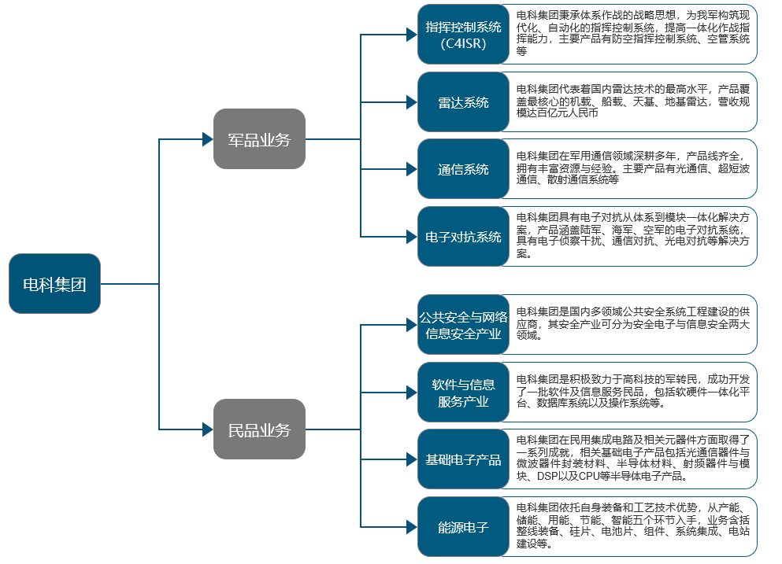

资料来源：中航证券金融研究所整理

中国电科2018年营收规模为2204.27亿元，同比增长8.08%，利润总额213.48亿元，同比增长4.82%，资产总额为3547.71亿元，同比增长16.43%。毛利率为24.00%，同比增长0.78pcts。公司军民品业务占比（军品营收以集团总营收减去民品营收来测算）约在4:6左右。2019年集团连续15年获得中央企业经营业绩考核A级、5个任期经营业绩优秀企业和3次“科技创新优秀企业”。2019年《财富》世界500强中中国电科位列第370位，较2018年上升18位。

图表 3 2001-2018年中国电科业绩快速增长

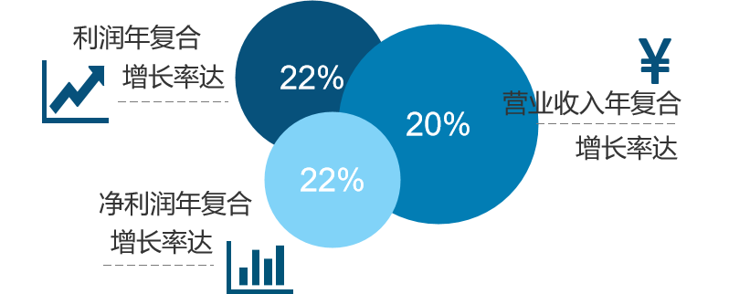

资料来源：中航证券金融研究所整理

图表 4 中国电科业绩成就

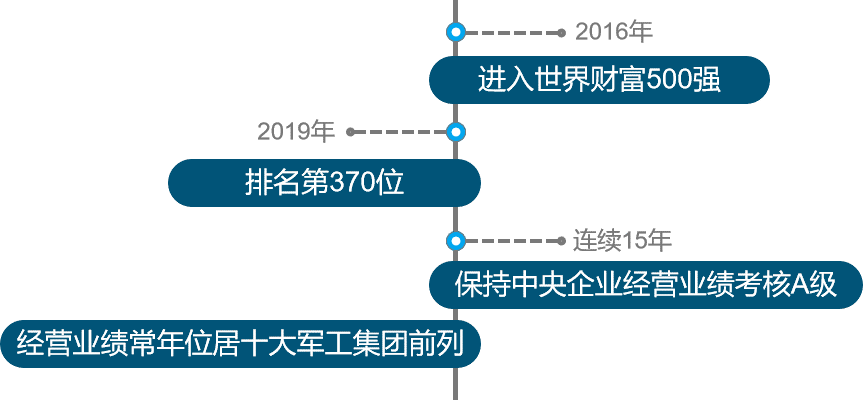

资料来源：中航证券金融研究所整理

图表 5 电子科技集团2007-2018年营业状况（亿元）

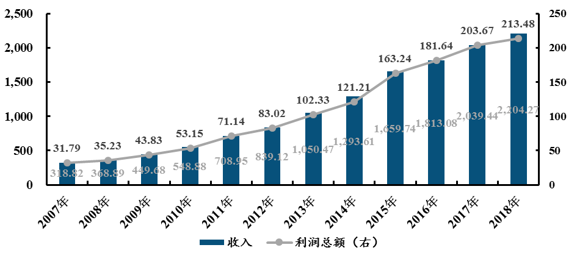

资料来源：wind，中航证券金融研究所整理

图表 6 中国电科2018年业务收入情况（亿元）

资料来源：wind，中航证券金融研究所整理

图表 7 2015-2018年中国电科军民品收入情况

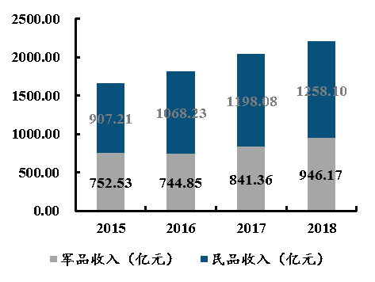

资料来源：wind，中航证券金融研究所整理（军品业务以集团总营收减去民品营收来测算）

图表 8 2015-2018年中国电科毛利率情况

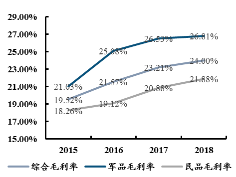

资料来源：wind，中航证券金融研究所整理（军品业务以集团总营收减去民品营收来测算）

**1.2. “三层架构、两级经营”构架下的组织结构**

过去集团业务经营主体多为二级军工研究所，数量较多，第三及以下层是众多研究所投资和再投资设立的民品公司，各自独立经营，虽然数量不少，但有市场影响力的不多，总体来讲不利于现代企业管理。十八届三中全会以来，中国电子科技集团公司加快全面深化改革，提出“三层架构、两级经营”主营业务组织体系改革建设。“三层架构”指集团公司总部、二级和三级单位，原则上管理层级不超过四级；“两级经营”是一种“动态”的经营模式，即在二级子集团组建之前，实际经营实体仍然是院所，而在子集团成熟之后，集团层面将把管理权下放给子集团，不再管理研究所的具体经营。

图表 9 “三层架构、两级经营”简图

资料来源：中国电子科技集团有限公司，中航证券金融研究所整理

图表 10 “三层架构、两级经营”优点及发展步骤

通过建立子集团或专业公司，对研究所资产业务进行整合，从而达到现代企业转型的目的。目前改革进程不断加速，子集团框架逐步成型。

图表 11 中国电科主要子集团组建一览

资料来源：中国电子科技集团有限公司，中航证券金融研究所整理

图表 12 中国电科具有上市公司的子集团架构情况

资料来源：中国电子科技集团有限公司，中航证券金融研究所整理

**1.3、坚持“一五五三”发展战略，聚集网络信息体系主责主业**

十三五期间，集团公司确定了“一五五三”的集团发展战略。即一个发展目标、五大工作方针、五大业态、三大工程。

图表 13 中国电科“一五五三”战略

资料来源：中国电子科技集团有限公司，中航证券金融研究所整理

2019年集团公司公布了《中国电科主责主业布局总体方案（试行）》，明确了新时期中国电科的主责主业，即以打造“高端电子信息产品供应商、信息系统集成商、电子信息服务商、电子信息基础设施提供商”为主责；以强化网络信息体系顶层设计、研发生产组成网络信息体系的核心系统及装备、研发生产支撑网络信息体系的关键基础产品、支撑网络信息体系的运维及保障服务、网络安全与和信息化等五类核心业务为主业。以“一二一三五”为基本思路实施主责主业布局，即“一个统领、两种责任、一个标准、三大市场、五类业务”。

图表 14 中国电科“一二一三五”基本思路

资料来源：中国电子科技集团有限公司，中航证券金融研究所整理

**二、中国电科业务情况—军民融合示范型企业**

中国电科主要从事国家重要军民用大型电子信息系统的工程建设，重大装备、通信与电子设备、软件和关键元器件的研制生产。公司主营业务主要分为军品和民品两大部分。2018年，中国电科民品收入为1,258.10亿元，占比为57.08%，是典型的军民融合集团企业。

从集团业务产业链方面来看，集团基本实现电子信息化产业链的全布局，军品方面，如雷达产品既是中游系统级产品，主要给飞机、舰船等配套，同时又是下游整机产品，如防空、空管雷达等。此外指挥控制系统作为下游终端产品，涉及上游配套产业链更为复杂。民品方面，集团坚持自主可控，在一些关键软硬件系统以及终端产品方面都取得了突破，具有一定市场地位。在上游的基础元器件方面，集团涉猎更广，基本可以覆盖集团中下游产品需求。

图表 15 中国电科主要业务产业链概况

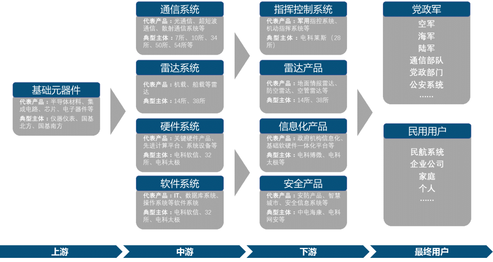

资料来源：中航证券金融研究所整理

**2.1、军品：深耕军工电子，助力国防信息化**

**2.1.1、指挥控制系统（C4ISR）**

C4代表指挥，控制，通讯，计算机，“I”代表情报；“S”代表电子监听；“R”代表侦察。C4ISR是军事术语，意为自动化指挥系统。它以计算机为核心，综合运用各种信息技术，对军队和武器进行指挥与控制。

指挥控制系统以莱斯子集团（28所）为主要代表，具有C4ISR技术国防科技重点实验室和空中交通管理系统与技术国家重点实验室，是我军信息化建设的核心骨干研究所，始终保持国内领先水平，是国内唯一能同时承担总部、陆、海、空、二炮等各军兵种、各级各类指控系统研制、生产的专业研究所。

图表 16 一体化C4ISR系统

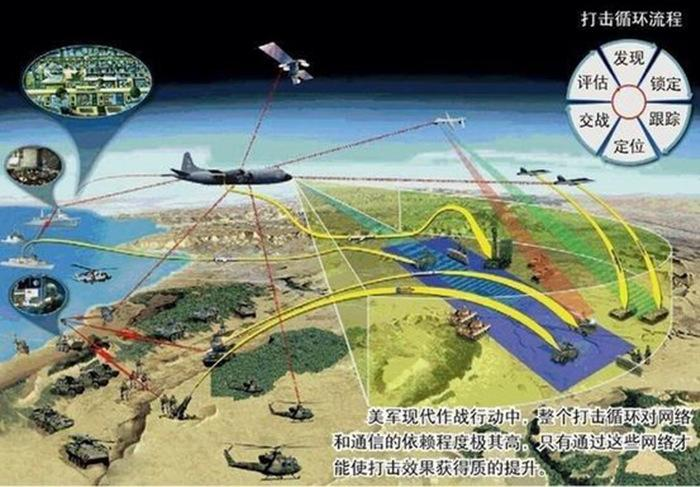

资料来源：科普中国，中航证券金融研究所整理

图表 17 机动指挥系统

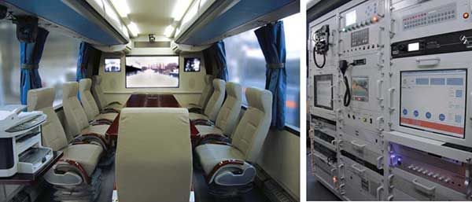

资料来源：公司官网，中航证券金融研究所整理

**2.1.2、雷达系统**

军用雷达是利用电磁波探测目标的军用电子装备。雷达发射的电磁波照射目标并接收其回波，由此来发现目标并测定位置、运动方向和速度及其它特性。

中国电科旗下拥有14所、38所等以雷达为主要方向的研究所，并拥有国睿科技、四创电子两家上市平台。与其他央企研究所、地方国企与民营企业相比，中国电科14所与38所代表着国内雷达技术的最高水平，产品覆盖最核心的机载、船载、天基、地基雷达等。在总体设计、雷达整机、关键微波组件等行业壁垒高、利润率高的产业链环节，中国电科具有绝对的业务优势。

图表 18 空警2000预警机雷达

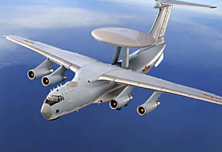

资料来源：百度图片，中航证券金融研究所整理

图表 19 中国电科研制的单光子量子雷达系统

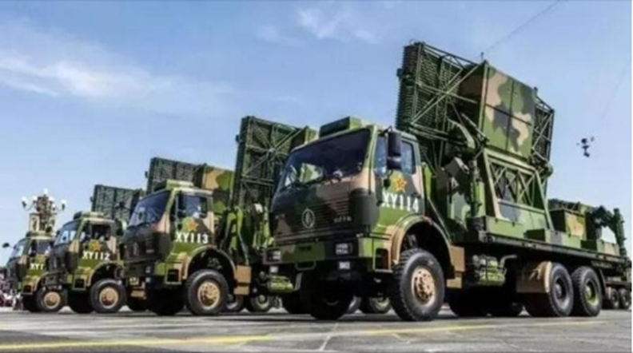

资料来源：集团官网，中航证券金融研究所整理

**2.1.3、通信系统**

军事通信是军队为实施指挥，运用通信工具或其他方法进行的信息传递。它是保障军队指挥的基本手段。为完成军事通信任务而建立的通信系统是军队指挥系统的重要组成部分，是军队战斗力的要素之一。

中国电科在军用通信领域深耕多年，产品线齐全，拥有丰富资源与经验。集团在军事通信领域有所积累的研究所包括7所（移动通信、通信网络）、10所（通信数据链）、34所（光通信）、36所（通信信息控制）、39所（通信天线）、50所（超短波通信）、54所（散射、卫星通信）以及电科院（综合设计方案）等。

图表 20 国产散射通信车

资料来源：百度图片，中航证券金融研究所整理

图表 21便携站卫星通信产品

资料来源：中电科39所官网，中航证券金融研究所整理

**2.1.4、电子对抗系统**

电子对抗就是敌对双方为削弱、破坏对方电子设备的使用效能、保障己方电子设备发挥效能而采取的各种电子措施和行动，又称电子战。

由于电子对抗涉及领域较广，中国电科相关电子对抗研究主体众多，其中29所和51所以雷达对抗业务为主，其主要产品为无源探测系统雷达告警设备、雷达侦察设备等；36所、54所以通信对抗业务的主，其中54所主要产品为通信情报侦察系统、侦察测向设备及侦察测向干扰站；53所以光电对抗业务为主，其主要产品为光电投放系统、告警系统、干扰系统、防护系统等。

图表 22 电子对抗装备

资料来源：百度图片，中航证券金融研究所整理

图表 23 电子对抗空军机动雷达

资料来源：搜狐网，中航证券金融研究所整理

**2.2、民品：军民融合深度发展，电子信息多领域布局**

中国电科民品业务按规模分为主体业务和培育业务，主体业务分为公共安全与网络信息安全、软件与信息服务、基础电子产品、能源电子四大板块，收入占比在70%左右。培育产业包括装备制造、网络通信与卫星导航应用、交通电子、物联网等。中国电科许多民品业务背靠研究所军品技术，表现出中国电科部分产品的军民两用性，是军民融合深度发展的体现。

图表 24 中国电科民品业务分类

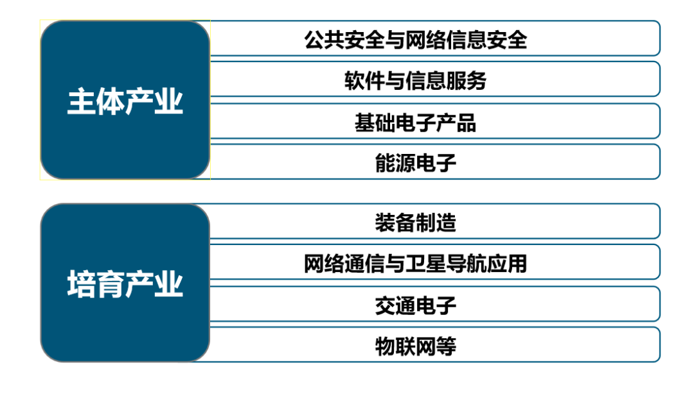

资料来源：集团官网，中航证券金融研究所整理

**2.2.1、公共安全与网络信息安全产业**

中国电科是国内多领域公共安全系统工程建设的供应商，其安全产业可分为安全电子与信息安全两大领域。2018年，公司安全产业实现营业收入433.26亿元。

**安全电子**以2013年成立的海康子集团为代表，业务包括数字安防、光学仪器、数字存取、智能控制、物联网应用、智能照明、智慧汽车、智慧城市及机器人、无人机、高端存储芯片等，目前形成了安全电子领域较完整的物联网系统和产业布局。旗下上市公司海康威视是全球最大的安防厂商。

图表 25 海康威视高清平安城市解决方案

资料来源：海康威视官网，中航证券金融研究所整理

图表 26 海康威视AI摄像机

资料来源：海康威视官网，中航证券金融研究所整理

图表 27 海康子集团组织结构

资料来源：中电海康集团有限公司，中航证券金融研究所整理

**信息安全**以2015年成立的网安子集团为代表，网安子集团以深耕信息安全和物理安全领域的中国电科三十所、三十三所为核心组建而成，拥有国内最顶级的信息安全资质，构建了包括理论、算法、芯片、产品、系统、服务的完整信息安全产业链。旗下拥有中国信息安全第一股“卫士通”在内的多家信息安全公司。

图表 28 卫士通网络防火墙

资料来源：卫士通官网，中航证券金融研究所整理

图表 29 卫士通安全网关

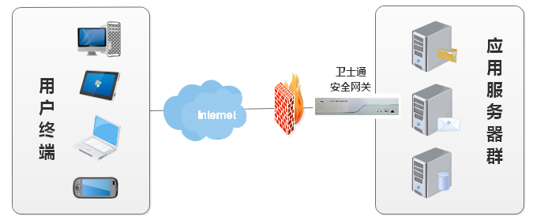

资料来源：卫士通官网，中航证券金融研究所整理

图表 30 网安子集团组织结构

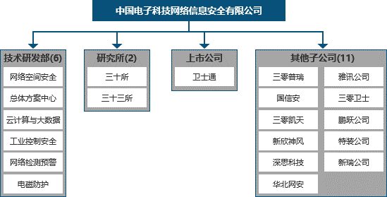

资料来源：中国电子科技网络信息安全有限公司，中航证券金融研究所整理

**2.2.2、软件与信息服务产业**

中国电科是积极致力于高科技的军转民，成功开发了一批软件及信息服务民品，包括软硬件一体化平台、数据库系统以及操作系统等。集团软件与信息服务板块主要为党政机关、企业提供信息技术咨询、软件产品、信息系统集成、信息系统运维、信息安全服务等在内的综合软件与信息技术服务。2018年，公司软件与信息服务产业实现营业收入193.31亿元。

**基础软硬件一体化平台：**中国电科同国产龙芯、申威等CPU、昆仑固件以及整机厂商进行紧密合作、打造了稳定、可靠、可用的“自主可控、安全可靠基础软硬件一体化平台”，形成了服务器系统平台、桌面系统平台以及嵌入式系统平台，初步具备对国外同类产品的替代能力。

图表 31 基础软硬件一体化平台框架

资料来源：中国电子科技集团有限公司，中航证券金融研究所整理

**数据库系统：**中国电科旗下人大金仓研发的金仓数据库KingbaseES面向企业级关键业务应用，是唯一入选国家自主创新产品目录的数据库产品，也是国家级、省部级实际项目中应用最广泛的国产数据库产品。该产品成功运行在中办、中组部、国家审计署、高法、国家电网等用户的信息系统中，成功替代了国外的Oracle、DB2以及SqlServer等产品。

图表 32 金仓数据库宣传图片

资料来源：中国电子科技集团有限公司，中航证券金融研究所整理

**国产操作系统：**“十一五”期间，中国电科通过成立普华公司负责中国电科基础软件的投资、研发和产业化推广等工作。中国电科普华成功研发了操作系统系列产品、数据库系列产品以及相关虚拟化等解决方案，涵盖桌面操作系统、服务器操作系统、高可用集群、虚拟化以及符合国标四级安全认证的高安全等级产品，在党、政、军等重点领域得到广泛应用。

图表 33 普华国产操作系统

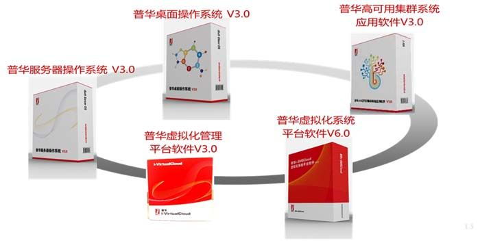

资料来源：中国电子科技集团有限公司，中航证券金融研究所整理

**2.2.3、基础电子产品**

中国电科凭借国防信息化制造企业的身份，在民用集成电路及相关元器件方面取得了一系列成就，相关基础电子产品包括光通信器件与微波器件封装材料、半导体材料（碳化硅材料、抛光片、硅外延片、超薄锗单晶片、区熔硅材料、直拉硅单晶材料等）、射频器件与模块、DSP以及CPU等半导体电子产品。2018年，公司基础电子产品实现营业收入145.66亿元。

**半导体元器件：**随着移动互联的深度普及，集团凭借成熟的技术优势，相关电子元器件已经深入基站、手机以及网络中间设备的产业链中，例如14所下上市公司国睿科技是中兴基站产品微波组件的供应商等。未来5G以及信息化建设加速，将给集团相关半导体器件供应企业带来利好。

图表 34 环形滤波组件

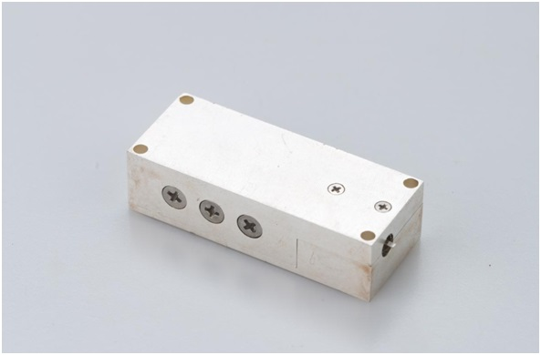

资料来源：国睿科技官网，中航证券金融研究所整理

图表 35 网络、通信协议芯片

资料来源：集团官网，中航证券金融研究所整理

**DSP芯片：**即指能够实现数字信号处理技术的芯片。广泛应用于多媒体通信、工业控制以及仪器仪表等多领域。国内DSP的研究起步较晚，而中国电科为我国DSP芯片的突破做出了重大贡献，旗下14所与38所分别研发了“华睿”和“魂芯”两个系列的DSP芯片。2018年华睿2号芯片验收，芯片研发中突破了10余项核心技术，取得发明专利、布图设计和软件著作权等知识产权40余项。同时华睿3号的研发也在积极进行，预计于“十三五”末期问世。2018年4月23日，魂芯2号A问世，是业界实际运算性能最高的数字信号处理器，一秒钟能完成千亿次浮点操作运算，单核性能超过同类芯片4倍。未来可广泛运用于雷达、电子对抗、通信、图像处理、医疗电子、工业机器人等高密集计算领域。

图表 36 华睿2号

资料来源：百度图片，中航证券金融研究所整理

图表 37 魂芯2号A

资料来源：百度图片，中航证券金融研究所整理

**2.2.4、能源电子**

中国电科依托自身装备和工艺技术优势，从产能、储能、用能、节能、智能五个环节入手，业务含括整线装备、硅片、电池片、组件、系统集成、电站建设等。集团能源电子产业主要产品集中于储能电池、光伏电池及太阳能电池及其相关组件，相关子集团为电科力神，主要从事军事武器装备特种电能源、新能源汽车动力电池、高端消费类电池以及储能电池等。2019年收购\*ST电能成为子集团下的唯一上市平台。2018年能源电子产业实现营业收入87.36亿元。

图表 38 中电力神超级电容器产品体系

资料来源：中电力神集团有限公司，中航证券金融研究所整理

**2.3、重大项目业务：“天地一体化”与“新基建”**

**2.3.1、科技创新2030重大项目之一，天地一体化信息网络。**

天地一体化信息网络是科技创新2030——重大项目中首个启动的重大工程项目，被列入国家“十三五”规划纲要以及《“十三五”国家科技创新规划》。天地一体化信息网络由天基骨干网、天基接入网、地基节点网组成，并与地面互联网和移动通信网互联互通。建成后，将使中国具备全球时空连续通信、高可靠安全通信、区域大容量通信、高机动全程信息传输等能力。

图表 39 天地一体化信息网络示意图

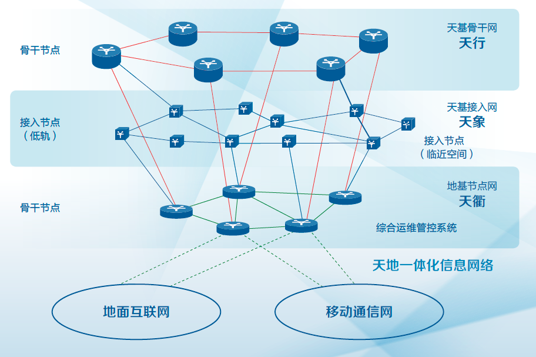

资料来源：《中国电科社会责任报告2018》，中航证券金融研究所整理

天地一体化信息网络建设分成三个阶段：第一个阶段——“技术突破、典型示范”；第二阶段——“规模建设、有效应用”；第三阶段——“扩展提高、全面服务”。目前建设仍处于第一阶段。

天地一体化信息网络项目由科技部牵头，方案论证与实施由中国电科牵头。天基骨干网论证由中国电科38所主要牵头负责，同时也参与天基接入网、地基节点网建设。为推进工作，集团于2016年10月成立天地网络公司。2018年8月，公司开始实体化运行。主要负责牵头组织重大项目系统顶层设计、关键技术攻关和网络实验示范，按照市场化模式开展网络建设运营、数据运营服务等工作，确保实现重大项目任务目标。

图表 40中国电科牵头“天地一体化信息网络”重大项目建设取得重要进展

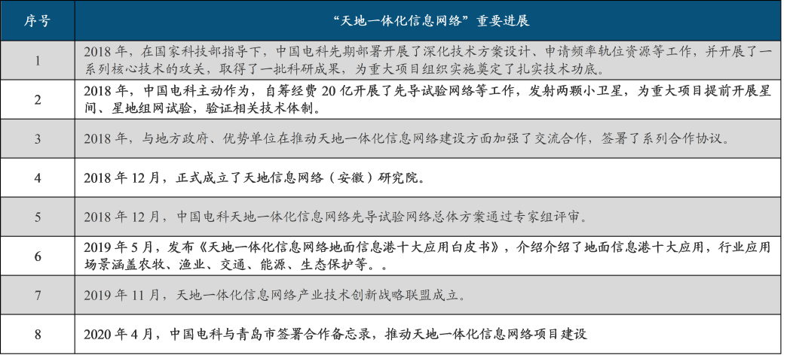

资料来源：中国电子科技集团有限公司，中航证券金融研究所整理

当天地一体化信息网络“编织”完成后，将形成“全球覆盖、随遇接入、按需服务、安全可信”的天地一体化信息网络，为陆、海、空、天各类用户提供信息服务，从而全面保障核心安全、拓展国家利益、普惠社会民生等战略需求，和面向国家安全、信息普惠等各类典型应用。

**2.3.2、电科加快推进“新基建”，助力5G商用加速度**

新型基础设施建设（新基建），指以5G、人工智能、工业互联网、物联网为代表的新型基础设施，本质上是信息数字化的基础设施，在2018年12月的中央经济工作会议中定义，2020年3月，中共中央政治局常务委员会提出要加快5G网络、数据中心等新型基础设施建设进度。

图表 41 “新基建”主要领域

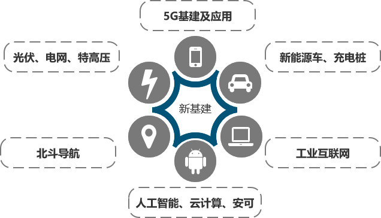

资料来源：中航证券金融研究所整理

作为国内唯一覆盖电子信息技术全领域的大型科技集团，中国电科不仅拥有国家级（城市级）超大型信息系统设计与建设能力，还拥有百万级感知设备接入与平台支撑能力和云数平台建设能力。是未来“新基建”建设的主力军。在建设过程中，中国电科将有助于加快推进关键核心元器件自主创新，构建中国电科的智能基因、智能单元系列，通过打造“物联、数联、众联”三位一体的新一代信息基础设施，进一步支撑网络强国、数字中国、智慧社会建设。中国电科适用于“新基建”的物联标准体系“中国电科开放物联网通用体系”目前已经公布并实现应用。由此标准体系架构做指引，中国电科将助力我国“新基建”发展。

2019年6月6日，工信部正式发放5G商用牌照，中国电科全力支撑5G发展。中国电科发挥专业特长，针对5G产业链“短板”和“瓶颈”重点发力，以“核心器件自主供给，测试仪器全面保障，特殊应用率先推进”为宗旨，在核心芯片与模块、特殊应用系统设备和测试仪器仪表三方面给予我国5G发展提供支持，中国电科将着力成为宽带无线移动通信领域的重要力量和特殊应用领域的主导力量。

**2.4、外贸：围绕“一带一路”战略、通过境外实战化检验提升装备性能**

中国电科积极实施“走出去”战略，业务遍及亚洲、非洲、欧洲、拉美、澳洲等100余个国家和地区。根据自己主业技术产品优势打造了“三大平台”和“五大板块”的业务框架。

图表 42 中国电科海外业务打造的“三大平台”和“五大板块”

资料来源：《中国电科在海外》，中航证券金融研究所整理

军贸方面，中国电科出口为军用电子技术以及各类电子传感器为主，代表产品为指挥控制系统、雷达、电子战等装备。中国电科已向多个国家和地区出口了数十套指挥与控制系统，另外还向国外提供导弹控制雷达、武器定位雷达等产品。在集团聚焦主责主业“一二一三五”基本思路中提出，要为“一带一路”沿线国家军队客户提供网络信息化装备，通过境外实战化检验，改进和提升集团公司装备性能，因此未来集团军贸业务水平有望进一步提高。

**图表 43 中国防空系统及电子传感器对外军贸额（百万美元）**

资料来源：SIPRI数据库，中航证券金融研究所整理

**三、中国电科是自主可控关键环节突破的核心力量**

实现核心技术自主可控，是我国产业从中低端迈向中高端的必经之路，尤其在国防科技工业，武器装备的自主可控关系到我国国防安全。“自主可控”概念受到广泛重视源于2018年4月的“中兴事件”，在中美贸易摩擦的背景下，美国以高科技垄断产品为要挟，通过实体名单制裁中国企业，让我国在这场博弈中一定程度处于被动，也使得一些产业和企业面临“休克”的危险，导致在党政军内自主可控和安全可靠需求大幅增长。

图表 44 我国军工自主可控发展历程

资料来源：中航证券金融研究所整理

中美贸易摩擦的核心问题是美国对中国快速崛起的忌惮与遏制，以保证美国高科技的制高点。回顾中美贸易摩擦至今的历程，可以发现中间多次反转反复，目前中美已签订了第一阶段经贸协议，但中美博弈仍然存在长期性和反复性，在此背景下，“自主可控”须要做好中美长期博弈的准备，打好“持久战”。

图表 45 中美贸易摩擦回顾

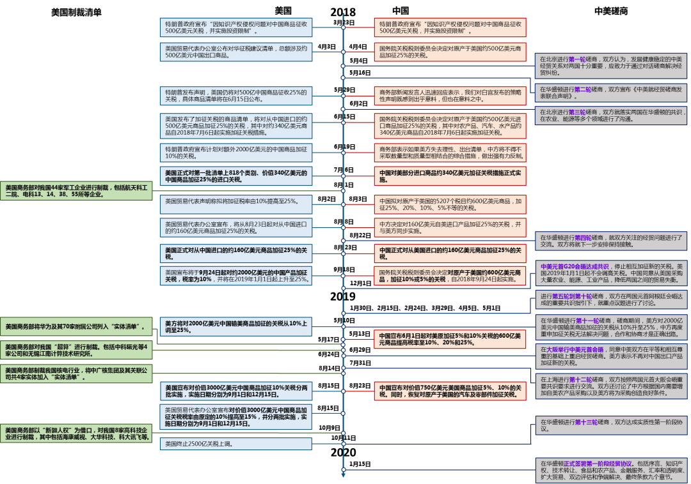

资料来源：互联网，中航证券金融研究所整理

在被列入“实体清单”的中国企业主体中，大多属于十大军工集团相关单位、民营军工企业、或者我国高新技术企业，主要涉及导弹、雷达、集成电路、通信、计算机等领域，其中中国电科下多家研究所及企业被列入。

图表 46 多家中国电科下属研究所及企业进入“实体名单”

资料来源：美国商务部网站，中航证券金融研究所整理

目前我国军工自主可控的重点发展集中在我国短板上，可以分为两大类：上游基础领域和下游关键系统。

图表 47 我国自主可控重点发展领域

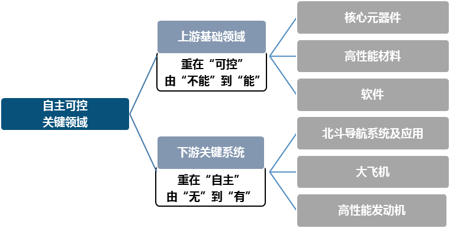

资料来源：中航证券金融研究所整理

在我国自主可控重点发展领域中，中国电科在上游基础领域中的核心元器件、软件，以及下游关键系统中的北斗导航系统及应用中贡献突出。中国电科贯彻自主创新和自主可控精神，一方面，面向国家安全、网络强国、信息化装备建设急需，进一步发挥优势、弥补短板弱项，着力解决核心命门问题。另一方面，以引领信息化装备发展和基础领域技术进步为目标，系统研究基础产品、基础能力、重大技术和新概念，健全机制，打造自主可控发展生态，掌握新一轮网信科技竞争的战略主动权。中国电科已经成为我国自主可控关键环节突破的重要参与者

**3.1、推动元器件自主可控**

虽然我国电子元器件较国外仍有差距，但是军工电子元器件在部分重要细分领域逐步实现从“0”到“1”的突破，其中中国电科起到了重要推动作用，近几年重要成就及进展如下。

图表 48 国内军工电子产业链及短板领域

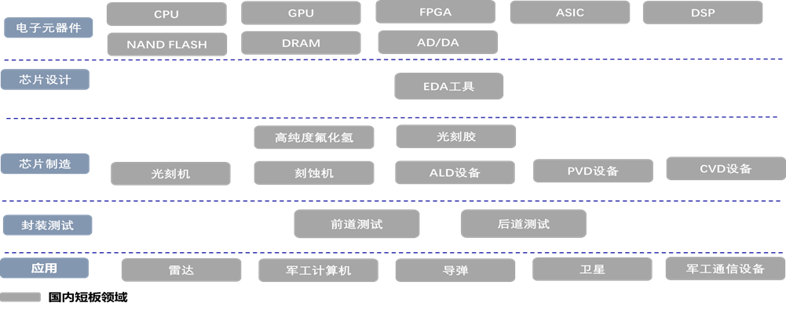

资料来源：中航证券金融研究所整理

**华睿2号DSP芯片顺利通过“核高基”课题正式验收**

华睿2号DSP芯片顺利通过“核高基”课题正式验收，成为国家十二五“核高基”重大专项高端芯片中首个通过验收的DSP项目，突破了多核异构架构、自主指令集、动态可重构、矢量化编译等10余项核心技术，取得发明专利、布图设计和软件著作权等知识产权40余项。

目前，华睿2 号DSP 已形成了以芯片为核心，以整机设备为载体的完整产品线，提供从芯片、软件、模块、平台到系统的整体解决方案。同时面向不同性能需求的应用，形成了华睿2号高端、中端等系列化产品，在安防监控、安全计算机等民用领域和雷达、通信、电子对抗等军用领域全面推广应用。

**发布“魂芯二号A”芯片**

“魂芯二号A”由中国电科自主设计，采用全自主体系架构，获得国家技术发明专利、软件著作权等科技成果30 余项；拥有当前业界性能最强的DSP 核。相对于“魂芯一号”，“魂芯二号A”性能提升了6 倍，通过单核变多核、扩展运算部件、升级指令系统等手段，使器件性能千亿次浮点运算同时，具有相对良好的应用环境和调试手段；单核实现1024浮点FFT（快速傅里叶变换）运算需1.6微秒，器件数据吞吐率达每秒240Gb。

**成功研制短波和中波2.7K×2.7K 红外探测器**

短波和中波单片2.7K×2.7K 探测器属于高灵敏度制冷型红外焦平面探测器，是红外成像系统的核心部件，涉及材料、芯片、集成电路设计、制冷和封装等多个学科。此次研制成功，国内该产品零的突破，使中国成为继美国之后，第二个掌握该技术的国家。

**3.2、推动基础软件自主可控**

全球软件行业最先起始于20世纪50年代，逐步形成了以美国、欧洲、印度、日本及中国等国家为主的国际软件产业分工体系，全球软件产业链的上游、中游和下游链条分布逐渐明晰。而软件产业领域核心基础软件领域基本都被美国企业所占领。目前我国仍在追赶状态，中国电科已经在部分软件方面取得一定突破，近几年重要成就及进展如下。

图表 49 基础软件层、工业软件层、网络安全信息软件共同支撑军工应用

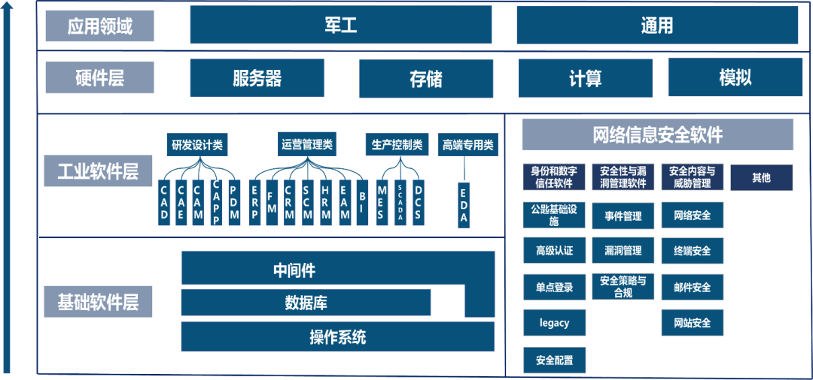

资料来源：中航证券金融研究所整理

**ReWorks Cert 操作系统通过权威认证**

锐华高安全嵌入式实时操作系统ReWorks Cert 于2018 年获得功能安全国际认证，是国内第一个且目前唯一一个自主可控的通过国际第三方权威认证的嵌入式实时操作系统，具备应用在工业控制和轨道交通等安全关键领域的资质，已应用于轨道交通信号领域龙头公司卡斯柯信号公司安全计算机平台中。

**普华国产操作系统整合解决方案获安全可控优秀解决方案奖**

普华国产操作系统整合解决方案，针对国产化环境的稳定性、性能和兼容性等要求，普华通过统一版本管理将适配、调优的成功进行固化，针对用户的安全、软硬结合、深入优化的需求，提供自主可控解决方案，实现从基础平台支撑到软硬件一体化整合的全方位覆盖。目前已经在行政机构、金融、交通、能源、电信以及卫生医疗等诸多行业得到推广和应用。

**国产软硬件技术的“太极云”系列产品以及数据库Kingbase ES**

“太极云”系列产品包含了自主可控计算机、计算平台、图形平台、数据平台、运行支撑平台和物联网平台，可满足各类大规模、高并发、高可靠、高安全的大型信息系统底层平台支撑要求，实现了从主板、芯片到软硬件适配的95%以上自主可控。人大金仓研发的金仓数据库Kingbase ES面向企业级关键业务应用，是唯一入选国家自主创新产品目录的数据库产品，也是国家级、省部级实际项目中应用最广泛的国产数据库产品。

**收购优秀软件企业，助力软件自主可控**

太极股份2015年收购金蝶中间件公司21%股权；2017年收购人大金仓5.44%股权等；在自身发力国产操作系统同时，补齐中间件、数据库等基础软件短板。2019年中电科投资收购5.68%南威软件股权，通过入股南威软件，共同开拓智慧城市市场，打造新型智慧城市标杆。

**四、院所改制、混改提速，核心资产逐步实现资产证券化**

在中央企业深化改革的背景下，十大军工央企作为我国国防军工各领域中的研发、设计及生产的骨干力量，也在持续推进改革进程，剑指实现企业高质量发展。中国电科为进一步构建改革发展一体化的工作格局，从资源配置、业绩考核、激励约束、协同发展、非主业退出等多方面进行改革部署。我们可根据改革路径的不同将其分为四个维度，包括：企业维度、业务维度、管理维度及市场化转型维度。

图表 50军工央企改革四大维度

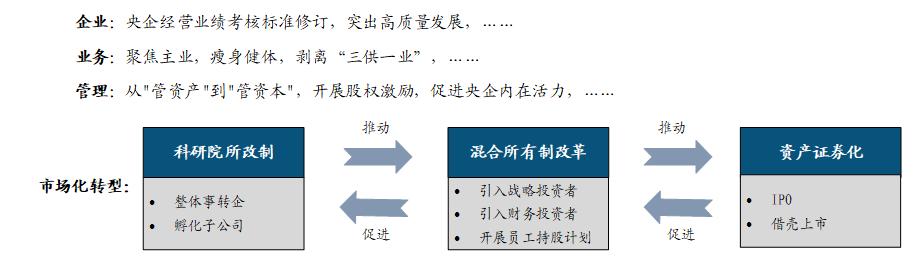

资料来源：中航证券金融研究所整理

中国电科加快全面深化改革，明确“企业化、市场化、集团化、国际化”改革方向，提出“三层架构、两级经营”主营业务组织体系改革建设内容。目前改革进程不断加速，子集团框架逐步成型。实施改革后，给集团资本运作、院所改制、资产证券化以及业务整合拓展带来多方面的便利及优势。

图表 51中国电科改革成就

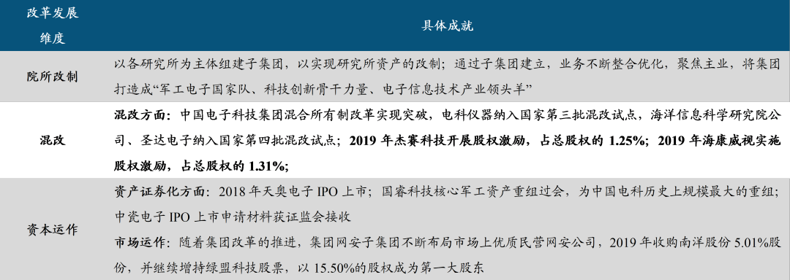

资料来源：中国电子科技集团有限公司，中航证券金融研究所整理

**4.1、院所改制的先锋军，子集团下的改制创新**

院所改制作为目前激活传统科研院所活力的必要手段，“新时代”国防科技工业改革已经从顶层设计向央企改革试点等执行层面过渡，其中股份制改造有望率先突破。面对广阔的军、民用市场，科研院所的事业单位体制越来越成为制约发展的瓶颈，研究所转为经营性的企业、建立适应市场需求的现代企业制度成为各大军工集团发展的必然选择，也是实施混合所有制改革的基础和关键。

在改制进程方面，2018年5月兵器装备集团自动化研究所改制完成，为后续科研院所改制提高树立了包括方案、审批流程以及批复模板在内的良好示范。2019年四季度，各大军工企业混改提速。同时，2019年底国资委发布了《中央企业混合所有制改革操作指引》，为央企开展混合所有制改革提供了系统的操作指南，并有望进一步推进以推动混改企业转变运营机制。近年来各科研院所改制、混改后注入上市公司的资产开始呈现出体量越来越大，目前中国电科下属上市公司国睿科技2013年注入资产作价为6.47亿元，2019年拟注入资产作价68.60亿元，越来越接近科研院所核心业务的趋势。2020年作为“十三五”收官之年，预计包括中国电科在内的各大军工集团的科研院所改制将会有更多政策及案例落地，军工企业的优质资产将更频繁的实现资产证券化。

**4.1.1、电科下属4家研究所进入转制工作名单**

中国电科作为我国军工电子国家队和信息产业主力军，区别于其他军工集团，其业务覆盖面较广，基本涵盖了目前国防建设与国民经济的多个领域。同时，集团下属科研院所较多，且院所内部在研发及科技成果转化、经营等方面都有着较大优势。

2017年国防科工局召开军工科研院所转制工作推进会，宣布启动首批41家军工科研院所转制工作，其中中国电科下属4家科研院所入选，科研院所的成功改制势必将减少集团资产证券化成本，未来随着改制进程的不断推进，将给电科资产注入带来较大弹性。

图表 52 首批生产经营类军工科研院所转制为企业的名单

资料来源：中国电科官网，中航证券金融研究所整理

**4.1.2、子集团模式下的“改制”，促进改制的多元发展**

中国电科通过子集团下资产运作，不同于以往院所改制的“先转制后资产注入”的操作过程，而是先将院所自身优质的核心资产通过划转整合建立成新公司，再进行资产注入，此举避开了改制中诸多的障碍，又好又快的将资产“改制”，为未来科研院所改制与资产注入开辟新路径。其中以14所资产注入国睿科技和38所注入四创电子的资本运作最为成功。

国睿科技前身是上市公司高淳陶瓷，于2009年启动重大资产重组将14所下属南京国睿器件有限公司、恩瑞特与国睿兆伏100%股权置换至上市公司，公司对原14所工作人员采取“业务随资产走，人随业务走”的原则进行了安置。公司于2018年通过这种方法拟将国睿防务100%股权、国睿信维95%股权注入至上市公司。2020年1月收购事宜正式获得证监会核准。

38所作为我国民用雷达研制生产基地，2004年5月，38所将旗下的部分雷达资产注入至四创电子并上市；又于2009年、2017年分别将下属华耀公司与博微长安的90.83%和100%股权注入至上市公司中。通过上述对38所资产的不断整合，四创电子逐步转变为中国电科下属的雷达业务平台。

中国电科以子集团为平台整合自身院所资产，并实现院所核心资产的“改制”，促进了我国科研院所改制的多元化发展。同时随着集团子集团的不断成立，未来集团内优质资产注入上市公司的预期有望进一步增加。

**4.2、探索多种形式混改，以“混资本”促进“改机制”**

混合所有制改革方面，中国电科明确将二级及以下企业层面推进混改，通过引进战略投资、员工持股、社会资本、股权置换等多种形式实现股权多元化，深层次激发集团内部活力。并且集团在2020年工作会议上再次明确指出要深化国企改革，推进混合所有制改革工作，建成清晰的企业法人治理结构以及全级次的现代化国有企业制度。

目前中国电科民品业务产业根据其企业发展阶段，采用不同形式对其推动实施混改。具体来讲：在新业务启动时，以核心员工参与出资设立公司；在企业具备一定规模时，引入社会资本及战略投资者助推企业提升发展；在企业高速发展期，转向资本市场，通过IPO、资产注入等方式，提高上市公司资产质量以及集团运营机制及效率。具体实施的混改手段如下：

**① 股权激励**

中国电科内包括海康威视、杰赛科技、太极股份在内的多家上市公司目前通过推行股权激励措施，推动混改进程加快，进一步激发员工积极性，强化公司核心竞争力，以此切实有效的提高上市公司资产质量、盈利能力和治理水平。

图表 53 中国电科下属上市公司股权激励事件

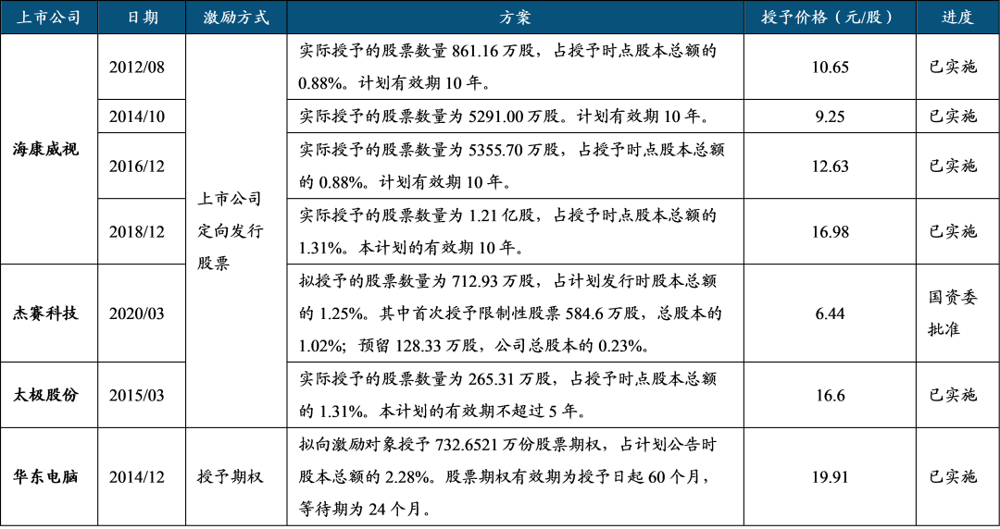

资料来源：wind，中航证券金融研究所整理

以海康威视为例，通过统计其第一期股权激励授予年份2012年至2018年股价及业绩变化可以看出，海康威视在2012年下半年完成首次股权激励后，经营业绩出现大幅增长，营收与归母净利润增速分别实现37.89%与44.28%。在这七年间，公司营业收入、归母净利润与股价分别增长了590.86%、431.28%与305.28%，年复合增长率分别高达38.01%、32.10%与26.27%。

图表 54 海康威视股权激励期间股价走势及业绩变化

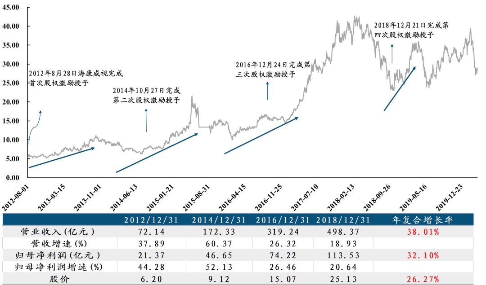

资料来源：wind，中航证券金融研究所整理

**② 加强企业对外合作，引入战略投资者**

2017年12月，中国电科与腾讯签署了合作协议，在云计算、大数据、人工智能和智慧城市的领域展开合作；2020年3月，华为入股电科仪器仪表，加大在新基建、5G领域的合作。

目前中国电科内部的电科仪器仪表与海洋信息科学研究院公司、圣达电子已分别纳入国家第三、四批混改试点。其中，电科仪器仪表以“搭平台、配资源、融资金、促产业”的混改手段为指导方向，通过盘活院所资产、进行资源整合、引入战略投资者以及同步实施员工持股等四个方面进行其混合所有制改革，2020年3月31日电科仪器仪表已完成混改涉及的工商变更登记，成为集团下属首家二级单位混合所有制企业。

**搭平台、配资源——**在盘活院所资产与资源整合方面，集团已40、41所为核心首先组建了电科仪器仪表子集团，作为中国电科仪器仪表产业板块运作平台。后推动40、41所转制改革，2019上半年41所事业资产无偿划拨至电科仪器仪表已获得财政部批复，实现研究院所事业性资产以及电科仪器仪表主责主业的资源整合。

**融资金、促产业——**华为于3月31日出资6606.67万元认缴电科仪器仪表8%股权，与其同一时间内入股的还包括了41所（10%）、中电科投资控股有限公司（8.72%）、国家军民融合产业投资基金有限责任公司（2.46%）等7家企业，上述认缴出资完成后，中国电科持股比例下降至50.54%。电科仪器仪表在5G材料与芯片测试等领域广泛布局，目前其5G芯片测试系统已经可以应用于芯片企业的验证测试及产线测试需求，此次华为入股电科仪器仪表，将进一步推动电科仪器仪表的现代企业制度与经营能力方面的快速提升，并助力仪器仪表在“新基建”产业以及其网信事业的布局发展。

图表 55 电科仪器仪表混改进程

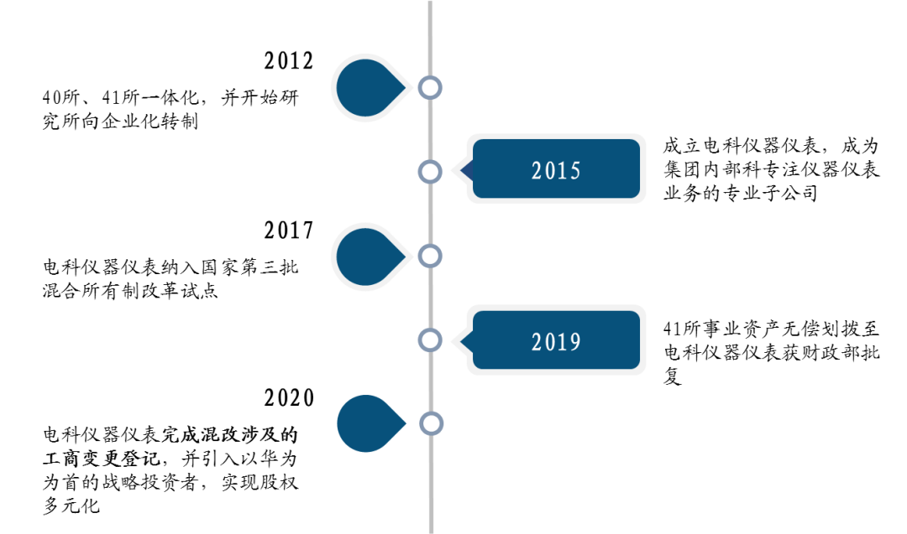

资料来源：wind，中航证券金融研究所整理

截至目前，电科仪器仪表在资本层面的“混”已经告一段落，在体制机制层面的“改”将持续深入推进。

**4.3、资本运作提质增速，内部整合与外延并购双轮驱动**

2018年，我国军工集团资产年证券化率较低，按收入占比计算平均资产证券化率不足40%。以总资产口径来看，各大军工集团资产证券化率参差不齐，资产证券化率较高的包括航空工业集团以及中核工业集团、而航天科技集团以及航天科工集团资产证券化率均远低于军工集团平均资产证券化率。而从各集团披露的资产证券化率目标（航空工业集团、中船工业集团、航天科技集团及兵器工业集团承诺“十三五”期间实现）来看，中船工业集团、兵器工业集团以及航天科技集团2018年底的资产证券化率与其承诺的“十三五”资产证券化率目标尚有较大差距。

图表 56 2018年十一大军工集团资产证券化率（单位：%）

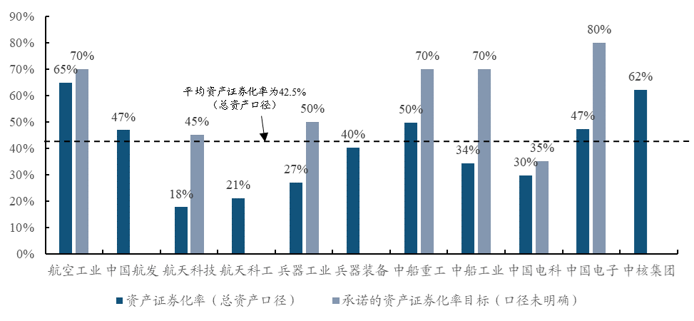

资料来源：Wind，各集团公告，上海证券报，中国证券报，证券时报，金融界等网站，中航证券金融研究所整理

从中国电子科技集团的资产证券化率来看，2019年按照总资产占比计算的资产证券化率仅为28.86%，按照净资产来计为30.44%，总体水平较低。

图表 57 2010-2019年中国电子科技集团资产证券化率变化趋势

资料来源：Wind，中航证券金融研究所整理

图表 58 中国电子科技集团资本运作一览

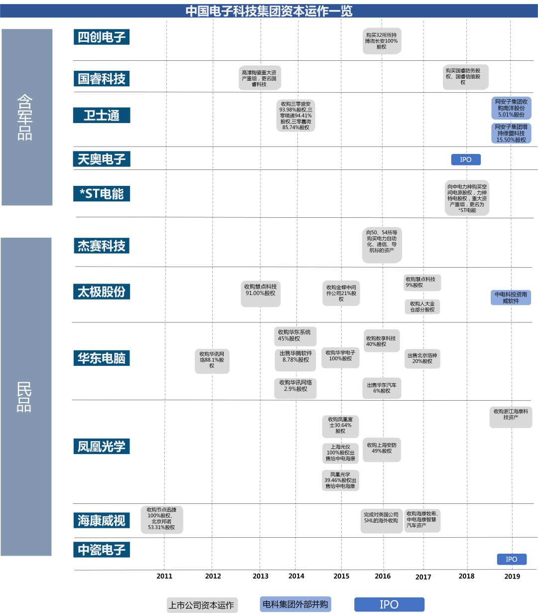

资料来源：wind，中航证券金融研究所整理（注：按照并购首次披露日统计）

**4.3.1、内部整合：子集团+上市平台，优质资产存在注入预期**

中国电科优质资产较多同时业务繁杂，因此集团抓紧内部资源整合，通过“三层架构、两级经营”近几年子集团相继成立。同时借助子集团下的上市平台开展内部收购，一方面实现业务整合，另一方面也可以提高集团资产证券化率。同时由于上市公司与对应子集团业务关联度较强，上市公司并购内部资产难度较低，因此未来中国电科下上市公司存在较强的内部资产注入预期。

中电科科研院所营收，利润数倍于上市公司，多途径谋求上市。中国电科旗下多数科研院所营业收入，净利润规模数倍于上市平台，上市平台包括四创电子，国睿科技，太极股份，华东电脑，天奥电子，ST电能，凤凰光学和卫士通均存在体外优质资产规模庞大。随着中电科资产证券化进程稳步推进，我们认为“电科系”优质资产将不断涌向资本市场。

图表 59 电科上市公司规模和对应科研院所规模对比

资料来源：公司公告，中航证券金融研究所整理

**4.3.2、外延收购：并购补齐业务短板，完善产业布局**

上市公司层面通过外延式并购逐步补齐业务短板。随着改革提速，资本运作深入，中电科旗下上市平台近年来不断外延并购弥补自身短板，完善产业链：

（1）软件信息化板块太极股份：①2015年收购金蝶中间件公司21%股权；②2017年收购人大金仓5.44%股权等；在自身发力国产操作系统同时，补齐中间件、数据库等基础软件短板。

（2）电能源板块\*ST电能：2018年，兵装集团将所持上市公司22.34%股权无偿划转至中电力神，中电科向中电力神购买空间电源100%股权，力神特电85%股权，重大资产重组完成后，公司更名为\*ST电能，补齐了中电科在锂离子蓄电池领域的产业空白。

（3）电科网安子集团不断布局市场上优质民营网安公司，2019年收购南洋股份5.01%股份，并继续增持绿盟科技，以15.50%的股权成为第一大股东。

（4）2019年中电科投资收购5.68%南威软件股权，通过入股南威软件，共同开拓智慧城市市场，打造新型智慧城市标杆。

**五、中国电科旗下上市公司介绍**

**5.1、国睿科技（600562.SH）：背靠14所，重大重组基本落定**

国睿科技是国内雷达领导企业，公司主要有四大业务板块，分别是雷达及相关系统、轨道交通信号系统、微波器件以及特种电源。

图表 60 2018年业务结构

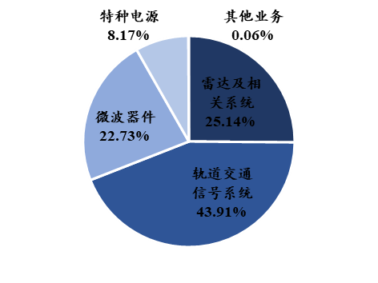

资料来源：wind，中航证券金融研究所整理

图表 61 公司业绩情况（亿元）

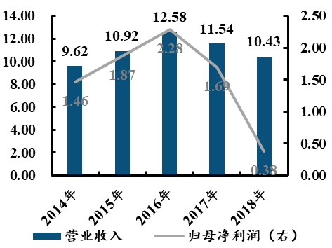

资料来源：wind，中航证券金融研究所整理

**注入核心军工资产，为中国电科历史上规模最大的重组。**国睿科技正收购国睿防务100%和国睿信维95%股权，前者业务为国际防务雷达产品的生产制造，后者业务为工业管理和工程软件的研发、销售。交易作价合计68.60亿元。本次重组是中国电科历史上规模最大的重组，首次实现中国电科核心军工资产证券化，大幅增加公司未来的业绩弹性。截至2020年3月18日，国睿防务涉及的非涉密专利、国睿大厦及其对应的土地使用权已完成资产过户手续。

**国睿子集团下唯一上市平台，资产注入可期。**2019年5月16日，中电科同意以电科十四所、二十三所为基础，以十四所下属全资子公司中电国睿为平台组建子集团，将十四所所持其100%股权无偿划转至中电科直接持有。公司作为上市平台，随着子集团的成立，在资本运作和产业资源整合方面的功能有望进一步强化，未来资产注入预期进一步增强。

**5.2、四创电子（600990.SH）：背靠38所，聚焦雷达主业**

公司是我国第一家以雷达为主业的上市公司，被誉为“中国雷达第一股”。主要业务为雷达及雷达配套、公共安全产品、机动保障装备、电源产品以及粮食仓储信息化改造等。

图表 62 2018年业务结构

资料来源：wind，中航证券金融研究所整理

图表 63 公司业绩情况（亿元）

资料来源：wind，中航证券金融研究所整理

**聚焦主业，雷达业务回暖给公司业绩提供回升动力。**公司聚焦雷达主业，收缩缺乏核心竞争力的业务规模，努力降本增效。公司雷达产品包括军用气象雷达、航管雷达、低空警戒雷达、相关雷达配套件和微波组件等。目前军改影响逐渐消退，叠加“十三五”末期，雷达业务订单有望改善，从而给公司业绩提供回升动力。

**背靠博微子集团优质技术及资产。**2018年中国电科以8、16、38、43所为基础组件博微子集团，2019年末公司完成大股东变更，电科38所将四创电子股权转给博微子集团，其中38所是我国国防电子骨干科研单位，研发的“魂芯”DSP芯片广受业内关注，未来随着博微子集团资本运作的深入，公司注入优质资产预期增强。

**5.3、杰赛科技（002544.SZ）：积极拓展布局，子集团资本运作可期**

公司主要从事移动通信网络规划设计、通信/特种印制电路板制造、专用网络电子系统工程（智慧城市、物联网、云计算）、网络覆盖产品（天线、直放站、WLAN 等）、网络接入产品（数字机顶盒等）生产、通信导航、专网通信、公共安全、轨道交通通信、时频器件、工程监理服务等业务，主要业务结构分为通信网络解决方案（公共网络、专用网络）、以及通信类相关设备（印制电路板、网络接入设备和网络覆盖设备）。

图表 64 2018年业务结构

资料来源：wind，中航证券金融研究所整理

图表 65公司业绩情况（亿元）

资料来源：wind，中航证券金融研究所整理

**优化板块布局，拓展PCB产业链。**公司利润主要来源是移动通信网络规划设计、印制电路板制造以及轨道交通通信业务。随着5G建设加速，公司抓住机遇，承接5G规划项目实现落地，并不断拓展运营商ICT业务，已入围多省运营商市场。同时公司拓展PCB上下游产业，新增订单可观，此外，公司在大力开拓轨道交通市场的同时，积极向“大交通”市场布局，加强机场、铁路、高速公路市场进行横向拓展。

**通信子集团下唯一上市平台。**2017年，中国电科以7、34、39、50、54所为基础组件通信子集团。作为子集团唯一上市平台，未来50所、54所以及其他通信相关部门下的通信网络资产注入值得期待。

**5.4、太极股份（002368.SZ）：深耕党政军软件，安可业务迎来成长**

公司是国内电子政务、智慧城市和重要行业信息化的领先企业。公司可分为云服务、网络安全和自主可控服务（安可业务）、智慧应用以及系统集成。客户主要面向党政、国防、公共安全、能源、交通等行业，占比在60%以上。

图表 66 2018年业务结构

资料来源：wind，中航证券金融研究所整理

图表 67 公司业绩情况（亿元）

资料来源：wind，中航证券金融研究所整理

**普华纳入太极子集团，助力公司安可业务成长。**普华软件2019年11月纳入太极子集团，普华软件是我国国产操作系统的龙头企业之一，旗下拥有桌面操作系统、云操作系统等多款基础软件产品，长期以来与华为保持密切合作关系，旗下操作系统全面支持华为泰山服务器、鲲鹏处理器。普华的纳入有助于太极股份受益股东资源，安可业务或迎来快速成长。

**深党政军耕数据库，自主可控促业绩增加。**随着自主可控的意识不断增强，太极股份子公司人大金仓业绩迎来增长，其数据库产品在党政领域占据第一大份额。布局范围不断扩大，由7省3市扩展到27省4市，产品也在不断完善产业生态链，在自主可控的环境下，前景广阔。

**5.5、卫士通（002268.SZ）：背靠网安子集团，网络安全优质企业**

公司是国内知名密码产品、网络安全产品、互联网安全运营、行业安全解决方案综合提供商，其业务可分为安全集成与服务、单机和系统产品两大块。前者主要包括密码产品、网络安全、数据安全、移动安全等。后者主要是给客户提供安全相关的解决方案。客户主要为党政、央企、能源、金融行业等。

图表 68 2018年业务结构

资料来源：wind，中航证券金融研究所整理

图表 69 公司业绩情况（亿元）

资料来源：wind，中航证券金融研究所整理

**《密码法》正式施行，国产替代保证网络安全。**2020年1月1日，我国《密码发》正式实施，密码是网络安全的基础支撑和核心保障，目前我国应用的加密算法大多为国外制定，存在不可控因素。因此密码自主产品国产化替代是未来我国网络安全发展的重点。卫士通长期在密码技术领域进行研究和拓展，具有深厚的技术积累。公司在密码产品多样性和密码算法高性能实现方面一直保持国内领先，多项商密产品达到国内首创、国际领先水平。基于密码与安全技术积淀，公司参与了大量国家信息安全行业标准的制定，包括国家信息安全标准体系、国家密码标准体系规划、信息安全产品认证管理体系等，为公司的可持续发展奠定了坚实的基础。

**数字经济蓬勃发展，为网络安全市场提供新驱动。**在数字化转型浪潮推动下，网络安全需求大幅增长，2018年发布的《数字中国建设发展报告(2017年)》设计了我国信息化发展评价指标体系，“网络安全”指标占据15%的权重。未来在网络安全方面的投入将持续增加，公司自成立以来一直致力于网络安全领域的技术研究及产品开发，再次浪潮下或长期受益。

**背靠网安子集团，打造国内网络安全第一股。**卫士通是网安子集团下唯一的上市平台，网安子集团以三十所、三十三所为核心组建而成，拥有国内最顶级的信息安全资质。2019年网安子集团不断布局市场上优质民营网安公司，收购南洋股份5.01%股份，以及增持绿盟科技股票，为未来卫士通业务协同以及资产运作带来预期。

**5.6、华东电脑（600850.SH）：信息（软信）子集团组建，或受益于股东资本运作**

公司是大陆IT行业首家上市公司。公司业务分为三大板块，分别为系统集成和服务、专项服务和常续服务以及智能建筑与机房。用户主要集中在政府、教育、金融、电信、制造、能源及交通等行业。

图表 70 2018年业务结构

资料来源：wind，中航证券金融研究所整理

图表 71 公司业绩情况（亿元）

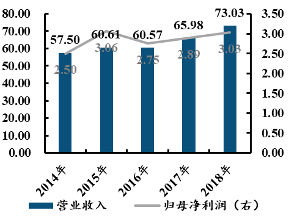

资料来源：wind，中航证券金融研究所整理

**领先的技术能力和广泛的客户基础。**华东电脑凭借多年积累的技术、领先的解决方案与服务能力为各行业的龙头企业以及中小型企业提供专业化的信息技术解决方案与服务。公司建设了辐射全国的营销网络和服务体系，业务覆盖金融、运营商与互联网、企业、政府与公共服务等各大行业领域，多年来持续为各行业客户提供领先的解决方案和专业的技术服务，具有一定的客户粘性和良好口碑。

**信息（软信）子集团组建，作为唯一上市平台或受益。**中国电科同意以32所及中电科软件信息服务有限公司为基础，以电科软信为平台公司组建电科信息子集团，32所是国内唯一的覆盖自主基础软件、嵌入式系统及网络通信关键芯片、军用计算机产品线的专业研究所，届时华东电脑为子集团唯一上市平台，或受益自主可控业务的资本运作。

**5.7、海康威视（002415.SZ）：安防视频龙头，创新产品拓展**

海康威视是中国大陆地区的安防视频监控的龙头企业，从2011年以来，始终在IHS评选的全球视频监控市场占有率保持第一位，公司主要业务为安防视频监控业务与创新业务。前者产品包括前端产品、后端产品、显示产品、门禁报警产品、智能交通产品及传输产品等。创新业务包括主动防御型摄像机、萤石云平台、移动机器人、工业相机、无人机等。

图表 72 2018年业务结构

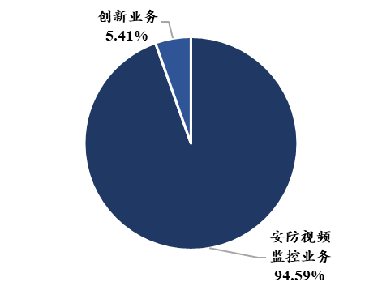

资料来源：wind，中航证券金融研究所整理

图表 73 公司业绩情况（亿元）

资料来源：wind，中航证券金融研究所整理

**以技术为核心，挖掘用户需求。**视频技术是一项非常综合性的技术，公司通过在视频等技术上持续投入，不断发展这些技术以满足用户需求。此外，公司一直在不断完善研发体系，不断优化和发展公司的技术平台、产品平台、系统平台，以持续保持竞争力。

**持续较高水平的研发投入，力求创新，提前布局。**持续较高水平的研发投入是海康威视保持竞争力的核心驱动，2018年公司研发投入人民币44.83亿元。从技术、到产品，再到系统全链条打通。此外公司在业务布局上也力求创新，专门成立创新业务，拓展新应用领域。由于公司较早意识到人工智能的重大意义，因此在算法、软件、硬件方面均提前布局，目前已具备较为完整成熟的人工智能技术、产品和系统。

**5.8、凤凰光学（600071.SH）：子集团资产注入，推动转型升级**

公司是我国第一家光学行业上市公司，业务主要分为光学加工、锂电池、金属加工、光学仪器以及其他业务。

图表 74 2018年业务结构

资料来源：wind，中航证券金融研究所整理

图表 75 公司业绩情况（亿元）

资料来源：wind，中航证券金融研究所整理

**海康子集团注入资产，推动转型升级。**2019年公司收购子集团子公司海康科技旗下智能控制器业务以谋求转型升级，公司以镜片加工为主的传统业务经营亏损，此次收购将有助于公司向镜头、影像模组等高附加值的光学核心部件升级转型，收购资产将为公司提供相关电子制造技术及经验，交易作价4.15亿元。业绩承诺为2019年-2021年净利润分别不低于2,950.55万元、3,739.07万元、4,728.92万元。此次交易进一步体现了子集团框架下的资本运作以及业务整合能力，给公司未来发展方向及业绩提供了保障。

**5.9、天奥电子（002935.SZ）：背靠电科10所，时间频率产品军用龙头**

公司拥有完整的时间频率产品线，是国内少数几家原子钟研制生产企业之一，是国内中高端军用时频核心器件（铷原子钟、晶体器件）、军用时间同步设备及系统的主要供应商，时间同步精度从毫秒到纳秒量级，产品大量应用于航空航天、卫星导航、军用通信及国防装备等领域。业务主要分为两部分，分别是时间频率产品（频率系列产品、时间同步系列产品）和北斗卫星应用产品。

图表 76 2018年业务结构

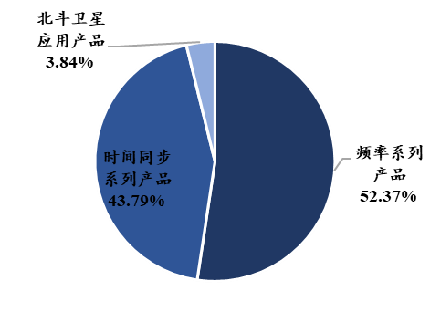

资料来源：wind，中航证券金融研究所整理

图表 77 公司业绩情况（亿元）

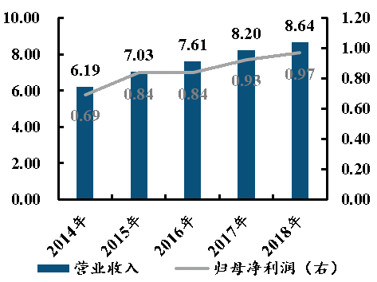

资料来源：wind，中航证券金融研究所整理

**研发投入大幅增加，加码时频、频率组件产品技术革新。**公司加大对时频核心器/部件、频率组件及设备等重点产品和时频应用前沿技术研究。2019年7月公司在北京设立设备与系统第二事业部，开展时频关键技术研发，不断发展形成领先竞争对手的差异化竞争优势。

**公司是华为器件级、设备级供应商。**铷原子钟、Branch等产品持续批量供应华为公司。公司掌握中高端晶体器件、原子钟、时间同步、北斗授时及短报文通信等关键技术，曾主持和参与多项国家、行业标准的制定。另外，公司充分利用科研院所的研发资源，帮助公司在技术方面保持领先优势。公司与中科院国家授时中心、北京航空航天大学共同建立了“原子钟联合实验室”和“量子物理技术联合实验室”，且与中科院国家授时中心签订战略合作框架协议，推动时间频率产业的可持续发展。公司积极开展募投项目的建设，进一步扩大时间频率产品规模生产能力。

**拥有资质优势，下游客户稳定。**公司目前已获得相关机构颁发的生产经营所必须的资质，具备两条贯军标生产线。在布局上公司成立了北京、南京、西安、成都等遍及全国各地的办事处机构，形成了片区化营销网络架构，建立了完善的营销服务网络，客户群包括各部委、军工集团、大型企业（集团）等。公司在为军方客户、民用客户构建时间同步系统的过程中，根据客户实际情况开展定制服务，进一步强化了与客户的技术纽带关系，与客户建立了长期稳定的合作。

**5.10、\*ST电能（600877.SH）：力神子集团收购中国嘉陵，打造军工电源上市平台**

2019年，公司通过重大资产重组，出售全部原有业务相关资产和负债，购买空间电源100%股权和力神特电85%股权，注入特种锂离子电源领域的资产。主营业务将变为特种锂离子电源。

**背靠力神子集团，打造军工电源上市平台。**空间电源业务为空间储能电池，产品应用于空间飞行器、地面通信设备、水中特种设备、无人机以及特种装备等领域。力神特电是国内最早研制特种锂离子电池组的企业之一，产品主要应用于通信、航空、船舶、车辆等领域。力神特电已成为国内最大的特种通信装备和特种便携式无人机用锂离子电池组供应商，在通信电池、无人机电源、AGV电源等领域形成了处于国内领先地位的技术优势，其特种锂离子电源产品广泛应用于各军工科研院所、军工企事业单位及各军种部队，与多个特种装备采购部门及下属科研院所、中央企业下属的科研院所及整机企业建立了长期稳定的合作关系。此次收购后\*ST电能将成为我国军工电源领军上市企业。

**六、风险提示**

**集团人事变动；西方对华封锁等国际事态加剧；院所改制、混改进度缓慢；国内政策变动等。**

**温馨提示：** 

近日微信订阅号调整了推送规则，消息不再按照推送时间排序了。如果不想错过我们的精彩文章，不妨进入公众号主页给“军工会”加上星标，或者在阅读文章的底部点击“在看”。这样，我们的文章才会每天第一时间出现在您的订阅号列表中。您也不会遗漏可能的重要信息。

来源：中航军工研究

> [我国军工科研院所的现状及分类改革模式](https://mp.weixin.qq.com/s?__biz=MzI4NDcxNDIwOQ==&mid=2247483917&idx=1&sn=ac53b1beb686dad884f59527ef0b1f42&chksm=ebf67783dc81fe95fdbcf83e9befa6db1b23857ca7e4562304864116e0c903ccb6695684e973&token=1298384175&lang=zh_CN&scene=21#wechat_redirect)
> 
> [十二大军工集团全部完成央企改制，混改大幕已正式拉开](https://mp.weixin.qq.com/s?__biz=MzI4NDcxNDIwOQ==&mid=2247484525&idx=1&sn=204b44cb8f39531e2b6f3ce96540b1a6&chksm=ebf671e3dc81f8f526e3dc2659f0389de69f542cfaefbd3c5cec1cb509637aa0f5cb467be842&token=1582924943&lang=zh_CN&scene=21#wechat_redirect)
> 
> [中国电子科技集团有限公司家族谱](https://mp.weixin.qq.com/s?__biz=MzI4NDcxNDIwOQ==&mid=2247484531&idx=1&sn=fdbdfe0275e3594aa3f2e2cf71d5216d&chksm=ebf671fddc81f8eb9c6d8fad4581c7cd89267f38791caf44336493e1f82bba399fdae639f593&token=1582924943&lang=zh_CN&scene=21#wechat_redirect)
> 
> [2018最新央企排名及旗下上市公司全名单](https://mp.weixin.qq.com/s?__biz=MzI4NDcxNDIwOQ==&mid=2247483875&idx=1&sn=889ba060b796edf58836b178e31d3515&chksm=ebf6746ddc81fd7b8d68c5c76da84b8c068b9da4c3b282ace3746b984bbfacb2e5d73d62d2dc&token=1298384175&lang=zh_CN&scene=21#wechat_redirect)
> 
> [政府采购六种采购方式流程图](https://mp.weixin.qq.com/s?__biz=MzI4NDcxNDIwOQ==&mid=2247484547&idx=3&sn=ab55f95a5a5c96227f8a47a7fab10d5f&chksm=ebf6710ddc81f81b1ab9efcb8d9b521eeb2db8b1cd586fdbb2e595760db0ba334d7fc4fb1534&token=1582924943&lang=zh_CN&scene=21#wechat_redirect)

编辑声明：本平台发布部分内容来自公开资料或网络，版权归原作者所有，转载目的在于传递信息及用于网络分享，不代表本号赞同其观点和对其真实性负责，如涉版权问题，请联系我们删除！

**精彩内容长按二维码即可关注**

预览时标签不可点

收录于话题 #
个
上一篇 下一篇

阅读

分享 收藏
赞 在看

已同步到看一看[写下你的想法](javascript:;)

前往“发现”-“看一看”浏览“朋友在看”

前往看一看

**看一看入口已关闭**
在“设置”-“通用”-“发现页管理”打开“看一看”入口
[我知道了](javascript:;)

已发送

取消

#### 发送到看一看

发送

中国电子科技集团报告：军工电子国家队，自主可控核心力量

最多200字，当前共字

发送中

喜欢此内容的人还喜欢

[江苏省委书记娄勤俭在苏州会见高瓴创始人张磊__江苏省委书记娄勤俭在苏州会见高瓴创始人张磊__...__北京西路瞭望__不喜欢__不看的原因_确定___ 内容质量低___ 不看此公众号](javascript:void(0);)
;)
;)[习近平在浙江 （三十九）——“《之江新语》是习书记在浙江期间思考与实践的宝贵结晶”__习近平在浙江 （三十九）——“《之江新语》是习书记在浙江期间思考与实践的宝贵结晶”__...__学](javascript:void(0);)
;)
;)[“乡村治理典型模式（渝水）研讨会”在江西省新余市渝水区举行__“乡村治理典型模式（渝水）研讨会”在江西省新余市渝水区举行__...__微观三农__不喜欢__不看的原因_确定___ 内容质量低___](javascript:void(0);)
;)
;)

微信扫一扫
关注该公众号

 微信扫一扫
使用小程序

[取消](javascript:void(0);) [允许](javascript:void(0);)

[取消](javascript:void(0);) [允许](javascript:void(0);)

[知道了](javascript:;)

**长按识别前往小程序**

原文链接：<https://mp.weixin.qq.com/s/M2QZPVtVT27wvw_0gBh4Sw>
