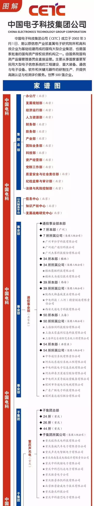
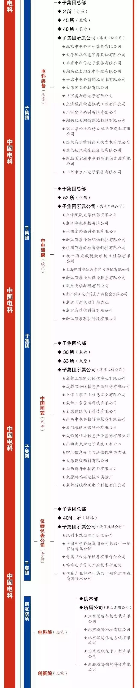
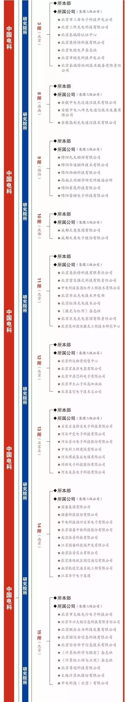
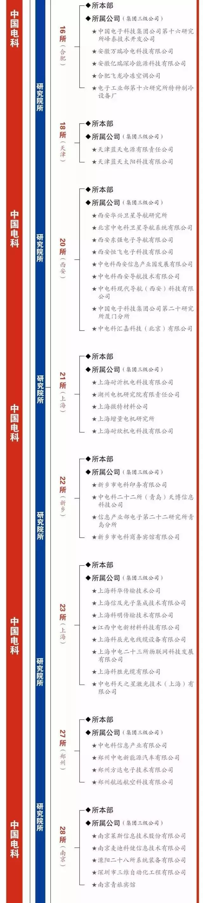
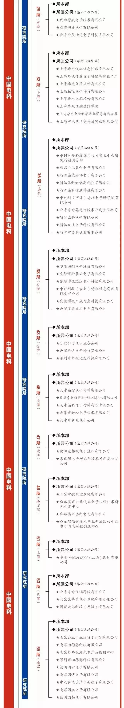
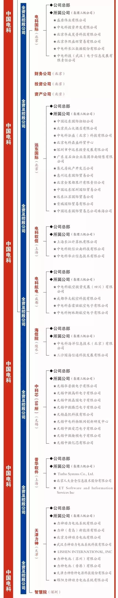

# 中国电子科技集团有限公司家族谱

     

## 中国电子科技集团有限公司家族谱

[小熊军工汇](javascript:void(0);)

**小熊军工汇** 

微信号 gh\_e66ff3a808f6

功能介绍 原军工汇失联 ，聚焦国际军工顶层智慧、传递军事热点、传播国防知识、专注于军工现状及趋势分析，军工材料发展、推介军工企业、产品，军工（旅）原创文章、观点交流、产品投融资服务等

_2019-02-14_

收录于话题

中国电子科技集团公司成立于2002年3月1日，以原信息产业部直属研究院所和企业为基础组建而成，是国务院授权国务院国有资产监督管理委员会管理的中央企业，主要业务包括通信设备、计算机、电子设备制造、软件开发及应用、电子技术研究及服务、投资与资产管理等。中国电子科技集团公司是经国家批准组建的国有企业集团，是国家批准授权的20家投资机构之一。

集团公司总部设在北京，所属二级成员单位58家，三级公司184家，分布在全国18个省市区。其中，有7家公司是上市公司，包括杰赛科技、海康威视、太极股份、华东电脑、四创电子、卫士通和国睿科技。集团公司注册资本47.68亿元，2013年实现总收入1200亿元，2015年更是实现了双30%增长，财务绩效首次跃居中央企业的第1名，2016年7月20日，《财富》杂志发布世界500强，中国电科位列408位。2016年8月11日，中国电科更换新标志！

   

热点文章：

> [我国军工科研院所的现状及分类改革模式](https://mp.weixin.qq.com/s?__biz=MzI4NDcxNDIwOQ==&mid=2247483917&idx=1&sn=ac53b1beb686dad884f59527ef0b1f42&chksm=ebf67783dc81fe95fdbcf83e9befa6db1b23857ca7e4562304864116e0c903ccb6695684e973&token=1298384175&lang=zh_CN&scene=21#wechat_redirect)
> 
> [2018最新央企排名及旗下上市公司全名单](https://mp.weixin.qq.com/s?__biz=MzI4NDcxNDIwOQ==&mid=2247483875&idx=1&sn=889ba060b796edf58836b178e31d3515&chksm=ebf6746ddc81fd7b8d68c5c76da84b8c068b9da4c3b282ace3746b984bbfacb2e5d73d62d2dc&token=1298384175&lang=zh_CN&scene=21#wechat_redirect)
> 
> [装发年底又放招，1.6亿等你拿 | 国防科技重点实验室基金](https://mp.weixin.qq.com/s?__biz=MzI4NDcxNDIwOQ==&mid=2247483880&idx=1&sn=861f0bef34b438b53eac5bdeb3f82569&chksm=ebf67466dc81fd70b4c2d1670775b64ee65641dc769f2c1e66121b05ba5bc0c30e88324eee91&token=1298384175&lang=zh_CN&scene=21#wechat_redirect)
> 
> [办理保密资质需要具备哪些保密设备](https://mp.weixin.qq.com/s?__biz=MzI4NDcxNDIwOQ==&mid=2247483932&idx=1&sn=81eb012d43d7dec5028f6053bdd653f7&chksm=ebf67792dc81fe844a5d50162c83996e74baaae488ecadffe1c97f9e9fdc6cb578c6bc7c0f40&token=1298384175&lang=zh_CN&scene=21#wechat_redirect)

****扫描关注下方二维码回复“军工会”扫描小编微信二维码，小编拉您进********【军工会】********交流群哦！****

编辑声明：本平台发布部分内容来自公开资料或网络，版权归原作者所有，转载目的在于传递信息及用于网络分享，不代表本号赞同其观点和对其真实性负责，如涉版权问题，请联系我们删除！

**精彩内容长按二维码即可关注**

预览时标签不可点

收录于话题 #
个
上一篇 下一篇

阅读

分享 收藏
赞 在看

已同步到看一看[写下你的想法](javascript:;)

前往“发现”-“看一看”浏览“朋友在看”

前往看一看

**看一看入口已关闭**
在“设置”-“通用”-“发现页管理”打开“看一看”入口
[我知道了](javascript:;)

已发送

取消

#### 发送到看一看

发送

中国电子科技集团有限公司家族谱

最多200字，当前共字

发送中

喜欢此内容的人还喜欢

微信扫一扫
关注该公众号

 微信扫一扫
使用小程序

[取消](javascript:void(0);) [允许](javascript:void(0);)

[取消](javascript:void(0);) [允许](javascript:void(0);)

[知道了](javascript:;)

**长按识别前往小程序**

原文链接：<https://mp.weixin.qq.com/s/9IQ5NvGIi4NKrh9xuzuxQA>
