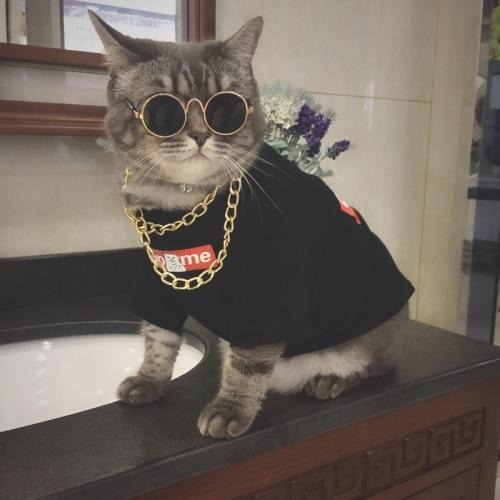

# 五分钟读懂企业上市流程 - 知乎

<https://www.zhihu.com/signin?next=https%3A%2F%2Fzhuanlan.zhihu.com%2Fp%2F26688446%3Futm_id%3D0>打开App

# 五分钟读懂企业上市流程

5 年前

[!unknown_filename.jpeg(.__resources_五分钟读懂企业上市流程_-_知乎.resources_unknown_filename.jpeg)](//www.zhihu.com/people/yu-xin-96-53-91)

[YUXIN2016](//www.zhihu.com/people/yu-xin-96-53-91)

私募股权

​关注

**公司上市流程六大阶段**

**第一阶段：改制设立**

即企业将原有的全部或部分资产经评估或确认后作为原投资者出资而设立股份公司。

**1.立项**
企业与中介确立合作关系。

**2.改制**
1）尽职调查：对企业进行尽职调查。
2）确定改制方案
3）中介机构出具改制文件：顾问公司、律师、会计师、评估师入场
4）召开创立大会
5）办理工商登记

**第二阶段：上市前辅导**

在取得营业执照之后，股份公司依法成立，按照中国证监会的有关规定，拟公开发行股票的股份有限公司在向中国证监会提出股票发行申请前，均须由具有主承销资格的证券公司进行辅导，辅导期限一年。辅导程序:

1.聘请辅导机构。辅导机构应是具有保荐资格的证券经营机构以及其他经有关部门认定的机构。
2.与辅导机构签署辅导协议，并到股份公司所在地的证监局办理辅导备案登记手续。
3.正式开始辅导。辅导机构每3个月向当地证监局报送1次辅导工作备案报告。
4.辅导机构针对股份公司存在的问题提出整改建议，督促股份公司完成整改。
5.辅导机构对接受辅导的人员进行至少1次的书面考试。
6.向当地证监局提交辅导评估申请。
7.证监局验收，出具辅导监管报告。
8.股份公司向社会公告准备发行股票的事宜。股份公司应在辅导期满6个月之后10天内，就接受辅导、准备发行股票的事宜在当地至少2种主要报纸连续公告2次以上

**第三阶段：股票发行筹备**

**准备工作:**

1.聘请律师和具有证券业务资格的注册会计师分别着手开展核查验证和审计工作。
2.和保荐机构共同制定初步发行方案，明确股票发行规模、发行价格、发行方式、募集资金投资项目及滚存利润的分配方式，并形成相关文件以供股东大会审议。
3.对募集资金投资项目的可行性进行评估，并出具募集资金可行性研究报告;需要相关部门批准的募集资金投资项目，取得有关部门的批文。
4.对于需要环保部门出具环保证明的设备、生产线等，应组织专门人员向环保部门申请环保测试，并获得环保部门出具的相关证明文件。
5.整理公司最近3年的所得税纳税申报表，并向税务部门申请出具公司最近3年是否存在税收违规的证明。

**第四阶段：申报和审核**

**1.申报材料制作**

1)招股说明书及招股说明书摘要;
2)最近3年审计报告及财务报告全文;
3)股票发行方案与发行公告;
4)保荐机构向证监会推荐公司发行股票的函;
5)保荐机构关于公司申请文件的核查意见;
6)辅导机构报证监局备案的《股票发行上市辅导汇总报告》;
7)律师出具的法律意见书和律师工作报告;
8)企业申请发行股票的报告;
9)企业发行股票授权董事会处理有关事宜的股东大会决议;
10)本次募集资金运用方案及股东大会的决议;
11)有权部门对固定资产投资项目建议书的批准文件(如需要立项批文);
12)募集资金运用项目的可行性研究报告;
13)股份公司设立的相关文件;
14)其他相关文件，主要包括关于改制和重组方案的说明、关于近三年及最近的主要决策有效性的相关文件、关于同业竞争情况的说明、重大关联交易的说明、业务及募股投向符合环境保护要求的说明、原始财务报告及与申报财务报告的差异比较表及注册会计对差异情况出具的意见、历次资产评估报告、历次验资报告、关于纳税情况的说明及注册会计师出具的鉴证意见等、大股东或控股股东最近一年又一期的原始财务报告。

**2\. 发行审核**

**1）申报：**
发行人应当按照中国证监会的有关规定制作申请文件，由保荐人保荐并向中国证监会申报。特定行业的发行人应当提供管理部门的相关意见。

**2）受理：**
中国证监会收到申请文件后，在5个工作日内作出是否受理的决定。

**3）初审：**
中国证监会受理申请文件后，由相关职能部门对发行人的申请文件进行初审。中国证监会在初审过程中，将征求发行人注册地省级人民政府是否同意发行人发行股票的意见，并就发行人的募集资金投资项目是否符合国家产业政策和投资管理的规定征求国家发改委的意见。

**4）预披露：**
根据《证券法》第二十一条的规定，发行人申请首次公开发行股票的，在提交申请文件后，应当按照国务院证券监督管理机构的规定预先披露有关申请文件。因此，发行人申请文件受理后、发审委审核前，发行人应当将招股说明书(申报稿)在中国证监会网站预先披露。发行人可以将招股说明书(申报稿)刊登于其企业网站，但披露内容应当与中国证监会网站的完全一致，且不得早于在中国证监会网站的披露时间。

**5）发审委审核：**
相关职能部门对发行人的申请文件初审完成后，由发审委组织发审委会议进行审核。

**6）核准发行**
中国证监会依照法定条件对发行人的发行申请作出予以核准或者不予核准的决定，并出具相关文件。自中国证监会核准发行之日起，发行人应在6个月内发行股票；超过6个月未发行的，核准文件失效，须重新经中国证监会核准后方可发行。此外，发行申请核准后、股票发行结束前，发行人发生重大事项的，应当暂缓或者暂停发行，并及时报告中国证监会，同时履行信息披露义务。影响发行条件的，应当重新履行核准程序。股票发行申请未获核准的，自中国证监会作出不予核准决定之日起6个月后，发行人可再次提出股票发行申请。

**第五阶段：促销和发行**

**1.询价**
首次公开发行股票，应当通过向特定机构投资者询价的方式确定股票发行价格。

**2\. 路演推介**
在发行准备工作已经基本完成，并且发行审查已经原则通过(有时可能是取得附加条件通过的承诺)的情况下，主承销商(或全球协调人)将安排承销前的国际推介与询价，此阶段的工作对于发行、承销成功具有重要的意义。这一阶段的工作主要包括以下几个环节：

**1）预路演**
预路演是指由主承销商的销售人员和分析员去拜访一些特定的投资者，通常为大型的专业机构投资者，对他们进行广泛的市场调查，听取投资者对于发行价格的意见及看法，了解市场的整体需求，并据此确定一个价格区间的过程。

**2）路演推介**
路演是在主承销商的安排和协助下，主要由发行人面对投资者公开进行的、旨在让投资者通过与发行人面对面的接触更好地了解发行人，进而决定是否进行认购的过程。通常在路演结束后，发行人和主承销商便可大致判断市场的需求情况。

**3.簿记定价**
簿记定价主要是统计投资者在不同价格区间的订单需求量，以把握投资者需求对价格的敏感性，从而为主承销商(或全球协调人)的市场研究人员对定价区间、承销结果、上市后的基本表现等进行研究和分析提供依据。

以上环节完成后，主承销商(或全球协调人)将与发行人签署承销协议，并由承销团成员签署承销团协议，准备公开募股文件的披露。

**第六阶段：股票上市和后续**

1.拟定股票代码与股票简称。股票发行申请文件通过发审会后，发行人即可提出股票代码与股票简称的申请，报深交所核定。
2.上市申请。发行人股票发行完毕后，应及时向深交所上市委员会提出上市申请，
3.审查批准。证券交易所在收到发行人提交的全部上市申请文件后7个交易日内，作出是否同意上市的决定并通知发行人。
4.签订上市协议书。发行人在收到上市通知后，应当与深交所签订上市协议书，以明确相互间的权利和义务。
5.披露上市公告书。发行人在股票挂牌前3个工作日内，将上市公告书刊登在中国证监会指定报纸上。
6.股票挂牌交易。申请上市的股票将根据深交所安排和上市公告书披露的上市日期挂牌交易。一般要求，股票发行后7个交易日内挂牌上市。
7.后市支持。需要券商等投资机构提供企业融资咨询服务、行业研究与报道服务。

参考资料：洞见知行、网络等

【来源：私募通综合整理】

本文由清科私募通原创，转载请注明出处。

更多信息请关注清科研究（微信ID：pedata2017）

编辑于 2017-05-03 03:10

女性的直觉可信度有多高？

烟雨平生

11 月，我出差的一个晚上，老公发了张洗澡后的照片给我。照片里，他裸着上半身，镜头对着盥洗台上的镜子。他在向我卖弄身材，我却敏锐的发现，我的小黑瓶换了个位置，从置物架上到了置物架下。他一个大男人，用女生护肤品做什么？我怀疑家里有女人，但当时不可能赶回去，也不想打草惊蛇，而且，万一猜错了怎么办？12 月中旬，我再次出差，并故意提前回来，见他不在家，就给他打电话，他说和哥们儿在酒吧，我直接去了我们常去那家酒吧。他确实和哥们儿在一起，坐在靠窗的卡座里，哥们在起哄，他和他的「好妹妹」抱着在啃！站在进门处的酒架玄关后，听着他们高声地起着哄，我气得浑身发抖，所有细胞都叫嚣着：冲过去，冲过去！撕烂这群混账！1我老公叫张迪，是我初恋。我不是那种很美的女生，在张迪之前，没有人追过我。当年张迪追我，我表面矜持，内心却怀着小庆幸和感激，只假装犹豫了一个晚上就答应了。他也不是帅气的男生。我以为丑一点安全，不会在外面招摇。我们很快在一起。我巴心巴肝对他好，我知道他有个白月光，是他的初恋，我看过照片，确实长得比我好。就是他正在啃的那个！一年多来，白月光和她第 N 任男朋友分了，找张迪哭诉。张迪这个万年备胎，天天请吃请喝安慰她，我虽心里不舒服，但张迪赌咒发誓，叫我相信他人品，说白月光现在只是他「妹妹」。白月光更是一口一个「嫂子」，一会儿倾慕我的才华，一会儿夸我是业界精英，一会儿说我御夫有术，说张迪对我多好多好……彩虹屁一个接一个，夸得我信以为真。加上白月光确实漂亮，和张迪站在一起，活脱脱一朵鲜花插在牛粪上，渐渐地，我对他们失去防范。上个月领证时，白月光还专门请我们吃饭，祝我们白头到老，说最幸运的事情就是通过张迪认识了我这个嫂子！如今……这算什么？！我冷静下来后，掏出手机，「啪啪啪」把他们抱着啃的场景拍下来。万事都要讲证据，就算离婚，就算闹上法庭，谁主张谁举证，我得呈上个东西。从这家酒吧出来，我到隔壁酒吧，找了个能看见这边门口的位置，点了杯威士忌加冰。一个多小时后，那对狗男女搂搂抱抱上了同一辆出租车，我尾随而至，竟看见他们回到我和张迪的住处！这是我们专门为结婚买的房子，刚搬进来不到半年。这简直是赤裸裸的侮辱！我坐在出租车上，指甲深深掐入肉里，眼睛瞪得生疼，脑海里全是冲上去手撕贱人，又或者捉奸在床的场景……然而，理智告诉我：这个时候手撕，结果不外乎简简单单离婚，对他们没有半点损伤，甚至有可能，这两人联合起来把我揍一顿！这年头，社会新闻版，原配捉奸，老公连同小三把原配揍一顿的事儿还少了吗？「小姐，你下车吗？」「不了。」我报了附近一家酒店的名字，我需要好好想想下一步怎么做，他们的软肋是什么。2几分钟后，张迪的电话打过来。我看着来电显示上「老公」二字，想起回来时放在客厅里的行李箱，迅速揉了揉脸，深吸了口气，这才接起电话——「老婆，你在哪儿呢？是不是回来了？我刚从酒吧回来，喝高了。」他的声音满是疲惫，装得很像。「我回报社了，专题出了点问题，所有人都在加班，不知道要忙到几点！」我忍着恶心，语气暴躁，「哎，先不给你说了，烦死了！这工作还有完没完！」「那你快忙，我等你。」张迪挂了电话。我冷笑。等我？怎么等？和白月光滚床单等吗？这种事情，从前发生了多少次？刚才他们进门时，看见行李箱吓一跳吧？！我买的房子，凭什么睡酒店的是我？！我今天的所有委屈，都要他们加倍奉还！那天夜里，我彻底失眠，一直在盘算……3第二天一早，我正在洗漱。张迪给我打电话，肉麻问我工作做完了吗？说心疼我，爱我，叫我忙完后赶紧回家休息。我对着镜子翻白眼，嘴痒痒想问他「床单洗了吗？房间通风了吗？骚味儿还有吗」，忍下后回答，「刚忙完，和同事吃个早饭就回。」上午 10：00，我回到小区。【第一件事不是回家，而是到小区物管处。】我谎称家中失窃，要求调取我们那层楼的监控。物管小妹妹认识我，带我到监控室，还专门给我匀了台电脑。我头天晚上已经把最近半年的出差时间列出来，坐在电脑前一个个时间段的找。那两个人，果然不要脸，每次还没进门，就已经抱着啃了起来。我们小区的监控视频保存时间是三个月，我在三个月的时间段里，找了四段他们抱着啃进门的视频。麻痹，要搞到外面去搞！我趁着没人注意，迅速用小 U 盘把那几段拷贝下来。【第二件事才是回家。】战场打扫得很干净，能打开的窗户都打开了，被褥叠得整整齐齐，垃圾桶里半点垃圾都没有。我的行李箱已经收拾好了，脏衣服丢在洗衣机，干净衣服挂在衣柜里。若不是亲眼目睹了昨夜的一切，我怕还会继续以为找到了真爱且体贴我的男人。我坐在沙发上，随手拿起放在沙发扶手上的 iPad，【打开微信】。这个男人，因为喜欢「吃鸡」（打游戏《和平精英》），微信常年登录状态。我先看了他和白月光的【聊天记录】。删得并不干净，却很聪明，言语中没有任何暧昧，也就是正常约饭的时间地点，且全是我会参加的。我冷哼，打开【「我」-「支付」-「钱包」-「账单」】，所谓百密一疏，上面每一笔从微信出去的开销都清清楚楚。发红包是日常，大大小小都有。然后是酒店的，看时间和价格应该是钟点房；情趣用品店的，不知道买的是什么；还有商场，花店，甜品店的众多开支……这两个人，挺频繁的。我没截图，而是用手机拍照，免得在 iPad 上留下痕迹。最后才是【打开炒股软件】。我是财经记者，和圈内很多大佬熟，这几年跟着他们赚了不少钱，特别是股市。张迪炒股是我手把手教的。他的账户密码都是我给申请的，他没改密码，方便我偶尔帮他操作，我拉了流水账出来，手机录了段视频。我和他虽然没办婚礼，但在法律上，那是实打实的夫妻。我不图他的钱，但我也不想我的钱被他算计了！婚前财产好说，婚后这半年还真不好说。有了这两份流水就不一样了，我们各自理财，他收入的绝大部分在股市，另一部分，微信支付账单显示得清清楚楚，花在白月光身上呢！说来可笑，我和他在一起两年，共同生活的开销基本花我的钱。我不是那种有了男朋友，就得让男朋友养我的人，我家的家庭教育是：【女人经济要独立，婚姻才有底气。】而现实生活，很多时候是：【男人把钱花在谁的身上，就会爱谁多一点，男人心疼钱，就会心疼女人。】4下午 3 点，张迪给我打电话。一是问我休息好了没，二是约我晚上在外面吃饭，说我「出差+加班」辛苦了，要好好犒劳。「还有谁？」我装作很随意地问。「昨天才和兄弟们喝了酒，今天不叫他们了。」张迪想了想，「周月说好久没见你了，要不我问问她？」周月就是白月光。「行，刚好带了伴手礼要给她。」我笑着说，「你不许提前说，不然惊喜就没了！」张迪一口答应，问我怎么没有给他买礼物？我心下鄙视，唇边笑意不减：「当然有了，晚上给你！是你喜欢的。」张迪在话筒那边亲了两下。这样亲昵的小举动，我以前受用极了，现在只觉恶心。张迪叫我再休息一会儿，晚上见。我哪敢休息？内心熊熊火焰让体内每个细胞都在燃烧。我「咻」的站起，先给「跑公安口」的闺蜜打了个电话，三言两语把事情说了，我需要监听器，问她除了某宝，还有哪里能买，立即马上就要。她说电子城，并给了我一个店铺的名字。我道了声谢。闺蜜「哎」了一声叫住我：「胜男，我可提醒你，监听这事儿是违法的，用这种方式取得的证据，法院不受理。」「我知道，一旦被抓，情节轻的，《治安管理法》，5 日以下拘留或 500 元以下罚款，重的就《刑法》了。」我说，「放心，不会扩散，更不会蠢到做证据，我会很小心不会被发现，我就想看看张迪到底是人是鬼！」闺蜜再次提醒我小心：罚款事小，留下案底事大。我「嗯」了一声，飞快洗澡、换衣服、化妆……5吃火锅的地方是我们经常去的那家。我给白月光送了一支 A 牌的口红，又配了一支手工唇膏，监听器贴在手工唇膏的内管底部。我给她说，手工唇膏是我亲手做的，出差的时候，有半天闲暇，就在店里学做了几支。白月光抱着我的手臂，蹭了又蹭，一个劲儿的夸我能干，不但会炒股，还心灵手巧，连唇膏都会做。至于 A 牌的口红，她明显更喜欢，眼睛里闪着光，说刚好没有那个色号，夸我敞亮大气。张迪在旁边看着，假装吃醋地说，我对白月光比对他还好。「那是自然，我比你好看！」白月光撒娇地瞥了他一眼，「胜男姐若是男生，我肯定主动追求她！」张迪笑着点餐，在菜单上勾勾画画。我瞟了几眼。怎么说呢？很多细节，当一个人信任另一个人的时候，是不会发现的；可当信任崩塌，每一个细节都是疑点。张迪勾菜品时，最先勾的是白月光喜欢的，然后是他喜欢的，最后才是我爱吃的。我暗骂自己从前蠢，白月光这种存在，根本不该掉以轻心。火锅吃了一半，张迪和白月光有一搭没一搭问我，这次出差有什么收获？临近过年，有没有什么好股推荐？这是日常话题，每次和他们一群人吃饭，聊得最多的就是股票，基本是我叫他们买什么，他们就买什么，也基本都能赚。这一次，我没立即回答。我说要好好研究一下，买个普通的，和大盘持平没意思，得找个大牛，狠狠赚一笔。那两个人眉开眼笑。我也在笑。我不是善男信女，别指望我被绿了后，还帮你们赚钱！6送给张迪的是一个 L 家的钱夹子，比他之前的钱夹子高出了不止两个档次。「我以为你就记得周月，看你对她比对我还好。」张迪坐在我旁边，美滋滋地把各种卡片从老的钱夹子换到新的钱夹子里。「哪能呢？」我削着橙子，心想我 TM 以前真是犯贱，嘴上笑着，「还不是看在你的面子上，说白了，也是想给你争口气。我就是想告诉她，没了她，你一样过得好，而且能过得更好！」张迪坐的位置在我后方一点，我能很清晰感觉到他看着我。若是以前，我肯定会以为他又被我感动了，如今，我只觉可笑。他心里想的是「傻瓜」吧！这世上哪有那么多「感动」与「被感动」，大多数时候我们以为的「感动」都只是「自我感动」。「胜男，你对我真好！」他从后面抱住我。我心里烦腻，感觉恶心，脏。我不是有洁癖的人，耍朋友之前，他有多少女人都与我无关，可现在，我们是夫妻，他再在外面乱搞，我就觉得脏。我把削好的橙子分一半给他，催促他吃了就去洗澡。他可能误会了，三两口把橙子吃完，表示「立即马上洗香香，为老婆服务」，我笑笑，慢条斯理把另外一半橙子吃完，然后把事先准备好的监听器塞到钱夹子里。现在的钱夹子，除了身份证经常用，社保卡偶尔用，其他各种卡，银行卡也好，贵宾卡也罢，一年用不了两次，基本就是个摆设。我不担心他会发现，就算发现，不认就是了，再说，我只打算偷听几天，等监听器没电了，随便找个机会把监听器丢了。7监听器的软件没在我日常用的手机上。我头天买监听器的时候，顺便买了个二手手机，找同城快递送到报社，收件人是我。那时的我，做梦也没想到——安上监听器那一刻，就等于推下了多米诺骨牌的第一块，之后，每一个骨牌倒下，都仿佛开启一个潘多拉盒子。人性的恶，像深渊里的龙。 第 2 章 人生是多米诺骨牌快递放在报社门卫处，我取出手机，迫不及待来到小办公室，戴上耳机。出乎意料的是，白月光居然还有个男朋友，而且就那么巧，昨天晚上，她去了男朋友那里，并把我送给她的唇膏送给男朋友。之后是一大段「嗯嗯啊啊」，停顿处有聊天。白月光问男朋友「什么时候带她回家」，抱怨「从来没见过男朋友的朋友」。男朋友坦然说「家里不会同意」，说白月光配不上他，还说像他那种家境，肯定要找个门当户对的。我很不厚道地笑了。被张迪捧在手心的女神，在富二代眼里，也就是个见不得光的。监听器有定位，我瞟了眼手机上的位置，对方在我市很出名一个高档小区，住的人非富即贵。白月光哭唧唧：「你把我当什么了？pao 友吗？我一心一意对你，没想到你是这样的人！我要分手！」富二代赶紧哄着：「现在是创业期，外人看起来风光，其实一年营收不过几百万，和家族企业比起来，不过九牛一毛。」还说等事业做起来了，白月光是唯一同甘共苦的女人，要【送她一辆玛莎拉蒂做聘礼】！玛莎拉蒂！我承认，我酸了，世人皆爱绿茶。「你那公司，什么时候起来啊？」白月光撒娇地问。「快了快了，等风口。风口一到，猪都能飞到天上去！」富二代亲呢地说，然后一大堆对未来的畅想。核心一个词：区块链。很不巧，因为比特币的缘故，我了解过区块链，也采访过国内区块链公司，多少懂一点。富二代那一套说辞，既没含金量，也没差异化优势，甚至还有金融概念模糊不清的地方。我怀疑白月光被骗了。这年头的富二代，家里普遍重视教育，无论学识还是见识，都比普通人高许多，在不擅长领域创业的可能性实在太小。8唇膏留在富二代那里，监听器同样留在那里。我把线路切到张迪那边，他一上车就拨通了白月光的电话。车载蓝牙。我把两人对话听得清清楚楚——「丑死了，每天早上醒来吓一跳，以为旁边睡了个鬼！月儿，你老公每天就靠着你洗洗眼睛才能活下来……想到还要和母夜叉生活几年，我就头发发麻，万一熬不住怎么办？」「那咱们中午老地方见？」白月光吃吃笑，「……想想丑八怪的钱，还有好几套房子，乖，你再忍忍……我待会儿好好犒劳犒劳你！」张迪「嗯」了一声，语气轻佻，「你知道我喜欢什么。」白月光声音娇得都快滴出水了：「知道……讨厌得很……」两人一直撩骚。我心脏位置的那团火，如火山一般，疯狂的喷涌着！眼睛也痛得不得了。这就是我要嫁的男人……一口一个母夜叉，还自称是其他人的老公！我的自尊在这一刻被人狠狠踏入泥里，反复摩擦！9我给跑公安口的闺蜜打电话，几分钟后，她敲我办公室的门。开门后，她吓了一跳：「你眼睛怎么红成这样？……张迪又怎么了？」我把耳机递给她，调出车上那段话。她同样气得够呛，一个劲儿地骂「混蛋，垃圾，人渣」，问我打算怎么办？怎么办？这可不是简单的【婚内出 gui】，【嫌我丑了】，张迪明确地表示「只生活几年」，白月光更是直接提醒他，为了钱和房子！也就是说：这场婚姻，原就是一场算计！我的房子！我的存款！我炒股的眼光！甚至，我爸妈的财产！爸妈只有我一个女儿，我们在老家有三套房子，其中两套都写着我的名字，他们说的几套房子，应该就包括这两套！我盯着比我大几岁的闺蜜，半晌咬着牙：「姐，帮我！」10我的眼睛气得充血了，眼白几乎看不见，真正恐怖。我跑去医院开了许多药，然后顺理成章成了病人，不履行妻子义务，每天背对他睡觉。张迪省得看见我的脸，但他又是个欲望很强的人，晚上得不到排解，每天都要找白月光。白月光很忙，一个人应付两个男人。陪睡不是事儿，真正麻烦的是，她要努力让自己配得上「富二代」。【她缺钱，缺很多很多钱。】她不止一次问张迪也问我，什么时候才能选出牛股，最好天天涨停。她想在年前套现一大笔，注资「富二代」的公司，然后趁着过年，作为合作伙伴，也作为女朋友，和富二代回家见家长。当然，这些话不可能给张迪说。她给张迪的版本是：一想到张迪和我结婚就心痛……她想狠赚一笔，不为了钱委屈自己……想张迪早点离婚，他们好早点名正言顺在一起。张迪很感动，当天下午没上班，和白月光在酒店厮混，还给我打电话，说晚上加班很晚才回。我呵呵哒。几个人中，最忙的是「富二代」。那是个实打实的「海王」，除了周月，还有 ABCD 好几个女朋友。他比张迪聪明。人设高高在上，「富二代」，「家族企业」，「创业精英」，住豪宅开豪车，擅说甜言蜜语，且出手大方，就我在监听器里听到的，每每送出去的，不是顶级护肤品就是奢侈品牌的包。他的众女友最近有一个共同目标：过年回家见家长。只可惜，时机不利！富二代一会儿要扩大公司规模，一会儿公司偷税漏税被查，一会儿打算投资地皮……总之，资金周转不灵，这时候若带女友回家，必定遭人诟病。女朋友们有的提出向公司注资，成为股东，有的直接借钱给富二代。富二代承诺所有打算给他拿钱的女人，过年带她们回家，排除万难也要在一起！我和闺蜜对视着，异口同声说了三个字：「杀猪盘！」11「杀猪盘」是诈骗团伙自己起的名字。姑娘们是「猪」，人设和恋爱是「猪饲料」，恋爱过程是「养猪」过程，最后骗取钱财，就是「杀猪」。富二代打算批量杀猪。我和闺蜜第一反应是【报警】，多年记者生涯，特别她跑公安口的，正义感比普通人更重。第二反应才是，我们可以【利用「富二代」狠狠报复白月光和张迪】。选 A 还是 B，我和闺蜜陷入两难。正如之前《奇葩说》的一期节目：「美术馆着火了，一幅名画和一只猫，只能救一个，你救谁？」名画是遥远的哭声，那些我们没有看见的，推测出来的受害人是遥远的哭声。猫是近处的哀嚎，我被欺骗的爱情，被摁在地上反复摩擦的自尊是近处的哀嚎。我们最终【选择了自私】，重新设计了报复的每一步，且把「杀猪盘」列为报复的重要环节。我发誓，这辈子，我从来没有干过如此爽快的事！

7 万点赞 · 877 评论 · 盐选推荐

评论 4

写评论

追梦人

总有一天我会做到上市。

2018-08-31

​回复

11

lumous

加油bro

07-22

​

赞

神秘男人

复杂

2018-06-21

​回复

1

lumous

总结到位，感谢

07-22

​回复

赞

### 推荐阅读

[企业上市整套流程知识
企业上市过程中 经常会遇到种种问题希望可以有一个权威的解答 今天…
赵星辉

](https://zhuanlan.zhihu.com/p/396311262)[超级干货：史上最全关于企业上市全流程，拿走不谢！
1、目前我国多层次资本市场的结构是怎样的？ 我国多层次资本市场目前主要由交易所市场（上海证券交易所、深圳证券交易所）、新三板（全国中小企业股份转让系统）、四板市场（区域股权交易中…
创业者咨询顾问](https://zhuanlan.zhihu.com/p/27440502)[公司上市流程是怎样的？
一张图详解公司上市流程的6个阶段！ 企业家们好，我司联合国内上百家天使和风投机构寻找项目股权投融资合作。1：农业（种植、养殖、养老）重点关注。 2：节能环保、新能源、新材料 3：连锁…
资本界](https://zhuanlan.zhihu.com/p/100238664)[公司上市流程的5个阶段详解（建议了解）
01股份公司的设立 根据《公司法》第七十八条的规定，股份有限公司…
陈超明律师

](https://zhuanlan.zhihu.com/p/391443259)

五分钟读懂企业上市流程
YUXIN2016 的文章 72 赞同

打开

​赞同 72​​4 条评论​

​

_想来知乎工作？请发送邮件到 jobs@zhihu.com_

原文链接：<https://zhuanlan.zhihu.com/p/26688446?utm_id=0>
