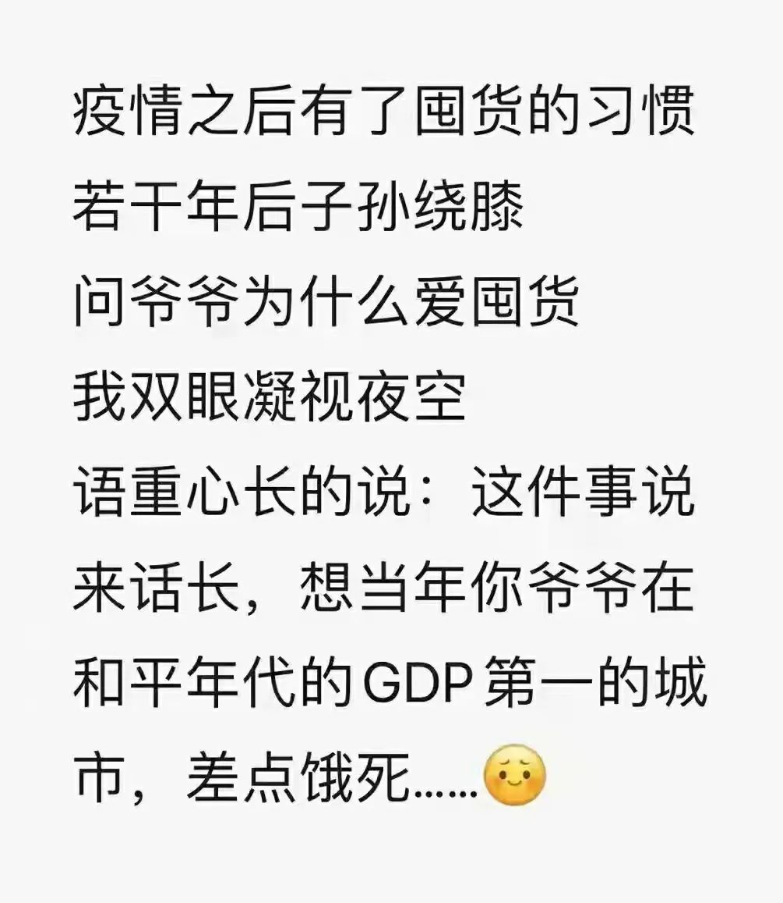
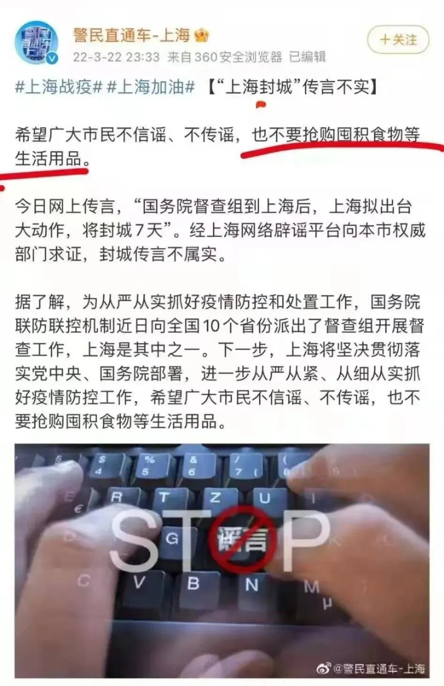
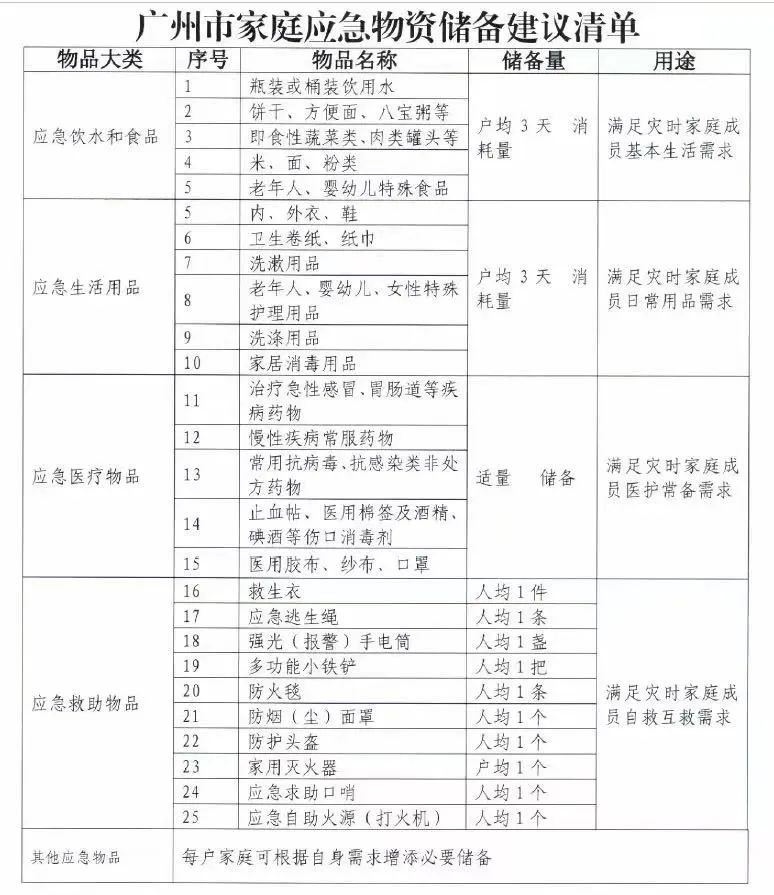
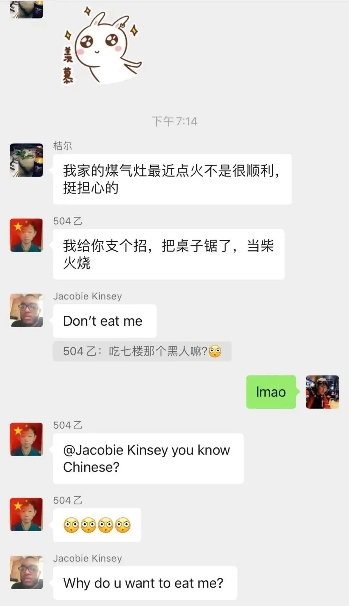
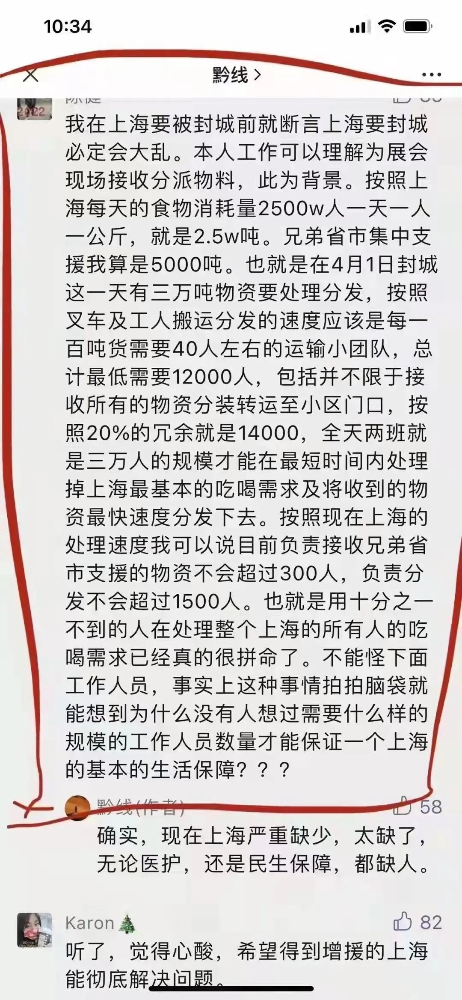
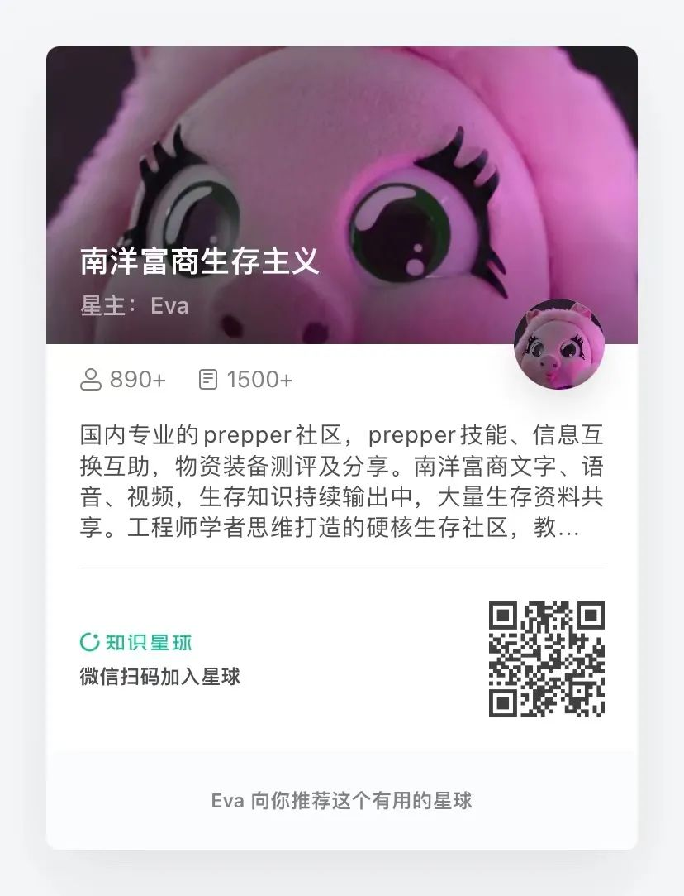

# 亲历上海封城，疫情囤粮最容易犯的八个错误丨硬核生存指南

     

# 亲历上海封城，疫情囤粮最容易犯的八个错误丨硬核生存指南

原创 南洋富商 [金二](javascript:void(0);)

**金二** 

微信号 gh\_6cba22b299cf

功能介绍 时刻准备着！

_2022-04-07 07:45_

收录于话题

欢迎关注公众号南洋富商：

工程师学者思维打造的硬核生存公众号，从技术、人文全方位各学科剖析生存知识，后疫情时代在真实灾难降临的时候提高您和家人的存活率。

**金二**
时刻准备着！
130篇原创内容

公众号

[!unknown_filename.7.jpeg(.__resources_亲历上海封城，疫情囤粮最容易犯的八个错误丨硬核生存指南.resources_unknown_filename.7.jpeg)]()

**月初补到货的13干粮、13红烧猪肉已断货**
**各地物流快递时效不保**
**少量现货立刻购买**
**各类专业生存物资，现货当日发**

****[生存主义微信群点此加入](http://mp.weixin.qq.com/s?__biz=MzU2NTgwOTE0MQ==&mid=2247507000&idx=3&sn=104064ead067b4f0630f2b206729889b&chksm=fcb486a2cbc30fb4479e9e993f5158bac969bbb03e3cb074b34a70a46af9fdef7c1760798ecb&scene=21#wechat_redirect)**[（299元/年）](http://mp.weixin.qq.com/s?__biz=MzA3MzE4MTE3NA==&mid=2247486846&idx=1&sn=a9eef08ecf6c1dffdc1d31839913dff9&chksm=9f13bfe7a86436f1d2a6a0657bf2d93ce940d48c9c5068a39ae9a1f08480d9b98d5ad7cae593&scene=21#wechat_redirect)**

**1、囤粮不是应急抢购，**

**而是终生囤粮**

过去二年，很多上海人以为外地疫情封城造成的食物困境与他们无关。他们不觉得大上海也会别的城市一样陷入抢菜和无饭可吃的状态。

**我相信疫情之后，很多人都会有囤货习惯。**

无论什么时候，都得做好应对灾难的准备。因为灾难说来就来，不会提前告诉你。即便是最强大的国家和最优秀的政府，也不能预测到未来一个月会发生的事。比如说，十几天之前，令人尊敬的警察叔叔是这样告诉大家的：

囤粮是一辈子的事。任何时刻，你都得囤粮。这是对自己负责，也是为社会负责。**多一个囤粮的人，就少一分缺粮导致的动乱风险。**

**2、不要囤三天的粮，**

**而是至少三个月**

谣传中的封城会是几天？起初，大家以为是2天，做个核酸筛选。

后来是2＋2＋2……

后来是7＋7＋7……

你问我哪天会解封？我说再过n天就解封，**你信吗？**

你得囤多少货？很多部门都提供了「家庭物资储备建议清单」，你看一下这个清单，让你准备**三天的食物，你觉得够吗？**

这种「3天应急」囤货的意思。这是遇到地震、水灾、短暂战争之类的灾害，让你有几天时间等待救援，或者背上逃生背包，在72小时之内逃到安全目的地。

但是，这绝不是让你应对疫情封城的。**应对大城市封城，你的囤粮标准是：冰箱内的存货吃完后，还可以继续坚持三个月以上。**

为什么是三个月？因为

1）三个月的粮食不至于造成大量浪费，也不会占用很多地方，毕竟上海房价贵；

2）大城市若是连续缺粮三个月，一定会发生大乱。绝没有一个大城市可以因为疫情连续封三个月不乱；

3）即便最坏的情况，你只需要比普通人多三个月粮，正如你遇到黑熊，只需要跑得比同伴快。

**3、三级囤粮法**

第一级：日常饮食。味道好，需要烹饪。这类食品需要占用大量冰箱体积。建议用稍大的冰箱，再加一个冰柜。**不宜存太多，因为非常时期可能会停电。**

第二级：可以长期保存的蔬菜水果。这类食物没多少热量和蛋白质，但是可以改善口味、防止精神抑郁或疯掉。水果中，红富士苹果最好，室温可以保存3个月。蔬菜中，大白菜、卷心菜、大葱、萝卜、西红柿可以保存较长时间。若是出门抢购叶菜，尽量带泥、带根，可以像鲜花一样插在水桶和脸盆里水培保鲜。腌制的酸菜、干菜、香菇、木耳、紫菜、干海带之类也可以长期存放。

第三级是长期保命级。不考虑味道，只考虑活命。**选用原则：保质期长、高能量、高营养、不需要占用冰箱，不需要烹饪。**首选肉类罐头、压缩饼干。这类食物你要尽可能隐藏存放，不要张扬，也不要告诉邻居。

饿到吃人这种事，迄今为止在上海还只是一句玩笑话。

**4、除了囤粮，还得囤燃料**

刚才我提到冰箱和冰柜里的食物不要囤太多，因为会停电。

电力部门的人也是肉体做的，他们也会感染。自来水厂和燃气公司的人也会感染。**一旦全公司团灭，可能就会没水没电没燃气。**

你试过在停水停电停燃气的时候在家做饭吗？最好亲自试验三天，你就知道自己需要存点啥东西了。

应急的燃料、炉子，都需要。可能还需要到小区的河里打水，净化一下再做饭烧开水。

千万别直接喝城市小区河里的生水，一定要消毒或煮开。疫情期间，你十有八九买不到药（尤其是抗生素），医院可能进不去，即便去了医院也缺医生。更不要指望方舱。

封城年代，即便很小的拉肚子，都可能发展为致命的病。若是没有办法烧开水，也没有净水消毒材料，那是很危险的。

**5、别忘了宠物**

不仅上海市民在抢菜，上海的猫粮狗粮也奇缺。我们小区的互助群都在打听哪里能搞到。淘宝买的猫粮猫砂也没法发货到上海。

家里一定要有足够的猫粮狗粮，不能让宠物挨饿。

万一主人被抓去方舱医院，怎么处理？

猫比较容易解决，只要食物和水充足，关在家里二个月也没事。

大多数猫粮放在外面时间久了会变质，甚至发霉，专家测试数据是大多数猫粮打开**超过14天后细菌超标**。猫罐头开了放在那里也会发霉。所以不能一次给太多猫粮或一次打开很多罐头。

有一种办法是买一箱火腿肠，**猫饿了会自己撕开吃**。要事先让它练习，确保主人不在家它会自己撕开火腿肠外皮。

有些猫会自己撕开小包装的猫粮。这就比较容易，扔一堆塑料袋小包装的猫粮给它就可以。

狗比较费事，单独在家会抑郁症。尽可能让狗可以到达阳台，看到外面的景色和人，以减少抑郁。邻居若有食物，也可以扔到阳台上。（猫不可以放在阳台上，有些猫看到外面有飞虫飞鸟，会忘乎所以跳出去。）

给猫喝的水，多放几个大盆，**每个盆里扔一片二氧化氯消毒片**，可以防止水里细菌繁殖。

**6、除了囤粮，还得囤关系网**

上海诸多小区都缺菜的时候，我们小区从来不缺。这是什么原因呢？

因为我们小区里面有几家餐厅和一个小超市。他们有特殊渠道搞到食物。虽然小区大门封锁、不许外卖进来，小区里面的店铺甚至可以送外卖上门。

最近几天，管控加严，小区里的超市和餐厅都不许开了，但是我们小区依然有充足的食品供应。因为大家都加了店铺老板的微信。他们认识很多供货商，总有办法搞到货。

**记住一点：餐厅老板和小超市老板的微信和电话，是你的宝贵资源。**

上海小区里还有很多邻里互助团购。人多力量大。政府工作人员人数有限，靠政府的力量是不足以解决食物配送问题的，要靠大家自己的关系网。

**7、别吃野菜和绿化带，**

**也别指望阳台种菜**

首先，不要相信野菜可以给你足够的营养。你挖一百斤新鲜野菜，提供的营养大约相当于2斤大米，或者1斤黄豆，远不如囤货方便。（[上海小区居民挖野菜攻略|硬核生存指南](https://mp.weixin.qq.com/s?__biz=MzU2NTgwOTE0MQ==&mid=2247511889&idx=1&sn=c0ff0ca124f919a20ee4da8b74d0a4c7&scene=21#wechat_redirect)）

其次，不要觉得野菜很多。我查寻小区里的野菜，发现不够全小区的人吃一顿。所以吃野菜是根本不可行的，囤货才是硬道理。

第三，大多数普通人无法分辨类似的有毒野菜，即便是专家也得仔细辨认。上海已经出现几次吃野菜中毒事件。

阳台种菜是很多人的癖好。但是一个阳台一个月的产量只够吃一天。有这空间，不如多囤点现成的大白菜、包菜、大葱之类可以长期保存的蔬菜。

**8、多地点囤粮**

别忘了在车上放一些压缩饼干、牛肉干、罐头、饮用水。你可能困在路上，哪里都不让你进去。很多人已经在路上过了好多天。

别忘了在公司办公室放几箱备用食品。你随时可能被关在公司。

别忘了整理好逃生背包。你随时可能需要在封城前几分钟逃离。逃生背包里也得有吃有喝。

别忘了你要逃生的目的地。或许是乡下老屋，或许是父母家，或许是自己在郊区的备用租房。那里也得做好准备，因为封锁随时可能扩大。

**总而言之，囤粮是时刻都要做的事，不要想当然，不要轻信，要科学囤货。**

失联三个月，随时可能再次失联，可添加下方微信号（请勿重复添加）：

非常时期真的要做饭，太阳能不指望，酒精不安全，木炭能量密度太低，不如考虑二战时期的德军固体燃料。以往因为运费成本，单拍都是不包邮的，**这次特地开了一个25kg的家庭囤货装**：不会挥发，保质期＞ 10年，热值≈石油，储存安全。

[!unknown_filename.6.jpeg(.__resources_亲历上海封城，疫情囤粮最容易犯的八个错误丨硬核生存指南.resources_unknown_filename.6.jpeg)]()[!unknown_filename.14.jpeg(.__resources_亲历上海封城，疫情囤粮最容易犯的八个错误丨硬核生存指南.resources_unknown_filename.14.jpeg)]()

以下三款13战灾应急系列还有现货，**拍下后当日发货**：
[!unknown_filename.11.jpeg(.__resources_亲历上海封城，疫情囤粮最容易犯的八个错误丨硬核生存指南.resources_unknown_filename.11.jpeg)]()
[!unknown_filename.3.jpeg(.__resources_亲历上海封城，疫情囤粮最容易犯的八个错误丨硬核生存指南.resources_unknown_filename.3.jpeg)]()
[!unknown_filename.13.jpeg(.__resources_亲历上海封城，疫情囤粮最容易犯的八个错误丨硬核生存指南.resources_unknown_filename.13.jpeg)]()

**原价259**的课程，如今紧急促销，只需要**129元**，世界局势风云变幻，每个人都要了解的生存知识。

南洋富商

  **微信扫一扫赞赏作者** [赞赏](##)

已喜欢，[对作者说句悄悄话](javascript:;)

取消

#### 发送给作者

发送

最多40字，当前共字

[undefined](javascript:;) 人赞赏

上一页 [1](javascript:;)/3 下一页

长按二维码向我转账

受苹果公司新规定影响，微信 iOS 版的赞赏功能被关闭，可通过二维码转账支持公众号。

预览时标签不可点

收录于话题 #
 个
上一篇 下一篇

喜欢此内容的人还喜欢

当大城市陷入困境，哪里最安全，以上海为例丨硬核生存指南

当大城市陷入困境，哪里最安全，以上海为例丨硬核生存指南

金二

不喜欢

不看的原因
确定

* 内容质量低

* 不看此公众号

**写留言**
[取消](javascript:;)

留言

**我的留言**

[写留言](javascript:;)

正在加载
展开我的留言
以上留言被精选后，将对所有人可见

**精选留言**

[写留言](javascript:;)

[写留言](javascript:;)

正在加载

已无更多数据

关闭
**写留言**
提交更多

正在加载

[表情](javascript:;)

正在加载

关闭
**留言**
更多

正在加载

正在加载

返回
**写回复**
回复更多

正在加载

: 

[表情](javascript:;)

正在加载

微信扫一扫
关注该公众号

[知道了](javascript:;)

 微信扫一扫
使用小程序

[取消](javascript:void(0);) [允许](javascript:void(0);)

[取消](javascript:void(0);) [允许](javascript:void(0);)

 ： ， 。  视频 小程序 赞 ，轻点两下取消赞 在看 ，轻点两下取消在看

该账号因违规无法跳转

原文链接：<https://mp.weixin.qq.com/s/edpWjq_CZoNa94op-z4HAA>
