# 从歼5到“鹘鹰”，看中国歼击机摇篮“国字号战鹰”发展之路

     

## 从歼5到“鹘鹰”，看中国歼击机摇篮“国字号战鹰”发展之路

央广军事 [航空知识](javascript:void(0);)

**航空知识** 

微信号 HKZS1958

功能介绍 风上风云，云端故事。

_今天_

收录于话题

中央广播电视总台倾力打造的庆祝中国共产党成立100周年大型直播特别节目《今日中国》辽宁篇《振兴发展 恰是风华正茂》的播出，引发社会各界广泛关注。节目组走进有着“中国歼击机摇篮”之称的航空工业沈飞，走进沈飞航空博览园，向观众展现了新中国战斗机的发展之路。

从1951年航空工业沈飞创建至今
已过去了70年
生产的战机多达40多个型号
交付到空、海军的列装战机数量
占到了国家生产歼击机总数的
半壁江山

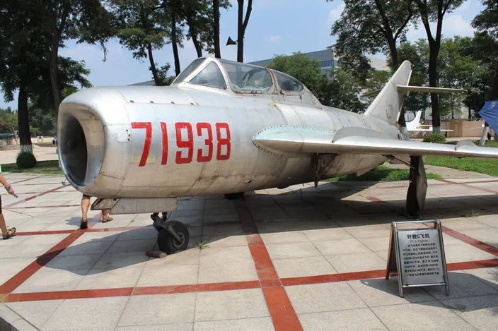

让我们和央视一起走进**“中国歼击机摇篮”**
看看那些年
**我们追过的“国字号战鹰”**

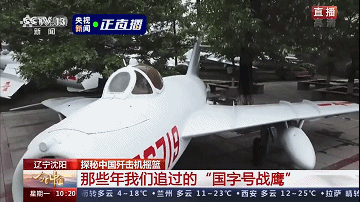

“战鹰”点“睛”机载雷达从无到有

评价一款歼击机的作战性能
首先想到的就是它的**机载雷达**
也就是**“鹰眼”**的敏锐程度

 _**歼5系列战机**_ 

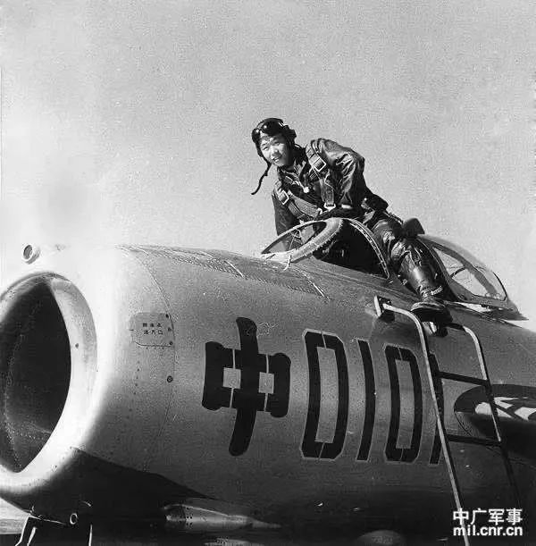
歼5战机与首飞试飞员吴克明

沈飞研制的
我国**第一代战机歼5**
并没有安装雷达
飞行员也只能依靠航炮
与敌人近距离战斗

 _**歼6系列战机**_ 

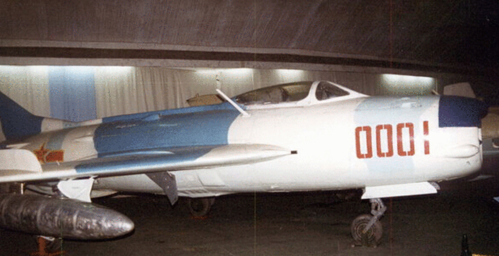
歼6战机

被军迷称为“一代名机”的歼6系列飞机

创造了我国航空史上多个第一：

生产数量最多

服役时间最长

从歼6系列战机开始
我军开始为“战鹰”配备机载雷达
不过早期的雷达测距仪
需要和光学瞄准具一起配合使用
可以测定目标的距离
并不能测定目标的高度和方位

 _**歼7系列战机**_ 

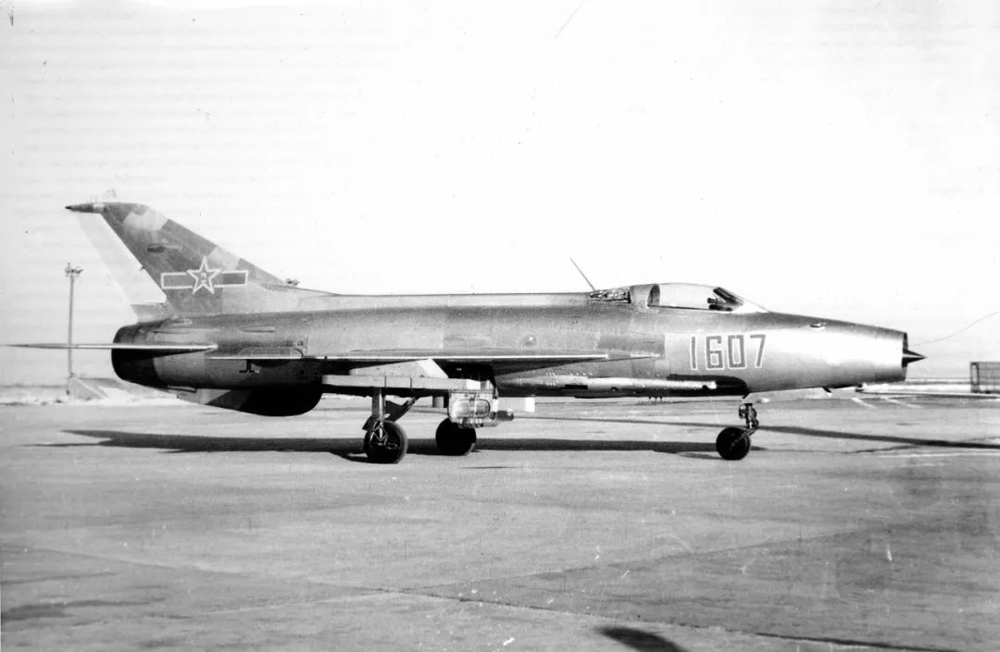
歼7战机

与歼6相比
歼7系列战机
最大飞行速度已达到2倍声速
为了保证飞机在高速飞行时
保持稳定进气
它在机头增加了**进气道调节锥**

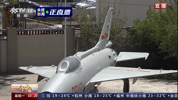
歼7战机机头的进气道调节锥

本着不浪费每一寸空间的原则
它的雷达测距仪
装在进气道调节锥里面
不过此时，战机上的雷达
还只是对目视能力的一种补偿
解决了**“战鹰”**
从“看不见”到“看得见”的问题

怎样让**“战鹰”**
**“看得远”“看得准”呢？**

从弱到强国产机载雷达打造最强“鹰眼”

 _**歼8系列战机**_ 

怀揣“航空报国”信念的军工人
在1964年首次尝试自己设计歼击机

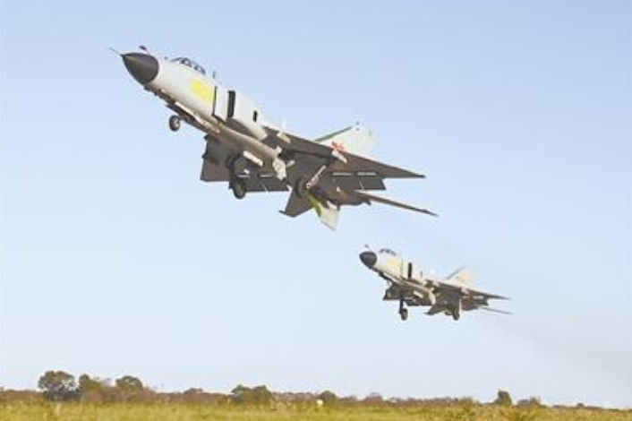
歼8II战机

这款歼8II战机的颜值
在20世纪90年代中期
绝对算得上国产歼击机中
最帅气的存在
它有一个响当当的绰号
——**“空中美男子”**

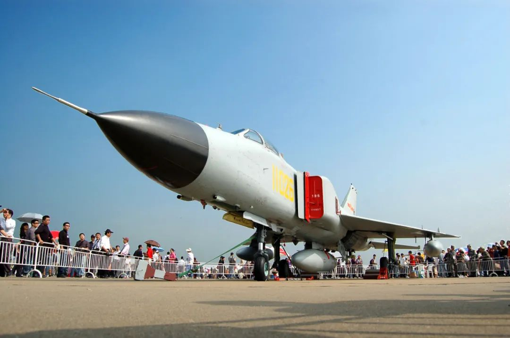
航展上的“空中美男子”

除了气动外形上改进升级
它最强大的地方就是
**安装了我国自行研制的**
**脉冲多普勒火控雷达**

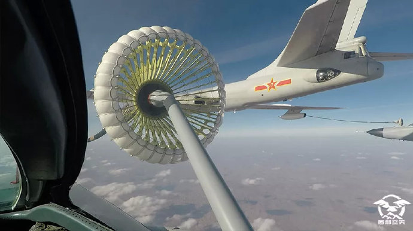
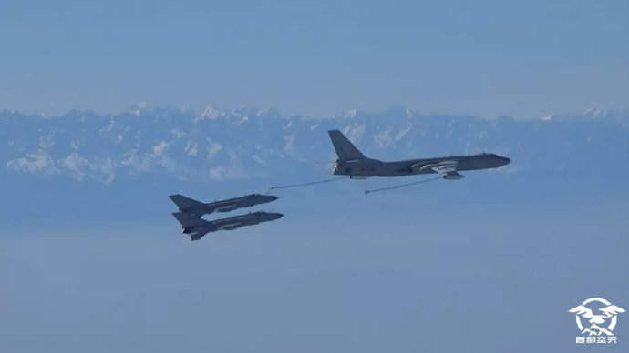
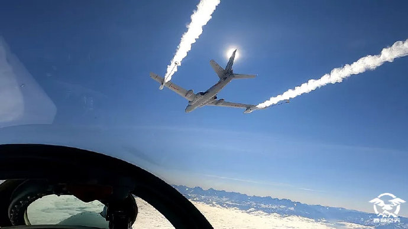
西部战区空军航空兵某旅歼8战机进行空中加油训练

这种雷达不仅具备

更远的探测距离
还能用于武器制导和控制

 _**歼11系列战机**_ 

空军某西北训练场，歼11战机七机同框震撼画面

 还没完！休息5秒钟，插播一则广告  

//

**新 品 上 架**

//

**“未来远轰”系列 T恤/棒球帽 超值包邮**

我国自主研制的
重型歼击机歼11系列战机
机头配有高性能雷达
可以在百公里之外发现目标
在它的上面，有一个玻璃球状的装置
它的名字叫做光电雷达
可以在机头雷达不开机的情况下
**发现目标、跟踪目标**

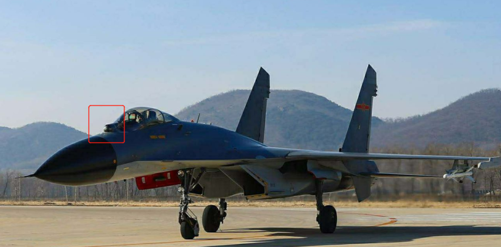
歼11战机的光学雷达

在一代代航空人的不懈努力下
“国字号”歼击机颜值越来越高
作战能力也越来越强

**很多军迷朋友关注的第四代战机**
**又有着怎样强大的本领呢？**

卓越工艺打造“国字号”第四代隐身战机

这款被称作**“鹘鹰”**的战机
从亮相第一天起
就吸引了众多追逐的目光
它的性能
与目前国际上同级别战机相比
不相上下

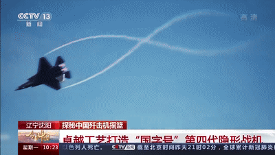
中型多用途双发第四代隐身战机“鹘鹰”的飞行画面（通过虚拟技术展示）

**“鹘鹰”**可装备相控阵雷达
自主捕获目标能力强
抗干扰性能好
具有较强的探测隐身目标的能力
最重要的是可以同时盯上多个目标
并且个个都盯得准

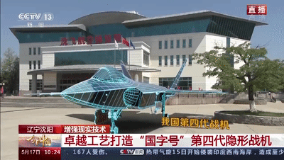

**“鹘鹰”**具有强大的隐身功能
它表面蓝黑色的蒙皮
采用高科技复合材料

除去央视直播中介绍的那些战鹰外
它们也诞生自“中国歼击机摇篮”

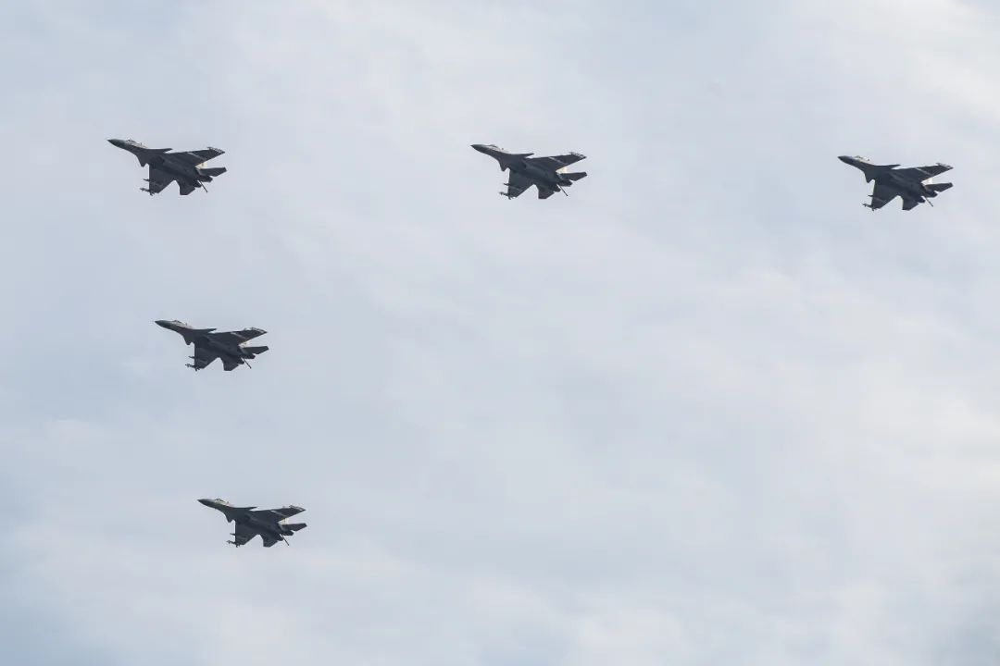
歼15战机编队接受检阅（摄影/岳书华）
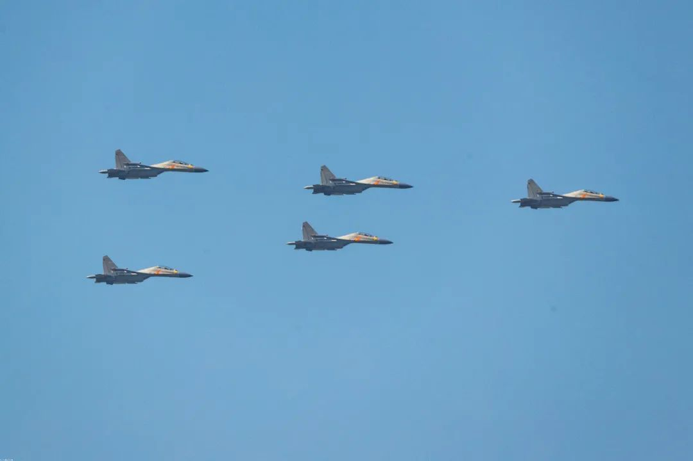
 歼16战机编队接受检阅（摄影/岳书华）

**歼击机的发展**
**不单体现一个国家的航空技术水平**
**更是综合国力的展现**

第一架国产喷气式歼击机
于1956年首飞成功
从亚声速到超声速
从常规飞机到隐身战机
今天我国的歼击机家族不断壮大
为夺取战场制空权增添了制胜砝码

本文转载自公众号：航空工业

内容来源：央广军事

注：本文系网络转载，版权归原作者所有。仅此标明转载来源，如涉及作品版权问题，请与我们联系，我们将在第一时间协商或删除内容！

风上风云｜云端故事

**望您读后可以顺手点亮"****赞****"****在看******"**！**

预览时标签不可点

收录于话题 #
个
上一篇 下一篇

阅读

分享 收藏
赞 在看

已同步到看一看[写下你的想法](javascript:;)

前往“发现”-“看一看”浏览“朋友在看”

前往看一看

**看一看入口已关闭**
在“设置”-“通用”-“发现页管理”打开“看一看”入口
[我知道了](javascript:;)

已发送

取消

#### 发送到看一看

发送

从歼5到“鹘鹰”，看中国歼击机摇篮“国字号战鹰”发展之路

最多200字，当前共字

发送中

喜欢此内容的人还喜欢

[胡锡进：布林肯没资格指控中国“快速扩张”核武库__胡锡进：布林肯没资格指控中国“快速扩张”核武库__...__胡锡进观察__不喜欢__不看的原因_确定___ 内容质量低___ 不看此公众号__ 对中国不](javascript:void(0);)
;)
;)
;)
;)[中国进行最大规模海上军演，以后不是谁想来南海就能来的！__中国进行最大规模海上军演，以后不是谁想来南海就能来的！__...__天涯时事__不喜欢__不看的原因_确定___ 内容质量低___ 不看此公](javascript:void(0);)
;)
;)
;)[中国轰-6K携带4枚YJ-12A高调亮相，我军航空制海能力如何？__中国轰-6K携带4枚YJ-12A高调亮相，我军航空制海能力如何？__...__军武速递__不喜欢__不看的原因_确定___ 内容质量低___ 不看此公众号__ 对](javascript:void(0);)
;)
;)

微信扫一扫
关注该公众号

 微信扫一扫
使用小程序

[取消](javascript:void(0);) [允许](javascript:void(0);)

[取消](javascript:void(0);) [允许](javascript:void(0);)

[知道了](javascript:;)

**长按识别前往小程序**

原文链接：<https://mp.weixin.qq.com/s/HnPZw4hPDJGKYuIsF3BllA>
