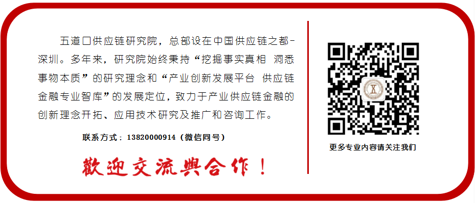

# 供应链托盘融资一点都不low：虽然简单、粗暴，但是非常有效！

     

# 供应链托盘融资一点都不low：虽然简单、粗暴，但是非常有效！

原创 鲁顺 [五道口供应链研究院](javascript:void(0);)

**五道口供应链研究院** 

微信号 WDK-SCM

功能介绍 关注我们，与100万管理者一起学习产业供应链金融的疑点、难点、痛点、重点和关键点！

_2022-06-06 06:16_ _发表于天津_
收录于合集 #鲁顺院长供应链金融原创文章 63个

**五道口供应链研究院**
关注我们，与100万管理者一起学习产业供应链金融的疑点、难点、痛点、重点和关键点！
143篇原创内容

公众号

在中国，一说供应链金融，咱们就会想到银行、想到核心企业，也能想到保理公司等，但其实还有一个主体，很多人没有注意，但是规模非常庞大，就是供应链公司（或者贸易公司）以托盘（贸易）的形式为企业提供融资。

一说贸易托盘融资，相信有很多人就会想起融资性贸易，特别是近些年，为了防范风险，国资委都在禁止国企从事融资性贸易。

但融资性贸易和贸易托盘融资，其实还是有一定区别的，我们不能一刀切，把通过贸易形式解决资金问题的，都叫融资性贸易。

一提到贸易托盘融资，大家都会觉得，这形式很早很早就存在了，现在都什么时候了，还做这个，太low了。

但是呢，我觉得贸易托盘融资，在目前的中国市场，不仅不low，而且简单、有效！

# ************01************

**什么是贸易托盘融资**

“托盘贸易”(又称为托盘业务)原本是一种真正的贸易形式。这种贸易通常涉及三方主体，即甲供货商(卖方)、乙贸易商(买方)和丙托盘方(资金提供方)。乙方因缺乏采购资金，委托托盘方提供融资，托盘方向甲方购买货物并预付货款，再赊销给乙，甲方按照托盘方的指示向乙方交货，乙方取得货物过一段时间后再向托盘方付款并支付融资利息。

这种贸易的主要特征是存在真实的买卖关系，即托盘方将其自有资金提供给甲方购买货物并向甲方支付货款，这是第一重买卖关系；托盘方指令甲方将货物提供给乙方，乙方事后通常在最长6个月的时间内向托盘方支付该笔资金及其利息，这是第二重买卖关系。

托盘方提供资金的目的是为了确保交易完成并赚取利息，因此，其对货物或者担保是否存在比较关心，通常会要求甲方提供真实货物，或要求乙方提供足额担保；甲乙作为买卖双方事先通常没有利益关系或关联关系。

这种贸易形式由托盘方“一手托两家”。

这种基于真实贸易背景的以贸易形式的融资比国资委定义的融资性贸易还是有很大的区别，国资委定义的融资性贸易更多的是买卖双方是关联的，贸易是虚假的，通过贸易形式把资金套出去。

# ************02************

**贸易托盘融资相比金融机构融资的优势有哪些**

虽然我们国家已经初步建立起了不同金融机构，来满足不同企业不同的需求，但是鉴于金融的垄断、国家的过度干预等原因，其实还是有很多中小微经营的资金需求得不到有效的满足，贸易托盘融资能够一直持续这么多年，而且愈演愈烈，是有一定道理的。

**1、能够四流合一、验证贸易背景真实性；**

采取贸易托盘的形式，相比纯金融放贷，可以实现商流、物流、资金流、信息流闭环合一。纯金融放贷的形式，只能管资金流，至于商流和物流，基本都是采取审查合同、发票、运输、交付等各种单据的形式，其实很难保证买卖双方贸易的真实性。

**2、不需要买方确权**

应收账款融资，如果是金融机构，一般都会要求买方进行确权、更改账户等行为，但是很多买方是不愿意这么干的，因为他们知道，一旦给金融机构确权，到期不还款，金融机构必然会起诉自己，所以在中国，除了买方自己做供应链金融，一般都不配合。

采取贸易托盘的形式，因为托盘方就是贸易主体，因此不需要再次要求买方确权、更改账户等一系列的行为，只需要更换贸易主体就可以。如果买方买的是标准化产品，个性化和技术含量不高、稳定性要求不强，一般也同意更换主体。

**3、能够有效隔离存货资产**

对于像不动产这样的资产，因为是特定物，不是种类物，所以金融机构通过不动产抵押进行融资，是好控制的，并且能够实现企业用于融资的不动产与其他资产进行隔离，但是对于动产这种种类物就比较麻烦了。

因为金融机构并不实质参与供应链中去，不是供应链的交易主体，所以对于动产存货融资，只能采取抵押、质押等方式，但是因为很多的动产权属不容易查清楚，而且动产是种类物的属性，不容易与企业的其他资产相隔离，一旦企业其他资产或者主体出现问题，就会牵扯到融资的动产。

贸易托盘买卖的形式相比金融机构抵质押形式，因为买卖有善于取得可以对抗第三人的规定，并且对动产货物拥有所有权，所以能够有效与企业主体及其他资产进行隔离。像期货公司的风险子公司设置，其实是同样的作用。

**4、能够快捷的处置资产**

如果是金融机构对企业进行放贷，对企业的资产只能是抵押或质押的形式，如果企业到期不还款，处置这些资产，需要以市场的价格进行处置，有的还需要经过司法程序才可以，这样对于资产处置的时间就会非常的长，造成很高的处置成本，如果处置时间过长，资产也可能会随着时间贬值，金融机构即使处置了资产，也会损失很多。

贸易托盘的形式，因为是以买卖的形式做融资，资产的所有权是属于托盘资金方的，客户到期不还款，资金方可以随时处置资产，不需要司法程序，价格也可以自己来定。

相比金融机构，贸易托盘融资的形式能够快递的处置不良资产。

**5、没有监管，监管成本低；**

贸易托盘融资的主体，一般都是供应链公司或者贸易公司，业务也基本都是采取贸易的形式，相比金融组织以借贷形式来说，几乎没有准入门槛，只要有资金，风险自己能够控制的住就可以干。

而且也没有金融组织在运营过程中的那些监管条件，例如资金的杠杆倍数、坏账准备金、经营地域等。

**6、更符合企业经营需求；**

贸易托盘融资，是通过以贸易的形式介入到企业的供应链中，特别是托盘方都是产业里的人，相比金融组织，对产业链都比较熟悉。

基本上是根据企业经营的特点，资金需求的时间和资金的还款时间相对应，在效率上、资金额度匹配上，相比传统的金融组织，更符合企业经营需求。

# ************03************

**通过贸易托盘融资这个点，带动盘活整个供应链**

贸易托盘融资，很多人，看着简单，没有什么技术含量，虽然能够短期挣钱，但是总是觉得没有未来，能干一天是一天。

这其实是对贸易托盘融资，非常狭义、非常偏见的看法。

**通过融资带动贸易和科技，通过贸易带动物流和政务，通过客户带动其上下游，然后互相带动，盘活整个供应链、产业链。**

这就是点动成线，线动成面，面动成体。

像目前已经做大的公司，厦门象屿、厦门国贸、物产中大、瑞茂通、、等很多公司都是从最开始简单的贸易起家，最终上市，做成供应链集成服务商、产业运营商的例子。

这其实是贸易托盘最终要实现的目标，只是很多托盘商，目光短浅，懒惰，只拖资金而已。

# ************04************

**贸易托盘融资看着简单，但做好是非常不容易的**

在很多人眼里，贸易托盘融资，非常容易，就是个简单的贸易，从业者专业素质普遍都不高。

这么理解完全是错误的。

**这个业务，只是进入门槛低而已，并不代表着运营门槛低！**

做好贸易托盘融资，不仅仅对供应链的每个重点操作环节非常熟悉，还要求对产业链非常熟悉，对各方主体的资信能力有效的评估，还需要具备一定的资源，包括供应商资源、物流资源、销售资源等。

所以，贸易托盘融资并不是简单，是很多人把它干简单了，最后很多机构出了非常大的风险。

做的是高风险的业务，用的是普通贸易公司的流程和团队、组织结构、激励措施，不出问题只能说命好，而不是业务简单，更不是自己能力强。

很多的行业，越是没有硬性的门槛，其实门槛越高，因为你不知道真正的门槛在哪里！

# ************05************

**贸易托盘融资在中国较长时间内会长期存在**

虽然我们国家也再想各种办法让金融机构，特别是银行来解决中小微企业融资难的问题，但是银行等金融机构做为一个庞大的体系，这么年养成的惯性，加上不实际参与供应链中去，短期内想改变是非常难的。

围绕核心企业开展供应链金融，确实是一个非常好的点，但是毕竟核心企业还是有限，也有其覆盖半径和局限，不能指望着核心企业就能解决一切。

相比金融机构、核心企业开展的服务中小微企业融资问题，贸易托盘融资的形式，更加的灵活，更加市场化，更符合企业的需求。

其实单从解决中小微企业融资的角度，国家应该给这种形式的主体发放牌照，但是，这也只能是想想而已，太难了！

**国家保护银行的利益，其实有点过度了。**

对于银行解决不了的问题，可以让其他主体干。看着都是放贷、融资业务，其实做大企业和做小企业完全是不同的逻辑和能力。

银行不能直接解决中小微企业融资问题，国家天天让他干，天天下发各种文件，只能适得其反，起不来什么太大的作用。

# ************06************

**经营企业的目的是挣钱，跟low不low没啥关系**

中国人吧，干什么事都喜欢用道德的制高点去评价别人，来证明一件事是好是坏。但是道德这东西，其实很难量化，跟价值观、地方文化等都有很大的关系。

道德不像法律，更加的确定。道德和法律虽然都是治理国家和社会的工具，但是基本都是以法律为主，以道德为辅。

天天拿道德说事，不以利益为基础，不以法律为标准的评价，不是傻就是坏。

**道德是用来要求自己，而不是用来制服别人的手段。**

我们回到贸易托盘垫资，表面上看既简单，没有技术含量，相比高大上的金融，不管是资金实力、政府背书、团队等比较低级，但是确实能够非常有效的解决企业的融资问题，而且不仅仅解决融资问题，更能够从供应链整体提升企业的效率、降低企业的成本。

虽然考核企业好坏的标准很多，但最主要的还是能不能挣钱，跟是否有高大上的办公室、是否有985或者211人才、模式是否新旧等没有半毛钱关系。

光玩高大上，不挣钱也不解决问题，只能是吹牛自我安慰而已！

**作者：鲁顺   五道口供应链研究院院长**

[1、银行不能直接做供应链金融，只有和供应链场景的链主合作才能做好](http://mp.weixin.qq.com/s?__biz=MjM5ODc4Mzc0MA==&mid=2651951629&idx=1&sn=b1b05adc1dc1a06c7d725eaa486e1ac3&chksm=bd204d9e8a57c4889501cae69396dc5ef36eb4fbecb4aa47089a43d062b563163bc79c4b4ff0&scene=21#wechat_redirect)

[2、想搞懂供应链服务企业的盈利模式？这篇文章就够了！](http://mp.weixin.qq.com/s?__biz=MjM5ODc4Mzc0MA==&mid=2651953219&idx=1&sn=aded3e1408715bc0d4cf39aaeb4a776f&chksm=bd2047d08a57cec6a26aac8da518b5b6da4b80d7f7dc44b437fc859d8f32ff29debdedfbac95&scene=21#wechat_redirect)

[3、融资性贸易合法化=供应链公司+保理公司+其他金融组织](http://mp.weixin.qq.com/s?__biz=MjM5ODc4Mzc0MA==&mid=2651955804&idx=1&sn=818e36af98ad17a7dd5231292eb77704&chksm=bd207dcf8a57f4d92c24b71869a59ed7c971b40eff5f75971b8746f7cb611b71686ce8b2c1ef&scene=21#wechat_redirect)

[4、损失巨大，教训深刻：剖析某国企开展融资性贸易导致惨重损失的案例](http://mp.weixin.qq.com/s?__biz=MjM5ODc4Mzc0MA==&mid=2651956445&idx=1&sn=fc2cbfeed719f63e625161b7389468da&chksm=bd207b4e8a57f258f9741ae531e7512ca2bffdb9613a1812fbeaf76bce75a8abecbded1fc9a3&scene=21#wechat_redirect)

[5、融资性贸易=供应链金融? 关于禁止央企开展融资性贸易的思考](http://mp.weixin.qq.com/s?__biz=MjM5ODc4Mzc0MA==&mid=2651955629&idx=1&sn=c5321b9d3a46699588032475d57c58f5&chksm=bd207e3e8a57f728d89f2820cd6d7b4ad89253bff889b17aa37265882e4f2b94237b9724b5ce&scene=21#wechat_redirect)

预览时标签不可点

收录于合集 #鲁顺院长供应链金融原创文章
 63个
上一篇 民间票据贴现违法为什么还有那么人干？因为不是无知就是胆子大！ 下一篇 交易所铝锭交割库暴雷10亿，供应链金融存货融资还能不能干？

喜欢此内容的人还喜欢

**写留言**
取消

留言

**我的留言**

[写留言](javascript:;)

正在加载
展开我的留言
留言被精选后将公开

**精选留言**

[写留言](javascript:;)

[写留言](javascript:;)

正在加载

已无更多数据

[发消息](javascript:;)

关闭
**写留言**
提交更多

正在加载

[表情](javascript:;)

正在加载

关闭
**留言**
更多

正在加载

正在加载

返回
**写回复**
回复更多

正在加载

: 

[表情](javascript:;)

正在加载

微信扫一扫
关注该公众号

[知道了](javascript:;)

 微信扫一扫
使用小程序

[取消](javascript:void(0);) [允许](javascript:void(0);)

[取消](javascript:void(0);) [允许](javascript:void(0);)

 ： ， 。  视频 小程序 赞 ，轻点两下取消赞 在看 ，轻点两下取消在看

该账号因违规无法跳转

原文链接：<https://mp.weixin.qq.com/s/_3GMjW96ZRbEqYRL9-qVOQ>
