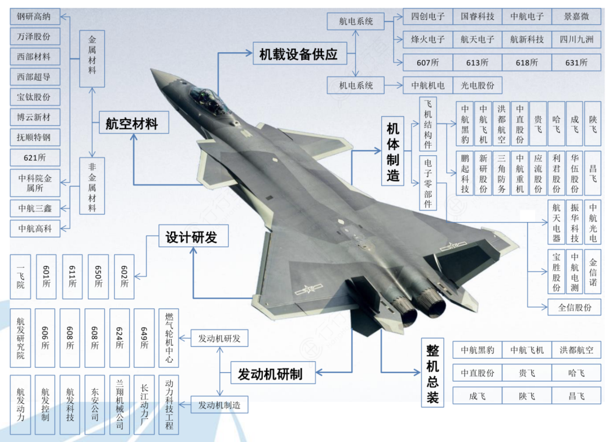
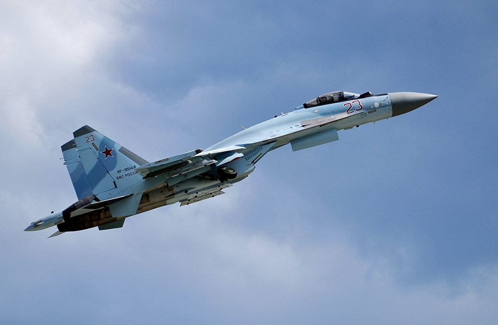
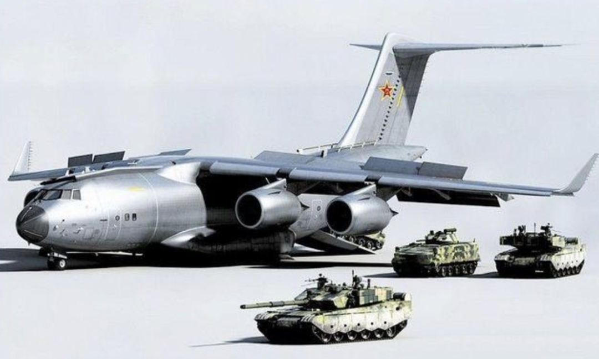
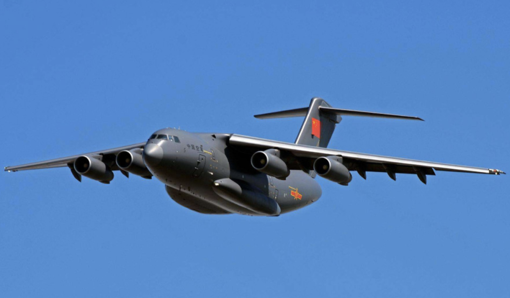
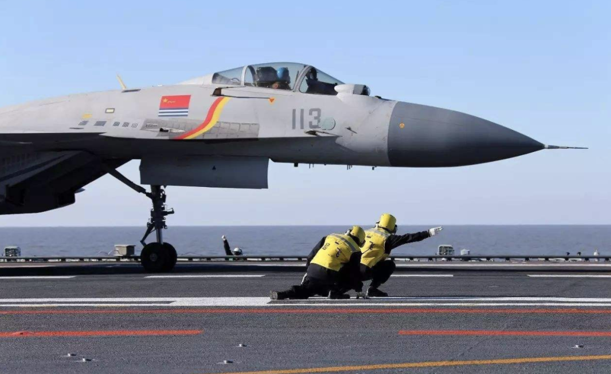
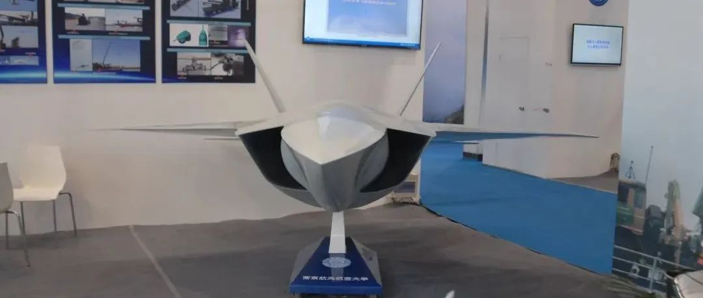
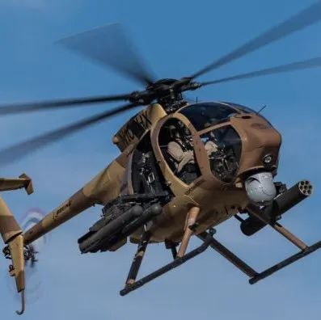

# 军用飞机产业链全景梳理

     

# 军用飞机产业链全景梳理

[前沿装备汇](javascript:void(0);)

**前沿装备汇** 

微信号 gh\_8d200d334fa7

功能介绍 聚焦国际前沿技术、科技装备顶层智慧，传递装备热点、发展历程、技术原理，装备功能、现状与趋势分析，观点交流等内容

_2022-08-05 15:07_ _发表于北京_

收录于合集

#军用飞机 2 个
#制造业 8 个
#轰炸机 8 个
#战斗机 41 个
#舰载机 5 个

根据《北航学报》，航空制造业价值链上的企业可以分为三个层级：
上游的航材供应商(主要包括原材料供应商、发动机制造商以及其他航材供应商)，中游的航空制造企业和航空维修企业，以及位于下游的飞机制造企业和航空公司。

与军用飞机制造相关的厂所主要有航空材料供应商、从事军用飞机设计研发的研究院所、军用飞机部组件及系统制造企业和军用飞机整机总装企业。

资料来源：中航证券金融研究所

# **机身原材料和发动机原材料**

机身原材料和发动机原材料以及非金属材料主要由一些研究院所和上市公司承担：
中国航发北京航空材料研究院（621所）、中国科学院金属所主要承担机身和发动机用高温合金和钛合金的研制。
钢研高纳和万泽股份主要承担发动机用高温合金的研制。
西部材料、西部超导和宝钛股份主要承担机身和发动机用钛及钛合金的研制。
博云新材主要承担飞机刹车副材料和飞机机轮刹车系统的研制。
抚顺特钢主要承担机身和发动机用高温合金和高强钢的研制。
非金属材料主要由中航高科和中航三鑫提供。

# **军用飞机设计研发**

军用飞机设计研发主要是由航空工业集团下辖的研究所承担：
第一飞机设计研究院主要承担轰炸机和军用运输机的设计研发。
沈飞设计研究所（601所）主要承担歼击机和舰载机的设计研发。
成飞设计研究所（611所）主要承担J10和J20等新型多用途战斗机的设计研发。
南昌飞机设计研究所（650所）主要承担教练机的设计研发。
中国直升机设计研究所（602所）主要承担直升机的设计研发。

**军用飞机机体制造以及总装**
军用飞机机体制造以及总装主要是由航空工业集团旗下的几大传统的主机厂承担，另外一些飞机结构件和电子零部件也有一些上市公司提供：
航空工业沈飞（注入中航黑豹）主要承担歼击机和舰载机的整机总装和飞机部组件研制。
航空工业西飞（注入中航飞机）主要承担轰炸机和军用运输机的整机总装和飞机部组件研制。
航空工业成飞主要承担J-10和J-20等新型多用途战斗机的整机总装和飞机部组件研制。
洪都航空和航空工业贵飞主要承担教练机的整机总装和飞机部组件研制。
中直股份、航空工业昌飞和航空工业哈飞主要承担直升机的整机总装和飞机部组件研制。
航空工业陕飞主要承担运输机的整机总装和飞机部组件研制。
另外生产飞机结构件的还有鹏起科技、新研股份、三角防务、中航重机、应流股份、利君股份和华伍股份等上市公司。
生产飞机电子零部件的主要有中航光电、航天电器、振华科技、中航电测、宝胜股份、全信股份和金信诺等上市公司。

# **军用飞机机载设备**

军用飞机机载设备主要由航空工业旗下的中航电子、中航机电、航空工业雷达所607所、航空工业光电所613所、航空工业自控所618所、航空工业计算机所631所承担。
另外还有四创电子、国睿科技、烽火电子、航天电子、航新科技、四川九洲、光电股份和景嘉微等上市公司。

# **航空发动机研制**

航空发动机研制主要由中国航发旗下的航发动力、航发控制和航发科技三家上市公司和航发空天发动机研究院承担。
另外还有从事中型及大型涡扇及涡喷发动机研发的沈阳黎明606所、从事直升机涡轴发动研发的株洲航空动力机械608所、从事航空动力推进技术的初始开发及认证测试的四川江油燃气轮624所、从事低推力及中推力涡扇及涡喷发动机研发的贵航发动机649所和从事轻型燃气轮机开发的中国轻型燃气轮机开发中心。
从产业链的角度来看，航空材料、航电系统和机电系统以及航空发动机未来将随着军用飞机的大量列装而不断发展壮大，整机总装和飞机零部件制造等产业将具有持续的高成长性。

来源 |乐晴智库精选

**全文完。感谢您的耐心阅读，请顺手点个"在看"吧~**

**免责声明：**本文根据转自网络。文章内容系原作者个人观点，本公众号转载仅为分享、传达不同观点，如有侵权或任何异议，欢迎联系我们删除！

**前沿装备汇精彩回顾**

[**重磅消息！军工保密三级资格取消！**](http://mp.weixin.qq.com/s?__biz=Mzg5NzU3NzcxNA==&mid=2247484457&idx=1&sn=82bdd35541fdec989d0cb6999080172c&chksm=c06ee3b4f7196aa24bbbdc9ad034ce63bec75878b0bccc7681ade217cbcb620622d46c3e6307&scene=21#wechat_redirect)

[**中国十大最顶尖军工集团**](http://mp.weixin.qq.com/s?__biz=Mzg5NzU3NzcxNA==&mid=2247488162&idx=1&sn=aa513e11b8fb9f3f666651a8e00a2814&chksm=c06ef53ff7197c29add2c4d5d6bc6be3fc1f513193a3c56769952ecb3a4e3e80587ebf69a4bc&scene=21#wechat_redirect)

[**全球十大新材料顶尖巨头**](http://mp.weixin.qq.com/s?__biz=Mzg5NzU3NzcxNA==&mid=2247488056&idx=1&sn=18730a35b73f47281f57c770e7ab4e9c&chksm=c06ef5a5f7197cb3042393fbb1d31795bf0ab58321f7bf2669736bcd4e794082b0bdb3b4b84a&scene=21#wechat_redirect)

[**全球十大最尖端的数控加工中心**](http://mp.weixin.qq.com/s?__biz=Mzg5NzU3NzcxNA==&mid=2247488040&idx=1&sn=11b823602b65dba413d9df32448dcbb3&chksm=c06ef5b5f7197ca311100da09b047cd8d0eb5c609dc2b7401f1023784643cfe654f5432461ab&scene=21#wechat_redirect)

[**盘点：最新军工资质相关变化汇总**](http://mp.weixin.qq.com/s?__biz=Mzg5NzU3NzcxNA==&mid=2247487943&idx=1&sn=34ae141fdf08def1f0a5994db1ec7fb5&chksm=c06ef65af7197f4c853c491f665b04521947af9b12d4cb8c77f7ddff7c2dc15d7eccc15569d2&scene=21#wechat_redirect)

[**捕捉军工黄金赛道：三大主线、十大产业**](http://mp.weixin.qq.com/s?__biz=Mzg5NzU3NzcxNA==&mid=2247486110&idx=1&sn=02ca3186af74ae4caa924924fc28e3fe&chksm=c06eed03f7196415d22d48ecbac64efb3d9c9b735c145826466308e36f0afce46bcd5a9d371a&scene=21#wechat_redirect)

[**谈军代表与装备技术状态管理监督**](http://mp.weixin.qq.com/s?__biz=Mzg5NzU3NzcxNA==&mid=2247486162&idx=1&sn=2097b8bc200be3f16e05d958c9f25054&chksm=c06eed4ff719645913b6b8907b7c6818b3e2a2e76ee379878ef8aa289a9a46b56f2728133aab&scene=21#wechat_redirect)

[**2021年军工行业：需求之变**](http://mp.weixin.qq.com/s?__biz=Mzg5NzU3NzcxNA==&mid=2247486065&idx=1&sn=9fc739091e28fac52c9e8ea9c9d730f3&chksm=c06eedecf71964fa2618f3738400d4dc2677c1c8647c00b793d148bb904eb78a0371e86d8364&scene=21#wechat_redirect)

[**军工“十四五”利好不断，一文看尽军工产业链**](http://mp.weixin.qq.com/s?__biz=Mzg5NzU3NzcxNA==&mid=2247486152&idx=1&sn=69720628de5571da07a4064a1e3dead1&chksm=c06eed55f7196443ff4fe8e8d25de7160f84a0ad4096e3a2949208ea4d90b1569fc13c3d7f2b&scene=21#wechat_redirect)

[**陆海空天一体化信息网络发展研究**](http://mp.weixin.qq.com/s?__biz=Mzg5NzU3NzcxNA==&mid=2247484434&idx=1&sn=c64b082b7bb604093d390218bc782026&chksm=c06ee38ff7196a99d21d5843feadb27d6ea9a9a08c9ab58338cc0ccb9ad119dcbfd42e745235&scene=21#wechat_redirect)

[**中美半导体全产业链实力对比（附中国和美国晶圆厂完整清单）**](http://mp.weixin.qq.com/s?__biz=Mzg5NzU3NzcxNA==&mid=2247484397&idx=1&sn=e93a12ad752399222837d1e669340d40&chksm=c06ee470f7196d66877e470f705c505af21d9c5f3a94b967d28ce71487e46b286000560d7b0f&scene=21#wechat_redirect)

[**集群无人机探测及对抗措施综述**](http://mp.weixin.qq.com/s?__biz=Mzg5NzU3NzcxNA==&mid=2247484351&idx=1&sn=4a008327be10d2ab076e84162c5f23f5&chksm=c06ee422f7196d34ae04882f32b35a7719a8bad76e925c876f4365e94d13cf55c813906d57ab&scene=21#wechat_redirect)

[**世界首次巡飞弹集群实战，以军战果惊人**](http://mp.weixin.qq.com/s?__biz=Mzg5NzU3NzcxNA==&mid=2247484966&idx=2&sn=0640ac397cee2566d541a8da687d4f18&chksm=c06ee1bbf71968ad02cc136316538b1a6d4b55835002e1f535752fc0ea0c25b42c7eebc8b682&scene=21#wechat_redirect)

[**未来智能化条件下作战需要经历四个发展阶段**](http://mp.weixin.qq.com/s?__biz=Mzg5NzU3NzcxNA==&mid=2247484928&idx=1&sn=edbffbd16f37d4a72a575937c099ae56&chksm=c06ee19df719688bbc07eac9fb3484c823d34e411c3128cc816e27a3689dfa05a0ede85964a6&scene=21#wechat_redirect)

[**临近空间防御作战拦截弹制导与控制关键技术综述**](http://mp.weixin.qq.com/s?__biz=Mzg5NzU3NzcxNA==&mid=2247484928&idx=2&sn=26c73458b07ded7a9a2ffeeb3c727b0a&chksm=c06ee19df719688b8ad8909b8656180a635f5be52274cf65095a6ddfba79058776c839c8d721&scene=21#wechat_redirect)

[**自主型地面无人战斗系统的发展方向**](http://mp.weixin.qq.com/s?__biz=Mzg5NzU3NzcxNA==&mid=2247484905&idx=1&sn=aacb1f39fde369022d90ee7d9148f29b&chksm=c06ee274f7196b6225e386c79cffa13793569fd9a5354b672f08367fb81fb3ddca76d56aa88f&scene=21#wechat_redirect)

[**空空导弹技术未来发展方向展望**](http://mp.weixin.qq.com/s?__biz=Mzg5NzU3NzcxNA==&mid=2247484905&idx=2&sn=db99003abb6e3ceeeeca30bf701935e4&chksm=c06ee274f7196b625284acc07185c010d02b477b42f0cbd3630ec3975d5b89d58652872d73b6&scene=21#wechat_redirect)

[**未来军事战争中的十大新概念武器排行榜**](http://mp.weixin.qq.com/s?__biz=Mzg5NzU3NzcxNA==&mid=2247484866&idx=1&sn=6bfebfc077d9a801cb77f57b12562e06&chksm=c06ee25ff7196b4960d58ab35b4e43931193204c3b5aa941e6cdcc56daba1efb38265f083740&scene=21#wechat_redirect)

[**96家！中央企业最新名录来了**](http://mp.weixin.qq.com/s?__biz=Mzg5NzU3NzcxNA==&mid=2247484849&idx=2&sn=c8e5d97a8ca41cb2885ef402c75652e0&chksm=c06ee22cf7196b3ab0ab1837343a1f0c531117756e2cc634260c473b03ba0e0a096c2f92db23&scene=21#wechat_redirect)

**[海军无人作战力量作战能力构成研究](http://mp.weixin.qq.com/s?__biz=Mzg5NzU3NzcxNA==&mid=2247484787&idx=2&sn=97e87c890a7ce098526a34c8a4728e83&chksm=c06ee2eef7196bf8d0e47247d8df91917c8d052190fe3456f59ca94b8b05b78f504ca93919f8&scene=21#wechat_redirect)**

**精彩内容长按二维码即可**关注****

**前沿装备汇                                    材料圈**

预览时标签不可点

收录于合集 #军用飞机
 2个
下一篇 军用飞机产业链全景梳理

喜欢此内容的人还喜欢

国内第一款专门瞄准第五代战斗机防空拦截需求的高性能靶机——“长空”-20无人机靶机

国内第一款专门瞄准第五代战斗机防空拦截需求的高性能靶机——“长空”-20无人机靶机

...

兵工科技海上武器版

不喜欢

不看的原因
确定

* 内容质量低

* 不看此公众号

边境战争中的“杀人机器”，致敬二战经典战斗机。

边境战争中的“杀人机器”，致敬二战经典战斗机。

...

Apex Legends游戏爆料

不喜欢

不看的原因
确定

* 内容质量低

* 不看此公众号

轻型攻击/侦察直升机典范——AH-6i“小鸟”

轻型攻击/侦察直升机典范——AH-6i“小鸟”

...

立体攻防

不喜欢

不看的原因
确定

* 内容质量低

* 不看此公众号

**写留言**
取消

留言

**我的留言**

[写留言](javascript:;)

正在加载
展开我的留言
留言被精选后将公开

**精选留言**

[写留言](javascript:;)

[写留言](javascript:;)

正在加载

已无更多数据

[发消息](javascript:;)

关闭
**写留言**
提交更多

正在加载

[表情](javascript:;)

正在加载

关闭
**留言**
更多

正在加载

正在加载

返回
**写回复**
回复更多

正在加载

: 

[表情](javascript:;)

正在加载

微信扫一扫
关注该公众号

[知道了](javascript:;)

 微信扫一扫
使用小程序

[取消](javascript:void(0);) [允许](javascript:void(0);)

[取消](javascript:void(0);) [允许](javascript:void(0);)

： ， 。  视频 小程序 赞 ，轻点两下取消赞 在看 ，轻点两下取消在看

该账号因违规无法跳转

原文链接：<https://mp.weixin.qq.com/s/4BF2xNLmICnMt1_JGtygyw>
