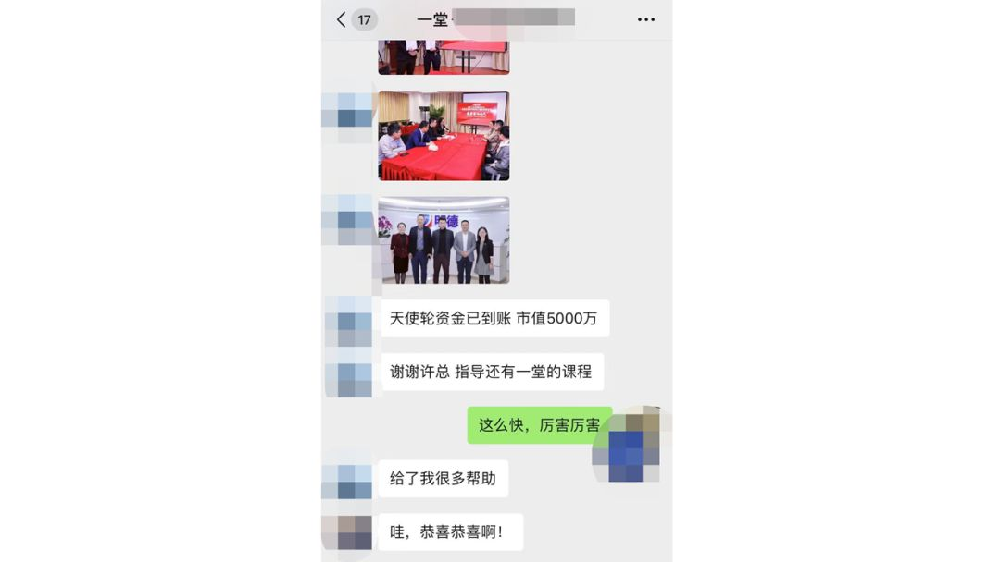
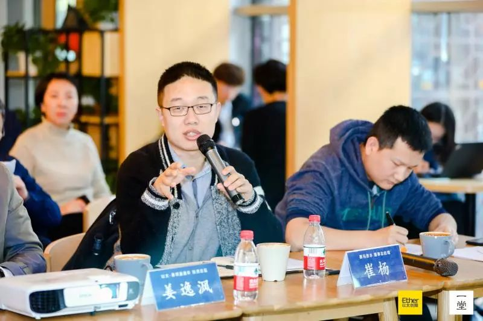
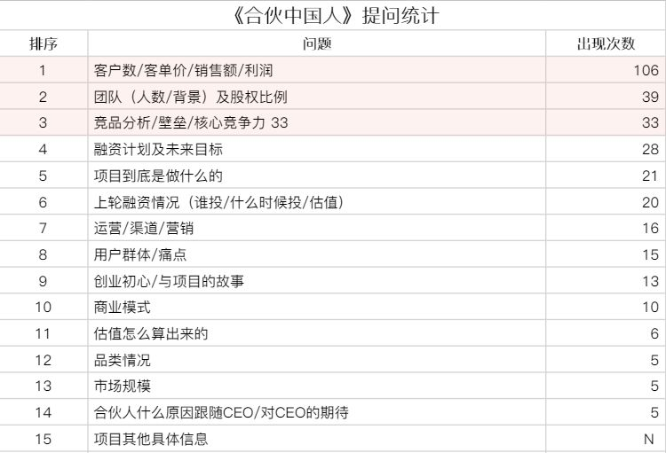
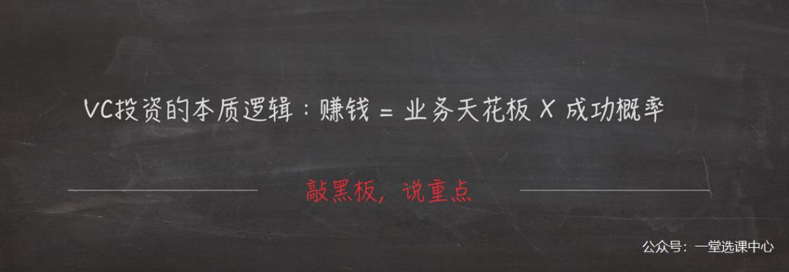
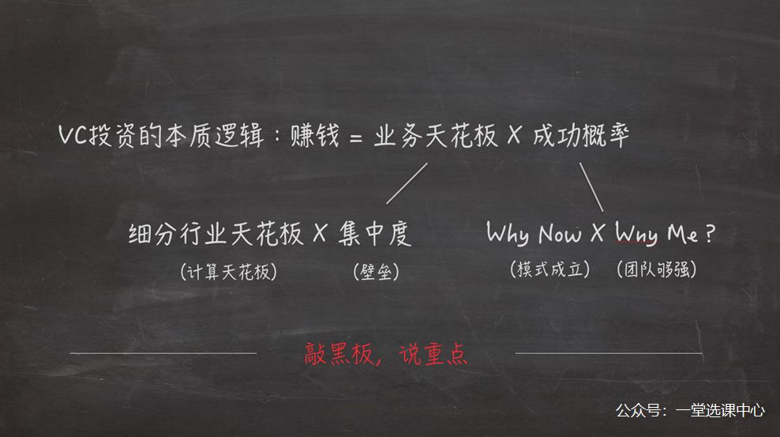

# 分析了近1000个投资人提问，创始人被问到最多的，竟然是这3个问题

     

## 分析了近1000个投资人提问，创始人被问到最多的，竟然是这3个问题

原创 一堂 [一堂选课中心](javascript:void(0);)

**一堂选课中心** 

微信号 aplusunion

功能介绍 以太一堂：以太创服旗下创业者成长业务。打造一系列最干的创业课，班主任陪伴学习，好评率超97%，完课率远超同行。帮你少走弯路，尽早跑通业务、拿到融资。

_1周前_

收录于话题

在融资过程中，针对投资人最爱问的问题，本文做了完整解读。

并且试图找出这些问题背后的潜台词，给你一些回答的套路和底层逻辑。

如果你的项目正在融资，强烈建议你认真读完，阅读约需10分钟，如果你能坚持读完，文末有一份小惊喜。

* * *

每年几月是最佳的融资窗口呢？

我们通常建议创始人要抓住3月到11月，这几个月是国内风险投资最活跃的时候。

这周，就有一堂学员发来捷报，拿到了第一笔天使轮融资。

那你的融资，准备好了吗？

今天，我们就来聊一个融资筹备的重要难题：

**怎么应对投资人的提问？**

比如：

		在见投资人之前，我该如何准备？
	

		投资人问了那么多问题，他其实是想知道什么？
	

		听完我的回答后，投资人是怎么想的？他会不会投我？
	

大家都知道，投资是一个很非标的事情。

但我们想知道，是不是可以从投资人衡量项目的评判标准中，发现一些共识？

于是，我和团队的小伙伴一起，做了下面几件事：

1. **将我们往期线下路演中，记录过的投资人的267个提问，重新进行了整理；**
	
2. **观看了《合伙中国人》中86个项目，记录了其中的609个问题；**
	
3. **为了避免出现数据偏差，我们最后还咨询了几位以太的资深的FA和CEO周子敬。**
	

最终我们提炼出了投资人最爱问的3个问题，然后发现，原来这几个问题是有底层规律的。

__01__

**投资人最喜欢问的3个问题**

### 

**1.往期路演中的267个问题**

我们先整理了我们之前《融资加速实战班》中5期路演活动60多个项目里，投资人提的267个问题。

发现其中排名前4的是：

1. **你的收入模型/盈利模式是什么样的？**
	
2. **相比竞品或者原有的服务，你项目的优势是什么？**
	
3. **你的团队构成是什么样的？**
	
4. **你的项目到底在做什么？/有什么样的应用场景？**
	

因为我们的学员都偏早期，这个数据可能不具有代表性，于是我们开始一集一集地看《合伙中国人》。

### 

**2.《合伙中国人》中的609个问题**

可能有些人不知道这个节目，简单介绍下，《合伙中国人》是一个创投真人秀的节目。

简单点来说，就是电视节目版的路演。

这个节目的嘉宾，你肯定多多少少都有听过，真格基金的创始人徐小平，IDG的董事长熊晓鸽，58集团的CEO姚劲波，当当网创始人李国庆，以及BAI创始及管理合伙人龙宇。

如果说电视节目多多少少会有一些表演的成分在，但从这几位投资人的问题角度来看，还是很具有代表性的。

两季《合伙中国人》共86个项目，投资人提了609个问题，统计的结果如下：

从表格中我们可以看到，排名前三的问题是：

1. **客户数/客单价/销售额/利润**
	
2. **团队（人数/背景）及股权比例**
	
3. **竞品分析/壁垒/核心竞争力**
	

用这个结果和之前的进行对照，发现除了排名和股权比例的部分稍有不同外。

大家都在关注三件事：**模式、团队和竞争。**

红杉资本的沈南鹏也谈到过，他选项目有六条秘诀。

分别是：看人、模式、执行力、客单量、效率、数据。

如果说总结成三条本质的话，就是：市场、团队、模式。

看来在这个问题上，大家是有一定的共识的。

所以，我们在这876个问题中，发现的投资人问的最多的3个问题，也是十分具有参考意义的。

1. **你的盈利模式是什么样的？**
	
2. **你的团队怎么样？有没有做好这个项目的能力？**
	
3. **你的项目相比其他人有什么样的优势？壁垒是什么？**
	

大家可以用自己的项目，尝试回答这3个问题。

如果能够回答清楚，说明你的能力已经超过大部分的人了。

大部分文章到这里，其实就结束了，但我们还想继续探究。

从更深层次的角度来看，投资人究竟为什么会格外关注这3方面的问题？他们之间有什么联系么？

__02__

**这次周子敬的「赚钱」公式**

我们在和周子敬聊的时候，周子敬讲了一个真实的故事，将投资人问的最多的这3个问题，串了起来。

他今年投了一个生鲜零售的项目，这轮估值5000万，他投了500万，占10%。

因为情怀？团队？还是他看好这个赛道？

这些其实都有道理，但都和我们上面得出的结果一样，不够本质。

他愿意投的本质，其实就两个字：**赚钱。**

### 

**1.投资的本质：赚钱**

辰海资本合伙人陈悦天，在他的文章《2018投资上学会的事情（上）》中也提到过：

> 投资行业的一切评判标准就是最后你有没有赚到钱。
> 
> 理论是属于功成名就的大佬们的事情。
> 
> 很多人都能够讲出一套自圆其说的理论，失败者也可以。
> 
> 但是成功赚到钱的人总是凤毛麟角。  
> 
> 现实的情况是：不管你是投资/创业做什么垂直行业，到底什么职能：投资人、FA还是创业者，在一个应该属于你的时间窗口没赚到钱，再努力再有洞见名声再大也没用。  
> 
> 商业很公平，利润和现金是衡量成功最好的标准。

而周子敬说的「赚钱」两个字，其实囊括了投资人问的最多的那3个问题：模式、团队和竞争。

接着，他又给了一个判断公式：

**赚钱 = 业务天花板 X 成功的概率**

这个『赚钱』公式是什么呢？

看起来有点难以理解，其实，就是一个数学期望。

也就是说，如果做成了，未来会是个多大的公司，以及有多大概率能做成。

回到刚才他提到的生鲜零售的项目，他心里的公式是这样的：

这个项目未来有机会做成一个百亿美金的公司，也就是他的投资可以翻大概1000倍。

那有多大概率做成呢？他跟这个创始人聊了两周，他认为1%的概率是有的。

也就是他有1%的概率，可以获得1000倍的回报，乘在一起，数学期望是10倍，他就果断投了。

当然这里的1%的概率，是既客观又主观，其实是一个并不能特别清晰计算出来的公式。

我们觉得业务天花板和概率，这两点太宽泛了，很难理解。具体一点，投资人会看哪些维度？

### 

**2.进一步拆解「赚钱」公式**

他又尝试拆了一步，这基本就是他个人完整的投资逻辑了。

第一个部分，所谓的业务天花板，也就是公司未来能做多大，这个取决于两个因素：所在的行业的天花板有多高，以及行业集中度是不是足够高。

**1.行业天花板**

很多人都喜欢称我有万亿市场，五千亿市场，其实在投资人眼里都是不懂市场的表现。

计算行业天花板，是有一套完整的计算和推导逻辑的。

**2.集中度**

也就是能够做到一家独大？还是极其分散？背后的逻辑，其实是项目有没有壁垒，这也是投资人最爱问的问题之一。

讲完了天花板，再来看『成功概率』，也就是有多大概率能做成，如果再拆一下，也就是投资人常问的两个问题：

**3.Why Now？**

也就是为什么现在这个事情能做成。

是某些行业要素发生了变化么，还是你的商业模式有颠覆性的创新？这些假设你验证了多少？你的MVP，或者你的单点模型跑通了吗？或者是国外已经有成功的模式了？

这些都可以很好地回答Why Now的问题。

**4.Why Me？**

也就是为什么是你。

项目需要的核心能力，你都具备吗?你的团队能打仗吗？相比于其他竞争对手，你的团队有什么优势？

再回到刚提到的案例，创始人是怎么让他相信，这个项目值得投资呢？

而他投的这个创始人，有严谨的市场空间计算，而且项目未来有比较强的规模效应，可以有比较好的集中度。

并且团队战斗力很好，有非常多相关的经验，非常适合做这个项目，基本打消了他对Why Now 和 Why Me的顾虑，所以他才会投资的。

换句话说，如果同样的团队，做一个赛道比较小，或者是没什么壁垒的事情，再或者这个团队不够好，很难把事情做成，他就不愿意投了。

那么，基于周子敬的「赚钱」公式，再回到创始人这边来看。

**对于创始人，如果只做一件事，就是说服投资人相信他的项目可以「赚钱」。**

市场规模、团队、商业模式、竞争等因素，都是在不断地找证据，让投资人相信。

投资界有「51比49法则」。那些被「枪毙」的商业计划书真的一文不值吗？

其实只是这些项目在投资人那里，得到的分数加起来，并没有达到让他们信服的及格线，成为了49%，而不是51%。

__03__

**投资人常问问题清单**

我们把这篇文章中的几个重点重新回顾一下，文中一共讲了4点：

1. 投资人问的最多的3个问题是：模式、团队和竞争。
	
2. 投资的本质是判断，赚钱的期望是多少。
	
3. 赚钱=概率×业务天花板。
	
4. 融资的过程就是不断找到证据，说服投资人。
	

这对于创始人的实际面对的问题，或许还缺点什么。

试想一下，你现在已经知道了「赚钱」这个关键词，作为创始人，你应该如何围绕这个关键词，去说服投资人呢？

**知己知彼，才能百战百胜。**

**想要知道怎么说服投资人，就得知道投资人最关心什么。**

我们咨询了以太的数十位资深FA，再结合我们的统计结果，围绕「赚钱」公式。

打磨了一组《投资人常问问题清单》，里面有7个方向的，共计15个问题。

（获取方式可以点击“阅读原文”，扫码进群找班主任领取）

你可以看看能否清晰回答这组关键问题。

当然，如果你看完之后，觉得回答不清楚，又不知道怎么解决。

欢迎你报名参加我们的 **以太一堂丨创业复盘训练营：**

课程市场价199**元**
**前100名**仅需**19.9**元
不到一本书的钱
获得顶级创业者的创业心法
👇👇👇

**股权+融资+业务**，一码搞定！

预览时标签不可点

收录于话题 #
个
上一篇 下一篇

[阅读原文](##)
阅读

分享 收藏
赞 在看

已同步到看一看[写下你的想法](javascript:;)

前往“发现”-“看一看”浏览“朋友在看”

前往看一看

**看一看入口已关闭**
在“设置”-“通用”-“发现页管理”打开“看一看”入口
[我知道了](javascript:;)

已发送

取消

#### 发送到看一看

发送

分析了近1000个投资人提问，创始人被问到最多的，竟然是这3个问题

最多200字，当前共字

发送中

喜欢此内容的人还喜欢

微信扫一扫
关注该公众号

 微信扫一扫
使用小程序

[取消](javascript:void(0);) [允许](javascript:void(0);)

[取消](javascript:void(0);) [允许](javascript:void(0);)

[知道了](javascript:;)

**长按识别前往小程序**

原文链接：<https://mp.weixin.qq.com/s/SDOxgM_bpoMvi3V0CgGm3g>
