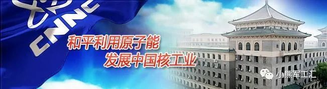

# 十大军工集团之中国核工业集团

     

## 十大军工集团之中国核工业集团

[小熊军工汇](javascript:void(0);)

**小熊军工汇** 

微信号 gh\_e66ff3a808f6

功能介绍 原军工汇失联 ，聚焦国际军工顶层智慧、传递军事热点、传播国防知识、专注于军工现状及趋势分析，军工材料发展、推介军工企业、产品，军工（旅）原创文章、观点交流、产品投融资服务等

_1周前_

收录于话题

**中国核工业集团有限公司****（简称中核集团）**

**China National Nulear Corporation（CNNC）**

中核集团是经国务院批准组建、中央直接管理的国有重要骨干企业,是国家核科技工业的主体、核能发展与核电建设的中坚、核技术应用的骨干，拥有完整的核科技工业体系，肩负着国防建设和国民经济与社会发展的双重历史使命。

2018年1月，党中央、国务院作出中核集团和原中核建设集团合并重组的重大决策。新的中核集团建立起先进核能利用、天然铀、核燃料、核技术应用、工程建设、核环保、装备制造、金融投资等核心产业以及核产业服务、新能源、贸易、健康医疗等市场化新兴产业，形成更高水平的核工业创新链和产业链，显著提升了我国核工业的资源整合利用水平和整体国际竞争实力。

**_01_**

**业务领域**

**天然铀**

★我国天然铀资源的保障主体
★我国铀矿勘查开发的国家队和主力军
★国内开发、海外开发、国际贸易、战略储备四位一体的天然铀保障供应体系
★集地质勘查、矿山开采、选冶加工、科技开发、工程设计、施工建设和运营管理于一体的先进高效全产业链体系
★铀矿勘查开发、放射性共伴生矿产资源综合利用、多金属矿产资源勘查开发、地质勘查、矿山退役治理及环境综合治理等领域的产品供应商、技术服务商和工程总承包商

**核电**

★核电技术的型谱化发展
★核电项目及设施的开发、投资、建设、运营与管理能力的核能产业链
★在运核电机组21台，在建机组6台

**核燃料**

★中国唯一的核燃料生产商、供应商和服务商
★新一代铀浓缩离心机大型商用示范工程
★CF系列核燃料元件
★高温气冷堆核燃料组件
★中国铀纯化转化一体化技术
★大型压水堆，重水堆，高温气冷堆，快堆及各类小型实验反应堆燃料

**核电建设**

★全球唯一连续30余年不间断从事核电建造
★完整的核电建设产业链（土建、安装全部专业的技术能力，土石方、预应力、混凝土、钢衬里、大件吊装、无损检测、检维修等各种专业化施工能力、现场生活设施的服务能力）
★国内在建和在运核电机组共62台，总装机容量6403.4万千瓦

**核环保工程**

★国内领先的后处理及退役治理技术

★完备的涵盖高、中、低水平放射性废物及废液的处理、运输、处置体系

**核技术应用**

★中国第一、世界第三大钴源供应商
★加速器技术实现型谱化（国内首台自主10MeV/20kW高能大功率电子辐照加速器，国内能量水平最高的100MeV强流质子加速器，230 MeV质子治疗专用加速器）
★用于诊断和治疗肿瘤、神经系统等疾病的放射性药品研发、生产和供应能力（诊断幽门螺旋杆菌（碳13、碳14）呼气检测药物、首批国产医用钴-60调节棒、钴源辐照装置、加速器辐照装置）

**_02_**

**下属专业化公司**

****中国核电****

（股票代码：601985）

**中国核能电力股份有限公司**由中国核工业集团有限公司作为控股股东，联合中国长江三峡集团有限公司、中国远洋海运集团有限公司和航天投资控股有限公司共同出资设立。经营范围涵盖核电项目的开发、投资、建设、运营与管理；清洁能 源项目的投资、开发；输配电项目投资、投资管理；核电运行安全技术研究及相关技术服务与咨询业务；售电等领域。中国核电对外投资40家公司，控股企业113家。其控股核电有：

•浙江三门核电厂
•秦山核电厂
•秦山第二核电厂
•秦山第三核电厂
•方家山核电厂
•江苏田湾核电厂
•福建福清核电厂
•海南昌江核电厂
•江苏田湾核电扩建工程

**中国原子能工业**

**中国原子能工业有限公司**与中国核燃料有限公司在2017年强强联合、合并重组，组建新的中国原子能工业有限公司，实现了核燃料研发、制造、销售和国际贸易服务一体化运营。公司是中国国内唯一的核燃料生产商、供应商及贸易服务商，主要从事核燃料产品（铀纯化转化、铀浓缩、元件、专用设备）的生产制造、工程建设、关键技术的研发，以及铀产品、核燃料循环设备、核电技术设备的进出口贸易。中国原子能工业有限公司对外投资20家公司。其控股企业有：

•中核第七研究设计院有限公司

•中国原子能工业广州有限公司

•四川红华实业有限公司

•四川红华实业有限公司红华市场

•中核燃料沧州有限公司

•上海原子能工业有限公司

•中核北方核燃料元件有限公司

•乐山红华建安工程有限公司

•甘肃兰核电控有限公司

•中核兰州铀浓缩有限公司

•核工业理化工程研究院有限公司

•乐山市金口河新村电力有限责任公司
•包头光华建筑安装工程有限责任公司
•四川峨边西河水电有限责任公司
•峨眉山市精诚实业有限责任公司
•中核(天津)机械有限公司
•甘肃柴家峡水电有限公司
•中核包头核燃料元件股份有限公司

 **中国铀业**

**中国铀业有限公司**是中核集团公司地矿产业板块的生产经营机构，是我国铀矿勘查的国家队、主力军，我国天然铀产品的专营供应商。主要从事国内外铀矿等资源的勘查开发工作，是中核集团公司地矿产业板块的经营中心和利润中心，肩负着为国防建设和核电发展提供铀资源保障的崇高使命。中国铀业对外投资9家公司。其成员单位有：

•核工业二〇八大队
•核工业北京地质研究院
•核工业北京化工冶金研究院
•核工业第四研究设计院
•核工业航测遥感中心
•核工业二一六大队
•核工业二四三大队
•核工业二〇三研究所
•核工业二三〇研究所
•核工业二四〇研究所

**中国核建**

**中国核工业建设股份有限公司**成立于1999年7月。2018年中国核工业建设集团有限公司与中国核工业集团有限公司实施重组，中核建设集团整体无偿划转进入中核集团，不再作为国资委直接监管企业。集团公司以军工工程、核工程、核电工程建设为主业，保持了国防工程与民用工程相结合、工程建设与科研设计相结合的产业体系。集团公司的成员企业包括国家大型施工企业、甲级研究设计院、核能科技公司、工程勘察院、投资公司、机械制造厂、外经贸公司、房地产公司、计算机软件开发公司等。中国核建对外投资26家公司。其控股企业有：

•郑州中核岩土工程有限公司
•中核(荆门)投资发展有限公司
•中核华泰建设有限公司
•中国核工业中原建设有限公司
•中核华瑞智能科技(北京)有限公司
•中核中原(安徽)建筑工程有限公司
•阿克苏中核建筑工程有限公司
•中核中原(蚌埠)建筑工程有限公司
•上海简昌文具有限公司
•宜昌中核港窑路建设项目管理有限公司
•上海华盾工贸有限公司
•福鼎汇铭建材有限公司
•衡阳中核二四项目管理有限公司
•中国核工业二四建设有限公司
•上海石化地区月兴综合服务部
•上海纵核信息技术有限公司
•上海石化起重运输机械修理厂
•武汉中核建设投资发展有限公司
•中国核工业第五建设有限公司
•中核二四乌海投资有限公司
•黔南中核东升建设发展有限公司
•中核中原建设工程(临沂)有限公司
•昌乐中核建设投资发展有限公司
•核工业工程研究设计有限公司
•中国核工业二三建设有限公司
•中核二三建筑有限公司
•北京市核建恒信检测技术有限公司
•中核检修有限公司
•昆明核港基础设施建设投资有限公司
•云南中核空港建设投资有限公司
•和建国际工程有限公司
•四川恒誉建设开发有限公司
•山东中禾恒信建设管理有限公司
•四川中禾恒荣建设开发有限公司
•四川中禾恒安建设管理有限公司
•山东中禾恒通建设管理有限公司
•河南中禾恒创建设开发有限公司
•永州中核建设投资有限公司
•中核华辰建设有限公司
•上海和原能源科技有限公司

**中核环保**

**中核环保有限公司**成立于2017年，经营范围包括技术开发、技术咨询、技术服务、技术推广；项目投资；建设工程项目管理；大气污染治理；水污染治理；固体废物处理；环境监测；核废物处置；危险废物经营；工程设计。中核环保对外投资10家公司。其控股企业有：

•中核龙瑞科技有限公司

•中核环保工程有限公司

## •中核清原环境技术工程有限责任公司

## •北京中核南礼士路宾馆有限公司

## •秦皇岛核城旭腾创业服务有限公司

•中核四0四有限公司

•湖南核工业宏华机械有限公司

•中核环保工程设计研究有限公司

•中核环保甘肃金安隆科技有限公司

**中国中原**

**中国中原对外工程有限公司**作为中核集团的海外核工程平台，是中国第一个海外核工程建造商，开创了中国核工业走向世界的先河。中国中原以核电业务为龙头，为全球客户提供涵盖核燃料、核环保、核技术应用、铀资源及新能源等业务领域的多元服务，为世界核能发展做出贡献。公司目前与60多个国家和地区建立了合作关系，与国际原子能机构等国际组织保持着密切合作。在国际市场开发上，实现对中东欧地区、中亚地区、中东与非洲地区、南亚地区以及拉美地区在全球核电市场的辐射与覆盖。中国中原对外投资9家公司。其控股企业有：

•北京三零六储运有限公司
•中原运维海外工程有限公司

**中核浦原**

**上海中核浦原有限公司**是中核集团核与非核设备、仪器仪表制造及科技成果转化、招标与集采平台服务、国际国内贸易为主业的专业化投资运营公司。中核浦原对外投资27家公司。其成员单位有：

•中核集团核工业第八研究所
•中核苏阀科技实业股份有限公司
•西安核设备有限公司
•中核动力设备有限公司
•西安中核核仪器有限公司
•中核（上海）企业发展有限公司
•中核（上海）供应链管理有限公司
•中国核工业物资供销华东有限公司
•上海浦原对外经贸有限公司
•上海浦原进出口有限公司
•上海光华·爱而美特仪器有限公司
•上海光华劳动保障事务所有限公司
•上海中核仪表自控系统有限公司
•中国核工业物资供销上海核电器材有限公司
•上海光华仪表有限公司
•上海浦原实业有限公司

**中国宝原**

**中国宝原投资有限公司**系中核集团的全资子公司，业务聚焦核技术应用产业，同时兼顾现代服务、资产管理，其中核技术应用基本形成从技术、产品、到服务应用的全产业链，发展实力和竞争优势进一步增强。中国宝原拥有2家香港上市公司——中国同辐股份有限公司（01763.HK）、中国核能科技集团有限公司（00611.HK），2家新三板挂牌公司——原子高科股份有限公司、中核凯利深圳核能服务股份有限公司，拥有中国同辐、中核医疗、中核健康、中核质子等多个核技术应用细分领域的投资公司，拥有8家医疗服务机构、实际开放床位数超过5000张。中国宝原对外投资28家公司。其控股企业有：

•中核利华消防工程有限公司
•中核粒子医疗科技有限公司
•中国核工业电机运行技术开发有限公司

**中核资本**

**中核资本控股有限公司**是中核集团旗下最具规模和潜力的专业化公司之一，中核资本围绕产业金融和科技创新“双主业”定位，坚持服务集团和价值创造：金融产业涵盖投资并购、融资租赁、产业基金、保险经纪、商业保理、金融咨询等，全面服务集团主业发展；科技产业以同方股份的信息技术、公共安全、节能环保等业务为主，助力中核集团产业升级。中核资本对外投资10家公司。其控股企业有：

•中核商业保理有限公司
•中核产业基金管理有限公司
•中核建融资租赁股份有限公司
•核建租赁(天津)有限公司
•中核长安保险经纪有限公司

**_03_**

**直属单位**

中国核动力研究设计院

中国唯一集核反应堆工程研究、设计、试验、运行和小批量生产为一体的大型综合性科研基地，自建院以来已经形成包括核动力工程设计、核蒸汽供应系统设备集成供应、反应堆运行和应用研究、反应堆工程实验研究、核燃料和材料研究、同位素生产和核技术服务与应用研究等完整的科研生产体系。

中国核电工程有限公司

国内唯一完成百万千瓦级核电站自主设计、并形成自主品牌的研究设计单位；国内最大的综合性核电总体研究设计单位；国内唯一的核化工、核燃料元件工程研究设计单位；核电行业中承担和完成核电工程设计项目最多的单位；国内核电行业唯一以核电研究设计为龙头的工程公司。

中国原子能科学研究院

我国核科学技术的发祥地和基础性、综合性核科研基地，作为重要科学思想库、技术储备库和人才培养库，为国家核科技创新、核工业发展、核科技人才培养做出了重要贡献，形成了核物理、核化学与放射化学、反应堆工程技术、加速器技术、核电子与探测技术、同位素技术、辐射防护技术和放射性计量等八大学科领域，开发出了以同位素辐射技术为主导的一批高新技术和产品。

中核战略规划研究总院有限公司

定位为集团公司智库与核行业智库，主要承担国家相关部委、能源、军工等行业和集团公司委托的重大问题研究、咨询研究、情报研究、专项支撑、专利代理、信息化服务、标准服务、书刊出版服务、认证服务等任务。

新华水力发电有限公司

由中核集团和水利部综合事业局共同出资，兼具中央企业管理优势和水利部行业专业优势。专注清洁能源开发与运用，其主要业务包括清洁能源发电、电网、供水、咨询、机电及综合开发等。电网年供电能力达20多亿千瓦时，惠及人口近100万；供水覆盖陕西省及宁夏回族自治区220万人及多个园区。

核工业大学

在核工业管理干部学院和核工业研究生部基础上整合组建，归口管理核工业管理干部学院、核工业研究生部。中国核工业党校/核工业大学是核工业各类人才的重要培训基地，是集团公司的“党建前沿阵地、人才培养摇篮、企业文化基地、决策支持平台”。

核工业西南物理研究院

中国最早从事核聚变能源开发的专业研究院，拥有较完整的开展核聚变能源研发所需的学科及相关实验室，先后承担并出色完成国家“四五”重大科学工程项目“中国环流器一号装置研制”及“十五”“中国环流器二号A(HL-2A)装置工程建设项目”建设任务，取得了一批创新性的科研成果，实现了中国核聚变研究由原理探索到大规模装置实验的跨越发展，是中国磁约束核聚变领域首家获得国家科技进步一等奖的单位。聚变研究和聚变相关技术的开发获多项国家专利，具有原创性的分子束加料技术等研究成果在国际聚变一流杂志及国际聚变能源大会上发表。

中核工程咨询有限公司

中核集团全行业全过程工程项目咨询平台，主要从事核能利用、天然铀、核燃料、核化工、核环保、核技术应用和民用工程等行业的投资决策咨询、全过程工程咨询和管理咨询三大业务领域。业务范围涵盖评估咨询、项目咨询、股权投资咨询、设计咨询、造价咨询、工程监理、设备监理、检修技术服务、项目监督检查、项目后评价、建设工程项目管理、工程检测评价、产业发展研究、质量管理咨询、科研管理咨询、采购管理咨询、科技成果转化咨询等领域。

中核（北京）传媒文化有限公司

中核集团宣传文化中心，是集团公司新闻宣传、品牌传播、企业文化、舆情管控等工作的专业机构，承担着集团公司对内对外宣传、舆情分析预警、媒体公关、全媒体平台运营、展览展示、文化产品制作、视频影视策划拍摄发行、成员单位新闻工作指导、新闻宣传队伍建设等职能。其《中国核工业报》、《中国核工业》杂志是我国核行业唯一综合类公开发行报刊。

中核能源科技有限公司

经国防科工委批准，由中国核工业建设集团公司和清华大学共同出资组建的核能高新技术企业。公司的核心技术是由清华大学自主研发的高温气冷堆和低温供热堆技术，该两项技术在国际核能领域均处于领先地位。2006年发布的《国家中长期科学和技术发展规划》，已将高温气冷堆示范电站项目列为十六个国家重大科技专项之一（十六大科技专项包括大型飞机、载人航天、艾滋病防治等），同时将低温堆核能海水淡化项目列为优先支持的项目。

中核财务有限责任公司

中国核工业集团公司及其成员单位共计26家股东单位共同出资设立，经中国银行保险监督管理委员会核准的非银行金融机构。公司坚持“集团资金归集平台、集团资金结算平台、集团资金监控平台、集团金融服务平台”四个平台功能定位，以加强企业集团资金集中管理和提高企业集团资金使用效率为目的，促进集团优化资源配置，节约财务成本，保障资金安全，提升运行效率，为集团成员单位提供金融服务，履行集团总部辅助管理职能。

核工业机关服务中心

中编办批准设立的事业单位，集团总部行政后勤事务管理、服务、保障单位。主要职责是：集团总部房产（办公用房与职工住宅）及职工公寓管理、车辆管理与服务、通信管理与服务、总部会议和保洁服务、办公区物业管理、集团公司公文材料的印制、期刊及信函管理、总部餐厅管理、生活后勤服务等。

核工业二二一离退休人员管理局

原二二一厂是我国第一个核武器研制生产基地，为我国核事业做出过重大贡献，建立了不朽的历史功勋。1987年，鉴于国家战略方针调整，国务院、中央军委于1987年决定撤销二二一厂。1996年，经国务院办公厅决定、中编办批复同意，由原核工业总公司组建全民所有制正局级事业单位，即核工业二二一离退休人员管理局）,为二二一离退休人员提供后勤管理与生活服务。

【重要通知】

**防止失联**

请一定长按扫码

**关注右方备用号**

    

内容来源丨智天策

> [名单刷新！2020最新央企名录及其行政级别划分](http://mp.weixin.qq.com/s?__biz=MzI4NDcxNDIwOQ==&mid=2247501654&idx=1&sn=4e667101b3cb925d146fa9d1088e11a8&chksm=ebf5b2d8dc823bcee8c6e28e81a76b3daf7f834f20ad8619ce61683f5e2a9ad049e682dcb5fa&scene=21#wechat_redirect)
> 
> [《武器装备科研生产许可申请指南》微视频](http://mp.weixin.qq.com/s?__biz=MzI4NDcxNDIwOQ==&mid=2247503905&idx=1&sn=9a3a91dad102bef9676dc2d3202215f9&chksm=ebf5a5afdc822cb94ce4edb02eb6489d3e27c0de707668832d5d219bf86e5827c499cc6fdf7d&scene=21#wechat_redirect)
> 
> [军工行业十四五规划特点及细分赛道梳理](http://mp.weixin.qq.com/s?__biz=MzI4NDcxNDIwOQ==&mid=2247503161&idx=1&sn=7c403d4bab7bfea15c135a761eb2704c&chksm=ebf5b8b7dc8231a13353339ec356d6a37ee873cfce54628404a1c312bc992c32b6573bdf7850&scene=21#wechat_redirect)
> 
> [军工“十四五”，武器装备进入放量建设战略五年](http://mp.weixin.qq.com/s?__biz=MzI4NDcxNDIwOQ==&mid=2247502681&idx=1&sn=803dbf56aaa25de8d55329f08ef8c662&chksm=ebf5bed7dc8237c17b86036c6bfaa496dbde42937bb597b6ff4fda6be18870e7b280e87263ae&scene=21#wechat_redirect)
> 
> [中国电子科技集团报告](http://mp.weixin.qq.com/s?__biz=MzI4NDcxNDIwOQ==&mid=2247503828&idx=1&sn=5e90ffddd9968e659ddf05a32db145b4&chksm=ebf5ba5adc82334c257ec61d695930250bcf95344c6e4ae78052d0429b0dadc19b93bdd947b5&scene=21#wechat_redirect)
> 
> [政府采购六种采购方式流程图](https://mp.weixin.qq.com/s?__biz=MzI4NDcxNDIwOQ==&mid=2247484547&idx=3&sn=ab55f95a5a5c96227f8a47a7fab10d5f&chksm=ebf6710ddc81f81b1ab9efcb8d9b521eeb2db8b1cd586fdbb2e595760db0ba334d7fc4fb1534&token=1582924943&lang=zh_CN&scene=21#wechat_redirect)

编辑声明：本平台发布部分内容来自公开资料或网络，版权归原作者所有，转载目的在于传递信息及用于网络分享，不代表本号赞同其观点和对其真实性负责，如涉版权问题，请联系我们删除！

**精彩内容长按二维码即可关注**

预览时标签不可点

收录于话题 #
个
上一篇 下一篇

阅读

分享 收藏
赞 在看

已同步到看一看[写下你的想法](javascript:;)

前往“发现”-“看一看”浏览“朋友在看”

前往看一看

**看一看入口已关闭**
在“设置”-“通用”-“发现页管理”打开“看一看”入口
[我知道了](javascript:;)

已发送

取消

#### 发送到看一看

发送

十大军工集团之中国核工业集团

最多200字，当前共字

发送中

喜欢此内容的人还喜欢

微信扫一扫
关注该公众号

 微信扫一扫
使用小程序

[取消](javascript:void(0);) [允许](javascript:void(0);)

[取消](javascript:void(0);) [允许](javascript:void(0);)

[知道了](javascript:;)

**长按识别前往小程序**

原文链接：<https://mp.weixin.qq.com/s/YrsByWKv7LeBdwDXBHhIkA>
