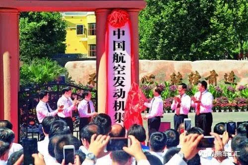
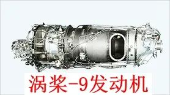
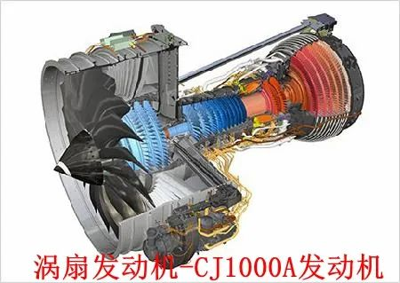
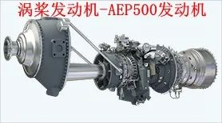
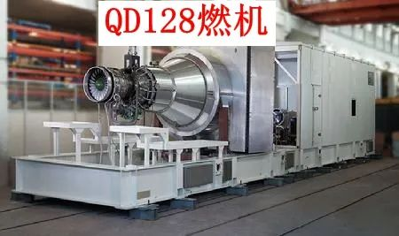
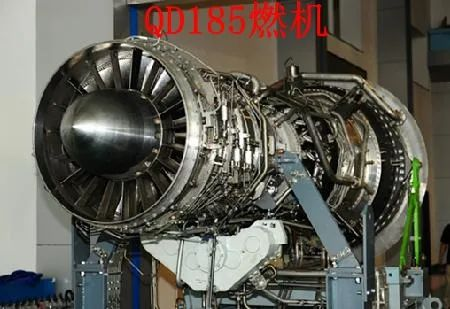
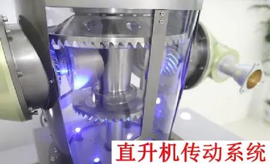
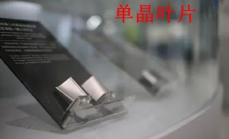

# 十大军工集团之中国航空发动机集团

     

## 十大军工集团之中国航空发动机集团

[小熊军工汇](javascript:void(0);)

**小熊军工汇** 

微信号 gh\_e66ff3a808f6

功能介绍 原军工汇失联 ，聚焦国际军工顶层智慧、传递军事热点、传播国防知识、专注于军工现状及趋势分析，军工材料发展、推介军工企业、产品，军工（旅）原创文章、观点交流、产品投融资服务等

_1周前_

收录于话题

**中国十大军工集团**

中国航空工业集团有限公司
中国航空发动机集团有限公司
中国航天科技集团有限公司
中国航天科工集团有限公司
中国船舶集团有限公司
中国核工业集团有限公司
中国兵器工业集团有限公司
中国兵器装备集团有限公司
中国电子科技集团有限公司
中国电子信息产业集团有限公司

2016年8月28日，中国航发在北京市海淀区举行揭牌仪式

**中国航空发动机集团有限公司**（简称“中国航发”）****

**Aero Engine Corporation of China（AECC）**

中央直接管理的军工企业，由国资委、北京国有资本经营管理中心、中国航空工业集团有限公司、中国商用飞机有限责任公司共同出资组建。下辖27家直属企事业单位，拥有3家主板上市公司，现有职工8万余人，拥有包括7名院士、200余名国家级专家学者在内的一大批高素质、创新型科技人才。建有多个国防科技重点实验室、创新中心，具有较强的科研生产能力，以及较为完整的军民用航空发动机、燃气轮机研发制造体系与试验检测能力。主要从事航空发动机、辅助动力、燃气轮机、飞机和直升机传动系统的研制、生产、维修和服务；从事航空材料及其它先进材料的研发与制造。中国航发设计生产的涡喷、涡扇、涡轴、涡桨、活塞发动机和燃气轮机等产品，广泛配装于各类军民用飞机、直升机和大型舰艇、中小型发电机组，客户涉及航空、航天、船舶、能源等多个领域，为我国国防武器装备建设和国民经济发展作出了突出贡献。

**_01_**

**主要产品**

航空
发动机

＞＞向右滑动查看更多图片＞＞

燃气轮机

＞＞向右滑动查看更多图片＞＞

传动系统

其他

＞＞向右滑动查看更多图片＞＞

**_02_**

**直属单位**

|     |     |     |
| --- | --- | --- |
| **单位** | **所在地** | **主营业务** |
| 中国航发研究院 | 北京  | 航空发动机战略性、前沿性、基础性研究 |
| 中国航发商发 | 上海  | 商用飞机动力装置及其相关产品 |
| 中国航发动力所 （606所） | 沈阳  | 航空发动机、燃气轮机 |
| 中国航发动研所 （608所） | 株洲  | 中小型航空发动机及直升机传动系统研究 |
| 中国航发涡轮院 （624所） | 成都  | 航空动力技术预先研究、产品研制开发和整机鉴定试验 |
| 中国航发航材院 （621所） | 北京  | 航空先进材料应用基础研究、材料研制与应用技术研究和工程化技术研究 |
| 中国航发动控所 （614所） | 无锡  | 航空动力系统研究 |
| 中国航发贵阳所 | 贵阳  | 中等推力军用航空涡喷、涡扇发动机科学研究 |
| 中国航发黎明 （410厂） | 沈阳  | 航空发动机、燃气轮机、国际业务与民机 |
| 中国航发成发 （420厂） | 成都  | 航空发动机及其衍生产品 |
| 中国航发西航 （430厂） | 西安  | 大中型军民用航空发动机研制生产 |
| 中国航发黎阳 （460厂） | 贵州  | 航空发动机研制生产 |
| 中国航发南方 （331厂） | 株洲  | 航空发动机、航空转包、燃气轮机、光机电产品、航空模型等制造 |
| 中国航发东安 （120厂） | 哈尔滨 | 轻型航空动力、航空机械传动系统、航空机电产品、微型燃气轮机、铝镁合金铸造和高精管轴管材产品 |
| 中国航发兰翔 （370厂） | 常州  | 航空涡轮轴发动机、航空发动机零部件、航空涡轮起动机 |
| 中国航发西控 （113厂） | 西安  | 航空发动机控制系统 |
| 中国航发长春控制 （133厂） | 长春  | 航空产品及燃油、液压系统零部件 |
| 中国航发红林 （143厂） | 贵州  | 航空动力控制系统 |
| 中国航发北京航科 （503厂） | 北京  | 航空发动机控制系统产品 |
| 中国航发中传 （300厂） | 长沙  | 军用齿轮及传动部件加工 |
| 中国航发长江 （310厂） | 岳阳  | 航空发动机封严产业专业化研制 |
| 中国航发哈轴 | 哈尔滨 | 轴承的设计 , 研制 , 生产 , 维修 , 营销和售后服务 |
| 中国航发动科 | 北京 株洲 沈阳 成都 | 航空发动机技术衍生产品 |
| 中国航发燃机 | 沈阳  | 燃气轮机研发制造 |

**_03_**

**集团下属上市公司**

**航发动力**（600893）

中国航发动力股份有限公司是我国大、中、小型军民用航空发动机、大型舰船用燃气轮机动力装置的生产研制和修理基地，集成了我国航空动力装置主机业务的几乎全部型谱，是国内生产能力最强、产品种类最全、规模最大的动力装置生产单位。承担着航空、航海、航天和国民经济建设领域众多装备任务，肩负着我国航空动力事业发展与振兴的历史重任。拥有国内最完善的产业链和国际一流的生产加工技术，与美国GE、英国RR、法国SNECMA、加拿大普惠（PWC）等世界著名航空发动机制造企业建立了长期稳固的战略合作关系，并成为数家外国发动机制造公司的近百种零件的海外唯一供应商。 

**航发控制**（000738）

中国航发动力控制股份有限公司本部设在无锡，在西安、贵阳、北京、长春等地区有4家全资子公司，是国家航空动力控制系统及产品的研制、生产基地，拥有国家级技术中心、重点实验室和型号规范试验室。主要有三大业务板块：发动机控制系统及部件、国际合作和非航产品。其中，发动机控制系统及部件主要包括航空发动机控制系统及衍生产品的研制、生产、修理和销售，收入占比约80%；国际合作业务主要是为国外知名航空企业提供民用航空控制系统精密零部件的转包生产，收入占比约10%；非航产品业务主要涉及以动力控制系统核心技术为基础，包括燃机控制、新能源控制、汽车自动变速控制、工程及行走机械等配套产品的研制、生产、销售和服务，收入占比约10%。

**航发科技**（600391）

中国航发航空科技股份有限公司在长期航空发动机研制，以及与国际知名航空企业合作过程中，掌握了国际先进的航空发动机关键零部件制造技术，拥有“国家企业技术中心、专业化加工制造平台、航空制造关键核心技术”三位一体的核心竞争力，具备了航空发动机研制、生产、试验和试车能力。其 “国家企业技术中心”涵盖了国家级理化检测中心 、国防二级区域计量站、四川省院士（专家）工作站，是技术创新的核心平台。公司与GE、RR、HON等国际知名企业建立了长期合作关系，逐渐成为国际合作优秀供应商。

【重要通知】

**防止失联**

请一定长按扫码

**关注右方备用号**

    

内容来源丨智天策

> [名单刷新！2020最新央企名录及其行政级别划分](http://mp.weixin.qq.com/s?__biz=MzI4NDcxNDIwOQ==&mid=2247501654&idx=1&sn=4e667101b3cb925d146fa9d1088e11a8&chksm=ebf5b2d8dc823bcee8c6e28e81a76b3daf7f834f20ad8619ce61683f5e2a9ad049e682dcb5fa&scene=21#wechat_redirect)
> 
> [《武器装备科研生产许可申请指南》微视频](http://mp.weixin.qq.com/s?__biz=MzI4NDcxNDIwOQ==&mid=2247503905&idx=1&sn=9a3a91dad102bef9676dc2d3202215f9&chksm=ebf5a5afdc822cb94ce4edb02eb6489d3e27c0de707668832d5d219bf86e5827c499cc6fdf7d&scene=21#wechat_redirect)
> 
> [军工行业十四五规划特点及细分赛道梳理](http://mp.weixin.qq.com/s?__biz=MzI4NDcxNDIwOQ==&mid=2247503161&idx=1&sn=7c403d4bab7bfea15c135a761eb2704c&chksm=ebf5b8b7dc8231a13353339ec356d6a37ee873cfce54628404a1c312bc992c32b6573bdf7850&scene=21#wechat_redirect)
> 
> [军工“十四五”，武器装备进入放量建设战略五年](http://mp.weixin.qq.com/s?__biz=MzI4NDcxNDIwOQ==&mid=2247502681&idx=1&sn=803dbf56aaa25de8d55329f08ef8c662&chksm=ebf5bed7dc8237c17b86036c6bfaa496dbde42937bb597b6ff4fda6be18870e7b280e87263ae&scene=21#wechat_redirect)
> 
> [中国电子科技集团报告](http://mp.weixin.qq.com/s?__biz=MzI4NDcxNDIwOQ==&mid=2247503828&idx=1&sn=5e90ffddd9968e659ddf05a32db145b4&chksm=ebf5ba5adc82334c257ec61d695930250bcf95344c6e4ae78052d0429b0dadc19b93bdd947b5&scene=21#wechat_redirect)
> 
> [政府采购六种采购方式流程图](https://mp.weixin.qq.com/s?__biz=MzI4NDcxNDIwOQ==&mid=2247484547&idx=3&sn=ab55f95a5a5c96227f8a47a7fab10d5f&chksm=ebf6710ddc81f81b1ab9efcb8d9b521eeb2db8b1cd586fdbb2e595760db0ba334d7fc4fb1534&token=1582924943&lang=zh_CN&scene=21#wechat_redirect)

编辑声明：本平台发布部分内容来自公开资料或网络，版权归原作者所有，转载目的在于传递信息及用于网络分享，不代表本号赞同其观点和对其真实性负责，如涉版权问题，请联系我们删除！

**精彩内容长按二维码即可关注**

预览时标签不可点

收录于话题 #
个
上一篇 下一篇

阅读

分享 收藏
赞 在看

已同步到看一看[写下你的想法](javascript:;)

前往“发现”-“看一看”浏览“朋友在看”

前往看一看

**看一看入口已关闭**
在“设置”-“通用”-“发现页管理”打开“看一看”入口
[我知道了](javascript:;)

已发送

取消

#### 发送到看一看

发送

十大军工集团之中国航空发动机集团

最多200字，当前共字

发送中

喜欢此内容的人还喜欢

微信扫一扫
关注该公众号

 微信扫一扫
使用小程序

[取消](javascript:void(0);) [允许](javascript:void(0);)

[取消](javascript:void(0);) [允许](javascript:void(0);)

[知道了](javascript:;)

**长按识别前往小程序**

原文链接：<https://mp.weixin.qq.com/s/iFqhhWAxFj4VpFI8L_ycIw>
