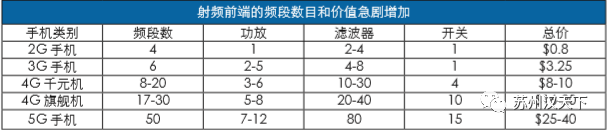
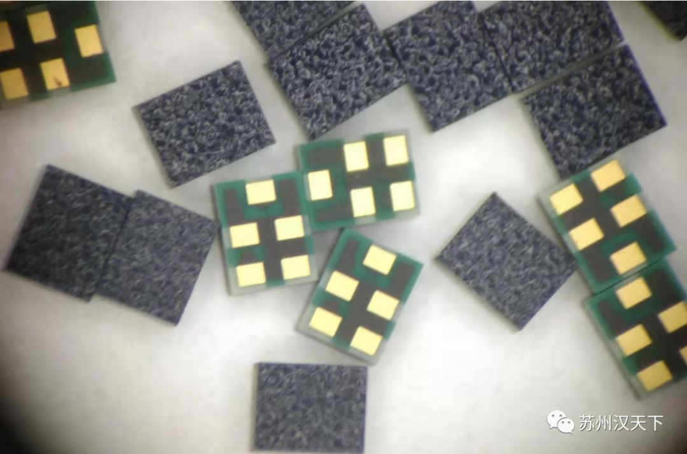

# 国产滤波器中的汉天下

1

 公司简介

**汉天下电子成立于2012年，主要从事射频滤波器及相关射频芯片和器件的研发、设计和生产制造。****团队经历了产品从实验室研发到大批量生产和销售的全过程，拥有关于射频MEMS谐振器、滤波器的多项核心技术，****是国内率先全面掌握射频MEMS滤波器（BAW）量产技术的公司。**

2

 研发背景&历程

滤波器是射频前端（滤波器、功率放大器、低噪放和射频开关）市场中最大的业务板块，是5G通信的核心之一。其工艺类型可以分为：声表面波滤波器（SAW滤波器）和体声波滤波器（BAW滤波器）两类，而基于MEMS工艺的BAW滤波器因为中高频段的性能优势在5G时代更具竞争力。
射频MEMS滤波器的研发和生产需要设计和工艺的高度配合，同时其生产制造流程属于非标准化特殊工艺，精度要求高、难度系数大。由于国外起步发展较早，围绕核心技术形成了较完善的专利布局。目前BAW滤波器市场主要被Avago和Qorvo两家美国公司占领；而SAW滤波器也基本被muRata、TDK等巨头垄断，国内产品几乎一片空白，只有少数企业和机构有非常少量的中低端滤波器产品出货。是整个中国亟待解决的、受制于人的关键技术。
在国内市场空白、行业内几乎没有该领域研发经验的情况下，汉天下历时4年，经过反复试验、试制，调整生产制造流程，在产品设计、结构优化和关键工艺上都实现了突破，顺利完成了射频MEMS滤波器芯片的研发，填补了国内射频滤波器的空白。前期样品的性能已经与国外巨头产品相媲美，公司已全面掌握了从设计与建模、生产制造、封装到测试的全套MEMS滤波器产业化技术，打破了国外巨头技术垄断。

3

 产品介绍

5G时代滤波器将占据射频前端成本的50%以上，年复合增长率达21%，未来滤波器的市场总量将达到163亿美元。

2019年，汉天下面向市场推出了四款射频MEMS滤波器产品，包括WiFi 2.4GHz共存滤波器，B40滤波器，B3双工器，以及适配5G技术的全频段N41滤波器。所有产品已于2019年下半年正式出货且市场反应良好。
2020年公司计划再推出五款滤波器产品，包括B2双工器，B1+B3四工器，面向5G新频段的N77和N79滤波器，以及WiFi 5GHz滤波器。
国产滤波器的成功研发解决了我国滤波器芯片受制于人、严重依赖进口的痛点。公司的滤波器产品拥有完全的自主知识产权，为国产化和自主品牌的建立提供有效的保障，为“中国芯”的崛起添砖加瓦。

4

   技术优势

公司经过四年多的工艺开发和实践，在工艺方面已经全面掌握了压电层沉积、光刻、刻蚀、空腔结 构的释放等关键核心技术，并且拥有自主知识产权。
在封装方面，公司通过与封装厂家联合开发晶圆级键合封装技术，在经过长时间的探索之后，封装工艺已经成熟，具备了大规模量产的条件。
在技术方面，汉天下是国内领先的射频技术公司。自2015年开始研发自主知识产权的MEMS滤波器芯片产品，已成功地验证了所有相关设计与仿真的流程。整套工艺采用MEMS立体加工工艺，与IC工艺相兼容。公司团队经过四年多的开发和实践，已攻克全部关键工艺，并系统掌握了器件关键结构与器件主频率、差损等性能参数的关系，MEMS滤波器所有技术瓶颈己完全克服。

5

   发展布局

公司根据半导体行业发展趋势及各地区优势，布局苏州、绍兴、北京、深圳、香港五大区域，计划在三年内形成现有产品的大规模量产以及5G频段产品的大批量量产。
在技术快速更迭的5G时代，公司核心团队着力于技术的变革与创新。基于自身的工艺基础和研发能力，公司计划在5G、物联网等多个焦点领域开展具有大规模应用的MEMS传感器件和MEMS通信芯片的研发，完成包括滤波器、天线、功率放大器、低噪放和射频开关的多个单产品芯片研发；在此基础上，公司拟开展射频前端单芯片的高集成射频模组的研发设计计划，完善涵盖整个射频前端产品的战略布局，力争三年内成为国内最大的射频芯片和射频模组供应商。

**特别声明**

		本公众号文章观点仅作为内容分享，不构成投资建议，不涉及个别客户特殊的投资目标、财富状况或需要等；
	

		本公众号原创文章版权归宝利财富所有，未经允许，不得转发，不得对原文进行有悖原意的引用、删改和修改；
	

		引用类文章版权归原作者所有，部分文章推送时未能与原作者取得联系，无意侵犯媒体或个人知识产权，还望告知。
	

POLYSOAR

部分已投项目

[**编程猫**](http://mp.weixin.qq.com/s?__biz=MzI5ODYzMDI3MA==&mid=2247511092&idx=1&sn=8144068b612cdeab124b157e409480ef&chksm=eca00125dbd78833eb4550205a1cdf69be2c566e1e33fa97065663369066a5106ab89087fcbe&scene=21#wechat_redirect)**｜**[**优必选科技**](http://mp.weixin.qq.com/s?__biz=MzI5ODYzMDI3MA==&mid=2247508027&idx=3&sn=1e3d092eeceb987725e8af26963d1dc1&chksm=eca00d2adbd7843cd0a221a5b8cea5b65546dd5419385adeca0086bfbd6160eddab9c4e2bc16&scene=21#wechat_redirect)**｜[中欣晶圆](http://mp.weixin.qq.com/s?__biz=MzI5ODYzMDI3MA==&mid=2247509058&idx=1&sn=0ad69647287ae8c279abb63375d0a7e9&chksm=eca00953dbd7804507c00c4fbd1d355f92c0c1ec3633bab4e56667292f349bf7580fe88c708c&scene=21#wechat_redirect)｜****[孚能科技](http://mp.weixin.qq.com/s?__biz=MzI5ODYzMDI3MA==&mid=2247494745&idx=2&sn=21958258293e6093e7f0bf35614655df&chksm=eca04148dbd7c85ec5602b578bef6c45b0c320c701ff1f36fdc7bf9e7dc51f8cc3c9efc63a18&scene=21#wechat_redirect)******｜[奇安信](http://mp.weixin.qq.com/s?__biz=MzI5ODYzMDI3MA==&mid=2247495163&idx=1&sn=ef18898e02d872c02f5e7626584f4958&chksm=eca040eadbd7c9fc370719ca66386d17ef5e2b32133d874d370c81ae49f25c2bc00fed039fb2&scene=21#wechat_redirect)｜[字节跳动](http://mp.weixin.qq.com/s?__biz=MzI5ODYzMDI3MA==&mid=2247509127&idx=2&sn=a597e46a12fc5b71c57627d94a0ae11e&chksm=eca00996dbd7808024552b48d48da776ddde63fda3aa1471dff67328f5be9ce05355f25a499d&scene=21#wechat_redirect)｜[威马汽车](http://mp.weixin.qq.com/s?__biz=MzI5ODYzMDI3MA==&mid=2247505660&idx=1&sn=9719d7343baed493a9c972a3ff8c69d1&chksm=eca07beddbd7f2fbe78b765762247064e547aeaac87028edc6f4fa2007024252c407bee8f048&scene=21#wechat_redirect)｜[安谋中国](http://mp.weixin.qq.com/s?__biz=MzI5ODYzMDI3MA==&mid=2247508997&idx=1&sn=54ada27c9117a89c4761ac78f8d80e80&chksm=eca00914dbd780028a55191e6cdeef9c249c74a465c03396c1613e842eee2cca195984a9f918&scene=21#wechat_redirect)｜[微医](http://mp.weixin.qq.com/s?__biz=MzI5ODYzMDI3MA==&mid=2247508396&idx=2&sn=55e7a0f3fb7b909e691f42405480e983&chksm=eca00cbddbd785abe9037f7877cae0e0455b0e95bff9e05314a8232069cb8a327218b4b07547&scene=21#wechat_redirect)｜[多点DMALL](http://mp.weixin.qq.com/s?__biz=MzI5ODYzMDI3MA==&mid=2247511182&idx=2&sn=63b09306709480930346d61081d63e14&chksm=eca0019fdbd78889000a70bf6fdc25c0360174190827fdf0199ba236ba87b5475020993fb2b9&scene=21#wechat_redirect)｜[一脉阳光](http://mp.weixin.qq.com/s?__biz=MzI5ODYzMDI3MA==&mid=2247510402&idx=1&sn=ec144f5af5008270306c08aae0ef71b2&chksm=eca00493dbd78d859cd63328c49795bee4268f43803e988053b134123ecb2a4bf3f54e5ba101&scene=21#wechat_redirect)｜[叮当快药](http://mp.weixin.qq.com/s?__biz=MzI5ODYzMDI3MA==&mid=2247508997&idx=2&sn=1e78a35c54e90c3708357ae3e7f911c3&chksm=eca00914dbd78002196d4888c5416dd9602e2d535cfd7f60cfb067f140d746bef29bf0ce8883&scene=21#wechat_redirect)｜[数联铭品](http://mp.weixin.qq.com/s?__biz=MzI5ODYzMDI3MA==&mid=2247502260&idx=1&sn=9d585ed0d1edef82829c4e12d8cd5248&chksm=eca064a5dbd7edb318be7b117c117c57db63fa7ac976a76f8797503f3b3371723722979fb9ae&scene=21#wechat_redirect)｜[东阳光药业](http://mp.weixin.qq.com/s?__biz=MzI5ODYzMDI3MA==&mid=2247508190&idx=1&sn=5311233b67d4553e2d2f27fecbde471a&chksm=eca00dcfdbd784d989a23b686f980e18912e85a65169bf21d3cc00d1d211dd1e9acfa6ab2fdc&scene=21#wechat_redirect)｜[奥拉半导体](http://mp.weixin.qq.com/s?__biz=MzI5ODYzMDI3MA==&mid=2247507803&idx=1&sn=4d4d2f8ace3dd4e22d1ff44341f51823&chksm=eca0724adbd7fb5c277b177b68d1e4fbe1348d2f85debfda3c7eb90a8665d8779212d607d737&scene=21#wechat_redirect)｜[百融云创](http://mp.weixin.qq.com/s?__biz=MzI5ODYzMDI3MA==&mid=2247508283&idx=1&sn=4d50fb958684b378ec2378a82f8632d5&chksm=eca00c2adbd7853cfe0a0b2773a2993ca8ecb2fa29a8171d85980d47fbfc26fa6d18c065cec1&scene=21#wechat_redirect)｜[盛诺基医药](http://mp.weixin.qq.com/s?__biz=MzI5ODYzMDI3MA==&mid=2247495063&idx=2&sn=ceda9d293b0d7b09094bf85e7604dd60&chksm=eca04086dbd7c990ef13b18393f216f52afb66e1e87bc702937edbc358742c1f8feae6f9c210&scene=21#wechat_redirect)｜[云从科技](http://mp.weixin.qq.com/s?__biz=MzI5ODYzMDI3MA==&mid=2247507860&idx=2&sn=c9e1dc782def2247f63f8e7c8589d110&chksm=eca07285dbd7fb93ab50a1d9d19031b80e8306b636b01ae3587a0ff4d5a94b0c4acf1746056b&scene=21#wechat_redirect)｜[商汤科技](http://mp.weixin.qq.com/s?__biz=MzI5ODYzMDI3MA==&mid=2247501426&idx=2&sn=4dc20ab0e8d451471534400afd3f5856&chksm=eca06b63dbd7e27573c87621b105c8a5adb84fff7e990c13bdfaac71609fb4f90be7827187db&scene=21#wechat_redirect)｜[中航锂电****｜****](http://mp.weixin.qq.com/s?__biz=MzI5ODYzMDI3MA==&mid=2247518056&idx=2&sn=0810417e3f78df05b068153e7463a8cd&chksm=eca02a79dbd7a36f96b70c254e06bc104de7c936535f5434798273552e0cc569e8a6458590f7&scene=21#wechat_redirect)[屹唐半导体](http://mp.weixin.qq.com/s?__biz=MzI5ODYzMDI3MA==&mid=2247517196&idx=2&sn=1dbd802b1e1ebf3e5b7f3331e02cbe20&chksm=eca0291ddbd7a00b833cd3261f8222e66907c8f205dd5f2576d6b2539200c2aa6f64b4ca1c16&scene=21#wechat_redirect)[****｜****](http://mp.weixin.qq.com/s?__biz=MzI5ODYzMDI3MA==&mid=2247509271&idx=3&sn=ce6778db4c8970397f857b252222a82a&chksm=eca00806dbd78110e51872978382e72f88f54d20afe51b0fab66170afdbcfc713ed8b39a7981&scene=21#wechat_redirect)[达闼科技****｜****](http://mp.weixin.qq.com/s?__biz=MzI5ODYzMDI3MA==&mid=2247514634&idx=2&sn=ae4a60afd5348d06740f183e45e733e9&chksm=eca0171bdbd79e0d1209f1d91959d6c7a28da645e00d5e4919177c4d10166455043d88011505&scene=21#wechat_redirect)[摩尔线程](http://mp.weixin.qq.com/s?__biz=MzI5ODYzMDI3MA==&mid=2247513912&idx=1&sn=7d21c46751a8ac40cceba966a52eaa4e&chksm=eca01a29dbd7933fb1657511e3be60eac943026500d547837c5b34a3f55d0c60c4d55112b6f3&scene=21#wechat_redirect)************[｜](http://mp.weixin.qq.com/s?__biz=MzI5ODYzMDI3MA==&mid=2247518056&idx=2&sn=0810417e3f78df05b068153e7463a8cd&chksm=eca02a79dbd7a36f96b70c254e06bc104de7c936535f5434798273552e0cc569e8a6458590f7&scene=21#wechat_redirect)[优萃生物](http://mp.weixin.qq.com/s?__biz=MzI5ODYzMDI3MA==&mid=2247514916&idx=1&sn=4b6ca0b116d7841aa47d59dea4f2ae04&chksm=eca01635dbd79f234193ac605a469aa8cd40b226245053527ad23037b1e5aaeef98c3f84179b&scene=21#wechat_redirect)****[****｜****](http://mp.weixin.qq.com/s?__biz=MzI5ODYzMDI3MA==&mid=2247518056&idx=2&sn=0810417e3f78df05b068153e7463a8cd&chksm=eca02a79dbd7a36f96b70c254e06bc104de7c936535f5434798273552e0cc569e8a6458590f7&scene=21#wechat_redirect)********************[千寻位置](http://mp.weixin.qq.com/s?__biz=MzI5ODYzMDI3MA==&mid=2247514954&idx=1&sn=9d9dd65d1db7553c46dde731887540ce&chksm=eca0165bdbd79f4d528ac658dad0d355b45c1578f39a9d9a1a6565fe9d28cc8b8b5fc9880298&scene=21#wechat_redirect)********[｜](http://mp.weixin.qq.com/s?__biz=MzI5ODYzMDI3MA==&mid=2247518056&idx=2&sn=0810417e3f78df05b068153e7463a8cd&chksm=eca02a79dbd7a36f96b70c254e06bc104de7c936535f5434798273552e0cc569e8a6458590f7&scene=21#wechat_redirect)[长鑫存储](http://mp.weixin.qq.com/s?__biz=MzI5ODYzMDI3MA==&mid=2247517707&idx=1&sn=1babe95ed8cd58dddb17d85695ad86f4&chksm=eca02b1adbd7a20c469d51c46a534044f1f53ebf9c3d612c28388fa4a200c4f82f7cd2f782fe&scene=21#wechat_redirect)************************[｜](http://mp.weixin.qq.com/s?__biz=MzI5ODYzMDI3MA==&mid=2247518056&idx=2&sn=0810417e3f78df05b068153e7463a8cd&chksm=eca02a79dbd7a36f96b70c254e06bc104de7c936535f5434798273552e0cc569e8a6458590f7&scene=21#wechat_redirect)[航天云网](http://mp.weixin.qq.com/s?__biz=MzI5ODYzMDI3MA==&mid=2247518294&idx=2&sn=9d17558b551c0390f606baac27cfb3a7&chksm=eca02547dbd7ac51fc6c8e7aa3fec693d76a634e0d890390532410ff404b758c3a11f881d57e&scene=21#wechat_redirect)****｜[迈迪顶峰](http://mp.weixin.qq.com/s?__biz=MzI5ODYzMDI3MA==&mid=2247517152&idx=1&sn=814fdb997aa63419177cf30766787749&chksm=eca02ef1dbd7a7e7e5ea71dcf0773cdb3166008a86be41cf901f77f15163623af546479ab1a4&scene=21#wechat_redirect)|**************小米创投****|**[**本源量子**](http://mp.weixin.qq.com/s?__biz=MzI5ODYzMDI3MA==&mid=2247518389&idx=3&sn=90167671a3499440c627b638f043717f&chksm=eca025a4dbd7acb29ffdd205cccff16c7d822f72a872dd05f5e145508da367006c3f2ab66022&scene=21#wechat_redirect)************|************************[颀中封测](http://mp.weixin.qq.com/s?__biz=MzI5ODYzMDI3MA==&mid=2247514457&idx=1&sn=916dc98a0a5465b52ec8cc15f57416c7&chksm=eca01448dbd79d5ec70cce851c09b09a2716d9cdeefc4bbed67dd1a2d968fcfb2dff2db1bdd0&scene=21#wechat_redirect)|[硅谷数模](http://mp.weixin.qq.com/s?__biz=MzI5ODYzMDI3MA==&mid=2247517923&idx=3&sn=f08dbf925c80fd59129e44fa0fa98887&chksm=eca02bf2dbd7a2e4a8eb07d69b5b6b43b4596c06d2bd9118708800be12feea537add730ff1ef&scene=21#wechat_redirect)|[燧原科技](http://mp.weixin.qq.com/s?__biz=MzI5ODYzMDI3MA==&mid=2247519563&idx=3&sn=76a1406f8b166984441af64c5a0949b5&chksm=eca0205adbd7a94cc1abb033b2eb9e33690b7c20fedc430def06ccb5749eda97f4d94d4c473c&scene=21#wechat_redirect)|[灵汐科技](http://mp.weixin.qq.com/s?__biz=MzI5ODYzMDI3MA==&mid=2247516566&idx=1&sn=0ef247e1728c66b4322ecaa1b35289dd&chksm=eca02c87dbd7a59199558870346882d18098e0ee2166782862fd60fa8a89fd1eb3f34187914a&scene=21#wechat_redirect)|[衡川科技](http://mp.weixin.qq.com/s?__biz=MzI5ODYzMDI3MA==&mid=2247519377&idx=1&sn=c4fb2ecbaea66d99e095bf24c50b737f&chksm=eca02180dbd7a89630ccf7fbfe3c5ad10db1f8dd6d66beb598638393bc138a504bd60ee42905&scene=21#wechat_redirect)************

****更多资讯，添加微信，一壶春秋茶，项目对接，渠道合作，共赢职场。****

**朋友，你对我最大的支持****就是**

**转发****朋友圈，**

**这样我才有动力一直写下去。******
本文内容和意见仅代表作者个人观点，作者未持有文中提及公司股票，提供的信息和分析仅供投资者参考，据此入市，风险自担。
