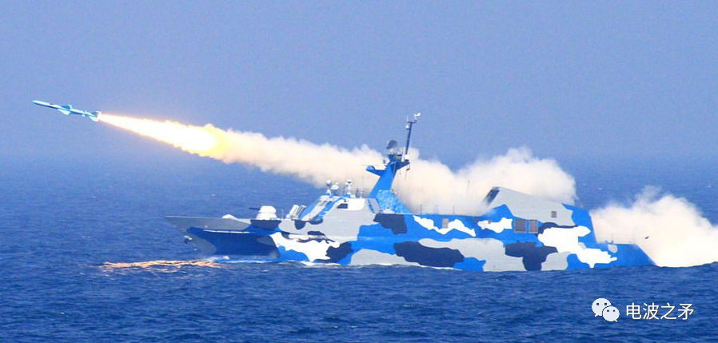
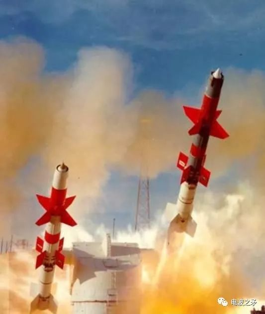
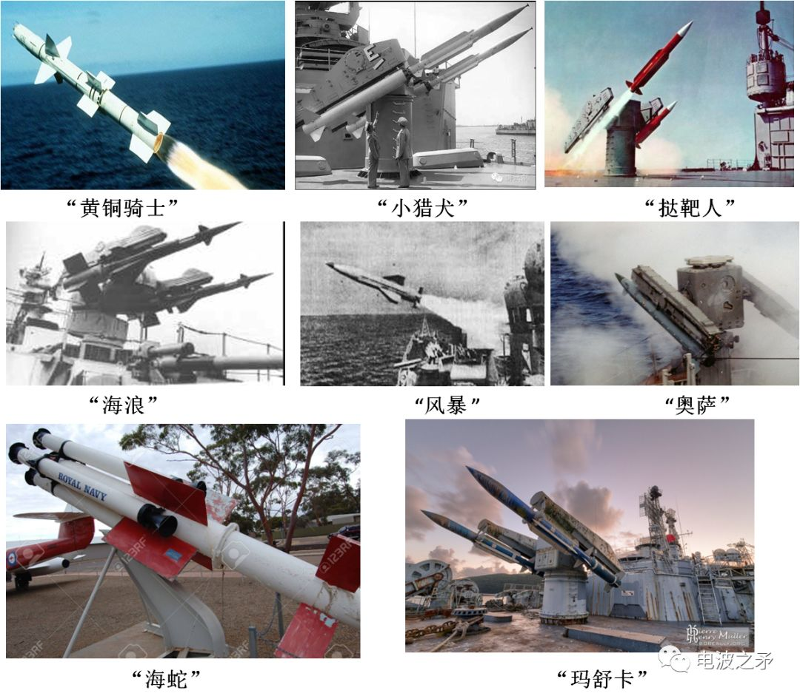
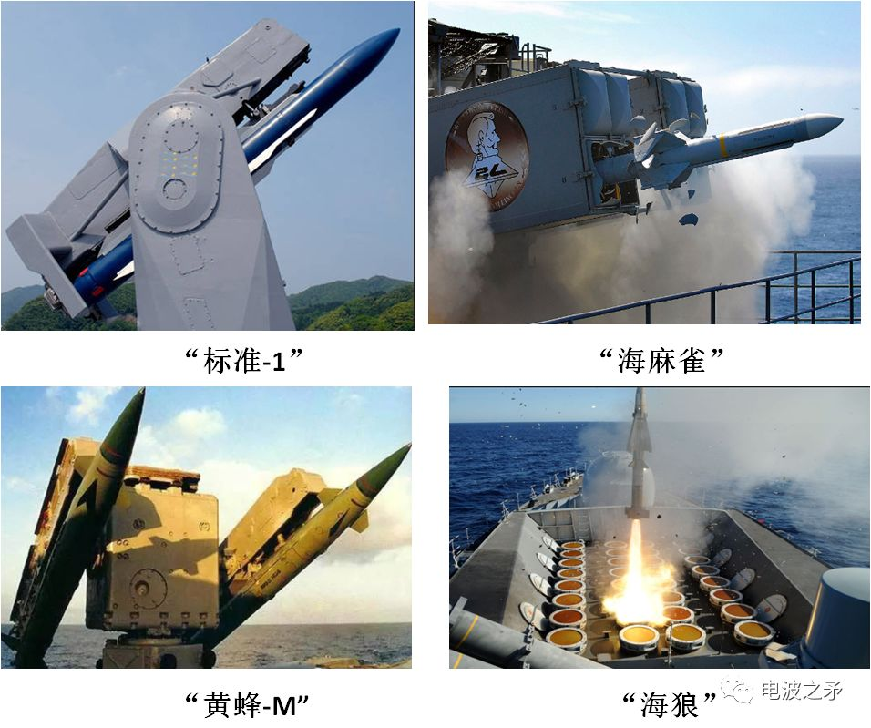
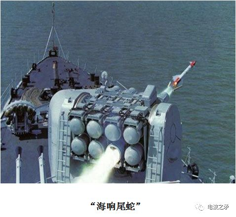
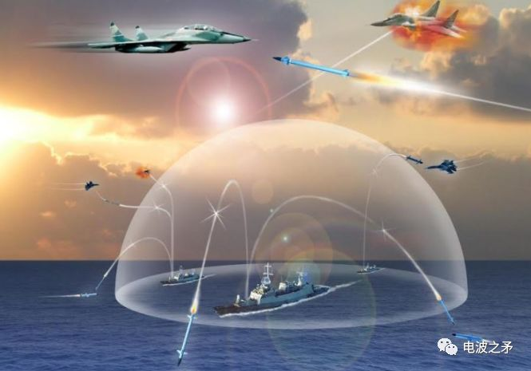
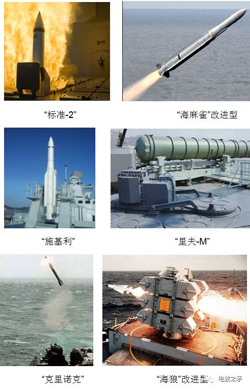
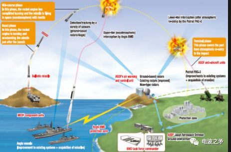
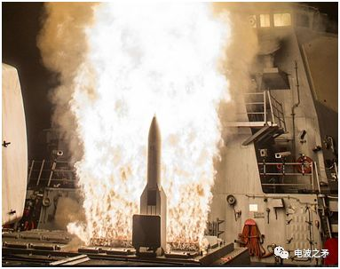
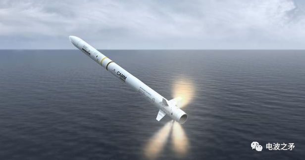

# 国外舰空导弹发展概况

     

# 国外舰空导弹发展概况

[元电子战](javascript:void(0);)

**元电子战** 

微信号 Cell-EW

功能介绍 聚焦电子战、电磁频谱战、态势感知、电子对抗、数据链、前沿技术信息分享！

_2022-05-14 16:00_ _发表于四川_

收录于合集

以下文章来源于电波之矛 ，作者电波之矛

 [!unknown_filename.3.jpeg(.__resources_国外舰空导弹发展概况.resources_unknown_filename.3.jpeg)___电波之矛__ .__旨在发布雷达和对抗行业的动态快讯、新技术、国外防务公司及产品介绍、行业学习资料推荐和分](#)

**来源** | 电波之矛

**号主** | 元电子战(Cell-EW)

**元圈** | 进“电子战微信群”,请加微信:mr-aesa,备注入群

**声明** | 本号聚焦相关知识分享，内容观点不代表本号立场，可追溯内容均注明来源，若存在版权等问题，请联系(微信:mr-aesa)删除.

舰空导弹是从舰艇发射攻击空中目标的导弹，亦称舰艇防空导弹。舰艇主要防空武器之一。与舰艇上的导弹射击控制系统、探测跟踪设备、水平稳定和发射装置等构成舰空导弹武器系统。舰艇主要防空武器。它与舰艇上的指挥控制、探测跟踪、水平稳定、发射系统等构成舰空导弹武器系统。舰空导弹自问世以来，主要经历了几个阶段的发展历程。

**第一阶段：20世纪50、60年代**

二次世界大战末期，美国海军为了对付日本“神风”特别攻击机的袭击，美国海军秘密进行一项“大黄蜂”计划，拟研制一种以超音速冲压发动机为动力的舰对空导弹系统。于1944年开始论证，1954年研制阶段结束，并先后在白沙靶场和舰上进行多次陆上和舰上发射试验，该计划的最初目的是发展使用冲压发动机的远程RIM-8“黄铜骑士”舰空导弹，但后来又发展出了中程RIM-2"小猎犬"和近程RIM-24“鞑靼人”,由于三者的首字母都是"T",所以美国海军第一代防空导弹有了所谓"3--T"导弹的称呼。

“黄铜骑士”导弹

第一代舰空导弹主要进行中低空、中近程层次的防御，并且兼具中高空、中远程防御能力。典型的第一代舰空导弹包括美国的“黄铜骑士”、“小猎犬”、“挞靶人”，前苏联的“海浪”,“风暴” ,“奥萨”，英国的“海蛇”和法国的“玛舒卡”等。

第一代舰空导弹最大的缺陷是体积质量大，反应时间长，制导体制单一，抗干扰性能差，低空性能差 ，可靠性低 ，作战空域有限和火力不足等。

**第二阶段  20世纪70、80年代**

20世纪50年代末，在军事需求的推动下，飞机机动性能、飞行速度和飞行高度性能有了显著提高，这使得其具备全天候低空突防的能力，，另一方面，飞机的RCS大大降低，并开始装备雷达干扰设备。在这些需求的推动下，形成了第二代舰空导弹。

第二代舰空导弹以美国的“标准-1”、“海麻雀”，前苏联的“黄蜂-M”，英国的“海狼”，法国的“海响尾蛇”等典型代表。

第二代舰空导弹的特点是：采用多种制导体制，导弹命中精度高，系统反应时间较短，低空性能好，具有一定的拦截多目标的能力，系统体积质量相对较小，可靠性高。

**第三阶段   20世纪80、90年代**

从20世纪70年代末开始，具有超低空飞行能力的各种反舰导弹已成为水面舰艇的主要威胁，空袭飞机和反舰导弹相结合，形成了多层次、多批次、多方向饱和攻击的空袭作战态势，因此，舰空导弹的作战任务不再只是拦截各类飞机，必须具备拦截反舰导弹的能力。在这些需求的推动下，形成了第三代舰空导弹。

第三代舰空导弹以美国的“标准-2”、“海麻雀”的改进型，前苏联的“里夫-M”、“施基利”、“克里诺克”，英国的“海狼”改进型等为典型代表。

第三代舰空导弹的主要特点是：具有全空域、多目标、多层次的拦截能力；反应时间短、精度高、低空性能好、可靠性高。

**第四阶段   21世纪以后**

进入21世纪后，海上空袭作战体系对抗特征凸显，呈现规模大、强度高、信息化和超视距的态势，对舰艇编队的攻击呈现出多方位、多梯度、多形式的饱和攻击，另外，濒海作战称为现代海战的主要作战模式。因此，舰空导弹必须具备防空打飞机、低空拦截巡航导弹、高空反弹道导弹、太空反卫星等“四位一体”作战能力和超视距协同反导作战能力。在这些需求的推动下，形成了第四代舰空导弹。

第四代舰空导弹以美国的“标准-6”和英国的“海上拦截者” 为主要代表。

“标准-6”

“海上拦截者” 

第四代舰空导弹的主要特点是：射程远、精度高和抗干扰能力强。

**－ The End －**

**版权声明**：欢迎转发本号原创内容，转载和摘编需经本号授权并标注原作者和信息来源为云脑智库。本公众号目前所载内容为本公众号原创、网络转载或根据非密公开性信息资料编辑整理，相关内容仅供参考及学习交流使用。由于部分文字、图片等来源于互联网，无法核实真实出处，如涉及相关争议，请跟我们联系(微信号：mr-aesa )删除。我们致力于保护作者知识产权或作品版权，本公众号所载内容的知识产权或作品版权归原作者所有。本公众号拥有对此声明的最终解释权。

**“阅读是一种习惯，分享是一种美德，我们是一群专业、有态度的知识传播者.”**

分享💬 点赞👍 在看❤️@以“三连”行动支持优质内容！ 

预览时标签不可点

收录于合集 #
 个
上一篇 下一篇

喜欢此内容的人还喜欢

首次亮相国庆阅兵的新型火箭炮，不仅能发射370毫米口径火箭弹，还能发射战术弹道导弹和反舰导弹

首次亮相国庆阅兵的新型火箭炮，不仅能发射370毫米口径火箭弹，还能发射战术弹道导弹和反舰导弹

...

兵工科技快讯

不喜欢

不看的原因
确定

* 内容质量低

* 不看此公众号

如何让导弹指哪儿打哪儿

如何让导弹指哪儿打哪儿

...

枢密院十号

不喜欢

不看的原因
确定

* 内容质量低

* 不看此公众号

航空百问：如何让导弹指哪儿打哪儿？

航空百问：如何让导弹指哪儿打哪儿？

...

中国试飞

不喜欢

不看的原因
确定

* 内容质量低

* 不看此公众号

**写留言**
取消

留言

**我的留言**

[写留言](javascript:;)

正在加载
展开我的留言
留言被精选后将公开

**精选留言**

[写留言](javascript:;)

[写留言](javascript:;)

正在加载

已无更多数据

[发消息](javascript:;)

关闭
**写留言**
提交更多

正在加载

[表情](javascript:;)

正在加载

关闭
**留言**
更多

正在加载

正在加载

返回
**写回复**
回复更多

正在加载

: 

[表情](javascript:;)

正在加载

微信扫一扫
关注该公众号

[知道了](javascript:;)

 微信扫一扫
使用小程序

[取消](javascript:void(0);) [允许](javascript:void(0);)

[取消](javascript:void(0);) [允许](javascript:void(0);)

 ： ， 。  视频 小程序 赞 ，轻点两下取消赞 在看 ，轻点两下取消在看
原文链接：<https://mp.weixin.qq.com/s/PIRwDO5IRqAqzhjmrbhPRg>
