# 国防军工行业发展研究报告

     

# 国防军工行业发展研究报告

原创 千际投行 [资产交易信息](javascript:void(0);)

**资产交易信息** 

微信号 zichanxinxiwang

功能介绍 上海千际咨询是领先的投资服务商，为机构投资者提供投资策略、指数、资产配置、智能投顾、风险管理等服务和工具。

_2021-05-01 10:10_

收录于话题

#千际咨询 226 个内容
#行业研究报告 173 个内容

**第一章 行业概况**
军工行业是国家安全的支柱，承担国防科研生产任务，为国家武装力量提供各种武器装备研制。目前中国军工行业的基本分类主要有六大类别，即：核工业、航空工业、航天工业、船舶工业、兵器工业、电子信息这六个大类别。军工板块主题色彩有所淡化，内生驱动特征开始显现。展望十四五规划，外部环境、军队发展目标、装备研制进度、产业链保障能力等因素都表明，军工行业将进入新的发展阶段，先进装备规模量产带动景气上行有望贯穿十四五，预计导弹、航空装备和国防信息化将是发展最快的领域。
图 军工行业产业链
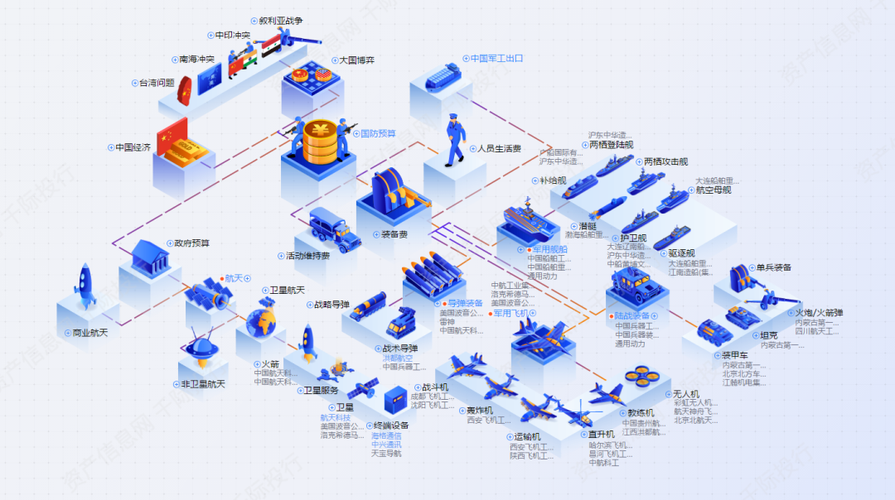
资料来源：资产信息网 千际投行
图 行业分析框架
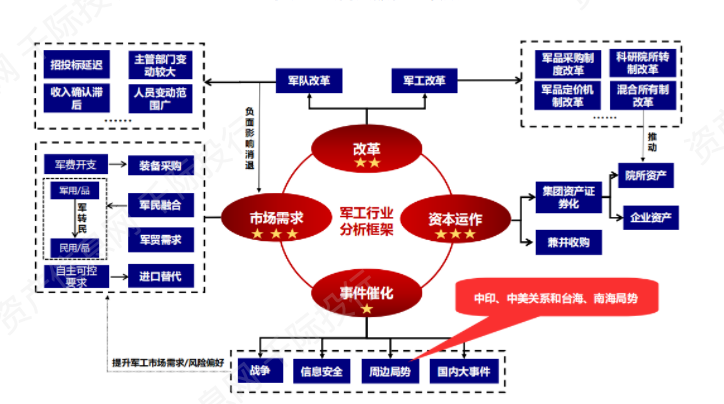
资料来源：资产信息网 千际投行
图 中国军事装备发展历程
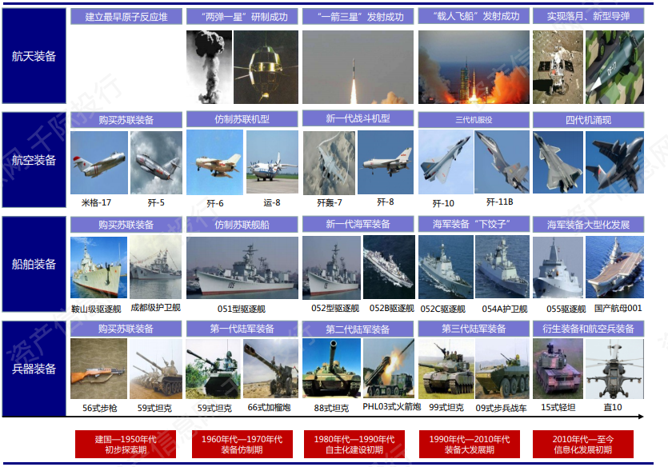
资料来源：资产信息网 千际投行
截止2021年4月23日，国防军工板块（CS）沪深成分股个数为89，在近几年中呈稳定趋势。企业总市值在近几年较为稳定，截止2021年4月27日，企业总市值为16226.0956亿元，企业员工总数达353356人。
图 员工总数、成分股个数及总市值合计
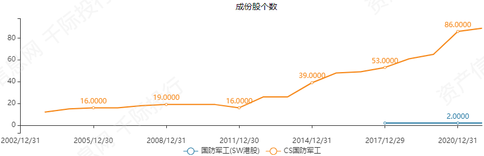
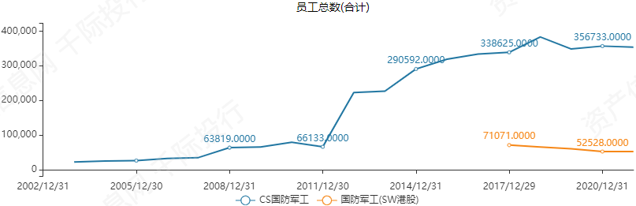
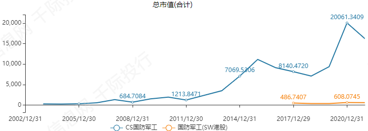
资料来源：资产信息网 千际投行 Wind
**第二章 商业模式和技术发展**
2.1 产业链价值链
图 军工产业链动态推演

资料来源：资产信息网 千际投行
2.1.1 航空产业链
新世纪战争形态发生变化，空中力量起主导作用，航空产业或将优先发展。四代机即将扶正，主力战机迭代加速。在多样化作战需求牵引、颠覆性科学技术推动以及经济投入的支撑下，世界主要军事强国正加快对空军武器装备的探索与发展，加大对现役装备的升级改进，推动以作战飞机、支援保障飞机、无人机、机载武器等为重点的现代化建设，使空军装备发展进入新的阶段。进入21 世纪以来，中国航空装备百花齐放，各类自主机型崭露头角，其中最具代表的就是以沈飞为代表的苏系衍生机型和以成飞为代表的自主机型。“十三五”期间是四代机的孕育期，而“十四五”期间将成为国产四代机的茁壮成长期。三代半和四代机“量价齐升”有望带动航空军机产业链景气度整体走高。
图 “十四五”期间主战机型展望与对比
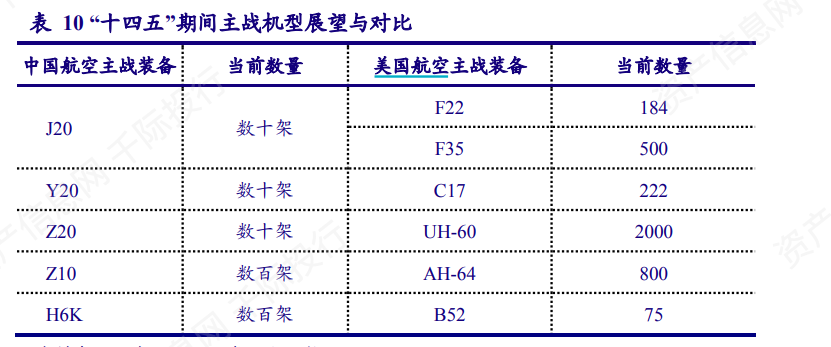
资料来源：资产信息网 千际投行
图 F-35战斗机产量计划表
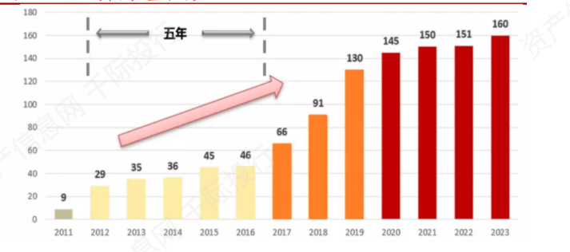
资料来源：资产信息网 千际投行
大飞机产业链包括设计、制造、总装集成、销售服务和 MRO 等环节，其中制造环节价值量最大，涉及领域最广，包括材料、零部件、分系统等。可以说，航空产业的发展将对电子工业、数控机床、锻造、冶金、复合材料、通用部件、仪器仪表等领域带来较大的需求拉动美国兰德公司报告称，首先，航空工业每投入 1 亿美元，10 年后航空及相关产业可产出 80 亿美元；其次，由飞机技术派生的衍生产品价值量是航空产品本身的 15 倍；再次，每 1 美元的研发经费投入将产生 34 美元的综合收益。由此可见，航空制造业对国民经济的发展具有较大的杠杆效应，意义远超飞机本身。未来随着大飞机逐步成熟并投入商业运营，产业链涉及相关企业将显著受益。
图 大飞机产业链
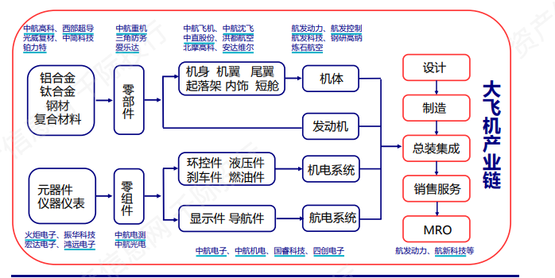
资料来源：资产信息网 千际投行
中美战机总量及先进战机数量均存在差距，促使中国不断加强新机型研制。中国与美国相比，作战飞机在总量以及先进飞机数量上存在较大差距；其中中国与美国作战飞机总量与歼击机数量差距明显；中国三代、四代战机占总量比例极低，与美国相比存在结构劣势。
图 中美战机数量对比
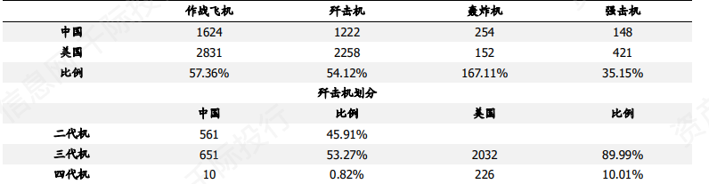
资料来源：资产信息网 千际投行
军用飞机产业链：上游：航空工业集团下属院所。军机研发机构分总体研究所和关键技术所，主要有 第一飞机设计研究院（轰炸机、运输机），沈飞设计研究所（战斗机），成飞设计研究所 （四代战斗机），南昌飞机设计研究所（教练机），直升机设计研究所（直升机），特种飞 行器研究所（特种机）。中游：航空核心产业链，上市公司集中地。飞机制造产业链中游又可以分为航空材 料、航空设备和总装三个板块，辅助相关部件装载装配。下游：飞机运营和维护。
图 军用飞机产业链总览
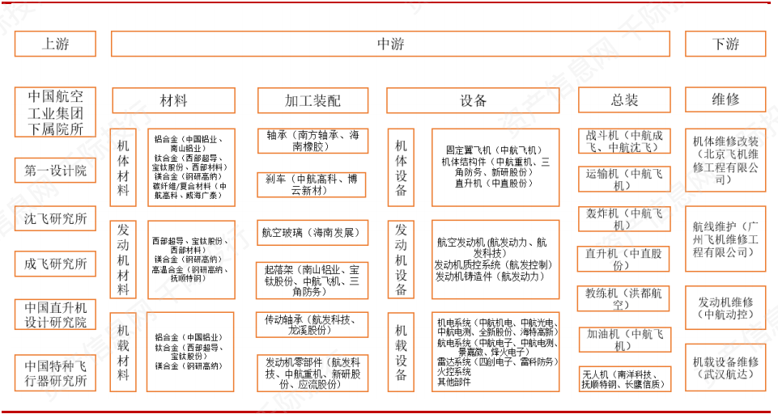
资料来源：资产信息网 千际投行
图 军机产业链上市公司产品销售情况
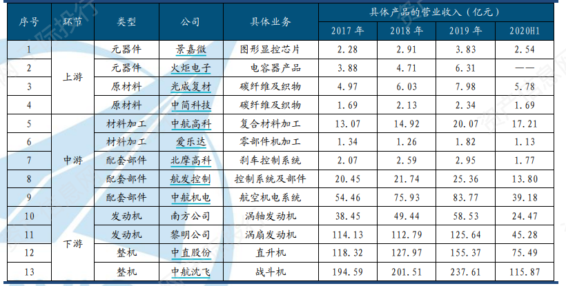
资料来源：资产信息网 千际投行 中航证券
图 航空装备发展方向
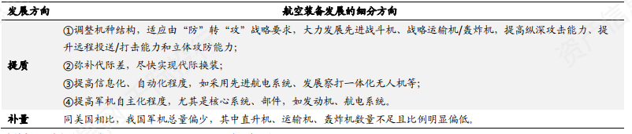
资料来源：资产信息网 千际投行
2.1.2 无人机产业链
无人机系统可按大小、用途、性能特点等不同方式进行分类。按大小可分为大型、中 型和微小型；按用途可分为民用无人机与军用无人机，其中民用无人机又可分为工业无人机和 消费无人机。消费级无人机在航拍、娱乐方面有较多的应用，而工业无人机则在农业、物流、安防等领域有较多应用。
图 无人机系统分类
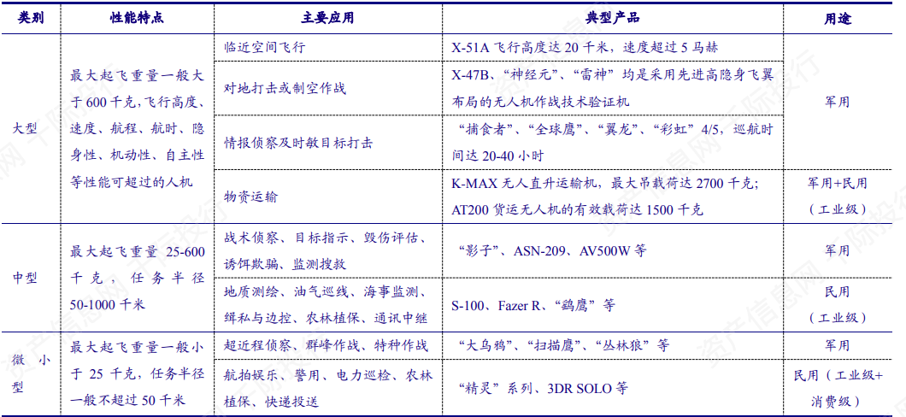
资料来源：资产信息网 千际投行
在所有类型无人机中，军用无人机价值量的占比最高。
图 军用无人机分类
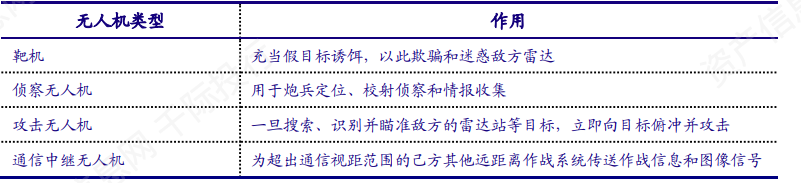
资料来源：资产信息网 千际投行
从产业链角度看，目前全球军民用无人机产业链相对独立，民用无人机以旋翼和小型居多， 而军用无人机则以固定翼和大型为主。民用无人机产业链上游涉及众多高科技领域，包括电池、 电机、飞行控制系统、云台等部件制造和系统开发，中游涵盖总体设计与整机组装，下游主要各环节制造商也纷纷涌现，其中大疆创新已经成长为最大的消费级无人机 生产制造商。
全球无人机市场规模与中国无人机市场规模对比：国内无人机市场后来居上，规模不断扩大，军贸和国内需求激增，国内军用无人机供应商将显著受益。
图 全球无人机市场规模
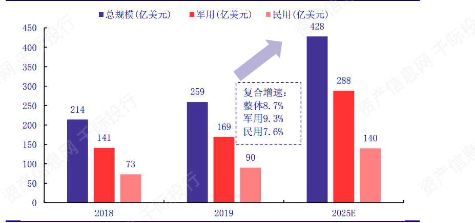
资料来源：资产信息网 千际投行
图 中国无人机市场规模
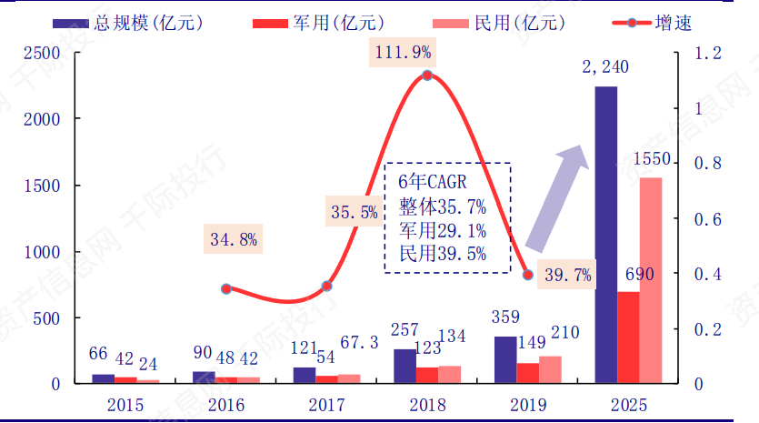
资料来源：资产信息网 千际投行
图 民用无人机产业链
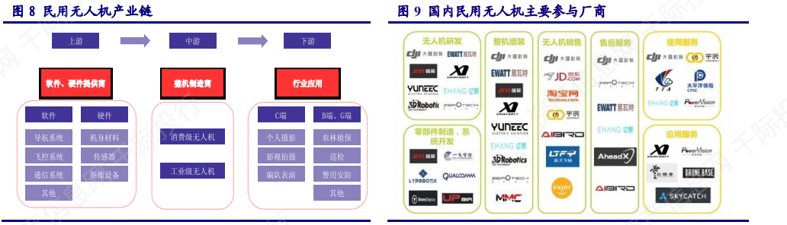
资料来源：资产信息网 千际投行
图 军用无人机产业链
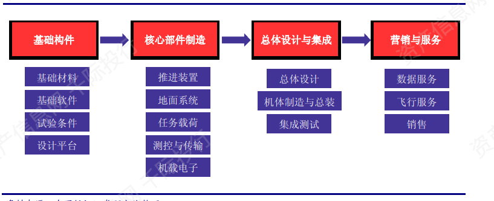
资料来源：资产信息网 千际投行
2.1.3 导弹产业链
国内外需求增长逻辑明确，导弹作为一种飞行器，它携带战斗部，依靠自身动力装置推进，由制导系统导引控制飞行航迹，导向目标并摧毁目标。导弹通常由战斗部、控制系统、发动机装置和弹体等组成。导弹摧毁目标的有效载荷是战斗部（或弹头），可为核装药、常规装药、化学战剂、生物战剂，或者使用电磁脉冲战斗部。其中，装普通装药的称常规导弹；装核装药的称核导弹。导弹武器突出的性能特点是射程远、精度高、威力大、突防能力。
导弹上中下游产业链分别为：上游主要为工程研制，基本由军工集团所属相关企事业单位参与实施；中游主要以导弹研制定型后批量生产为主；下游主要为导弹交付军队后的装备保障。其中下游核心导弹武器仍以军工央企为绝对主力，中游分包商及上游原材料供应商是民参军企业介入较多的赛道。
图 导弹产业链及参与上市公司
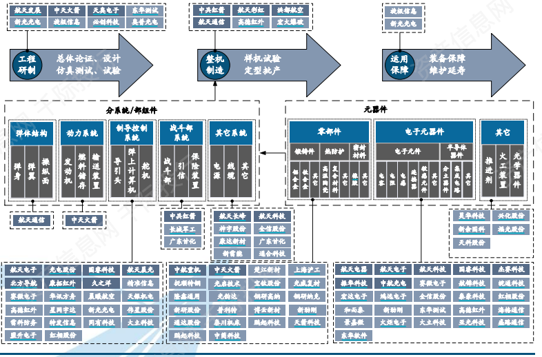
资料来源：中航证券
图 典型导弹成本构成
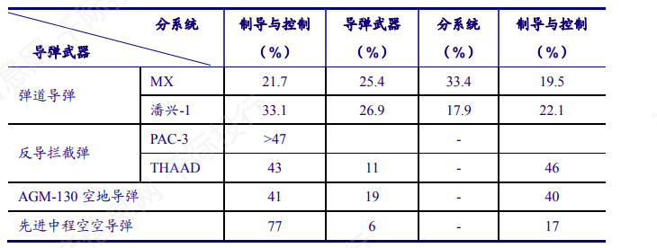
资料来源：资产信息网 千际投行
无论从内需还是出口来看，导弹装备都将保持稳定且快速的增长，该增长也将传导至导弹产业链的中上游领域，兑现至相关企业业绩。
图 国际军贸及导弹贸易趋势整体增长
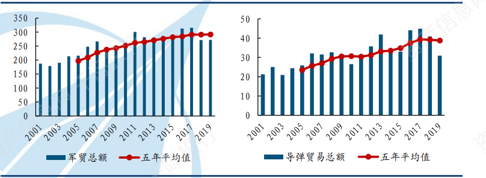
资料来源：中航证券
图 导弹在各阶段各分系统市场情况
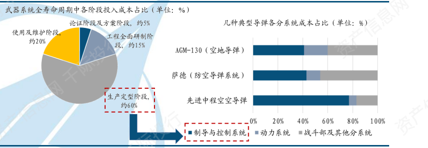
资料来源：中航证券
2.1.4 卫星互联网产业链
卫星互联网是继有限互联、无线互联之后的第三代互联网基础设施革命，依托的是低轨卫星星座项目，直接影响国家战略安全。按照卫星轨道高度的不同，通信卫星可以分为低轨通信卫星（LEO）、中轨通信卫星（MEO）和高轨地球同步通信卫星（GEO），其中低轨卫星正在迎来蓬勃发展。低轨卫星迎投资风口，千亿低轨卫星市场空间待挖掘，通信卫星产业链将显著受益，卫星组网领域：通信卫星产业链中，卫星组网包括卫星制造与卫星发射两部分，将是全产业链最先受益的部分。
图 当前国际主要卫星互联网计划
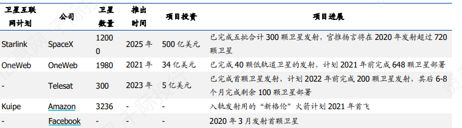
资料来源：资产信息网 千际投行
图 中国卫星产业链
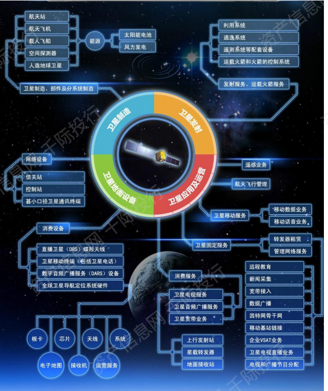
资料来源：资产信息网 千际投行
近年来卫星导航与位置服务产业市场规模不断扩大，自从GPS正式向世界开放以来，卫星导航定位行业逐步形成了完整的产业链。
图 全球卫星导航系统产业链
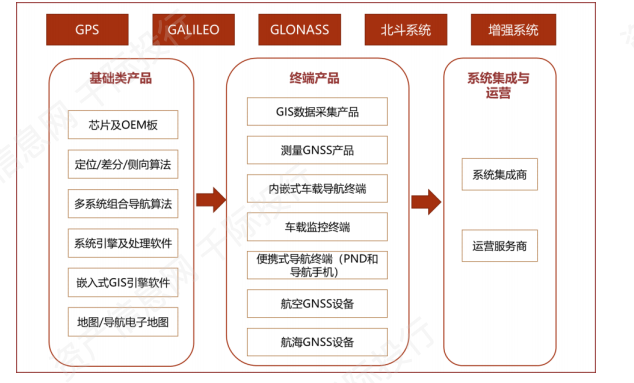
资料来源：资产信息网 千际投行
根据 SIA 发布的数据，2019 年全球卫星产业规模为 2860 亿美元，同比增长 3.1%。从细
分结构来看，卫星服务业和地面设备制造业价值占比最大，约为 90.7%，卫星制造和发射合计占比约 9.3%。我们预计未来 5 年国内卫星组网（卫星制造+发射）投入约 620 亿元，可以撬动国内卫星产业增量规模约 6700 亿。2020 年 4 月 20 日，国家发改委首次明确将卫星互联网纳入新基建范畴，我们认为，随着牵头机构的明确，国内卫星互联网“十四五”期间有望迎来蓬勃发展期。
图 互联网系统分类及构成

资料来源：中航证券
图 卫星组网航天系相关上市公司
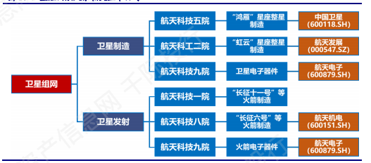
资料来源：资产信息网 千际投行
图 有轨卫星
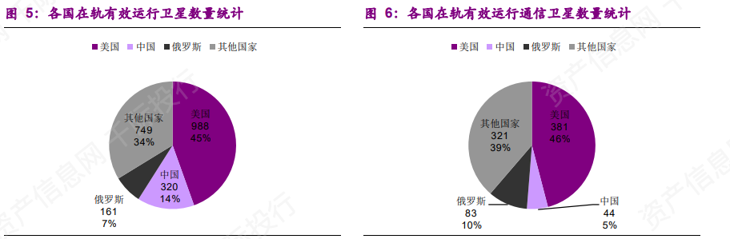
资料来源：资产信息网 千际投行
图 北斗产业部署
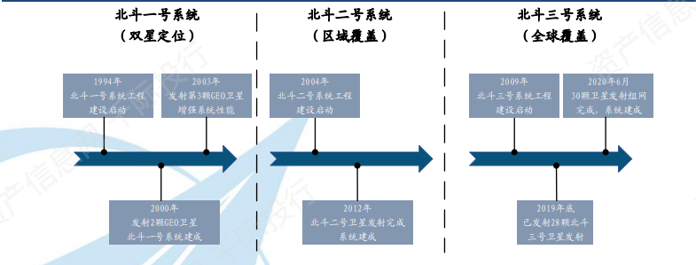
资料来源：中航证券
图 北斗导航产业链
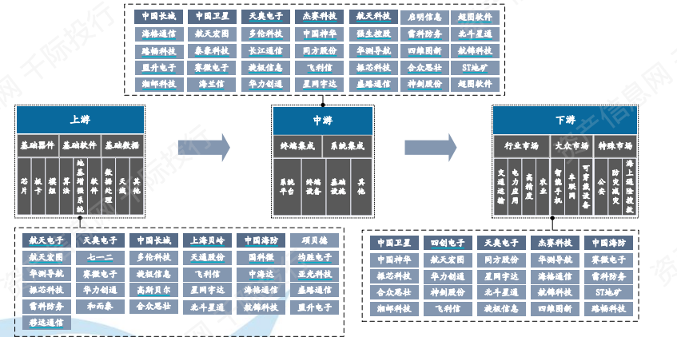
资料来源：中航证券
综上随着 2020 年北斗系统服务范围覆盖全球，2035 年建设完善更加泛在、融合、智能的综合时空体系，北斗产业将迎来由技术融合创新和产业融合发展共同带来的升级变革。未来，北斗高精度定位、导航、授时（PNT）技术创新及应用是未来发展热点。北斗与物联网技术、云计算、5G 等技术融合成为行业信息化的支撑技术，也是北斗产业发展的推动力。中国的北斗行业也在迅速发展中，有非常大的发展空间。且预估到2025年，中国卫星导航与位置服务产业总市场规模可达到5480.80亿元。
2.1.5 新材料产业链
装备数量和材料用量双提升，行业有望快速发展。飞机设计领域有“一代飞机，一代材料”的说法，先进材料的应用水平和应用量已成为衡量飞机项进行的重要指标，对飞机重量的改善和性能的提高有极其重要的影响。作为轻质结构材料,我们看好复合材料和钛合金的发展潜力。
图 复合材料用量
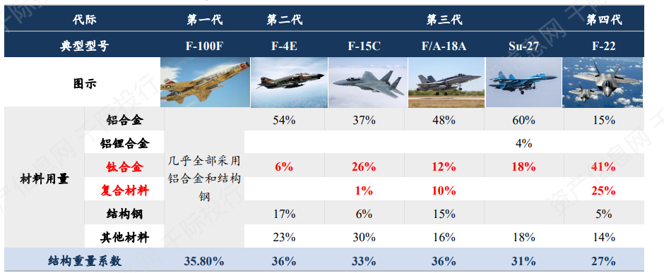
资料来源：资产信息网 千际投行
碳纤维作为复合材料中的增强纤维，用于制造各类终端产品中的结构件，下游市场包括航空航天、风电、体育休闲、交通等领域。碳纤维复合材料属于技术密集型产品，生产过程对工艺和装备的要求极高，在从原丝-碳纤维-中间产品-复合材料—终端产品的各个环节中，每经过一次 加工其价值量都会成倍的增长。
图 碳纤维复合材料产业链
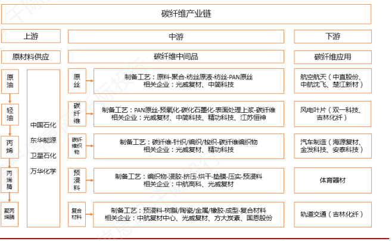
资料来源：资产信息网 千际投行
图 碳纤维全球公司价值链
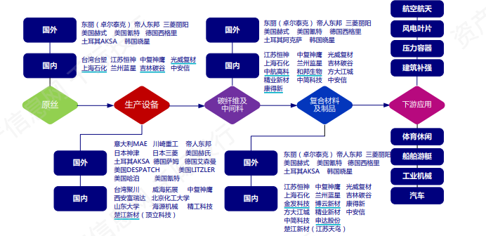
资料来源：资产信息网 千际投行
风电、航空航天是主要应用领域。航空航天市场销售额占半壁江山。国内碳纤维市场需求强劲，国产替代空间巨大。国内碳纤维产能利用率不高，未来提升空间较大。2014 年中国碳纤维制造企业已经拥有 1.5 万吨的产能，2016 年提升到了 1.8 万吨，但实际产量却还不到产能的三分之一。究其原因， 一方面是由于缺少技术积累，国产碳纤维技术含量较低、质量较差，成为了中国碳纤维销路的 一大阻碍；另一方面，居高不下的生产成本也成为国内企业与国外企业竞争中的一大劣势。我们认为未来随着碳纤维技术的逐步成熟以及规模化生产对成本的稀释，国内碳纤维产能 利用率有望逐步走高，生产企业的盈利能力也将大幅跃升。
图 2008-2030年全球碳纤维需求量

资料来源：资产信息网 千际投行
图 2019 年全球各行业碳纤维需求量 （单位：万吨）
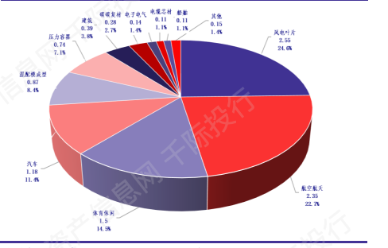
资料来源：资产信息网 千际投行
图 中国碳纤维需求总量
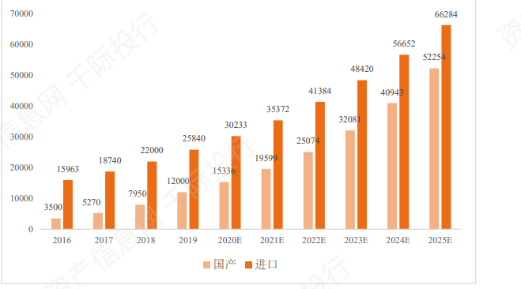
资料来源：资产信息网 千际投行
图 碳纤维 主要生产地区
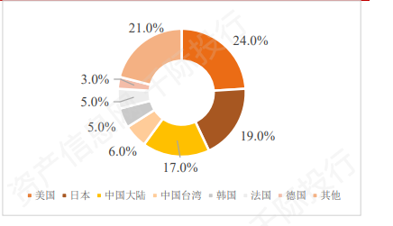
资料来源：资产信息网 千际投行
碳纤维市场预测：军工领域有望放量增长，国产大飞机带动民用发展。2019 年中 国碳纤维总需求量 37840 吨，同比增长 22%，远超全球平均水平（12%左右），市场整体 呈现快速向上，供不应求的局面。其中进口碳纤维 25840 吨，占总需求 68%，同比增长 17.5%；国产碳纤维 12000 吨，占总需求 31.7%，同比增长 33%，国产化替代呈现加速 扩张趋势。未来随着核心技术的突破及关键设备的自产，我们有信心期待国产碳纤维迎 来爆发式增长，对标国际先进水平，在军用航空领域实现高质量突破，在民用航空领域 实现高性价比配装。
2.1.6 商业模式
表 以国防动力为例分析主营结构
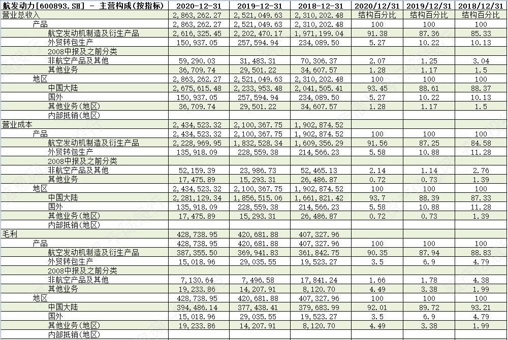
资料来源：资产信息网 千际投行 Wind
2.2 技术发展
对国内国防军工行业的各个专利申请人的专利数量进行统计，排名前十的国防军工公司依次为：中航光电、航发动力、四创电子、航天电器、海格通信、内蒙一机、亚光科技、江龙船艇、中船应急、航天动力等。
表 国内专利排名前十国防军工公司
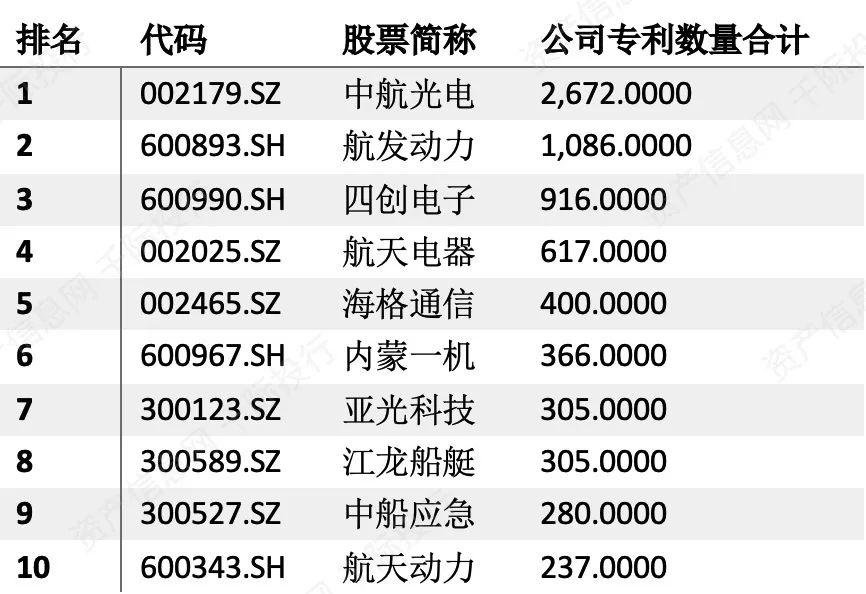
资料来源：资产信息网 千际投行 同花顺iFind
军工电子叠加行业增长、国产替代与信息化率提升的三重成长逻辑，在新一轮科技革命和产业变革推动下，人工智能、量子信息、大数据、云计算、物联网等前沿科技加速应用于军事领域。卫星通讯中，中国地面设备包括卫星地面接收站、移动卫星终端等，预计在低轨卫星通信建设初期，将类似 3GPP 提出的框架结构，即大部分移动终端设备利用地面网络，通过卫星信号地面接收站实现全球通信服务，小部分海上、偏远地区使用移动卫星终端直接与卫星实现通信，这部分用户采用类似目前天通卫星、天通手机的直连模式，华力创通、中兴通讯都已经开发了天通手机，具有前期优势，后期随着这部分市场的逐步壮大，其他厂商也将加入移动卫星终端的竞争中。
同时电容器是三大电子被动元器件之一 ,是电子线路中不可缺少的基础元件，约占全部电子元件用量的 40%，产值的 66%。电容器可分为陶瓷电容器、铝电解电容器、钽电解电容器、薄膜电容器等。军用以陶瓷电容和钽电容为主，其中，MLCC 占据陶瓷电容市场的绝大多数份额，主要面向低容量市场。在高容量电容方面，钽电容优势更加明显。
图 电子信息装备用途
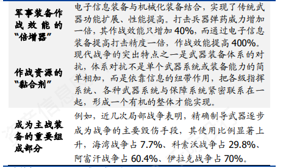
资料来源：资产信息网 千际投行
图 中国高端核心芯片市场占有率
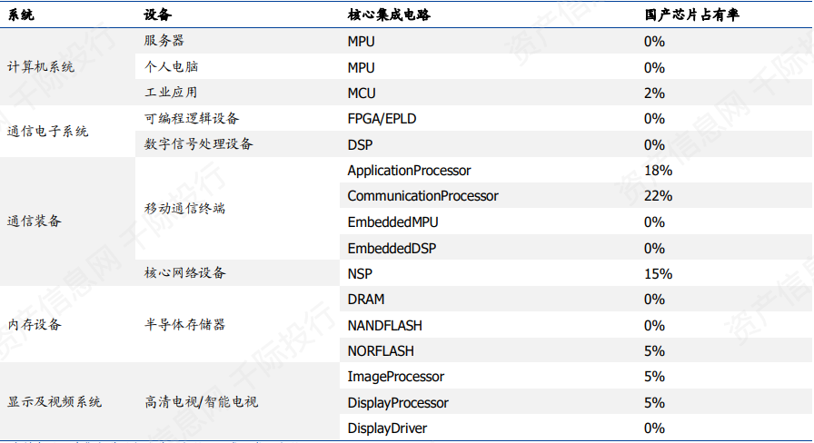
资料来源：资产信息网 千际投行
图 中国及国外低轨通信卫星系统对比
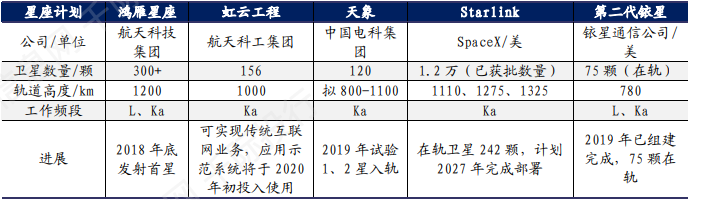
资料来源：资产信息网 千际投行
IGBT芯片：中国军用市场被国外企业完全垄断，发展国产化IGBT芯片，打破国际技术封锁，是保障国家基础战略产业发展的需要。
图 中国IGBT市场规模
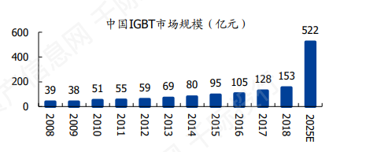
资料来源：资产信息网 千际投行
FPGA芯片：5G基础建设和AI持续发展将迅速提升全球FPGA市场容量，国内厂商还将受益于国产替代进程。
图 FPGA市场规模
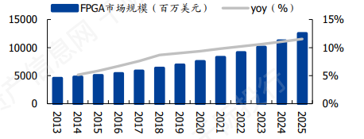
资料来源：资产信息网 千际投行
中国北斗导航技术不断发展，北斗三号采用了导航卫星专用平台，具有功率密度大、载荷承载比重高、设备产品布局灵活、功能拓展适应能力强等技术特点。同时北斗三号采用了新型导航信号体制，进一步改善了卫星信号的性能。
图 北斗导航系统技术特点
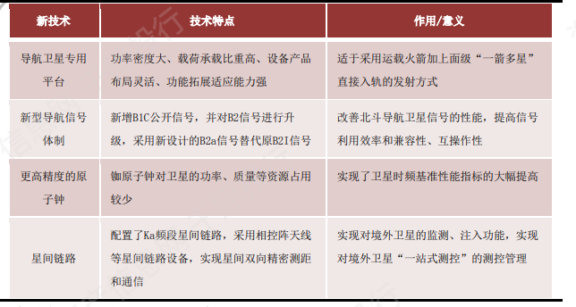
资料来源：资产信息网 千际投行
图 中国国产大飞机C919研制进程
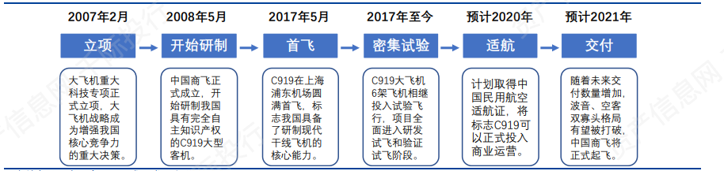
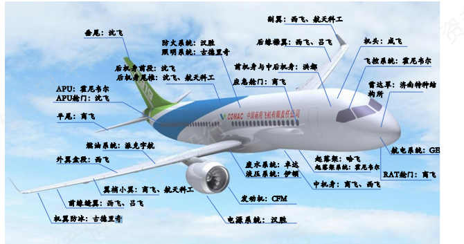
资料来源：资产信息网 千际投行
高温合金是先进航空发动机的基石，决定发动机性能的关键材料。
图 高温合金按工艺分类
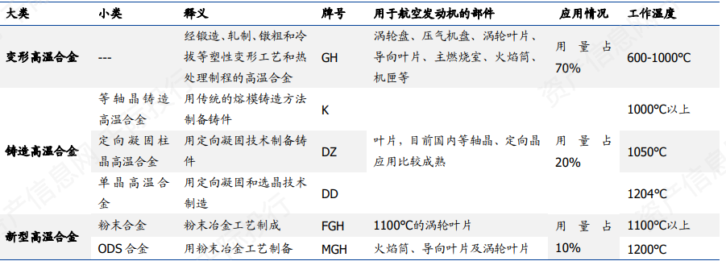
资料来源：资产信息网 千际投行
2.3 政策和监管
2.3.1 行业主管部门
中共中央、国务院、中央军委。
航空装备及导弹政策：新型主战装备进入批产期。70 周年国庆阅兵中首次公开亮相了包括 15 式轻坦、直-20、东风-17 常规导弹、东风-41 洲际导弹在内的多款新型主战装备，表明中国新型主战装备已经开始进入批产阶段，后续采购列装将快速推进。“十四五”武器装备采购有望大幅提升。随着地缘局势紧张，亟需进行战略储备，根据我们在产业链中的调研，“十四五”期间武器装备采购有望大幅提升，尤其是具备消耗品属性的导弹。军费稳定增长、装备费占比提升。2020年，国防军费预算 1.27 万亿元，受疫情影响增速略微下滑，为 6.6%，仍然符合预期。《新时代的中国国防》白皮书中披露，2017 年中国装备费占军费的比重为 41.1%，近年来该比例不断提升，表明武器装备采购力度逐步增长。
图 中国国防及武器装备信息化建设的规划
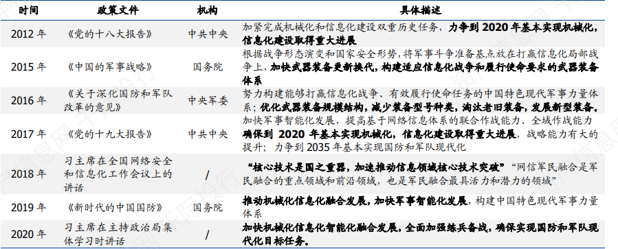
资料来源：资产信息网 千际投行
图 北斗卫星导航产业相关政策
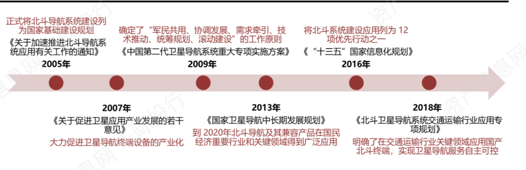
资料来源：资产信息网 千际投行
图 无人机相关政策
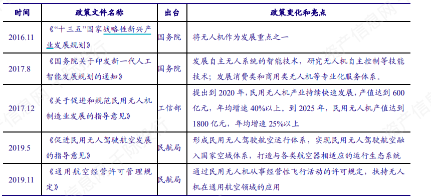
资料来源：资产信息网 千际投行
**第三章 行业估值、定价机制和全球龙头企业**
3.1 行业综合财务分析和估值方法
图 行业综合财务分析
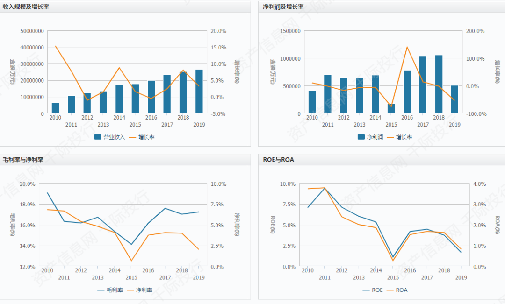
资料来源：资产信息网 千际投行
图 行业表现和行业估值
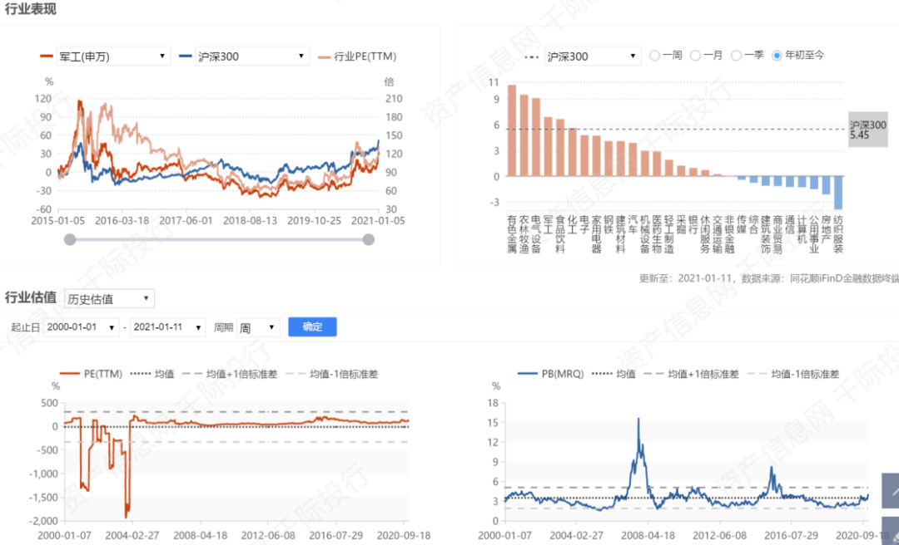
资料来源：资产信息网 千际投行
图 指数PE/PB
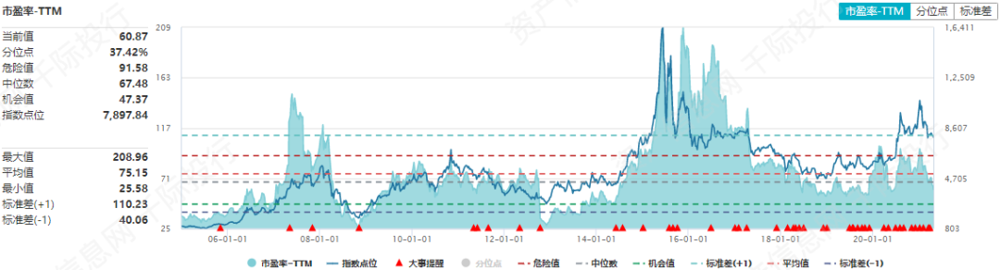
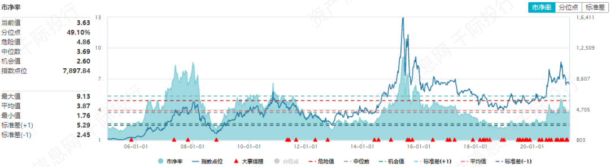
资料来源：资产信息网 千际投行Wind数据整理
图 指数市场表现
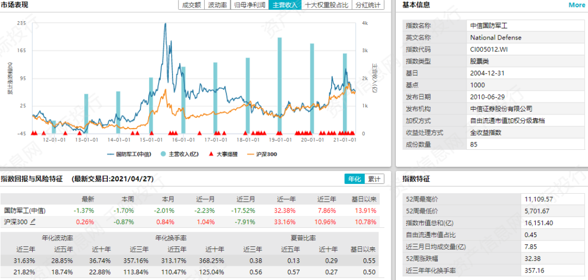
资料来源：资产信息网 千际投行Wind数据整理
图 指数趋势比较
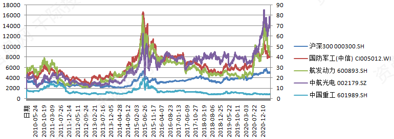
资料来源：资产信息网 千际投行Wind数据整理
军工指数自2015年长期跑输大盘，但是近些年有追赶趋势，长期PE都享受高估值，PB则相对围绕2倍波动。
军工行业估值方法可以选择市盈率估值法、PEG估值法、市净率估值法、市现率、P/S市销率估值法、EV/Sales市售率估值法、RNAV重估净资产估值法、EV/EBITDA估值法、DDM估值法、DCF现金流折现估值法、NAV净资产价值估值法等。
表 以波音为例分析主营结构
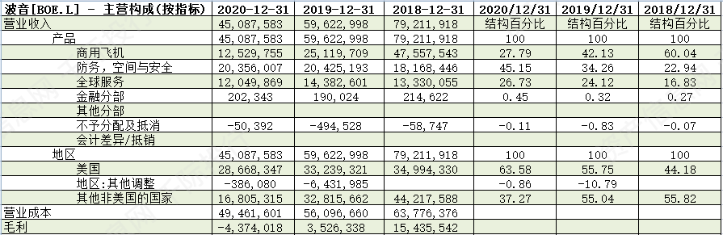
资料来源：资产信息网 千际投行 Wind 数据整理
表 境外国防军工公司估值对比
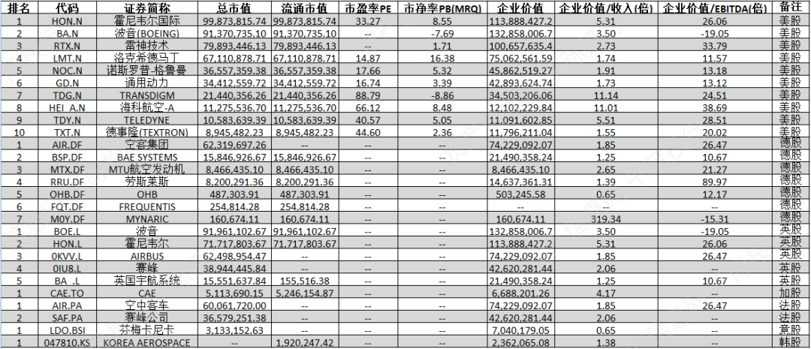
资料来源：资产信息网 千际投行 Wind 数据整理
表 中国上市国防军工公司估值对比
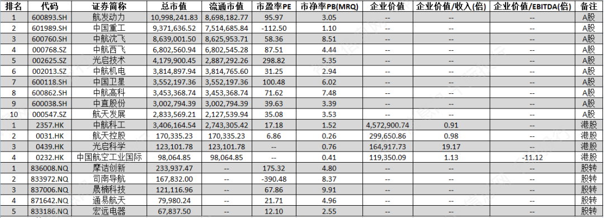
资料来源：资产信息网 千际投行 Wind 数据整理
3.2 发展和价格驱动机制
3.2.1产业发展及特点和相关壁垒
行业进入壁垒高、军工央企绝对垄断。技术研发周期长，前期投入成本巨大。投资回报利润高，一旦形成长期垄断，将有技术壁垒、资质壁垒、客户认可壁垒、资金壁垒。
有利因素：（1）国家产业政策的支持（2）国防建设的需求拉动（3）“军民融合”上升为国家战略（4）行业竞争程度较低。
不利因素：（1）国防高端装备的设计制造与发达国家仍有差距，技术水平有待提高（2）军事航空领域产能不足，民用航空发展较慢。
3.2.2 价格驱动机制
国防军工企业要顺应国家武器投入方向，如以下图所示：
图 军费投入项目分解

军工行业需求侧变化：
(1) 练兵备战的紧迫性：实战化训练导致耗损增加，备战带来武器装备快速提质补量；
(2) 军改结束后增长的恢复性：改革接近尾声，需求补偿增长；
(3) 信息化、现代化、智能化的必要性：军工行业借助“三化”，将迅速弥补代际差，在部分领域实现反超甚至领跑；
(4) 自主可控的必然性：军工行业具有天然的自主可控属性，当前局势倒逼自主可控提速。
图 十三五军改基本完成
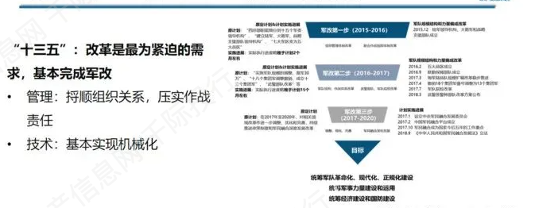
资料来源：资产信息网 千际投行
图 十四五备战
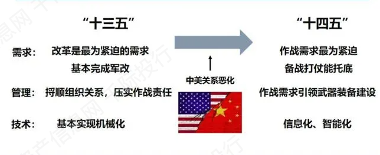
资料来源：资产信息网 千际投行
图 北斗导航完成
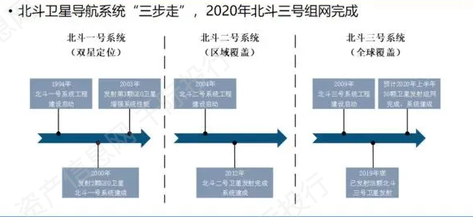
资料来源：资产信息网 千际投行
图 发展史
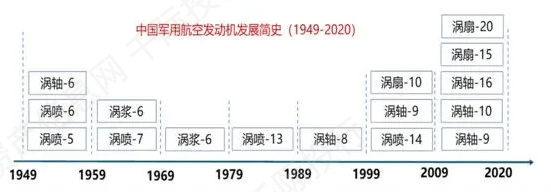
资料来源：资产信息网 千际投行
图 练兵备战
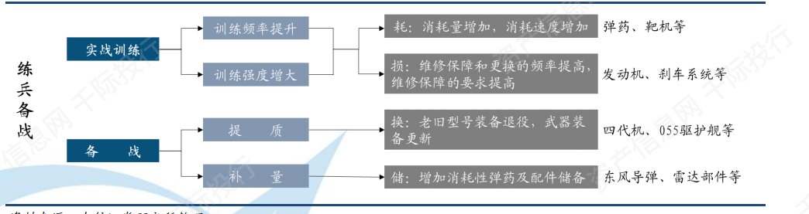
资料来源：中航证券
图 装备费增速高于军费及国民生产总值增速
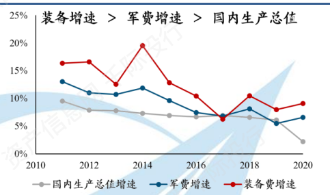
资料来源：中航证券
军工行业供给侧变化：
(1) 供给主体：军工国企通过深化改革实现高质量发展；民参军企业困境已过，成长天花板大幅抬升，并因其规模的低基数，表现出更大的业绩弹性；
(2) 供应链：加强供应链的安全性和完善性，加快突破核心技术和关键环节的“卡脖子”短板问题,确保产业安全和战略主动；
(3) 产能：当前处于产能扩张早期，预计民企扩张意愿更强、扩张速度更快，成为行业快速扩产的重要力量，国企将在关重件业务上承担主要角色；
(4) 资金支持：军费中的装备费持续支持；一级市场和二级市场有效补充。
图 军工央企改革四大维度的内涵
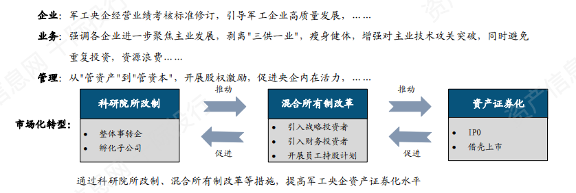
资料来源：资产信息网 千际投行
图 十大军工央企资产证券化率
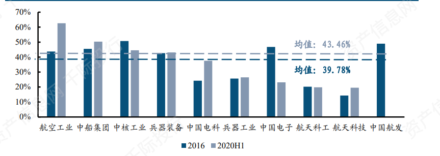
资料来源：资产信息网 千际投行
随着自主可控的推进，海外向国内转移、聚焦主业；国企向民营转移、军队停止有偿服务。
事件驱动
图 新闻指数
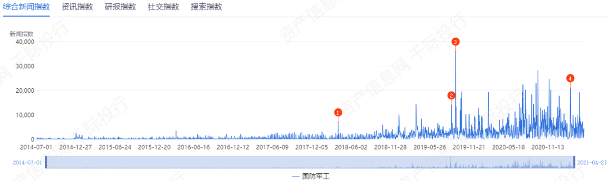
资料来源：资产信息网 千际投行 同花顺iFind
3.2.3 行业风险分析和风险管理
表 常见行业风险因子

资料来源：资产信息网 千际投行
其中本行业常见的风险如下：
(1) 质量控制风险
国防军工产品生产工艺复杂、质量要求严格，质量控制涵盖研发、生产、检测、交付及使用全过程。
应对措施：按相关产品质量标准建立了质量管理体系，并将持续加强业务管理，确保质量管理体系有效运行，但仍存在影响产品质量的因素，可能导致产品不符合质量要求，进而对生产经营带来潜在质量风险。
(2) 技术创新风险
国防军工产品型号研发涉及较多的新技术、新产品、新工艺，基于技术难度、技术壁垒及成熟度等原因，存在达不到预定任务目标、预期性能指标以及研制费用超支、研制周期拖延等风险。
(3) 客户订单风险
国防军工产品主要为满足我国国防战略的需要，受国家国防政策及军事装备采购投入的影响较大。若未来我国在国防装备方面的预算减少导致需求下降，可能对行业的经营业绩产生不利影响。
(4) 人才队伍建设方面
随着行业科研生产任务的转型升级，非核心业务转移等工作的深入推进，需进一步优化人力资源配置，提升人才队伍整体能力水平。
应对措施：逐步完善人才培养机制，人才引进方式多元化，建立满足科研生产任务需要的人才队伍。
3.3 竞争分析
中美军事力量对比悬殊，美国处于绝对优势地位。总体数量上，中国军机总数量为美国的 24.2%；2019年，美国军机数量13276架，世界占比25%，总价值超9万亿美元；中国军机虽近五年均保持近2%的增速，但截至2019年底数量仅世界占比 5.9%，总价值近千亿美元。
图 中国军机增长趋势
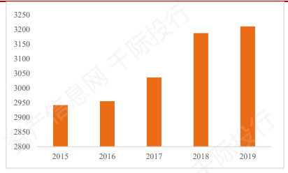
资料来源：资产信息网 千际投行
图 中美军机总数对比
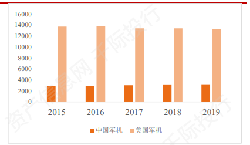
资料来源：资产信息网 千际投行
军机类型：战斗机、直升机最多，总体增量空间大，中美军机配比不同，中国战斗机过半，美国直升机最多。
图 美国和中国各类军用飞机占比
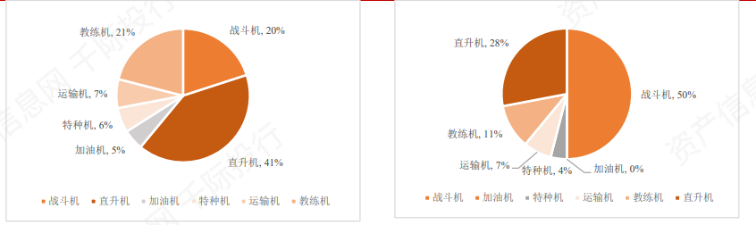
资料来源：资产信息网 千际投行
战斗机：空军王牌，总体存在代差。战斗机包括歼击机、轰炸机、强击机和侦察机，美军战斗机总量 2657 架，占美军飞机总量的 20%；我军战斗机占总量的 50%，战斗机数量为美军战斗机数量的 60%。美军四代机代表为 F22 和 F35，我军四代机 J-20 于 2017 年服役，同属于四代战斗机，但在总体数量、设备水平、实战经验上，与 F22 还有着显著的区别。
图 中美战斗机数量及性能对比
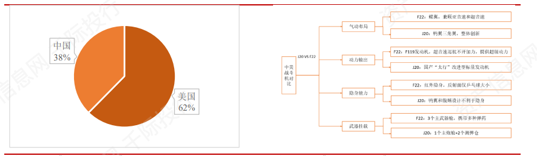
资料来源：资产信息网 千际投行
图 中美特种飞机数目对比及型号
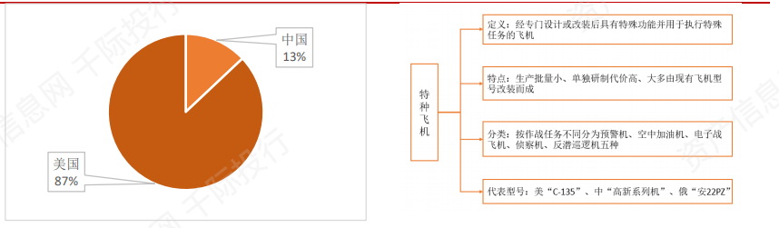
资料来源：资产信息网 千际投行
综上，我军总装备少，各机型发展不均；美军机型齐数量多，与我军存在代差。我军战斗机数量占比最大，符合国防火力基本需求；美军由于国土地形特点及海外军事和基地需求，直升机数目最多。目前我军总体水平还与美军有着明显代差，随着技术进一步发展及国家大力支持投入，未来军用飞机将成为军工产业增长的领头羊。
3.4 中国企业排名
表 国防军工指数成分股排名
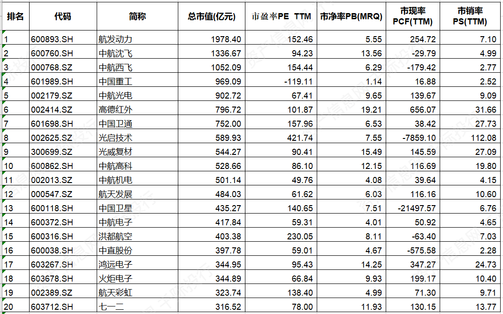
资料来源：资产信息网 千际投行
(1) 航发动力\[600893.SH\]是国内大型航空发动机制造基地企业，国内唯一的生产制造涡喷、涡扇、涡轴、涡桨、活塞全种类军用航空发动机的企业。公司主要业务分为三类：航空发动机及衍生产品、外贸出口转包业务、非航空产品及其他业务。主要产品和服务有军民用航空发动机整机及部件、民用航空发动机零部件出口、军民用燃气轮机、军民用航空发动机维修保障服务。目前已具备涵盖航空发动机全寿命周期的设计、制造、总装、试车、维修整套技术和发动机综合服务保障能力，综合技术水平国内领先。

(2) 中航沈飞\[600760.SH\]原是原国家机械局定点生产低速货车的骨干企业，主营“黑豹”牌四轮低速货车、微型汽车、轻型载货汽车、轿卡车、电动车、工程自卸车、矿泉水等系列产品。2017年通过重大资产重组，公司置出原有资产和负债，并置入沈飞集团100%股权。沈飞集团主要从事航空产品制造业务，重组完成后上市公司将主要从事航空产品制造业务，核心产品为航空防务装备。航空防务装备是维护国家主权领土完整和政治安全的重要保障，在国防信息化建设进程、国防装备升级换代过程中市场空间广阔。
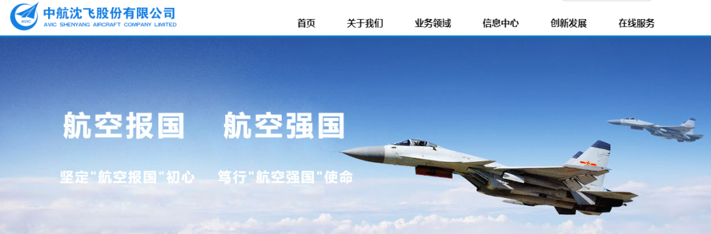
(3) 中航西飞\[000768.SZ\]是科研、生产一体化的特大型航空工业企业，是我国大中型军民用飞机的研制生产基地，国家一级企业。公司拥有国内大中型军民用飞机、全系列飞机起落架及机轮刹车系统的核心资源，主要承担各种大中型军民用飞机、起落架和机轮刹车系统的研发、制造、销售、维修与服务。公司业务清晰、资源集中、实力雄厚，是国内航空产业的骨干力量，是美国波音公司、欧洲空客公司等世界知名飞机制造商的重要合作伙伴。公司以建设治理规范高效、业绩卓越常青的优秀上市公司为己任，致力于成为国际化大中型飞机产业引领者。
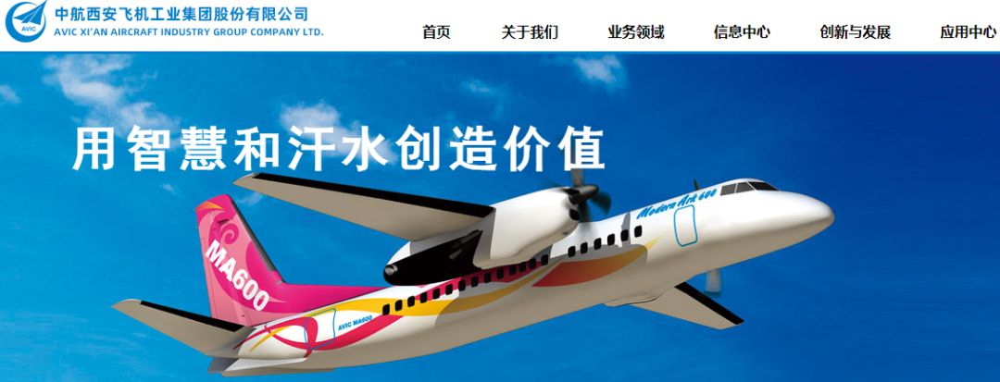
3.5 全球重要竞争者
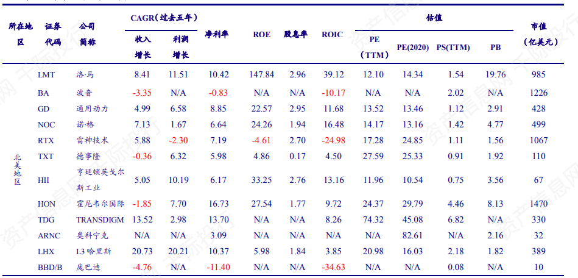

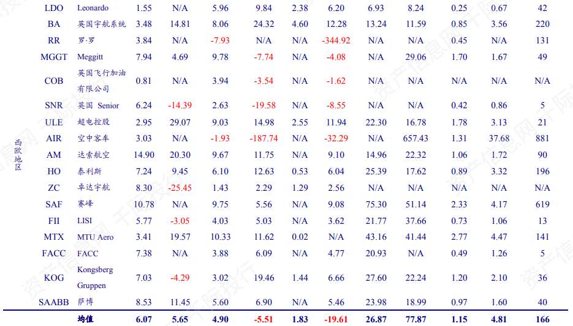
资料来源：资产信息网 千际投行
(1) 美国洛克希德·马丁公司（英语：Lockheed Martin Space Systems Company，简称LMT），前身是洛克西德公司（Lockheed Corporation）是世界最大的国防承包商，该公司涉及的军事产业领域居多，不仅制造战机、运输机、侦察机，而且还生产导弹、卫星与火箭。其中，最具代表性的品牌是F-22、F-35、“三叉戟”导弹。瑞典斯德哥尔摩国际和平研究所(SIPRI)发布了年度全球军工百强企业排行榜多年名列第一，洛克希德·马丁名列2020福布斯全球企业2000强榜第145位。
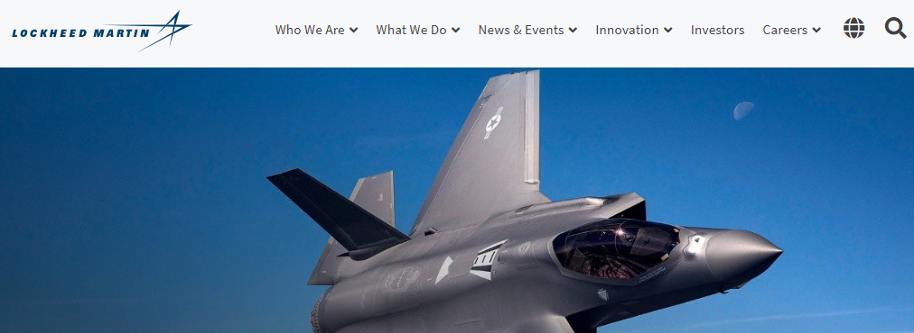
(2) 雷神公司（Raytheon Company），是美国的大型国防合约商，雷神在世界各地的雇员有73,000名，营业额超过90%来自国防合约。它的核心业务包含三个领域：国防、商务电子以及商用和特殊使命的飞机以及工程与建筑。雷神公司生产的导弹与雷达性能优异，其生产的“爱国者”导弹是第一种在实战中拦截弹道导弹的制造武器。此外，雷神公司还生产的AIM-9“响尾蛇”导弹、AIM-120空对空导弹、BGM-109“战斧”导弹。在雷达领域，F-22战机的APG-77、F-35战机的AN/APG-81以及B-2轰炸机的雷达皆由雷神公司生产。

(3) 波音公司(NYSE:BA，Boeing Company)是全球航空航天业的领袖公司，也是世界上最大的民用和军用飞机制造商之一。也长居全球军工百强企业排行榜世界第二武器生产商的地位。波音公司设计并制造旋翼飞机、电子和防御系统、导弹、卫星、发射装置、以及先进的信息和通讯系统。波美国的“阿帕奇”直升机、“支奴干”直升机、“鱼鹰”直升机、B-52轰炸机以及F-15, F-18战斗机皆由波音生产制造。
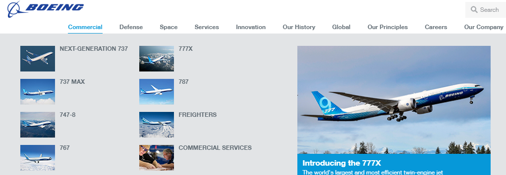

**第四章 未来行业展望**
国防军工发展受数字化、地缘政治和经济发展影响较大。据相关专业机构预测将有如下趋势：
1\. 国防预算持续增长。2019年全球军费支出18681亿美元，增长3.25%。伴随美国新版《国家安全战略》、英国新版《国防工业政策》以及欧盟防务行动计划的深入推进，世界主要军事国家国防支出增长成为必然趋势。持续的地缘政治风险也导致军费增加。
2\. 收并购活动持续活跃，超大型军工企业间的意向收购将持续。
3\. 加速推进国防科技创新，国防工业转型升级迈出坚实步伐。
4\. 数字化推动国防工业科研生产模式转型。
5\. 军民融合推动国防工业日益呈动态化、开放化态势。
6\. 供应链整合和大数据以及云端服务，将推动供应商进行大规模整合和追求成本效益。
7\. 全球军事工业由美国一家独大变为多元化发展。

备注和申明：本文数据均来源于公开材料、数据和图表，并无任何预测成本。

* * *

本报告为第七版，Cover Photo by Richard R. Schünemann on Unsplash

千际投行

欢迎赞赞！

  **微信扫一扫赞赏作者** [赞赏](##)

已喜欢，[对作者说句悄悄话](javascript:;)

取消

#### 发送给作者

发送

最多40字，当前共字

  人赞赏

上一页 [1](javascript:;)/3 下一页

长按二维码向我转账

欢迎赞赞！

受苹果公司新规定影响，微信 iOS 版的赞赏功能被关闭，可通过二维码转账支持公众号。

预览时标签不可点

收录于话题 #
 个
上一篇 下一篇

阅读

分享 收藏
赞 在看

已同步到看一看[写下你的想法](javascript:;)

前往“发现”-“看一看”浏览“朋友在看”

前往看一看

**看一看入口已关闭**
在“设置”-“通用”-“发现页管理”打开“看一看”入口
[我知道了](javascript:;)

已发送

取消

#### 发送到看一看

发送

国防军工行业发展研究报告

最多200字，当前共字

发送中

[写留言](javascript:;)

微信扫一扫
关注该公众号

[知道了](javascript:;)

 微信扫一扫
使用小程序

[取消](javascript:void(0);) [允许](javascript:void(0);)

[取消](javascript:void(0);) [允许](javascript:void(0);)

.weui-hidden\_abs{opacity:0;position:absolute;width:1px;height:1px;overflow:hidden}.weui-hidden-space:empty:before{content:"\\00A0";position:absolute;width:1px;height:1px;overflow:hidden}.weui-a11y-combo{position:relative}.weui-a11y-combo\_\_helper{opacity:0;position:absolute;width:100%;height:100%;overflow:hidden}.weui-a11y-combo\_\_content{position:relative;z-index:1}.weui-wa-hotarea-el{position:absolute;top:50%;left:50%;-webkit-transform:translate(-50%,-50%);transform:translate(-50%,-50%);min-width:44px;min-height:44px;width:100%;height:100%}.weui-wa-hotarea-el\_\_wrp,.weui-wa-hotarea,.weui-wa-hotarea\_before{position:relative}.weui-wa-hotarea-el\_\_wrp a,.weui-wa-hotarea a,.weui-wa-hotarea\_before a,.weui-wa-hotarea-el\_\_wrp navigator,.weui-wa-hotarea navigator,.weui-wa-hotarea\_before navigator{position:relative;z-index:1}.weui-wa-hotarea\_before:before,.weui-wa-hotarea:after{content:"";position:absolute;top:50%;left:50%;-webkit-transform:translate(-50%,-50%);transform:translate(-50%,-50%);min-width:44px;min-height:44px;width:100%;height:100%}.weui-hidden\_abs.weui-hidden\_abs,.weui-hidden\_abs.aria\_hidden\_abs,.aria\_hidden\_abs.weui-hidden\_abs,.aria\_hidden\_abs.aria\_hidden\_abs{position:absolute;opacity:0;overflow:hidden;left:auto;width:1px;height:1px} ： ， 。 视频 小程序 赞 ，轻点两下取消赞 在看 ，轻点两下取消在看
原文链接：<https://mp.weixin.qq.com/s/0FcSN0uFs1qoaaJzhvncbQ>
