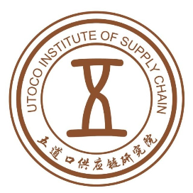
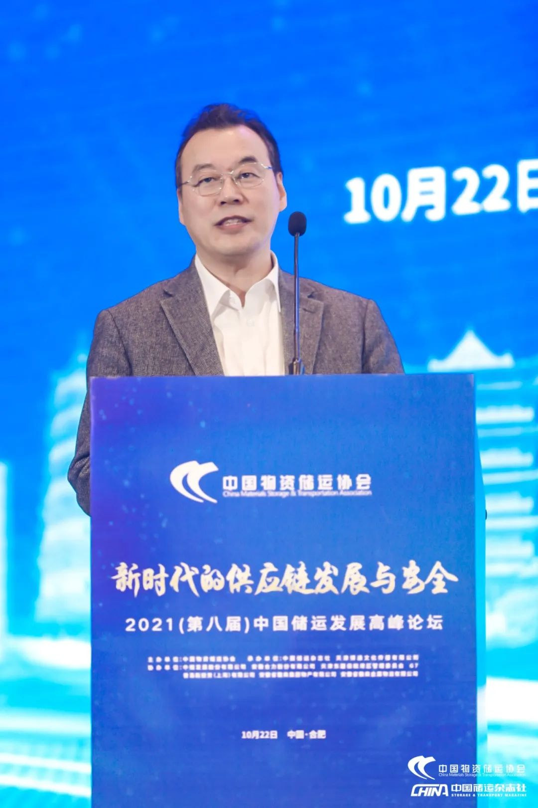

# 大宗商品“托盘业务”风波又起，管控风险需用：管理信用可靠、主体信用可靠、放心仓库、、、

     

# 大宗商品“托盘业务”风波又起，管控风险需用：管理信用可靠、主体信用可靠、放心仓库、、、

[五道口供应链研究院](javascript:void(0);)

**五道口供应链研究院** 

微信号 WDK-SCM

功能介绍 关注我们，与100万管理者一起学习产业供应链金融的疑点、难点、痛点、重点和关键点！

_2022-06-11 03:17_ _发表于天津_

收录于合集

**五道口供应链研究院**
关注我们，与100万管理者一起学习产业供应链金融的疑点、难点、痛点、重点和关键点！
143篇原创内容

公众号

疫情渐渐平息，尽快复工复产，把耽误的时间和效益抢回来，正成为当下的工作重心。大宗商品是制造业的粮食，其重要性不言可喻。

然而，就在这个关键时刻，大宗商品领域突然传出了一条令人震惊的消息：大宗商品行业又出风险事件了！据说，许多贸易商存在一些仓库里的有色金属现货又出现了“一货多单”，有单无货的尴尬境况。

“圈内”危机四伏，众说纷纭之际，本刊记者采访了中国物资储运协会会长李勇昭，希望听听他对此事件的看法和解读。

中国物资储运协会会长李勇昭

# ************01************

**《中国储运》：李会长好！我们知道中国物资储运协会的很多会员都是为钢材、有色金属、塑料、橡胶、纸浆、棉花、煤炭、矿石等大宗商品提供仓储服务的大型仓库。听说最近这个圈子里出了一些问题，比如有些贸易商客户储存在仓库里的货物出现了“货权争议”，不能正常提货。还有买了贸易商在仓库里的存货，手上持有仓库出具的提货单据，到仓库提货时却面临“一货多单”的尴尬，不能顺利提取货物。类似情况的出现，使大宗商品圈子里阴云密布，令很多贸易商寝食难安。不知李会长对这种情况有无了解？能否给做个解读？**

李勇昭：中国物资储运协会的主要成员的确以“物资仓库”居多，这是中国物资储运协会的基因使然，也是协会刻意保留的特色。
“物资”两字在计划经济时期使用较多，当时国家有物资部，各地有大大小小的物资局，物资局下面还有许多的物资仓库。那时所说的“物资”，今天多用“大宗商品”来代指。
总的来说，所谓大宗商品，主要是制造业的原材料或初级产品，我常说它们就是制造业的粮食。在以实体经济为主的我国，大宗商品对经济发展，对国家安定的重要性非比寻常。在物流业界，“大宗商品”是与“生活消费品”相对应的概念，若论大宗商品的物流量，甚至远超生活消费品。你刚才所提大宗商品圈子里最近又出风险事件这个问题，我确实有听说。
因为很多问题还在处理之中，会牵涉很多单位的各种利益。所以，在事情没有全部水落石出的这个当口，我们先对事不对人，只做简单分析。

# ************02************

**《中国储运》：好，那我们就先分析现象，不对号具体单位。**

李勇昭：我听到的本次风险事件起因是这样的：有一家贸易商在华南的某个仓库储存着一大笔铝锭，在这波疫情接近尾声时，为确保自己的货物安全，率先将这笔存货从仓库提出。
其他几家贸易商听说后，出于对货物安全考虑，也安排从该仓库提货。存货人向存货仓库提货，这其实是天经地义的事，本不该出任何差池的，但事实上存货人却没能提出自己的存货。
由此，给在各个第三方仓库里有存货的客户造成了心理恐慌。于是，就有更多的人在更多的仓库办理提货出库的手续。这时，却发现有更多的存货人在更多的仓库都提不出属于自己的库存货物了。由此，引发了这次大宗商品领域，主要是有色金属领域里的又一场地震。

# ************03************

**《中国储运》：您知道这些存货人提不出货物的具体原因吗？有人说是出现了“重复质押”，是这样吗？**

李勇昭：根据初步得到的信息分析，问题首先应该不是“重复质押”，而是“一货多单”或“一单多卖”。“质押”是“动产质押融资”或“仓单质押融资”的简称。正常情况下，有质押融资情况存在，就应该有银行等金融机构的放贷行为在先。
但这一次的风险事件，迄今更多的现象是贸易商在第三方仓库里的存货发生了短少才不能提出，而不是银行的质押货物短少，或被另外的银行申请查封了。通俗说来，就是有麻烦的首先是贸易商而不是银行。当然，贸易商遇到了大风险，有可能后面会殃及与贸易商有资金往来业务的银行，但银行因此而被牵连进去会是后话。

# ************04************

**《中国储运》：那么请问，这一次陷入风险的多是什么类型的企业？这一次的风险究竟是怎样形成的呢**？
李勇昭：我们前面说过，迄今为止，真实的情况还在有关方面的调查核实之中，尚无最后结论。网上流传的一些说法仅仅是些“说法”，不一定符合实情，更不一定理解正确。所以，目前我们只能按照业务发生发展的一般规律做些分析。
先分析陷入这场麻烦的这部分贸易商属于什么样的贸易商。
我们知道，有色金属的生产供应企业数量不多但单体规模较大，终端用户则有大有小，数量繁多。规模大的生产供应企业在有色金属供应链中处于强势地位，通常会要求买方先付款，自己后生产，再后才发货。
而终端用户则希望供货方先送货进场，自己后验收，走完自己的审批程序才给供货方付款。供需双方的这些“规定”之间存在着“缝隙”，客观上需要有服务商夹在中间以弥补缝隙形成供应链。这个缝隙通常有三类服务商填充。因为他们的服务都是寄生在贸易的形式之中，所以称其为“贸易服务商”会更贴切。
其中，靠近生产供应方，以服务好生产供应方为主要任务的是“一级代理商”。一般来说，一级代理商每个月都要维持一定规模的产品订购量，并需向生产供应方预付订货款。一级代理商的订单是生产供应方生产订单的主要来源。靠近终端用户，以服务好终端用户为主要任务的是“次终端贸易商”，这一类的服务商数量很多，因为每一个次终端服务商的规模都不会太大，向终端用户提供的服务又都是量体裁衣式的个性化服务，比如需要短期垫款，因此他们的服务对象数量不可能多，一般也就是三五家有色金属材料的使用者。
他们的服务方式就是持现款到一级代理商那里买进批量不大的现货，再将这些小批量的现货分批分期地送至终端用户厂区，督促终端用户完成验收，督促终端用户走完内部的付款审批流程，最后催收到货款。这往往是一个时间漫长，又充满不确定性的过程。
因此，次终端服务商与一级代理商之间要想无缝衔接，就需要第三类服务商——俗称“托盘商”出现。“托盘商”的作用就是资金托盘，标准模式应该是在收到货物实物并能过程掌控的前提下，提供阶段性的资金支持，从而使供应链顺畅经济地运行起来。
“托盘商”一般来说都应该有比较富余的资金，或者有较强的融资能力。其具体的服务模式是签约后向一级代理商支付货款，买进库存现货，然后再按与一级代理商约定的时限和条件出售该存货，回笼资金。在一买一卖之间，“托盘商”便以贸易差价的方式收取到一定的服务费用。有人称“托盘商”做的是“融资性贸易”，没有实质意义，应该禁止。
客观而论，“托盘商”提供的“资金托盘”服务也是有价值，有意义的，因为“托盘商”的“托盘”服务是供应链上不可或缺的一环，没有“托盘商”的“托盘”服务，很多大宗商品的供应链便会连接不畅，或者供应链的运行效率便会大大降低。“托盘商”业务被叫停，真正的原因应该是很多的“托盘”业务因为操作时不能切实收到货物，不能在“托盘”的全过程掌控货物，比较容易陷入到钱货两空的经营风险之中。
事实上，大宗商品领域几乎过个几年，就会出现这样一次波及甚广，如同海啸地震般的风险事件，对整个行业形成冲击，造成破坏。当然，这并不是规范操作的“托盘”业务必然会发生的风险，而是变形走样的“托盘”业务才会遇到的风险。
这是一些业务操作流程设计粗鄙，管理控制办法执行不严的企业为自己的经营管理不善而必然付出的代价。所以，真正应该被叫停的是这种变形走样，管理不严的“次级托盘业务”。这次的风险，十有八九是出在这类“次级托盘业务”上。
再来分析一下这些“次级托盘业务”的风险是怎样产生的。我们可以想象到，一些“托盘商”签了合同，支付了货款，拿到了一份提货的单据，便以为自己买到了货物，到了约定的时间肯定能提到货物。由此便把需要严谨操作，严格管控的采购行为变成了简单粗暴的纸面作业。
他们大笔一挥，付出去的是真金白银；而收进来的仅仅是几张纸质单据。他们不监督供货方，不监督仓库方，不监督运输方；不发货，不收货，不验货，不跟踪管货。在此过程中，看不到他们为管理控制风险采取的具体措施，能看到的充其量就是些文字记录，纸面留痕。
他们“支付款”这件事是确定性的，但“买到货”这件事却充满了不确定性。一旦手上的这张单子被认为不规范，有瑕疵，被伪造，或在凭单提货之外还有其它的提货设定，“托盘商”的“买到货”和“能提到货”就全然落空，成为泡影，风险便由此酿成。
此外，还要分析一下为什么大宗商品领域会出现一两个风险事件就能引发一连串风险事件进而形成行业地震的现象。在大宗商品领域往往存在托盘商甲卖给托盘商乙，乙再卖给丙，丙再卖给丁，以此类推，形成一大长串连续交易的现象。
如果甲在“买到货”和“能提到货”这类事上已经存在风险了，那么乙、丙、丁等一大长串的“托盘商”自然也会跟着陷入到这场连环风险之中。
而且，常常是这一大长串中的每一家企业在相当长纠纷彻底解决的时期内都不能脱开干系，难以摆脱或有风险纠缠轻装前进。更诡异的是这一大长串陷入风险的企业，往往不是谁惹了祸谁担责，而是谁最有赔偿能力，风险就会实质性地落在谁的头上。因此，此类风险事件一出，被牵连进来的一大长串企业就会人人自危，人人自保，甲申请查封，乙要求保全，丙、丁等跟风采取各种自保措施，实质上就是相互别马腿，设障碍，形成“十字路口无序拥堵”，造成全行业的供应链崩溃。
进而还会产生次生灾害，比如因掣肘而停滞，因停滞而多发生仓储费、滞纳金、违约赔偿、资金占用成本，甚至导致资金链断裂，债务违约等等。再加上出险后的各种传闻造成的行业心理恐慌，由此便会形成挤兑事件，踩踏效应，进而形成行业地震，甚至是引发一定规模的金融海啸。近10年内，国内多地爆发过类似系统性风险，如某某市的液体化工“一货多单”风险事件，某某仓库的橡胶“持单挤兑”风险事件，某某港的铜精矿“有单无货”风险事件等，从本质上看，都带有此类风险的性质。

# ************05************

**《中国储运》：听您这么一分析，此次的风险事件应该既有“托盘商”没买到货的风险，也有买到了货，仓库却无货可提的风险，而不是针对银行等金融机构重复质押的风险。**

李勇昭：事情刚出来时，是有这次风险事件又是“重复质押”风险的说法，但我们分析下来觉得首先不应该是重复质押的问题。
究竟是否涉及重复质押，还要让子弹再飞一会，等最后的调查出来再下结论。但就前面分析的情况来看，应该不是重复质押问题。但应该涉及到存货仓库重复开提货单或仓单的问题。将此类问题说成“重复质押”问题的人，要么是还没了解清楚情况，要么是没太弄明白“质押”的真正含义。从某种意义上说，只要没有银行等金融机构提供资金贷款，风险就不应该是“质押”的风险。
因为在大宗商品业界，无论是“动产质押”还是“仓单质押”，其实质意义都应该是针对金融机构贷款行为提供的一种担保方式。
没有银行等金融机构资金借贷的主合同，就不存在“质押担保”的从合同。正常情况下，贸易商能出资金向供应商购买货物，取得货物实物及其所有权，但不能像金融机构那样向供货商提供贷款，约定利息，并要求供货商以动产质押或仓单质押的方式提供担保。

# ************06************

**《中国储运》：想请您分析一下，贸易商“没买到货的风险”和“买到了货，仓库却无货可提的风险”为什么会产生？怎样才能管控好此类风险？**

李勇昭：贸易商“没买到货的风险”出在贸易环节，属于交易安全的问题。“买到了货，仓库却无货可提的风险”出在仓储物流环节，属于物流安全的问题。
我们先分析交易风险问题，也就是贸易商究竟买没买到货物的问题。大家知道，大宗商品的交易，关键环节有四个：
双方签买卖合同、买方向卖方支付货款、卖方向买方交付货物、卖方向买方开具发票，其中任何一个环节都有可能产生风险。但对没有仓储管理能力的贸易商来说，风险最难管控的环节是卖方向买方交付货物的环节。
因为签合同的完成度有一份签署过的合同文本作为有效凭证。支付货款的完成度有银行往来票据作为有效凭证，开具发票的完成度更是有税务部门的制式发票作为有效凭证，但交付货物这一环节的完成度如何来证明呢？
大宗商品交易可以做到“一手交钱”，却很难做到“一手交货”。事实上，所谓交货，往往不是将一堆的货物实物交给买方，而是“一手交单”，即将一份可提取货物的纸质单据交到买方手里。
但是，这个“单”是什么单？什么样式？有没有一个公认的标准来支撑这个单？谁签发的这个单？签发者应承担什么样的责任义务？签发者靠什么来履行该承担的责任义务？这种交付方式的法律效力如何？这个纸质单据怎样辨认真假……所有这些问题都需要一一落到实处。
因为，这其中的任何一个细节出了差池，都有可能让这份支付了大笔货款才得来的“单”变成存货仓库不认可为提货单据的废纸。如此等等，也反过来说明贸易商在贸易环节没能真正“买到货”，贸易商在交易安全方面陷入重大风险之中。
接下来，我们再分析物流风险问题，也就是仓库承认贸易商持有的“单”是仓库签发也必须兑付货物的有效凭证，但因仓库方面的原因使得买货方不能凭单兑取货物——无货可提，或者提货时，遇到他人对同一货物主张权益。
**仓库方面的原因主要是两个方面：**
一是仓库在无货、少货的情况下出单，或者出单时足货，出单后自己失误发货、私自发货甚至监守自盗；
二是仓库一货出多单，克隆复制单，凭空造假单，然后将这种无对应实物的单子交予他人，押给他人（这时候带有“重复质押”性质）。
这两类行为其实都属于仓库方（关键岗位上的人）的违法违规问题，具体说，要么是仓库为自身利益的违法违规行为，要么是仓库为其重要利害人（比如其股东方、大客户）的利益实施的违法违规行为。
即便违法违规行为不是企业的法人行为，而是仓库关键岗位工作人员的个人行为，仓库也有难以推卸的法律责任。
据说，在这一次的风险事件中，有些涉事仓库就存在此等企业法人的违法违规行为。这是仓库主体信用崩塌导致的严重恶果。毫无疑问，这样的出险仓库是我们大宗商品仓储物流行业的害群之马，他们的违法违规行为再一次地破坏了这个行业的公信力，必然会被千夫所指，万人唾弃。
在此，我也代表我们大宗商品仓储物流行业对此类仓库的违法违规行为进行强烈谴责！也相信等到调查终结，水落石出的那一天，法律也一定会给予违法违规的企业及个人以严惩！

# ************07************

**《中国储运》：正如您所说，这些年来，类似的风险事件每隔几年就会来上一次，为什么大宗商品领域不能亡羊补牢，从根本上杜绝此类风险时间发生呢？**

李勇昭：我们前面提到，大宗商品国内贸易行为涉及到签合同、支付货款、交付货物、开具发票四个关键环节。再深一步说，交付货物环节又往往分为两个步骤：
第一步是“一手交钱，一手交单”，
第二步是向仓库“持单兑货”。
这两个步骤的具体操作都存在很大弊端，弊端不解决，篱笆就有漏洞，羊就会一亡再亡。对比国际贸易中的“提单-信用证”这种相对安全的贸易模式，国内大宗商品贸易中一直就缺少标准化的公平交易模式，客观上就存在许多出险的节点。
**第一个出险节点：**是卖方先交单？还是买方先付款？交单后收不到货款，或者付款后拿不到获取货物的单据，这种短暂的时间差之间的风险怎么管控？
**第二个出险点：**现在货款支付都是通过银行间操作，电子汇兑的安全性及银行电子凭证的权威性使其安全性大大提升，但获取货物的纸质单据无论是其交付方式，还是其权威性、真实性、有效性，安全保障等级都不够。支付了真金白银的货款，仅得到一纸难辨真假，不知能否取到货物的单据，这种风险客观存在。
**第三个出险点：**即使这一纸取货单据真实有效，但货物实物存在他人的仓库，这个他人仓库的主体信用如何？会不会主观上出问题（比如监守自盗、挪用替换）？管理水平够不够？能否保证存货准确无误？这些仓库层面的问题，直接关乎“持单兑货”能否实现。
先不说是否还有其它的风险，只要以上三个风险点不能消除，或者被有效管控，大宗商品流通领域一再出风险的可能性就难以从根本上消除。
这一次的风险事件，可谓“前有古人，后有来者”，此恨绵绵无绝期。要想管控住此类风险，老的办法不灵，禁止不让干，属于因噎废食，关门堵路，肯定不是可取的办法。

# ************08************

**《中国储运》：李会长，以您了解的情况，这个老问题究竟有无解决问题的办法，或者解决问题的思路呢？**

李勇昭：解决问题的思路肯定有，据我所知，解决问题的办法也正在多方实验，有的已经取得了不错的实验效果。
先说解决问题的思路：
第一，利用数字化、物联网、区块链为代表的新一代技术，优化升级仓储管理、运输配送等物流环节，将货物数字化、线上化；
第二，利用智能物联网监督管控物流环节中的货物状态、流转过程、管理行为、说明标识，实现对货物的远程在线账、实、状态（位置、标识等）比对；
第三，在此基础上出具与货物账、实、状态相一致的符合行业标准的区块链数字化单据，并对其实施全生命周期管理，实现货物的数字票据化；
第四，在以上三步得以实施的基础上，建立一个线上化的服务平台，使仓储物流服务能在线上完成的尽量在线上完成，因为线上完成不仅经济、方便、快速，更重要的是必须经过身份验证，进行区块链技术存证，形成数字孪生，可以留下客观的有效证据；
第五，与“主体信用可靠”+“管理信用可靠”的“放心仓库”合作，使“持单兑货”的实现环节有充分的安全保证。
这里我要解释一下什么是“管理信用可靠”“主体信用可靠”“放心仓库”这三个概念。完成了以上前述四步优化升级措施后，大宗商品仓库的管理水平会有一个质的提升，并且这个提升能够在线上线下客观呈现，被存货客户及有权监督的相关方在线上线下获取，即可以将此视为一个仓库的“管理信用可靠”。
相对“管理信用可靠”的另一个概念是“主体信用可靠”，即这个仓库具有良好的体制机制，使其决策、管理、操作等运行过程具备接受正规监督的条件，其资产实力具备赔偿一般经济损失的能力，其历史传承、行业口碑良好使其珍惜企业的品牌价值，其员工队伍素质良好、经验丰富，使其具有职业操守、荣誉信用等。
一个主体信用可靠+管理信用可靠的仓库才能称得上“放心仓库”。管理信用可靠，是一种客观存在的可靠，是通过一系列的模式、流程、制度、方法、技术实现等将企业的运行、管理、操作更程序化、程式化、标准化地固定下来，排除主观干预，呈现客观效果。
理想化的管理信用可靠，应该是仓库的操作、运行、管理只能按与客户的既定规则运行，运行中要么不受仓库内人为干预，要么需要有客户的授权才能干预，要么一旦有人干预就会示警呈现，接受客户的问询及管控。
说得通俗点，就是管到仓库干不成不该干的事，或者一干不该干的事，客户就能知晓，就能询问，就能管控，进而采取更有效的措施。不是后知后觉的追究索赔，而是事中的知情管控。
经过上面五个步骤的优化升级，大宗商品的物流服务基础才算打牢。有了这个基础，就可以打造一个集物流线上化服务、贸易线上化服务、金融线上化服务、保险线上化服务等为一体的大宗商品供应链集成服务平台，尽可能地将大宗商品流通中需要的各种生态化服务在线上实现。
再加上有“放心仓库”在线下支撑，有网络货运平台管控下的智慧运输配送体系支撑，便可建立起一套安全可靠的大宗商品现代流通体系。在这个体系下再来开展大宗商品的仓储、运输等物流服务，开展贸易，获得金融服务等，其安全性就会大大提升，前面分析到的大宗商品贸易中存在三个风险点必然会得到有效管控。如此，才算的上“亡羊补牢”。
在最近三年中，上述思路已经在我们的行业论坛中多次成为热门话题，甚至在很多方面形成共识。按照上述思路优化升级大宗商品物流服务体系，即所谓建设“智慧物流地网”，同时打造智慧贸易服务体系+智慧金融服务体系，即所谓建设“智慧天网”的创新项目也已经出现。
一些积极实验此类项目的公司就是我们协会的会员。比如，我所在的单位中储股份，与京东科技共同投资组建了中储京科供应链公司，支持中储京科开发的货兑宝平台，就是一个完全按上述思路建造起来的大宗商品供应链集成服务平台。
“货兑宝”三个字，反过来读是“宝兑货”，谐音就是“保兑货”，保证兑付到货物，可见“货兑宝”平台的设计理念和功能追求。这个平台的技术软件于2019年开始设计，2020年3月底上线，并在中储的青岛物流中心和中储青州仓库率先实验。其中的仓储物流服务在第一年的磨合期内就吸引了95%的存货客户上线运行，服务效果良好。
2021年初开始推动“区块链电子仓单在线质押融资服务”+“智能物联网在线远程印证货物帐、实、状态”的新产品实验，一年下来，与多家银行的系统建立起系统接口，实验成功了多笔业务，验证了技术支持能力和业务模式的合理性、合规性、适用性、安全性，具备了成规模开展业务的基本条件。
货兑宝的另一款金融服务产品是基于O2O物流管控的订单融资服务，目前处于准备上线实验阶段。货兑宝的交易服务产品正处于原形重新设计阶段。
我本人算是这个项目的积极推动者，深度参与了这个项目的创意、研发、实验过程，深知做成这件事的不易，但也深知这件事对建设大宗商品现代流通体系所具有的积极意义，并且在三年的实验、推广过程中，也对这套思路和这个产品越来越充满信心。
业务模式优化必须依靠新技术赋能，新技术应用也倒逼业务模式优化，管理模式优化，操作模式优化，这样才能让中储“中国放心库”的品牌价值不单单依靠中储的主体信用支撑，也有了客观力量的保证。这样的“中国放心库”才能真正令人放心。

# ************09************

**《中国储运》：经过您的分析，我们大致可以看出此类风险事件症结所在，也看到了治愈的希望。想请您分析一下当下这次风险事件的后****续影响。**

李勇昭：每一次的风险事件，如同行业里的一场地震，会瞬间破坏掉行业里的秩序、规则、氛围，尤其会在一个时期内严重打击行业中人的工作信心和勇气，使行业中出现风声鹤唳、草木皆兵、人人自危的怨气与戾气。
接着会让行业重新洗牌，体弱多病者，营养不良者黯然退场，然后再出现新的黑马，新的悍将，新的领军者。但每一次的风险轮回，也会使大宗商品领域的运行成本和管控成本大幅度提升，利润下滑，内卷无限，竞争白热化。
这些不是好现象，不该成为行业发展的魔咒。所以，如果不从方法论的角度对大宗商品流通领域进行系统化的升级改造，类似的风险事件就难以从根本上消除，恶果就会循环往复。
反过来看，没有一次次类似风险事件造成的恶果危害行业及社会，也就不足以形成系统化改造升级大宗商品流通体系的动力和决心。
所以，希望这一次的风险事件在查实查清，得到妥善处理的同时，也能让行业中一批有头脑、有志向、有实力、有原则的企业和行业中人从中吸取教训，找准症结，研究方法，形成共识，在此基础上革除弊端，加大创新，升级业务模式、管理模式、操作模式，建立更好的游戏规则，打造更好的服务平台，使大宗商品领域出现一股新气象，形成一种新氛围。
近一个时期以来，党和政府对物流领域、流通领域的健康发展给予了越来越多的重视，对构建双循环的发展新格局，建设全国大市场发出一系列的指示文件，对发展新一代技术支撑的无接触物流服务，供应链平台服务也都持积极鼓励的态度，这既给大宗商品领域的健康发展指明了方向，也让我们这些行业中人感受到了沉甸甸的担子。响应号召，拥护决定不能是口号，而应是有思路、方法、技术支持的有效行动。
如果我们能够在大宗商品领域里推动形成解决治理此类风险事件的主流思路，推动一批有作为的企业积极实践，最后打造成一类能够革除弊端、防范风险、提高效率、有利于安全运行的供应链服务平台，才算在建设现代流通体系的进程中身体力行地做了有益的事情。
作为大宗商品仓储物流企业集聚的中储协会，我们也会整合行业内的研究力量，持续跟踪这次风险事件的调查处理进程，持续关注风险事件造成的各种影响，认真归纳总结整个事件的起因教训，积极研究治愈防范的应对办法及长效机制，并注意将有价值，有意义的信息、观点、主意等思想成果与会员单位、行业人士、专家学者等及时分享，形成有效互动。
行业协会还是政府与行业联系的桥梁纽带，我们也会将行业内发生的问题，造成的影响，形成的原因，解决的思路，需要的支持等及时向有关部门反映、报告，希望能够凝聚各方力量，共同为大宗商品物流领域、流通领域的更好发展发挥积极作用。
新的时代，新的格局，新的机遇，当下的中国，新一代技术从应用于生活消费品物流及流通领域，进而应用于大宗生产原材料物流及流通领域，已经显示出新技术、新模式、新资源、新机制能够带来新发展机遇的大趋势。
这也让更多的行业中人更有信心和决心投入到本行业这场创新发展的浪潮之中。摒弃投机钻营，损人利己，见利忘义的短视思想，树立遵规则，走正路，扛大旗，筑伟业的健康理念，以公正之心，谋公平之事，正成为大宗商品领域行业同仁的正确追求。相信在我国大宗商品领域里一定会成长起一批用智慧和汗水建功立业，服务社会的时代楷模，我们对此充满期待。
转载自 中国储运

[1、交易所铝锭交割库暴雷10亿，供应链金融存货融资还能不能干？](http://mp.weixin.qq.com/s?__biz=MjM5ODc4Mzc0MA==&mid=2651956856&idx=1&sn=9bee0a540d1671212ed085a0daee2d6a&chksm=bd2079eb8a57f0fd52e1db7ed96ed420aa5f3ef107897ed5ddb214cfbbc78cb87b272b3c9382&scene=21#wechat_redirect)

[2、供应链托盘融资一点都不low：虽然简单、粗暴，但是非常有效！](http://mp.weixin.qq.com/s?__biz=MjM5ODc4Mzc0MA==&mid=2651956971&idx=1&sn=e4418faf3b5b3c5f597783183a938430&chksm=bd2079788a57f06e4c651aae052cdc59b5a75d392473fd5ec82c86cfef93381fc5637afeb101&scene=21#wechat_redirect)

[3、科技控货是供应链金融存货融资中最有效的风控措施](http://mp.weixin.qq.com/s?__biz=MjM5ODc4Mzc0MA==&mid=2651942465&idx=1&sn=bcd2bd4e213463263dacf4013822cd1b&chksm=bd20b1d28a5738c4d987bea4b7cfc6ac1a4a848acb8293382061066054bbd67026cd3df9a8a5&scene=21#wechat_redirect)

4、[反思青岛港贸易融资事件 都是道德风险惹的祸](http://mp.weixin.qq.com/s?__biz=MjM5ODc4Mzc0MA==&mid=2651940652&idx=1&sn=957da382e1ba92f6d4962b069a7e27d3&chksm=bd20b8bf8a5731a9f4b5a2321399e9410aa8de7691d983d3a3449885d34d73ff1ce4f8a18c7f&scene=21#wechat_redirect)

预览时标签不可点

收录于合集 #
 个
上一篇 下一篇

喜欢此内容的人还喜欢

手握多少存款，才能心里不慌？

手握多少存款，才能心里不慌？

...

金融第一教室

不喜欢

不看的原因
确定

* 内容质量低

* 不看此公众号

**写留言**
取消

留言

**我的留言**

[写留言](javascript:;)

正在加载
展开我的留言
留言被精选后将公开

**精选留言**

[写留言](javascript:;)

[写留言](javascript:;)

正在加载

已无更多数据

[发消息](javascript:;)

关闭
**写留言**
提交更多

正在加载

[表情](javascript:;)

正在加载

关闭
**留言**
更多

正在加载

正在加载

返回
**写回复**
回复更多

正在加载

: 

[表情](javascript:;)

正在加载

微信扫一扫
关注该公众号

[知道了](javascript:;)

 微信扫一扫
使用小程序

[取消](javascript:void(0);) [允许](javascript:void(0);)

[取消](javascript:void(0);) [允许](javascript:void(0);)

 ： ， 。  视频 小程序 赞 ，轻点两下取消赞 在看 ，轻点两下取消在看

该账号因违规无法跳转

原文链接：<https://mp.weixin.qq.com/s/xQEQ1b_KK2n0YboC5OO7cg>
