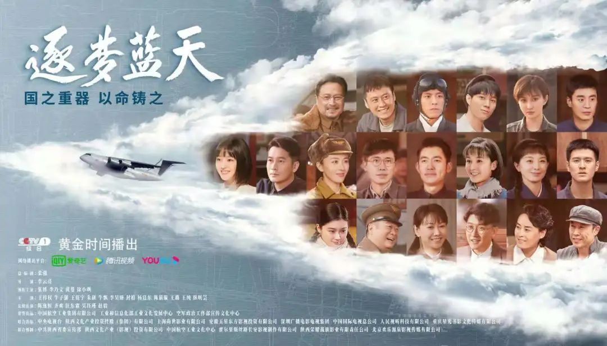
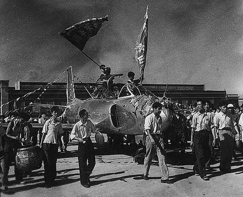
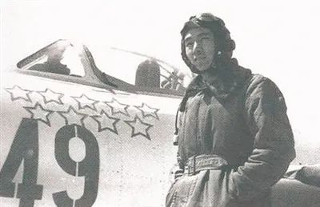
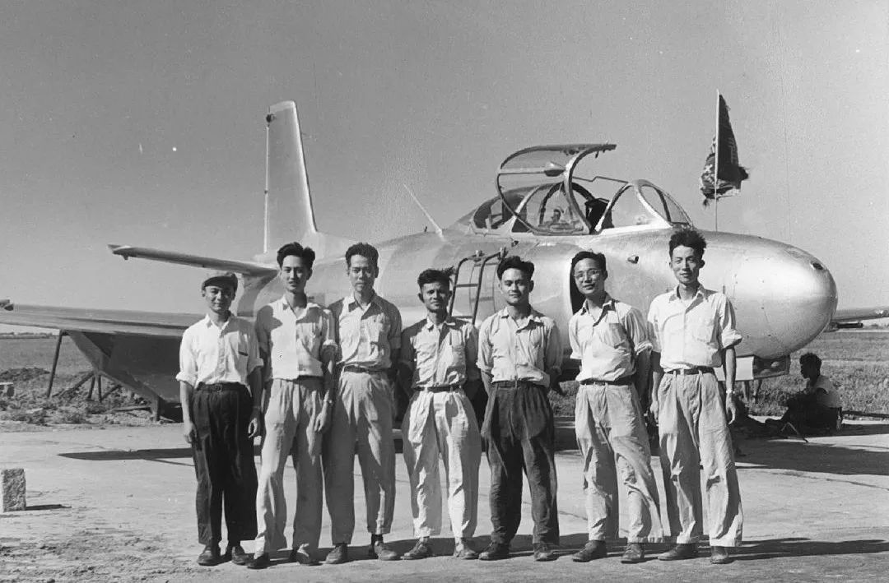
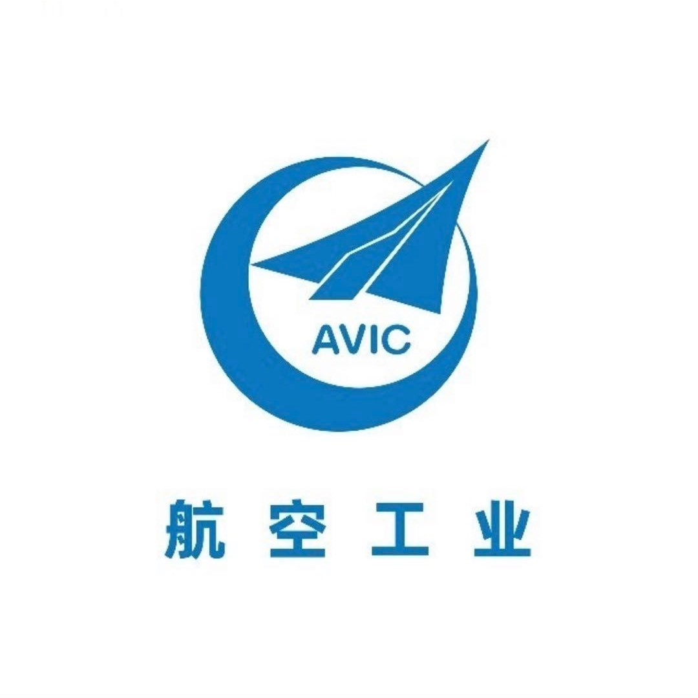
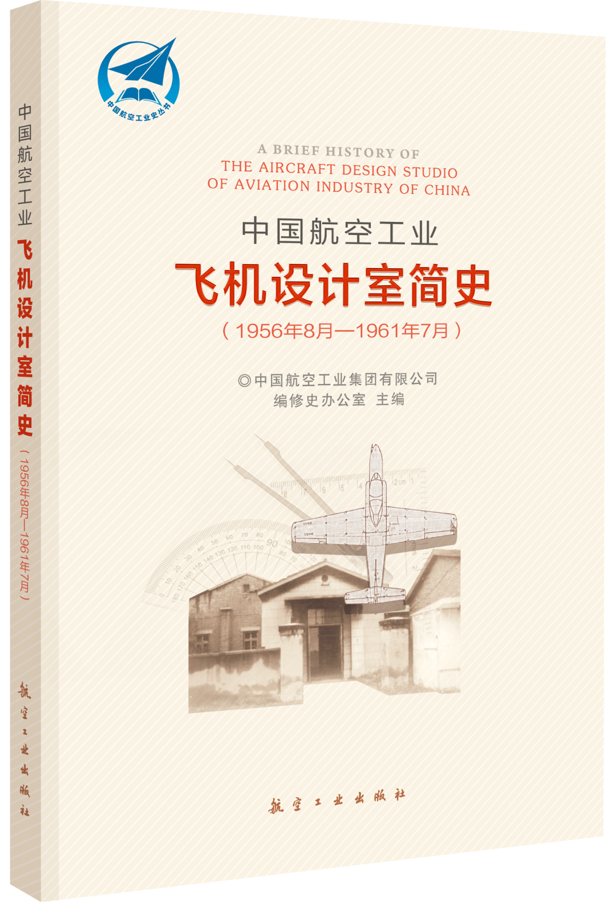

# 新中国第一个飞机设计室诞生，逐梦蓝天的步伐永不停歇

     

## 新中国第一个飞机设计室诞生，逐梦蓝天的步伐永不停歇

[航空工业](javascript:void(0);)

**航空工业** 

微信号 avic-2008

功能介绍 航空报国 航空强国

_今天_

收录于话题

近日，航空题材电视剧《逐梦蓝天》在央视1套黄金档热播。《逐梦蓝天》首次全景展现70年来新中国航空工业的发展历程。

**剧中展现了**

**中国第一架喷气式教练机首飞的场景**

**而这架飞机的首飞**

**离不开新中国第一个飞机设计室的诞生**

**和小飞侠一起重温下**

**那段筚路蓝缕的历史**

**和航空人**

**"忠诚奉献、逐梦蓝天"**

**的航空报国精神**

1956年8月，我国第一个飞机设计室在沈阳成立，徐舜寿担任主任设计师，黄志千、叶正大任副主任设计师。设计室成立不到两年，便研制成功了中国第一架喷气式歼击教练机——歼教1，开创了我国自行设计飞机的先河。

1958年，歼教1飞机首飞成功

**而此时**

**距离歼5首飞刚刚过去一个月**

**在这之前** 

**新中国航空工业**

**从抗美援朝的烽火中诞生**

1950年11月，为了粉碎美国的空中优势，苏联向中国提供了100多架米格-15喷气式歼击机等飞机的成套部件，用火车陆续运抵沈阳。“五厂”负责卸火车、运输及参加装配工作。“五厂”就是当时的中国人民解放军空军工程部东北修理总厂第五厂。今天这里有一个响亮的名字——航空工业沈飞。

在抗美援朝战争中，王海一人击落敌机9架，他驾驶的飞机被誉为“功勋飞机”，至今仍陈列在中国人民革命军事博物馆。他们所驾驶的米格-15飞机，就是由航空工业沈飞的前身“五厂”组装的。

怀着一腔报国热情，航空人在一穷二白的条件下，把一架架飞机送上蓝天。“自行研制”在那个年代，带着几许自豪，也带着几许悲壮：一支笔、一把尺；一个暖壶、一把柴刀……

**但根植在每个人心中的航空梦**

**却从未停歇**

**1956年8月**

**优秀人才汇聚沈阳**

 **中国首个飞机设计室就此建立** 

飞机设计室以徐舜寿为主任设计师，叶正大、黄志千为副主任设计师。徐舜寿凭借对中国航空工业领域飞机设计人才的了解，从实际需要出发，按照设计各专业的设置和人才配备情况，**从各工厂抽调部分技术骨干、挑选优秀毕业生充实技术队伍**，陆孝彭就是被抽调来的技术骨干。

徐舜寿在大学时比陆孝彭高三届，又是同去美国学习，比较熟悉。设计室成立后，徐舜寿力邀陆孝彭北上，陆孝彭没有丝毫犹豫便答应了。与此同时，有志于投身航空的各种优秀人才从全国各地汇聚到了这里——**航空工业管理局沈阳飞机设计室**。

徐舜寿也是抛开在北京的舒适生活条件来到了沈阳。为了避免类似安排家属等事务性工作影响设计室的组建，徐舜寿和黄志千都是只身来到沈阳。他们住单身宿舍、吃集体食堂，有什么新的想法，马上聚在一起讨论，**大家有着共同的信念，****设计中国自己的飞机。**

● 航空工业第一代设计人员在歼教1前合影

 从左至右依次为：陆孝彭、叶正大、徐舜寿、王汇青、程不时、顾诵芬、汪子兴

**一起来听
**
**顾诵芬口述歼教1的故事**
  **航空工业**
歼教1的诞生

视频号

歼教1的研制基本上走完了从型号设计到试飞的全过程，培养锻炼了设计队伍，积累了宝贵的设计和试制经验，对新中国飞机设计事业有着重大意义。

**新中国第一代设计师们逐渐离我们远去
**
**但是他们精神鼓舞着我们奋勇前进**
**历经几代人的自力更生**
**艰苦奋斗、薪火相传**
**新中国航空工业
早已今非昔比
实现了
从修理、仿制到自主创新
从望尘莫及到同台竞技**
**航空人**
**从未止步！**

对于飞机设计室的故事

小飞侠还给大家

带来一本更详细的简史

快一起来看吧

**《中国航空工业飞机设计室简史****》**

**（****1956年8月—1961年7月****）**

**中国航空工业集团有限公司 编修史办公室 主编**

铁粉必看

[世界500强发布！中国航空工业排名第140位](http://mp.weixin.qq.com/s?__biz=MzA5ODIwNTAyOQ==&mid=2659249031&idx=1&sn=38888ec41062c4aaef46051d498d09e0&chksm=8be1678dbc96ee9b7053069199347a11db1e55c6c08b85d2a87d76db5efcc5086d89b31c0e46&scene=21#wechat_redirect)

[中国女子帆板奥运夺金！航空科技助力突破](http://mp.weixin.qq.com/s?__biz=MzA5ODIwNTAyOQ==&mid=2659249031&idx=2&sn=c95c66ca35d59eea78fbbb72fca1d3b5&chksm=8be1678dbc96ee9bad29a5910540323962ee3f4dd1fa76b92f7ca4d0a771a93934517f099dab&scene=21#wechat_redirect)

视频/姜少林 责编/高新宇 
主编/刘　煊　监制/程晓敏

来源/中国航空报

预览时标签不可点

收录于话题 #
个
上一篇 下一篇

阅读

分享 收藏
赞 在看

已同步到看一看[写下你的想法](javascript:;)

前往“发现”-“看一看”浏览“朋友在看”

前往看一看

**看一看入口已关闭**
在“设置”-“通用”-“发现页管理”打开“看一看”入口
[我知道了](javascript:;)

已发送

取消

#### 发送到看一看

发送

新中国第一个飞机设计室诞生，逐梦蓝天的步伐永不停歇

最多200字，当前共字

发送中

喜欢此内容的人还喜欢

[给直升机加上机翼，能不能提速？__给直升机加上机翼，能不能提速？__...__航空知识__不喜欢__不看的原因_确定___ 内容质量低___ 不看此公众号](javascript:void(0);)
;)
;)[超震撼！夜视仪视角下直升机空中打击画面__超震撼！夜视仪视角下直升机空中打击画面__...__航空知识__不喜欢__不看的原因_确定___ 内容质量低___ 不看此公众号](javascript:void(0);)
;)
;)[跨界对决，跑车与直升机比速度__跨界对决，跑车与直升机比速度__...__航空知识__不喜欢__不看的原因_确定___ 内容质量低___ 不看此公众号](javascript:void(0);)
;)
;)

微信扫一扫
关注该公众号

 微信扫一扫
使用小程序

[取消](javascript:void(0);) [允许](javascript:void(0);)

[取消](javascript:void(0);) [允许](javascript:void(0);)

[知道了](javascript:;)

**长按识别前往小程序**

原文链接：<https://mp.weixin.qq.com/s/Qn-5nQAXRoW66yCLg0oRQw>
