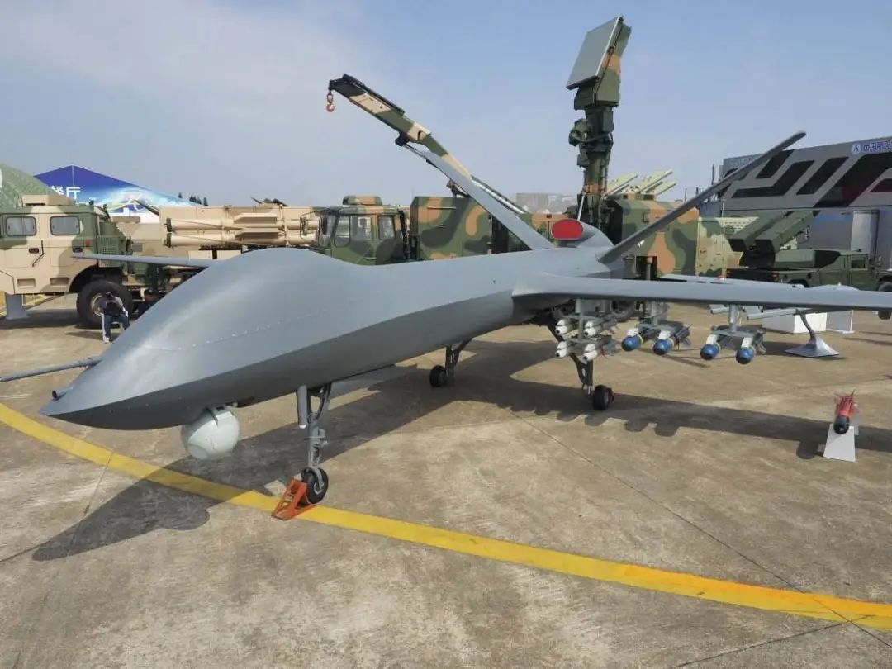
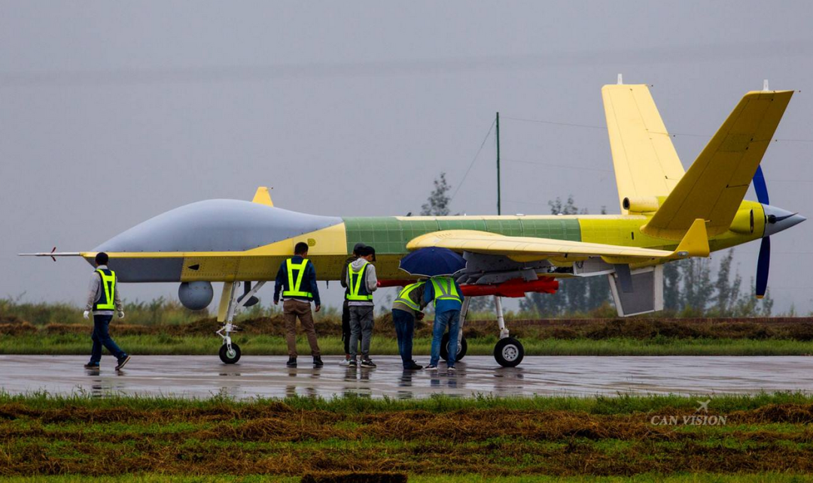
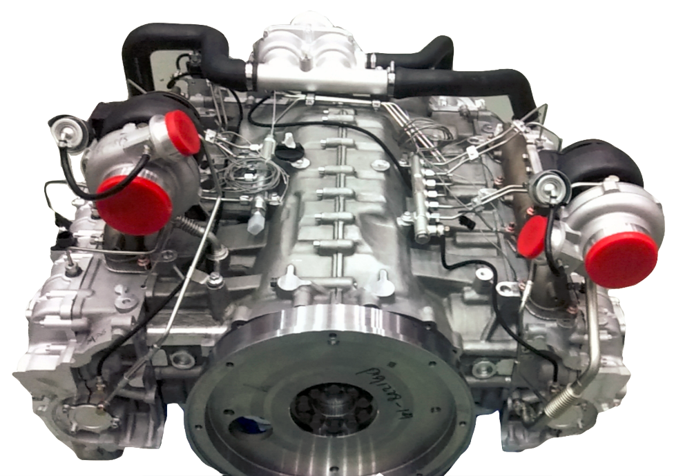

# 无人机大战！换装新型发动机，航天彩虹5挑战航空翼龙2无人机！

     

# 无人机大战！换装新型发动机，航天彩虹5挑战航空翼龙2无人机！

原创 大水来 [大水来](javascript:void(0);)

**大水来** 

微信号 Great-water-8888

功能介绍 航空技术爱好者，哲学爱好者

_2020-10-05_

收录于话题

最近高加索地区爆发大规模冲突，围绕纳卡地区归属，亚美尼亚和阿塞拜疆两国开始大打出手，迄今为止造成重大人员和财产损失，最让人眼前一亮的，就是阿塞拜疆装备的土耳其T-2无人机，对亚方坦克，装甲车，防空导弹发射车，军用卡车，火炮进行了精确的快速打击，很快就扭转了长期以来阿方屡战屡败的局面，胜利大门开始打开。

作为世界顶级的无人机大国，中国研制和装备的无人机种类和性能远超土耳其，拥有更强悍的作战潜力，最近中国航天彩虹5无人机，开始装备新型500KW重油发动机，再战江湖，作为上一波彩虹4和成飞翼龙1大战的后续，继续和翼龙2这一款察打一体无人机的“巨无霸”拼搏！

成飞在翼龙1时代，总体性能和彩虹4系列相当，双方采用了相同的活塞飞机的，双方在国内外市场拼得难分难解，但是翼龙2无人机的问世，立即让彩虹4黯淡无光，为了挽回局面，航天彩虹推出了彩虹5，继续和中国航空工业成飞集团的翼龙2掰手腕！

翼龙2比翼龙1主要的改变是，最大起飞重量从1.2吨暴涨到4.2吨，飞机尺寸空间载重也随之暴涨，飞机最高速度达到370公里每小时，比翼龙1几乎提高了三分之一，最大飞行高度也达到9公里，主要原因是，设计师采用了先进的涡桨9发动机取代了原有的小功率活塞发动机，最大热功率达到了526KW，发动机强壮，飞机性能自然疯涨，这是一个不变的法则。

翼龙2由于先进大功率涡桨发动机的加成，所以能携带更大量的燃油和更多的先进设备，飞机也史无前例的装备了先进的内置合成孔径雷达，可以在不良气候下对目标进行广域侦察，这是一个独特的绝招；而且飞机可以挂载12发导弹或者炸弹，是翼龙1的3倍，所以在最近些年，不管是中国还是外国察打无人机竞争中，都明显占据优势，如何挽回局面，这就成了彩虹无人机公司设计师的难点。

最终彩虹无人机的回应也是，寻找更大功率发动机，将飞机尺寸重量做大，尽量在所有关键性能赶上，甚至超越翼龙2无人机，最终选择的结果，他们采用了中国民企开发的600KW“金鹰”重油发动机，这一款发动机功率比涡桨9更大一些，而且采用了先进技术，达到了“更高海拔、更大载重、更长航时”的要求，最大工作高度达到10公里，超越翼龙2的9公里。

新型重油活塞发动机成为彩虹5挑战翼龙2的底气。

这一款发动机，功率600KW，重量515公斤，尺寸1.1m×1.0m×0.8m，极限工作海拔10公里，无衰减海拔4.5公里，正好符合中国客户的独特高原需要，而且这款发动机采用柴油或者RP-3/5做燃料，油耗比较低，而且不管是发动机造价还是燃油使用价格都相对比较低廉，对客户来说有巨大的吸引力。

发动机采用对置八缸，4冲程、液冷设计，发动机持续功率808马力/转速4000转每分，大修间隔2000飞行小时，该发动机采用了 高压共轨、涡轮增压中冷、干式润滑、FADEC系统、全机液冷等先进技术，特别具有有高功重比、低油耗、高海拔、衰减少的特点，用于重载长航时无人机非常合适。

据介绍，采用这一款新型发动机后，彩虹5飞机最大载重量将达到史无前例的1.4吨，可以挂载16发以上的导弹或者炸弹，除此之外最大飞行高度和巡航时间将会超越翼龙2，成为中国单发螺旋桨推进无人机的新一代霸主。

大水来

感谢关注，感谢支持！

  **微信扫一扫赞赏作者** [赞赏](##)

已喜欢，[对作者说句悄悄话](javascript:;)

取消

#### 发送给作者

发送

最多40字，当前共字

[undefined](javascript:;) 人赞赏

上一页 [1](javascript:;)/3 下一页

长按二维码向我转账

感谢关注，感谢支持！

受苹果公司新规定影响，微信 iOS 版的赞赏功能被关闭，可通过二维码转账支持公众号。

预览时标签不可点

收录于话题 #
个
上一篇 下一篇

阅读

分享 收藏
赞 在看

已同步到看一看[写下你的想法](javascript:;)

前往“发现”-“看一看”浏览“朋友在看”

前往看一看

**看一看入口已关闭**
在“设置”-“通用”-“发现页管理”打开“看一看”入口
[我知道了](javascript:;)

已发送

取消

#### 发送到看一看

发送

无人机大战！换装新型发动机，航天彩虹5挑战航空翼龙2无人机！

最多200字，当前共字

发送中

喜欢此内容的人还喜欢

看到各大企业的“共同富裕计划”我笑了

看到各大企业的“共同富裕计划”我笑了

...

以后自由

不喜欢

不看的原因
确定

* 内容质量低

* 不看此公众号

中纪委等6部门发文：受贿行贿一起查，建立行贿人“黑名单”

中纪委等6部门发文：受贿行贿一起查，建立行贿人“黑名单”

...

川观新闻

不喜欢

不看的原因
确定

* 内容质量低

* 不看此公众号

赵孟頫临王羲之《七儿一女帖》，非常好的临帖参考范本

赵孟頫临王羲之《七儿一女帖》，非常好的临帖参考范本

...

大众书法

不喜欢

不看的原因
确定

* 内容质量低

* 不看此公众号

微信扫一扫
关注该公众号

[知道了](javascript:;)

 微信扫一扫
使用小程序

[取消](javascript:void(0);) [允许](javascript:void(0);)

[取消](javascript:void(0);) [允许](javascript:void(0);)

.aria\_hidden\_abs,.weui-hidden\_abs{position:absolute;opacity:0;overflow:hidden;width:1px;height:1px} ： ， 。 视频 小程序 赞 ，轻点两下取消赞 在看 ，轻点两下取消在看

原文链接：<https://mp.weixin.qq.com/s/m5a_lByBRo1aM3yUmnd5Uw>
