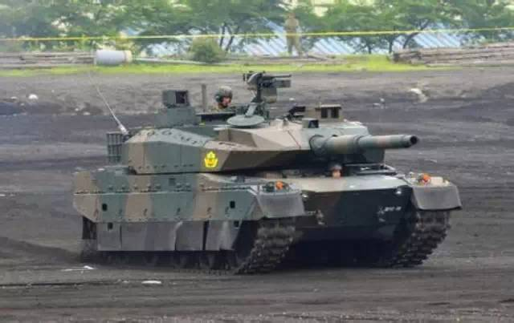
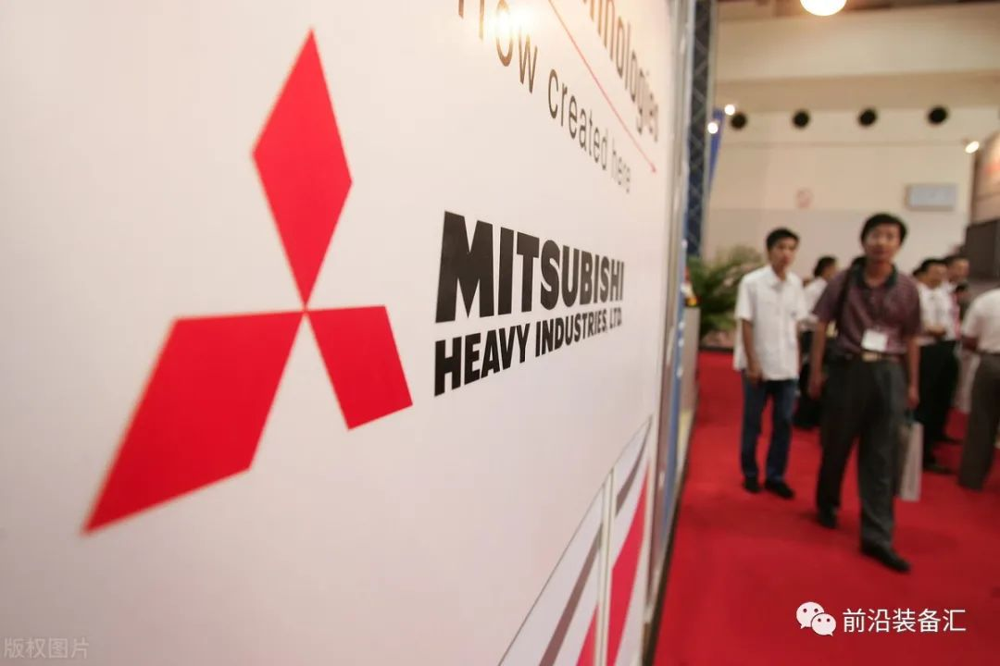
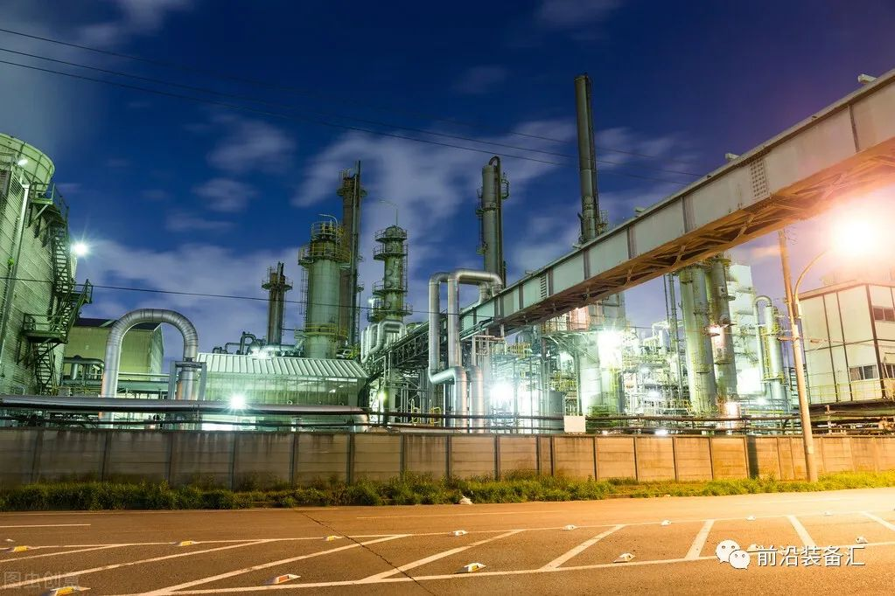
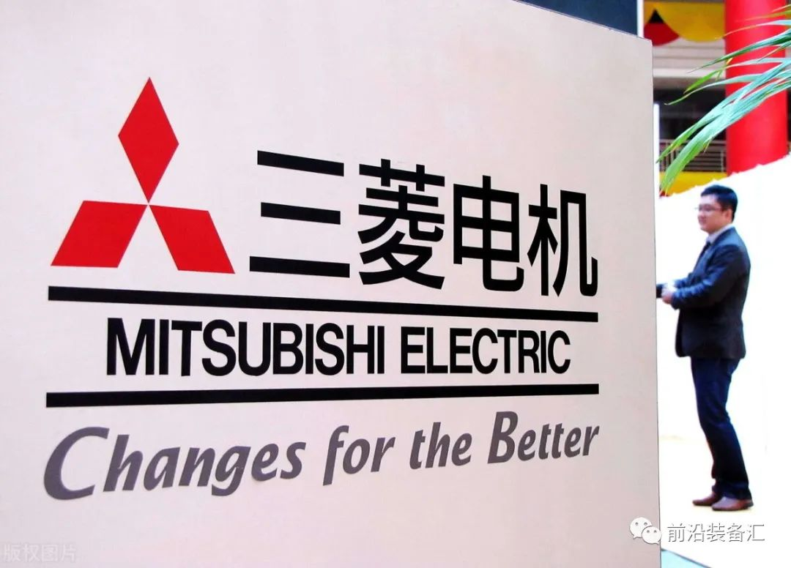
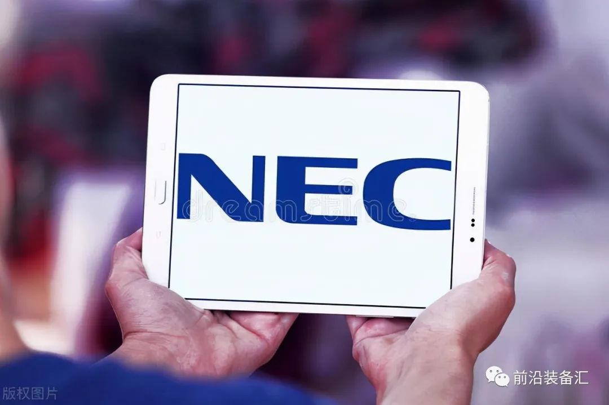
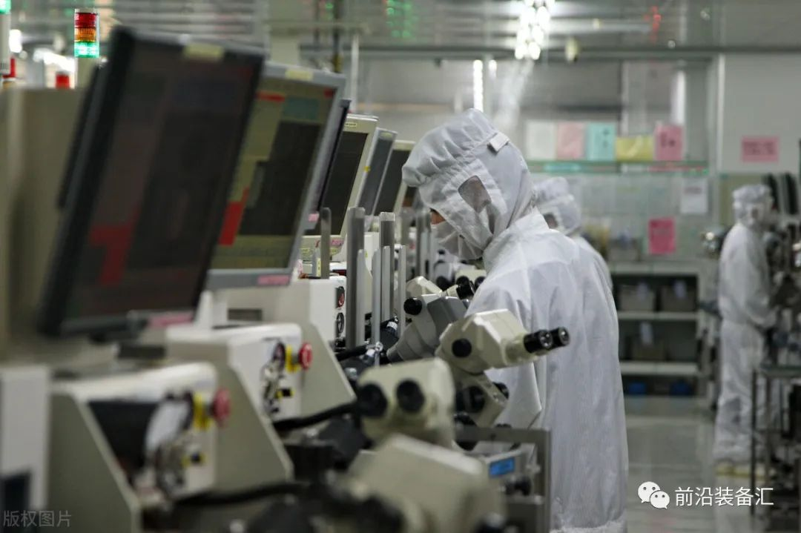
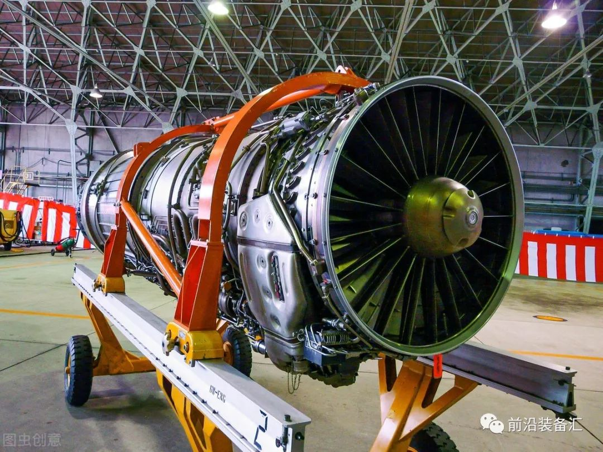
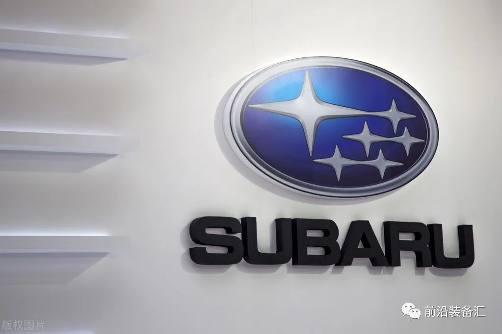
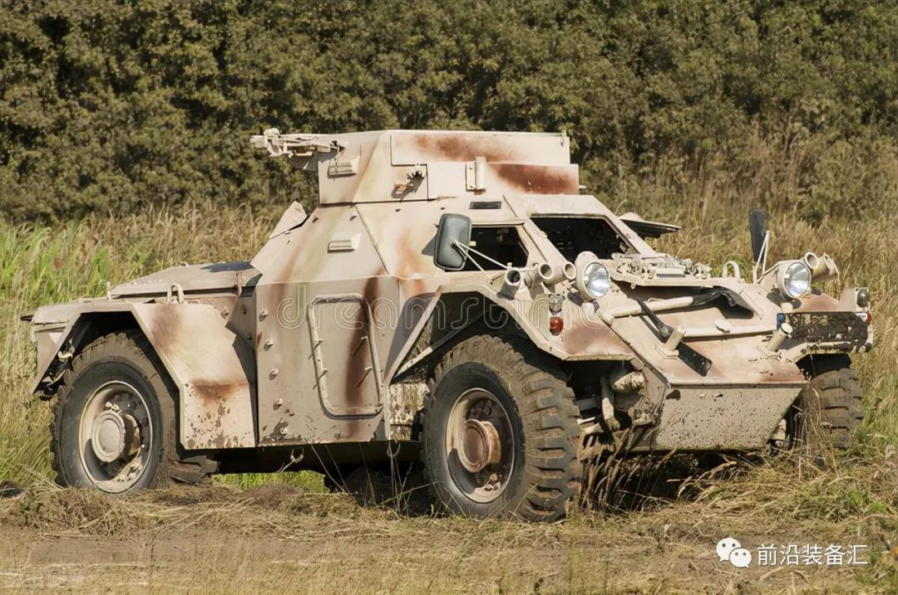
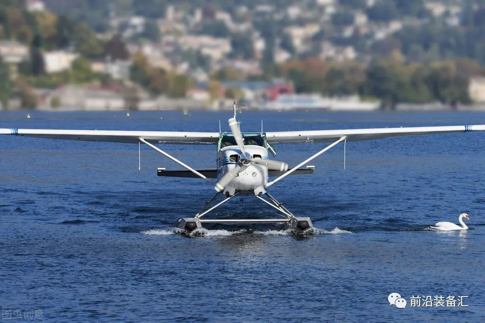

# 日本十大世界级的军工巨头

     

# 日本十大世界级的军工巨头

[前沿装备汇](javascript:void(0);)

**前沿装备汇** 

微信号 gh\_8d200d334fa7

功能介绍 聚焦国际前沿技术、科技装备顶层智慧，传递装备热点、发展历程、技术原理，装备功能、现状与趋势分析，观点交流等内容

_2022-11-16 14:16_ _发表于北京_

收录于合集

#武器装备 283 个
#军工企业 64 个

 二战后，受“和平宪法”的制约，日本没有官办的专门从事武器装备生产的工厂，而是在政府的大力扶持下，建立了以私营企业为主的军事工业，它具有门类齐全、寓军于民等特点。

 目前全日本大约有1500多家企业生产军事产品，从业人员约有7万人，三菱、富士、日立、东芝，这些我们耳熟能详的日本著名企业，同时也具有强大的军事工业生产能力，他们能独立生产战斗机、坦克、战车、舰船……这些大企业在制造汽车、船舶、发动机、家用电器、电子设备等民用产品的同时，不断将民用产品开发中储备的尖端民用技术应用于军事领域。

 **日本军工企业一览表：**

 战机制造商：三菱重工、富士重工、川崎航空工业、东芝公司、防卫厅技术研究本部第三研究所

 引擎制造商：石川岛播磨重工、防卫厅技术研究本部第三研究所

 舰制造商：三菱重工、住友重工、住友机械、日立造船、三井造船、石川岛播磨重工、防卫厅技术研究本部第二研究所

 导弹制造商：三菱重工、川崎重工、东芝、防卫厅技术研究本部第三研究所

 坦克制造商：三菱重工（日本唯一的坦克制造商）、防卫厅技术研究本部第四研究所

 战车制造商：三菱重工、丰田汽车、日野汽车、五十铃、小松制作所、防卫厅技术研究本部第四研究所

 雷达制造商：三菱电机东计器、防卫厅技术研究本部第二研究所

 火炮制造商：三菱重工、神户制钢所、住友机械、日本制钢所、丰和工业、防卫厅技术研究本部第一研究所

 火箭制造商：三菱重工、日本制钢所、大金工业、日产汽车、防卫厅技术研究本部第一研究所

 军用弹道计算机制造商：三菱电机

 军用通讯产品制造商：三菱电机

 装甲防弹钢板制造商：三菱制钢

 火控制造商：三菱电机、日本电气

 火药制造商：日本油脂、日本工机、旭化成、防卫厅技术研究本部第一研究所

 炮弹制造商：大金工业、小松制作所、防卫厅技术研究本部第一研究所

 机枪制造商：住友重工、丰和工业、日本工机、日特金属、防卫厅技术研究本部第一研究所

 引信火工品制造商：理光、细谷火工、日本电子机器

 步枪弹制造商：旭精机、防卫厅技术研究本部第一研究所

 激光测距仪制造商：日本电气

 用战机隐身涂料制造商：TDK

日本自二战后始终打着自卫队的旗号隐瞒其真实意图，不过随着安倍首相的上台，日本自卫队不断接受改革，甚至“和平宪法”也遭到修改，抛弃了过去“和平国家”的幌子，走向了一条不归之路。日本的军工企业也因此突破了“武器出口三原则”，逐渐做大做强，世人应引以为戒。比如瑞典斯德哥尔摩国际和平研究所曾公布全球军工100强公司，其中日本就有5家军工公司上榜。勿忘国耻之前提之一是知己知彼，充分了解对手的实力，更为保持清醒的认识，需要了解真实的日本军工集团具体情况，下面就分别介绍日本十大军工巨头如下：

一、三菱重工（创立于1884年）

三菱重工成立于明治维新期间，是日本军工企业的龙头老大，曾涉足陆、海、空、天领域的多种装备。在二战中就是日本最主要的军火巨头，二战结束后被拆分为数个企业。但是依然是日本的军工龙头企业。三菱重工(Mitsubishi Heavy Industries)创立于1884年 ，早在2003年自防卫厅接受的军工订货额为2800亿日元，居日本各家军工企业之首。三菱重工生产的装备，比如F-2和F-15J型战斗机，以及90式坦克，在航空自卫队和陆上自卫队中都起到了核心作用，尤其在海上自卫队，三菱重工则建造了几乎一半的潜艇，和三分之一的驱逐舰，三菱重工在日本军工领域的实力及地位可见一斑。2014年12月15日，瑞典的斯德哥尔摩国际和平研究所公布了2013年世界武器销售额前100名企业。三菱重工业位居第27名上榜 。

三菱重工业务涵盖机械、船舶、航空航天、原子能、电力、交通等领域，拥有9家海外事务所或代表处，9家分公司，6个研究所，9个事业所。若以部门销售额占总销售额比例计算，三菱重工船舶·海洋部门占比8%，核能部门占23%，机械和钢结构部门占20%，航空·宇宙部门占17%，车辆及机床等产业部门占29%，其它产业占3%。

三菱重工属于三菱财阀的成员。船舶工业是三菱重工最早起家的部门。该事业部下属4家中，长崎、神户、下关等3家造船厂建造日本的军品。

比如长崎造船厂在二战时期曾经建造过"武藏"号战列舰，即使目前也是自卫队主要的驱逐舰生产厂家，先后建造过太刀风级、旗风级、榛名级、朝雾级、金刚级、高波级驱逐舰4号舰"涟波"等。

主要军品：三菱重工的军品部门主要有三个：船舶和海洋事业本部、航空宇宙事业本部和凡用机特车事业本部，分别生产各式舰船、作战飞机、航天产品、制导武器，以及坦克、装甲车、自行火炮等。知名产品：10式战车。三菱重工世界排名第23位。

**二、川崎重工株式会社（创立于明治维新时代）**

川崎重工株式会社成立于明治维新时期，其军工产品在规模上仅次于三菱重工。在二战中时就是重要的飞机和战舰生产商。比如加贺，瑞鹤号航空母舰和二式复战战斗机都是川崎重工生产的，现在依然是日本自卫队战机和潜艇的主要生产商。川崎重工业株式会社乃日本的重工业公司，起家于在明治维新时代，并以重工业为主要业务，与JFE钢铁(原川崎制铁)及川崎汽船有历史渊源。主要制造航空宇宙、铁路车辆、建设重机、电自行车、船舶、机械设备等。"川崎"是中文译音，公司的名字是用创始人川崎正藏的名字命名的。

川崎重工1906年向日军交付了第一艘国产潜艇，并于当年建造了第一台国产蒸汽机车，1939年公司更名为川崎重工株式会社。二战期间该公司为日军提供了"飞燕"战斗机、五式战斗机、一式运输机等空军装备，还建造了著名的"榛名"号战列舰和"加贺"号航母。二战结束后，川崎重工仍然保持重要地位，其业务涵盖航空、航天、造船、铁路、发动机、摩托车、机器人等领域，代表了日本科技先进水平

从日本之前发布的平成29年采购的军用品和采购方来看，三菱重工和三菱电机占据了21.7%的份额，川崎重工占据了11%。如果单单与三菱重工相比，其比例是十分相近了。从过去5年的排名来看，在平成27年的时候，川崎重工超过了三菱成为第一。川崎重工的宇宙航天以及燃气涡轮发动机方面各个占据其公司生产产品比例的20%不到，而海洋、车辆、机密仪器等大概各个占据10%左右。值得一提的是，在宇宙航空领域，川崎重工是波音公司的供应商之一。川崎重工的优势强项是大型火箭以及战机或者运输机。

主要军品：日本现役装备的部分“亲潮”级潜艇、部分“苍龙”级潜艇，SH-60/J“海鹰”反潜直升机，P-1反潜巡逻机等装备都是由川崎重工建造、生产的。世界排名第38位。

三、三菱电机（创立于1921年）

三菱电机株式会社(三菱电机)创立于1921年，是三菱MITSUBISHI财团之一，全球500强。产品范围广泛，包含面向个人消费者的显示产品、手机、厨房电气、车载电气、生活电气、空调电气。面向商业消费者的电子、电力、社会、交通、宇宙、信息、电气、机器、半导体和影像等。三菱电机在保持公司在工业及重电设备、卫星、防御系统、电梯及自动扶梯、汽车用电子用品、空调、通风设备等领域的领先地位的同时，还将进一步拓展在移动通信设备、显示设备、显示装置技术及尖端半导体等领域的世界市场份额。值得一提的是，三菱重工与三菱电机同属于日本三菱珠式会社，但在1921年三菱电机从三菱重工分出去的，主要以机电为主，是生产电子产品和建筑设备的日本第三大综合电机生产商，在二战中三菱电机曾经帮助日本海军设计飞机引擎。事实上，三菱系列的公司并非一个真正意义上的企业集团，因其诸家公司均独立经营，彼此之间并无从属关系，甚至互为竞争对手。

主要军品：三菱电机现是日本主要舰用雷达、机用雷达、C4ISR系统、战术数据链、导弹的生产商。旗下拥有：在许可生产的麻雀导弹（AIM-7F），自行研发的AAM-4（AAM-4）空对空导弹等。世界排名第57位。

四、NEC（创立于1899年）

NEC公司成立于1899年，是日本知名的电子设备生产商，在二战中主要生产雷达和通信设备上的电子管。战后NEC依然活跃在电子通讯技术和卫星通信领域。是日本第一颗卫星的生产商。英国之前对华为5G设备下达禁令以后，有一家日本企业浮上水面，成为英国5G坐上客，这家企业就是NEC。说起来NEC并不是一个陌生面孔，因为其涉足通信设备行业已有100多年历史，尤其通信一直就是它的本业。NEC成立后一百多年时间，逐渐发展成为日本著名的电子计算机，半导体和通信设备巨头。特别是在90年代，NEC的规模和声望达到顶峰，成为当时全球第一大芯片企业。值得一提的是，从1985年到1991年，NEC连续7年其半导体销售额位居世界首位，超过了美国英特尔，TI等著名半导体公司。

电讯业务曾是NEC的祖业，尤其在90年代，日本设备在中国市场还有一定的优势，NEC和西门子，朗讯，爱立信，阿尔卡特等7家企业垄断了中国市场，被称“七国八制”。在日本国内，NEC依靠NTT（日本电话电报公司）赚得盆满钵满，成为事实上NTT的“制造部门”。现如今，NEC与中国的华为，爱立信和诺基亚等国际巨头的差距已经越来越大。

NEC一直是日本以及NTT的首席设备供应商，其次才是富士通和日立。NEC还是日本四大军工企业之一，其规模仅次于三菱重工，三菱电机和川崎重工，承担着日本自动防空警戒系统的生产。第三，NEC是住友财团成员，作为日本四大财团之一，住友的实力不可低估。

NEC曾经为美国历史悠久的酵素产品原料供货商。再比如法国兰蔻公司出品的兰蔻清脂酵素就是与NEC技术合作的产品，并且由NEC的成熟检验机构提供品质保证，以杜绝任何不合格产品离厂上市。

主要军品：NEC是日本超级电脑、侦察卫星、指挥通信装备的主要生产商之一。曾经生产了世界排名第一的超级计算机；地球模拟器。世界排名第58位。

五、富士通（创立于1875年）

富士通是日本排名第一的IT厂商，全球第四大IT服务公司，全球前五大服务器和PC机生产商，曾经是世界第二大企业用硬盘驱动器的制造商和第四大移动硬盘制造商，世界财富500强企业。富士通拥有32,000个产品专利技术，曾经名列美国2005年拥有专利最多的前十位。尤其在Dow Jones Sustainability Indexes 和 FTSE4Good Index Series指数中表现卓著，2008年富士通连续第十次在道琼斯 Sustainability Indexs 股指中表现卓越。早在2013年富士通被美国《财富》杂志评为世界"最受尊敬企业"。

富士通的前身是古河市兵卫先生，他于1875年创建的Furukawa Denko(古河电器工业株式公司，简称古河电工)，是日本最老牌的电气设备生产厂商之一，在日本享有盛名。1954年富士通研发成功日本第一台中继式自动计算机(FACOM100)。，富士通以不断创新的高科技形象享誉日本和全球。富士通已经发展成为当时横跨半导体电子器件、计算机通讯平台设备、软件服务等三大领域的全球化综合性IT科技巨人。70年代后期，富士通公司已生产第四代即大规模集成电路电子计算机。

主要军品：富士通公司主营通讯、微电子、芯片技术。是日本自卫队主要的芯片和电子硬件提供商。世界排名第98位

**六、石川岛播磨重工（创立于1853年）**

石川岛播磨重工业株式会社成立于1853年，军用舰船制造是它最重要的业务。IHI公司（）日语:株式会社IHI)，曾称为"石川岛播磨重工业"，是日本一家重工业公司，亦为日本重要的军事防务品供应商。

IHI公司起源于1853年(嘉永6年)，当时江户幕府指令水户藩主德川齐昭下令于江户隅田川河口的石川岛(位于东京都中央区佃二丁目)建设造船厂，成为"石川岛造船厂"。一战后开始涉足汽车及飞行器制造业务，二战时参与建造军舰及飞行器。二战后通过并购继续壮大，2007年更名为IHI株式会社。

IHI公司已经从当时的造船厂发展成全面的系统开发与制造企业，成为日本重要的军工产品供应商。旗下产品众多，从航空航天到工业机械皆有涉足。IHI最早参与日本的宇航技术开发，设计、生产作为火箭发动机核心部分的涡轮泵和喷气装置。H-IIA/B火箭是日本的基础运载火箭，IHI集团担任了该火箭涡轮泵、固体火箭增压泵、2级喷气装置、点火装置等的开发与制造。尤其在宇宙空间站的建设中，IHI承担了宇宙空间实验舱“希望号”的舱外实验验平台等开发与制造。

再比如涡轮增压器是IHI与日立公司（Hitachi）合作推出的产品，从大型船舶发动机到小型汽车发动机都有产品应用。IHI还承担了占日本喷气发动机生产60%～70%的制造任务，参加了从大型到小型的各种民用飞机发动机的国际共同开发。IHI的子公司日本联合海洋公司依然是日本最重要的军用舰船建造基地。IHI公司先后为日本海上自卫队建造了多个级别的舰船，不如榛名级、白根级直升机驱逐舰，初雪级、朝雾级、高波级护卫舰，金刚级驱逐舰，日向级直升机航母以及前不久刚刚下水的出云级直升机航母。

值得一提的是，日本石川岛播磨重工F100-IHI-200涡扇发动机做工非常精湛。据一些资料介绍，日本石川岛播磨重工F100-IHI-200涡扇发动机的国产化率已超过70%，包括发动机涡轮叶片的部件，日本国内也可以生产，只有极少数核心部件依然要从美国普惠公司原装进口。

主要军品：石川岛播磨重工除“出云”号“直升机护卫舰”外，它的其他主要产品有：榛名级、白根级直升机驱逐舰，初雪级、朝雾级、高波级护卫舰，金刚级“宙斯盾”驱逐舰，以及日向级直升机航母等。

**七、富士重工业株式会社（创立于1953年）**

富士重工业株式会社，是日本十大汽车公司之一。前身是中岛飞行机株式会社，曾是日本军队战斗机生产商。致力于开发军用飞机和航空发动机。并曾为知名的日本零式战斗机提供发动机。1953年7月15日由五家日本公司共同成立并且更名为富士重工业股份有限公司。1955年它合并富士工业、富士汽车、大宫富士工业、宇都宫车辆、东京富士重工业而形成现今的多元化集团，主要生产汽车，兼制飞机、铁路车辆、发动机等。

富士重工业株式会社的汽车品牌为斯巴鲁(SUBARU)，曾经在美国凤凰城由国际汽车联合会(FIA)举办的世界汽车耐力赛(GT)中，三辆富士力狮跑车以平均223.345公里的时速，连续奔驰19天，同时刷新了10万公里竞速世界记录，记录保持多年未破。

在汽车生产领域中，由于富士重工是由飞机制造业起家，具有丰富的机械制造技术和严格的工艺管理，因此富士重工的汽车在耐用性、可靠性和操纵性方面在全球具有过人的一面。同时他们十分注重汽车技术的创新。日本最早的微型轿车是富士重工的斯巴鲁360，在50-60年代是日本百姓广泛使用的交通工具，畅销12年没有改变一次型号，在经常推陈出新的日本汽车业中，的确是一个奇迹。在1965年推出前置发动机前驱动(FF)轿车斯巴鲁1000，成为日本最早的前驱动轿车;同时开发出水平对置式发动机，降低了发动机的重心;1984年研制出无级变速器，其结构在世界上独一无二。

主要军品：富士重工主营机动车运输，旗下斯巴鲁品牌世界著名。富士重工现在依然是自卫队的主要武器提供商，陆上自卫队装备AH-1S反坦克直升机，AH-64D战斗直升机等均为富士重工研制。

**八、日本制钢所（创立于1907年）**

日本制钢所是日本明治40年(1907年)由北海道炭矿气船和英国皮卡斯·阿姆斯特隆合资成立的,设于室兰。当时作为舰炮和防御钢板的主要厂家，尤其以日英同盟为背景起到引进英国技术而强化军备的作用。进入大正时期,发展成日本第四大企业，为日本军队生产了大量武器。到了昭和10年(1935年),除各种火炮外,还制造火箭、战车和发动机以及潜水运输艇等各种各样的兵器，属于日本兵器制造的骨干企业。

主要军品：日本制钢所除各种火炮，还制造火箭、坦克、发动机以及潜水运输艇等。该所是日本唯一的火炮生产企业。战后仍然是日本最主要的火炮生产商，现在日本海上自卫队护卫舰上使用的各种大型单装速射炮、日本陆上自卫队10型主战坦克的主炮和99式155毫米自行榴弹炮，都由日本制钢所生产。

九、小松株式会社（创立于1921年）

株式会社小松制作所(即小松集团)是一家有着90年历史的全球著名工程机械制造公司。是全球最大的工程机械及矿山机械制造企业之一，成立于1921年，迄今已有90年历史。小松集团总部位于日本东京，在中国、美国、欧洲、亚洲和日本设有5个地区总部，集团子公司143家，早在2010财年集团销售额达到217亿美元。值得一提的是，小松产品以品类齐全、质量可靠、服务超群享誉全球，主要产品有挖掘机、推土机、装载机、自卸卡车等工程机械，各种大型压力机、切割机等产业机械，叉车等物流机械，TBM、盾构机等地下工程机械，以及柴油发电设备等

主要军品：小松制作所是日本自卫队车辆的最大供应商。其中包括：82式指挥车；87式侦察车；96式装甲车；轻型装甲车；60式自行无后坐力炮；60式自行81毫米迫击炮和60式自行式107毫米迫击炮等装甲车辆。

**十、新明和工业株式会社（待考）**

新明和工业株式会社是日本一家著名的机械制造公司。总部设于兵库县宝冢市的新明和工业，前身是川西财阀旗下的川西航空机。值得一提的是，为日本自卫队提供飞机的厂家主要有：三菱重工、富士重工、川崎重工及新明和工业，特别是后两者新明和工业与川崎重工是这一领域的当家主力。新明和工业产品受到全球50多个国家的重点关注，其原因很大程度上是因为其为海上自卫队制造的救难飞行艇“US—2”，水陆两用，滑行距离短，可以做超低空飞行。二战前，该公司生产的“二式大艇”，至今在航空爱好者之间依旧人气不衰，其技术如今被用在了US—2上。值得一提的是，全世界能够制造水陆两用飞机的仅有日本、加拿大和俄罗斯三国。

主要军品：新明和工业二战时代曾制造多款军用水上飞行载具，不如著名的二式大艇。日本战败后，新明和工业转营民营飞行器具，并开拓工业机械、工程作业车辆、立体停车场设备等业务。现在为日本最大的水上飞机生产商。

来源|‍前沿装备汇整理

**全文完。感谢您的耐心阅读，请顺手点个"在看"吧~**

**免责声明：**本文根据转自网络。文章内容系原作者个人观点，本公众号转载仅为分享、传达不同观点，如有侵权或任何异议，欢迎联系我们删除！

**前沿装备汇精彩回顾**

[**重磅消息！军工保密三级资格取消！**](http://mp.weixin.qq.com/s?__biz=Mzg5NzU3NzcxNA==&mid=2247484457&idx=1&sn=82bdd35541fdec989d0cb6999080172c&chksm=c06ee3b4f7196aa24bbbdc9ad034ce63bec75878b0bccc7681ade217cbcb620622d46c3e6307&scene=21#wechat_redirect)

[**中国十大最顶尖军工集团**](http://mp.weixin.qq.com/s?__biz=Mzg5NzU3NzcxNA==&mid=2247488162&idx=1&sn=aa513e11b8fb9f3f666651a8e00a2814&chksm=c06ef53ff7197c29add2c4d5d6bc6be3fc1f513193a3c56769952ecb3a4e3e80587ebf69a4bc&scene=21#wechat_redirect)

[**全球十大新材料顶尖巨头**](http://mp.weixin.qq.com/s?__biz=Mzg5NzU3NzcxNA==&mid=2247488056&idx=1&sn=18730a35b73f47281f57c770e7ab4e9c&chksm=c06ef5a5f7197cb3042393fbb1d31795bf0ab58321f7bf2669736bcd4e794082b0bdb3b4b84a&scene=21#wechat_redirect)

[**全球十大最尖端的数控加工中心**](http://mp.weixin.qq.com/s?__biz=Mzg5NzU3NzcxNA==&mid=2247488040&idx=1&sn=11b823602b65dba413d9df32448dcbb3&chksm=c06ef5b5f7197ca311100da09b047cd8d0eb5c609dc2b7401f1023784643cfe654f5432461ab&scene=21#wechat_redirect)

[**盘点：最新军工资质相关变化汇总**](http://mp.weixin.qq.com/s?__biz=Mzg5NzU3NzcxNA==&mid=2247487943&idx=1&sn=34ae141fdf08def1f0a5994db1ec7fb5&chksm=c06ef65af7197f4c853c491f665b04521947af9b12d4cb8c77f7ddff7c2dc15d7eccc15569d2&scene=21#wechat_redirect)

[**捕捉军工黄金赛道：三大主线、十大产业**](http://mp.weixin.qq.com/s?__biz=Mzg5NzU3NzcxNA==&mid=2247486110&idx=1&sn=02ca3186af74ae4caa924924fc28e3fe&chksm=c06eed03f7196415d22d48ecbac64efb3d9c9b735c145826466308e36f0afce46bcd5a9d371a&scene=21#wechat_redirect)

[**谈军代表与装备技术状态管理监督**](http://mp.weixin.qq.com/s?__biz=Mzg5NzU3NzcxNA==&mid=2247486162&idx=1&sn=2097b8bc200be3f16e05d958c9f25054&chksm=c06eed4ff719645913b6b8907b7c6818b3e2a2e76ee379878ef8aa289a9a46b56f2728133aab&scene=21#wechat_redirect)

[**2021年军工行业：需求之变**](http://mp.weixin.qq.com/s?__biz=Mzg5NzU3NzcxNA==&mid=2247486065&idx=1&sn=9fc739091e28fac52c9e8ea9c9d730f3&chksm=c06eedecf71964fa2618f3738400d4dc2677c1c8647c00b793d148bb904eb78a0371e86d8364&scene=21#wechat_redirect)

[**军工“十四五”利好不断，一文看尽军工产业链**](http://mp.weixin.qq.com/s?__biz=Mzg5NzU3NzcxNA==&mid=2247486152&idx=1&sn=69720628de5571da07a4064a1e3dead1&chksm=c06eed55f7196443ff4fe8e8d25de7160f84a0ad4096e3a2949208ea4d90b1569fc13c3d7f2b&scene=21#wechat_redirect)

[**陆海空天一体化信息网络发展研究**](http://mp.weixin.qq.com/s?__biz=Mzg5NzU3NzcxNA==&mid=2247484434&idx=1&sn=c64b082b7bb604093d390218bc782026&chksm=c06ee38ff7196a99d21d5843feadb27d6ea9a9a08c9ab58338cc0ccb9ad119dcbfd42e745235&scene=21#wechat_redirect)

[**中美半导体全产业链实力对比（附中国和美国晶圆厂完整清单）**](http://mp.weixin.qq.com/s?__biz=Mzg5NzU3NzcxNA==&mid=2247484397&idx=1&sn=e93a12ad752399222837d1e669340d40&chksm=c06ee470f7196d66877e470f705c505af21d9c5f3a94b967d28ce71487e46b286000560d7b0f&scene=21#wechat_redirect)

[**集群无人机探测及对抗措施综述**](http://mp.weixin.qq.com/s?__biz=Mzg5NzU3NzcxNA==&mid=2247484351&idx=1&sn=4a008327be10d2ab076e84162c5f23f5&chksm=c06ee422f7196d34ae04882f32b35a7719a8bad76e925c876f4365e94d13cf55c813906d57ab&scene=21#wechat_redirect)

[**世界首次巡飞弹集群实战，以军战果惊人**](http://mp.weixin.qq.com/s?__biz=Mzg5NzU3NzcxNA==&mid=2247484966&idx=2&sn=0640ac397cee2566d541a8da687d4f18&chksm=c06ee1bbf71968ad02cc136316538b1a6d4b55835002e1f535752fc0ea0c25b42c7eebc8b682&scene=21#wechat_redirect)

[**未来智能化条件下作战需要经历四个发展阶段**](http://mp.weixin.qq.com/s?__biz=Mzg5NzU3NzcxNA==&mid=2247484928&idx=1&sn=edbffbd16f37d4a72a575937c099ae56&chksm=c06ee19df719688bbc07eac9fb3484c823d34e411c3128cc816e27a3689dfa05a0ede85964a6&scene=21#wechat_redirect)

[**临近空间防御作战拦截弹制导与控制关键技术综述**](http://mp.weixin.qq.com/s?__biz=Mzg5NzU3NzcxNA==&mid=2247484928&idx=2&sn=26c73458b07ded7a9a2ffeeb3c727b0a&chksm=c06ee19df719688b8ad8909b8656180a635f5be52274cf65095a6ddfba79058776c839c8d721&scene=21#wechat_redirect)

[**自主型地面无人战斗系统的发展方向**](http://mp.weixin.qq.com/s?__biz=Mzg5NzU3NzcxNA==&mid=2247484905&idx=1&sn=aacb1f39fde369022d90ee7d9148f29b&chksm=c06ee274f7196b6225e386c79cffa13793569fd9a5354b672f08367fb81fb3ddca76d56aa88f&scene=21#wechat_redirect)

[**空空导弹技术未来发展方向展望**](http://mp.weixin.qq.com/s?__biz=Mzg5NzU3NzcxNA==&mid=2247484905&idx=2&sn=db99003abb6e3ceeeeca30bf701935e4&chksm=c06ee274f7196b625284acc07185c010d02b477b42f0cbd3630ec3975d5b89d58652872d73b6&scene=21#wechat_redirect)

[**未来军事战争中的十大新概念武器排行榜**](http://mp.weixin.qq.com/s?__biz=Mzg5NzU3NzcxNA==&mid=2247484866&idx=1&sn=6bfebfc077d9a801cb77f57b12562e06&chksm=c06ee25ff7196b4960d58ab35b4e43931193204c3b5aa941e6cdcc56daba1efb38265f083740&scene=21#wechat_redirect)

[**96家！中央企业最新名录来了**](http://mp.weixin.qq.com/s?__biz=Mzg5NzU3NzcxNA==&mid=2247484849&idx=2&sn=c8e5d97a8ca41cb2885ef402c75652e0&chksm=c06ee22cf7196b3ab0ab1837343a1f0c531117756e2cc634260c473b03ba0e0a096c2f92db23&scene=21#wechat_redirect)

**[海军无人作战力量作战能力构成研究](http://mp.weixin.qq.com/s?__biz=Mzg5NzU3NzcxNA==&mid=2247484787&idx=2&sn=97e87c890a7ce098526a34c8a4728e83&chksm=c06ee2eef7196bf8d0e47247d8df91917c8d052190fe3456f59ca94b8b05b78f504ca93919f8&scene=21#wechat_redirect)**

**精彩内容长按二维码即可**关注****

**前沿装备汇                                    材料圈**

预览时标签不可点

收录于合集 #武器装备
 283个
下一篇关于精确制导技术领域某专项试验鉴定研究指南发布对外公告

喜欢此内容的人还喜欢

微信扫一扫
关注该公众号

[知道了](javascript:;)

 微信扫一扫
使用小程序

[取消](javascript:void(0);) [允许](javascript:void(0);)

[取消](javascript:void(0);) [允许](javascript:void(0);)

： ， 。  视频 小程序 赞 ，轻点两下取消赞 在看 ，轻点两下取消在看

该账号因违规无法跳转

原文链接：<https://mp.weixin.qq.com/s/-DGC-O4OecsknPaxD_XSQg>
