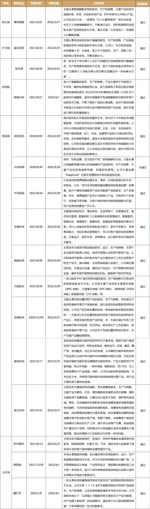
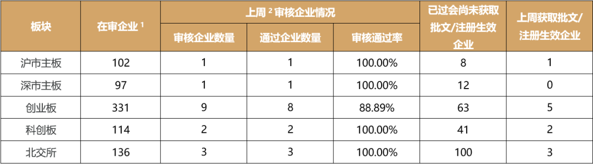
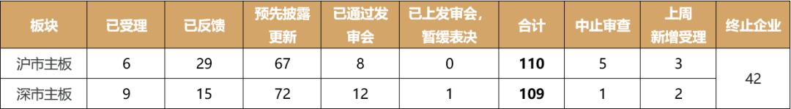
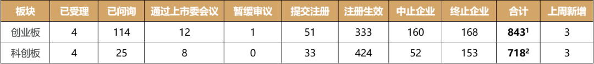
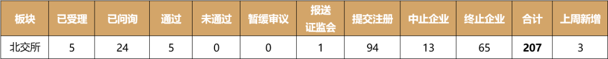
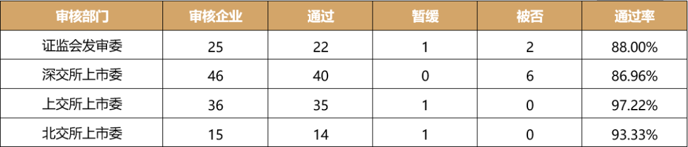
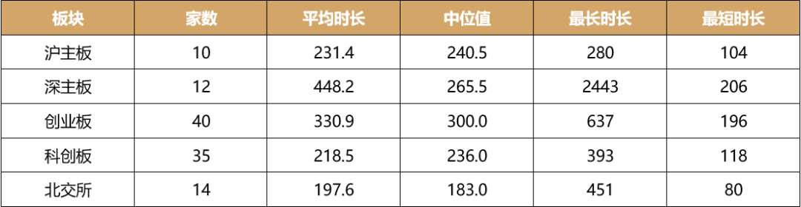
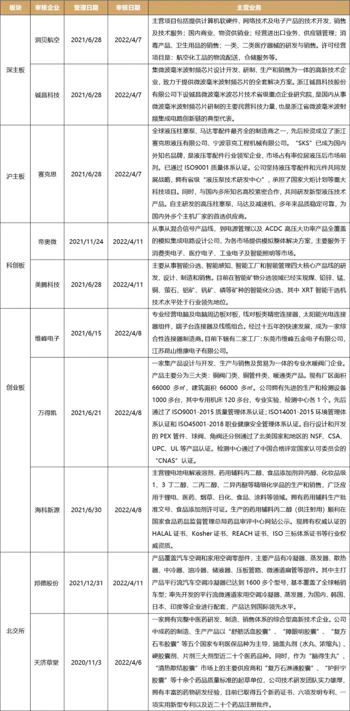
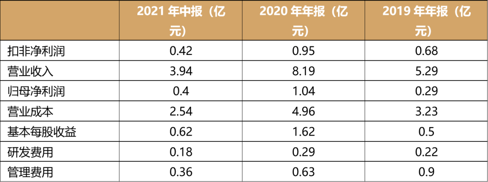

# 玖兆行研 | IPO审核周报

     

# 玖兆行研 | IPO审核周报

原创 经玖至兆为您投资 [玖兆投资](javascript:void(0);)

**玖兆投资** 

微信号 JZ\_CAPITAL

功能介绍 玖兆投资主要围绕硬科技、大健康领域开展投资，投资风格是“精品+赋能+重仓”，核心优势是“专业精深+价值投资+全面赋能”。前期筛选优质的投资项目，后续为被投资企业提供专业、全面、管家式的投行服务，进行深度赋能。

_2022-04-04 02:39_
收录于话题 #聚焦玖兆 54个

**IPO审核周报**

**一、****IPO审核概况**

**1.   上周IPO审核情况**

**IPO审核情况（2022/3****/****28-2022/4/2）**

注：上周沪主板1家，深主板1家，科创板2家，创业板9家，北交所3家，共16家企业上会。除创业板的九州风神未通过外，均获通过。

**2.   排队概况**

单位：家

注1：在审企业指审核状态为尚未上会的企业，包括暂缓审议、中止企业；

注2：上周指2022年3月28日至2022年4月2日，或2022年4月2日至文件截止日，下同。

**3.   申请企业具体情况**

根据证监会发布的《发行监管部沪市、深市主板首次公开发行股票企业基本信息情况表》（截至2022年3月31日），沪市、深市主板IPO申请企业情况如下：

单位：家

根据深交所、上交所披露信息，截至2022年4月2日，创业板、科创板IPO申请企业情况如下：

单位：家

注1：另有1家不予注册和9家终止注册；

注2：另有1家不予注册和18家终止注册。

根据北交所披露信息，截至2022年4月2日，北交所IPO申请企业情况如下：

单位：家

**4.   IPO审核通过率情况**

截至2022年4月2日，2022年度IPO审核通过率情况如下：

单位：家

注：二次上会按最终结果统计。

**5.   IPO审核流程时长**

截至2022年4月2日，2022年度过会企业受理日期至过会日的IPO审核流程时长情况如下：

单位：天

**6、本****周IPO审核安排**

**本****周IPO审核安排（****2022/4/6-2022/4/8****）**

注：本周沪主板1家，深主板2家，科创板2家，创业板3家，北交所2家，共10家企业上会。

**二、案例分析——九州风神IPO被否**

创业板上市委员会2022年第16次审议会议于2022年3月29日召开。审核结果显示，北京市九州风神科技股份有限公司（以下简称“九州风神”）首发未获通过。

**（一）****基本情况**

发行人主营业务是设计、研发和生产一系列高品质散热产品，包括各品类散热器、机电产品、以及消费电子类产品。

公司成立于2003年4月10日，注册资本6424.8万元，其主要控制股东之一夏春秋持有38.91%的股份份额，是公司的实际控制人兼法定代表人。

报告期内主要财务数据及财务指标情况如下：

**（二）问题分析**

公告显示，九州神龙创业板IPO被否，主要存在以下问题：

1. 境外销售收入占比较高且主要为经销收入。

2. 会计差错较多，涉及范围较广，且未能及时调整入账。同时，报告期内发行人存在使用个人银行账户收付与经营相关款项的情况。

3. 热管材料采购价格的变动幅度和铜价的变动幅度差异较大。

**上市委对此提出询问：**

1. 说明外销收入大幅增长的原因及合理性。

2. 说明国际形势变化对发行人的持续经营能力是否构成重大不利影响。

3. 说明报告期内相关内部控制制度建立情况及执行的有效性。

4. 说明热管材料采购价格波动和铜价波动差异大的原因及合理性。

招股书显示，九州风神主要从事以电脑散热器为核心的电脑硬件产品的研发、生产及销售，主要产品包括电脑散热器、机箱和电源等。招股书中部分段落中反映出公司约3/4的收入来源于境外。报告期各期间，九州风神的境外销售收入分别为30,356.94万元、39,008.65万元、61,765.95万元和29,981.86万元，占主营业务收入的比例分别为73.69%、74.11%、75.76%和76.52%。

九州神龙收入主要来自境外经销收入，且上会前该部分收入大幅增长。进一步查阅相关资料后，准确的情况是该公司四分之三收入来自于境外，20%收入来自于“俄乌”地区。查阅资料后发现公司前五大客户，俄罗斯客户占了三席，分别为俄罗斯DNS、俄罗斯INLINE和俄罗斯MER；对上述客户销售金额合计分别为：7,734.1万元、9,530.3万元和14,881.11万元；占整个收入的比例合计分别为18.7%、18.01%和18.17%。根据这一数据，可以肯定的是，若俄乌冲突长期持续，则很可能会影响到公司产品的最终销售，并进一步影响公司的经营业绩，进而对公司整体经营造成一定的影响。除此之外，俄乌冲突带来的欧美等国家和地区对俄制裁可能对俄罗斯及欧洲其他国家的民众消费能力等带来一定影响，从而影响公司产品的最终销售。因此，上市委针对这一点首先提出问询。

投资硬科技企业中的行业龙头、隐形冠军，重视投后赋能、陪伴企业成长……是玖兆投资一直在坚持的，我们期待与志同道合的伙伴建立联系、携手前行。

—END—

版权声明：玖兆投资除发布原创文章以外，致力于优质投资、投行和重点行业文章的精选、精读。部分文章推送时未能与原作者取得联系。若涉及版权问题，敬请原作者联系我们。如转载本公众号文章，须注明文章出处：公众号“玖兆投资”，如侵权发布，将按照相关规定处理。感谢您的支持和关注。

玖兆投资致力于为高净值投资人以及有实力的机构投资者打造财富管理生态圈，以价值投资理念和全新的投行思维，整合产业和金融资源，赋能优秀的企业和企业家，实现被投资企业股东利益和社会效益的最大化。玖兆投资专注于高端智能制造、人工智能大数据、新一代信息技术、新能源新材料、生物医药大健康等高成长的新兴产业的投资及并购，核心优势是“专业精深+价值投资+全面赋能”。

**玖兆投资**

 经玖至兆 为您投资

微信公众号ID ：JZ\_CAPITAL

预览时标签不可点

收录于话题 #聚焦玖兆
 54个
上一篇 玖兆行研 | IPO审核周报

喜欢此内容的人还喜欢

已投项目 | 银河水滴获得2021年度麒麟科学技术奖

已投项目 | 银河水滴获得2021年度麒麟科学技术奖

玖兆投资

不喜欢

不看的原因
确定

* 内容质量低

* 不看此公众号

**写留言**
[取消](javascript:;)

留言

**我的留言**

[写留言](javascript:;)

正在加载
展开我的留言
以上留言被精选后，将对所有人可见

**精选留言**

[写留言](javascript:;)

[写留言](javascript:;)

正在加载

已无更多数据

关闭
**写留言**
提交更多

正在加载

[表情](javascript:;)

正在加载

关闭
**留言**
更多

正在加载

正在加载

返回
**写回复**
回复更多

正在加载

: 

[表情](javascript:;)

正在加载

微信扫一扫
关注该公众号

[知道了](javascript:;)

 微信扫一扫
使用小程序

[取消](javascript:void(0);) [允许](javascript:void(0);)

[取消](javascript:void(0);) [允许](javascript:void(0);)

 ： ， 。  视频 小程序 赞 ，轻点两下取消赞 在看 ，轻点两下取消在看
原文链接：<https://mp.weixin.qq.com/s/2v8hzTt5rOpHF_7-rinwKQ>
