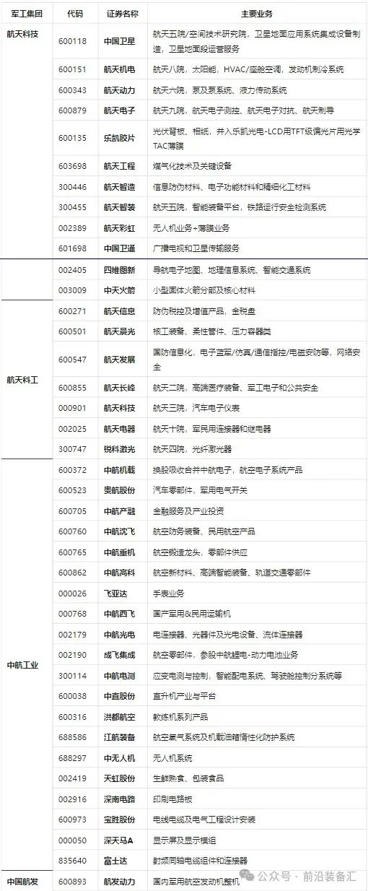
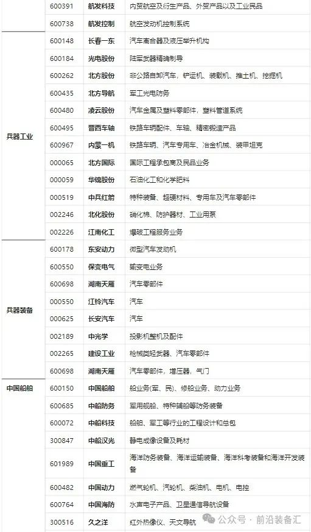
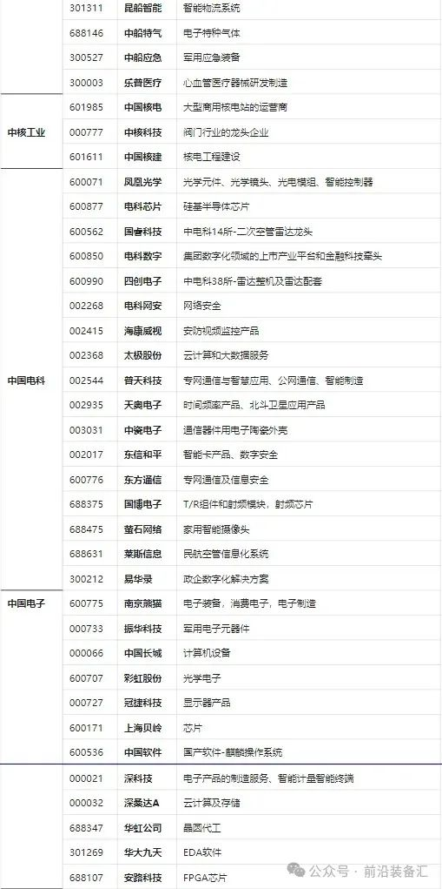

# 盘点：中国10大军工集团100家上市公司详细名单+产品！

# 盘点：中国10大军工集团100家上市公司详细名单+产品！

前沿装备汇 _2024-03-26 22:41_ _江苏_

近年来，在形势变化下军工企业也成了很多地方产业发展关注的对象，现选取兵器部整理的十大军工集团：航天科技、航天科工、中航工业、中国航发、兵器工业、兵器装备、中国船舶、中核工业、中国电科、中国电子， 所属的100家上市公司名单及主要业务供参考。

不足之处欢迎大家评论区补充~

来源  ✎ ****招商引资内参****

**全文完。感谢您的耐心阅读，请顺手点个"在看"吧~**

**免责声明：**本文根据转自网络。文章内容系原作者个人观点，本公众号转载仅为分享、传达不同观点，如有侵权或任何异议，欢迎联系我们删除！

**前沿装备汇精彩回顾**

[**重磅消息！军工保密三级资格取消！**](http://mp.weixin.qq.com/s?__biz=Mzg5NzU3NzcxNA==&mid=2247484457&idx=1&sn=82bdd35541fdec989d0cb6999080172c&chksm=c06ee3b4f7196aa24bbbdc9ad034ce63bec75878b0bccc7681ade217cbcb620622d46c3e6307&scene=21#wechat_redirect)

[**中国十大最顶尖军工集团**](http://mp.weixin.qq.com/s?__biz=Mzg5NzU3NzcxNA==&mid=2247488162&idx=1&sn=aa513e11b8fb9f3f666651a8e00a2814&chksm=c06ef53ff7197c29add2c4d5d6bc6be3fc1f513193a3c56769952ecb3a4e3e80587ebf69a4bc&scene=21#wechat_redirect)

[**全球十大新材料顶尖巨头**](http://mp.weixin.qq.com/s?__biz=Mzg5NzU3NzcxNA==&mid=2247488056&idx=1&sn=18730a35b73f47281f57c770e7ab4e9c&chksm=c06ef5a5f7197cb3042393fbb1d31795bf0ab58321f7bf2669736bcd4e794082b0bdb3b4b84a&scene=21#wechat_redirect)

[**全球十大最尖端的数控加工中心**](http://mp.weixin.qq.com/s?__biz=Mzg5NzU3NzcxNA==&mid=2247488040&idx=1&sn=11b823602b65dba413d9df32448dcbb3&chksm=c06ef5b5f7197ca311100da09b047cd8d0eb5c609dc2b7401f1023784643cfe654f5432461ab&scene=21#wechat_redirect)

[**盘点：最新军工资质相关变化汇总**](http://mp.weixin.qq.com/s?__biz=Mzg5NzU3NzcxNA==&mid=2247487943&idx=1&sn=34ae141fdf08def1f0a5994db1ec7fb5&chksm=c06ef65af7197f4c853c491f665b04521947af9b12d4cb8c77f7ddff7c2dc15d7eccc15569d2&scene=21#wechat_redirect)

[**捕捉军工黄金赛道：三大主线、十大产业**](http://mp.weixin.qq.com/s?__biz=Mzg5NzU3NzcxNA==&mid=2247486110&idx=1&sn=02ca3186af74ae4caa924924fc28e3fe&chksm=c06eed03f7196415d22d48ecbac64efb3d9c9b735c145826466308e36f0afce46bcd5a9d371a&scene=21#wechat_redirect)

[**谈军代表与装备技术状态管理监督**](http://mp.weixin.qq.com/s?__biz=Mzg5NzU3NzcxNA==&mid=2247486162&idx=1&sn=2097b8bc200be3f16e05d958c9f25054&chksm=c06eed4ff719645913b6b8907b7c6818b3e2a2e76ee379878ef8aa289a9a46b56f2728133aab&scene=21#wechat_redirect)

[**2021年军工行业：需求之变**](http://mp.weixin.qq.com/s?__biz=Mzg5NzU3NzcxNA==&mid=2247486065&idx=1&sn=9fc739091e28fac52c9e8ea9c9d730f3&chksm=c06eedecf71964fa2618f3738400d4dc2677c1c8647c00b793d148bb904eb78a0371e86d8364&scene=21#wechat_redirect)

[**军工“十四五”利好不断，一文看尽军工产业链**](http://mp.weixin.qq.com/s?__biz=Mzg5NzU3NzcxNA==&mid=2247486152&idx=1&sn=69720628de5571da07a4064a1e3dead1&chksm=c06eed55f7196443ff4fe8e8d25de7160f84a0ad4096e3a2949208ea4d90b1569fc13c3d7f2b&scene=21#wechat_redirect)

[**陆海空天一体化信息网络发展研究**](http://mp.weixin.qq.com/s?__biz=Mzg5NzU3NzcxNA==&mid=2247484434&idx=1&sn=c64b082b7bb604093d390218bc782026&chksm=c06ee38ff7196a99d21d5843feadb27d6ea9a9a08c9ab58338cc0ccb9ad119dcbfd42e745235&scene=21#wechat_redirect)

[**中美半导体全产业链实力对比（附中国和美国晶圆厂完整清单）**](http://mp.weixin.qq.com/s?__biz=Mzg5NzU3NzcxNA==&mid=2247484397&idx=1&sn=e93a12ad752399222837d1e669340d40&chksm=c06ee470f7196d66877e470f705c505af21d9c5f3a94b967d28ce71487e46b286000560d7b0f&scene=21#wechat_redirect)

[**集群无人机探测及对抗措施综述**](http://mp.weixin.qq.com/s?__biz=Mzg5NzU3NzcxNA==&mid=2247484351&idx=1&sn=4a008327be10d2ab076e84162c5f23f5&chksm=c06ee422f7196d34ae04882f32b35a7719a8bad76e925c876f4365e94d13cf55c813906d57ab&scene=21#wechat_redirect)

[**世界首次巡飞弹集群实战，以军战果惊人**](http://mp.weixin.qq.com/s?__biz=Mzg5NzU3NzcxNA==&mid=2247484966&idx=2&sn=0640ac397cee2566d541a8da687d4f18&chksm=c06ee1bbf71968ad02cc136316538b1a6d4b55835002e1f535752fc0ea0c25b42c7eebc8b682&scene=21#wechat_redirect)

[**未来智能化条件下作战需要经历四个发展阶段**](http://mp.weixin.qq.com/s?__biz=Mzg5NzU3NzcxNA==&mid=2247484928&idx=1&sn=edbffbd16f37d4a72a575937c099ae56&chksm=c06ee19df719688bbc07eac9fb3484c823d34e411c3128cc816e27a3689dfa05a0ede85964a6&scene=21#wechat_redirect)

[**临近空间防御作战拦截弹制导与控制关键技术综述**](http://mp.weixin.qq.com/s?__biz=Mzg5NzU3NzcxNA==&mid=2247484928&idx=2&sn=26c73458b07ded7a9a2ffeeb3c727b0a&chksm=c06ee19df719688b8ad8909b8656180a635f5be52274cf65095a6ddfba79058776c839c8d721&scene=21#wechat_redirect)

[**自主型地面无人战斗系统的发展方向**](http://mp.weixin.qq.com/s?__biz=Mzg5NzU3NzcxNA==&mid=2247484905&idx=1&sn=aacb1f39fde369022d90ee7d9148f29b&chksm=c06ee274f7196b6225e386c79cffa13793569fd9a5354b672f08367fb81fb3ddca76d56aa88f&scene=21#wechat_redirect)

[**空空导弹技术未来发展方向展望**](http://mp.weixin.qq.com/s?__biz=Mzg5NzU3NzcxNA==&mid=2247484905&idx=2&sn=db99003abb6e3ceeeeca30bf701935e4&chksm=c06ee274f7196b625284acc07185c010d02b477b42f0cbd3630ec3975d5b89d58652872d73b6&scene=21#wechat_redirect)

[**未来军事战争中的十大新概念武器排行榜**](http://mp.weixin.qq.com/s?__biz=Mzg5NzU3NzcxNA==&mid=2247484866&idx=1&sn=6bfebfc077d9a801cb77f57b12562e06&chksm=c06ee25ff7196b4960d58ab35b4e43931193204c3b5aa941e6cdcc56daba1efb38265f083740&scene=21#wechat_redirect)

[**96家！中央企业最新名录来了**](http://mp.weixin.qq.com/s?__biz=Mzg5NzU3NzcxNA==&mid=2247484849&idx=2&sn=c8e5d97a8ca41cb2885ef402c75652e0&chksm=c06ee22cf7196b3ab0ab1837343a1f0c531117756e2cc634260c473b03ba0e0a096c2f92db23&scene=21#wechat_redirect)

**[海军无人作战力量作战能力构成研究](http://mp.weixin.qq.com/s?__biz=Mzg5NzU3NzcxNA==&mid=2247484787&idx=2&sn=97e87c890a7ce098526a34c8a4728e83&chksm=c06ee2eef7196bf8d0e47247d8df91917c8d052190fe3456f59ca94b8b05b78f504ca93919f8&scene=21#wechat_redirect)**

**精彩内容长按二维码即可**关注****

**前沿装备汇                                    材料圈**

军工集团122
军工材料34
国防军工91
武器装备570
中航工业2

军工集团 · 目录

上一篇军工三大赛道投资全景图

素材来源官方媒体/网络新闻

微信扫一扫
关注该公众号

继续滑动看下一个

轻触阅读原文

前沿装备汇

向上滑动看下一个

当前内容可能存在未经审核的第三方商业营销信息，请确认是否继续访问。

继续访问取消
[微信公众平台广告规范指引](javacript:;)

知道了

微信扫一扫
使用小程序

取消 允许

取消 允许

： ， 。  视频 小程序 赞 ，轻点两下取消赞 在看 ，轻点两下取消在看 分享 留言

全部表情

删除

,

关闭
**选择留言身份**
更多

**前沿装备汇**
盘点：中国10大军工集团100家上市公司详细名单+产品！

人划线

该账号因违规无法跳转
