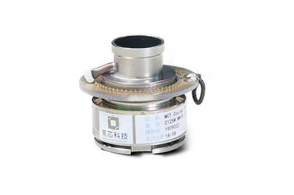
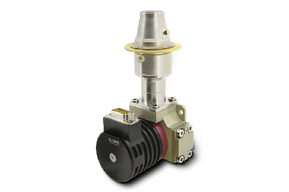
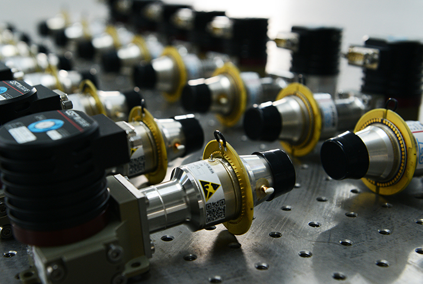

# 碲镉汞制冷红外探测器详解-原理科普-高芯科技

wap导航菜单
 [!unknown_filename.2.png(.__resources_碲镉汞制冷红外探测器详解-原理科普-高芯科技.resources_unknown_filename.2.png) !unknown_filename.7.png(.__resources_碲镉汞制冷红外探测器详解-原理科普-高芯科技.resources_unknown](/) 

 

* [首页](/)

* [产品中心](cp_12/48.html)
	
	*  [!unknown_filename.14.png(.__resources_碲镉汞制冷红外探测器详解-原理科普-高芯科技.resources_unknown_filename.14.png) 查看详情__非制冷红外探测器](/products-ir-detector/wlp.html)
	*  [!unknown_filename.9.png(.__resources_碲镉汞制冷红外探测器详解-原理科普-高芯科技.resources_unknown_filename.9.png) 查看详情__非制冷红外机芯组件](/products-ir-module/timo.html)
	*  [!unknown_filename.5.png(.__resources_碲镉汞制冷红外探测器详解-原理科普-高芯科技.resources_unknown_filename.5.png) 查看详情__制冷红外探测器](/products-ir-detectors/mct.html)
	*  [!unknown_filename.15.png(.__resources_碲镉汞制冷红外探测器详解-原理科普-高芯科技.resources_unknown_filename.15.png) 查看详情__制冷红外机芯组件](/products-ir-modules/eyas/html)
	
* [行业应用](/solution/thermography.html)
	
	* [!unknown_filename.13.png(.__resources_碲镉汞制冷红外探测器详解-原理科普-高芯科技.resources_unknown_filename.13.png)__ 红外测温](/thermography.html)
	* [!unknown_filename.12.png(.__resources_碲镉汞制冷红外探测器详解-原理科普-高芯科技.resources_unknown_filename.12.png)__ 安防监控](/security-monitoring.html)
	* [!unknown_filename.16.png(.__resources_碲镉汞制冷红外探测器详解-原理科普-高芯科技.resources_unknown_filename.16.png)__ 消防救援](/firefighting-rescue.html)
	* [!unknown_filename.4.png(.__resources_碲镉汞制冷红外探测器详解-原理科普-高芯科技.resources_unknown_filename.4.png)__ 无人机载荷](/uavs-payload.html)
	* [!unknown_filename.1.png(.__resources_碲镉汞制冷红外探测器详解-原理科普-高芯科技.resources_unknown_filename.1.png)__ 个人视觉](/personal-vision.html)
	* [!unknown_filename.3.png(.__resources_碲镉汞制冷红外探测器详解-原理科普-高芯科技.resources_unknown_filename.3.png)__ 智能驾驶](/adas.html)
	* [!unknown_filename.17.png(.__resources_碲镉汞制冷红外探测器详解-原理科普-高芯科技.resources_unknown_filename.17.png)__ 物联网](/aiot.html)
	* [!unknown_filename.6.png(.__resources_碲镉汞制冷红外探测器详解-原理科普-高芯科技.resources_unknown_filename.6.png)__ 气体泄漏检测等](/others.html)
	
* [资讯中心](/news.html)
* [探索红外](/discover-theory.html)
* [服务支持](/service-support.html)
* [关于高芯](/about-us.html)
* [联系我们](/contact-us.html)
[中](/) [EN](https://www.gst-ir.net/)

当前位置： [首页](/)\>[探索红外](/discover-theory.html)\>[原理科普](/hw_24.html)

## 碲镉汞制冷红外探测器详解

### 2022-08-05 11:28:34

[制冷红外探测器](https://www.gst-ir.com/products-ir-detectors/mct/html)的敏感材料碲镉汞（Hg1-xCdxTe）属于带隙可调半导体材料，通过调节Cd组分变化，波长能够完全覆盖短波，中波，长波和甚长波等整个红外波段。碲镉汞红外探测器通过吸收外来光子产生的电子跃迁为带间跃迁，材料光吸收大，量子效率高，高达70%～80%，器件光响应大、响应率高。另外，碲镉汞材料电子有效质量小，迁移率高，响应速度快，可作高频器件，以上优点使之成为一种最重要的红外探测器材料。

20世纪60年代末70年代初，出现了第一代HgCdTe光导探测器。元数在103元以下，有线列和小面阵结构，线阵列HgCdTe光导探测器使得长波[红外热成像](https://www.gst-ir.com/)设备可以只用一级制冷引擎工作，系统紧凑、轻便而且能量消耗相当小。

20世纪70年代末以及整个80年代，红外探测器逐渐向低功耗、高阻抗、大阵列等方向发展，出现了第二代红外焦平面阵列系统。该系统可提供较大的二维阵列，规模在103～106元，不仅可以用于线阵扫描成像，而且可以用于方形和矩形阵列。代表产品有：4×240元、4×480元、256×256元和320×240元碲镉汞红外探测器等。

碲镉汞红外探测器缺点也是非常明显的。碲镉汞是一种主要由离子键结合的三元半导体材料，离子键互作用力小。元素汞非常不稳定，容易从碲镉汞材料中逸出从而造成材料的缺陷、材料的不均匀以及器件性能的不均匀，这一缺点在长波应用时尤其突出。另外一个主要问题是碲镉汞薄膜材料生长的外延衬底问题，获得更大尺寸的衬底和碲镉汞材料，必须考虑替代衬底以及晶格不匹配带来的质量问题。

随着技术升级，分子束外延法或金属有机化合物气相沉积法等技术可以制得复杂的HgCdTe多层异质结材料，这更有利于第三代双色、多色红外光电探测器以及新结构探测器的发展。

上一篇：[红外探测器发展历程](/hw_24/420.html)
下一篇：[量子阱红外探测器](/hw_24/423.html)

[!icon-gotop.png(_template_gaoxin_html_static_images_icon-gotop.png)__置顶](javascript:;)

红外探测器
[晶圆级封装非制冷红外探测器](/products-ir-detector/wlp.html)
[陶瓷封装非制冷红外探测器](/products-ir-detector/372.html)
[金属封装非制冷红外探测器](/products-ir-detector/m.html)
[MCT制冷红外探测器](/products-ir-detectors/mct.html)
[T2SL制冷红外探测器](/products-ir-detectors/t2sl.html)
[低温制冷机](/products-ir-detectors/cryocooler.html)

红外机芯
[TIMO红外微型模组](/products-ir-module/timo.html)
[COIN系列红外机芯](/products-ir-module/coin.html)
[TWIN系列红外机芯](/products-ir-module/373.html)
[PLUG热成像机芯](/products-ir-module/plug-imaging.html)
[PLUG测温机芯](/products-ir-module/plug-thermography.html)
[iLC消费级红外机芯](/products-ir-module/iLC.html)
[iTL612红外无人机机芯](/products-ir-module/iTL.html)
[iHA红外医疗机芯](/products-ir-module/medical.html)
[iDAS红外车载机芯](/products-ir-module/N-driver.html)
[EYAS系列制冷红外AD模组](/products-ir-modules/eyas.html)
[GAVIN系列制冷红外机芯](/products-ir-modules/gavin.html)
[GAS系列气体泄漏检测产品方案](/products-ir-modules/gas.html)

行业应用
[红外测温](/thermography.html)
[安防监控](/security-monitoring.html)
[消防救援](/firefighting-rescue.html)
[无人机载荷](/uavs-payload.html)
[个人视觉](/personal-vision.html)
[智能驾驶](/adas.html)
[物联网](/aiot.html)
[气体泄漏检测等](/others.html)

[联系我们](/contact-us.html)
市场部热线：400-027-0198
市场部Email：[marketing@gst-ir.com](mailto:marketing@gst-ir.com)
人力资源部热线：027-81298264
人力资源部Email：[hr@gst-ir.com](mailto:hr@gst-ir.com)
采购部热线：027-81298304
采购部Email：[purchase03@gst-ir.com](mailto:purchase03@gst-ir.com)
地址： 武汉市东湖开发区黄龙山南路6号，430205

[联系我们](/contact-us.html)
市场部热线：400-027-0198
市场部Email：[marketing@gst-ir.com](mailto:marketing@gst-ir.com)
人力资源部热线：027-81298264
人力资源部Email：[hr@gst-ir.com](mailto:hr@gst-ir.com)
采购部热线：027-81298304
采购部Email：[purchase03@gst-ir.com](mailto:purchase03@gst-ir.com)
地址： 武汉市东湖开发区黄龙山南路6号，430205

Wuhan Global Sensor Technology Co., Ltd

武汉高芯科技有限公司

[鄂ICP备:17003437号-1](https://beian.miit.gov.cn/)

原文链接：<https://www.gst-ir.com/hw_24/421.html>
