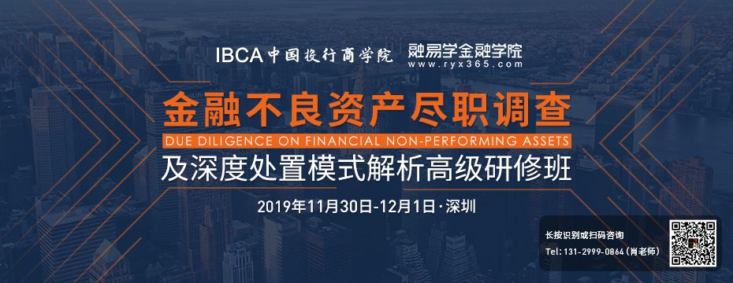
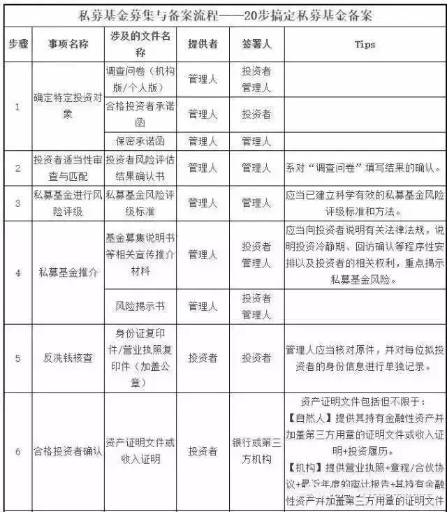
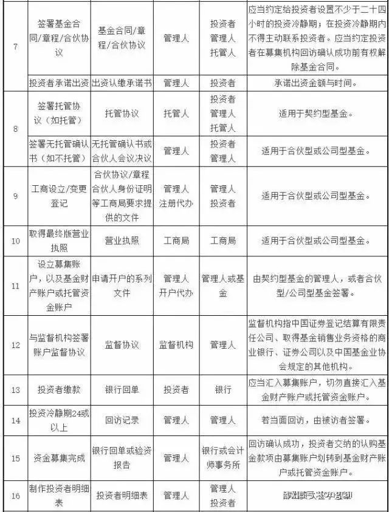
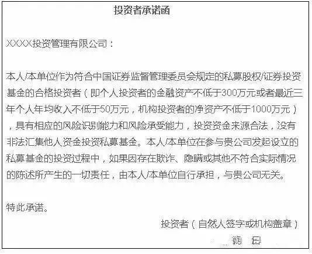
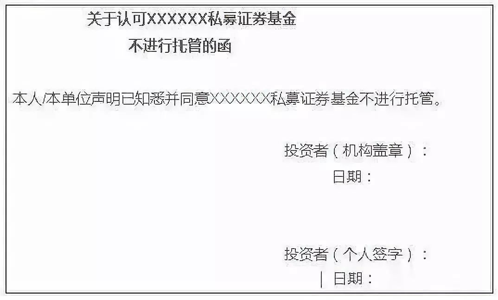
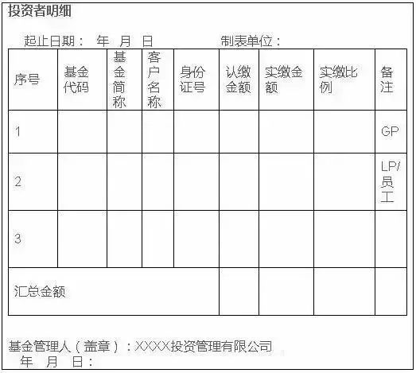
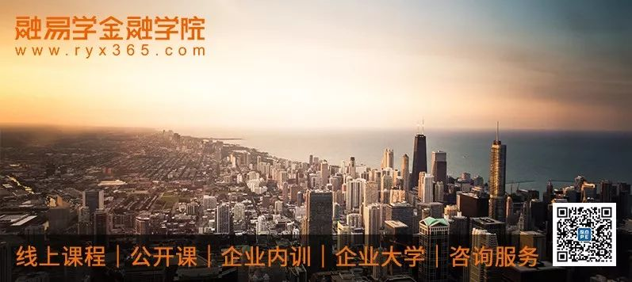

# 私募基金备案流程全套流程（好文，整理得太好了！）

     

# 私募基金备案流程全套流程（好文，整理得太好了！）

[整点金融](javascript:void(0);)

**整点金融** 

微信号 gh\_441d33d95918

功能介绍 融易学旗下平台，专注银行、资管行业学习指导。最新银行营销、金融科技、不良资产、ABS等政策资讯，分享行业调研报告，每月课程&考证培训，银行资管从业者必备。【现在关注免费获取1000+银行报告】

_2019-11-04 10:39_

收录于话题

来源：中国投行俱乐部

基金产品备案需要准备的文件及模板

**一、营业执照/主体资格证明文件——合伙型、公司型基金备案必备文件**

只有合伙型、合作型、公司型的基金产品，中基协的系统会要求上传此项文件，契约型基金不需要上传，因为契约型基金不存在组织结构。需要明确的是，这里要上传的是基金产品的营业执照，而非基金管理人的营业执照。我们一直认为在营业执照上传这个问题上，应该不存在什么疑问，但的确有基金管理人在基金备案系统，上传了基金管理人的营业执照而遭遇了中基协的反馈。

**二、《基金招募说明书》——非备案必备文件**

《基金招募说明书》是投资者了解基金的最基本也是最重要的文件之一，是投资前的必读文件。但在基金备案系统内，《基金招募说明书》之后有个不适用的选项，属于非必须上传的文件，可以在系统内选择不适用。

**三、《基金风险揭示书》——备案必备文件**

《私募投资基金监督管理暂行办法》第十六条明确要求：私募基金管理人自行销售私募基金的，应当采取问卷调查等方式，对投资者的风险识别能力和风险承担能力进行评估，由投资者书面承诺符合合格投资者条件；应当制作风险揭示书，由投资者签字确认。

中基协于2016年4月15日发布了《私募投资基金募集行为管理办法》，同时发布了《私募投资基金投资者风险问卷调查内容与格式指引(个人版)》及《私募投资基金风险揭示书与格式指引》

参考网址：http://www.amac.org.cn/xhdt/zxdt/390479.shtml

**四、《投资者承诺函》——备案必备文件**

《基金风险揭示书》与《投资者承诺函》，均需要提交所有投资者签字的文件，如果有5个投资者，就要5份全部上传。我们有些客户在有多个投资者的情况下，会只上传一个投资者签署的承诺函，这就会遭遇中基协的反馈意见。应当将所有投资者签字的文件扫描在一个PDF文档内上传。

投资者承诺函参考模板：

**五、《机构承诺函》——备案必备文件**

这是需要基金管理人出具的承诺函，并且会因为管理股权类或证券类产品的不同，而有细微差别。

机构承诺函参考模板：

**六、募集规模证明/实缴出资证明——备案必备文件**

募集规模证明包括：

托管人开具的资金到账证明，或会计师事务所开具的验资证明，或银行对账单（并加盖银行公章），或工商登记调档材料等第三方出具的证明。

现在对网上银行、手机银行的使用非常广泛，这里的实缴出资证明并非一定要银行加盖公章的纸质稿文件，网上银行的截屏也同样能够通过中基协的审核，但是要注意，截屏的内容中必须要包含银行的电子章。我们有个客户，就是在截屏的时候，截取了不包含银行电子章的页面而遭遇了反馈。

**七、基金合同/合伙协议/公司章程——备案必备文件**

在进行基金产品备案时，最重要也是最容易遭遇反馈的文件就是基金合同。2016年4月18日，中基协正式发布酝酿已久的基金合同指引，指引分契约型、公司型、合伙型三类，分别采取了不同的指引方式。

因此，在制作公司章程/合伙协议/基金合同时，要对应具体的合同指引要求，对文件进行制作。

合同指引的参考网址：http://www.amac.org.cn/xhdt/zxdt/390510.shtml

**八、《委托管理协议》——非备案必备文件**

《委托管理协议》非必须上传的文件，可以在系统内选择不适用。举个需要上传《委托管理协议》的情况：合伙型基金产品的GP并未担任基金管理人，而外聘了基金管理人对基金进行管理。

**九、《托管协议》——非备案必备文件**

不论是证券类基金还是股权类基金，都可以选择不托管。如果基金选择不托管，经常会遭遇中基协的一类反馈意见，即要求上传所有投资者签署的《无托管协议》，《无托管协议》中需要明确说明“本基金无托管”。按照基金合同指引，无托管的基金产品，需要在基金合同内说明私募基金财产安全的制度措施以及纠纷解决机制。

《不托管的函》参考模板：

**十、销售归集/托管账户信息——备案必备文件**

这对基金产品备案提出了两个要求，一是已经开好专户，二是募集资金已经进入专户。在有托管或者PB综合托管业务的情况下，需要开托管账户和销售归集两个账户，如果没有托管和外包业务，只要开一个销售归集账户即可。

**十一、《投资者明细》——备案必备文件**

《投资者明细》包括序号，姓名/机构名称，证件号码，认缴金额，实缴金额，汇总金额，备注；备注包括GP/LP，优先/劣后，是否是管理人或员工跟投。汇总金额应当与登记备案系统填报的实缴金额一致。同时只需要基金管理人加盖机构公章，不需要投资者再次签字。

投资者明细参考模板：

**十二、对销售业务的管理制度——备案必备文件**

**十三、对份额登记业务的管理制度——备案必备文件**

以上两项文件，可直接提供基金管理人的内控制度文件，并要加盖基金管理人公章。

**附 常见产品备案被拒绝的原因及整改方法：**

**被拒绝原因一：****请填写正确的基金全称**

整改方法：基金全称应与合同中的名称完全一致。

**被拒绝原因二：****请填写正确的管理类型**

整改方法：可以选择的管理类型有三种，分别是受托管理、自我管理和顾问管理。自我管理指以有限责任公司、股份有限公司形式设立的公司型基金，通过组建内部管理团队实行自我管理，该公司型基金也应当履行管理人登记手续。受托管理指采取委托管理方式将资产委托私募基金管理人进行管理。

顾问管理指私募基金管理人通过担任投资顾问的方式为信托公司、券商资管、QFII等管理资产。

**被拒绝原因三：****请上传所有投资者签字的风险揭示书**

整改方法：将所有投资者签字的风险揭示书扫描在一个PDF文档内上传。

被拒绝原因四：请上传募集规模证明。

整改方法：募集规模证明包括托管人开具的资金到账证明，或会计师事务所开具的验资证明，或银行对账单（并加盖银行公章），或工商登记调档材料等第三方出具的证明。

**被拒绝原因五：****请管理人出具基金是否募集完毕及是否继续对外募集的说明。**

整改方法：管理人如实出具上述说明，签章确认并上传至其他问题处。

**被拒绝原因六：****本基金的合伙人信息与工商注册信息存在不一致。**

整改方法：能变更的情况下完成变更后重新备案，暂时无法变更的由所有合伙人出具承诺函，承诺三个月之内完成整改，并将签章确认的承诺函上传至其他问题处。

**被拒绝原因七：****请XXX投资者实缴满足100万后再来备案。**

整改方法：根据证监会于2014年8月21日公布《私募投资基金监督管理暂行办法》第十二条，私募基金的合格投资者是指具备相应风险识别能力和风险承担能力，投资于单只私募基金的金额不低于100万元的单位和个人，故每个投资者的投资额度最低不能少于100万。

**被拒绝原因八：****请对外募集后再到协会备案。**

整改方法：基金产品必须要有外部投资者，基金管理人直投或者基金产品仅为基金管理人及其工作人员认购，中基协不予备案。

**被拒绝原因九：****请上传投资者明细表并加盖私募基金管理人公章。**

整改方法：投资者明细包括序号，姓名/机构名称，证件号码，认缴金额，实缴金额，汇总金额，备注；备注包括GP/LP，优先/劣后，是否是管理人或员工跟投。汇总金额应当与登记备案系统填报的实缴金额一致。

**被拒绝原因十：****若基金产品无托管，请上传所有投资者签署的无托管协议。**

整改方法：在管理人认为需要说明的其他问题里说明，合同中明确本产品无托管及保障私募基金财产安全的制度措施和纠纷解决机制的相关章节，同时上传所有投资者签署的无托管协议，无托管协议中明确说明“本基金无托管”。

**被拒绝原因十一：****请管理人确认首轮募集是否结束，并上传投资项目情况表至其他问题处。**

整改方法：在其他问题处对首轮募集情况进行说明，例如“XXXX基金首轮募集资金已经到位，暂不对外进行募集”，出具说明并加盖基金管理人公章，将PDF扫描件同投资项目表一起上传至其他问题处。

**被拒绝的原因十二：****请投资者中的基金备案通过后再次提交。**

整改方法：若投资者中有基金，该基金需通过备案才可成为合格投资者，且该基金投资的基金才能进行备案

注：本文不代表整点金融任何立场，仅供参考！图文如涉及版权问题请及时在后台联系，将第一时间处理。

* * *

**只讲实战的金融学院，**中国金融新型人才黄埔军校先行者，是金融中优先提出线上SaaS企业大学及线下学习方案的提供商。学院提供线上课程、线下公开课，企业内训、企业大学SaaS系统定制、咨询顾问等五大专业服务。

**当前已****沉淀了6000+线上课程，拥有800+金融名师智库，并覆盖金融用户达300000****+。****全年举办1000+线下高质量行业培训和丰富的线下活动包括：**大型论坛、专题沙龙、政企闭门会议、企业走访等，输送优秀行业人才上万人

## **基金干货学习**

[私募基金登记备案问题](http://mp.weixin.qq.com/s?__biz=MzA5OTM4MjIxOQ==&mid=2650242809&idx=1&sn=75d2af5db4911247ed90d992cc43b99c&scene=21#wechat_redirect) | [基金从业资格全国统一考试大纲](http://mp.weixin.qq.com/s?__biz=MzA5OTM4MjIxOQ==&mid=2650242982&idx=2&sn=e169521cf3a1484eb303bfc2b48e3fc7&scene=21#wechat_redirect) | [中国私募股权基金发展的十个趋向](http://mp.weixin.qq.com/s?__biz=MzA5OTM4MjIxOQ==&mid=2650243197&idx=2&sn=f6dce2f1a774bbdb3a66dcf09a3e8bec&scene=21#wechat_redirect) | [揭秘私募基金的78个问题](http://mp.weixin.qq.com/s?__biz=MzA5OTM4MjIxOQ==&mid=2650242975&idx=2&sn=37f1d38e0da3a0ccb45a43cda75848a5&scene=21#wechat_redirect) | [全国各地私募税收优惠政策及使用解析](http://mp.weixin.qq.com/s?__biz=MzA5OTM4MjIxOQ==&mid=2650243037&idx=2&sn=1f763aa304633c357cacc37204c1e8dc&scene=21#wechat_redirect) | [私募基金运营及合规要点全梳理](http://mp.weixin.qq.com/s?__biz=MzA5OTM4MjIxOQ==&mid=2650243223&idx=2&sn=95649caaa6ed4e0b4f65b400926c27d1&scene=21#wechat_redirect) | [PE对赌条款诠释](http://mp.weixin.qq.com/s?__biz=MzA5OTM4MjIxOQ==&mid=2650243221&idx=2&sn=2569e351f3399ef49191c00579b4aaa9&scene=21#wechat_redirect) | [股权转让的40个关键问题](https://mp.weixin.qq.com/s?__biz=MzA5OTM4MjIxOQ==&mid=2650245796&idx=1&sn=33b395d1c96afb6e09c361796242f25a&chksm=88800c00bff78516deda81878ff4437715f733ad9ee677b0a4114b08d0f72dc1f304963c26a9&scene=21#wechat_redirect) | [私募基金管理人设立要点](https://mp.weixin.qq.com/s?__biz=MzA5OTM4MjIxOQ==&mid=2650244772&idx=2&sn=abb6ef348565a1eb9a902b89e4885ae1&chksm=88800000bff789162c5ee4a8b70bd78fa7e87a5242f16735f412ee9411e2883f62159b5aa26c&scene=21#wechat_redirect) | [私募基金分类全解析](https://mp.weixin.qq.com/s?__biz=MzA5OTM4MjIxOQ==&mid=2650244677&idx=2&sn=3d991839d5db9e5f8d73a8da7d1d7b42&chksm=888000e1bff789f76edce81d20eb6cd972330dc3dbc947cb08bfa30d2b61a658ec05a4f8c776&scene=21#wechat_redirect) | [私募股权投资基金综合知识汇总](https://mp.weixin.qq.com/s?__biz=MzA5OTM4MjIxOQ==&mid=2650245027&idx=2&sn=8b06808131d092d3c732b7fbecb61731&chksm=88800107bff78811c4c63b1c2195174120649ea30d1b1147ef1364be4ab72734e2ab012a7f67&scene=21#wechat_redirect) | [夹层基金的结构、LP和投资模式（附案例）](https://mp.weixin.qq.com/s?__biz=MzA5OTM4MjIxOQ==&mid=2650245787&idx=1&sn=0536184a7552e26b40139985ee7db86f&chksm=88800c3fbff785295aa844870494037bbe358b57e5c5c2516a13c8c8d9f7db6a2c3af165a364&scene=21#wechat_redirect) | [（PE）设立、运营与交易结构相关实务](https://mp.weixin.qq.com/s?__biz=MzA5OTM4MjIxOQ==&mid=2650244793&idx=1&sn=1babf0b5f6395f08cb9e98fef0c9e876&chksm=8880001dbff7890b780e5a2b44d6a3799c874e4e2996e289d67288a4bffe3a3ea44921827e6c&mpshare=1&scene=21&srcid=11069MFj6F4OjOLgc2tpboMo#wechat_redirect) | [并购基金的投资要素梳理及并购基金的退出方式解析](https://mp.weixin.qq.com/s?__biz=MzA5OTM4MjIxOQ==&mid=2650244817&idx=2&sn=ee3cd3cea02287863ff9a788e0f442c9&chksm=88800075bff78963df594a5cddc9ebc51273f6f0897e86a20b2ca9d2ff5199fc0725d24c5367&mpshare=1&scene=21&srcid=110659DGdffE8p2JDfirnz1H#wechat_redirect) 

注：查看更多基金相关干货可点击菜单栏精选文章或查看每天推送的第三篇文章

预览时标签不可点

收录于话题 #
 个
上一篇 下一篇

[阅读原文](javascript:;)

喜欢此内容的人还喜欢

揭秘！中级经济师到底还要不要考？

揭秘！中级经济师到底还要不要考？

...

整点金融

不喜欢

不看的原因
确定

* 内容质量低

* 不看此公众号

**写留言**
[取消](javascript:;)

留言

**我的留言**

[写留言](javascript:;)

正在加载
展开我的留言
以上留言被精选后，将对所有人可见

**精选留言**

[写留言](javascript:;)

[写留言](javascript:;)

正在加载

已无更多数据

关闭
**写留言**
提交更多

正在加载

[表情](javascript:;)

正在加载

关闭
**留言**
更多

正在加载

正在加载

返回
**写回复**
回复更多

正在加载

: 

[表情](javascript:;)

正在加载

微信扫一扫
关注该公众号

[知道了](javascript:;)

 微信扫一扫
使用小程序

[取消](javascript:void(0);) [允许](javascript:void(0);)

[取消](javascript:void(0);) [允许](javascript:void(0);)

 ： ， 。  视频 小程序 赞 ，轻点两下取消赞 在看 ，轻点两下取消在看
原文链接：<https://mp.weixin.qq.com/s/A2-tMeFBZepxJtL5oLyVEw>
