# 科兴疫苗的瓜，心虚开始赔偿受害者了？

     

# 科兴疫苗的瓜，心虚开始赔偿受害者了？

[吃瓜迷](javascript:void(0);)

**吃瓜迷** 

微信号 chiguami

功能介绍 爆最猛的料，吃最新的瓜。备用号：瓜逼逼

_2022-06-05 04:02_ _发表于广东_

收录于合集

#科兴 1 个
#疫苗 1 个
#吃瓜 17 个

**灰产圈**
互联网黑灰产业链调查揭秘，创始于2017
159篇原创内容

公众号

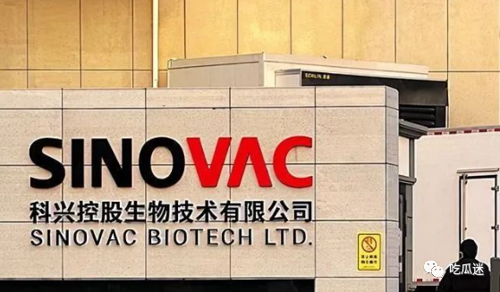

> 国内新冠疫苗的龙头之一科兴生物，近年来可谓是风波不断！

疫情爆发带来的经济影响仍在不断蔓延，国内各行各业都是一片“哀嚎声”，就连顺势而上的生物制药行业，风口过后似乎也陷入了“艰难期”。

**Vol****.1**

5月22日，多家自媒体先后发布了《关于北京科兴生物违法犯罪的举报信》

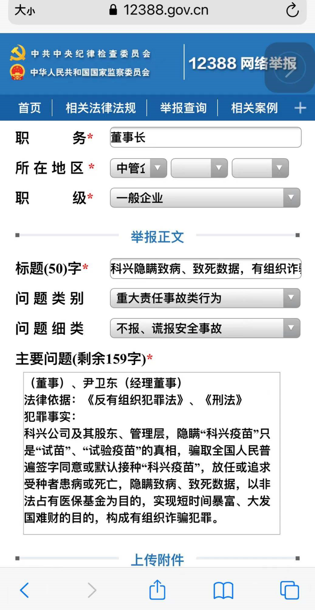

其内容是：

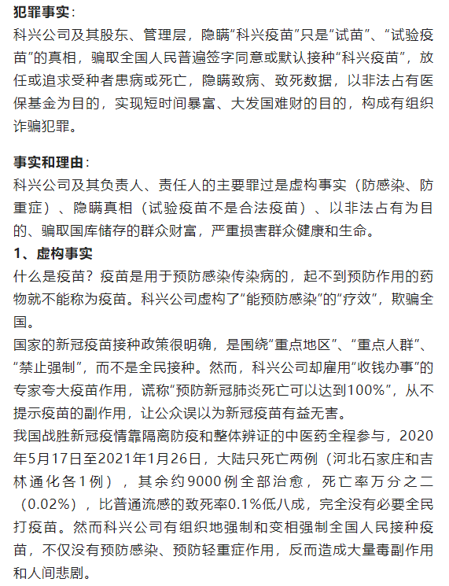

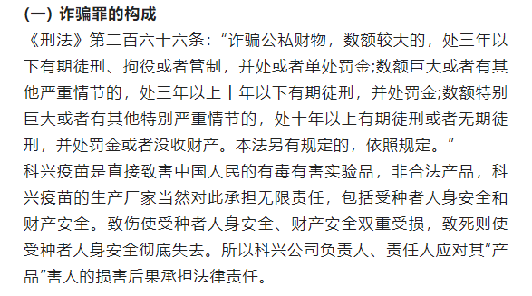

向下滑动查看

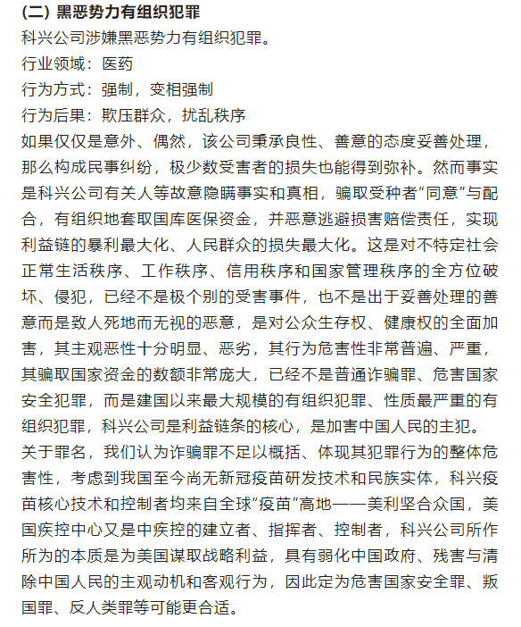

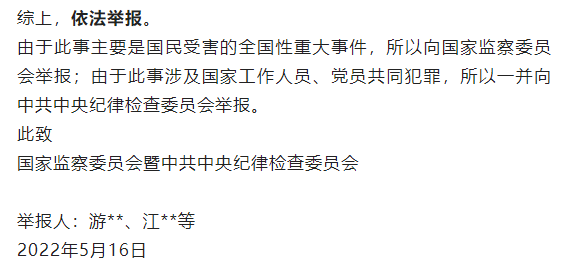

向下滑动查看

尽管举报信所说的并没有给出强有力的证据，很多自媒体发布的内容也遭到了删除，但质疑之声却从未消失。

目前为止，科兴生物仍然没有作出相关回应。不过显然，拿出强有力的证据证明其疫苗的保护力，已是势在必行。

**Vol****.2**

疫苗保护力到底是多少？

可以肯定地是，科兴的成功，首先要归因于它选择了灭活技术路线。灭活疫苗最传统和常用的疫苗制备技术，科兴在制备灭活病毒疫苗的基础也比较好，曾先后研制出全球第一支SARS冠状病毒灭活疫苗（完成I期临床研究）、中国第一支大流行流感（H5N1）疫苗以及全球第一支甲型H1N1流感疫苗。

2021年12月15日，新加坡国家传染病中心与卫生部发出的联合文告指出，研究证实，比起接种两针辉瑞或莫德纳疫苗，接种两针科兴疫苗对于预防德尔塔冠病毒株引起的重症，保护力更低。

此前，智利的一项研究发现，当第一剂接种完成后，在接种第一剂与第二剂间隔的28天内，保护力仅3%。也就说，在这一阶段，疫苗几乎没有保护效力。接种第二剂疫苗2周后，疫苗保护接种者的有效性提高为56.5%；而在2周内则为27.7%。

如今，新冠病毒依然在不断变异，面对奥密克戎变异新冠病毒进化出BA.1、BA.2、BA.4、BA.5、BA.2.12.1等多种亚型，科兴疫苗的有效性到底是多少？

对于这个问题，去年净赚了560亿元的科兴生物，得亲自给出一个让人安心的交代。

**Vol****.3**

“裁员门”事件

5月5日，有自称是科兴中维员工在北京市公共法律服务网上留言，称科兴中维为了降低赔偿金额，恶意扣押员工2021年年终奖，恶意减少辞退赔偿金。该消息一出不禁让群众为之愕然。

要知道该员工所在的科兴，正是借着新冠东风，A股横空出世的最大“黑马”。国家卫健委数据显示，截至2022年5月19日，31个省（自治区、直辖市）和新疆生产建设兵团累计报告接种新冠病毒疫苗336772万剂次。

如此高的接种率，对新冠疫苗有着的庞大需求。那么供应新冠疫苗的企业中，科兴生物为主力之一，自然收获颇丰。2021年，科兴实现营收193.75亿美元（约合1280亿元），同比增长3694%，净利润144.59亿美元（约980亿人民币），同比增长7708%。

作为对比，2021年中国石油的净利润为921亿元，科兴去年的净利润比中国石油还要高，如果将A股数千家上市公司的2021年净利润做个排名，科兴生物能排名第8。

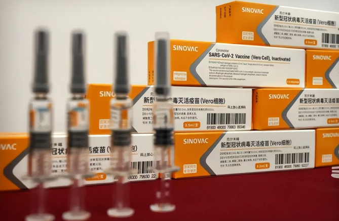

在如此优异的业绩表现面前，却曝出了“裁员门”事件，源头是科兴生物旗下的子公司科兴中维，它也是研发新冠疫苗的主要机构。

5月5日，有网友在北京市公共法律服务网站上留言称：其于2021年2月1日入职北京科兴中维，公司口头承诺将本年度10%收益作为年终奖；但2022年年会时，公司却以“科兴风头太大，要低调”为借口，延缓发放年终奖；此后其被通知裁员，且年终奖也不予发放。

据被裁员工透露，今年以来，科兴中维总共裁了将近一千人，基本都是生产线员工，其中，配比、分装、包装是裁员的重灾区。

很多网友都表示自己有同样的遭遇：

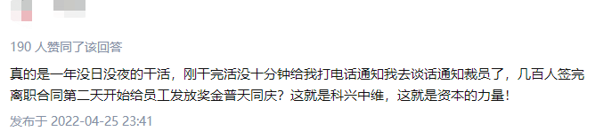

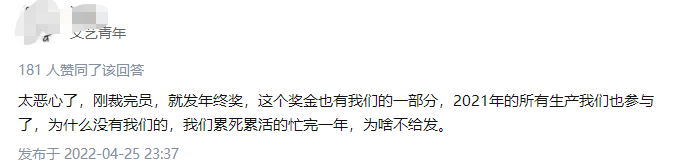

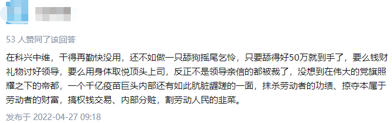

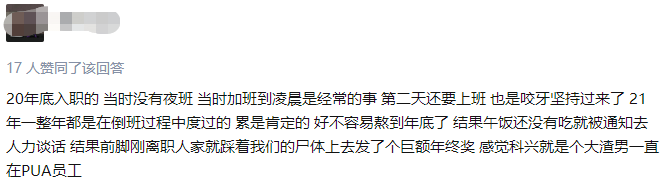

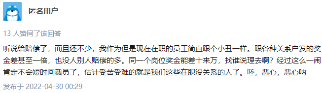

甚至有网友发帖称，“卸磨杀驴这个成语被体现到了极致。”但是，近赚千亿的公司做出这些事是不是有些过于让人寒心呢？有句话说的非常好：高尚是高尚者的墓志铭，卑鄙是卑鄙者的通行证！科兴中维这波操作属实让人费解！

如果真按照离职员工所说，科兴生物承诺 “拿出本年度10%收益作为年终奖”的话，则需要拿出的奖金数应是数十亿元。为何裁员那显而易见了！

**Vol****.4**

创始人背后的渊源

科兴生物的股权结构十分国际化，第一大股东是软银集团控制的赛富亚洲基金，占股15.07%；第二大股东为CEO尹卫东，持股8.89%；第三到第五大股东分别是鼎晖投资、永恩国际以及维梧资本。也就是说，虽然科兴生物是一家中国本土企业，但享受它成长红利的，大多是海外资本机构。

科兴生物的两位创始人，一个是潘爱华，一个是尹卫东，此前，潘爱华是北京大学生物系的一位教师，尹卫东曾是唐山一县城防疫研究所的普通卫生员。在2001年他们共同创立科兴，最初他们应该也没想到，曾经志同道合的俩人，会因为利益纠纷而分道扬镳。

在2015年的中概股私有化热潮中，科兴生物的两位创始人突然反目成仇，各自组建团队争抢控制权，甚至还用上了非常不体面的暴力手段。最终尹卫东凭借风险资本的助力胜出一筹，将潘爱华踢出了局，但他仍掌握着子公司北京科兴26.9103%的股权。

科兴官网还显示，2018年，潘爱华联合社会黑势力，对公司进行暴力冲击与多次非法断电，造成北京科兴的疫苗生产车间多条产线的报废与停产。双方互相举报之余，还打了一连串的诉讼官司，这也间接导致美股科兴生物（SVA）自2019年2月停牌至今。

**瓜逼逼**
每天分享吃瓜群热瓜，备用号【公子尘】，欢迎吃瓜群众关注。
1篇原创内容

公众号

如今，尹卫东赢得了科兴控制权是科兴生物的董事长，潘爱华则旗下有自己实际控制的生物医药公司，北大未名生物工程集团有限公司（下称“北大未名”），以及A股上市公司未名医药。

此后，尹卫东特意将新冠疫苗研发项目交由了其控制的科兴中维单独运作。由于潘爱华的未名医药在科兴中维没有股权，也就彻底切断了其跟新冠疫苗研发项目的关联。逐渐将呗未名医药持股的北京科兴边缘化。

不甘示弱的潘爱华在今年初，未名医药子公司厦门未名与南京强新缔约，宣告双方联手。值得一提的是，南京强新背后的实控人曾是科兴生物第一大股东，曾在2018年发起改选董事会，“逼宫”尹卫东。虽最后未能成功，但这也预示着，科兴生物的主导权之争将再起波澜。

而目前，国内的疫苗接种率已经接近90%，加上一些因为各种原因无法接种疫苗的群体，剩下的符合接种条件却未接种的人群数量有限，科兴业绩增长空间已经不大。

此外，随着更多类型的新冠疫苗进入市场，竞争对手不断增多，科兴想要只依赖新冠疫苗维持业绩，将会变得非常困难。

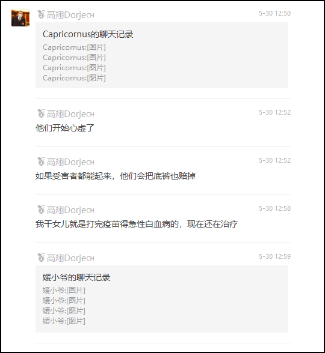

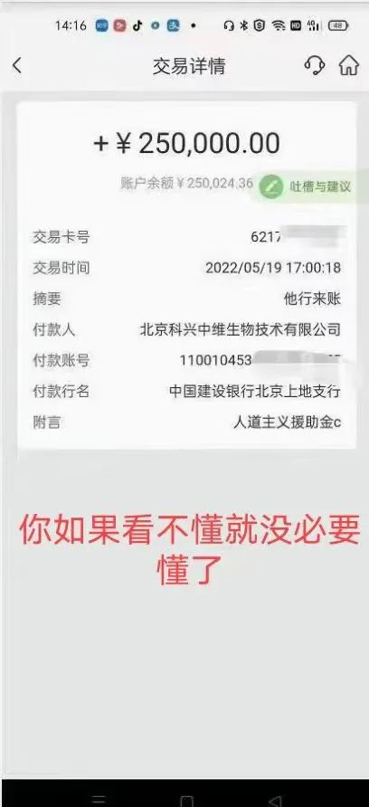

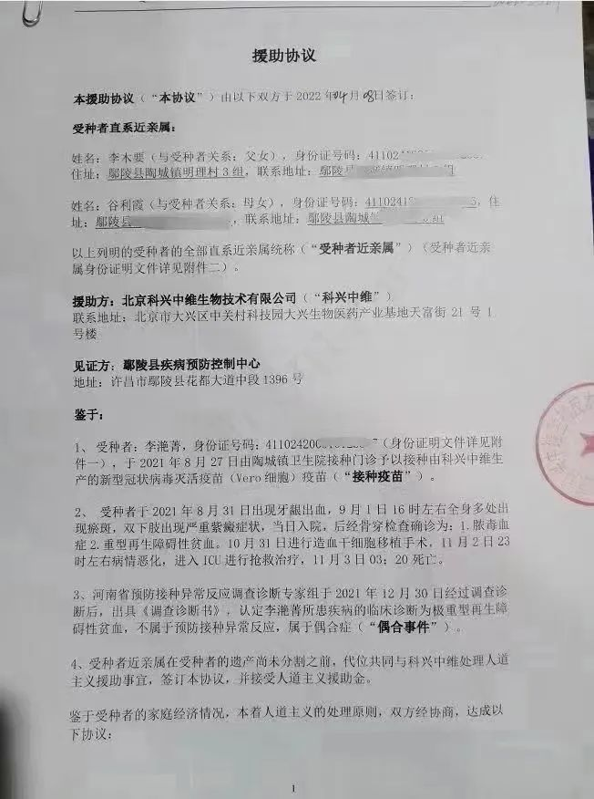

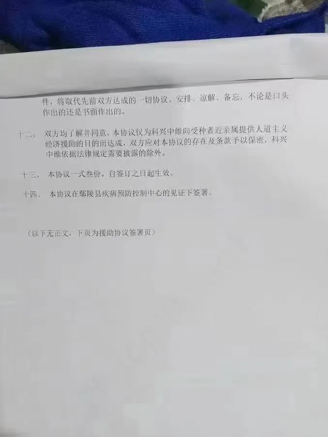

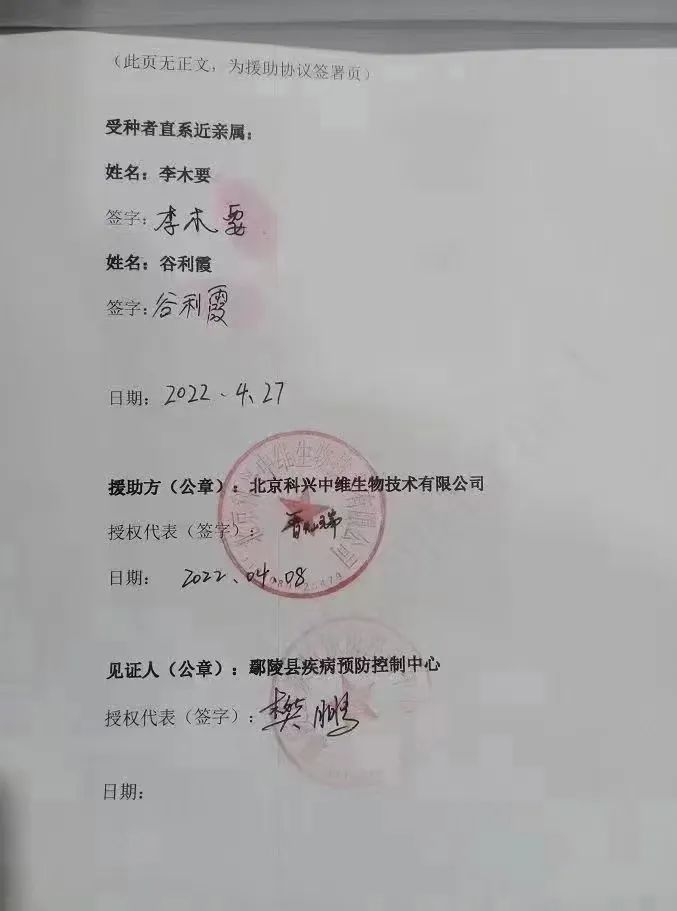

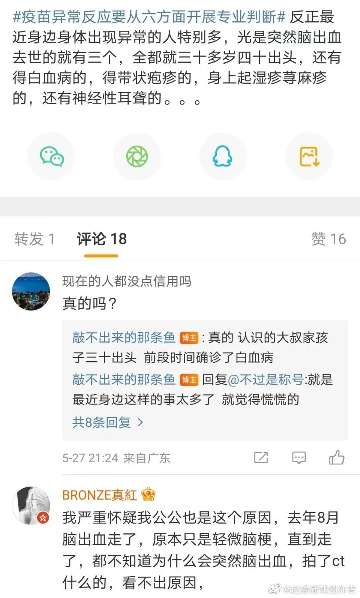

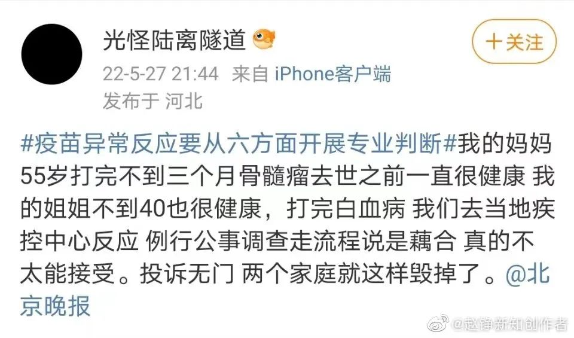

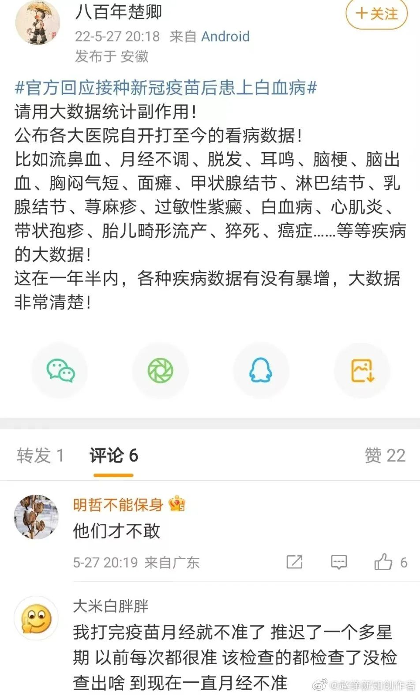

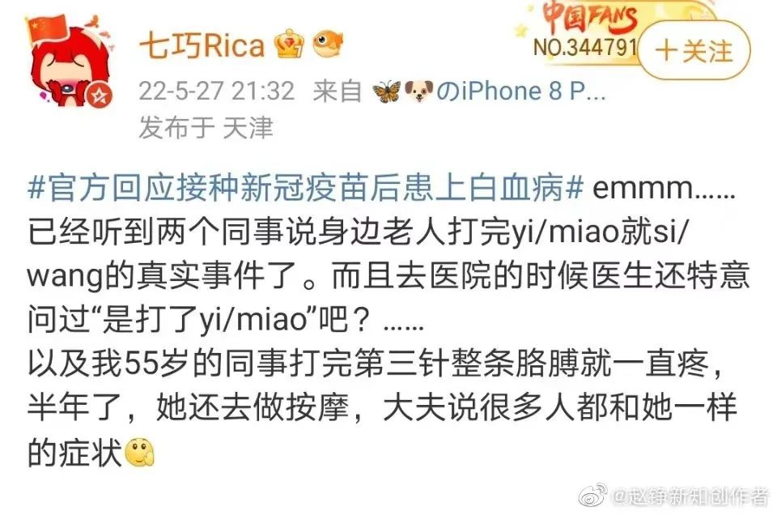

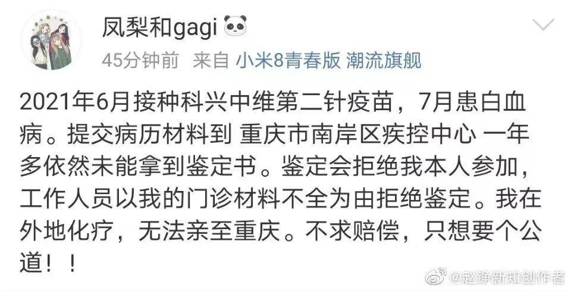

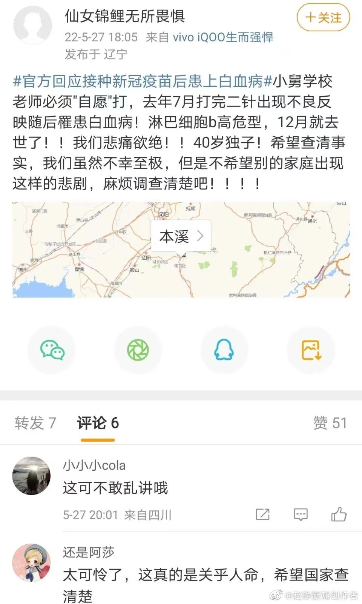

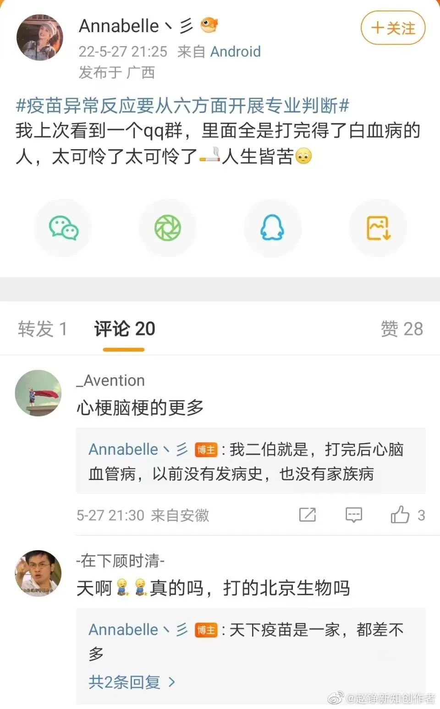

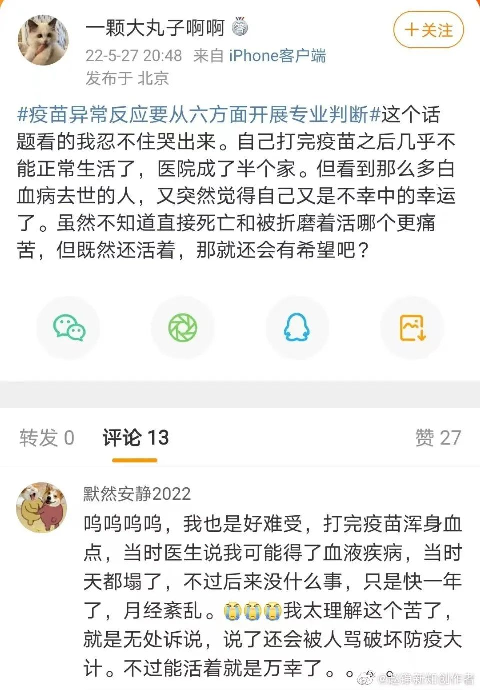

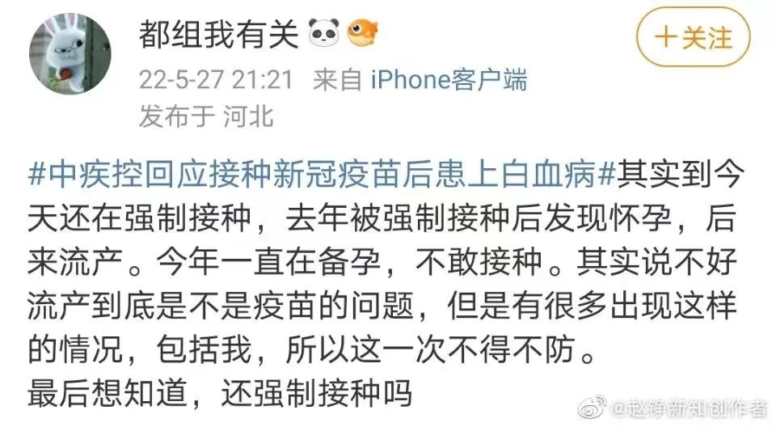

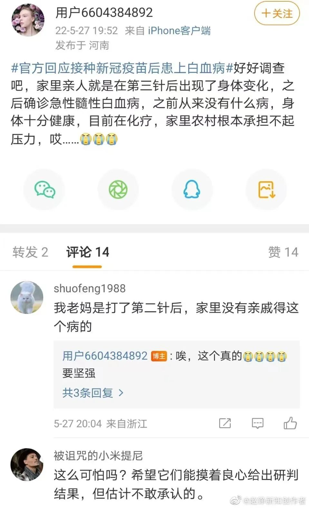

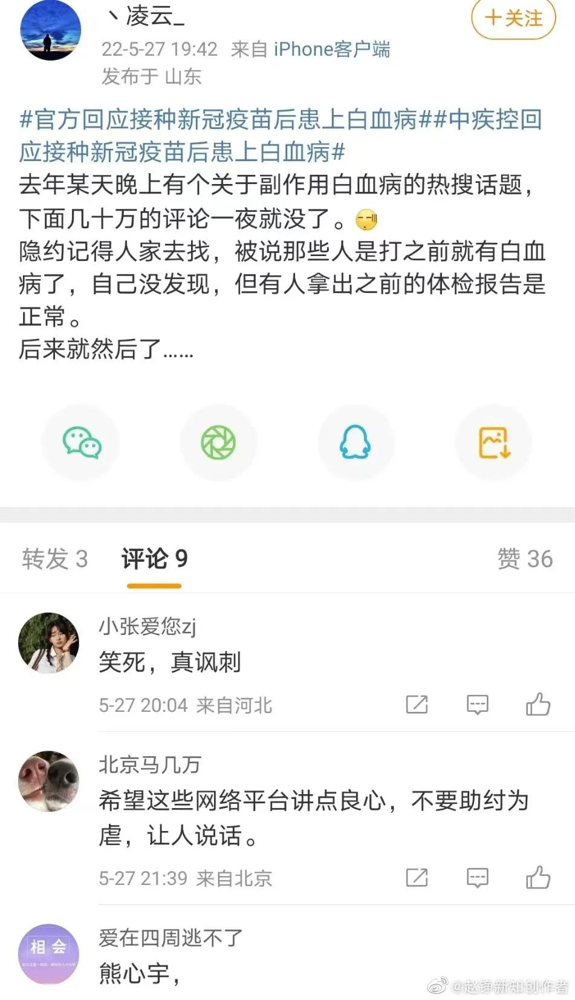

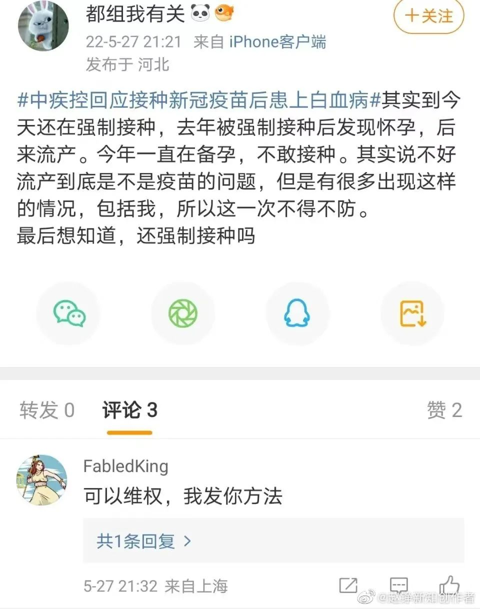

来源：医学之声综合整理 

**吃瓜迷**
爆最猛的料，吃最新的瓜。备用号：瓜逼逼
19篇原创内容

公众号

预览时标签不可点

收录于合集 #
 个
上一篇 下一篇

喜欢此内容的人还喜欢

**写留言**
取消

留言

**我的留言**

[写留言](javascript:;)

正在加载
展开我的留言
留言被精选后将公开

**精选留言**

[写留言](javascript:;)

[写留言](javascript:;)

正在加载

已无更多数据

[发消息](javascript:;)

关闭
**写留言**
提交更多

正在加载

[表情](javascript:;)

正在加载

关闭
**留言**
更多

正在加载

正在加载

返回
**写回复**
回复更多

正在加载

: 

[表情](javascript:;)

正在加载

微信扫一扫
关注该公众号

[知道了](javascript:;)

 微信扫一扫
使用小程序

[取消](javascript:void(0);) [允许](javascript:void(0);)

[取消](javascript:void(0);) [允许](javascript:void(0);)

 ： ， 。  视频 小程序 赞 ，轻点两下取消赞 在看 ，轻点两下取消在看

该账号因违规无法跳转

原文链接：<https://mp.weixin.qq.com/s/goPypcpz7J9mZf6t0rjZYA>
