# 空空导弹技术未来发展方向展望

     

# 空空导弹技术未来发展方向展望

[前沿装备汇](javascript:void(0);)

**前沿装备汇** 

微信号 gh\_8d200d334fa7

功能介绍 聚焦国际前沿武器、科技装备顶层智慧，传递装备热点、发展历程、技术原理，装备功能、现状与趋势分析，观点交流等内容

_2022-05-21 13:40_ _发表于北京_

收录于合集

#空空导弹 8 个
#武器 14 个
#前沿装备 25 个
#前沿技术 20 个

以下文章来源于现代防御技术，作者安德烈·米特罗法诺夫

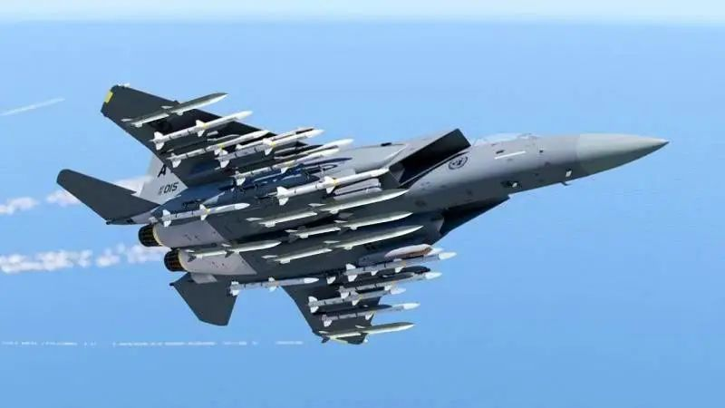

【据军事观察网站2021年6月22日报道】伴随着技术的发展，先进战斗系统不断涌现，现有武器几乎不可能对付这些系统。特别是，先进空对空反导弹和战斗机激光自卫系统可能会从根本上改变空战的形式。之前在《能否对抗战斗飞机上的激光武器？》和《机载空对空反导弹》两篇文章中已经研究分析了相关的技术。同样得到发展的还有无线电电子对抗系统，它们能够有效地对付空对空导弹和具有雷达导引头的地对空导弹。而在一些大型战斗机，如美国先进的B-21“突袭者”（Raider）轰炸机上，这些系统的效能可以与专用飞机所配置的电子战设备相媲美。

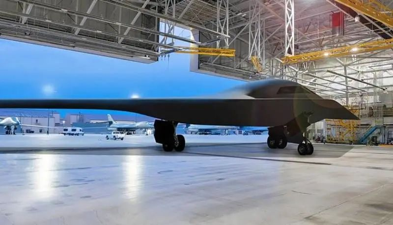B-21“突袭者”轰炸机可能获得所有战斗机上安装过的最先进的自卫系统

作战飞机先进保护系统的出现必然会产生应对的手段，空对空导弹也需要进行相应的演变，使其能够以可接受的概率突破这样的防护。

这将是一个十分复杂的任务，因为多种先进的自卫系统互为补充，难以制定有效的对抗措施。例如，由于激光自卫系统的出现，需要为导弹配备抗激光防护装置，与普遍的看法相反，这种保护装置不可能用箔材或银光钢油漆制成，因此会相当笨重，空对空导弹的质量和尺寸也会增加，使其成为不需要抗激光防护的空对空反导弹更容易对付的目标。
因此，为了使先进空对空导弹能够对付装备有反导弹、激光自卫系统和电子战对抗措施的先进作战飞机，必须实施一整套措施，我们将在本文中对这些措施进行分析和研究。

**发动机**

发动机是空空导弹的主体部分。正是发动机决定了导弹的射程和速度、导引头的最大容许质量和战斗部的质量。发动机的动力也是决定导弹机动能力的因素之一。
目前，空对空导弹的主要动力装置仍然是固体燃料火箭发动机。冲压发动机是一种具有发展前途的解决方案，MBDA公司最新型欧洲“流星”空空导弹上安装了这种发动机。

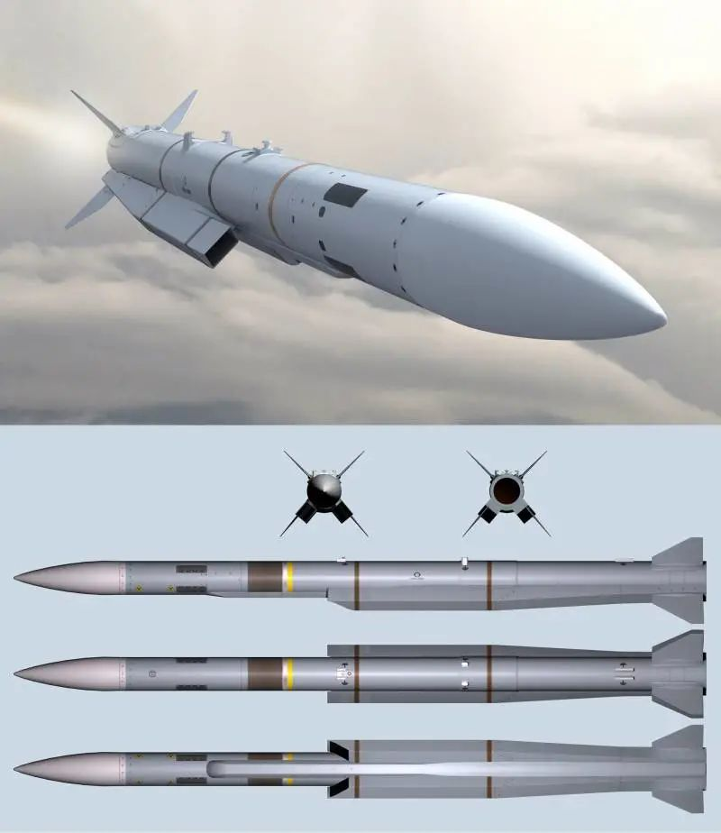采用冲压发动机的MBDA“流星”空空导弹

根据未经证实的数据，美国国防部的机密“暗箱”项目开发出采用冲压发动机的空空导弹，甚至在海湾战争期间用它击落了至少1架伊拉克飞机。

虽然采用冲压式喷气发动机可以增加射程，但是在与固体推进剂火箭发动机导弹射程相当的情况下，这种导弹的外形尺寸更大并且动力性能更差，从而造成其实施快速机动的能力变差。另外，由于修正冲压发动机工作所需的攻角和侧滑角有限，所以冲压发动机还有可能存在快速机动上的限制。
因此，先进空空导弹无论如何都会包括1个固体燃料火箭发动机，以达到冲压发动机起动和冲压发动机本身所需的最低速度。一种可行的方案是，空空导弹做成两级，第一级包括固体燃料火箭发动机用于加速和冲压发动机起动，第二级只包括固体燃料火箭发动机，用于在末段，也就是飞近目标时进行快速机动，用以躲避空对空反导弹和降低对手激光自卫系统的效能。
可能会发展一种凝胶状或膏状推进剂，取代固体推进剂。这种发动机的开发和制造难度更大，但会提供比固体推进剂更好的能量性能，以及潜在的推力调节能力和凝胶状或膏状推进剂发动机开/关机能力。

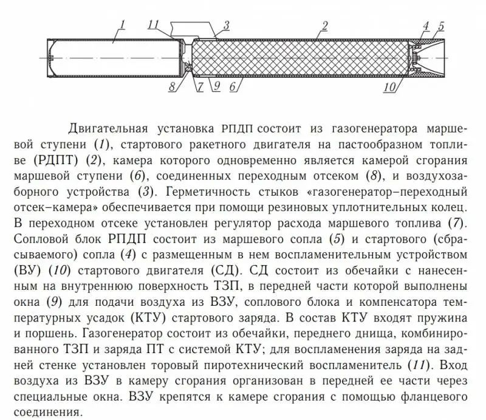

图注：凝胶状或膏状推进剂发动机组成包括：主级燃气发生器_（__1__）_；膏状推进剂助推火箭发动机_（__2__）_，其燃烧室同时也是主级燃烧室_（__6__）_；连接结合段_（__8__）_和进气装置_（__3__）_。借助橡胶密封圈保证“燃气发生器\-结合段\-燃烧室”连接部位的密封性。在结合段内安装了主级推进剂流量调节器_（__7__）_。凝胶状或膏状推进剂发动机喷管组组成包括：主级发动机喷管_（__5__）_和助推（可抛式）发动机喷管_（__4__）_，其内部配置助推发动机点火装置_（__10__）_。助推发动机组成包括：外壳，其内壁面涂覆防热层，其前部做成窗口结构_（__9__）_，用于从进气装置进气；喷管组和助推装药温度收缩补偿器。温度收缩补偿器组成内包括弹簧和柱塞。燃气发生器包含外壳，前壁，复合防热层和具有温度收缩补偿系统的膏状推进剂装药；为了装药的点火，在后壁上安装了环形火药点火器_（__11__）_。空气通过燃烧室前部的专用窗口从进气装置进入燃烧室。进气装置通过法兰环与燃烧室固定。

固体推进剂火箭发动机方案（来自《固体和膏状推进剂火箭发动机》一书。设计和试验研究原理）

**超机动性**

先进空对空导弹需要具有快速机动能力，用于对付高机动目标和实施快速机动，以阻止被空对空反导弹杀伤并降低对手激光自卫系统的有效性。
为了提高空对空导弹的机动性，使用推力矢量控制发动机和/或燃气控制带组成内的横向控制发动机。

燃气动力控制带

使用推力矢量控制或燃气动力控制带既能提高先进空空导弹对敌方先进自卫系统的突防效能，也能确保直接碰撞杀伤目标。  这里需要注意的是，即使在喷气发动机或固体燃料火箭发动机确保空空导弹保持足够动力的情况下，快速机动能力本身也不能确保有效地躲避敌方反导弹——必须要确保发现飞近的反导弹，因为不可能保证空对空导弹在整个飞行过程中都实施快速机动。

**提高隐身性**
为了使作战飞机的反导弹或自卫激光系统能够攻击飞近的空对空导弹，必须被提前发现这些目标。现代导弹袭击预警系统能够高效地做到这一点，包括测定飞近的空空或地空导弹的弹道。

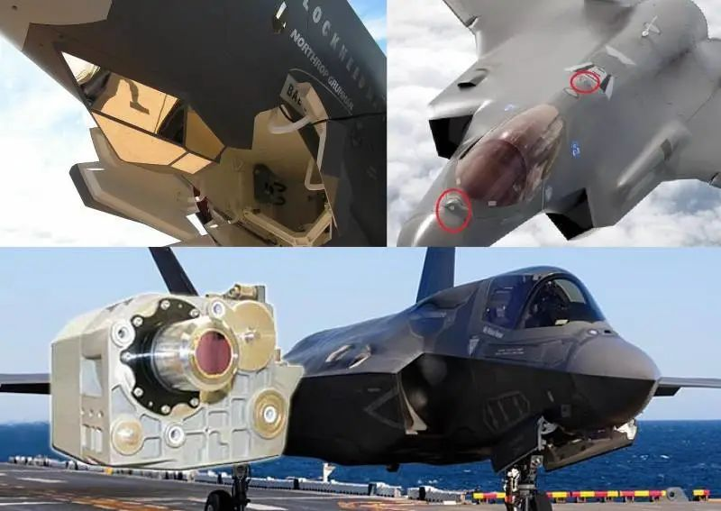

F-35的光学定位系统可以有效探测空空和地空类导弹，让飞行员可以看到飞近的导弹。

空对空导弹采取隐身措施可以大幅度减小导弹袭击预警系统对其探测距离。
隐身导弹早前就已经在开发。例如，在20世纪80年代，美国开发了隐身空对空导弹HaveDash/Have Dash II，并达到了测试阶段。HaveDash导弹的一个选型使用冲压发动机，该发动机也被推测用于上述在波斯湾测试的空空导弹。
HaveDash导弹的壳体采用石墨基底辐射吸收复合材料制造，外形为棱形，具有三角形或梯形截面。头部有一个无线电透明/红外透明整流罩，其下装有1个具备主动雷达和被动红外制导通道的双模导引头和1个惯性制导系统（INS）。

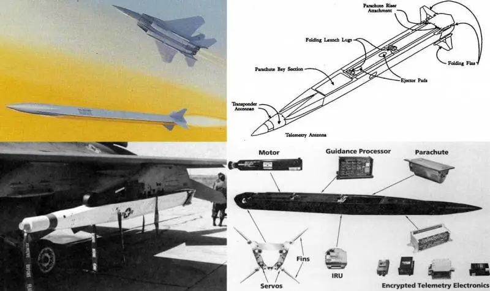HaveDash隐身空对空导弹

在开发时，美国空军未提出隐身导弹需求，因此其进一步开发被中止，有可能被转入机密的“暗箱”项目状态。但是无论如何，HaveDash导弹项目的产物有可能将会用于一些先进的项目中。
先进空对空导弹可能采用雷达和红外波段隐身措施。发动机尾焰可以通过结构件被部分屏蔽，考虑到最优雷达辐射再反射，壳体用辐射吸收复合材料制造。
由于必须同时确保先进空对空导弹具有有效的抗激光防护，提高其雷达隐身性将变得困难。

**抗激光防护**

在未来十年，激光武器可能成为作战飞机和直升机不可或缺的组成部分。第一阶段，确保其能够杀伤空空导弹和地空导弹的光学导引头，后续随着功率的增加，再杀伤空空导弹和地空导弹本身。

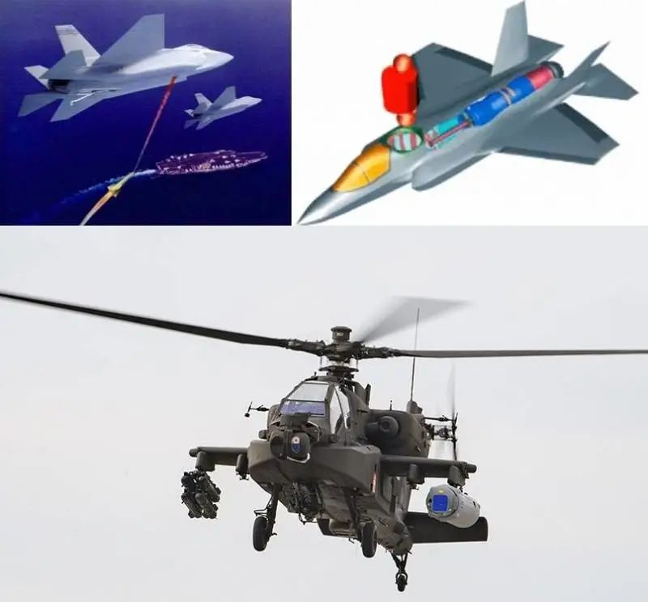15~150千瓦功率激光武器可集成到先进飞机机身内，或配置在吊舱中

激光武器的一个显著特点是几乎能够在瞬间将光束从一个目标转向另一个目标。在高空高速飞行时，不可能用烟幕提供保护，大气层的光学透明度很高。
空对空导弹一方在追求高速度，而激光自卫武器的有效作用距离大概不会超过10~15千米，这是空空导弹在5~10秒内飞越的距离。可以假设，1个150千瓦的激光器需要2~3秒杀伤1枚未加保护的空空导弹，也就是说，1个激光自卫系统可以击退2~3枚这类导弹的打击。
尺寸较大的飞机可能具有优势，因为机上可以配置多个自卫激光系统，并具有更高的功率，武器舱内可以放置更多反导弹，雷达和电子战设备的功率更大。增加作战飞机的尺寸和改变其战术的前景问题将在《2050年战斗机概念和新物理原理武器》和《战斗机将走向何方：它将贴近地面还是向高空爬升？》文章中进行分析研究。
为了突破先进激光自卫系统，需要组织一个空对空导弹群同时接近目标，或提高它们的防激光武器能力。
关于弹药防大功率激光辐射问题，在《光学对抗：防激光武器》一文中有所分析。
可以分为两个方向。第一个方向是采用烧蚀保护层，其工作效果是基于热燃气流将物质从被保护物体的表面带走和/或改造附面层，总之大大减少对被保护表面的热传导。

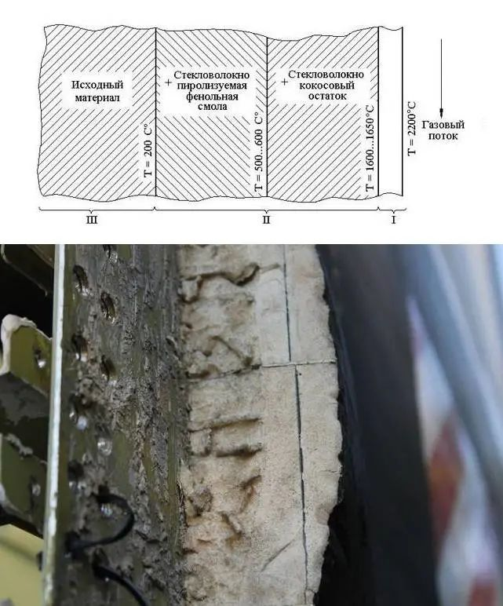图中文字注释（从左至右）：原始材料；+玻璃纤维热解苯酚树脂；+玻璃纤维植物（椰子）残渣；燃气流
烧蚀保护层示意图和“暴风雪”号太空飞船的烧蚀保护层

第二个方向是在壳体上涂覆多层耐火材料，例如，在碳\-碳复合材料基体上涂覆陶瓷涂层。上层应具有较高的导热性，使激光器加热产生的热量最大程度地分布在壳体表面，内层必须具有较低的导热性，以保护内部部件不至于过热。

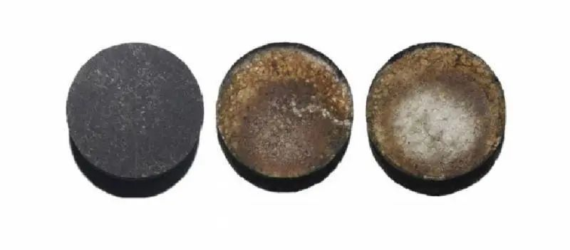
由英国曼彻斯特大学罗伊斯研究所和中国中南大学的科学家开发的Zr0.8Ti0.2C0.74B0.26陶瓷涂层
左侧—测试前的材料，中间和右侧—在2000℃和2500℃进行两分钟测试后，右侧样品的中心是温度达到3000℃的白色区域
主要问题是，空空导弹涂层要多厚和多重才能承受50~150千瓦或更大功率的激光器作用，以及它将如何影响导弹的机动性能和动态特性。它还应与隐身性要求相结合。
导弹导引头的防护同样是一个复杂的任务。具有红外导引头的空空导弹对付装有激光自卫系统的飞机还存在重要的问题。热光学无源快门不太可能经受住几十到几百千瓦的激光辐射，而机械快门也不能确保具有保护敏感元件所必需的关闭速度。
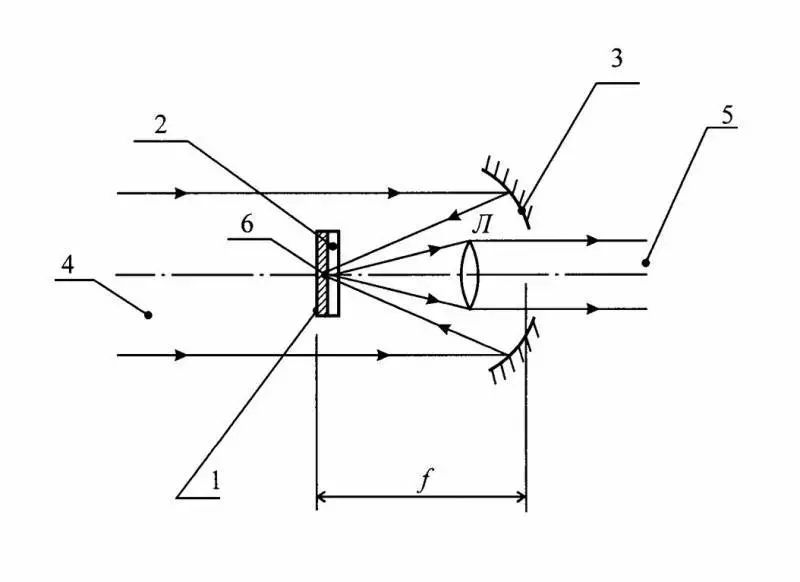
图片来自俄罗斯联邦第2509323号光学无源快门专利：1-在辐射作用下熔化和蒸发的金属镜面薄膜，2-透明基板，3-抛物面镜，4和5-带快门的光学装置的入瞳和出瞳，6-薄膜1中经受激光加热的区域，f-抛物面镜的焦距，L-物镜
也许有可能实现“快照式”红外导引头，即导引头几乎一直关闭钨制光阑，只在没有激光时短暂打开以获取目标的图像（应由一个专用传感器测定有无激光）。
为了确保主动雷达寻的头工作，防护材料应在相应的波段具有透明性。

**电磁脉冲防护**

为了在远距离摧毁空对空导弹，对手潜在可能使用配置产生大功率电磁脉冲战斗部的空对空反导弹（电磁脉冲弹药）。一枚电磁弹药能够潜在地同时杀伤对手的多枚空对空导弹。
为了减少电磁脉冲弹药的影响，电子元件可以用铁磁材料进行屏蔽，例如像俄罗斯“Ferrit-Doman”公司开发的具有高吸收性能的“铁氧体织物”，其质量密度只有0.2kg/m2。
电子元件可包括在发生强感应电流时断路的手段——稳压器和变阻器，并且主动雷达导引头可基于抗电磁脉冲的低温共烧陶瓷（LowTemperature Co-Fired Ceramic– LTCC）制造。
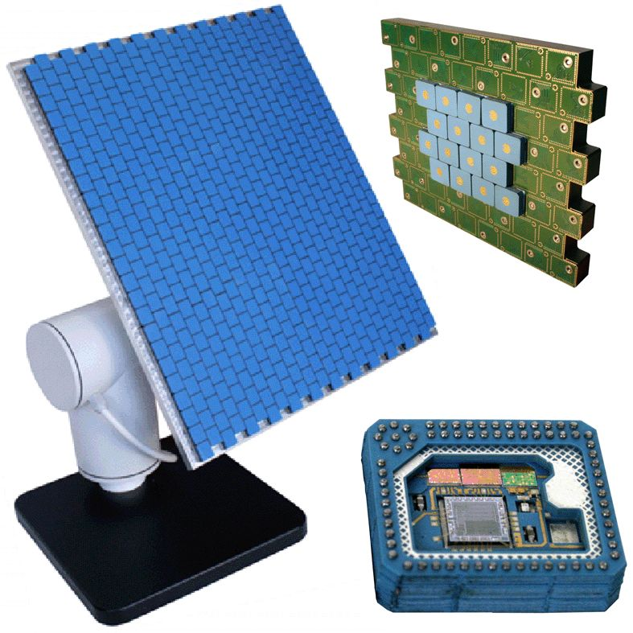
位于托木斯克市的半导体仪器科学研究所利用LTCC-陶瓷技术开发的平面有源相控阵天线。

**齐射应用**
突破先进作战飞机防御的方法之一是大量集中使用空对空导弹，例如，几十枚导弹齐射。最新型F-15EX战斗机可以携带多达22枚AIM-120导弹或多达44枚CUDA小型导弹，俄罗斯的苏\-35S战斗机可携带10~14枚空空导弹（可以通过使用加倍数量的挂架或缩小尺寸的空空导弹来增加空空弹的数量）。苏\-57第五代战斗机也有14个挂点（包括外部挂点）。其他第五代战斗机在这方面的能力比较一般。
EF-2000“台风”战斗机可以在14个挂点上携带武器
这种战术在面对电子战对抗措施、电磁战斗部反导弹、CUDA中程反导弹、MSDM/ MHTK /HKAMS小型反导弹和机载激光自卫系统时的效果如何还不得而知。“经典”的未加防护的空对空导弹可能会受到作战飞机先进自卫系统的影响，变得易毁性高而失效。

**无人机——空对空导弹载机**

通过使用低成本、隐身无人驾驶飞行器（UAV）与作战飞机配合，可以增加空对空导弹齐射数量，并使其更接近被攻击的飞机。目前，正在为美国空军积极开发这种无人机。
根据美国国防高级研究计划局（DARPA）的订单，通用原子公司和洛克希德·马丁公司正在LongShot计划范围内开发一种空基隐身无人机，其可以使用空对空类武器。当受到攻击时，这种无人机可以前出到攻击战斗机，增加空对空导弹齐射数量，可以为空空弹末段机动保存动力。无人机\-载机具有雷达和红外隐身性，可以延后被攻击飞机机载自卫系统的启动时机。
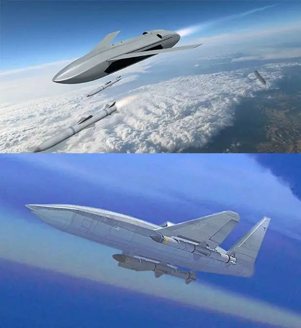LongShot无人机概念图
无人机可以配备专用硬件，用于确定被攻击飞机机载防御系统的启动时机、空对空反导弹的发射时机以及电子战设备开机时机。一种可行的研究方案是让无人机担当“自杀式飞行器”的角色，跟踪空对空导弹，用电子战设备掩护它们，并从飞机\-载机上转发外部目标指示。
这种无人机虽然不一定要从空中载机上发射使用，但是如果有此用途的话，其外形尺寸和成本将会增加，而其空中载机同样也需要增加自身的尺寸和载重量，直到出现一种特殊的“空中航母”，对此我们在《美国空军的战斗“小精灵”：空中航母概念的复兴》一文进行过分析。

**高超声速驾驭者**
研制重型空空导弹可能是一种更激进的解决方案，其子弹药形式为小型空空导弹，而不是单体弹头。这种重型空空弹可以配备冲压发动机，在大部分弹道上保持高的超声速甚至高超声速的飞行速度。
防空导弹的子弹药口径从30到55毫米不等，长度为400到800毫米，在纳粹德国时代就已经开发出来了；不过，当时它们是无控式杀伤爆破弹药。
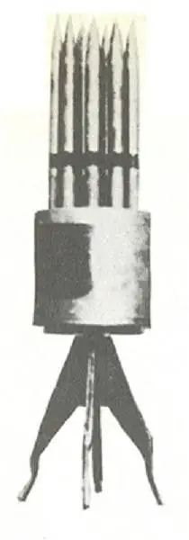使用无控式杀伤爆破弹药的防空导弹弹头
俄罗斯正在为米格\-31和先进的米格\-41截击机开发先进的防空导弹和重型空对空导弹，这种重型导弹内将使用先进的K-77M空对空导弹作为子弹药，是RVV-SD导弹的一种发展型。预计它们会被用于杀伤高超声速目标，由于其具有多个单独制导子弹药，将提高杀伤复杂高速目标的概率。
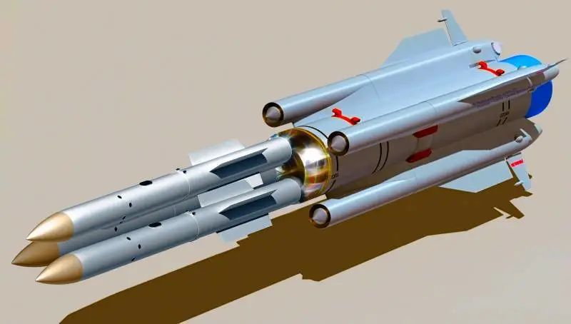带有多个单独制导子弹药的先进导弹的概念图
可以假定，先进重型空空导弹将更多地被要求专门对付装备先进自卫系统的作战飞机。
与无人机\-载机的情况一样，空空导弹的第一级，即子弹药的携载级，还可以配备反导弹攻击探测设备、对手电子战设备使用状态探测设备和自身电子战设备，以及从携载级向子弹药转发目标指示的设备。
**假目标**
假目标是无人机\-载机配置要素之一，也是先进重型空空导弹可控式子弹药的附加要素。某些问题的存在对其使用增加了难度——空中战斗行动是在高速和快速机动状态下进行，所以假目标不只是一个简单的“铁块”，它至少应包含燃料发动机、最简化的惯性导航系统和控制机构，也可能包含接收机，接收外部信息源的目标指示信息。
由于没有弹头、横向控制发动机和/或推力矢量控制，不使用隐身技术以及没有昂贵的制导系统，将使假目标比“真正的”空空导弹便宜几倍，外形尺寸也小几倍。
也就是说，可以部署2到4个假目标来代替一枚空空导弹，这些假目标可以大致保持相当于真实空空导弹的航向和速度。它们可以配置角反射器或楞勃透镜，以产生相当于“真正的”空空导弹的有效散射截面。
假目标和真正空对空导弹的另外的相似性应该由智能攻击算法提供。

**智能攻击算法**
智能算法应成为确保先进空对空导弹攻击效能的一个最重要的要素，它能确保飞机载机、中间运载器——高超声速助推发动机或无人机、空对空子弹药和假目标之间交互协同工作。
必须确保从最佳方向攻击目标，随着飞近的时间使假目标和空空子弹药同步（可以通过先进火箭发动机开关机或节流改变飞行速度）。
例如，在空空子弹药以及假目标分离后，如果后者有控制通道，则假目标可以与空空子弹药一起进行最简单的机动。如果假目标内没有控制通道，则它们可以在一段时间内与子弹药同向飞行，即使目标改变了飞行方向，空空反导弹也难以知道哪个是真正的目标，哪个是假目标，直到达到目标最小杀伤距离的最佳转弯时间到来，或取消无人机或助推发动机控制通道的那一刻。
对手会试图通过电子战设备抑制对空空子弹药和假目标“群”的控制。为了解决这个问题，可以考虑在“载机\-无人机/助推发动机”之间以及“无人机/助推发动机\-空空子弹药/假目标之间设置单向光学通信。

**结论**
随着先进作战飞机上出现了有效的机载自卫系统——空对空反导弹、激光自卫系统、电子战设备，需要开发新一代先进空对空导弹。
先进空对空自卫系统的出现也将对军用飞机产生重大影响，这既可以从创建分布式系统——有人驾驶飞机和不同类型无人机连接成一个统一网络，也可以从增加作战飞机的外形尺寸和相应增加其搭载的武器、自卫系统、电子战设备，雷达功率和尺寸增加上得到体现。同时，这两种方法也可以结合起来。

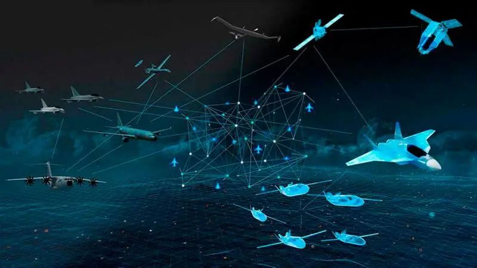“狼不是靠它的獠牙，而是靠它的狼群”

未来的作战飞机可能相当于一种水面舰艇——护卫舰和驱逐舰，它们不规避，而是击退打击。因此，袭击兵器的发展应考虑到这一因素。
无论选择何种方式来发展作战飞机，有一点是肯定的——在空中发动战争的成本将大大增加。

来源| 现代防御技术

**全文完。感谢您的耐心阅读，请顺手点个"在看"吧~**

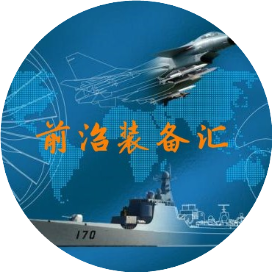

**前沿装备汇**
聚焦国际前沿武器、科技装备顶层智慧，传递装备热点、发展历程、技术原理，装备功能、现状与趋势分析，观点交流等内容
2篇原创内容

公众号

**免责声明：**本文根据转自网络。文章内容系原作者个人观点，本公众号转载仅为分享、传达不同观点，如有侵权或任何异议，欢迎联系我们删除！

**前沿装备汇精彩回顾**

[**重磅消息！军工保密三级资格取消！**](http://mp.weixin.qq.com/s?__biz=Mzg5NzU3NzcxNA==&mid=2247484457&idx=1&sn=82bdd35541fdec989d0cb6999080172c&chksm=c06ee3b4f7196aa24bbbdc9ad034ce63bec75878b0bccc7681ade217cbcb620622d46c3e6307&scene=21#wechat_redirect)

[**中国十大最顶尖军工集团**](http://mp.weixin.qq.com/s?__biz=Mzg5NzU3NzcxNA==&mid=2247488162&idx=1&sn=aa513e11b8fb9f3f666651a8e00a2814&chksm=c06ef53ff7197c29add2c4d5d6bc6be3fc1f513193a3c56769952ecb3a4e3e80587ebf69a4bc&scene=21#wechat_redirect)

[**全球十大新材料顶尖巨头**](http://mp.weixin.qq.com/s?__biz=Mzg5NzU3NzcxNA==&mid=2247488056&idx=1&sn=18730a35b73f47281f57c770e7ab4e9c&chksm=c06ef5a5f7197cb3042393fbb1d31795bf0ab58321f7bf2669736bcd4e794082b0bdb3b4b84a&scene=21#wechat_redirect)

[**全球十大最尖端的数控加工中心**](http://mp.weixin.qq.com/s?__biz=Mzg5NzU3NzcxNA==&mid=2247488040&idx=1&sn=11b823602b65dba413d9df32448dcbb3&chksm=c06ef5b5f7197ca311100da09b047cd8d0eb5c609dc2b7401f1023784643cfe654f5432461ab&scene=21#wechat_redirect)

[**盘点：最新军工资质相关变化汇总**](http://mp.weixin.qq.com/s?__biz=Mzg5NzU3NzcxNA==&mid=2247487943&idx=1&sn=34ae141fdf08def1f0a5994db1ec7fb5&chksm=c06ef65af7197f4c853c491f665b04521947af9b12d4cb8c77f7ddff7c2dc15d7eccc15569d2&scene=21#wechat_redirect)

[**捕捉军工黄金赛道：三大主线、十大产业**](http://mp.weixin.qq.com/s?__biz=Mzg5NzU3NzcxNA==&mid=2247486110&idx=1&sn=02ca3186af74ae4caa924924fc28e3fe&chksm=c06eed03f7196415d22d48ecbac64efb3d9c9b735c145826466308e36f0afce46bcd5a9d371a&scene=21#wechat_redirect)

[**谈军代表与装备技术状态管理监督**](http://mp.weixin.qq.com/s?__biz=Mzg5NzU3NzcxNA==&mid=2247486162&idx=1&sn=2097b8bc200be3f16e05d958c9f25054&chksm=c06eed4ff719645913b6b8907b7c6818b3e2a2e76ee379878ef8aa289a9a46b56f2728133aab&scene=21#wechat_redirect)

[**2021年军工行业：需求之变**](http://mp.weixin.qq.com/s?__biz=Mzg5NzU3NzcxNA==&mid=2247486065&idx=1&sn=9fc739091e28fac52c9e8ea9c9d730f3&chksm=c06eedecf71964fa2618f3738400d4dc2677c1c8647c00b793d148bb904eb78a0371e86d8364&scene=21#wechat_redirect)

[**军工“十四五”利好不断，一文看尽军工产业链**](http://mp.weixin.qq.com/s?__biz=Mzg5NzU3NzcxNA==&mid=2247486152&idx=1&sn=69720628de5571da07a4064a1e3dead1&chksm=c06eed55f7196443ff4fe8e8d25de7160f84a0ad4096e3a2949208ea4d90b1569fc13c3d7f2b&scene=21#wechat_redirect)

[**陆海空天一体化信息网络发展研究**](http://mp.weixin.qq.com/s?__biz=Mzg5NzU3NzcxNA==&mid=2247484434&idx=1&sn=c64b082b7bb604093d390218bc782026&chksm=c06ee38ff7196a99d21d5843feadb27d6ea9a9a08c9ab58338cc0ccb9ad119dcbfd42e745235&scene=21#wechat_redirect)

[**中美半导体全产业链实力对比（附中国和美国晶圆厂完整清单）**](http://mp.weixin.qq.com/s?__biz=Mzg5NzU3NzcxNA==&mid=2247484397&idx=1&sn=e93a12ad752399222837d1e669340d40&chksm=c06ee470f7196d66877e470f705c505af21d9c5f3a94b967d28ce71487e46b286000560d7b0f&scene=21#wechat_redirect)

[**集群无人机探测及对抗措施综述**](http://mp.weixin.qq.com/s?__biz=Mzg5NzU3NzcxNA==&mid=2247484351&idx=1&sn=4a008327be10d2ab076e84162c5f23f5&chksm=c06ee422f7196d34ae04882f32b35a7719a8bad76e925c876f4365e94d13cf55c813906d57ab&scene=21#wechat_redirect)

[**世界首次巡飞弹集群实战，以军战果惊人**](http://mp.weixin.qq.com/s?__biz=Mzg5NzU3NzcxNA==&mid=2247484966&idx=2&sn=0640ac397cee2566d541a8da687d4f18&chksm=c06ee1bbf71968ad02cc136316538b1a6d4b55835002e1f535752fc0ea0c25b42c7eebc8b682&scene=21#wechat_redirect)

[**未来智能化条件下作战需要经历四个发展阶段**](http://mp.weixin.qq.com/s?__biz=Mzg5NzU3NzcxNA==&mid=2247484928&idx=1&sn=edbffbd16f37d4a72a575937c099ae56&chksm=c06ee19df719688bbc07eac9fb3484c823d34e411c3128cc816e27a3689dfa05a0ede85964a6&scene=21#wechat_redirect)

[**临近空间防御作战拦截弹制导与控制关键技术综述**](http://mp.weixin.qq.com/s?__biz=Mzg5NzU3NzcxNA==&mid=2247484928&idx=2&sn=26c73458b07ded7a9a2ffeeb3c727b0a&chksm=c06ee19df719688b8ad8909b8656180a635f5be52274cf65095a6ddfba79058776c839c8d721&scene=21#wechat_redirect)

[**自主型地面无人战斗系统的发展方向**](http://mp.weixin.qq.com/s?__biz=Mzg5NzU3NzcxNA==&mid=2247484905&idx=1&sn=aacb1f39fde369022d90ee7d9148f29b&chksm=c06ee274f7196b6225e386c79cffa13793569fd9a5354b672f08367fb81fb3ddca76d56aa88f&scene=21#wechat_redirect)

[**空空导弹技术未来发展方向展望**](http://mp.weixin.qq.com/s?__biz=Mzg5NzU3NzcxNA==&mid=2247484905&idx=2&sn=db99003abb6e3ceeeeca30bf701935e4&chksm=c06ee274f7196b625284acc07185c010d02b477b42f0cbd3630ec3975d5b89d58652872d73b6&scene=21#wechat_redirect)

[**未来军事战争中的十大新概念武器排行榜**](http://mp.weixin.qq.com/s?__biz=Mzg5NzU3NzcxNA==&mid=2247484866&idx=1&sn=6bfebfc077d9a801cb77f57b12562e06&chksm=c06ee25ff7196b4960d58ab35b4e43931193204c3b5aa941e6cdcc56daba1efb38265f083740&scene=21#wechat_redirect)

[**96家！中央企业最新名录来了**](http://mp.weixin.qq.com/s?__biz=Mzg5NzU3NzcxNA==&mid=2247484849&idx=2&sn=c8e5d97a8ca41cb2885ef402c75652e0&chksm=c06ee22cf7196b3ab0ab1837343a1f0c531117756e2cc634260c473b03ba0e0a096c2f92db23&scene=21#wechat_redirect)

**[海军无人作战力量作战能力构成研究](http://mp.weixin.qq.com/s?__biz=Mzg5NzU3NzcxNA==&mid=2247484787&idx=2&sn=97e87c890a7ce098526a34c8a4728e83&chksm=c06ee2eef7196bf8d0e47247d8df91917c8d052190fe3456f59ca94b8b05b78f504ca93919f8&scene=21#wechat_redirect)**

**精彩内容长按二维码即可**关注****

**前沿装备汇                                    材料圈**

预览时标签不可点

收录于合集 #空空导弹
 8个
下一篇 隐秘而伟大！十二位中国导弹武器“两总”首度向全社会公开

喜欢此内容的人还喜欢

武直-10算是比较优秀的武装直升机吗？

武直-10算是比较优秀的武装直升机吗？

...

兵工科技陆地兵器版

不喜欢

不看的原因
确定

* 内容质量低

* 不看此公众号

还急着遏制中国？首飞又延迟，B-21或将“难产”

还急着遏制中国？首飞又延迟，B-21或将“难产”

...

防务军事

不喜欢

不看的原因
确定

* 内容质量低

* 不看此公众号

柬埔寨喜提中国“火炮”！中国武器又要被带火？

柬埔寨喜提中国“火炮”！中国武器又要被带火？

...

强国军事

不喜欢

不看的原因
确定

* 内容质量低

* 不看此公众号

**写留言**
取消

留言

**我的留言**

[写留言](javascript:;)

正在加载
展开我的留言
留言被精选后将公开

**精选留言**

[写留言](javascript:;)

[写留言](javascript:;)

正在加载

已无更多数据

[发消息](javascript:;)

关闭
**写留言**
提交更多

正在加载

[表情](javascript:;)

正在加载

关闭
**留言**
更多

正在加载

正在加载

返回
**写回复**
回复更多

正在加载

: 

[表情](javascript:;)

正在加载

微信扫一扫
关注该公众号

[知道了](javascript:;)

 微信扫一扫
使用小程序

[取消](javascript:void(0);) [允许](javascript:void(0);)

[取消](javascript:void(0);) [允许](javascript:void(0);)

 ： ， 。  视频 小程序 赞 ，轻点两下取消赞 在看 ，轻点两下取消在看

该账号因违规无法跳转

原文链接：<https://mp.weixin.qq.com/s/hCaM5Nokw1dxMHIbpGoByw>
