# 职场菜鸟看国企（十五）——航天科技集团组织架构、航天科技集团子公司目录、航天科技集团子公司汇总清单、航天科技包括哪些子公司？ - 知乎

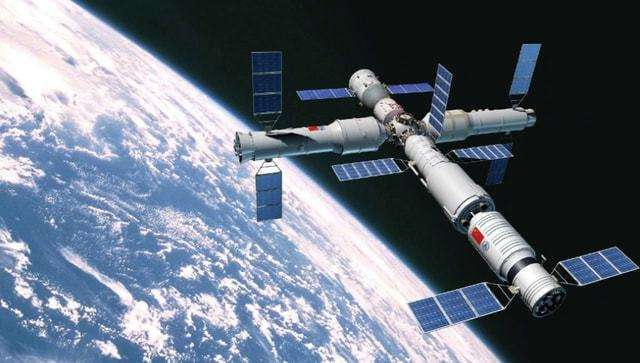

闲话国企​

985沪企中层，专业央企国企干货，关注一对一交流.

​关注

# 职场菜鸟看国企（十五）——航天科技集团组织架构、航天科技集团子公司目录、航天科技集团子公司汇总清单、航天科技包括哪些子公司？

1 个月前 · 来自专栏 职场菜鸟看国企

航天科技集团有限公司成立于1999年7月1日，其前身源于1956年成立的**国防部第五研究院，历经第七机械工业部**、航天工业部、航空航天工业部、航天工业总公司和航天科技集团公司的历史沿革。主要从事**运载火箭、各类卫星、载人飞船、货运飞船、深空探测器、空间站**等宇航产品和战略、战术导蛋系统的研究、设计、生产、试验和发射服务。科研生产基地遍及**北京、上海、天津、西安、成都、香港、深圳**等地。

中国航天科技集团有限公司现有从业人员12万余人，拥有”神舟”、”长征”等著名品牌和自主知识产权，创新能力突出、核心竞争力强的国有特大型企业集团。

是我国境内**唯一的广播通信卫星运营服务商**，**我国影像信息记录产业中规模最大、技术最强的产品提供商，**公司正在实施**载人航天与月球探测、北斗导航、高分辨率对地观测系统**等重大科技专项，启动实施**重型运载火箭、火星探测、小行星探测、空间飞行器在轨服务与维护、天地一体化信息网络等一批新的重大科技项目和重大工程**。

航天科技辖有**8个大型科研生产联合体**、**10家专业公司**、**11家境内外上市公司以及5个直属单位**。

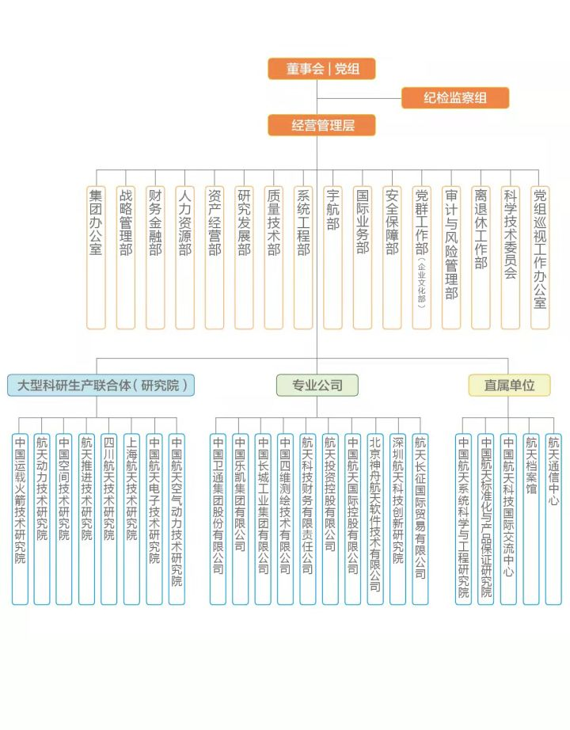

## 一、8个大型科研生产联合体-8个院

### 1、中国运载火箭技术研究院【一院-北京】

中国运载火箭技术研究院（又名中国航天科技集团有限公司第一研究院，以下简称研究院），成立于1957年11月16日，隶属于中国航天科技集团有限公司，是中国航天事业的发祥地，是我国历史最久、规模最大的导弹武器和运载火箭研制、试验和生产基地。

研究院现有**22个本级部门**，**13个院属法人单位，2个院属非法人实体机构，4个院级全资公司，5个院级控股公司（含2个上市公司），其中包括13个在编事业单位，3个预算内企业单位**。占地面积12028亩，科研生产建筑面积约220万平方米，按照“1+3+1+X”布局，包括一个核心区（南苑），三个产品基地，一个综合基地（河北固安），若干个军民融合、航天技术应用产业园区。现有从业人员3.3万人，其中两院院士7人，博士1200余人，硕士超过6000人。资产总额1037.95亿元。

作为中国航天第一个研制基地，研究院诞生了我国第一枚导弹“1059”，完成了我国首次“两弹”结合任务，发射了我国首颗人造地球卫星，为我国“两弹一星”事业做出了突出贡献。研究院成功研制了系列导弹武器，奠定了战略安全基石。成功研制了12种长征系列运载火箭，具备发射近地轨道、太阳同步轨道、地球静止轨道等多种轨道载荷的能力。成功实施了以载人航天工程、探月工程、北斗工程等为代表的重大工程的运载火箭发射任务，为实现中国航天三大里程碑跨越做出了突出贡献。

### 2、航天动力技术研究院【四院-西安】

航天动力技术研究院（中国航天科技集团有限公司第四研究院）成立于1962年7月1日，隶属于中国航天科技集团有限公司，是立足于**固体火箭发动机**研究、设计、生产和试验的固体火箭发动机专业研究院。

研究院主要承担着中国运载火箭、战略战术导弹、卫星、载人飞船等航天产品固体发动机的研制、生产、试验任务，以及在该领域内的重大技术创新和预先研究任务。研究院前身系1962年7月1日组建的国防部第五研究院固体发动机研究所，1965年成立第七机械工业部第四研究院，20世纪90年代初，选址**西安市东郊**。

根据2020年2月研究院官网显示，航天动力技术研究院在职职工1.2万人，拥有国际宇航科学院院士1名，中国科学院院士1名，中国工程院院士1名；拥有5个研究所、3个生产企业、5个公司以及若干附属配套单位。地跨陕西、湖北两省，院部设在西安市。固定资产总额55亿元。

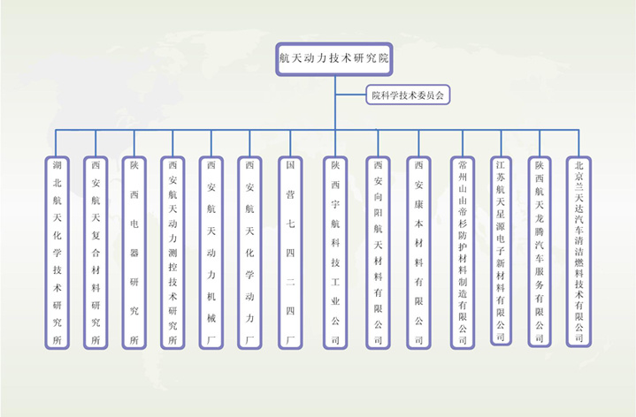

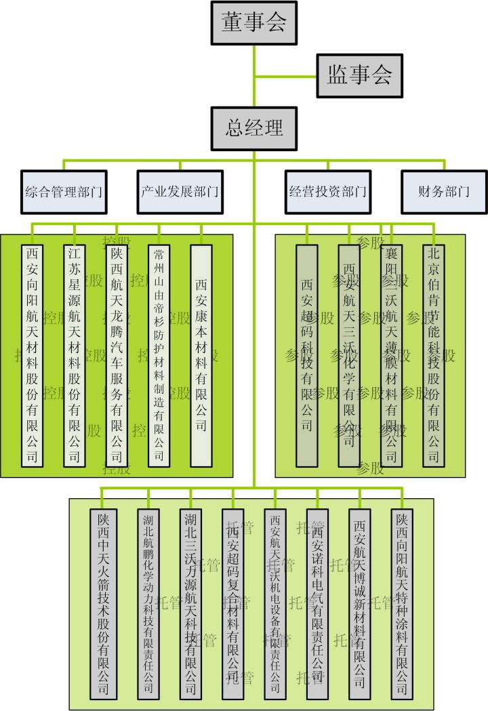

### 3、中国空间技术研究院【五院-北京】

中国空间技术研究院（航天五院）隶属于中国航天科技集团有限公司，成立于1968年2月20日，首任院长是著名科学家钱学森。经过53年的发展，已成为中国主要的空间技术及其产品研制基地，是中国空间事业最具实力的骨干力量。

自1970年4月24日成功发射我国第一颗人造地球卫星以来，研究院已抓总研制并成功发射了300余颗航天器，实现200余颗航天器在轨运行，研制的航天器覆盖载人航天、月球与深空探测、导航定位、对地观测、通信广播、空间科学与技术试验六大系列航天器，实现了大、中、小、微型航天器的系列化、平台化发展。研究院圆满完成载人航天工程、探月工程、北斗工程、高分工程为代表的重大航天任务，为实现我国航天三大里程碑跨越发展做出了突出贡献。打造了**中国卫星、康拓红外、航天生物**三大业务发展主体平台，形成了以京津冀、长三角和粤港澳大湾区三大重点区域为主的区域布局。

研究院打造了**北京、天津、怀来、西安、兰州、烟台、深圳、内蒙古、杭州等产业基地**，拥有空间飞行器总体设计、分系统研制生产、系统集成、总装测试、环境试验、地面设备制造及卫星应用、服务保障等配套完整的研制生产体系。研究院现有中国科学院和中国工程院院士9人，国际宇航科学院院士11人，俄罗斯宇航科学院院士9人，突出贡献专家15人，全国技术能手40人，高级以上职称人员7200余人。

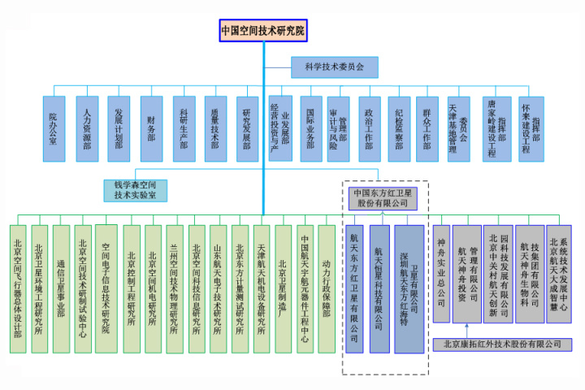

### 4、航天推进技术研究院【六院-西安】

航天推进技术研究院（中国航天科技集团公司第六研究院）创建于1965年，是我国**液体火箭发动机研制中心和专业抓总单位**，承担着为我国运载火箭和导弹武器提供液体火箭发动机的重任。该研究院形成了液体火箭发动机科研、生产和试验的专业化分工和一体化布局。

航天推进技术研究院现有11个单位，其中

**陕西动力机械设计研究所和北京航天动力研究所为液体火箭发动机设计研究所**

**西安航天动力试验技术研究所为液体火箭发动机试验研究所**

**西安航天发动机厂为液体火箭生产制造厂**

**陕西航天动力高科技股份有限公司为民用产业上市公司**

**西安航天计量测试研究所**是国防科工委陕西区域计量站第三校准实验室。

**西安航天中学**是陕西省重点中学，**西安航天小学**是西安市一级一类小学，**西安航天医院**是二级甲等医院。这些单位形成了完善的航天高技术科研体系，并建立了完整配套的动力供应、医疗卫生、后勤服务、文化教育等基础设施。

该院现有职工7099名，其中中国工程院院士1人，中国科学院院士1人，突出贡献专家5名，省部级突出贡献专家49名，享受特殊津贴专家161名；具有高级职称人员853名，中级职称1182名。拥有3个硕士学位授权点，可招收博士研究生，并被批准为博士后科研工作站。

### 5、四川航天技术研究院【七院-成都】

四川航天技术研究院（四川航天管理局）隶属于中国航天科技集团公司，别名航天七院。前身是国防三线建设062基地和064基地，2005年正式更名为四川航天技术研究院，在四川成都挂牌成立；该院是一个以航天型号产品、航天技术应用产业、服务业三大产业为主，以**国防装备生产、火箭弹研制、航天技术应用**为重点。

研究院在册职工1.5万人，其中各类技术人员5000多人。研究院辖有研发中心、大中型工厂、设计院、研究所、子公司、控股公司等20余家单位，分布在成都、泸州、重庆等地。

成员单位18家：

1. 第七总体设计部

* 长征机械厂
* 中国航天科技集团公司燎原无线电厂（四川航天电子设备研究所）
* 中国航天科技集团公司烽火机械厂（四川航天机电工程研究所）

* 成都九鼎科技（集团）有限公司

* 中国航天科技集团公司航天火工技术研究所
* 四川达宇特种车辆制造厂(四川航天特种动力研究所)
* 重庆航天机电设计院
* 成都航天万欣科技有限公司
* 四川航天计量测试研究所（中国航天科技集团公司7140计量站）
* 成都航天通用动力机械厂
* 四川神坤装备股份有限公司
* 四川航天电液控制有限公司
* 四川航天建工集团
* 成都航天模塑股份有限公司
* 成都航天医院
* 四川航天职业技术学院
* 重庆航天职业技术学院

### 6、上海航天技术研究院【八院-上海】

上海航天技术研究院创建于1961年8月，主要业务领域覆盖防务装备、运载火箭、应用卫星、空间科学、航天技术应用产业和航天服务业，是**中国航天科技集团有限公司三大总体院之一**，中国航天唯一的综合性总体院。经过60年的发展，上海航天技术研究院已经发展成为我国航天科技工业的骨干力量。

上海航天技术研究院下辖多家企事业单位,经过多年的持续努力，初步奠定了科技创新型产业集团的能力基础。全院现有从业人员2万余人。

上海航天技术研究院作为我国运载火箭主要研制基地之一，承担了我国近40%的卫星发射任务，并成功打入国际发射市场，为欧洲、中东、南美等地区客户提供了发射服务。主要型号有：长征二号丁、长征四号乙、长征六号运载火箭、长征五号系列运载火箭助推及部分芯级产品研制配套；目前，正在开展新一代中型运载火箭的研制。

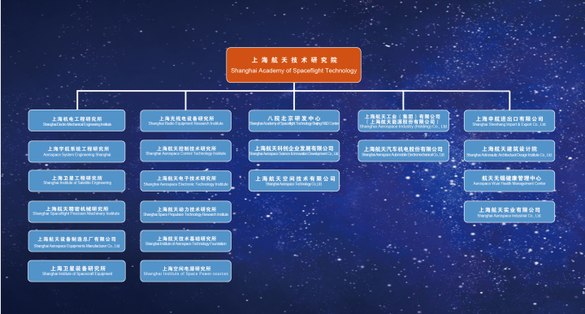

### 7、中国航天电子技术研究院【九院-北京】

中国航天电子技术研究院在中国航天时代电子公司的基础上组建而成，是航天电子专业大型科研生产联合体，拥有多个辖属单位。分布在北京、上海、重庆、陕西、杭州、武汉、桂林、郑州等省市，是上市公司**火箭股份（股票代码600879）的第一大股东，中兴通讯及航天动力的第二大股东**。

中国航天电子技术研究院致力于**惯性导航、遥测遥控、航天计算机及软件、微电子、机电组件**等传统优势专业技术的提升。同时充分发挥型号系统与电子技术相结合的优势，推动技术融合与系统集成，开发系统级产品。中国航天电子技术研究院电子专业门类齐全，均可向民用领域延伸，具有良好的产业化发展前景。

中国航天电子技术研究院拥有在职员工16000余人，各类专业技术人员5000余人，其中包括中国科学院院士在内的高级专业技术人员1200余人。

> 在编事业单位十院、13所、16所、771所、772所、776所、779所、704所划归中国航天电子技术研究院管理，航天时代电子公司及所属165厂、825厂、693厂、539厂、200厂、289厂、230厂、7107厂、7171厂和其他控、参股公司委托中国航天电子技术研究院管理。

### 8、中国航天空气动力技术研究院【十一院-北京】

中国航天空气动力技术研究院（简称：十一院）是我国第一个大型空气动力研究与试验基地和中国空气动力研究的核心机构，十一院前身是1956年10月成立的国防部五院空气动力研究室，由钱学森先生组织筹建。自创建之初，便一直从事航空航天飞行器研制所需的大量气动力／热研究工作。

1986年经批准为硕士学位授予单位；1996年成为博士学位研究生培养单位；2003年被批准建立力学学科流体力学专业博士后研究流动站；2018年经批准为力学一级学科工学博士授予单位。目前院在职职工4000余人，其中专业技术人员占60%，部级以上学术技术带头人、突出贡献专家40余名。

## 二、5个直属单位

### 1、中国航天系统科学与工程研究院【十二院-北京】

中国航天系统科学与工程研究院（中国航天科技集团公司第十二研究院）是在原航天707所、710所等五家单位的基础上重组成立的，是中国载人航天工程（一期）的原创新单位之一。

研究院拥有平台8个，行业级平台近50个；具有享受特殊津贴人员、百千万人选、跨世纪学术技术带头人57人；拥有1个博士后科研工作站、1个学术学位一级学科博士点、1个学术学位二级学科博士点、2个学术学位一级学科硕士点、2个学术学位二级学科硕士点。

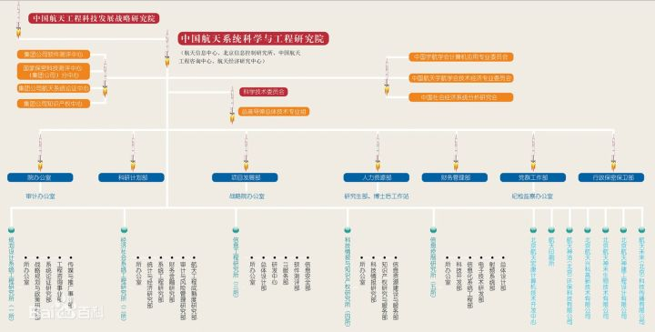

图片引自百度文库

### 2、中航天标准化与产品保证研究院【708所-北京】

中国航天标准化与产品保证研究院（中国航天标准化研究所，即：七○八所，下同）始终坚持立足航天、服务型号的宗旨，始终专注于技术基础研究和服务，科研能力和服务质量不断提高，圆满完成了航天标准化、质量与可靠性、航天产品保证等方面的各项任务，为国防现代化和航天事业做出了突出贡献。

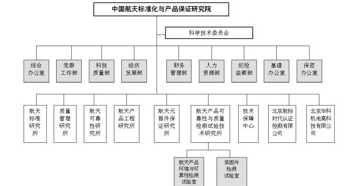

### 3、中国航天科技国际交流中心【北京】

中国航天科技国际交流中心隶属于中国航天科技集团有限公司，最早于1988年7月成立。2016年7月，**中国宇航出版公司、中国航天报社、中国宇航学会、航天人才开发交流中心4家直属单位重组整合**，成为新的中国航天科技国际交流中心。

中心目前下设6个职能部门、6个事业部及2个全资子公司，共有在职员工400余人，分布在北京阜成路8号院办公区、大兴西红门办公区和廊坊培训基地办公区。

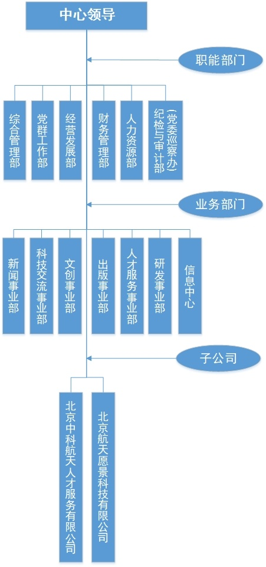

### 4、航天档案馆

航天档案馆成立于1965年，是额拨款事业单位，隶属于中国航天科技集团公司。航天档案馆是中国航天科技集团公司档案馆，承担着保管军工专业档案的职能和任务，履行对集团公司总部、各大型科研生产联合体、各专业公司和直属单位档案工作的监督、检查、指导和档案的收集、保管、提供利用的双重职能。

航天档案馆围绕为航天事业提供档案服务的宗旨，开展了为航天工业进行档案管理工作、档案业务指导工作、档案收集和保管工作、档案编研工作、声像摄制和档案信息化等业务活动。

航天档案馆内设综合办公室、财务处、业务指导处、档案管理处、编研处、声像处、技术处。现有从业人员40人，其中正式职工37人，大学本科及以上学历人员29人，具有高级专业技术职称19人，其中正高1人。退休人员17人。

### 5、航天通信中心【北京】

航天通信中心是中国航天科技集团直属事业单位，是航天系统通信及网络中心。作为全民所有制高新技术单位，在程控交换机、卫星通信、有线电视、光纤通信、综合布线、计算机网络、计算机应用和管理系统软件开发方面具有很强的实力。并承担着航天科研生产通信保障及大型试验的实时监视、演示任务。

## 三、10家专业公司

### 1、中国卫星集团股份有限公司

中国卫通集团股份有限公司（简称：中国卫通）是中国航天科技集团有限公司从事卫星运营服务业的核心专业子公司，具有基础电信业务经营许可证和增值电信业务经营许可证，是我国唯一拥有通信卫星资源且自主可控的卫星通信运营企业，被列为一类应急通信专业保障队伍。2019年6月28日，中国卫通成功登陆上交所。

中国卫通运营管理着14颗优质的在轨民商用**通信广播卫星**，覆盖中国全境、澳大利亚、东南亚、南亚、中东以及欧洲、非洲等地区。

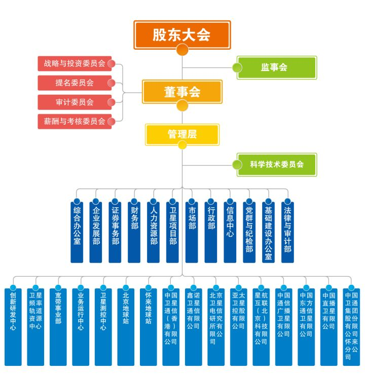

### 2、中国乐凯集团有限公司

中国乐凯集团有限公司（以下简称中国乐凯）隶属中国航天科技集团公司，是其全资子公司。中国乐凯前身是始建于1958年的“一五”计划重点项目——**保定电影胶片制造厂**。现已从传统的感光材料制造商转型为印刷影像材料、高性能膜材料、图像信息材料领域集中研发、制造、服务为一体现代化企业。在印刷影像材料、高性能膜材料、图像信息材料领域拥有多项自主知识产权，创新能力突出，市场竞争力强。

中国乐凯拥有直属单位及分支机构5家，全资子企业10家，控股子公司4家，其中上市公司2家。主要生产基地分布在河北保定、河南南阳、安徽合肥、辽宁沈阳、广东汕头、天津等地。截至2017年底，在岗职工8000余人。其中中国工程院院士、博士、高级工程师以及各类专业技术人员3000余人。

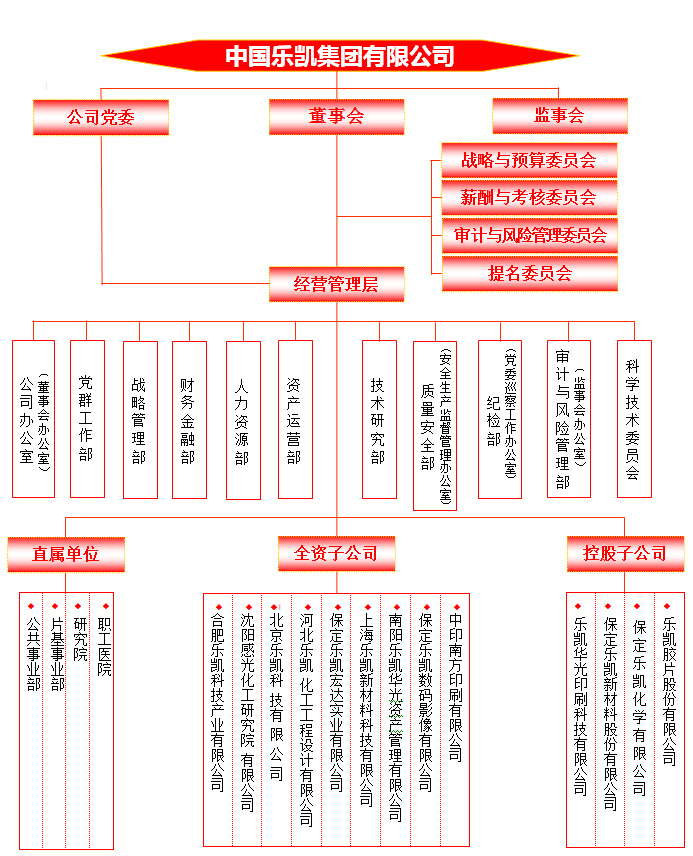

### 3、中国长城工业集团有限公司

中国长城工业集团有限公司(长城公司)创建于1980年，是授权的提供**商业发射、卫星系统以及从事空间技术合作的商业机构**，是中国航天科技集团有限公司全资子公司。

作为中国航天国际化经营的专业公司，长城公司致力于中国航天国际化发展，已发展成为航天产品及综合服务的系统集成商，能够完整地提供国际发射服务、通信和遥感卫星在轨交付、航天基础设施建设、元器件和部组件进出口、航天国际合作、 商业航天集成服务等整体解决方案，以全方位、一站式的服务满足客户多方位需求，享誉国际国内宇航界、金融界及保险界。

在提供国际宇航综合服务的同时，长城公司还积极开展航天技术应用与系统集成和专业服务。在向客户提供全球商业测控、卫星应用、国际工程等服务的同时，还可以提供贸易、数字供应链平台、会展、咨询、物业等专业服务。

### 4、中国四维测绘技术有限公司

中国四维测绘技术有限公司创建于1992 年，是中国航天科技集团有限公司发展卫星遥感和地理信息产业的专业公司。经过二十余年的发展，公司已成为**是世界一流、国内领先的数字地图供应商**，是国内市场亚米级遥感卫星数据供给的主渠道，负责国内首个高分辨率遥感卫星高景卫星星座的建设运营，市场占有率多年来国内领先。

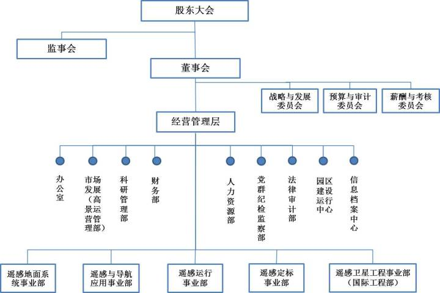

### 5、航天科技财务有限责任公司

航天科技财务有限责任公司（以下简称“公司”）于2001年成立，是经人行批准，受监督管理，为适应社会主义市场经济的要求，支持我国航天事业持续稳定发展，由中国航天科技集团有限公司（以下简称“集团公司”）以及集团公司其他十六家成员单位共十七方共同出资设立的一家非银行金融机构，注册资本金人民币65亿元。

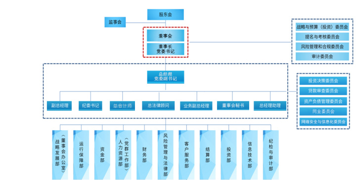

### 6、航天投资控股有限公司

航天投资控股有限公司成立于2006年12月，2008年3月正式运营。公司注册资本120亿元人民币，管理资金规模2,240亿元，履行中国航天科技集团有限公司赋予的产业孵化、资源整合、战略并购、投资融资等职能。

作为中国航天科技集团有限公司授权的投资管理主体、资本运作和战略合作的平台，公司由集团公司及其下属单位联合中国人民财产保险股份有限公司、国创投资引导基金(有限合伙)、国新国同(浙江)投资基金合伙企业(有限合伙)、国华基金(有限合伙)、中国进出口银行、中国光大投资管理有限责任公司、中国国投高新产业投资公司、中兴通讯股份有限公司、信达投资有限公司、中国成达工程有限公司、中国节能环保集团公司共同投资设立。

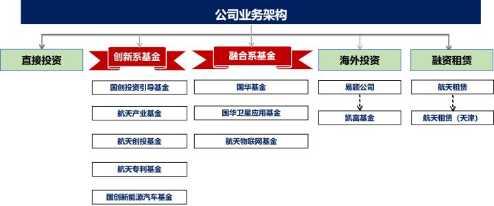

### 7、中国航天国际控股有限公司

中国航天国际控股有限公司（航天控股）是中国航天科技集团公司（中国航天）在香港的上市公司（股份代号：31）。中国航天作为航天控股的大股东，是中国进行空间技术和产品（航天器、运载火箭、卫星等）的开发、研究、生产和商用的企业，拥有雄厚的专业人才资源和技术力量优势。

### 8、北京神舟航天软件技术股份有限公司

北京神舟航天软件技术股份有限公司（简称“神软”）是由中国航天科技集团有限公司控股的专业化软件企业，是认定的重点高新技术软件企业。

神软作为以提供自主研发软件和服务为优势的大型专业软件与信息服务公司，目前，神软拥有十一家全资及控股子（分）公司，建立起覆盖全国的服务体系。不但是中国航天软件研发中心，还长期与国内外知名厂商开展深度合作，形成具有行业特色的软件产品和服务体系，具备了大型软件研发、大型项目集成等综合服务能力。

### 9、深圳航天科技创新研究院

深圳航天科技创新研究院（以下简称“深航院”）是由中国航天科技集团公司、深圳市、哈尔滨工业大学共同出资组建，通过强强联合、优势互补，创办的高新技术孵化平台。研究院属事业单位，推行企业化管理，是中国航天科技集团公司在珠三角地区开展卫星应用总体、智慧产业发展等领域战略布局单位，长期承担国防研发及研制任务，具有完全的军工科研生产资质。

成都软件联合创新中心隶属于深圳航天科技创新研究院，位于成都青羊总部经济基地3栋3层。中心主要开展嵌入式计算、虚拟仿真等关键技术研究工作，专业从事工业基础软件以及虚仿教育软件的研发、销售业务。

中心主要业务包括：围绕物联网、集成电路产业建设线上虚仿实验教学平台并实现推广；紧贴教育发展政策，与院校一同建设“双师型”培养培训基地、企业实践基地；融合航天特色，在院校推广航天产业学院和ICT类专业的产教融合项目。

### 10、航天长征国际贸易有限公司

航天长征国际贸易有限公司（简称“长征国际”）是由批准成立并从事防务、反恐、防暴装备及技术进出口等业务的公司。

## 四、11家上市公司

### 1、中国东方红卫星股份有限公司

中国东方红卫星股份有限公司（简称：“中国卫星”）是中国航天科技集团公司第五研究院控股的上市公司（SH.600118），是专业从事小卫星及微小卫星研制、卫星地面应用系统集成、终端设备制造和卫星运营服务的航天高新技术企业。公司注册资本11.82亿元。

依托央企资源，把握战略性产业发展方向，经过多年的不懈努力，中国卫星现已发展成为具有天地一体化设计、研制、集成和运营服务能力，专注于宇航制造和卫星应用两大主业的企业集团，形成了航天东方红、航天恒星、深圳东方红等一系列知名品牌。

公司现拥有12家全资/控股子公司，研发和产业基地主要分布在北京、深圳、天津、西安、烟台等地。截至2019年底，公司从业人员达4100余人，已建立形成了以高科技人才与经营管理人才为主的专业人才队伍。公司经营业绩良好，2019年公司实现营业收入64.59亿元，利润总额4.15亿元，经济运行健康平稳。后续，公司将按照既定的战略路线，在航天强国战略的牵引下，紧抓机遇，坚持技术创新、管理创新、模式创新，进一步完善产业布局，推动产业优化升级，打造具有国际竞争力的核心产品，增强产业整合能力，制造与服务并重，推动两大主业发展，加快向世界一流综合型宇航企业迈进。

10家下属公司：

1. [航天东方红卫星有限公司](https://link.zhihu.com/?target=http%3A//www.spacesat.com.cn/templates/content/index.aspx%3Fnodeid%3D62%26page%3DContentPage%26contentid%3D390)
2. [航天恒星科技有限公司](https://link.zhihu.com/?target=http%3A//www.spacesat.com.cn/templates/content/index.aspx%3Fnodeid%3D62%26page%3DContentPage%26contentid%3D389)
3. [深圳航天东方红卫星有限公司](https://link.zhihu.com/?target=http%3A//www.addchina.net/)
4. [航天恒星空间技术应用有限公司](https://link.zhihu.com/?target=http%3A//www.space-star.com/)
5. [天津恒电空间电源有限公司](https://link.zhihu.com/?target=http%3A//www.spacesat.com.cn/templates/content/index.aspx%3Fnodeid%3D62%26page%3DContentPage%26contentid%3D382)
6. [东方蓝天钛金科技有限公司](https://link.zhihu.com/?target=http%3A//www.obtc.cn/)
7. [广东航宇卫星科技有限公司](https://link.zhihu.com/?target=http%3A//www.515cn.com/)
8. [北京星地恒通信息科技有限公司](https://link.zhihu.com/?target=http%3A//www.xdht.net/)
9. [航天天绘科技有限公司](https://link.zhihu.com/?target=http%3A//www.spacesat.com.cn/templates/content/index.aspx%3Fnodeid%3D62%26page%3DContentPage%26contentid%3D754)
10. [西安航天天绘数据技术有限公司](https://link.zhihu.com/?target=http%3A//www.aerors.com/)

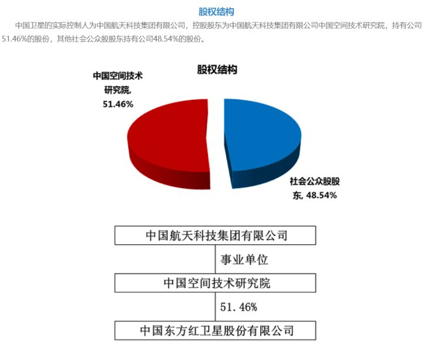

### 2、上海航天汽车机电股份有限公司

上海航天汽车机电股份有限公司（简称“航天机电”）成立于1998年5月28日，是中国首家以“航天”命名的上市公司，是航天技术应用产业化的重要平台。

公司依托央企资源，把握战略性产业发展方向，经过多年的不懈努力，已形成新能源光伏、高端汽配和新材料应用三大产业格局，建成了垂直一体化的航天光伏产业链，以及集研发、制造、营销一体的高端汽配产业平台和新材料产业平台，打造了上海、内蒙古、江苏三大产研基地，拥有4家级、上海市级技术研发中心和5家上海市高新技术企业。

公司主要从事多晶硅、太阳能电池、电池组件及光伏电站系统集成、车用空调、传感器、电机、控制器、航天复合材料结构件、新材料轨道交通应用、特种高压气瓶等产品的研发、生产和销售。

### 3、陕西航天动力高科技股份有限公司

陕西航天动力高科技股份有限公司是中国航天科技集团有限公司航天推进技术研究院下属的大型上市高新技术企业，是中国液体动力技术产业发展平台，成立于1999年12月。

公司总部位于西安市高新技术开发区，下辖6家专业化子公司、6个科研生产事业部/分公司、4个专业技术研发中心，1个公司级的创新研究院。公司以航天液体动力技术为核心，主要从事特种装备研发制造和节能环保产业，产品已成功应用于石油、化工、冶金、交通、能源、工程机械、公共事业、军工等诸多行业和领域，远销东南亚、南美洲、欧洲、非洲等全球20多个地区。公司注册资本63820.6348万元，总资产39.29亿元，公司员工2160余人。

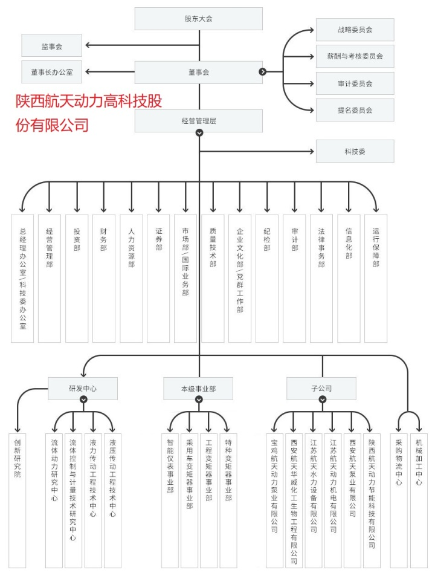

### 4、航天时代电子技术股份有限公司

航天时代电子技术股份有限公司（简称航天电子）是中国航天科技集团有限公司旗下从事**航天电子专业产品研发与生产销售**的高科技上市公司。

航天电子立足航天军工，服务国民经济，主要从事军用电子专用产品、电线电缆产品研发与生产销售，业务涉及无人装备、物联网、惯性导航、遥测遥控、集成电路、机电组件、电线电缆等七大板块。主要产品包括军民用无人机系统、精确制导武器系统；测控通信系统、遥感信息系统、卫星应用等系统级产品；军民用惯性导航产品、卫星导航产品、遥测遥控设备、精确制导与电子对抗设备、计算机技术及软硬件等专业设备；军民用集成电路、传感器、继电器、电连接器、微波器件、精密机电产品；民用电线电缆及军用特种电缆等产品；智慧城市、智慧政务、智慧农业等系统解决方案。

航天电子现有19家子公司，是卫星导航应用工程研究中心核心依托单位，拥有14个省、直辖市、自治区认定的企业技术中心、工程技术研究中心和企业研发中心。

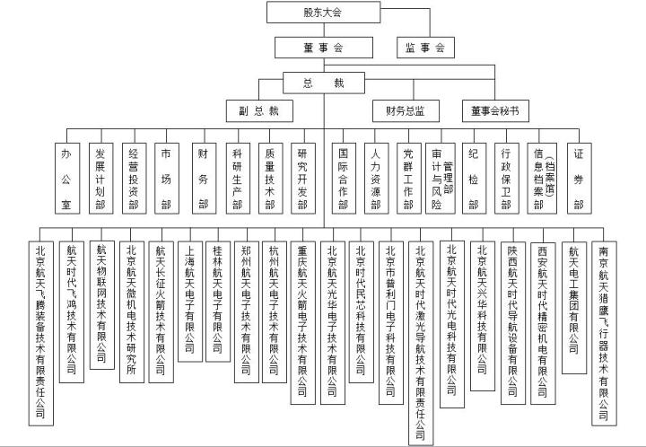

### 5、中国航天万源国际（集团）有限公司

中国航天万源国际（集团）有限公司（简称“中国航天万源”）是中国运载火箭技术研究院（简称“火箭院”）的控股子公司，原为航天科技通信有限公司（简称“航通”），1997年5月在开曼群岛注册成立，1997年8月在香港联合交易所上市。

2005年7月，火箭院成功收购航通的控股权；2007年10月进行资产重组，将其主营业务转移到鼓励、支持的新能源、新材料应用和环保领域；成为从事以风机研发制造和风电场开发为代表的风电产业、以稀土电机应用为代表的节能产业、以汽车发动机管理系统为代表的环保产业的多元化业务上市公司。

火箭院作为中国运载火箭的发祥地、中国最大的运载火箭研制实体，在出色完成运载火箭科研生产任务的同时，充分利用香港资本市场机制，积极实施资本运作，壮大经营规模，为中国航天万源快速健康发展奠定了坚实的基础。

### 6、中国航天国际控股有限公司

中国航天国际控股有限公司（航天控股）是中国航天科技集团公司（中国航天）在香港的上市公司。中国航天作为航天控股的大股东，是中国进行空间技术和产品（航天器、运载火箭、卫星等）的开发、研究、生产和商用的企业，拥有雄厚的专业人才资源和技术力量优势。

为配合集团公司新的发展战略和发展方向，本公司已將其中文名称改为“中国航天国际控股有限公司”（股份简称 ：“航天控股”)。

### 7、亚太卫星控股有限公司

亚太卫星控股有限公司（股份简称：亚太卫星）为香港联合交易所有限公司上市之公司，全资拥有亚太通信卫星有限公司及其附属公司（统称为「亚太卫星集团」）。

亚太卫星集团自一九九二年开始营运，现拥有和经营有亚太1号、亚太1A、亚太2R、亚太5号及亚太6号五颗在轨卫星（「亚太卫星系统」），覆盖亚洲、欧洲、非洲和澳洲等全球约75%人口之地区，为这些地区之广播和电信客户提供。优质的卫星转发器、卫星通信与卫星电视广播传输「一站式」服务。

### 8、乐凯胶片股份有限公司

乐凯胶片股份有限公司成立于1998年1月16日，是由中国乐凯胶片集团公司（简称”乐凯集团”）发起并重组其下属的彩色感光材料生产、科研、销售的相关生产经营性资产，以募集股份方式组建的股份有限公司。

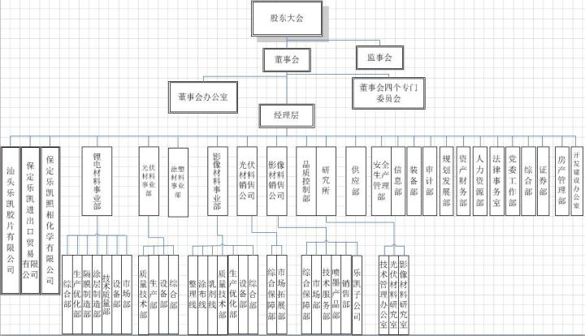

### 9、航天长征化学工程股份有限公司

航天长征化学工程股份有限公司（以下简称“航天工程公司”）（股票代码603698）成立于2007年6月，隶属于中国航天科技集团公司中国运载火箭技术研究院，专业从事煤气化技术及关键设备研发、工程设计、技术服务、设备成套供应及工程总承包。

航天工程公司依托中国航天在运载火箭和液体火箭发动机研制、生产和试验方面积累的优势，应用于煤炭洁净高效利用领域，形成了拥有我国完全独立自主知识产权的“航天粉煤加压气化技术”，可广泛应用于煤制合成氨、煤制甲醇、煤制烯烃、煤制乙二醇、煤制天然气、煤制油、煤制氢、IGCC发电等多个领域。

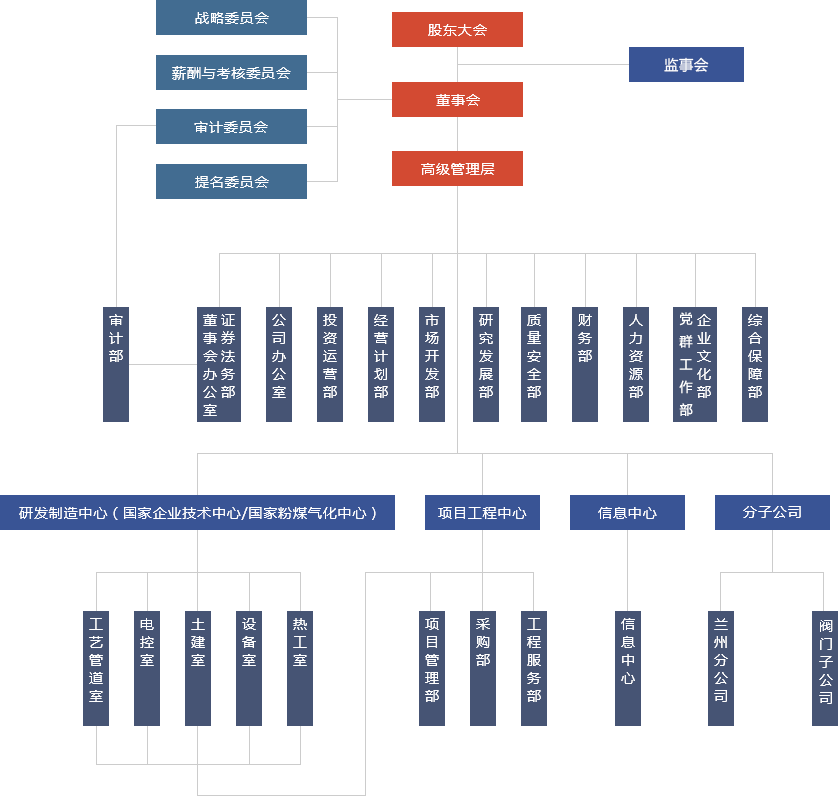

### 10、保定乐凯新材料股份有限公司

保定乐凯新材料股份有限公司（简称：乐凯新材），前身为保定乐凯磁信息材料有限公司，成立于2005年2月，是在原中国乐凯胶片集团公司乐凯磁带厂改制的基础上设立的有限责任公司。乐凯新材是国内信息记录材料行业中同时从事磁记录和热敏记录材料领域的龙头企业。主要产品包括热敏磁票、磁条、磁卡，其中，热敏磁票获得“重点新产品证书”、“河北省科技进步二等奖”等多项荣誉；磁条及PET磁卡产品获得河北省科技厅颁发的“高新技术产品证书”。

乐凯新材为认定的高新技术企业，拥有河北省企业技术中心，已掌握先进的磁记录技术、热敏技术、涂布工艺技术，先后承担过多项级、省市级重点科研项目，是中国磁记录行业协会秘书处、全国磁记录材料标准化技术委员会秘书处的承担单位。

### 11、北京康拓红外技术股份有限公司

北京康拓红外技术股份有限公司（以下简称“公司”或“康拓红外”）成立于2007年9月4日，隶属于中国航天科技集团有限公司中国空间技术研究院。公司于2015年5月15日在创业板上市，2019年完成与轩宇空间和轩宇智能的重大资产重组。

公司紧密围绕控制技术，重点聚焦轨道交通、航天航空、核工业三大战略性行业领域，形成了**铁路车辆运行安全检测及检修系统、智能测试仿真系统和微系统与控制部组件、核工业自动化装备**三大业务板块的产业格局。公司产品已应用于载人航天、北斗导航等多个重大专项，遍布于全国18个铁路局、集团公司和亚非大陆，与中国工程物理研究院、中核集团、中铁集团等形成长期稳定的合作关系。

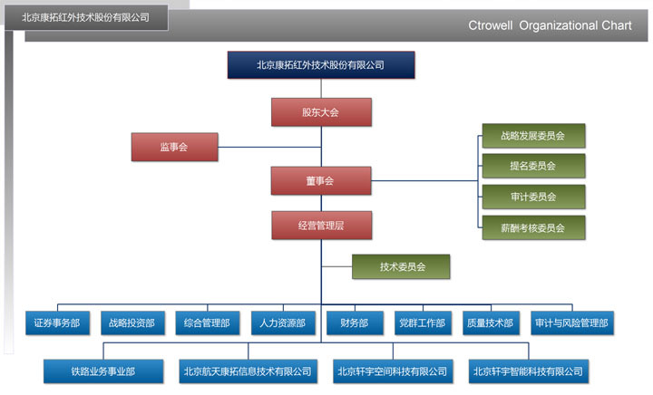

引自 北京康拓红外技术有限公司

以上为航天科技8个院、直属单位、子公司以及上市公司的介绍。

近年来，随着投入逐渐增大，航天的待遇大有提升，待遇最好的是五院，八院近年来也涨薪不断，应届硕士可以拿到20多万，对于立志航天事业的，当前航天科技是个不错的选择。

**以上供参考，更多职场交流，欢迎点赞、关注** [@闲话国企](//www.zhihu.com/people/1dc9b56014f47dfcb9969a644ff87739)**。**

编辑于 2022-05-05 12:52

### 文章被以下专栏收录

## 职场菜鸟看国企

菜鸟视角看央企国企 欢迎各位交流学习

### 推荐阅读

[职场菜鸟看国企（十六）——中国航天科工集团组织架构、航天科工集团子公司目录、航天科工集团子公司汇总清单、航天科工包括哪些子公司？
中国航天科工集团有限公司（简称 中国航天科工），中国航天科工前…
闲话国企 · 发表于职场菜鸟看国企

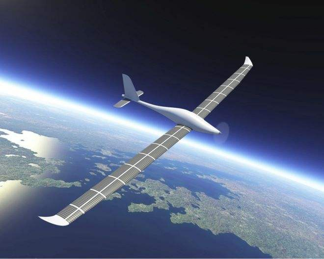](https://zhuanlan.zhihu.com/p/509415282)[职场菜鸟看国企（十七）——中航工业集团组织架构、中航工业集团子公司目录、中航工业集团子公司汇总清单、中航工业包括哪些子公司？
中国航空工业集团有限公司（简称“航空工业”）是 国有特大型企业…
闲话国企 · 发表于职场菜鸟看国企

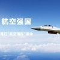](https://zhuanlan.zhihu.com/p/509788872)[中国航天科工集团第三研究院及下属单位简介
中国航天科工集团第三研究院成立于1961年，是目前我国集预研、研制…
八院懂哥

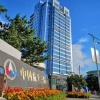](https://zhuanlan.zhihu.com/p/483644473)[图解 | 中航科技发展路线详解, 集团资产状况如何?
一. 集团是国内航天科技工业的主导力量 1. 集团历史沿革与业务概况 中国航天科技集团公司前身为1956年成立的国防部第五研究院，曾经历第七机械工业部、航天工业部、航空航天工业部和中国航…
范小刀 · 发表于军民融合](https://zhuanlan.zhihu.com/p/38244739)

打开知乎，查看超 5 亿专业优质内容

​ 3​

​

_想来知乎工作？请发送邮件到 jobs@zhihu.com_

原文链接：<https://zhuanlan.zhihu.com/p/508860655?utm_source=wechat_session&utm_medium=social&utm_oi=1248232391560601600&utm_campaign=shareopn>
