# 航空发动机产业链全景解析：整机制造篇

     

# 航空发动机产业链全景解析：整机制造篇

[军工投行](javascript:void(0);)

**军工投行** 

微信号 jungongtouhang2020

功能介绍 卓越 担当 效率 信任

_2022-11-30 11:37_ _发表于辽宁_

收录于合集

#行业研究 4 个
#航空发动机 4 个

航发整机是航发链条中产业地位最稀缺、技术壁垒最高的环节。航空发动机整机涵盖产品全寿命周期的设计、制造、总装、试车整套技术和发动机综合服务保障能力。
由于技术壁垒高、研制周期长、准入门槛高等特点导致航空发动机整机环节的切入难度极大，当今世界能够独立研制航空发动机并形成产业规模的也仅仅只有中、美、俄、英、法等五国，因此我们看到无论是全球还是国内，航发总装企业都处于寡头垄断/垄断地位，叠加经济回报好的特点导致航发总装企业的成长确定性高。
为了打破这种僵局，我国不断加大在整机制造上的研发费用，以及大力扶持本土相关加工制造企业，以求在不远的未来为我国的航天机械都安装上自己的“心脏”！

**一**

**商用航发市场呈寡头垄断格局**

美、英、法、德、日等西方国家通过其寡头企业，垄断了世界航空发动机市场。美英法寡头企业，包括其合资公司，占领了世界航空发动机市场的70%，而在新机市场上的价值份额更高达90%。全世界能造飞机的公司十数家，而独立的航空发动机供应商只有几家。

图：全球航空发动机供应链主要参与者

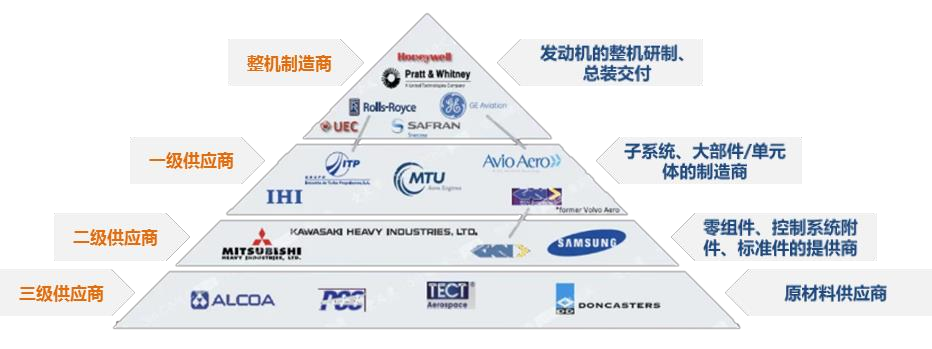

资料来源：《航空发动机产业现状与趋势》、浙商证券研究所

美国通用电气（GE）、美国普拉特·惠特尼（PW）、英国的罗尔斯·罗伊斯（RR）、以及这三家公司同法国赛峰集团（Safran）相互间合资成立的：斯奈克玛国际CFMI（Safran/GE）、IAE（RR/PW）、EA（GE/PW）这些企业具有独立研制航空发动机整机的能力，几乎控制了全球大型民用航空发动机的核心技术研发、总装集成、销售及客户服务等全产业链。

表：六大航空发动机整机企业部分产品及装配机型一览

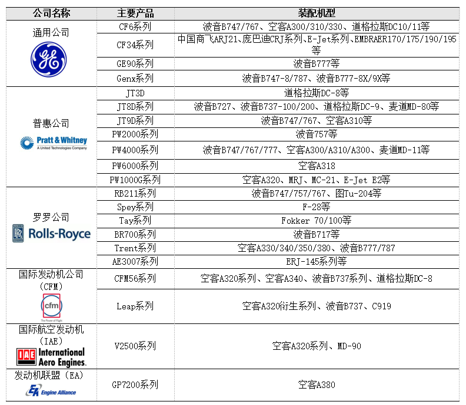

资料来源：Commercial Engines 2017

如同在大型民机领域，不管多难，我们也要像变现在的A（Airbus）＋B（Boeing）两霸并立为A＋B＋C（Comac）三极鼎立的新格局那样，在航发领域，我们也要加入世界航空发动机“强人俱乐部”，让世界的东方形成一极，从而逐步改变航空发动机世界格局。

**二**

**国内政策力度不断加大，**

**自主研发****走****向****新****征程**

近些年来，随着我国加大在航发领域的投资与研发，中国国产发动机不断地攻破难关。**在十四五规划的100项重点项目中航空发动机名列首位，**从中可以看出国家大力发展航空发动机的决心。十四五新采购模式下，军机核心受益，航空发动机是整机产业链的心脏。十四五军工企业订单合同框架的预付模式发生改变，这一改变将大幅度改善军工企业的现金流。与之相对，我国已经在发动机上面的研究有很大的进步，正在减少与世界一流水平的差距。

图：我国自主研发的AEF1300

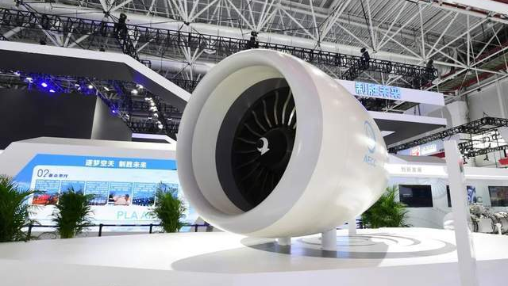

**三**

**航空发动机组成结构**

**航空发动机是飞机的“心脏”，是保证航空飞行器战术技术性能和飞行安全的决定性部件。**航空涡轮发动机主要由风扇、压气机、燃烧室、涡轮和尾喷管组成。从进气装置进入的空气在压气机中被压缩后，进入燃烧室并在那里与喷入的燃油混合燃烧， 生成高温高压燃气。燃气在膨胀过程中驱动涡轮作高速旋转，将部分能量转变为涡轮功。涡轮带动压气机旋转不断吸进空气并进行压缩，使发动机能连续工作。高压压缩机、燃烧室和高压涡轮被称为核心机。在运行过程中，该部分将受到温度、压力和转速方面最苛刻条件的影响。因此，核心机将以更快的速度劣化，可能在每次大修时进行维修、更换，以恢复失去的性能。

图：双轴发动机结构图和核心机组成部分

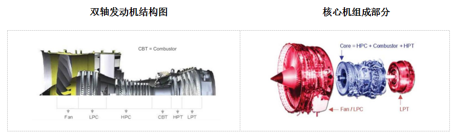

数据来源：《Engine Maintenance Concepts for Financiers》（Shannon Ackert，2011），广发证券发展研究中心

现代航空发动机由模块构成，任何组成模块都可以作为一个整体更换。

风扇/低压压缩机（LPC）模块是发动机上的第一个部件。风扇模块的关键部件包括风扇叶片、风扇盘和压缩机壳体。目前的风扇叶片通常由钛制成，但许多新一代机型也使用高强度复合材料。

高压压缩机（HPC）模块由一系列转子和定子组件组成，其主要功能是提高供应给燃烧室的空气压力。转子组件关键部件是轴向安装的压缩机叶片，而定子组件关键部件是压缩机叶片。

燃烧室（CBT）是向循环中添加燃料以产生热能的地方。目前大多数现代涡扇发动机采用环形燃烧系统。燃烧室的关键部件包括内壳、燃料喷嘴和高压喷嘴导向叶片。

高压涡轮（HPT）模块位于压缩机后机架后部和LPT定子壳体前部。HPT模块由HPT转子和喷嘴导叶组件组成，用于提取燃烧热能以驱动高压压缩机和附属齿轮箱。

低压涡轮机（LPT）位于HPT模块的下游。LPT部件包括LPT转子、LPT喷嘴定子罩和涡轮机后机架。LPT提取剩余的燃烧热能，以驱动风扇和低压压缩机转子组件。

附件驱动部分通常连接到发动机芯或风扇壳体。附件驱动装置将发动机的机械能传输到安装在附件齿轮箱上的基本发动机和飞机附件（如发电机和液压泵）。

图：动机模块拆分

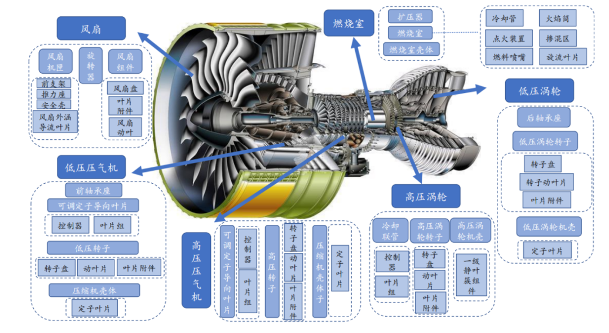

数据来源：《Engine Maintenance Concepts for Financiers》（Shannon Ackert，2011），广发证券发展研究中心

**四**

**航空发动机整机价值拆分**

**我国设计研发环节主要由相关研究院所及高校组成。**加工制造（原材料）环节传统上以**钢铁金属材料类企业、研究院所为主，**近年来部分民营企业也有参与。加工制造（零组件）环节传统上以航发集团系统内单位为主，但近些年来系统外企业参与这一配套环节的积极性高涨、现如今各类型企业众多。整机集成交付环节基本由航发集团垄断。运行维修分军用民用，军用主要由航发集团、军队相关单位提供维修保障；民用主要由各大航司及其与航发OEM等组建的合资公司提供维修保障。

航空发动机产业链包括原材料→零部件→分系统→整机→维修五大环节。我国军用航空发动机经历了“维护使用-测绘仿制-型号研制-开展预研”的过程，当前已建立起了相对完整的发动机研制生产体系，我国军用航空发动机产业链相关企业一览如下：

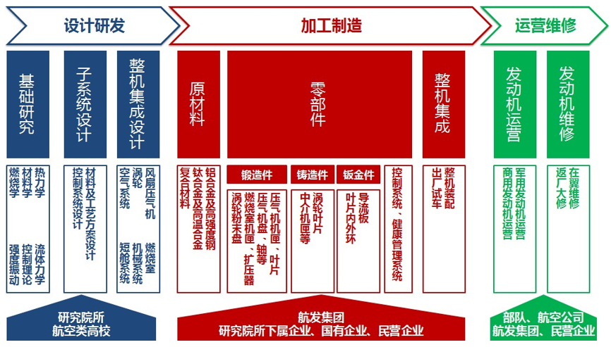

 **_1_** 

**设计研发环节主要由相关研究院所**

**及****高****校****组成，无上市公司**

航空发动机设计研发这一环节中集中了大量优质资源。可分为基础研究及关键技术研究、子系统研发、整机集成设计等几大类。基础研究及关键技术研究目前主要由相关高校航空航天专业、中科院相关院所承担。子系统研发主要包括材料工艺方案和控制系统两大类，分布在航发集团、航空工业集团、中科院系统以及一些地方政府下属的科研机构中。整机集成设计的几大主机所则均为航发集团所属。

图：航发集团下属研究院所覆盖航空发动机设计各主要领域

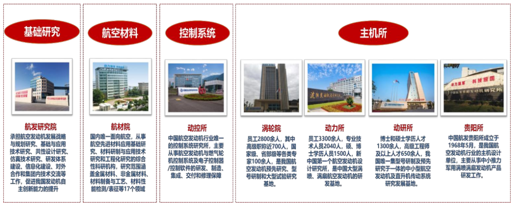

资料来源：Wind，航发集团招聘信息等、浙商证券研究所收集整理

 **_2_** 

**整机集成交付环节由航发集团垄断**

我国航空发动机整机集成交付领域共有八大主机厂，全部为中国航发集团下属，其中5家注入上市公司或作为上市公司母公司。航发动力囊括了其中4家，基本覆盖了当前航发集团主要在研或已服役的先进发动机型号。太行发动机已经进入稳定服役状态，将随着三四代战斗机的上量享受确定的业绩增长。三代中等推力航空发动机生产线建设项目也于今年通过竣工验收，将有望随枭龙、FC-31战机一并上量。

图：我国航空发动机产业八大主机厂，其中五家与上市公司相关，航发动力独占四家

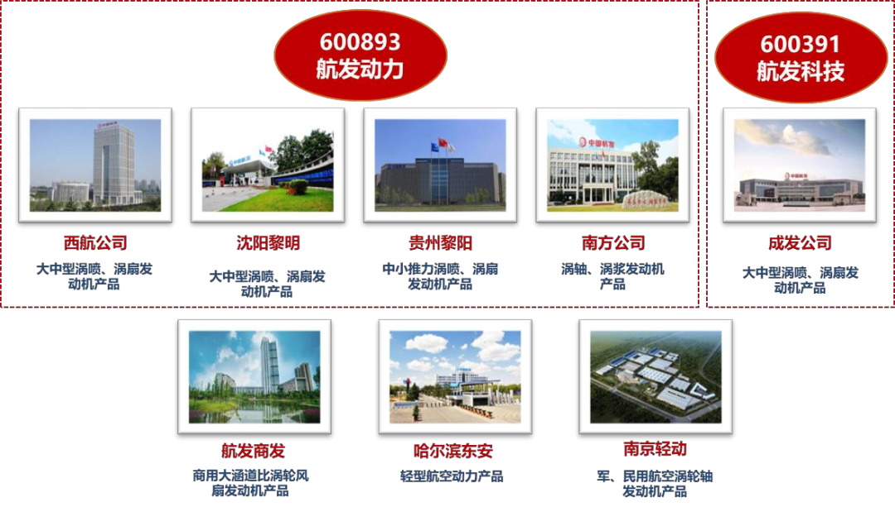

资料来源：Wind、中国航发集团官网、航发集团招聘信息等、浙商证券研究所

 **_3_** 

**加工制造（零组件）以“转包”**

**方式****调****动****全****球产业链**

从整体上来看，为了应对航空工业对航空发动机不断提高的性能要求，航空发动机零部件正向着高性能（高温、高压比、高可靠性）发展，其除了依存于原材料性能的提升之外，更依存于制造环节对高性能要求的生产与实现。因此无论在研制阶段还是在量产阶段，航空发动机的发展除了发动机本身的设计水平外，必然离不开上游配套高性能零部件制造供应链的集群支撑。

航空“转包”生产是全球航空飞机及发动机制造商普遍采用的一种基于“主制造商-供应商”的供应链合作模式。在全球“转包”生产形式下，飞机及发动机制造商主要负责总体设计和细节设计，承担主要结构件和系统间设计和制造工作，并负责最后的总装。供应商根据主制造商需要参与具体各个部件的生产制造中。主制造商通过合同约定以及考核的方式，对供应商的进度、质量、成本和交付进行严格管理。从整体产业链而言，主制造商通过“转包”生产模式充分调动了全球产业链分工，降低了自身产品制造成本，使得其可以将主要精力投入于下一代产品的研发，加强其在国际市场的竞争力。按照国际航空发展惯例，飞机及发动机产品的输出方（如波音、GE航空等）至少得向输入市场转包生产不低于20%的零部件转包生产份额，即“补偿贸易额度”。

中国参与国际航空“转包”业务起始于20世纪70年代，随着融入国际航空产业链的程度不断加升，我国逐渐介入到航空发动机零部件的“转包”业务之中。2015年-2020年，我国民用航空发动机零部件总体转包交付金额从103亿元增长到144亿元，年均复合增长率为6.93%。

图：典型小涵道比涡扇发动机EJ200机械部件示意图

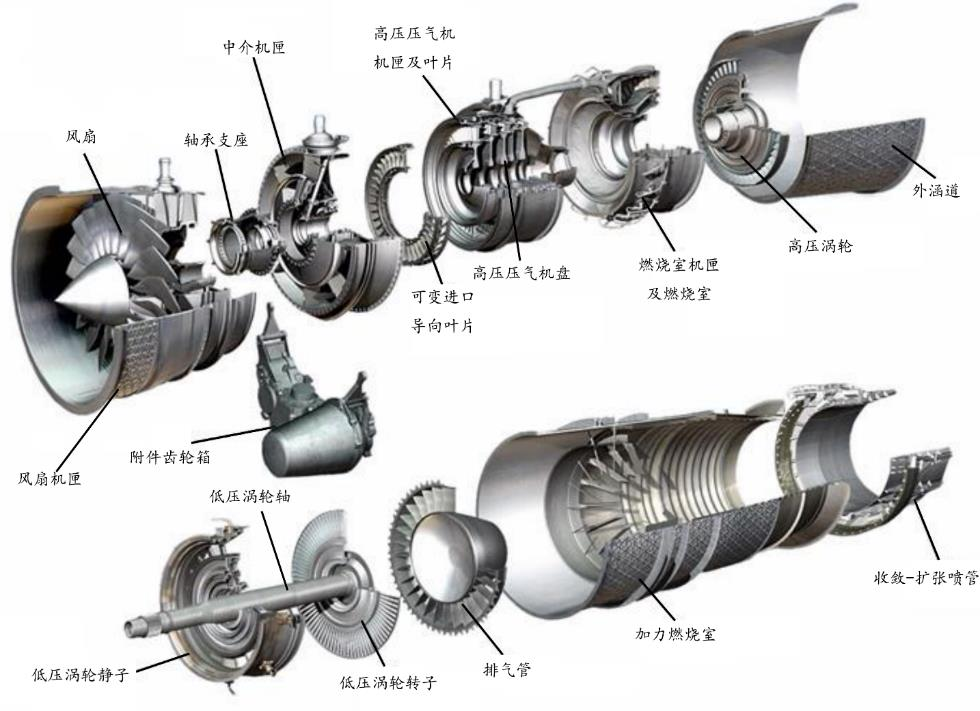

资料来源：国盛证券研究所

 **_4_** 

**运营维修：“全面聚焦备战打仗”**

**背景****下的****行业增长新动力**

运营：军用、商用航空发动机的运营方分别为军队和航空公司。

维修：军用发动机一部分由解放军57XX厂提供维修服务，另一部分由发动机整机制造商航发动力分别在贵州、山西、吉林的维修厂提供售后维修保障服务。发动机维修保障环节的利润率较初始产品交付更高，后续随着“全面聚焦备战打仗”背景下实战化训练的增多，军用发动机维修保障领域市场空间将有望快速上升，为相关企业带来业绩增长的新动力。

民用领域，多个航空公司与国外OEM或国外航空公司、专业发动机维修公司等建立合资公司，用于为自身及行业提供发动机及飞机维修保障服务。此外，上市公司中航新科技、海特高新也涉足有航空发动机维修市场。未来随着军民用航空发动机的放量增长，航空发动机维修市场也将迎来市场空间的扩充。

图：部分民航客机发动机维修中外合资企业

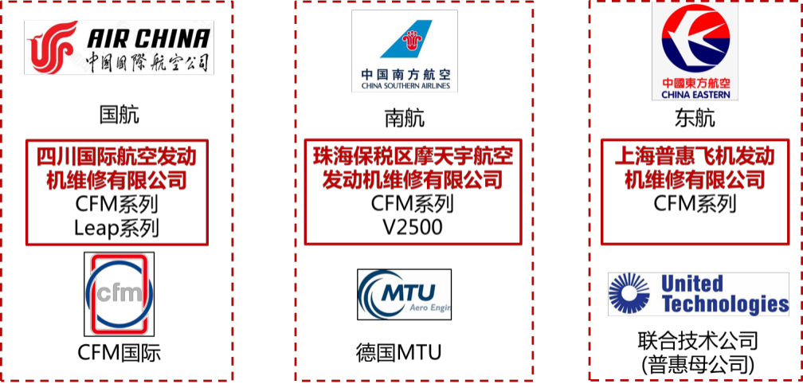

资料来源：Wind、浙商证券研究所

**五**

**按全寿命周期：**

**“研发、制造、维护”****三****大****阶段**

航空发动机全寿命周期要经历研发、制造、维护三大阶段，分别约占全寿命周期价值量的10%、45%、45%。 

**1、研发：**航空发动机的研发阶段成本占全生命周期价值量约 10%，包括设计、试验、制造三大费用，根据《航空发动机-飞机的心脏》所述，三者占比分别为 10%、50%、40%。根据《中国航空工业技术政策》，航空发动机研发阶段可以分为预先研究阶段和型号研制两个阶段，研发费用分别占比40%和60%，其中各子阶段研发费用占比为应用基础4%、先进部件 26%、技术验证机10%、型号验证机50%、工程发展 10%。

**2、制造：**航空发动机的采购阶段成本占全生命周期价值量约45%，主要由原材料、人工成本等其他成本构成，其中原材料占比最高达到50%，主要包括高温合金、钛合金、铝合金等。所谓“一代材料、一代航空发动机”，新型航空发动机的高价值主要体现在材料端，目前先进航空发动机中高温合金用量高达40%~60%。

表：我国军用航空发动机整机研制生产企业一览(单位：亿元/%)

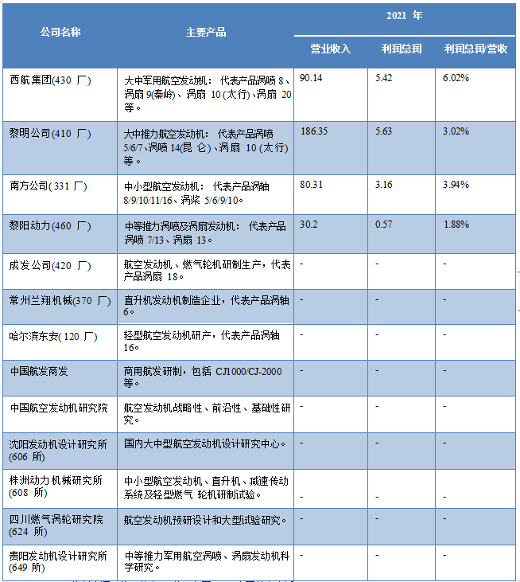

资料来源：公司公告，公司官网，《中国航空史话》

**3、维修：**航空发动机维修使用阶段成本占全生命周期价值量约45%，可以拆分为：零备件航材：51%；发动机大修和零部件修理：22%；航线维修：10%；外场更换周转件：9%；其他：8%。

图：推力随使用时间/修理次数的变化曲线和耗油率随使用时间/修理次数的变化曲线

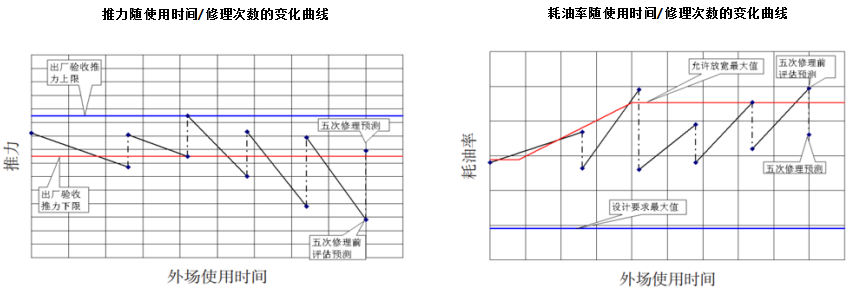

资料来源：CNKI《航空发动机寿命控制体系和寿命评定方法》，国盛证券研究所

表：航空发动机全寿命周期价值分布

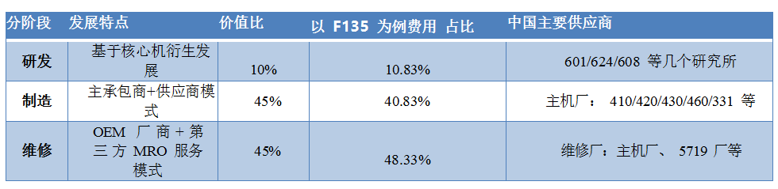

资料来源：《Portfolio Systems Acquisition Office of The Under Secretary of Defense》

图：航空发动机全生命周期价值拆分

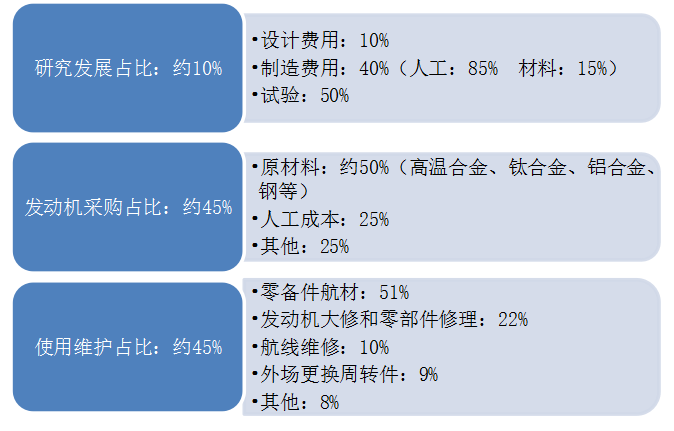

资料来源：《航空发动机-飞机的心脏》，《谈航空发动机售后服务和热端部件的典型修理技术》，前瞻产业研究院

整理：宋林峰

军工投行，立足军工，辐射高端制造

欢迎通过公众号后台留言与我们联系!

欢迎扫码关注↓↓↓↓

**喜欢本篇内容请给我们点个在看**

预览时标签不可点

收录于合集 #行业研究
 4个
上一篇航空发动机产业链全景解析：行业与市场空间篇

喜欢此内容的人还喜欢

美国国家安全局：停止使用 C 和 C++

美国国家安全局：停止使用 C 和 C++

云头条

不喜欢

不看的原因
确定

* 内容质量低

* 不看此公众号

全球首艘“免绑扎集装箱船”来了！

全球首艘“免绑扎集装箱船”来了！

中国航务周刊

不喜欢

不看的原因
确定

* 内容质量低

* 不看此公众号

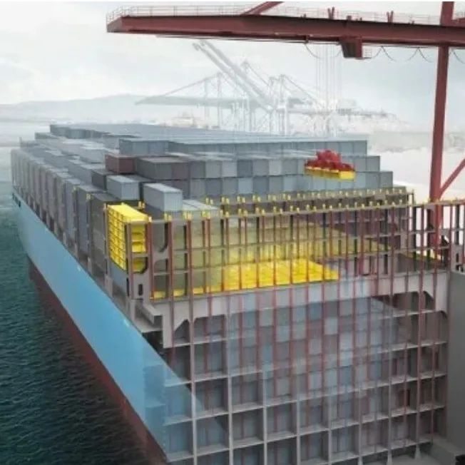

12月多方联动，一触即发！数字赋能｜赞友商城助力乡村振兴！

12月多方联动，一触即发！数字赋能｜赞友商城助力乡村振兴！

马道先知

不喜欢

不看的原因
确定

* 内容质量低

* 不看此公众号

微信扫一扫
关注该公众号

[知道了](javascript:;)

 微信扫一扫
使用小程序

[取消](javascript:void(0);) [允许](javascript:void(0);)

[取消](javascript:void(0);) [允许](javascript:void(0);)

： ， 。  视频 小程序 赞 ，轻点两下取消赞 在看 ，轻点两下取消在看
原文链接：<https://mp.weixin.qq.com/s/yhXaX4bhdoORCrfRQiPsaQ>
