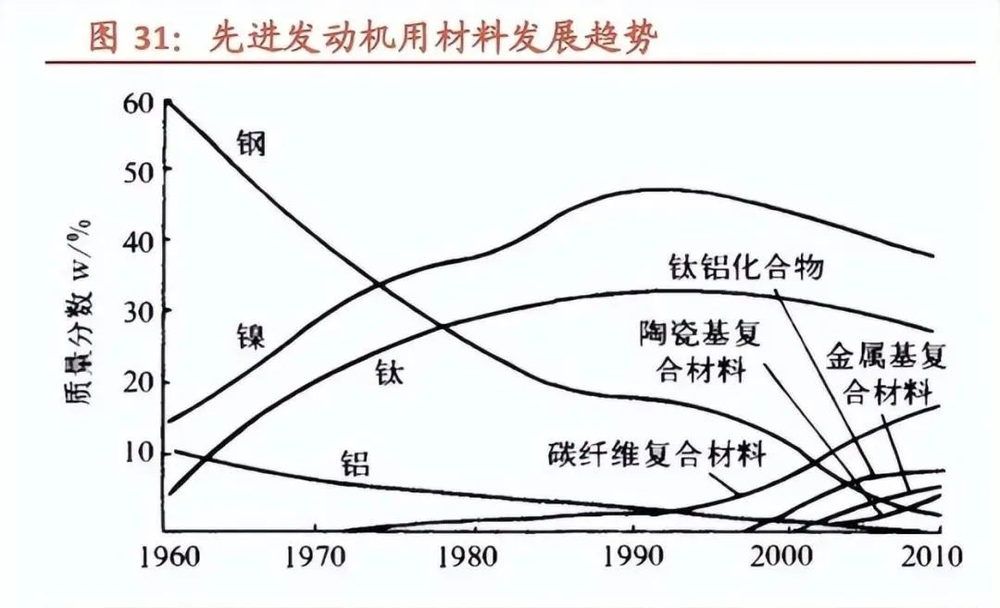
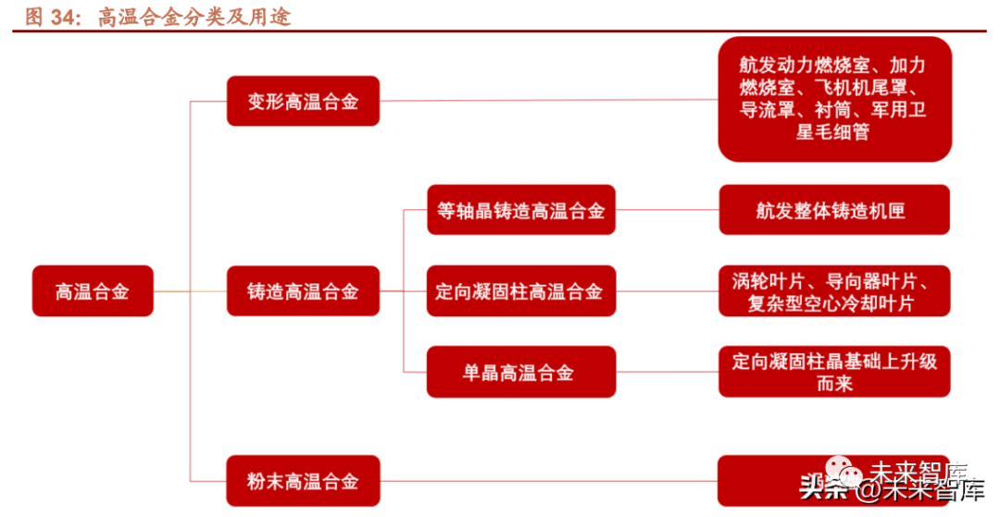
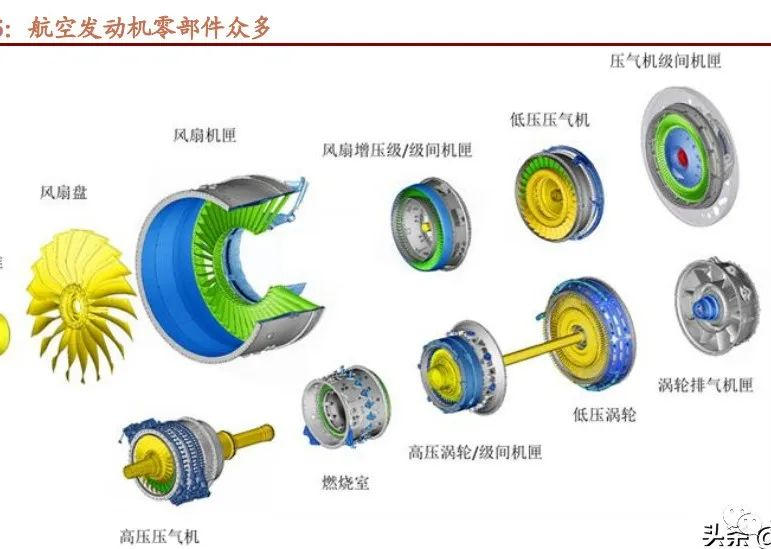
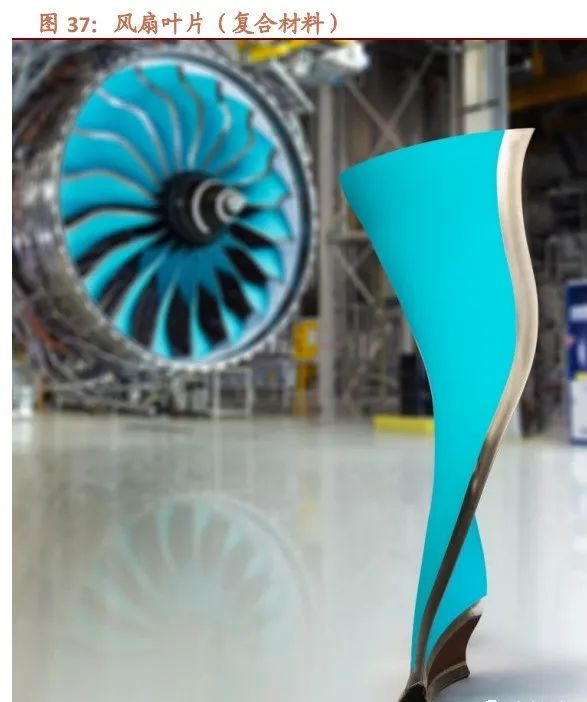
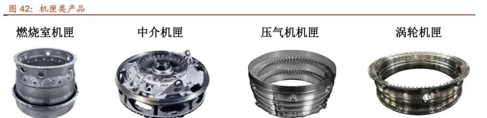
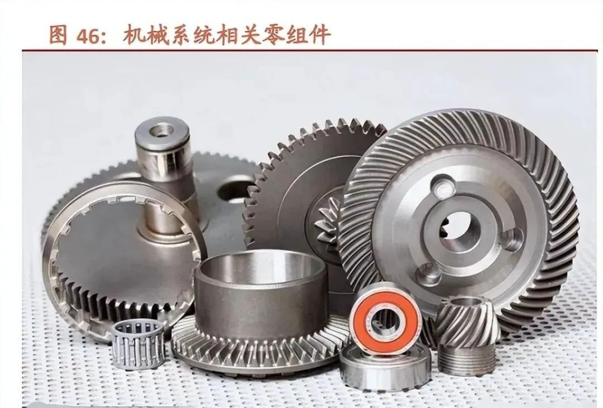
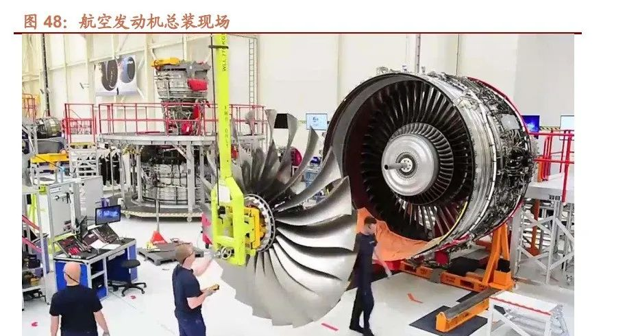
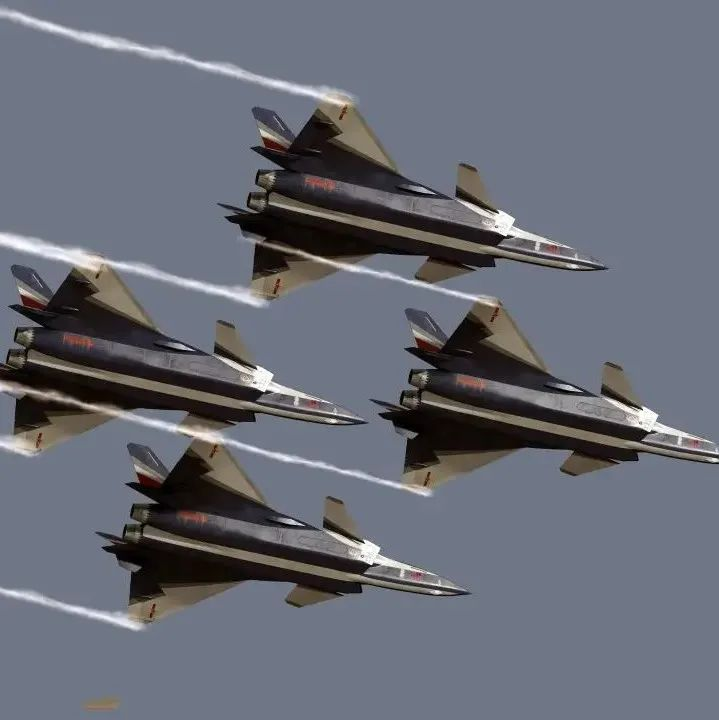
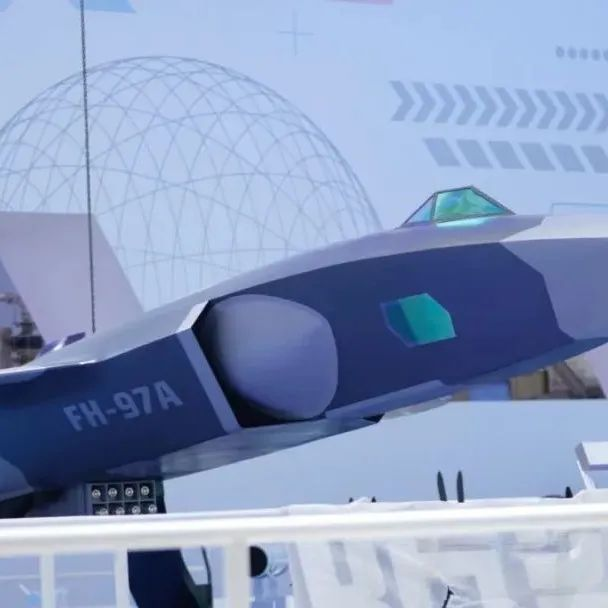

# 航空发动机产业链梳理

     

# 航空发动机产业链梳理

[前沿装备汇](javascript:void(0);)

**前沿装备汇** 

微信号 gh\_8d200d334fa7

功能介绍 聚焦国际前沿技术、科技装备顶层智慧，传递装备热点、发展历程、技术原理，装备功能、现状与趋势分析，观点交流等内容

_2022-11-17 13:12_ _发表于北京_

收录于合集

#航空发动机 73 个
#发动机 94 个
#航空 19 个
#产业链 19 个

航空发动机制造产业链从上游到下游可分为原材料、零部件、单元体/分系统、总装。

（1）原材料

航空发动机是在高温、高压、高速旋转的恶劣环境条件下长期可靠工作的复杂热力机械，在各类武器装备中，航空发 动机对材料和制造技术的依存度最为突出，航空发动机高转速、高温的苛刻使用条件和长寿命、高可靠性的工作要求， 把对材料和制造技术的要求逼到了极限。材料和工艺技术的发展促进了发动机更新换代，如：第一、二代发动机的主 要结构件均为金属材料，第三代发动机开始应用复合材料及先进的工艺技术，第四代发动机广泛应用复合材料及先进 的工艺技术，充分体现了一代新材料、一代新型发动机的特点。在航空发动机研制过程中，设计是主导，材料是基础，制造是保障，试验是关键。从总体上看，航空发动机部件正向 着高温、高压比、高可靠性发展，航空发动机结构向着轻量化、整体化、复合化的方向发展，发动机性能的改进一半 靠材料。据预测，新材料、新工艺和新结构对推重比 12~15 一级发动机的贡献率将达到 50%以上，从未来发展来看， 甚至可占约 2/3。因此，先进的材料和制造技术保证了新材料构件及新型结构的实现，使发动机质量不断减轻，发动 机的效率、使用寿命、稳定性和可靠性不断提高，可以说没有先进的材料和制造技术就没有更先进的航空发动机。

1） 钛合金

钛具有密度小、比强度高、导热系数低、低温性能好、耐腐蚀能力强、生物相容性好等突出特点，被广泛应用于航空、 航天、舰船、兵器、生物医疗、化工冶金、海洋工程、体育休闲等领域，被誉为“太空金属”、“海洋金属”、“现 代金属”和“战略金属”。钛合金是以钛为基加入适量其他元素，调整基体相组成和综合物理化学性能而形成的合金。与航空发动机常用的高温合金、钢等金属材料相比，钛合金具有低密度、高比强度、抗疲劳、耐腐蚀、工作温度范围 宽等性能优势，非常适合航空发动机的使用和服役需求。减重对提高在钛合金耐热能力范围内，航空发动机部件多数 选用钛合金材料，集中用于风扇、低压压气机和高压压气机的叶片、盘、整体叶盘、轴颈、盘轴、机匣等关键件或重 要件，以及各类管路、紧固件等。目前，钛合金在先进航空发动机上的用量约占整机重量的 25%~40%，使用温度从 进气口的大气温度到接近 600℃，对减轻发动机结构重量、提高推重比（或功重比）、降低耗油率等起到了关键作用。

2）高温合金：制造先进发动机的基石

高温合金是能够在 600℃以上及一定应力条件下长期工作的一类金属材料，具有优异的高温强度、良好的抗氧化和抗 热腐蚀性能，良好的疲劳性能、断裂韧性等综合性能，是军民用燃气涡轮发动机热端部件不可替代的关键材料。在世 界先进发动机中，高温合金材料用量已占到发动机总重量的 40%~60%。高温合金按工艺的不同，可分为变形高温合金、铸造高温合金和粉末高温合金几种不同的类型。变形高温合金具有良好的力学性能，主要用于制造航空发动机高压压气机后面级叶片、盘、机匣、燃烧室机匣等零部 件。铸造高温合金又可细分为等轴晶、定向凝固柱晶和单晶高温合金。铸造高温合金具有较好的综合性能以及抗氧化、抗 热腐蚀性能，主要用于制造高低压涡轮工作叶片和导向叶片等零部件。其中的镍基单晶高温合金是在等轴晶和定向凝 固柱晶基础上发展起来的一类先进的发动机叶片材料。与其他高温合金相比，镍基单晶高温合金具有更为优异的综合 性能，成为高推重比航空发动机的关键材料。粉末高温合金是用粉末冶金工艺制备的高温合金，用粉末冶金方法生产的高温合金，组织均匀、细小，提高了合金的 屈服和抗疲劳强度，表现出优异的综合力学、热工艺及耐腐蚀、抗氧化性能。目前，粉末高温合金主要用于制造航空 发动机涡轮盘、压气机盘、鼓筒轴、封严盘、封严环、导风轮以及涡轮盘高压挡板等高温承力转动部件。

3） 复合材料

从发动机所用材料的趋势来看，碳纤维复合材料、陶瓷基复合材料、钛铝化合物、金属基复合材料的用量占比在不断 提升。复合材料的重量轻、强度高等材料特性，很好地契合了航空发动机高推重比、低耗油的发展趋势，用复合材料替代传 统材料，可以起到显著的减重效果。因此，复合材料在航空发动机领域逐渐得到应用，且应用前景广阔。目前航空发 动机上使用最广泛的就是树脂基复合材料、陶瓷基复合材料和金属基复合材料。以陶瓷基复合材料为例，从 2015 年 起，GE 公司开始在 GE9X 上开展包含燃烧室火焰筒内外环第一级高压涡轮外环、第二级涡轮导向器、涡轮转子叶片 的陶瓷基复合材料部件试验，来验证整套热端部件的功能性和耐久性。发动机的陶瓷基复合材料涡轮转子叶片能够实 现叶片减重 2/3，耐温提高 20%，对耗油率改善的贡献率达到 30%；而使用陶瓷基复合材料的燃烧室火焰筒能以更少 的冷却空气量应对更高的温度，改善发动机热效率。

（2）零部件

航空发动机由几大单元体和子系统组成，单元体包括风扇增压级、高压压气机、燃烧室、高低压涡轮、喷管等。单元 体由各种零组件组成。新一代航空发动机总共有 3 万多个零件，涉及 230 多种不同标准的材料。

航空发动机零组件具有如下特点：1）零、组件种类众多；2）难加工材料多；3）零组件结构复杂；4）零件加工精度 高；5）多种冷却小孔；6）零件表面特种工艺要求多。

1）叶片类

叶片是航空发动机关键零部件之一，直接决定发动机性能、安全与寿命。按照叶片的所处部位，叶片可以分为风扇叶片、压气机叶片和涡轮叶片；对于涡扇发动机，压气机叶片根据所在部位 的不同又分为低压压气机叶片和高压压气机叶片。按运动方式的不同，叶片又可以分为转子叶片（工作叶片，简称动 叶）和静子叶片（简称静叶，风扇和压气机的静叶称作整流器叶片，涡轮的静叶称作导向器叶片）。为了完成整流作 用或导向作用，静叶和动叶弯曲方向相反。

叶片的作用在于通过与发动机腔体配合形成空气或燃气截面及方向的不断变化，与主轴或涡轮盘等配合实现燃气的高 温压缩，保证燃气的高速流动并转换成所需要的飞机运动动力。叶片的制造量占整机制造量的三分之一左右，是发动 机中数量最大的一类零件。压气机叶片级数较多，每台发动机压气机叶片数量一般在 2,000 片左右。不同发动机型号 设计的叶片级数均存在差异。从性能上看，压气机叶片决定了总增压比，即发动机对空气流动的压缩程度， 提高发 动机的增压比可以提高航空发动机的压缩效率和燃烧效率。另一方面，涡轮叶片的制造水平直接决定了涡轮承受的极 限温度，从而影响发动机推重比与动力。因此，压气机叶片与涡轮叶片基本上决定了航空发动机热力循环的两个主要 参数，叶片设计与制造的好坏直接决定着发动机的性能、安全与寿命。

2）盘类

航空发动机盘类件绝大部分是精密回转类零件、关重零件，工作条件为高温、高压、高转速的特殊环境，零件材料均 为难加工材料，尺寸及技术条件精度严格，对操作人员的技能水平、设备精度等级、检测方法等要求较高。涡轮盘/压气机盘是航空发动机十分重要的转子部件，盘环件是航空发动机中工作条件最为苛刻、最为重要的部件之 一，承受着复杂的循环热载荷及机械载荷。盘环件受力状态十分复杂，不同部位所受温度、载荷、介质作用都不相同。涡轮盘在四大热端部件中所占重量最大。涡轮盘是航空发动机上的重要转动部件，工作温度不高，一般轮缘为 550-750℃，轮心为 300℃左右，因此盘件径向的热应力大，特别是盘件在正常高速转动时，由于盘件质量重达几十 至几百千克，且带着叶片旋转，要承受极大的离心力作用，在启动与停车过程中又构成周期性的大应力低周疲劳。用 作涡轮盘的高温合金为高强度、高持久蠕变性能的变形高温合金和粉末高温合金。在我国，涡轮盘中变形高温合金 GH4169 合金用量最大、应用范围最广。

3）机匣类

机匣是航空发动机上的主要承力部件，为发动机承受载荷和包容的关键部件，属于典型的薄壁结构零件。其主要作用 为：保护发动机核心机；给装在外部的发动机部件如燃油泵、滑油泵、发电机和齿轮箱等部件以及管路等提供支撑；内侧主要安装静子和燃烧室，和转子组件一起构成空气流通通道。按结构不同，机匣可以分为整体式环形机匣、对开式环形机匣、带整流支板机匣；按功能不同，机匣可以分为风扇机 匣、外涵机匣、中介机匣、压气机机匣、燃烧室机匣、轴承机匣、涡轮机匣、附件机匣等。机匣材料多为钛合金、高温合金。由于机匣采用难加工金属材料且结构复杂，机匣加工过程中需要着重控制高精度形 位公差及薄壁加工变形。

（3）控制系统

航空发动机控制系统就像人的大脑，负责接收各种传感器信号，进行计算处理，再驱动执行机构运动。它控制着发动 机的稳态推力等级、瞬态的状态转换，以及安全保护等一系列活动。

航空发动机控制系统由一系列控制装臵组成，是确保发动机健康、稳定、安全工作，最大限度发挥发动机潜能，保证 飞机正常工作的关键系统。随着航空发动机技术水平的不断提升，燃油与控制系统也由简单到复杂，并由机械液压控 制发展为全权限数字电子控制器（FADEC）。同时发动机控制功能和控制变量的不断增加，导致燃油与控制系统越 来越复杂，研制和维护成本增加。

（4）机械系统

航空发动机的机械系统包括传动、润滑、密封和主轴承系统 4 大部分。该系统具有结构复杂、故障多发、牵涉的学科 多、国内基础相对薄弱等特点。

国内外出现的机械系统故障主要包括设计、制造、装配、使用及试验验证等方面。从中国现役发动机的故障统计来看， 机械系统的故障始终居高不下，包含其接触副摩擦磨损易发、零组件数量多等结构特点因素；设计水平偏低、制造水 平跟不上、试验装配手段落后等客观事实；同时国内技术环境重视程度不够、投资力度偏弱、基础和规范建设工作不 到位等均有重要影响。因此，若要有效降低机械系统故障率，要求管理、设计、加工、试验等人员共同努力。国外发 达国家的航空发动机机械系统的技术水平是在其他相关领域（汽车、化工、机床、船舶、钢铁等）的技术水平的基础 上，结合航空发动机的自身特点发展起来的。

（5）总装

航空发动机总装是发动机制造过程中的终端及核心环节。航空发动机整机装配工艺涵盖从所有零件、成附件到各级组件、单元体、主单元体直至整机的全部装配和分解过程， 也包括装配分解过程中的转子零组件平衡、各类检测（试验和测量）、清洗和油封存放等技术活动，所以需要大量的 通用/专用工装夹具、标准/专用设备和厂房设施支撑，也需要相当数量的耗材/品、动力和人力开支。比如，一般成熟民用发动机零件级装配所需的专用工装夹具在 500~1000 件套之间，工艺设备种类大约在 30~50 种之间。因而，航 空发动机整机装配与其他大型高端装备产品一样，作为制造终端环节，具有显著的技术密集型、资金密集型和高素质 劳动密集型特征，相对一般工业产品，比如汽车整车，航空发动机装配质量对人工经验的依赖性要明显大一些。鉴于 航空产品的高安全性需求特征，航空发动机装配制造更加强调装配精度、一致性和可靠性指标，而对于生产效率指标 要求并不严格。

当前，面临生产任务量逐年递增、制造新技术实现难度大、准时交付管理严格等挑战，我国航空发动机主机厂纷纷面 向智能制造探索基于脉动线思想的总装生产线，期望将先进的管理理念、管理方法、组织流程、装配工艺、工艺装备 与新一代信息技术深度融合，打造新型产品总装生产与管理方式，大幅提高产品总装生产效率和质量，缩短生产周期， 保障型号研制需要。罗罗、赛峰等国际先进航空发动机制造企业在不断深化数字化技术应用的同时，将智能制造作为工业变革的金钥匙， 作为企业保持行业领先地位以及长远发展的战略制高点。罗罗不仅将数字化技术融入到设计研发中，还将其作为践行 全球化的重要手段，通过无缝连接的全球化供应链管理系统，保证了制造品质与效率，通过健康管理系统，跟踪遍布 全球 10 万台世界各地运营发动机的健康状态；赛峰在 LEAP 系列发动机生产线上，通过横向集成，将全球 240 多家 供应商进行价值链以及信息网络资源整合，形成高效的供应链管控能力，同时利用数字孪生和自动化技术，有效提升 产品的装配效率和质量，形成了年均总装 1500 多台的交付能力。

来源|‍前沿装备汇整理

**全文完。感谢您的耐心阅读，请顺手点个"在看"吧~**

**免责声明：**本文根据转自网络。文章内容系原作者个人观点，本公众号转载仅为分享、传达不同观点，如有侵权或任何异议，欢迎联系我们删除！

**前沿装备汇精彩回顾**

[**重磅消息！军工保密三级资格取消！**](http://mp.weixin.qq.com/s?__biz=Mzg5NzU3NzcxNA==&mid=2247484457&idx=1&sn=82bdd35541fdec989d0cb6999080172c&chksm=c06ee3b4f7196aa24bbbdc9ad034ce63bec75878b0bccc7681ade217cbcb620622d46c3e6307&scene=21#wechat_redirect)

[**中国十大最顶尖军工集团**](http://mp.weixin.qq.com/s?__biz=Mzg5NzU3NzcxNA==&mid=2247488162&idx=1&sn=aa513e11b8fb9f3f666651a8e00a2814&chksm=c06ef53ff7197c29add2c4d5d6bc6be3fc1f513193a3c56769952ecb3a4e3e80587ebf69a4bc&scene=21#wechat_redirect)

[**全球十大新材料顶尖巨头**](http://mp.weixin.qq.com/s?__biz=Mzg5NzU3NzcxNA==&mid=2247488056&idx=1&sn=18730a35b73f47281f57c770e7ab4e9c&chksm=c06ef5a5f7197cb3042393fbb1d31795bf0ab58321f7bf2669736bcd4e794082b0bdb3b4b84a&scene=21#wechat_redirect)

[**全球十大最尖端的数控加工中心**](http://mp.weixin.qq.com/s?__biz=Mzg5NzU3NzcxNA==&mid=2247488040&idx=1&sn=11b823602b65dba413d9df32448dcbb3&chksm=c06ef5b5f7197ca311100da09b047cd8d0eb5c609dc2b7401f1023784643cfe654f5432461ab&scene=21#wechat_redirect)

[**盘点：最新军工资质相关变化汇总**](http://mp.weixin.qq.com/s?__biz=Mzg5NzU3NzcxNA==&mid=2247487943&idx=1&sn=34ae141fdf08def1f0a5994db1ec7fb5&chksm=c06ef65af7197f4c853c491f665b04521947af9b12d4cb8c77f7ddff7c2dc15d7eccc15569d2&scene=21#wechat_redirect)

[**捕捉军工黄金赛道：三大主线、十大产业**](http://mp.weixin.qq.com/s?__biz=Mzg5NzU3NzcxNA==&mid=2247486110&idx=1&sn=02ca3186af74ae4caa924924fc28e3fe&chksm=c06eed03f7196415d22d48ecbac64efb3d9c9b735c145826466308e36f0afce46bcd5a9d371a&scene=21#wechat_redirect)

[**谈军代表与装备技术状态管理监督**](http://mp.weixin.qq.com/s?__biz=Mzg5NzU3NzcxNA==&mid=2247486162&idx=1&sn=2097b8bc200be3f16e05d958c9f25054&chksm=c06eed4ff719645913b6b8907b7c6818b3e2a2e76ee379878ef8aa289a9a46b56f2728133aab&scene=21#wechat_redirect)

[**2021年军工行业：需求之变**](http://mp.weixin.qq.com/s?__biz=Mzg5NzU3NzcxNA==&mid=2247486065&idx=1&sn=9fc739091e28fac52c9e8ea9c9d730f3&chksm=c06eedecf71964fa2618f3738400d4dc2677c1c8647c00b793d148bb904eb78a0371e86d8364&scene=21#wechat_redirect)

[**军工“十四五”利好不断，一文看尽军工产业链**](http://mp.weixin.qq.com/s?__biz=Mzg5NzU3NzcxNA==&mid=2247486152&idx=1&sn=69720628de5571da07a4064a1e3dead1&chksm=c06eed55f7196443ff4fe8e8d25de7160f84a0ad4096e3a2949208ea4d90b1569fc13c3d7f2b&scene=21#wechat_redirect)

[**陆海空天一体化信息网络发展研究**](http://mp.weixin.qq.com/s?__biz=Mzg5NzU3NzcxNA==&mid=2247484434&idx=1&sn=c64b082b7bb604093d390218bc782026&chksm=c06ee38ff7196a99d21d5843feadb27d6ea9a9a08c9ab58338cc0ccb9ad119dcbfd42e745235&scene=21#wechat_redirect)

[**中美半导体全产业链实力对比（附中国和美国晶圆厂完整清单）**](http://mp.weixin.qq.com/s?__biz=Mzg5NzU3NzcxNA==&mid=2247484397&idx=1&sn=e93a12ad752399222837d1e669340d40&chksm=c06ee470f7196d66877e470f705c505af21d9c5f3a94b967d28ce71487e46b286000560d7b0f&scene=21#wechat_redirect)

[**集群无人机探测及对抗措施综述**](http://mp.weixin.qq.com/s?__biz=Mzg5NzU3NzcxNA==&mid=2247484351&idx=1&sn=4a008327be10d2ab076e84162c5f23f5&chksm=c06ee422f7196d34ae04882f32b35a7719a8bad76e925c876f4365e94d13cf55c813906d57ab&scene=21#wechat_redirect)

[**世界首次巡飞弹集群实战，以军战果惊人**](http://mp.weixin.qq.com/s?__biz=Mzg5NzU3NzcxNA==&mid=2247484966&idx=2&sn=0640ac397cee2566d541a8da687d4f18&chksm=c06ee1bbf71968ad02cc136316538b1a6d4b55835002e1f535752fc0ea0c25b42c7eebc8b682&scene=21#wechat_redirect)

[**未来智能化条件下作战需要经历四个发展阶段**](http://mp.weixin.qq.com/s?__biz=Mzg5NzU3NzcxNA==&mid=2247484928&idx=1&sn=edbffbd16f37d4a72a575937c099ae56&chksm=c06ee19df719688bbc07eac9fb3484c823d34e411c3128cc816e27a3689dfa05a0ede85964a6&scene=21#wechat_redirect)

[**临近空间防御作战拦截弹制导与控制关键技术综述**](http://mp.weixin.qq.com/s?__biz=Mzg5NzU3NzcxNA==&mid=2247484928&idx=2&sn=26c73458b07ded7a9a2ffeeb3c727b0a&chksm=c06ee19df719688b8ad8909b8656180a635f5be52274cf65095a6ddfba79058776c839c8d721&scene=21#wechat_redirect)

[**自主型地面无人战斗系统的发展方向**](http://mp.weixin.qq.com/s?__biz=Mzg5NzU3NzcxNA==&mid=2247484905&idx=1&sn=aacb1f39fde369022d90ee7d9148f29b&chksm=c06ee274f7196b6225e386c79cffa13793569fd9a5354b672f08367fb81fb3ddca76d56aa88f&scene=21#wechat_redirect)

[**空空导弹技术未来发展方向展望**](http://mp.weixin.qq.com/s?__biz=Mzg5NzU3NzcxNA==&mid=2247484905&idx=2&sn=db99003abb6e3ceeeeca30bf701935e4&chksm=c06ee274f7196b625284acc07185c010d02b477b42f0cbd3630ec3975d5b89d58652872d73b6&scene=21#wechat_redirect)

[**未来军事战争中的十大新概念武器排行榜**](http://mp.weixin.qq.com/s?__biz=Mzg5NzU3NzcxNA==&mid=2247484866&idx=1&sn=6bfebfc077d9a801cb77f57b12562e06&chksm=c06ee25ff7196b4960d58ab35b4e43931193204c3b5aa941e6cdcc56daba1efb38265f083740&scene=21#wechat_redirect)

[**96家！中央企业最新名录来了**](http://mp.weixin.qq.com/s?__biz=Mzg5NzU3NzcxNA==&mid=2247484849&idx=2&sn=c8e5d97a8ca41cb2885ef402c75652e0&chksm=c06ee22cf7196b3ab0ab1837343a1f0c531117756e2cc634260c473b03ba0e0a096c2f92db23&scene=21#wechat_redirect)

**[海军无人作战力量作战能力构成研究](http://mp.weixin.qq.com/s?__biz=Mzg5NzU3NzcxNA==&mid=2247484787&idx=2&sn=97e87c890a7ce098526a34c8a4728e83&chksm=c06ee2eef7196bf8d0e47247d8df91917c8d052190fe3456f59ca94b8b05b78f504ca93919f8&scene=21#wechat_redirect)**

**精彩内容长按二维码即可**关注****

**前沿装备汇                                    材料圈**

预览时标签不可点

收录于合集 #航空发动机
 73个
下一篇中国航空发动机集团2022年度产学研合作项目指南

喜欢此内容的人还喜欢

航展现场，95后直-20女飞徐枫灿喊话！

航展现场，95后直-20女飞徐枫灿喊话！

央视军事

不喜欢

不看的原因
确定

* 内容质量低

* 不看此公众号

老美坐立不安！珠海航展中国亮出王牌后，美媒感慨：东方雄狮醒来了

老美坐立不安！珠海航展中国亮出王牌后，美媒感慨：东方雄狮醒来了

讲者普拉斯

不喜欢

不看的原因
确定

* 内容质量低

* 不看此公众号

这就是中国飞鸿-97A隐身无人机！

这就是中国飞鸿-97A隐身无人机！

U飞无人机

不喜欢

不看的原因
确定

* 内容质量低

* 不看此公众号

微信扫一扫
关注该公众号

[知道了](javascript:;)

 微信扫一扫
使用小程序

[取消](javascript:void(0);) [允许](javascript:void(0);)

[取消](javascript:void(0);) [允许](javascript:void(0);)

： ， 。  视频 小程序 赞 ，轻点两下取消赞 在看 ，轻点两下取消在看

该账号因违规无法跳转

原文链接：<https://mp.weixin.qq.com/s/O-FjcjOejF9Eips0rXtP1g>
