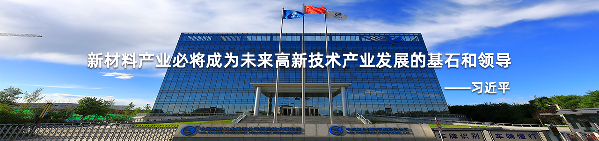
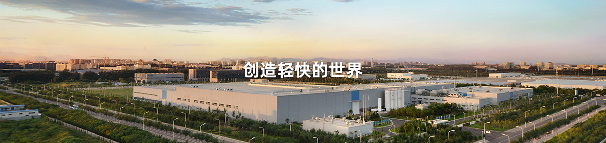
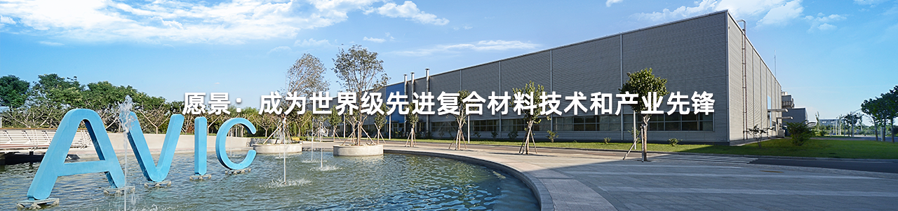

# 航空工业复材

 [!logo.png(images_logo.png)](/) 
 

[首页](/?to=index)

[关于我们](javascript:void(0);)

公司简介
党群工作
企业文化

[新闻中心](templateNewsList?topSectionId=5)

公司动态
行业动态
媒体中心

[业务领域](javascript:void(0);)

先进材料
先进制造
复材无边界

[人才招聘](https://avicomposites.zhiye.com/home)

[首页](/?to=index)

[关于我们](javascript:void(0);)

公司简介
党群工作
企业文化

[新闻中心](templateNewsList?topSectionId=5)

公司动态
行业动态
媒体中心

[业务领域](javascript:void(0);)

先进材料
先进制造
复材无边界

[人才招聘](https://avicomposites.zhiye.com/home)

[首页](http://www.accavic.com)  >   新闻中心

公司动态
行业动态
媒体中心

复合材料如何改变未来飞行
2020-04-11

 

 经过几十年的发展，复合材料在客机上的结构重量日益增加，如今已经开始广泛应用于民用航空制造业，一些先进客机的复合材料重量已经超过金属材料，占其总重量的50%以上，这也成了未来民机在材料选择方面的一种趋势。

 事实上，经过几十年的发展，复合材料在客机上的结构重量日益增加，如今已经开始广泛应用于民用航空制造业。一些先进客机的复合材料重量已经超过金属材料，占其总重量的50%以上，这也成了未来民机在材料选择方面的一种趋势。

 **“新宠”**

 复合材料是指由两种或两种以上不同性质、不同形态的组分通过复合工艺组合而成的一种多相材料，它既保持了原组分材料的主要特点，又显示了原组分材料所没有的新性能，可以通过材料设计使各组分的性能相互补充并彼此联系，从而获得新的优越性能。

 如今，复合材料已经成为航空材料的“新宠”。美国贝奇飞机制造公司曾制造出世界上第一架全复合材料飞机。它使用了耐热性能好的碳纤维层，中间夹有环氧化物。这种复合结构要比目前普遍使用的铝、钢和钛的合金材料轻一半，强度和耐热性几乎相同。正是因为拥有这些优点，世界民机制造巨头波音和空客都在逐步加大复合材料在飞机上的使用比例，并且在复合材料的研发和生产上进行了大量的投入。

 

 波音最新研制的波音787梦想客机所使用的材料中，复合材料占比有很大提升，达到50%，远超过铝所占的20%，其中主要以碳纤维增强型复合材料（CFRP）为主。而波音777中复合材料约占12%，铝占50%。此外，波音747系列的新机型波音747-8洲际客机和747-8货机也应用了很多新技术，其中就包括复合材料的使用。与波音777飞机一样，波音747-8飞机广泛采用新一代铝合金，更重要的是，它还在襟翼、扰流板、短舱和方向舵中采用石墨复合材料。

 波音的竞争对手空客是首家在大型民用飞机上广泛采用复合材料的飞机制造商。在其从事民机制造的近30年来，空客飞机的复合材料结构重量日益增加，从最初的空客A300飞机的不足5%，到空客A380飞机的25%，再到空客A350XWB的53%。空客飞机上第一次实现了复合材料的用量超过了金属材料。空客A350XWB的复合材料、轻金属材料和硬金属材料的比例分别是53%、20%和21%。被称为“空中巨无霸”的空客A380则约有25%由先进轻质复合材料制造，其中22%为碳、玻璃或者石英纤维增强塑料，3%为GLARE（一种玻璃纤维——铝层压板）材料。

 **改变**

 

 复合材料的使用对航空制造业的改变是显而易见的。以波音787为例，其拥有更高的燃油效率，单位碳排放也有所减少，这在很大程度上得益于CFRP的运用。CFRP由塑料基体（环氧树脂）包围的碳纤维组成，树脂对纤维起到了支持和保护的作用，它的密度比铝轻30%，比钢轻50%，吸收碰撞能量的性能极强，在抗腐蚀、疲劳和老化等方面也有上佳表现。

 作为集碳材料强抗拉力和纤维柔软可加工性两大优势于一身的增强纤维，碳纤维的密度不到钢的1/4，但抗拉强度却是钢的10倍。在将碳纤维重叠为纤维层的生产环节中，波音787采用了具有较强韧性的高韧性粒子，强化了在各层之间起到黏合剂作用的基体树脂，大幅加大了飞机尤其是客舱的强度。

 

 其中最引人注目的是碳纤维复合材料机身。波音787独特的一体式复合材料机身桶省去了所有纵向蒙皮拼接件。有业内人士指出，波音787的机身段省去了1500块铝合金钣料零件和4万个~5万个连接件。与传统的板块构造相比，复合材料的使用使得机体结构件尺寸更小，而且更加轻盈和坚固，维修成本也可节省30%。

 这种材料可以像布料一样剪裁，因此新的生产工序制造出的边角余料和废料减少了。现有的飞机主要是铝制的，必须将大片或大块材料碾碎后机器加工，然后用来制造飞机结构。被用来制造飞机零部件的原材料中，通常有90%在生产过程中成为了边角余料。虽然这些材料可以再循环，但尽可能避免浪费无疑是更好的办法。波音787复合材料方案解决了这个效率问题。

 空客A350XWB机型采用的增压型多板式复合材料机体也是航空复合材料在使用方面的一项重大进展和成就，这项技术已在空客A380飞机上得到验证。空客表示，对于运营商而言，复合材料在运营期间不会有腐蚀和疲劳损伤，但对于受到外物撞击（比如鸟撞），除了目视检查外，还须进行额外的详细无损评估（如采用超声波、共振方法），并开展必要的修理。除了运营中的检查需求外，复合材料在制造过程中也采用超声波或X射线等无损检测方法确保产品没有缺陷。为此，空客通过与研究机构的合作，开发出了先进的无损检测方法。

 **未来**

 

 根据全球管理咨询和市场研究公司Lucintel的一份新的市场研究报告，新飞机的巨大需求和复合材料的高渗透率（占结构重量的50%以上）将推动复合材料在航空航天市场的发展。该报告称，复合材料在商业航空、支线飞机、军工、通用航空、直升机以及航空航天市场其他部门的总需求量预计在未来10年将达到418亿美元。

 巨大的需求令世界航空制造巨头们纷纷加大了在复合材料研制和生产方面的投入力度。尤其是在航空业潜力巨大的中国市场，波音和空客通过各种方式，分别设立了复合材料的生产厂房。

 早在1999年建立的天津波音复合材料有限公司（下称“天津波音”）是波音中航工业合资建立的。目前波音持有天津波音88%的股权，中航工业则持有剩余12%的股权。2011年4月，其新厂房正式竣工，使天津波音生产复合材料的产能提高了60%。天津波音为所有波音在产机型生产复合材料零部件，包括波音737、波音747-8、波音767、波音777和波音787。按计划，2013年投入全部产能之时，其月产将达到10000件，复合材料种类增加为850多种。

 

 空客也很快在中国找到了突破口，2009年6月30日，哈尔滨哈飞空客复合材料制造中心新厂房破土动工。新厂房占地超过3万平方米。新厂房建成后，将采用最先进的工艺和设备，生产碳纤维复合材料结构件。2010年7月2日，哈尔滨哈飞空客复合材料制造中心向空中客车西班牙工厂交付首个空客A320飞机升降舵工作包。2011年2月，复合材料制造中心新厂房在哈尔滨市正式落成并投入使用。新厂房将用于空客最新研发项目空客A350XWB部分复合材料零部件的生产制造。

 当然，复合材料也不是万能的。波音和空客通过循序渐进的方法扩大了复合材料在大型民用飞机上的使用范围，同时还兼顾了金属结构件的优点。复合材料并不适用于飞机所有零部件的制造，其优势取决于部件所承受的载荷、应力类型以及部件的位置。空客仍在继续开发先进的超轻型合金。

 （转自：中国碳纤维网）

友情链接

[中国航空工业集团有限公司](http://www.avic.com) [中国航空制造技术研究院](http://www.avicmti.avic.com/) [航空工业成飞](http://cac.avic.com/)
[中国商用飞机有限责任公司](http://www.comac.cc/) [中国航发北京航空材料研究院](http://www.biam.cn) [航空工业哈飞](http://www.hafei.com)
[中国航空发动机集团](http://www.aecc.cn/) [航空工业昌飞](http://www.changhe.com/) [中航沈飞民用飞机有限责任公司](http://www.sacc.com.cn/)

[公司简介](templateNewsList?topSectionId=2) [公司动态](templateNewsList?topSectionId=5&sectionId=6) [人才招聘](https://avicomposites.zhiye.com/home)
[企业文化](templateNewsList?topSectionId=1&sectionId=16) [联系我们](templateNewsList?topSectionId=19)

邮箱：acc@avic.com
地址：北京市顺义区航空产业园
 微信公众号

版权所有：中航复合材料有限责任公司   ICP备案编号:京ICP备19052478号

原文链接：<http://www.acc.avic.com/templateNewsDetail?topSectionId=5&sectionId=7&id=89>
