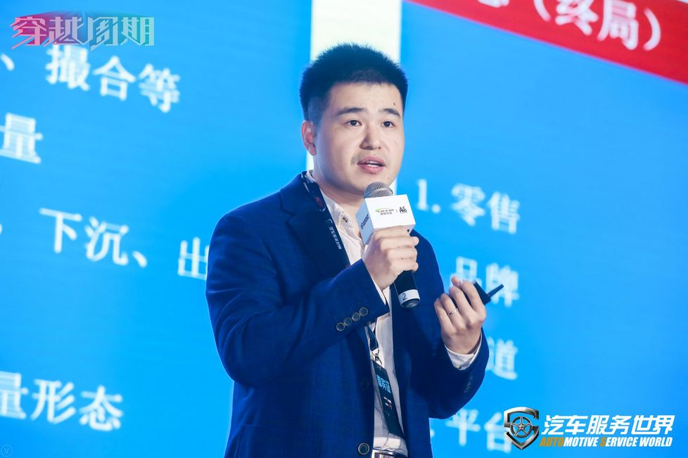
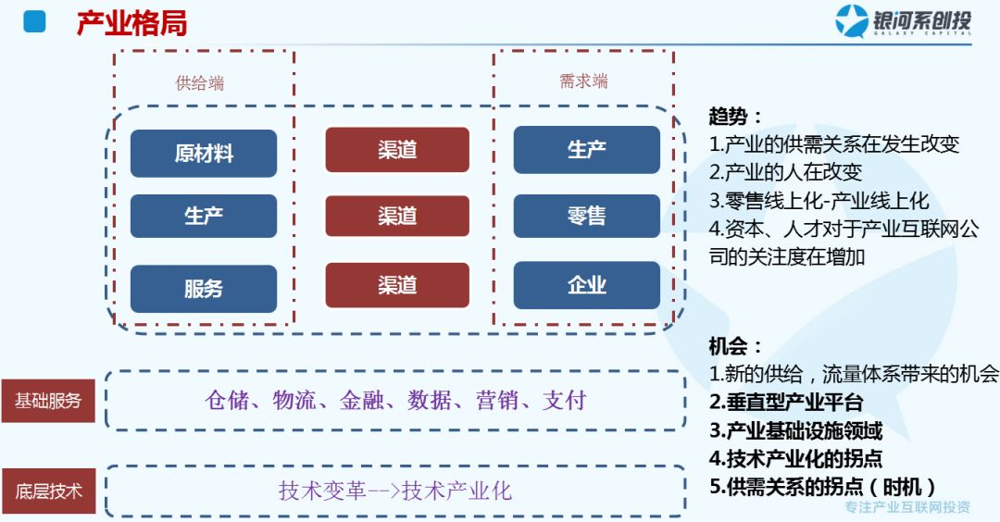

# 银河系创投徐建海：未来十年是产业互联网的黄金十年

     

## 银河系创投徐建海：未来十年是产业互联网的黄金十年

原创 徐建海 [银河系创投](javascript:void(0);)

**银河系创投** 

微信号 galaxycapital\_

功能介绍 银河系创投---B2B via ABC (AI， Big Data，Cloud )

_2019-04-08_

收录于话题

**▲****银河系创投董事总经理 徐建海**

大家好！我是银河系创投的徐建海，银河系创投是一家专注B2B赛道的基金，今天借这个机会和大家分享一下我们对B2B的赛道的理解和思考。

 银河系创投在产业互联网持续布局，也一直在深入研究。广义的B2B赛道，其实是在B端做交易的平台。美国的上市公司里面，2B的公司在市值贡献上面和2C基本上持平，在2B企业中其中有一半是解决公司企业内部的效益问题，另外一半是解决企业外部交易的问题。
 
这类企业，超过百亿美金的公司总共有86家，50亿到100亿美金的公司有62家，10到50亿美金的公司有248家。自从腾讯提出要拥抱产业互联网以来，这两年大家对产业的关注度越来越高，我们觉得看产业还是要回到更宏观的角度来看整个产业的格局和整个产业的效率。

  **渠道的变革来自于供需关系的变革** 

这两年很多行业的供需关系发生了一些明显的变化，有些行业出现了供给过剩的情况，有些行业在慢慢地出现一些新的场景，出现一些爆发式的需求。
 
我们在跟很多行业打交道的时候，发现产业里的人在慢慢地发生变化，产业一线的人已经由原来的60后、70后变成了80后、90后，这帮人可以说是跟着互联网长大的一群人，产业的互联网在跟这样的一群人融合的过程中，发展的速度会非常非常快。
 
互联网发展的那么多年，大家一直在把传统的零售做了线上化。未来的十年，我们觉得一定会发生的一个事情就是产业会慢慢地经历一个线上化的过程。从工厂到大B到小B，未来都会有一个线上化的过程。
 
从去年开始，BAT对于产业互联网公司的关注度变得越来越高，跟我们之间的互动也越来越多，从资本到人才都在慢慢往产业互联网公司转移，这个里面我们自己觉得会有一些比较大的机会点。 

**技术的爆发增长是大势所趋**

  

产业里面核心拐点有两个，一个是供需关系的拐点，一个是技术的爆发及应用的拐点。在一个产业供需关系发生变化的时候，往往就是平台型的公司发展的机会。另外在过去的几十年，中国的很多产业在技术的应用上面，技术的渗透率相对比较低。

  

我们在产业调研的时候发现，所有的产业里面最关注的是技术的成本和人工的成本哪个更低，所以如果说在一个产业里面技术应用成本到了低于员工成本的临界点，技术在产业里面就会得到一个爆发式的增长。

产业里面人工逐年升高，所以我们判断很多底层的技术在产业里面的应用已经是兵临城下，一触即发。汽车产业也是一样，汽配也是到了一个非常重要的点，资本的关注度这两年也是越来越高。

**增量市场依然存在，并有大有可为**

我们分析B2B赛道分两个维度来看，一个是供给端，一个是需求端。从需求端来看增量市场比较少，一个是微信体系带来的流量洼地，这里面有非常多对标小B找到了很多驱动产业增长的场景。另外一个就是下沉市场，4到6线的市场里面很多产业的服务体系和供给体系都还是非常原始的状态。

另一个我们比较关注的就是出海，因为很多产业的生产都聚集在中国，所以在国内的市场竞争白热化的时候，像东南亚、中东等一些新的地区，出现了一些国内的生产商出海的机会，所有能够找到增量市场的场景下，都还存在很多机会。

  

**新兴市场看需求，存量市场看供给**

 我们在做投资的过程中，也经历了很多的思想的转变。最早思考更多的是供货的逻辑，从最上游的钢厂到中端的贸易商，怎么样让供给的效率变高。这两年明显地发现很多产业在发生很多很多的变化，仅仅是产品供给的思路，可能在产业里面是比较难做得深入的。 

这两年有一个大的趋势，除了产品的供给以外，还要有服务的体系，技术解决方案的体系去提供给新的场景。甚至越来越复杂的场景是既需要提供服务的场景，又需要提供产品的供给体系，在提供技术解决方案的同时，去提供产品的解决方案。这是我们自己对供给端的一个思考，未来呈现的形态可能会是一个复杂的既有解决方案，又有服务体系，又有供给产品的多元化的体系。

最后一个点，我们想讲的是产业里面的最终的形态是什么？在不同的产业里面，平台最终形成的业态是有差异的，比如说在汽配体系里，可能最终做成连锁的体系，能够在商业上面、服务上面、上游的供给解决上面提供一个最好的解决方案。 

在其他行业体系里面，比如服装是一个上下游集中度非常低的行业，服装行业的最终业态可能是品牌、连锁的业态。所以不同的行业最终可能要做成不一样的业态。

**存量场景需要一个核心撬动点**  

最后想花点时间来讲讲存量市场，我们被投企业中有一家做车险的公司。很多中心化的平台都在尝试卖车险，后来发现车险的销售渠道大部分还是在去中心化的线下场景里。 

我们的被投企业是给线下卖车险的小B提供了一个系统，一端对接保险公司，一端对接给线下卖车险的小B。这些小B本来就在卖车险，想通过你的产品去撬动小B，需要有一个核心的撬动点。他们给小B提供的产品就是不同的车险公司的接口，小B可以在这个平台上查到不同保险公司的返点金额。

对于小B来讲，他们有点像一个有返点的“去哪儿”，但是对于整个平台，他解决的是保险公司和线下小B销售场景之中的支付、结算、返佣的一整个平台的体系。

 存量体系里面怎么样去做市场呢？最好的方式是在存量的场景里面，找到一个撬动点，把存量场景里面的流量也和需求，通过某个产品的支点去快速地撬动到你的平台上来。
 
关于存量市场大家一直有个误区，认为存量市场做得慢，竞争激烈。这两年我们投了一些在存量市场里，通过一些方法去快速增长的公司，存量的公司也可以做得非常快，核心是要找到存量的市场里面的撬动支点，核心支点帮助你撬动场景里面的小B、大B，去解决他们经营的问题，帮助这些场景端的B端去挣到更多的钱。

**好的产业公司是让你的所有合作伙伴都获利**

 在车后的市场里面，我们也看过很多去帮终端的汽修店赋能的公司，我们觉得未来的赋能是一个全方位的赋能，我们内部把它称之为一个管家式的赋能，你要去帮助他做到更好的经营，你要从经营的角度去考虑他的诉求。
 
评判产业里的企业的标准，还是要回归到产业的维度上。要看这家公司的存在是不是使产业的效率变得更高。真正好的产业的公司其实应该是让你所有的合作伙伴都能够跟你在合作中获得更多利益。 

**B2B赛道的大好时机：未来黄金十年**

 尽管很多市场都慢慢地进入到了存量市场，但是我们其实还是更喜欢增量市场，因为增量市场的增长会比较快。除了要找到增量的场景，更重要的是能够提供一种适合这种增量场景的供给的方式，所以我们这两年看得比较多的就是下沉市场，下沉市场中一些场景增长速度非常快。
 
我们投了很多B2B的公司，明显感受到这两年从人才到资本，都在越来越多关注产业互联网的公司，所以我们相信未来的十年，整个产业互联网，会迎来最黄金的十年。所以也希望在座的各位能够一起在未来的十年精耕细作，共同创造产业互联网的辉煌时代，谢谢大家！

▼▼▼

银河系创投主要投资中早期B2B项目，包括建材家装、冷冻生鲜、汽车后市场、医疗健康、工业品等领域的To B项目。我们在早期投资或创业的成功案例，包括找钢网、汇通达、孩子王、时空电动、康众汽配、找油网、贝登医疗等。银河系创投LP构成为一线投资人和知名母基金。

预览时标签不可点

收录于话题 #
个
上一篇 下一篇

阅读

分享 收藏
赞 在看

已同步到看一看[写下你的想法](javascript:;)

前往“发现”-“看一看”浏览“朋友在看”

前往看一看

**看一看入口已关闭**
在“设置”-“通用”-“发现页管理”打开“看一看”入口
[我知道了](javascript:;)

已发送

取消

#### 发送到看一看

发送

银河系创投徐建海：未来十年是产业互联网的黄金十年

最多200字，当前共字

发送中

喜欢此内容的人还喜欢

微信扫一扫
关注该公众号

 微信扫一扫
使用小程序

[取消](javascript:void(0);) [允许](javascript:void(0);)

[取消](javascript:void(0);) [允许](javascript:void(0);)

[知道了](javascript:;)

**长按识别前往小程序**

原文链接：<https://mp.weixin.qq.com/s/hh_TVuN6L4263cOyzye7Rw>
