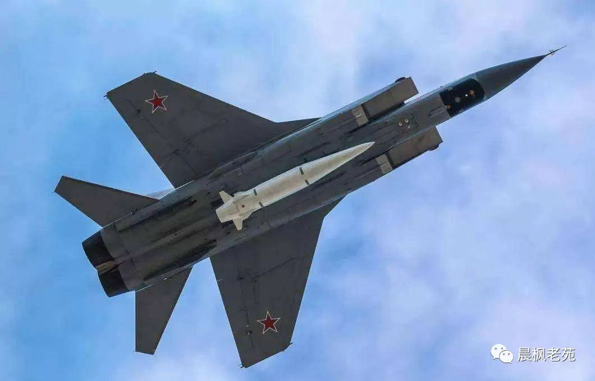
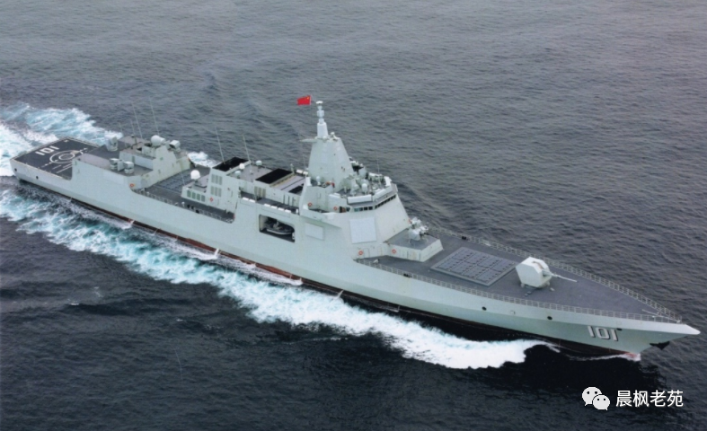
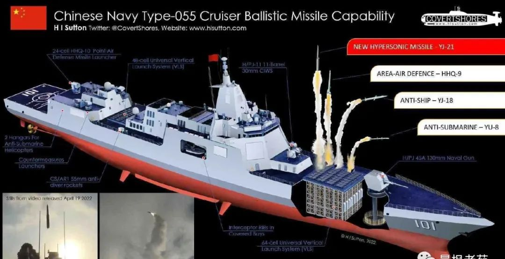

# 鹰击21，高超反舰弹的重大意义

坊间流传一段视频，**据说这是鹰击21高超音速反舰导弹在055上发射**，这是世界首创，具有不凡的意义。

中国高超技术世界领先，这已经不是秘密了，秘密在于到底领先多少。俄罗斯的“伊斯坎德尔”为基础的“匕首”实际上是具有末端机动能力的压平弹道的弹道导弹，**算入高超弹是勉强的**。高超弹好比飞机，有很强的持续机动能力，哪怕是助推-滑翔的高超弹，横向机动能力也非带末端机动能力的弹道导弹可比。

高超弹与一般导弹的主要差别在于升阻比。**_升阻比不仅是利用气动升力高效巡航和滑翔的关键，也是机动性的基础_**。大幅度机动是掉升力的，升阻比越高，越容易恢复正常飞行，否则就要靠kou额外动力硬推了。这就是为什么高机动的战斗机需要高升力的气动构型和高推重比的道理。
高超弹的升阻比较高，可以长时间依靠气动升力巡航或者滑翔，还有强大的机动性。一般导弹的升阻比很糟糕。弹道导弹靠在大气层外飞行得到很大的射程，代价是弹道中段基本上不具备机动能力，再入后也只有有限的机动能力。巡航导弹有小弹翼，升阻比高一些，但也只够维持巡航，大幅度机动靠超强动力硬推，包括用直接侧力控制，代价是难以为继。导弹打飞机时，能量差太大，飞机的持续机动能力还没有发挥出来就被打掉了。打高超弹时，能量差没有多少，而对方的能量恢复更好，三下两下就被甩掉了。因此，高超弹很难拦截。
对于突防的导弹，机动很重要。在中段，这是迷惑对手的主要手段，弹道不可预测，进入方向不能确定，反导就只有根据最后的情况见招拆招，窗口极大地缩小，反导成功率极大地降低。在末段，哪怕是按照预设程序的假动作机动，也将极大增加拦截困难。同时，机动能力较强是确保命中精度的本钱，否则制导系统再精巧也是白搭。
高超音速下的稳态飞行已经是很大的挑战，机动的难度就可想而知了。美国之所以在海陆通用的CHGB导弹采用旋成体，而不是升阻比更高的乘波体，就是还没有解决高超气动问题。空军的AGM-183倒是乘波体，但屡败屡战后，还没有正经飞过，谁也说不清高超气动问题是解决了，还是没解决。

这些都是针对固定目标的导弹，中国早解决了，国庆70周年阅兵上展示的东风17就是，而且是显而易见的乘波体。现在中国又进了一步，推出鹰击21，这是针对海上机动的大型舰船的，技术难度增加了一个等级。
相对于高超弹的速度和机动性，航母的速度和机动性都不足为虑，但目标捕获和精确制导的挑战提高了。据说鹰击21的舰射射程为1000公里，空射（从轰-6N发射）则提高到1500公里。以M6飞行，1000公里约需8分钟，1500公里约12分钟。在这段时间里，以30节速度航线的航母可前行约8公里。射程才200公里的高亚音速反舰导弹也需要这些时间飞完全程， 在末段捕获目标没有问题，但高超但具有完全不同的挑战。

  还没完！休息5秒钟，插播一则广告  

**《航空知识》2022年度订阅**

**火爆预售中！**

<http://55936352.m.weimob.com/vshop/55936352/Goods/GoodsDetailNew1?id=1737486>****[点击此处 立即预定](http://55936352.m.weimob.com/vshop/55936352/Goods/GoodsDetailNew1?id=1737486)****

**
**

****订阅享福利！****
****《航空知识》全年12期，每期快递送到您家****
******现在订阅即赠：******
******1、国产军机挂饰1个（款式随机 不可指定）******
******2、《问天少年》2022年1期（创刊号）1册******

**2掠海飞行的反舰导弹在末段搜寻目标舰船在水天线上的剪影，容易发现。高超弹从高空大角度进入，海面杂波就是大问题。另一个问题是黑障。宇宙飞船再入时，有一段时间会完全丧失无线电通信，就是因为飞行器被再入时与空气的摩擦生热造成的等离子体包覆，隔断了无线电信号。高超弹的速度达不到完全黑障的程度，但已经有影响了。有过带着被汗污模糊的眼镜努力看清昏暗中的树林的经历吗，想象一下雷达在这样的情况下工作吧。**
**中国已经发表了大量高超条件下的观察通信研究的公开论文，鹰击21上就是把公开和不公开的研究付诸应用的时候了。**
**另一个问题是命中精度。弹道导弹达到50米的圆概率误差就算不错的，但精确命中航母还需要提高一个数量级。固定目标只有命中精度问题，机动目标还有瞄准精度问题，也就是制导系统报告的目标方位与实际目标方位的误差。最后的实际命中概率是两者的叠加。高超条件下探测技术的非理想工作条件就不可忽略了。**
**视频图像只能看出鹰击21 是两级导弹，符合一般的助推-滑翔弹构型。能看到第二级后部有小型弹翼，看不出更多的细节，猜测的话，鹰击21应该采用的也是乘波体。**
**
**
**有人猜测鹰击21只是反舰弹道导弹，甚至是东风21D的某种缩小型。这个可能性不是不存在，鹰击21的两级外形也符合一般的两级弹道导弹的外形，但意义不大，或者说只是过渡的。**
**东风21D的射程达到1500公里，东风26则达到4000公里。中国通过实射向世界证明了所言非虚，美国海军早就在努力研究反制手段，现有的宙斯盾雷达和标准3导弹就是基础。弹道导弹难以拦截，但不是不可能拦截。假日时日，美国海军将具有初步能力。在这样的情况下，鹰击21要是射程1000公里的弹道导弹，就意义不大邪恶。**
**弹道导弹的速度随射程增加，射程缩短后，再入时的加速也减少，便于末段拦截。同时，射程较短的弹道导弹的中段速度也更低，便于中段拦截。如果美国海军已经在全力研发针对东风21D和东风26的反导能力，再加一个相对容易拦截的鹰击21就没有道理了，最多也只是过渡的。从导弹来说，第一级是助推级，弹道弹还是高超弹没有什么差别，条件成熟后，过渡到高超弹不难。但鹰击21为一步到位的高超弹的话，就是东风21D和东风26的绝好补充，与传统反舰导弹三管齐下，对美国航母构成不可抗拒的挑战。**
**同时，反舰导弹和陆攻导弹是近亲，鹰击21改为陆攻是分分钟的事。这使得中国的高端战役打击力量随着055大幅度推延到更远的远方，这是积极防御的必须。积极防御从来就不是坐等在家里等敌人打上门。如果鹰击21能与新一代的潜艇整合，意义就更大了。**
**055本来就是世界上最强大的驱逐舰之一，西方直接称之为巡洋舰。装备鹰击21后，055的海上控制范围更大真正是航母杀手了。**
**055可以与倒霉的“莫斯科”号相比。两者吨位差不多，但即使不比较星辰大海级差距的电子和信息系统，055的武器系统也是代差级领先。所有主要武器都在甲板下的垂发弹舱内，重心低，易于损管。这也是冷热发射通用的。**
**从鹰击21升空时尾焰较小判断，这是冷发射的。红旗9防空导弹也是冷发射的。但有导弹需要热发射也没问题，都准备好了。**
**“莫斯科”号的P-1000反舰导弹堆放在两舷甲板上，尽管被击中后的殉爆不是沉没的原因，但可能性还是很大的。“莫斯科”号的转轮式冷垂发也是S300F专用的，不像055的可以冷热通用，还可以一坑四弹，合理搭配火力配系。**
**055已经装备的鹰击18除了个头比不上P-1000，射程和突防能力都相当。加上鹰击21后，就绝尘而去了。**
**实际上，配备鹰击21后，055或许可算世界上最强大的水面战舰，具有最强大的反舰能力和最均衡的海空攻防能力。中国曾经有过强大的水面战舰，那是买来的“定远”号和“镇远”号。刘步蟾、邓世昌要是再世，会欣慰的。**
**
**
**本文转载自公众号：晨枫老苑**
**注：本文系网络转载，版权归原作者所有。仅此标明转载来源，如涉及作品版权问题，请与我们联系，我们将在第一时间协商或删除内容！**
**
**

**

风上风云｜云端故事

**

**
**

**
****望您读后可以顺手点亮"********赞******"******在看************"****！****
**

**
**
